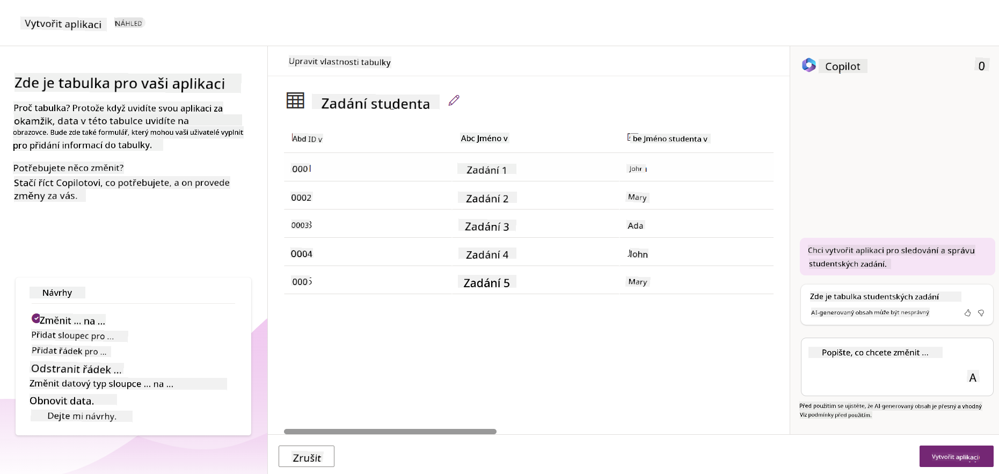
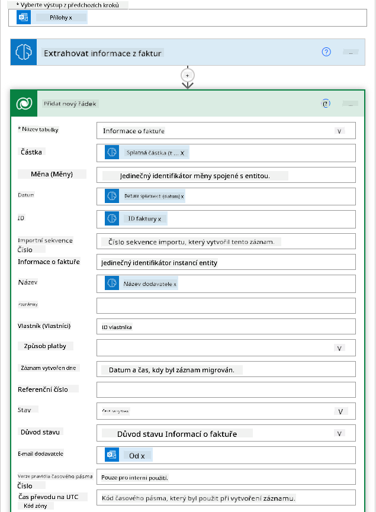

<!--
CO_OP_TRANSLATOR_METADATA:
{
  "original_hash": "f5ff3b6204a695a117d6f452403c95f7",
  "translation_date": "2025-07-09T14:11:38+00:00",
  "source_file": "10-building-low-code-ai-applications/README.md",
  "language_code": "cs"
}
-->
# Tvorba Low Code AI aplikací

> _(Klikněte na obrázek výše pro zhlédnutí videa této lekce)_

## Úvod

Nyní, když jsme se naučili, jak vytvářet aplikace generující obrázky, pojďme si povědět o low code. Generativní AI lze využít v různých oblastech včetně low code, ale co vlastně low code znamená a jak do něj můžeme přidat AI?

Tvorba aplikací a řešení se díky Low Code Development Platformám stala jednodušší jak pro tradiční vývojáře, tak i pro neprogramátory. Low Code Development Platformy umožňují vytvářet aplikace a řešení s minimem nebo bez nutnosti psaní kódu. Toho je dosaženo díky vizuálnímu vývojovému prostředí, kde můžete přetahovat komponenty a sestavovat aplikace a řešení. Díky tomu můžete aplikace a řešení vytvářet rychleji a s menšími náklady. V této lekci se podrobně podíváme na to, jak používat Low Code a jak ho vylepšit pomocí AI s využitím Power Platform.

Power Platform dává organizacím možnost posílit jejich týmy, aby si mohly samy vytvářet vlastní řešení v intuitivním low-code nebo no-code prostředí. Toto prostředí zjednodušuje proces tvorby řešení. Díky Power Platform lze řešení vytvořit během dnů nebo týdnů místo měsíců či let. Power Platform se skládá z pěti klíčových produktů: Power Apps, Power Automate, Power BI, Power Pages a Copilot Studio.

Tato lekce pokrývá:

- Úvod do Generativní AI v Power Platform
- Úvod do Copilota a jak ho používat
- Použití Generativní AI k tvorbě aplikací a toků v Power Platform
- Pochopení AI modelů v Power Platform s AI Builderem

## Cíle učení

Na konci této lekce budete schopni:

- Pochopit, jak Copilot funguje v Power Platform.

- Vytvořit aplikaci Student Assignment Tracker pro náš vzdělávací startup.

- Vytvořit tok pro zpracování faktur, který využívá AI k extrakci informací z faktur.

- Aplikovat osvědčené postupy při používání Create Text s GPT AI modelem.

Nástroje a technologie, které v této lekci použijete, jsou:

- **Power Apps**, pro aplikaci Student Assignment Tracker, která poskytuje low-code vývojové prostředí pro tvorbu aplikací ke sledování, správě a práci s daty.

- **Dataverse**, pro ukládání dat aplikace Student Assignment Tracker, kde Dataverse poskytne low-code datovou platformu pro ukládání dat aplikace.

- **Power Automate**, pro tok zpracování faktur, kde budete mít low-code prostředí pro tvorbu pracovních toků k automatizaci procesu zpracování faktur.

- **AI Builder**, pro AI model zpracování faktur, kde využijete předpřipravené AI modely k zpracování faktur pro náš startup.

## Generativní AI v Power Platform

Vylepšení low-code vývoje a aplikací pomocí generativní AI je klíčovou oblastí zaměření Power Platform. Cílem je umožnit každému vytvářet aplikace, weby, dashboardy a automatizovat procesy s AI, _aniž by bylo potřeba mít znalosti datové vědy_. Tento cíl je dosažen integrací generativní AI do low-code vývojového prostředí Power Platform ve formě Copilota a AI Builderu.

### Jak to funguje?

Copilot je AI asistent, který vám umožní vytvářet řešení v Power Platform tím, že popíšete své požadavky v sérii konverzačních kroků pomocí přirozeného jazyka. Můžete například říct svému AI asistentovi, jaká pole má vaše aplikace používat, a on vytvoří jak aplikaci, tak i podkladový datový model, nebo můžete specifikovat, jak nastavit tok v Power Automate.

Funkce řízené Copilotem můžete použít jako prvek ve vašich obrazovkách aplikace, aby uživatelé mohli získávat poznatky prostřednictvím konverzačních interakcí.

AI Builder je low-code AI nástroj dostupný v Power Platform, který vám umožní využívat AI modely k automatizaci procesů a předpovídání výsledků. S AI Builderem můžete přinést AI do svých aplikací a toků, které se připojují k datům v Dataverse nebo v různých cloudových datových zdrojích, jako jsou SharePoint, OneDrive nebo Azure.

Copilot je dostupný ve všech produktech Power Platform: Power Apps, Power Automate, Power BI, Power Pages a Power Virtual Agents. AI Builder je dostupný v Power Apps a Power Automate. V této lekci se zaměříme na to, jak používat Copilot a AI Builder v Power Apps a Power Automate k vytvoření řešení pro náš vzdělávací startup.

### Copilot v Power Apps

Jako součást Power Platform poskytuje Power Apps low-code vývojové prostředí pro tvorbu aplikací ke sledování, správě a práci s daty. Je to sada služeb pro vývoj aplikací s škálovatelnou datovou platformou a možností připojení ke cloudovým službám i lokálním datům. Power Apps umožňuje vytvářet aplikace, které běží v prohlížečích, na tabletech a telefonech, a lze je sdílet s kolegy. Power Apps usnadňuje uživatelům vstup do vývoje aplikací díky jednoduchému rozhraní, takže každý obchodní uživatel nebo profesionální vývojář může vytvářet vlastní aplikace. Vývoj aplikací je také vylepšen generativní AI prostřednictvím Copilota.

Funkce AI asistenta Copilot v Power Apps vám umožní popsat, jaký typ aplikace potřebujete a jaké informace má aplikace sledovat, sbírat nebo zobrazovat. Copilot pak na základě vašeho popisu vygeneruje responzivní Canvas aplikaci. Aplikaci si pak můžete přizpůsobit podle svých potřeb. AI Copilot také vytvoří a navrhne Dataverse tabulku s poli, která potřebujete pro ukládání dat, která chcete sledovat, a přidá i ukázková data. V této lekci si později ukážeme, co je Dataverse a jak ho v Power Apps využít. Tabulku pak můžete upravit podle svých potřeb pomocí AI Copilot asistenta v konverzačních krocích. Tato funkce je snadno dostupná z úvodní obrazovky Power Apps.

### Copilot v Power Automate

Jako součást Power Platform umožňuje Power Automate uživatelům vytvářet automatizované pracovní toky mezi aplikacemi a službami. Pomáhá automatizovat opakující se obchodní procesy, jako je komunikace, sběr dat a schvalování rozhodnutí. Jeho jednoduché rozhraní umožňuje uživatelům s různou technickou úrovní (od začátečníků po zkušené vývojáře) automatizovat pracovní úkoly. Vývoj pracovních toků je také vylepšen generativní AI prostřednictvím Copilota.

Funkce AI asistenta Copilot v Power Automate vám umožní popsat, jaký tok potřebujete a jaké akce má tok vykonávat. Copilot pak na základě vašeho popisu vygeneruje tok. Tok si pak můžete přizpůsobit podle svých potřeb. AI Copilot také vytvoří a navrhne akce, které potřebujete k automatizaci požadovaného úkolu. V této lekci si později ukážeme, co jsou to toky a jak je v Power Automate používat. Akce pak můžete upravit podle svých potřeb pomocí AI Copilot asistenta v konverzačních krocích. Tato funkce je snadno dostupná z úvodní obrazovky Power Automate.

## Zadání: Správa studentských úkolů a faktur pro náš startup pomocí Copilota

Náš startup poskytuje online kurzy studentům. Startup rychle rostl a nyní má problém držet krok s poptávkou po svých kurzech. Najali vás jako vývojáře Power Platform, abyste jim pomohli vytvořit low code řešení pro správu studentských úkolů a faktur. Jejich řešení by mělo umožnit sledovat a spravovat studentské úkoly prostřednictvím aplikace a automatizovat proces zpracování faktur pomocí pracovního toku. Byli jste požádáni, abyste při vývoji řešení využili Generativní AI.

Když začínáte s používáním Copilota, můžete využít [Power Platform Copilot Prompt Library](https://github.com/pnp/powerplatform-prompts?WT.mc_id=academic-109639-somelezediko), která obsahuje seznam promptů, jež můžete použít k tvorbě aplikací a toků s Copilotem. Prompt knihovna vám také pomůže získat představu, jak popsat své požadavky Copilotovi.

### Vytvoření aplikace Student Assignment Tracker pro náš startup

Pedagogové v našem startupu měli problém sledovat studentské úkoly. Používali tabulku, ale jak počet studentů rostl, stalo se to obtížně spravovatelným. Požádali vás, abyste vytvořili aplikaci, která jim pomůže sledovat a spravovat studentské úkoly. Aplikace by měla umožnit přidávat nové úkoly, zobrazovat je, aktualizovat a mazat. Aplikace by také měla umožnit pedagogům a studentům zobrazit úkoly, které byly ohodnoceny, a ty, které ještě ne.

Aplikaci vytvoříte pomocí Copilota v Power Apps podle následujících kroků:

1. Přejděte na [Power Apps](https://make.powerapps.com?WT.mc_id=academic-105485-koreyst) úvodní obrazovku.

1. Použijte textové pole na úvodní obrazovce k popisu aplikace, kterou chcete vytvořit. Například **_Chci vytvořit aplikaci pro sledování a správu studentských úkolů_**. Klikněte na tlačítko **Odeslat** pro odeslání promptu AI Copilotovi.

1. AI Copilot navrhne Dataverse tabulku s poli, která potřebujete pro ukládání dat, která chcete sledovat, a přidá i ukázková data. Tabulku pak můžete upravit podle svých potřeb pomocí AI Copilot asistenta v konverzačních krocích.

   > **Důležité**: Dataverse je podkladová datová platforma pro Power Platform. Je to low-code datová platforma pro ukládání dat aplikace. Jedná se o plně spravovanou službu, která bezpečně ukládá data v Microsoft Cloudu a je nasazena ve vašem prostředí Power Platform. Obsahuje vestavěné funkce správy dat, jako je klasifikace dat, sledování původu dat, jemné řízení přístupu a další. Více o Dataverse se můžete dozvědět [zde](https://docs.microsoft.com/powerapps/maker/data-platform/data-platform-intro?WT.mc_id=academic-109639-somelezediko).

   

1. Pedagogové chtějí posílat e-maily studentům, kteří odevzdali své úkoly, aby je informovali o průběhu hodnocení. Pomocí Copilota můžete přidat nové pole do tabulky pro uložení e-mailu studenta. Například můžete použít tento prompt: **_Chci přidat sloupec pro uložení e-mailu studenta_**. Klikněte na tlačítko **Odeslat** pro odeslání promptu AI Copilotovi.

1. AI Copilot vytvoří nové pole, které pak můžete upravit podle svých potřeb.

1. Jakmile dokončíte tabulku, klikněte na tlačítko **Vytvořit aplikaci** pro vytvoření aplikace.

1. AI Copilot vygeneruje responzivní Canvas aplikaci na základě vašeho popisu. Aplikaci si pak můžete přizpůsobit podle svých potřeb.

1. Aby pedagogové mohli posílat e-maily studentům, můžete pomocí Copilota přidat novou obrazovku do aplikace. Například můžete použít tento prompt: **_Chci přidat obrazovku pro odesílání e-mailů studentům_**. Klikněte na tlačítko **Odeslat** pro odeslání promptu AI Copilotovi.

1. AI Copilot vytvoří novou obrazovku, kterou pak můžete upravit podle svých potřeb.

1. Jakmile dokončíte aplikaci, klikněte na tlačítko **Uložit** pro uložení aplikace.

1. Pro sdílení aplikace s pedagogy klikněte na tlačítko **Sdílet** a poté znovu na **Sdílet**. Aplikaci pak můžete sdílet zadáním jejich e-mailových adres.

> **Domácí úkol**: Aplikace, kterou jste právě vytvořili, je dobrý začátek, ale dá se vylepšit. Díky funkci e-mailů mohou pedagogové posílat e-maily studentům pouze ručně, kdy musí zadávat jejich e-maily. Dokážete pomocí Copilota vytvořit automatizaci, která umožní pedagogům automaticky odesílat e-maily studentům, jakmile odevzdají své úkoly? Nápovědou je, že s vhodným promptem můžete použít Copilota v Power Automate k vytvoření tohoto.

### Vytvoření tabulky informací o fakturách pro náš startup

Finanční tým našeho startupu měl problém sledovat faktury. Používali tabulku, ale jak počet faktur rostl, stalo se to obtížně spravovatelným. Požádali vás, abyste vytvořili tabulku, která jim pomůže ukládat, sledovat a spravovat informace o přijatých fakturách. Tabulka by měla sloužit k vytvoření automatizace, která extrahuje všechny informace z faktur a uloží je do tabulky. Tabulka by také měla umožnit finančnímu týmu zobrazit faktury, které byly zaplaceny, a ty, které ještě ne.

Power Platform má podkladovou datovou platformu nazvanou Dataverse, která vám umožňuje ukládat data pro vaše aplikace a řešení. Dataverse poskytuje low-code datovou platformu pro ukládání dat aplikace. Jedná se o plně spravovanou službu, která bezpečně ukládá data v Microsoft Cloudu a je nasazena ve vašem prostředí Power Platform. Obsahuje vestavěné funkce správy dat, jako je klasifikace dat, sledování původu dat, jemné řízení přístupu a další. Více o Dataverse se můžete dozvědět [zde](https://docs.microsoft.com/powerapps/maker/data-platform/data-platform-intro?WT.mc_id=academic-109639-somelezediko).

Proč bychom měli pro náš startup používat Dataverse? Standardní a vlastní tabulky v Dataverse poskytují bezpečné a cloudové úložiště pro vaše data. Tabulky vám umožňují ukládat různé typy dat, podobně jako byste používali více listů v jednom Excelovém sešitu. Tabulky můžete využít k ukládání dat specifických pro vaši organizaci nebo obchodní potřeby. Některé z výhod, které náš startup získá používáním Dataverse, zahrnují, ale nejsou omezeny na:
- **Snadná správa**: Metadata i data jsou uložena v cloudu, takže se nemusíte starat o detaily jejich ukládání nebo správy. Můžete se soustředit na tvorbu svých aplikací a řešení.

- **Bezpečné**: Dataverse nabízí bezpečné cloudové úložiště pro vaše data. Můžete kontrolovat, kdo má přístup k datům v tabulkách a jakým způsobem k nim přistupuje pomocí zabezpečení založeného na rolích.

- **Bohatá metadata**: Datové typy a vztahy jsou přímo využívány v Power Apps.

- **Logika a validace**: Můžete použít obchodní pravidla, vypočítávaná pole a validační pravidla k prosazení obchodní logiky a udržení přesnosti dat.

Nyní, když víte, co je Dataverse a proč ho používat, podívejme se, jak můžete využít Copilot k vytvoření tabulky v Dataverse, která splní požadavky našeho finančního týmu.

> **Note** : Tuto tabulku použijete v další části k vytvoření automatizace, která extrahuje všechny informace z faktur a uloží je do tabulky.

Pro vytvoření tabulky v Dataverse pomocí Copilota postupujte podle následujících kroků:

1. Přejděte na domovskou obrazovku [Power Apps](https://make.powerapps.com?WT.mc_id=academic-105485-koreyst).

2. V levém navigačním panelu vyberte **Tables** a poté klikněte na **Describe the new Table**.

3. Na obrazovce **Describe the new Table** použijte textové pole k popisu tabulky, kterou chcete vytvořit. Například **_Chci vytvořit tabulku pro ukládání informací o fakturách_**. Klikněte na tlačítko **Send** pro odeslání požadavku AI Copilotovi.

4. AI Copilot navrhne Dataverse tabulku s poli, která potřebujete pro ukládání sledovaných dat, a také s ukázkovými daty. Tabulku pak můžete přizpůsobit podle svých potřeb pomocí asistenta AI Copilota prostřednictvím konverzačních kroků.

5. Finanční tým chce posílat e-maily dodavatelům, aby je informoval o aktuálním stavu jejich faktur. Pomocí Copilota můžete do tabulky přidat nové pole pro uložení e-mailu dodavatele. Například můžete použít následující požadavek: **_Chci přidat sloupec pro uložení e-mailu dodavatele_**. Klikněte na tlačítko **Send** pro odeslání požadavku AI Copilotovi.

6. AI Copilot vygeneruje nové pole, které pak můžete upravit podle svých potřeb.

7. Po dokončení tabulky klikněte na tlačítko **Create** pro vytvoření tabulky.

## AI modely v Power Platform s AI Builder

AI Builder je nízkokódová AI funkce dostupná v Power Platform, která vám umožňuje využívat AI modely k automatizaci procesů a předpovídání výsledků. S AI Builderem můžete do svých aplikací a toků přinést umělou inteligenci, která pracuje s daty v Dataverse nebo v různých cloudových datových zdrojích, jako jsou SharePoint, OneDrive nebo Azure.

## Předpřipravené AI modely vs vlastní AI modely

AI Builder nabízí dva typy AI modelů: Předpřipravené AI modely a Vlastní AI modely. Předpřipravené AI modely jsou hotové modely vytrénované společností Microsoft a dostupné v Power Platform. Pomáhají vám přidat inteligenci do vašich aplikací a toků bez nutnosti sbírat data, stavět, trénovat a publikovat vlastní modely. Tyto modely můžete využít k automatizaci procesů a předpovídání výsledků.

Některé z předpřipravených AI modelů dostupných v Power Platform zahrnují:

- **Key Phrase Extraction**: Tento model extrahuje klíčové fráze z textu.
- **Language Detection**: Tento model rozpozná jazyk textu.
- **Sentiment Analysis**: Tento model detekuje pozitivní, negativní, neutrální nebo smíšený sentiment v textu.
- **Business Card Reader**: Tento model extrahuje informace z vizitek.
- **Text Recognition**: Tento model extrahuje text z obrázků.
- **Object Detection**: Tento model detekuje a extrahuje objekty z obrázků.
- **Document processing**: Tento model extrahuje informace z formulářů.
- **Invoice Processing**: Tento model extrahuje informace z faktur.

S vlastními AI modely můžete do AI Builderu přinést svůj vlastní model, který pak funguje jako jakýkoli jiný vlastní model AI Builderu a umožňuje vám trénovat model na vašich vlastních datech. Tyto modely můžete využít k automatizaci procesů a předpovídání výsledků jak v Power Apps, tak v Power Automate. Při použití vlastního modelu platí určitá omezení. Více informací o těchto [omezeních](https://learn.microsoft.com/ai-builder/byo-model#limitations?WT.mc_id=academic-105485-koreyst).

## Zadání #2 - Vytvořte tok pro zpracování faktur pro náš startup

Finanční tým měl problémy se zpracováním faktur. Používali tabulku pro sledování faktur, ale s rostoucím počtem faktur se to stalo obtížně spravovatelným. Požádali vás o vytvoření workflow, které jim pomůže zpracovávat faktury pomocí AI. Workflow by mělo umožnit extrahovat informace z faktur a uložit je do tabulky v Dataverse. Také by mělo umožnit odeslat e-mail finančnímu týmu s extrahovanými informacemi.

Nyní, když víte, co je AI Builder a proč ho používat, podívejme se, jak můžete využít AI model Invoice Processing v AI Builderu, který jsme si již představili, k vytvoření workflow, které pomůže finančnímu týmu zpracovávat faktury.

Pro vytvoření workflow, které pomůže finančnímu týmu zpracovávat faktury pomocí AI modelu Invoice Processing v AI Builderu, postupujte podle následujících kroků:

1. Přejděte na domovskou obrazovku [Power Automate](https://make.powerautomate.com?WT.mc_id=academic-105485-koreyst).

2. Použijte textové pole na domovské obrazovce k popisu workflow, které chcete vytvořit. Například **_Zpracovat fakturu, když dorazí do mé schránky_**. Klikněte na tlačítko **Send** pro odeslání požadavku AI Copilotovi.

   

3. AI Copilot navrhne akce, které potřebujete k automatizaci požadovaného úkolu. Můžete kliknout na tlačítko **Next** a projít další kroky.

4. V dalším kroku vás Power Automate vyzve k nastavení připojení potřebných pro tok. Po dokončení klikněte na tlačítko **Create flow** pro vytvoření toku.

5. AI Copilot vygeneruje tok, který pak můžete přizpůsobit podle svých potřeb.

6. Aktualizujte spouštěč toku a nastavte **Folder** na složku, kde budou faktury ukládány. Například můžete nastavit složku na **Inbox**. Klikněte na **Show advanced options** a nastavte **Only with Attachments** na **Yes**. Tím zajistíte, že tok poběží pouze při přijetí e-mailu s přílohou ve vybrané složce.

7. Odstraňte z toku následující akce: **HTML to text**, **Compose**, **Compose 2**, **Compose 3** a **Compose 4**, protože je nebudete používat.

8. Odstraňte akci **Condition**, protože ji nebudete používat. Tok by měl vypadat jako na následujícím obrázku:

   

9. Klikněte na tlačítko **Add an action** a vyhledejte **Dataverse**. Vyberte akci **Add a new row**.

10. V akci **Extract Information from invoices** aktualizujte pole **Invoice File** tak, aby odkazovalo na **Attachment Content** z e-mailu. Tím zajistíte, že tok extrahuje informace z přílohy faktury.

11. Vyberte tabulku, kterou jste vytvořili dříve. Například můžete vybrat tabulku **Invoice Information**. Vyberte dynamický obsah z předchozí akce pro vyplnění následujících polí:

    - ID
    - Amount
    - Date
    - Name
    - Status - Nastavte **Status** na **Pending**.
    - Supplier Email - Použijte dynamický obsah **From** ze spouštěče **When a new email arrives**.

    

12. Po dokončení toku klikněte na tlačítko **Save** pro uložení toku. Tok můžete otestovat odesláním e-mailu s fakturou do složky, kterou jste nastavili ve spouštěči.

> **Domácí úkol**: Tok, který jste právě vytvořili, je dobrý začátek. Nyní přemýšlejte, jak můžete vytvořit automatizaci, která umožní našemu finančnímu týmu posílat e-maily dodavatelům s aktuálním stavem jejich faktur. Nápověda: tok musí běžet při změně stavu faktury.

## Použití AI modelu pro generování textu v Power Automate

AI model Create Text with GPT v AI Builderu vám umožňuje generovat text na základě zadaného promptu a je poháněn službou Microsoft Azure OpenAI Service. Díky této funkci můžete do svých aplikací a toků začlenit technologii GPT (Generative Pre-Trained Transformer) a vytvářet různé automatizované toky a užitečné aplikace.

Modely GPT jsou trénovány na obrovském množství dat, což jim umožňuje generovat text velmi podobný lidskému jazyku na základě zadaného promptu. Při integraci s automatizací workflow lze AI modely jako GPT využít k zefektivnění a automatizaci široké škály úkolů.

Například můžete vytvářet toky, které automaticky generují text pro různé účely, jako jsou návrhy e-mailů, popisy produktů a další. Model můžete také použít k tvorbě textu pro různé aplikace, například chatboty a zákaznické služby, které umožňují agentům efektivně a rychle reagovat na dotazy zákazníků.

Chcete-li se naučit, jak tento AI model používat v Power Automate, projděte si modul [Add intelligence with AI Builder and GPT](https://learn.microsoft.com/training/modules/ai-builder-text-generation/?WT.mc_id=academic-109639-somelezediko).

## Skvělá práce! Pokračujte ve svém vzdělávání

Po dokončení této lekce si prohlédněte naši [kolekci Generative AI Learning](https://aka.ms/genai-collection?WT.mc_id=academic-105485-koreyst) a pokračujte ve zvyšování svých znalostí o generativní AI!

Přejděte do Lekce 11, kde se podíváme, jak [integrovat Generative AI s Function Calling](../11-integrating-with-function-calling/README.md?WT.mc_id=academic-105485-koreyst)!

**Prohlášení o vyloučení odpovědnosti**:  
Tento dokument byl přeložen pomocí AI překladatelské služby [Co-op Translator](https://github.com/Azure/co-op-translator). I když usilujeme o přesnost, mějte prosím na paměti, že automatizované překlady mohou obsahovat chyby nebo nepřesnosti. Původní dokument v jeho mateřském jazyce by měl být považován za autoritativní zdroj. Pro důležité informace se doporučuje profesionální lidský překlad. Nejsme odpovědní za jakékoliv nedorozumění nebo nesprávné výklady vyplývající z použití tohoto překladu.