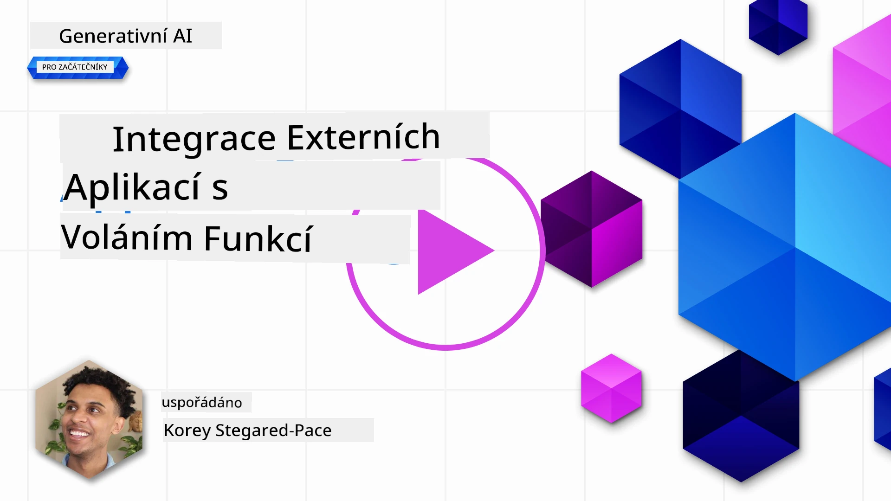
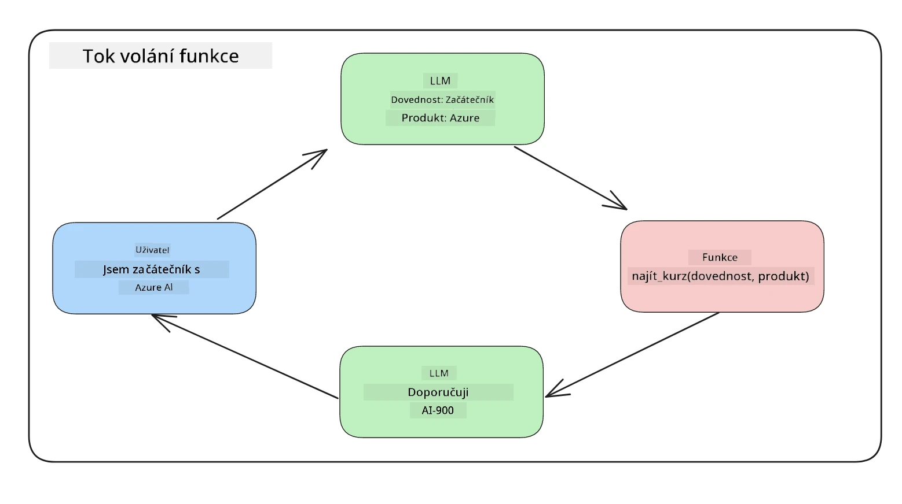
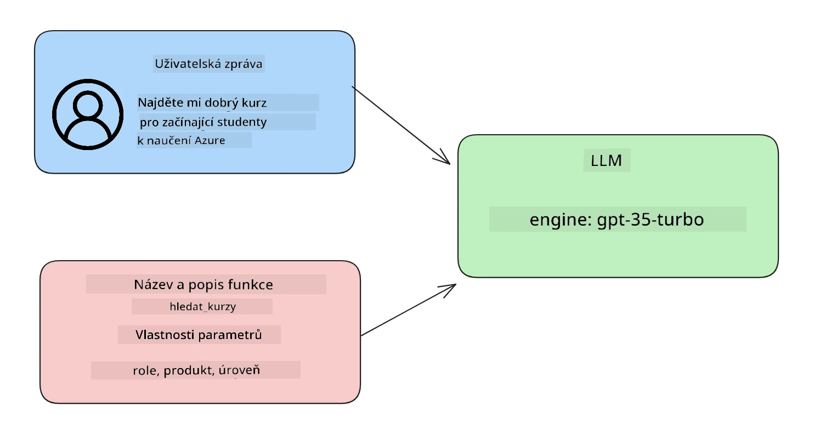

# Integrace s voláním funkcí

[](https://youtu.be/DgUdCLX8qYQ?si=f1ouQU5HQx6F8Gl2)

Doposud jste se v předchozích lekcích hodně naučili. Nicméně můžeme se ještě zlepšit. Některé věci, kterým se můžeme věnovat, jsou jak získat konzistentnější formát odpovědi, aby bylo jednodušší s odpovědí dále pracovat. Také možná budeme chtít přidat data z jiných zdrojů pro další obohacení naší aplikace.

Výše zmíněné problémy jsou tím, čemu se tato kapitola bude věnovat.

## Úvod

Tato lekce pokryje:

- Vysvětlení, co je volání funkcí a k čemu se používá.
- Vytvoření volání funkce pomocí Azure OpenAI.
- Jak integrovat volání funkce do aplikace.

## Cíle učení

Na konci této lekce budete schopni:

- Vysvětlit účel používání volání funkcí.
- Nastavit volání funkce pomocí Azure OpenAI Service.
- Navrhnout efektivní volání funkcí pro případ použití vaší aplikace.

## Scénář: Vylepšení našeho chatbota pomocí funkcí

Pro tuto lekci chceme vytvořit funkci pro naše vzdělávací startup, která uživatelům umožní použít chatbota k hledání technických kurzů. Doporučíme kurzy, které odpovídají jejich úrovni znalostí, aktuální pozici a zájmu o technologie.

Pro dokončení tohoto scénáře použijeme kombinaci:

- `Azure OpenAI` k vytvoření chatovacího zážitku pro uživatele.
- `Microsoft Learn Catalog API` k pomoci uživatelům najít kurzy na základě jejich požadavku.
- `Volání funkcí` k převzetí dotazu uživatele a jeho odeslání funkci k provedení API požadavku.

Pro začátek si podívejme, proč bychom vůbec chtěli používat volání funkcí:

## Proč volání funkcí

Před voláním funkcí byly odpovědi z LLM nestrukturované a nekonzistentní. Vývojáři museli psát složitý validační kód, aby zvládli všechny varianty odpovědi. Uživatelé nemohli získat odpovědi na otázky typu "Jaké je aktuální počasí ve Stockholmu?". Důvodem bylo, že modely byly omezené datem, kdy byly trénovány.

Volání funkcí je vlastnost Azure OpenAI Service, která pomáhá překonat následující omezení:

- **Konzistentní formát odpovědi**. Pokud můžeme lépe kontrolovat formát odpovědi, můžeme ji snadněji integrovat do dalších systémů.
- **Externí data**. Možnost využít data z jiných zdrojů aplikace v kontextu chatu.

## Ilustrace problému na příkladu

> Doporučujeme použít [přiložený notebook](./python/aoai-assignment.ipynb?WT.mc_id=academic-105485-koreyst), pokud chcete scénář spustit. Můžete ale jen číst dál, protože se snažíme ukázat problém, který funkce pomáhají řešit.

Podívejme se na příklad, který ilustruje problém s formátem odpovědi:

Řekněme, že chceme vytvořit databázi údajů o studentech, abychom jim mohli navrhnout správný kurz. Níže jsou dva popisy studentů, které jsou si velmi podobné obsahem dat.

1. Vytvoření připojení k naší Azure OpenAI službě:

   ```python
   import os
   import json
   from openai import OpenAI
   from dotenv import load_dotenv
   load_dotenv()

   # API odpovědí je poskytováno z Azure OpenAI (Microsoft Foundry) v1
   # koncového bodu, takže klienta OpenAI nasměrujeme na <your-endpoint>/openai/v1/.
   endpoint = os.environ['AZURE_OPENAI_ENDPOINT']
   client = OpenAI(
   api_key=os.environ['AZURE_OPENAI_API_KEY'],
   base_url=f"{endpoint.rstrip('/')}/openai/v1/",
   )

   deployment=os.environ['AZURE_OPENAI_DEPLOYMENT']
   ```

Níže je nějaký Python kód pro konfiguraci našeho připojení k Azure OpenAI. Protože používáme endpoint verze v1, stačí nastavit `api_key` a `base_url` (není potřeba `api_version`).

1. Vytvoření dvou popisů studentů pomocí proměnných `student_1_description` a `student_2_description`.

   ```python
   student_1_description="Emily Johnson is a sophomore majoring in computer science at Duke University. She has a 3.7 GPA. Emily is an active member of the university's Chess Club and Debate Team. She hopes to pursue a career in software engineering after graduating."

   student_2_description = "Michael Lee is a sophomore majoring in computer science at Stanford University. He has a 3.8 GPA. Michael is known for his programming skills and is an active member of the university's Robotics Club. He hopes to pursue a career in artificial intelligence after finishing his studies."
   ```

Chtěli bychom zaslat výše uvedené popisy studentů do LLM, aby data rozebral. Tato data mohou být později použita v naší aplikaci, odeslána na API nebo uložena v databázi.

1. Vytvořme dva identické prompt a v nich instrukce pro LLM, jaké informace nás zajímají:

   ```python
   prompt1 = f'''
   Please extract the following information from the given text and return it as a JSON object:

   name
   major
   school
   grades
   club

   This is the body of text to extract the information from:
   {student_1_description}
   '''

   prompt2 = f'''
   Please extract the following information from the given text and return it as a JSON object:

   name
   major
   school
   grades
   club

   This is the body of text to extract the information from:
   {student_2_description}
   '''
   ```

Výše uvedené prompty instruují LLM, aby extrahovalo informace a vrátilo odpověď ve formátu JSON.

1. Po nastavení promptů a připojení k Azure OpenAI nyní odešleme prompty LLM pomocí `client.responses.create`. Uložíme prompt do proměnné `input` a přiřadíme roli `user`. Tím simulujeme zprávu od uživatele posílanou do chatbota.

   ```python
   # odpověď z výzvy jedna
   openai_response1 = client.responses.create(
   model=deployment,
   input = [{'role': 'user', 'content': prompt1}],
   store=False,
   )
   openai_response1.output_text

   # odpověď z výzvy dvě
   openai_response2 = client.responses.create(
   model=deployment,
   input = [{'role': 'user', 'content': prompt2}],
   store=False,
   )
   openai_response2.output_text
   ```

Nyní můžeme odeslat oba požadavky LLM a zkontrolovat odpověď, kterou dostaneme, například takto `openai_response1.output_text`.

1. Nakonec můžeme odpověď převést do formátu JSON zavoláním `json.loads`:

   ```python
   # Načítání odpovědi jako JSON objektu
   json_response1 = json.loads(openai_response1.output_text)
   json_response1
   ```

Odpověď 1:

   ```json
   {
     "name": "Emily Johnson",
     "major": "computer science",
     "school": "Duke University",
     "grades": "3.7",
     "club": "Chess Club"
   }
   ```

Odpověď 2:

   ```json
   {
     "name": "Michael Lee",
     "major": "computer science",
     "school": "Stanford University",
     "grades": "3.8 GPA",
     "club": "Robotics Club"
   }
   ```

Přestože jsou prompty stejné a popisy jsou podobné, vidíme hodnoty vlastnosti `Grades` formátované různě, například někdy jako `3.7` a jindy jako `3.7 GPA`.

Toto je způsobeno tím, že LLM přijímá nestrukturovaná data ve formě psaného promptu a vrací také nestrukturovaná data. Potřebujeme mít strukturovaný formát, abychom věděli, co očekávat při ukládání či použití těchto dat.

Jak tedy vyřešit problém s formátováním? Pomocí volání funkcí můžeme zajistit, že obdržíme strukturovaná data zpět. Když používáme volání funkcí, LLM ve skutečnosti žádné funkce nespouští. Místo toho vytvoříme strukturu, podle které bude LLM odpovídat. Pak tyto strukturované odpovědi použijeme, abychom věděli, kterou funkci v naší aplikaci spustit.



Výsledek, který je vrácen z funkce, můžeme poté poslat zpět do LLM. LLM pak odpoví v přirozeném jazyce, aby odpovědělo na uživatelův dotaz.

## Použití volání funkcí

Existuje mnoho různých situací, kdy volání funkcí může vylepšit vaši aplikaci, například:

- **Volání externích nástrojů**. Chatboti jsou skvělí v odpovídání uživatelům na otázky. Díky volání funkcí mohou chatboti využít zprávy od uživatelů k vykonání určitých úkolů. Například student může požádat chatbota: "Pošli email mému instruktorovi, že potřebuji více pomoci s tímto tématem." Chatbot může pak zavolat funkci `send_email(to: string, body: string)`.

- **Vytváření dotazů do API nebo databáze**. Uživatelé mohou najít informace pomocí přirozeného jazyka, který je převeden na formátovaný dotaz nebo API požadavek. Příklad může být učitel, který se zeptá: "Kdo jsou studenti, kteří splnili poslední úkol?" – což může zavolat funkci `get_completed(student_name: string, assignment: int, current_status: string)`.

- **Vytváření strukturovaných dat**. Uživatelé mohou převést blok textu nebo CSV a nechat LLM vytáhnout důležité informace. Například student může převést článek z Wikipedie o mírových dohodách a vytvořit AI flashkarty. To lze provést funkcí `get_important_facts(agreement_name: string, date_signed: string, parties_involved: list)`.

## Vytvoření vašeho prvního volání funkce

Proces vytvoření volání funkce zahrnuje 3 hlavní kroky:

1. **Volání** API odpovědí s seznamem vašich funkcí (nástrojů) a uživatelskou zprávou.
2. **Čtení** odpovědi modelu k provedení akce, tedy spuštění funkce či API volání.
3. **Provedení** dalšího volání na API odpovědí se zpracovanou odezvou z vaší funkce k vytvoření odpovědi uživateli.



### Krok 1 – vytváření zpráv

Prvním krokem je vytvoření uživatelské zprávy. Tu může být dynamicky přidělena z hodnoty textového vstupu nebo ji můžete nastavit zde ručně. Pokud s API odpovědí pracujete poprvé, musíte definovat `role` a `content` zprávy.

Role může být `system` (vytváří pravidla), `assistant` (model) nebo `user` (konečný uživatel). Pro volání funkcí přiřadíme roli `user` a ukázkovou otázku.

```python
messages= [ {"role": "user", "content": "Find me a good course for a beginner student to learn Azure."} ]
```

Přiřazením různých rolí jasně říkáme LLM, zda zprávu říká systém či uživatel, což pomáhá budovat historii konverzace, na níž může LLM stavět.

### Krok 2 – vytváření funkcí

Nyní definujeme funkci a její parametry. Použijeme zde jen jednu funkci nazvanou `search_courses`, ale můžete vytvořit i více funkcí.

> **Důležité**: Funkce jsou zahrnuty v systémové zprávě pro LLM a počítají se do dostupných tokenů.

Níže vytvoříme funkce jako pole položek. Každá položka je nástroj ve formátu plochého API odpovědí s vlastnostmi: `type`, `name`, `description` a `parameters`:

```python
functions = [
   {
      "type":"function",
      "name":"search_courses",
      "description":"Retrieves courses from the search index based on the parameters provided",
      "parameters":{
         "type":"object",
         "properties":{
            "role":{
               "type":"string",
               "description":"The role of the learner (i.e. developer, data scientist, student, etc.)"
            },
            "product":{
               "type":"string",
               "description":"The product that the lesson is covering (i.e. Azure, Power BI, etc.)"
            },
            "level":{
               "type":"string",
               "description":"The level of experience the learner has prior to taking the course (i.e. beginner, intermediate, advanced)"
            }
         },
         "required":[
            "role"
         ]
      }
   }
]
```

Popsání jednotlivých instancí funkcí podrobněji:

- `name` – název funkce, kterou chceme volat.
- `description` – popis fungování funkce. Zde je důležité být konkrétní a jasný.
- `parameters` – seznam hodnot a formát, který chcete, aby model ve své odpovědi použil. Pole parametrů se skládá z položek s těmito vlastnostmi:
  1. `type` – datový typ vlastností, ve kterém budou uloženy.
  2. `properties` – seznam konkrétních hodnot, které model použije ve své odpovědi.
      1. `name` – klíč je název vlastnosti, kterou model použije ve formátované odpovědi, například `product`.
      2. `type` – datový typ této vlastnosti, například `string`.
      3. `description` – popis konkrétní vlastnosti.

Existuje také volitelná vlastnost `required` – požadovaná vlastnost pro dokončení volání funkce.

### Krok 3 – provedení volání funkce

Po definici funkce ji musíme přidat do volání Response API. Uděláme to přidáním `tools` k požadavku, v tomto případě `tools=functions`.

Je také možné nastavit `tool_choice` na `auto`. To znamená, že necháme LLM rozhodnout, kterou funkci zavolat na základě zprávy uživatele, místo abychom ji přidělovali sami.

Níže je ukázkový kód, kde voláme `client.responses.create`, všimněte si, že nastavujeme `tools=functions` a `tool_choice="auto"`, čímž dáváme LLM volbu, kdy funkce volat:

```python
response = client.responses.create(model=deployment,
                                        input=messages,
                                        tools=functions,
                                        tool_choice="auto",
                                        store=False)

print(response.output)
```

Odpověď nyní obsahuje položku `function_call` v `response.output`, která vypadá takto:

```json
{
  "type": "function_call",
  "name": "search_courses",
  "call_id": "call_abc123",
  "arguments": "{\n  \"role\": \"student\",\n  \"product\": \"Azure\",\n  \"level\": \"beginner\"\n}"
}
```

Zde vidíme, jak byla volána funkce `search_courses` a s jakými argumenty, uvedenými v `arguments` vlastnosti JSON odpovědi.

Závěr je, že LLM dokázalo najít data odpovídající argumentům funkce, protože je extrahovalo z hodnoty poskytnuté do parametru `input` ve volání Responses API. Níže připomenutí hodnoty `messages`:

```python
messages= [ {"role": "user", "content": "Find me a good course for a beginner student to learn Azure."} ]
```

Jak vidíte, `student`, `Azure` a `beginner` byly extrahovány ze `messages` a nastaveny jako vstup do funkce. Použití funkcí tímto způsobem je skvělý způsob, jak z promptu extrahovat informace, ale také dodat LLM strukturu a mít znovupoužitelnou funkcionalitu.

Nyní je potřeba vidět, jak to můžeme využít v naší aplikaci.

## Integrace volání funkcí do aplikace

Po otestování formátované odpovědi z LLM ji nyní můžeme integrovat do aplikace.

### Řízení průběhu

Pro integraci do aplikace proveďme následující kroky:

1. Nejprve zavoláme OpenAI služby a extrahujeme položky volání funkcí z odpovědi `output`.

   ```python
   response_items = response.output
   tool_calls = [item for item in response_items if item.type == "function_call"]
   ```

1. Nyní definujeme funkci, která zavolá Microsoft Learn API a získá seznam kurzů:

   ```python
   import requests

   def search_courses(role, product, level):
     url = "https://learn.microsoft.com/api/catalog/"
     params = {
        "role": role,
        "product": product,
        "level": level
     }
     response = requests.get(url, params=params)
     modules = response.json()["modules"]
     results = []
     for module in modules[:5]:
        title = module["title"]
        url = module["url"]
        results.append({"title": title, "url": url})
     return str(results)
   ```

Všimněte si, že nyní vytváříme skutečnou Python funkci odpovídající názvům funkcí definovaných v proměnné `functions`. Také skutečně voláme externí API, abychom získali potřebná data. V tomto případě vyhledáváme moduly školení přes Microsoft Learn API.

Dobře, vytvořili jsme proměnnou `functions` a odpovídající Python funkci, jak říct LLM, jak tyto dva spojit a zavolat naši Python funkci?

1. Abychom zjistili, jestli je potřeba zavolat Python funkci, musíme zkontrolovat odpověď LLM a zjistit, zda obsahuje položku `function_call`, a pokud ano, zavolat uvedenou funkci. Jak na to níže:

   ```python
   # Zkontrolujte, zda model chce zavolat funkci
   if tool_calls:
    for tool_call in tool_calls:
     print("Recommended Function call:")
     print(tool_call.name)
     print()

     # Zavolejte funkci.
     function_name = tool_call.name

     available_functions = {
             "search_courses": search_courses,
     }
     function_to_call = available_functions[function_name]

     function_args = json.loads(tool_call.arguments)
     function_response = function_to_call(**function_args)

     print("Output of function call:")
     print(function_response)
     print(type(function_response))

     # Přidejte volání funkce a její výsledek zpět do konverzace.
     # Položka function_call modelu musí být přidána před jeho výstup.
     messages.append(tool_call)  # položka function_call asistenta
     messages.append( # výsledek funkce
         {
             "type": "function_call_output",
             "call_id": tool_call.call_id,
             "output": function_response,
         }
     )
   ```

Tyto tři řádky zajistí, že extrahujeme název funkce, argumenty a funkci zavoláme:

   ```python
   function_to_call = available_functions[function_name]

   function_args = json.loads(tool_call.arguments)
   function_response = function_to_call(**function_args)
   ```

Níže je výstup ze spuštění našeho kódu:

**Výstup**

   ```Recommended Function call:
   {
     "name": "search_courses",
     "arguments": "{\n  \"role\": \"student\",\n  \"product\": \"Azure\",\n  \"level\": \"beginner\"\n}"
   }

   Output of function call:
   [{'title': 'Describe concepts of cryptography', 'url': 'https://learn.microsoft.com/training/modules/describe-concepts-of-cryptography/?
   WT.mc_id=api_CatalogApi'}, {'title': 'Introduction to audio classification with TensorFlow', 'url': 'https://learn.microsoft.com/en-
   us/training/modules/intro-audio-classification-tensorflow/?WT.mc_id=api_CatalogApi'}, {'title': 'Design a Performant Data Model in Azure SQL
   Database with Azure Data Studio', 'url': 'https://learn.microsoft.com/training/modules/design-a-data-model-with-ads/?
   WT.mc_id=api_CatalogApi'}, {'title': 'Getting started with the Microsoft Cloud Adoption Framework for Azure', 'url':
   'https://learn.microsoft.com/training/modules/cloud-adoption-framework-getting-started/?WT.mc_id=api_CatalogApi'}, {'title': 'Set up the
   Rust development environment', 'url': 'https://learn.microsoft.com/training/modules/rust-set-up-environment/?WT.mc_id=api_CatalogApi'}]
   <class 'str'>
   ```

1. Nyní pošleme aktualizovanou zprávu `messages` do LLM, aby nám poskytlo odpověď v přirozeném jazyce namísto API JSON formátu.

   ```python
   print("Messages in next request:")
   print(messages)
   print()

   second_response = client.responses.create(
      input=messages,
      model=deployment,
      tool_choice="auto",
      tools=functions,
      temperature=0,
      store=False,
         )  # získejte novou odpověď od modelu, kde může vidět odpověď funkce


   print(second_response.output_text)
   ```

**Výstup**

   ```text
   I found some good courses for beginner students to learn Azure:

   1. [Describe concepts of cryptography](https://learn.microsoft.com/training/modules/describe-concepts-of-cryptography/?WT.mc_id=api_CatalogApi)
   2. [Introduction to audio classification with TensorFlow](https://learn.microsoft.com/training/modules/intro-audio-classification-tensorflow/?WT.mc_id=api_CatalogApi)
   3. [Design a Performant Data Model in Azure SQL Database with Azure Data Studio](https://learn.microsoft.com/training/modules/design-a-data-model-with-ads/?WT.mc_id=api_CatalogApi)
   4. [Getting started with the Microsoft Cloud Adoption Framework for Azure](https://learn.microsoft.com/training/modules/cloud-adoption-framework-getting-started/?WT.mc_id=api_CatalogApi)
   5. [Set up the Rust development environment](https://learn.microsoft.com/training/modules/rust-set-up-environment/?WT.mc_id=api_CatalogApi)

   You can click on the links to access the courses.
   ```

## Zadání

Pro pokračování ve vašem učení Azure OpenAI Function Calling můžete vytvořit:

- Více parametrů funkce, které mohou pomoci uživatelům najít více kurzů.

- Vytvořte další volání funkce, které od uživatele získá více informací, například jeho rodný jazyk
- Vytvořte zpracování chyb pro případ, že volání funkce a/nebo API nevrátí žádné vhodné kurzy

Tip: Sledujte stránku [Learn API reference documentation](https://learn.microsoft.com/training/support/catalog-api-developer-reference?WT.mc_id=academic-105485-koreyst), kde zjistíte, jak a kde jsou tato data k dispozici.

## Skvělá práce! Pokračujte na cestě

Po dokončení této lekce si prohlédněte naši [Generative AI Learning collection](https://aka.ms/genai-collection?WT.mc_id=academic-105485-koreyst), kde můžete pokračovat ve zvyšování svých znalostí o generativní AI!

Přejděte k lekci 12, kde se podíváme na to, jak [navrhovat UX pro AI aplikace](../12-designing-ux-for-ai-applications/README.md?WT.mc_id=academic-105485-koreyst)!

---

<!-- CO-OP TRANSLATOR DISCLAIMER START -->
**Prohlášení o omezení odpovědnosti**:
Tento dokument byl přeložen pomocí AI překladatelské služby [Co-op Translator](https://github.com/Azure/co-op-translator). Přestože usilujeme o co největší přesnost, mějte prosím na paměti, že automatizované překlady mohou obsahovat chyby nebo nepřesnosti. Originální dokument v jeho mateřském jazyce by měl být považován za autoritativní zdroj. Pro kritické informace se doporučuje profesionální lidský překlad. Nejsme odpovědní za jakékoli nedorozumění nebo nesprávné interpretace vzniklé použitím tohoto překladu.
<!-- CO-OP TRANSLATOR DISCLAIMER END -->