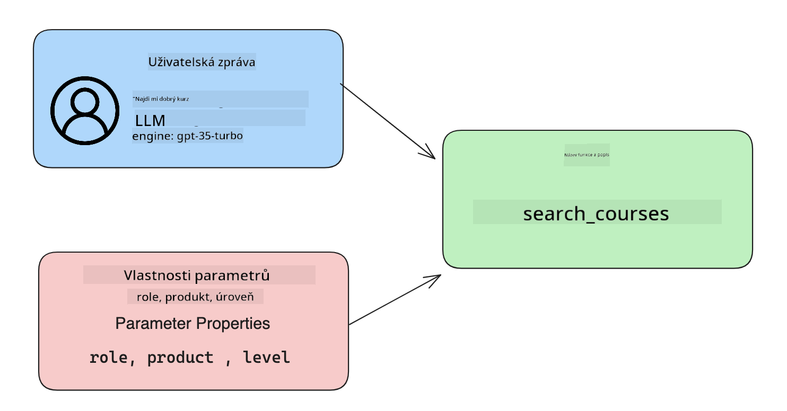

<!--
CO_OP_TRANSLATOR_METADATA:
{
  "original_hash": "77a48a201447be19aa7560706d6f93a0",
  "translation_date": "2025-07-09T14:41:47+00:00",
  "source_file": "11-integrating-with-function-calling/README.md",
  "language_code": "cs"
}
-->
# Integrace s voláním funkcí

[](https://aka.ms/gen-ai-lesson11-gh?WT.mc_id=academic-105485-koreyst)

V předchozích lekcích jste se už hodně naučili. Přesto se můžeme ještě zlepšit. Některé věci, které můžeme řešit, jsou například, jak získat konzistentnější formát odpovědi, aby bylo snazší s ní dále pracovat. Také bychom mohli chtít přidat data z jiných zdrojů, abychom naši aplikaci ještě více obohatili.

Výše zmíněné problémy jsou tím, čemu se tato kapitola věnuje.

## Úvod

Tato lekce pokryje:

- Vysvětlení, co je volání funkcí a k čemu se používá.
- Vytvoření volání funkce pomocí Azure OpenAI.
- Jak integrovat volání funkce do aplikace.

## Cíle učení

Na konci této lekce budete schopni:

- Vysvětlit účel používání volání funkcí.
- Nastavit volání funkce pomocí Azure OpenAI Service.
- Navrhnout efektivní volání funkcí pro konkrétní použití vaší aplikace.

## Scénář: Vylepšení našeho chatbota pomocí funkcí

Pro tuto lekci chceme vytvořit funkci pro náš vzdělávací startup, která uživatelům umožní pomocí chatbota najít technické kurzy. Doporučíme kurzy, které odpovídají jejich úrovni dovedností, aktuální roli a zájmu o technologii.

K dokončení tohoto scénáře použijeme kombinaci:

- `Azure OpenAI` pro vytvoření chatovacího zážitku pro uživatele.
- `Microsoft Learn Catalog API` k pomoci uživatelům najít kurzy na základě jejich požadavků.
- `Function Calling` k převzetí dotazu uživatele a jeho odeslání do funkce, která provede API požadavek.

Pro začátek se podívejme, proč bychom vůbec chtěli používat volání funkcí:

## Proč volání funkcí

Před voláním funkcí byly odpovědi z LLM nestrukturované a nekonzistentní. Vývojáři museli psát složitý validační kód, aby zvládli všechny možné varianty odpovědí. Uživatelé nemohli získat odpovědi na otázky jako „Jaké je aktuální počasí ve Stockholmu?“. To proto, že modely byly omezené na data, na kterých byly trénovány.

Volání funkcí je funkce Azure OpenAI Service, která pomáhá překonat následující omezení:

- **Konzistentní formát odpovědi**. Pokud můžeme lépe kontrolovat formát odpovědi, můžeme ji snáze integrovat do dalších systémů.
- **Externí data**. Možnost využít data z jiných zdrojů aplikace v kontextu chatu.

## Ilustrace problému na scénáři

> Doporučujeme použít [přiložený notebook](python/aoai-assignment.ipynb), pokud chcete scénář vyzkoušet. Můžete také jen číst dál, protože se snažíme ukázat problém, který funkce mohou pomoci vyřešit.

Podívejme se na příklad, který ilustruje problém s formátem odpovědi:

Řekněme, že chceme vytvořit databázi studentských dat, abychom jim mohli doporučit správný kurz. Níže máme dva popisy studentů, které jsou si datově velmi podobné.

1. Vytvoříme připojení k našemu Azure OpenAI zdroji:

   ```python
   import os
   import json
   from openai import AzureOpenAI
   from dotenv import load_dotenv
   load_dotenv()

   client = AzureOpenAI(
   api_key=os.environ['AZURE_OPENAI_API_KEY'],  # this is also the default, it can be omitted
   api_version = "2023-07-01-preview"
   )

   deployment=os.environ['AZURE_OPENAI_DEPLOYMENT']
   ```

   Níže je Python kód pro konfiguraci připojení k Azure OpenAI, kde nastavujeme `api_type`, `api_base`, `api_version` a `api_key`.

1. Vytvoříme dva popisy studentů pomocí proměnných `student_1_description` a `student_2_description`.

   ```python
   student_1_description="Emily Johnson is a sophomore majoring in computer science at Duke University. She has a 3.7 GPA. Emily is an active member of the university's Chess Club and Debate Team. She hopes to pursue a career in software engineering after graduating."

   student_2_description = "Michael Lee is a sophomore majoring in computer science at Stanford University. He has a 3.8 GPA. Michael is known for his programming skills and is an active member of the university's Robotics Club. He hopes to pursue a career in artificial intelligence after finishing his studies."
   ```

   Chceme tyto popisy studentů poslat do LLM, aby data rozparsoval. Tato data pak můžeme použít v aplikaci, odeslat do API nebo uložit do databáze.

1. Vytvoříme dva stejné prompti, ve kterých LLM instruujeme, jaké informace nás zajímají:

   ```python
   prompt1 = f'''
   Please extract the following information from the given text and return it as a JSON object:

   name
   major
   school
   grades
   club

   This is the body of text to extract the information from:
   {student_1_description}
   '''

   prompt2 = f'''
   Please extract the following information from the given text and return it as a JSON object:

   name
   major
   school
   grades
   club

   This is the body of text to extract the information from:
   {student_2_description}
   '''
   ```

   Výše uvedené prompty instruují LLM, aby extrahoval informace a vrátil odpověď ve formátu JSON.

1. Po nastavení promptů a připojení k Azure OpenAI nyní pošleme prompty do LLM pomocí `openai.ChatCompletion`. Prompt uložíme do proměnné `messages` a přiřadíme roli `user`. Tím simulujeme zprávu od uživatele psanou do chatbota.

   ```python
   # response from prompt one
   openai_response1 = client.chat.completions.create(
   model=deployment,
   messages = [{'role': 'user', 'content': prompt1}]
   )
   openai_response1.choices[0].message.content

   # response from prompt two
   openai_response2 = client.chat.completions.create(
   model=deployment,
   messages = [{'role': 'user', 'content': prompt2}]
   )
   openai_response2.choices[0].message.content
   ```

Nyní můžeme odeslat oba požadavky do LLM a zkontrolovat odpověď, kterou obdržíme, například takto: `openai_response1['choices'][0]['message']['content']`.

1. Nakonec můžeme odpověď převést do JSON formátu zavoláním `json.loads`:

   ```python
   # Loading the response as a JSON object
   json_response1 = json.loads(openai_response1.choices[0].message.content)
   json_response1
   ```

   Odpověď 1:

   ```json
   {
     "name": "Emily Johnson",
     "major": "computer science",
     "school": "Duke University",
     "grades": "3.7",
     "club": "Chess Club"
   }
   ```

   Odpověď 2:

   ```json
   {
     "name": "Michael Lee",
     "major": "computer science",
     "school": "Stanford University",
     "grades": "3.8 GPA",
     "club": "Robotics Club"
   }
   ```

   I když jsou prompty stejné a popisy podobné, vidíme, že hodnoty vlastnosti `Grades` jsou formátovány různě, například někdy ve formátu `3.7` a jindy `3.7 GPA`.

   Tento výsledek je způsoben tím, že LLM přijímá nestrukturovaná data ve formě psaného promptu a také vrací nestrukturovaná data. Potřebujeme mít strukturovaný formát, abychom věděli, co očekávat při ukládání nebo používání těchto dat.

Jak tedy vyřešit problém s formátováním? Pomocí volání funkcí můžeme zajistit, že dostaneme zpět strukturovaná data. Při volání funkcí LLM ve skutečnosti žádné funkce nespouští. Místo toho vytvoříme strukturu, kterou má LLM při odpovědích dodržovat. Tyto strukturované odpovědi pak použijeme k rozhodnutí, kterou funkci v aplikaci spustíme.


Výsledek z funkce pak můžeme poslat zpět do LLM. LLM následně odpoví přirozeným jazykem na dotaz uživatele.

## Případy použití volání funkcí

Existuje mnoho různých případů, kdy volání funkcí může zlepšit vaši aplikaci, například:

- **Volání externích nástrojů**. Chatboti jsou skvělí v poskytování odpovědí na otázky uživatelů. Pomocí volání funkcí mohou chatboti využít zprávy od uživatelů k dokončení určitých úkolů. Například student může požádat chatbota: „Pošli e-mail mému lektorovi, že potřebuji více pomoci s tímto předmětem.“ To může vyvolat volání funkce `send_email(to: string, body: string)`.

- **Vytváření API nebo databázových dotazů**. Uživatelé mohou najít informace pomocí přirozeného jazyka, který se převede na formátovaný dotaz nebo API požadavek. Příkladem může být učitel, který se zeptá: „Kteří studenti dokončili poslední úkol?“, což může vyvolat funkci `get_completed(student_name: string, assignment: int, current_status: string)`.

- **Vytváření strukturovaných dat**. Uživatelé mohou vzít blok textu nebo CSV a použít LLM k extrakci důležitých informací. Například student může převést článek z Wikipedie o mírových dohodách na AI flashkarty. To lze provést pomocí funkce `get_important_facts(agreement_name: string, date_signed: string, parties_involved: list)`.

## Vytvoření vašeho prvního volání funkce

Proces vytvoření volání funkce zahrnuje 3 hlavní kroky:

1. **Volání** API Chat Completions s seznamem vašich funkcí a zprávou od uživatele.
2. **Čtení** odpovědi modelu pro provedení akce, tj. spuštění funkce nebo API volání.
3. **Vytvoření** dalšího volání na Chat Completions API s odpovědí z vaší funkce, abyste použili tyto informace k vytvoření odpovědi uživateli.



### Krok 1 - vytváření zpráv

Prvním krokem je vytvořit zprávu od uživatele. Ta může být dynamicky přiřazena z hodnoty textového vstupu, nebo ji můžete zde přímo zadat. Pokud pracujete s Chat Completions API poprvé, musíme definovat `role` a `content` zprávy.

`role` může být `system` (nastavení pravidel), `assistant` (model) nebo `user` (koncový uživatel). Pro volání funkcí přiřadíme roli `user` a uvedeme příklad otázky.

```python
messages= [ {"role": "user", "content": "Find me a good course for a beginner student to learn Azure."} ]
```

Přiřazením různých rolí je pro LLM jasné, zda něco říká systém nebo uživatel, což pomáhá budovat historii konverzace, na kterou se LLM může odkazovat.

### Krok 2 - vytváření funkcí

Dále definujeme funkci a její parametry. Použijeme zde pouze jednu funkci s názvem `search_courses`, ale můžete vytvořit i více funkcí.

> **Důležité** : Funkce jsou zahrnuty do systémové zprávy pro LLM a započítávají se do dostupného počtu tokenů.

Níže vytvoříme funkce jako pole položek. Každá položka je funkce a má vlastnosti `name`, `description` a `parameters`:

```python
functions = [
   {
      "name":"search_courses",
      "description":"Retrieves courses from the search index based on the parameters provided",
      "parameters":{
         "type":"object",
         "properties":{
            "role":{
               "type":"string",
               "description":"The role of the learner (i.e. developer, data scientist, student, etc.)"
            },
            "product":{
               "type":"string",
               "description":"The product that the lesson is covering (i.e. Azure, Power BI, etc.)"
            },
            "level":{
               "type":"string",
               "description":"The level of experience the learner has prior to taking the course (i.e. beginner, intermediate, advanced)"
            }
         },
         "required":[
            "role"
         ]
      }
   }
]
```

Popíšeme si jednotlivé vlastnosti funkce podrobněji:

- `name` - Název funkce, kterou chceme volat.
- `description` - Popis, jak funkce funguje. Je důležité být konkrétní a jasný.
- `parameters` - Seznam hodnot a formát, který chcete, aby model ve své odpovědi použil. Pole parametrů obsahuje položky s následujícími vlastnostmi:
  1. `type` - Datový typ, ve kterém budou vlastnosti uloženy.
  2. `properties` - Seznam konkrétních hodnot, které model použije ve své odpovědi.
     1. `name` - Klíč je název vlastnosti, kterou model použije ve formátované odpovědi, například `product`.
     2. `type` - Datový typ této vlastnosti, například `string`.
     3. `description` - Popis konkrétní vlastnosti.

Existuje také volitelná vlastnost `required` - povinná vlastnost pro dokončení volání funkce.

### Krok 3 - provedení volání funkce

Po definování funkce ji musíme zahrnout do volání Chat Completion API. Uděláme to přidáním `functions` do požadavku, v tomto případě `functions=functions`.

Je také možnost nastavit `function_call` na `auto`. To znamená, že necháme LLM rozhodnout, kterou funkci má zavolat na základě zprávy uživatele, místo abychom to určovali my.

Níže je kód, kde voláme `ChatCompletion.create`, všimněte si, jak nastavujeme `functions=functions` a `function_call="auto"`, čímž dáváme LLM možnost rozhodnout, kdy volat poskytnuté funkce:

```python
response = client.chat.completions.create(model=deployment,
                                        messages=messages,
                                        functions=functions,
                                        function_call="auto")

print(response.choices[0].message)
```

Odpověď, kterou nyní dostaneme, vypadá takto:

```json
{
  "role": "assistant",
  "function_call": {
    "name": "search_courses",
    "arguments": "{\n  \"role\": \"student\",\n  \"product\": \"Azure\",\n  \"level\": \"beginner\"\n}"
  }
}
```

Vidíme, že byla zavolána funkce `search_courses` a s jakými argumenty, které jsou uvedeny ve vlastnosti `arguments` v JSON odpovědi.

Závěr je, že LLM dokázal najít data odpovídající argumentům funkce, protože je extrahoval z hodnoty předané do parametru `messages` v chat completion volání. Níže je připomenutí hodnoty `messages`:

```python
messages= [ {"role": "user", "content": "Find me a good course for a beginner student to learn Azure."} ]
```

Jak vidíte, `student`, `Azure` a `beginner` byly extrahovány z `messages` a nastaveny jako vstup do funkce. Používání funkcí tímto způsobem je skvělý způsob, jak z promptu extrahovat informace, ale také jak dát LLM strukturu a mít znovupoužitelnou funkcionalitu.

Nyní se podíváme, jak to můžeme použít v naší aplikaci.

## Integrace volání funkcí do aplikace

Po otestování formátované odpovědi z LLM ji nyní můžeme integrovat do aplikace.

### Řízení toku

Pro integraci do aplikace postupujme následovně:

1. Nejprve zavoláme OpenAI služby a uložíme zprávu do proměnné `response_message`.

   ```python
   response_message = response.choices[0].message
   ```

1. Nyní definujeme funkci, která zavolá Microsoft Learn API a získá seznam kurzů:

   ```python
   import requests

   def search_courses(role, product, level):
     url = "https://learn.microsoft.com/api/catalog/"
     params = {
        "role": role,
        "product": product,
        "level": level
     }
     response = requests.get(url, params=params)
     modules = response.json()["modules"]
     results = []
     for module in modules[:5]:
        title = module["title"]
        url = module["url"]
        results.append({"title": title, "url": url})
     return str(results)
   ```

   Všimněte si, že nyní vytváříme skutečnou Python funkci, která odpovídá názvům funkcí uvedeným v proměnné `functions`. Také provádíme skutečná externí API volání pro získání potřebných dat. V tomto případě voláme Microsoft Learn API pro vyhledání výukových modulů.

Dobře, vytvořili jsme proměnnou `functions` a odpovídající Python funkci, jak ale LLM řekneme, jak tyto dvě věci propojit, aby byla naše Python funkce zavolána?

1. Abychom zjistili, zda máme zavolat Python funkci, musíme se podívat do odpovědi LLM a zjistit, zda obsahuje `function_call`, a podle toho zavolat příslušnou funkci. Níže je ukázka, jak tuto kontrolu provést:

   ```python
   # Check if the model wants to call a function
   if response_message.function_call.name:
    print("Recommended Function call:")
    print(response_message.function_call.name)
    print()

    # Call the function.
    function_name = response_message.function_call.name

    available_functions = {
            "search_courses": search_courses,
    }
    function_to_call = available_functions[function_name]

    function_args = json.loads(response_message.function_call.arguments)
    function_response = function_to_call(**function_args)

    print("Output of function call:")
    print(function_response)
    print(type(function_response))


    # Add the assistant response and function response to the messages
    messages.append( # adding assistant response to messages
        {
            "role": response_message.role,
            "function_call": {
                "name": function_name,
                "arguments": response_message.function_call.arguments,
            },
            "content": None
        }
    )
    messages.append( # adding function response to messages
        {
            "role": "function",
            "name": function_name,
            "content":function_response,
        }
    )
   ```

   Tyto tři řádky zajistí, že extrahujeme název funkce, argumenty a provedeme volání:

   ```python
   function_to_call = available_functions[function_name]

   function_args = json.loads(response_message.function_call.arguments)
   function_response = function_to_call(**function_args)
   ```

   Níže je výstup z běhu našeho kódu:

   **Výstup**

   ```Recommended Function call:
   {
     "name": "search_courses",
     "arguments": "{\n  \"role\": \"student\",\n  \"product\": \"Azure\",\n  \"level\": \"beginner\"\n}"
   }

   Output of function call:
   [{'title': 'Describe concepts of cryptography', 'url': 'https://learn.microsoft.com/training/modules/describe-concepts-of-cryptography/?
   WT.mc_id=api_CatalogApi'}, {'title': 'Introduction to audio classification with TensorFlow', 'url': 'https://learn.microsoft.com/en-
   us/training/modules/intro-audio-classification-tensorflow/?WT.mc_id=api_CatalogApi'}, {'title': 'Design a Performant Data Model in Azure SQL
   Database with Azure Data Studio', 'url': 'https://learn.microsoft.com/training/modules/design-a-data-model-with-ads/?
   WT.mc_id=api_CatalogApi'}, {'title': 'Getting started with the Microsoft Cloud Adoption Framework for Azure', 'url':
   'https://learn.microsoft.com/training/modules/cloud-adoption-framework-getting-started/?WT.mc_id=api_CatalogApi'}, {'title': 'Set up the
   Rust development environment', 'url': 'https://learn.microsoft.com/training/modules/rust-set-up-environment/?WT.mc_id=api_CatalogApi'}]
   <class 'str'>
   ```

1. Nyní pošleme aktualizovanou zprávu `messages` zpět do LLM, abychom mohli získat odpověď v přirozeném jazyce místo JSON formátu z API.

   ```python
   print("Messages in next request:")
   print(messages)
   print()

   second_response = client.chat.completions.create(
      messages=messages,
      model=deployment,
      function_call="auto",
      functions=functions,
      temperature=0
         )  # get a new response from GPT where it can see the function response


   print(second_response.choices[0].message)
   ```

   **Výstup**

   ```python
   {
     "role": "assistant",
     "content": "I found some good courses for beginner students to learn Azure:\n\n1. [Describe concepts of cryptography] (https://learn.microsoft.com/training/modules/describe-concepts-of-cryptography/?WT.mc_id=api_CatalogApi)\n2. [Introduction to audio classification with TensorFlow](https://learn.microsoft.com/training/modules/intro-audio-classification-tensorflow/?WT.mc_id=api_CatalogApi)\n3. [Design a Performant Data Model in Azure SQL Database with Azure Data Studio](https://learn.microsoft.com/training/modules/design-a-data-model-with-ads/?WT.mc_id=api_CatalogApi)\n4. [Getting started with the Microsoft Cloud Adoption Framework for Azure](https://learn.microsoft.com/training/modules/cloud-adoption-framework-getting-started/?WT.mc_id=api_CatalogApi)\n5. [Set up the Rust development environment](https://learn.microsoft.com/training/modules/rust-set-up-environment/?WT.mc_id=api_CatalogApi)\n\nYou can click on the links to access the courses."
   }

   ```

## Zadání

Pro pokračování ve studiu Azure OpenAI Function Calling můžete vytvořit:

- Více parametrů funkce, které by mohly pomoci studentům najít více kurzů.
- Další volání funkce, které vezme více informací od studenta, například jeho rodný jazyk.
- Ošetření chyb v případě, že volání funkce a/nebo API nevrátí žádné vhodné kurzy.
## Skvělá práce! Pokračujte na další cestě

Po dokončení této lekce si prohlédněte naši [kolekci Generative AI Learning](https://aka.ms/genai-collection?WT.mc_id=academic-105485-koreyst), kde můžete dále rozvíjet své znalosti o Generative AI!

Přejděte k Lekci 12, kde se podíváme na to, jak [navrhovat UX pro AI aplikace](../12-designing-ux-for-ai-applications/README.md?WT.mc_id=academic-105485-koreyst)!

**Prohlášení o vyloučení odpovědnosti**:  
Tento dokument byl přeložen pomocí AI překladatelské služby [Co-op Translator](https://github.com/Azure/co-op-translator). I když usilujeme o přesnost, mějte prosím na paměti, že automatizované překlady mohou obsahovat chyby nebo nepřesnosti. Původní dokument v jeho mateřském jazyce by měl být považován za autoritativní zdroj. Pro důležité informace se doporučuje profesionální lidský překlad. Nejsme odpovědní za jakékoliv nedorozumění nebo nesprávné výklady vyplývající z použití tohoto překladu.