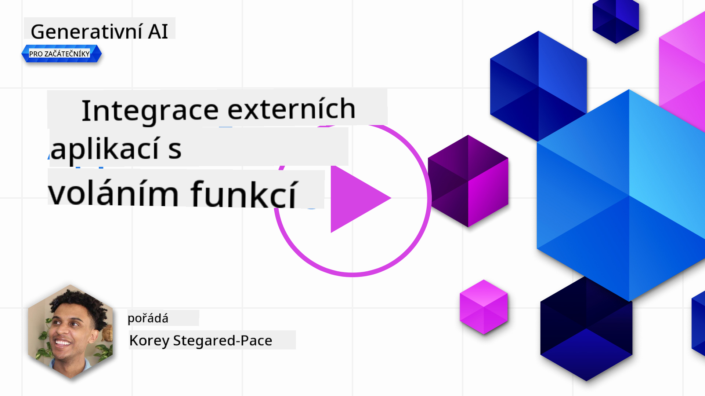
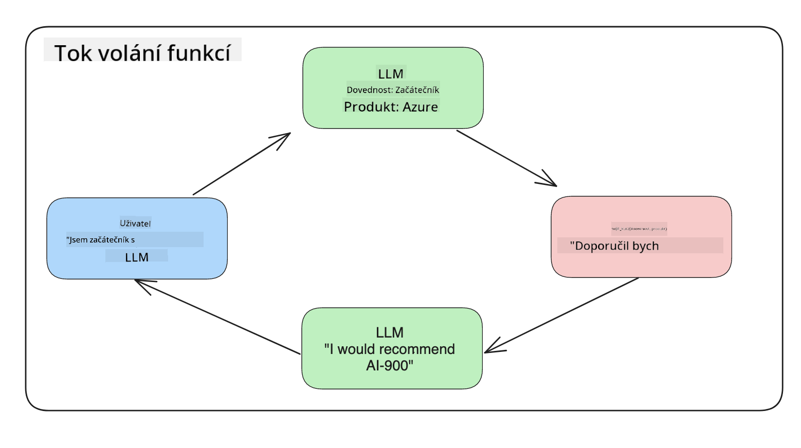

<!--
CO_OP_TRANSLATOR_METADATA:
{
  "original_hash": "f6f84f9ef2d066cd25850cab93580a50",
  "translation_date": "2025-10-17T21:37:02+00:00",
  "source_file": "11-integrating-with-function-calling/README.md",
  "language_code": "cs"
}
-->
# Integrace s voláním funkcí

[](https://youtu.be/DgUdCLX8qYQ?si=f1ouQU5HQx6F8Gl2)

V předchozích lekcích jste se již naučili poměrně dost. Nicméně stále je prostor pro zlepšení. Některé věci, které můžeme řešit, zahrnují získání konzistentnějšího formátu odpovědí, což usnadní práci s odpověďmi v dalších krocích. Také bychom mohli přidat data z jiných zdrojů, abychom naši aplikaci dále obohatili.

Tento kapitola se zaměřuje na řešení výše zmíněných problémů.

## Úvod

Tato lekce pokryje:

- Vysvětlení, co je volání funkcí a jeho využití.
- Vytvoření volání funkce pomocí Azure OpenAI.
- Jak integrovat volání funkce do aplikace.

## Cíle učení

Na konci této lekce budete schopni:

- Vysvětlit účel používání volání funkcí.
- Nastavit volání funkcí pomocí služby Azure OpenAI.
- Navrhnout efektivní volání funkcí pro potřeby vaší aplikace.

## Scénář: Vylepšení našeho chatbotu pomocí funkcí

V této lekci chceme vytvořit funkci pro náš startup zaměřený na vzdělávání, která umožní uživatelům používat chatbot k vyhledávání technických kurzů. Budeme doporučovat kurzy, které odpovídají jejich úrovni dovedností, aktuální roli a zájmu o technologie.

K dokončení tohoto scénáře použijeme kombinaci:

- `Azure OpenAI` k vytvoření chatovacího zážitku pro uživatele.
- `Microsoft Learn Catalog API` k pomoci uživatelům najít kurzy na základě jejich požadavků.
- `Volání funkcí` k přijetí dotazu uživatele a jeho odeslání do funkce pro provedení požadavku na API.

Než začneme, podívejme se, proč bychom vůbec chtěli používat volání funkcí:

## Proč volání funkcí

Před voláním funkcí byly odpovědi od LLM nestrukturované a nekonzistentní. Vývojáři museli psát složitý validační kód, aby zajistili, že budou schopni zpracovat každou variaci odpovědi. Uživatelé nemohli získat odpovědi jako například "Jaké je aktuální počasí ve Stockholmu?". To proto, že modely byly omezeny na data, na kterých byly vyškoleny.

Volání funkcí je funkce služby Azure OpenAI, která překonává následující omezení:

- **Konzistentní formát odpovědí**. Pokud můžeme lépe kontrolovat formát odpovědí, můžeme je snadněji integrovat do dalších systémů.
- **Externí data**. Možnost využívat data z jiných zdrojů aplikace v kontextu chatu.

## Ilustrace problému prostřednictvím scénáře

> Doporučujeme použít [přiložený notebook](./python/aoai-assignment.ipynb?WT.mc_id=academic-105485-koreyst), pokud chcete spustit níže uvedený scénář. Můžete také jen číst dál, protože se snažíme ilustrovat problém, kde mohou funkce pomoci s jeho řešením.

Podívejme se na příklad, který ilustruje problém s formátem odpovědí:

Řekněme, že chceme vytvořit databázi údajů o studentech, abychom jim mohli doporučit správný kurz. Níže máme dva popisy studentů, které jsou velmi podobné v datech, která obsahují.

1. Vytvořte připojení k našemu zdroji Azure OpenAI:

   ```python
   import os
   import json
   from openai import AzureOpenAI
   from dotenv import load_dotenv
   load_dotenv()

   client = AzureOpenAI(
   api_key=os.environ['AZURE_OPENAI_API_KEY'],  # this is also the default, it can be omitted
   api_version = "2023-07-01-preview"
   )

   deployment=os.environ['AZURE_OPENAI_DEPLOYMENT']
   ```

   Níže je uveden kód v Pythonu pro konfiguraci našeho připojení k Azure OpenAI, kde nastavujeme `api_type`, `api_base`, `api_version` a `api_key`.

1. Vytvoření dvou popisů studentů pomocí proměnných `student_1_description` a `student_2_description`.

   ```python
   student_1_description="Emily Johnson is a sophomore majoring in computer science at Duke University. She has a 3.7 GPA. Emily is an active member of the university's Chess Club and Debate Team. She hopes to pursue a career in software engineering after graduating."

   student_2_description = "Michael Lee is a sophomore majoring in computer science at Stanford University. He has a 3.8 GPA. Michael is known for his programming skills and is an active member of the university's Robotics Club. He hopes to pursue a career in artificial intelligence after finishing his studies."
   ```

   Chceme poslat výše uvedené popisy studentů do LLM, aby data analyzoval. Tato data mohou být později použita v naší aplikaci a odeslána do API nebo uložena do databáze.

1. Vytvořme dva identické výzvy, ve kterých LLM instruujeme, jaké informace nás zajímají:

   ```python
   prompt1 = f'''
   Please extract the following information from the given text and return it as a JSON object:

   name
   major
   school
   grades
   club

   This is the body of text to extract the information from:
   {student_1_description}
   '''

   prompt2 = f'''
   Please extract the following information from the given text and return it as a JSON object:

   name
   major
   school
   grades
   club

   This is the body of text to extract the information from:
   {student_2_description}
   '''
   ```

   Výše uvedené výzvy instruují LLM, aby extrahoval informace a vrátil odpověď ve formátu JSON.

1. Po nastavení výzev a připojení k Azure OpenAI nyní pošleme výzvy do LLM pomocí `openai.ChatCompletion`. Výzvu uložíme do proměnné `messages` a přiřadíme roli `user`. To simuluje zprávu od uživatele napsanou chatbotu.

   ```python
   # response from prompt one
   openai_response1 = client.chat.completions.create(
   model=deployment,
   messages = [{'role': 'user', 'content': prompt1}]
   )
   openai_response1.choices[0].message.content

   # response from prompt two
   openai_response2 = client.chat.completions.create(
   model=deployment,
   messages = [{'role': 'user', 'content': prompt2}]
   )
   openai_response2.choices[0].message.content
   ```

Nyní můžeme poslat oba požadavky do LLM a zkoumat odpověď, kterou obdržíme, například takto: `openai_response1['choices'][0]['message']['content']`.

1. Nakonec můžeme odpověď převést do formátu JSON pomocí volání `json.loads`:

   ```python
   # Loading the response as a JSON object
   json_response1 = json.loads(openai_response1.choices[0].message.content)
   json_response1
   ```

   Odpověď 1:

   ```json
   {
     "name": "Emily Johnson",
     "major": "computer science",
     "school": "Duke University",
     "grades": "3.7",
     "club": "Chess Club"
   }
   ```

   Odpověď 2:

   ```json
   {
     "name": "Michael Lee",
     "major": "computer science",
     "school": "Stanford University",
     "grades": "3.8 GPA",
     "club": "Robotics Club"
   }
   ```

   I když jsou výzvy stejné a popisy podobné, vidíme, že hodnoty vlastnosti `Grades` jsou formátovány odlišně, například někdy dostaneme formát `3.7` nebo `3.7 GPA`.

   Tento výsledek je způsoben tím, že LLM přijímá nestrukturovaná data ve formě psané výzvy a vrací také nestrukturovaná data. Potřebujeme mít strukturovaný formát, abychom věděli, co očekávat při ukládání nebo používání těchto dat.

Jak tedy vyřešíme problém s formátováním? Použitím volání funkcí můžeme zajistit, že dostaneme zpět strukturovaná data. Při použití volání funkcí LLM ve skutečnosti žádné funkce nevolá ani nespouští. Místo toho vytvoříme strukturu, kterou LLM bude následovat při generování odpovědí. Poté použijeme tyto strukturované odpovědi k určení, jakou funkci spustit v našich aplikacích.



Poté můžeme vzít to, co je vráceno z funkce, a poslat to zpět do LLM. LLM pak odpoví přirozeným jazykem na dotaz uživatele.

## Případy použití volání funkcí

Existuje mnoho různých případů použití, kde volání funkcí může zlepšit vaši aplikaci, například:

- **Volání externích nástrojů**. Chatboty jsou skvělé pro poskytování odpovědí na otázky uživatelů. Použitím volání funkcí mohou chatboty použít zprávy od uživatelů k provádění určitých úkolů. Například student může požádat chatbot, aby "Poslal e-mail mému instruktorovi, že potřebuji více pomoci s tímto předmětem". To může provést volání funkce `send_email(to: string, body: string)`.

- **Vytváření dotazů na API nebo databázi**. Uživatelé mohou najít informace pomocí přirozeného jazyka, který se převede na formátovaný dotaz nebo požadavek na API. Příkladem může být učitel, který se ptá "Kteří studenti dokončili poslední úkol", což by mohlo vyvolat funkci nazvanou `get_completed(student_name: string, assignment: int, current_status: string)`.

- **Vytváření strukturovaných dat**. Uživatelé mohou vzít blok textu nebo CSV a použít LLM k extrakci důležitých informací z něj. Například student může převést článek z Wikipedie o mírových dohodách na vytvoření AI kartiček. To lze provést pomocí funkce nazvané `get_important_facts(agreement_name: string, date_signed: string, parties_involved: list)`.

## Vytvoření vašeho prvního volání funkce

Proces vytvoření volání funkce zahrnuje 3 hlavní kroky:

1. **Volání** API Chat Completions s seznamem vašich funkcí a zprávou od uživatele.
2. **Čtení** odpovědi modelu k provedení akce, tj. spuštění funkce nebo API požadavku.
3. **Vytvoření** dalšího volání API Chat Completions s odpovědí z vaší funkce, aby se tato informace použila k vytvoření odpovědi pro uživatele.


### Krok 1 - vytvoření zpráv

Prvním krokem je vytvoření zprávy od uživatele. To může být dynamicky přiřazeno pomocí hodnoty textového vstupu nebo můžete hodnotu přiřadit zde. Pokud je to vaše první práce s API Chat Completions, musíme definovat `role` a `content` zprávy.

Role může být buď `system` (vytváření pravidel), `assistant` (model) nebo `user` (koncový uživatel). Pro volání funkcí ji přiřadíme jako `user` a příklad otázky.

```python
messages= [ {"role": "user", "content": "Find me a good course for a beginner student to learn Azure."} ]
```

Přiřazením různých rolí je LLM jasné, zda něco říká systém nebo uživatel, což pomáhá budovat historii konverzace, na které může LLM stavět.

### Krok 2 - vytvoření funkcí

Dále definujeme funkci a parametry této funkce. Použijeme zde pouze jednu funkci nazvanou `search_courses`, ale můžete vytvořit více funkcí.

> **Důležité**: Funkce jsou zahrnuty do systémové zprávy pro LLM a budou zahrnuty do dostupného počtu tokenů.

Níže vytvoříme funkce jako pole položek. Každá položka je funkce a má vlastnosti `name`, `description` a `parameters`:

```python
functions = [
   {
      "name":"search_courses",
      "description":"Retrieves courses from the search index based on the parameters provided",
      "parameters":{
         "type":"object",
         "properties":{
            "role":{
               "type":"string",
               "description":"The role of the learner (i.e. developer, data scientist, student, etc.)"
            },
            "product":{
               "type":"string",
               "description":"The product that the lesson is covering (i.e. Azure, Power BI, etc.)"
            },
            "level":{
               "type":"string",
               "description":"The level of experience the learner has prior to taking the course (i.e. beginner, intermediate, advanced)"
            }
         },
         "required":[
            "role"
         ]
      }
   }
]
```

Pojďme si podrobněji popsat každou instanci funkce níže:

- `name` - Název funkce, kterou chceme volat.
- `description` - Popis, jak funkce funguje. Zde je důležité být konkrétní a jasný.
- `parameters` - Seznam hodnot a formát, který chceme, aby model vytvořil ve své odpovědi. Pole parametrů se skládá z položek, kde položky mají následující vlastnosti:
  1.  `type` - Datový typ, ve kterém budou vlastnosti uloženy.
  1.  `properties` - Seznam konkrétních hodnot, které model použije pro svou odpověď.
      1. `name` - Klíč je název vlastnosti, kterou model použije ve svém formátovaném odpovědi, například `product`.
      1. `type` - Datový typ této vlastnosti, například `string`.
      1. `description` - Popis konkrétní vlastnosti.

Existuje také volitelná vlastnost `required` - povinná vlastnost pro dokončení volání funkce.

### Krok 3 - Vytvoření volání funkce

Po definování funkce ji nyní musíme zahrnout do volání API Chat Completion. To provedeme přidáním `functions` do požadavku. V tomto případě `functions=functions`.

Existuje také možnost nastavit `function_call` na `auto`. To znamená, že necháme LLM rozhodnout, kterou funkci by měl volat na základě zprávy uživatele, místo abychom ji sami přiřadili.

Níže je uveden kód, kde voláme `ChatCompletion.create`, všimněte si, jak nastavujeme `functions=functions` a `function_call="auto"` a tím dáváme LLM možnost rozhodnout, kdy volat poskytnuté funkce:

```python
response = client.chat.completions.create(model=deployment,
                                        messages=messages,
                                        functions=functions,
                                        function_call="auto")

print(response.choices[0].message)
```

Odpověď, která se nyní vrací, vypadá takto:

```json
{
  "role": "assistant",
  "function_call": {
    "name": "search_courses",
    "arguments": "{\n  \"role\": \"student\",\n  \"product\": \"Azure\",\n  \"level\": \"beginner\"\n}"
  }
}
```

Zde vidíme, jak byla funkce `search_courses` volána a s jakými argumenty, jak je uvedeno ve vlastnosti `arguments` v odpovědi JSON.

LLM dokázal najít data, která odpovídají argumentům funkce, protože je extrahoval z hodnoty poskytnuté parametru `messages` ve volání chat completion. Níže je připomenutí hodnoty `messages`:

```python
messages= [ {"role": "user", "content": "Find me a good course for a beginner student to learn Azure."} ]
```

Jak vidíte, `student`, `Azure` a `beginner` byly extrahovány z `messages` a nastaveny jako vstup do funkce. Používání funkcí tímto způsobem je skvělý způsob, jak extrahovat informace z výzvy, ale také poskytnout strukturu LLM a mít opakovaně použitelné funkce.

Dále musíme zjistit, jak to můžeme použít v naší aplikaci.

## Integrace volání funkcí do aplikace

Poté, co jsme otestovali formátovanou odpověď od LLM, můžeme ji nyní integrovat do aplikace.

### Řízení průběhu

Pro integraci do naší aplikace postupujme podle následujících kroků:

1. Nejprve proveďme volání služeb OpenAI a uložme zprávu do proměnné nazvané `response_message`.

   ```python
   response_message = response.choices[0].message
   ```

1. Nyní definujeme funkci, která bude volat Microsoft Learn API k získání seznamu kurzů:

   ```python
   import requests

   def search_courses(role, product, level):
     url = "https://learn.microsoft.com/api/catalog/"
     params = {
        "role": role,
        "product": product,
        "level": level
     }
     response = requests.get(url, params=params)
     modules = response.json()["modules"]
     results = []
     for module in modules[:5]:
        title = module["title"]
        url = module["url"]
        results.append({"title": title, "url": url})
     return str(results)
   ```

   Všimněte si, jak nyní vytváříme skutečnou Python funkci, která odpovídá názvům funkcí představeným v proměnné `functions`. Také provádíme skutečné externí API volání k získání dat, která potřebujeme. V tomto případě se obracíme na Microsoft Learn API k vyhledání vzdělávacích modulů.

Dobře, vytvořili jsme proměnnou `functions` a odpovídající Python funkci, jak řekneme LLM, jak tyto dvě propojit, aby byla naše Python funkce volána?

1. Abychom zjistili, zda potřebujeme volat Python funkci, musíme se podívat do odpovědi LLM a zjistit, zda obsahuje `function_call`, a volat určenou funkci. Zde je, jak můžete provést zmíněnou kontrolu níže:

   ```python
   # Check if the model wants to call a function
   if response_message.function_call.name:
    print("Recommended Function call:")
    print(response_message.function_call.name)
    print()

    # Call the function.
    function_name = response_message.function_call.name

    available_functions = {
            "search_courses": search_courses,
    }
    function_to_call = available_functions[function_name]

    function_args = json.loads(response_message.function_call.arguments)
    function_response = function_to_call(**function_args)

    print("Output of function call:")
    print(function_response)
    print(type(function_response))


    # Add the assistant response and function response to the messages
    messages.append( # adding assistant response to messages
        {
            "role": response_message.role,
            "function_call": {
                "name": function_name,
                "arguments": response_message.function_call.arguments,
            },
            "content": None
        }
    )
    messages.append( # adding function response to messages
        {
            "role": "function",
            "name": function_name,
            "content":function_response,
        }
    )
   ```

   Tyto tři řádky zajišťují, že extrahujeme název funkce, argumenty a provedeme volání:

   ```python
   function_to_call = available_functions[function_name]

   function_args = json.loads(response_message.function_call.arguments)
   function_response = function_to_call(**function_args)
   ```

   Níže je výstup z běhu našeho kódu:

   **Výstup**

   ```Recommended Function call:
   {
     "name": "search_courses",
     "arguments": "{\n  \"role\": \"student\",\n  \"product\": \"Azure\",\n  \"level\": \"beginner\"\n}"
   }

   Output of function call:
   [{'title': 'Describe concepts of cryptography', 'url': 'https://learn.microsoft.com/training/modules/describe-concepts-of-cryptography/?
   WT.mc_id=api_CatalogApi'}, {'title': 'Introduction to audio classification with TensorFlow', 'url': 'https://learn.microsoft.com/en-
   us/training/modules/intro-audio-classification-tensorflow/?WT.mc_id=api_CatalogApi'}, {'title': 'Design a Performant Data Model in Azure SQL
   Database with Azure Data Studio', 'url': 'https://learn.microsoft.com/training/modules/design-a-data-model-with-ads/?
   WT.mc_id=api_CatalogApi'}, {'title': 'Getting started with the Microsoft Cloud Adoption Framework for Azure', 'url':
   'https://learn.microsoft.com/training/modules/cloud-adoption-framework-getting-started/?WT.mc_id=api_CatalogApi'}, {'title': 'Set up the
   Rust development environment', 'url': 'https://learn.microsoft.com/training/modules/rust-set-up-environment/?WT.mc_id=api_CatalogApi'}]
   <class 'str'>
   ```

1. Nyní pošleme aktualizovanou zprávu, `messages`, do LLM, abychom mohli obdržet odpověď v přirozeném jazyce místo odpovědi ve formátu JSON API.

   ```python
   print("Messages in next request:")
   print(messages)
   print()

   second_response = client.chat.completions.create(
      messages=messages,
      model=deployment,
      function_call="auto",
      functions=functions,
      temperature=0
         )  # get a new response from GPT where it can see the function response


   print(second_response.choices[0].message)
   ```

   **Výstup**

   ```python
   {
     "role": "assistant",
     "content": "I found some good courses for beginner students to learn Azure:\n\n1. [Describe concepts of cryptography] (https://learn.microsoft.com/training/modules/describe-concepts-of-cryptography/?WT.mc_id=api_CatalogApi)\n2. [Introduction to audio classification with TensorFlow](https://learn.microsoft.com/training/modules/intro-audio-classification-tensorflow/?WT.mc_id=api_CatalogApi)\n3. [Design a Performant Data Model in Azure SQL Database with Azure Data Studio](https://learn.microsoft.com/training/modules/design-a-data-model-with-ads/?WT.mc_id=api_CatalogApi)\n4. [Getting started with the Microsoft Cloud Adoption Framework for Azure](https://learn.microsoft.com/training/modules/cloud-adoption-framework-getting-started/?WT.mc_id=api_CatalogApi)\n5. [Set up the Rust development environment](https://learn.microsoft.com/training/modules/rust-set-up-environment/?WT.mc_id=api_CatalogApi)\n\nYou can click on the links to access the courses."
   }

   ```

## Úkol

Pro pokračování ve vašem učení o Azure OpenAI Function Calling můžete vytvořit:

- Více parametrů funkce, které by mohly pomoci studentům najít více kurzů.
- Vytvořit další volání funkce, které by bralo více informací od studenta, například jeho rodný jazyk.
- Vytvořte zpracování chyb pro případ, kdy volání funkce a/nebo API nevrátí žádné vhodné kurzy.

Tip: Podívejte se na stránku [Learn API referenční dokumentace](https://learn.microsoft.com/training/support/catalog-api-developer-reference?WT.mc_id=academic-105485-koreyst), kde zjistíte, jak a kde jsou tato data dostupná.

## Skvělá práce! Pokračujte v cestě

Po dokončení této lekce se podívejte na naši [kolekci učení o generativní AI](https://aka.ms/genai-collection?WT.mc_id=academic-105485-koreyst), abyste dále rozvíjeli své znalosti o generativní AI!

Přejděte na lekci 12, kde se podíváme na to, jak [navrhnout UX pro AI aplikace](../12-designing-ux-for-ai-applications/README.md?WT.mc_id=academic-105485-koreyst)!

---

**Prohlášení**:  
Tento dokument byl přeložen pomocí služby AI pro překlady [Co-op Translator](https://github.com/Azure/co-op-translator). I když se snažíme o přesnost, mějte prosím na paměti, že automatizované překlady mohou obsahovat chyby nebo nepřesnosti. Původní dokument v jeho rodném jazyce by měl být považován za autoritativní zdroj. Pro důležité informace se doporučuje profesionální lidský překlad. Neodpovídáme za žádná nedorozumění nebo nesprávné interpretace vyplývající z použití tohoto překladu.