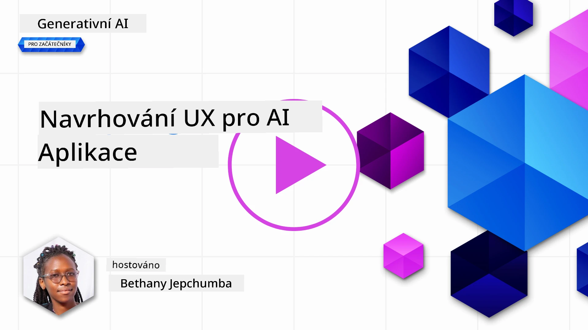
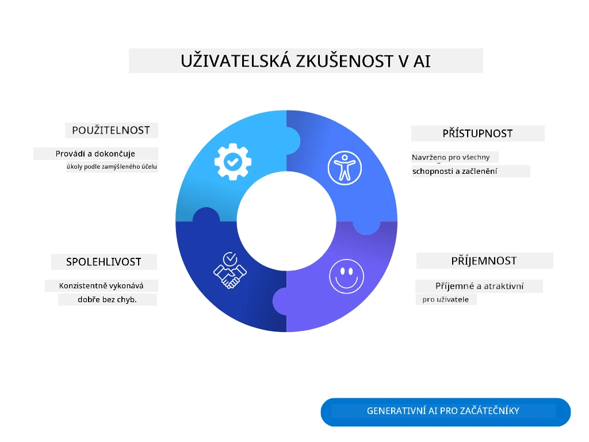
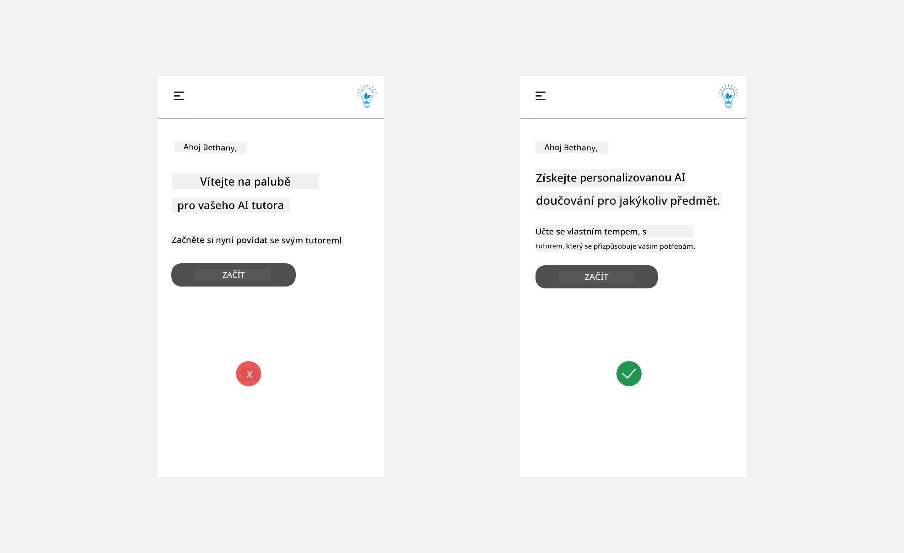
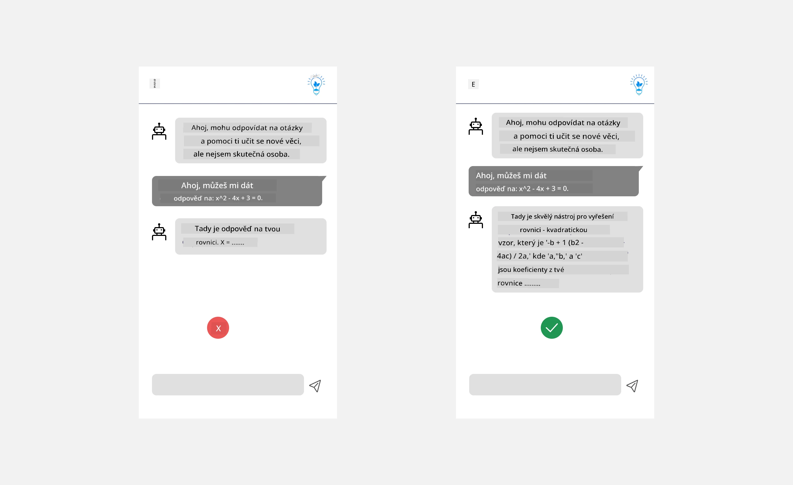
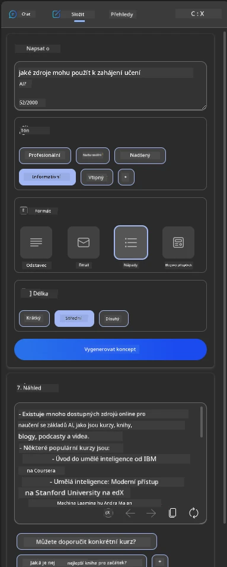
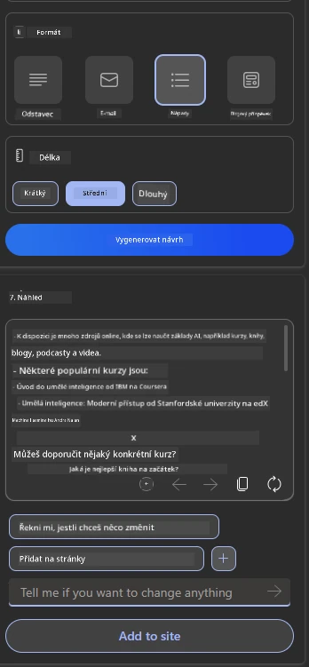
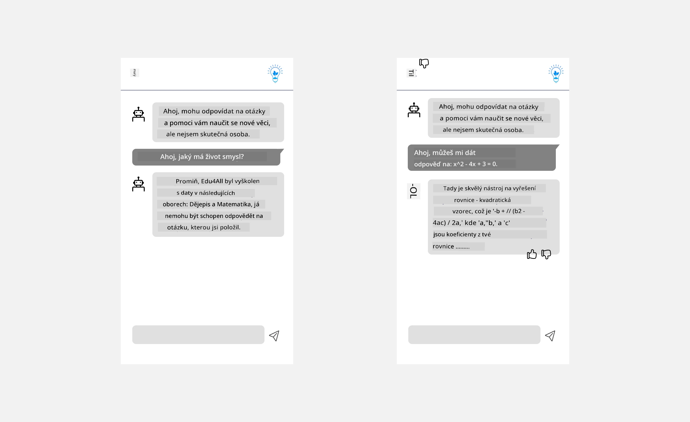

# Návrh UX pro AI aplikace

> _(Klikněte na obrázek výše pro zobrazení videa této lekce)_

Uživatelská zkušenost je velmi důležitý aspekt při vytváření aplikací. Uživatelé musí být schopni vaši aplikaci používat efektivním způsobem pro plnění úkolů. Efektivita je jedna věc, ale zároveň je třeba navrhnout aplikace tak, aby je mohl používat každý, aby byly _přístupné_. Tato kapitola se zaměří na tuto oblast, abyste nakonec navrhli aplikaci, kterou lidé mohou a chtějí používat.

## Úvod

Uživatelská zkušenost je to, jak uživatel interaguje a používá konkrétní produkt nebo službu, ať už jde o systém, nástroj nebo design. Při vývoji AI aplikací se vývojáři soustředí nejen na to, aby uživatelská zkušenost byla efektivní, ale také etická. V této lekci se zabýváme tím, jak vytvářet aplikace umělé inteligence (AI), které odpovídají potřebám uživatelů.

Lekce bude pokrývat následující oblasti:

- Úvod do uživatelské zkušenosti a pochopení potřeb uživatelů
- Návrh AI aplikací pro důvěru a transparentnost
- Návrh AI aplikací pro spolupráci a zpětnou vazbu

## Cíle učení

Po absolvování této lekce budete schopni:

- Pochopit, jak vytvářet AI aplikace, které splňují potřeby uživatelů.
- Navrhnout AI aplikace, které podporují důvěru a spolupráci.

### Požadované znalosti

Věnujte čas a přečtěte si více o [uživatelské zkušenosti a designovém myšlení](https://learn.microsoft.com/training/modules/ux-design?WT.mc_id=academic-105485-koreyst)

## Úvod do uživatelské zkušenosti a pochopení potřeb uživatelů

V našem fiktivním startupu zabývajícím se vzděláváním máme dva hlavní uživatele, učitele a studenty. Každý z těchto uživatelů má jedinečné potřeby. Uživatelsky orientovaný design dává na první místo uživatele a zajišťuje, že jsou produkty relevantní a prospěšné pro ty, pro které jsou určeny.

Aplikace by měla být **užitečná, spolehlivá, přístupná a příjemná**, aby poskytla dobrou uživatelskou zkušenost.

### Použitelnost

Být užitečný znamená, že aplikace má funkce odpovídající svému zamýšlenému účelu, například automatizaci procesu hodnocení nebo generování učebních kartiček pro opakování. Aplikace, která automatizuje hodnocení, by měla být schopna přesně a efektivně přiřadit skóre práci studentů na základě předem stanovených kritérií. Stejně tak aplikace generující opakovací kartičky by měla být schopná vytvářet relevantní a různorodé otázky na základě svých dat.

### Spolehlivost

Být spolehlivý znamená, že aplikace dokáže vykonávat svůj úkol konzistentně a bez chyb. Nicméně AI, stejně jako lidé, není dokonalá a může podléhat chybám. Aplikace mohou narazit na chyby nebo neočekávané situace, které vyžadují lidský zásah nebo opravu. Jak řešíte chyby? V poslední části této lekce pokryjeme, jak jsou systémy a aplikace AI navrženy pro spolupráci a zpětnou vazbu.

### Přístupnost

Být přístupný znamená rozšířit uživatelskou zkušenost i na uživatele s různými schopnostmi, včetně těch se zdravotním postižením, aby nikdo nebyl vynechán. Dodržováním zásad a pravidel přístupnosti se AI řešení stávají více inkluzivními, používatelnými a prospěšnými pro všechny uživatele.

### Příjemnost

Být příjemný znamená, že je aplikace radost ji používat. Příjemná uživatelská zkušenost může mít pozitivní dopad na uživatele, povzbuzovat je k opakovanému použití aplikace a zvyšovat příjmy podniku.

Ne všechny problémy lze vyřešit pomocí AI. AI pomáhá rozšířit vaši uživatelskou zkušenost, ať už automatizací manuálních úkolů nebo personalizací uživatelských zážitků.

## Návrh AI aplikací pro důvěru a transparentnost

Budování důvěry je klíčové při návrhu AI aplikací. Důvěra zajišťuje, že uživatel je přesvědčen, že aplikace zvládne práci, bude konzistentně dodávat výsledky a výsledky odpovídají potřebám uživatele. Riziko v této oblasti spočívá v nedůvěře a přílišné důvěře. Nedůvěra nastává, když uživatel nemá téměř žádnou důvěru v AI systém, což vede k odmítnutí vaší aplikace. Přílišná důvěra nastává, když uživatel přeceňuje schopnosti AI systému, což vede k přílišné důvěře uživatelů v AI systém. Například u automatizovaného systému hodnocení by přílišná důvěra mohla vést k tomu, že učitel nezkontroluje některé práce, aby se ujistil, že systém funguje správně. To by mohlo mít za následek nespravedlivé nebo nepřesné známky pro studenty či promarněné příležitosti pro zpětnou vazbu a zlepšení.

Dva způsoby, jak zajistit, aby byla důvěra středem návrhu, jsou vysvětlitelnost a kontrola.

### Vysvětlitelnost

Když AI pomáhá informovat rozhodnutí, například předávání znalostí budoucím generacím, je klíčové, aby učitelé a rodiče rozuměli tomu, jak jsou AI rozhodnutí přijímána. To je vysvětlitelnost – porozumění tomu, jak AI aplikace přijímají rozhodnutí. Návrh s ohledem na vysvětlitelnost zahrnuje přidání detailů, které ukazují, jak AI dospěla k výsledku. Publikum musí být informováno, že výstup je generován AI a nikoliv člověkem. Například namísto „Začněte nyní chatovat se svým lektorem“ říct „Použijte AI lektora, který se přizpůsobí vašim potřebám a pomáhá vám učit se vlastním tempem.“

Dalším příkladem je, jak AI používá uživatelská a osobní data. Například uživatel s personou studenta může mít omezení vyplývající z jeho persony. AI nemusí být schopna odhalit odpovědi na otázky, ale může uživatele vést, aby přemýšlel o tom, jak problém vyřešit.

Poslední klíčovou částí vysvětlitelnosti je zjednodušení vysvětlení. Studenti a učitelé nemusí být odborníky na AI, proto by vysvětlení toho, co aplikace může nebo nemůže dělat, měla být zjednodušená a snadno pochopitelná.

### Kontrola

Generativní AI vytváří spolupráci mezi AI a uživatelem, kde například uživatel může upravovat podněty pro různé výsledky. Navíc jakmile je výstup vygenerován, uživatelé by měli mít možnost výsledek upravit, čímž získávají pocit kontroly. Například při použití Microsoft Copilot (dříve Bing Chat) můžete upravit svůj podnět podle formátu, tónu a délky. Také můžete přidat změny do svého výstupu a modifikovat ho, jak je ukázáno níže:

Další funkcí v Microsoft Copilot, která uživateli umožňuje mít kontrolu nad aplikací, je možnost zapnout a vypnout používání dat AI. Pro školní aplikaci může student chtít použít své poznámky i zdroje učitele jako materiály pro opakování.

> Při navrhování AI aplikací je klíčové úmyslné jednání, aby uživatelé nepřeceňovali důvěru a nesetkávali se s nereálnými očekáváními schopností. Jedním ze způsobů, jak toho dosáhnout, je vytvořit tření mezi podněty a výsledky. Připomínat uživateli, že jde o AI a nikoliv o jiného člověka.

## Návrh AI aplikací pro spolupráci a zpětnou vazbu

Jak již bylo zmíněno, generativní AI vytváří spolupráci mezi uživatelem a AI. Většina interakcí spočívá v tom, že uživatel zadá podnět a AI vygeneruje výstup. Co když je výstup nesprávný? Jak aplikace zvládá chyby, pokud k nim dojde? Viní AI uživatele nebo si vezme čas na vysvětlení chyby?

AI aplikace by měly být navrženy tak, aby přijímaly a poskytovaly zpětnou vazbu. To nejen pomáhá systému AI zlepšovat se, ale také buduje důvěru uživatelů. V designu by měla být zahrnuta zpětnovazební smyčka, například jednoduchý palec nahoru nebo dolů k výstupu.

Dalším způsobem, jak to řešit, je jasně komunikovat schopnosti a omezení systému. Když uživatel udělá chybu a požaduje něco, co přesahuje možnosti AI, měl by existovat způsob, jak to řešit, jak je ukázáno níže.

Chyby systému jsou běžné u aplikací, kde uživatel může potřebovat pomoc s informacemi mimo rozsah AI nebo může existovat limit na počet otázek/předmětů, pro které může uživatel generovat souhrny. Například AI aplikace trénovaná na omezených předmětech, například Historii a Matematiku, nemusí být schopna zpracovat otázky z oblasti Geografie. Aby se tomu zabránilo, může AI systém reagovat například takto: „Omlouváme se, náš produkt byl natrénován na data z následujících předmětů....., nemohu odpovědět na vámi položenou otázku.“

AI aplikace nejsou dokonalé, proto mohou dělat chyby. Při navrhování aplikací byste měli zajistit prostor pro zpětnou vazbu od uživatelů a řešení chyb způsobem, který je jednoduchý a snadno vysvětlitelný.

## Zadání

Vezměte jakékoli AI aplikace, které jste dosud vytvořili, a zvažte implementaci níže uvedených kroků ve vaší aplikaci:

- **Příjemnost:** Zvažte, jak můžete svou aplikaci udělat příjemnější. Přidáváte vysvětlení všude? Podporujete uživatele v prozkoumávání? Jak formulujete chybové zprávy?

- **Použitelnost:** Budujete webovou aplikaci. Ujistěte se, že je vaše aplikace ovladatelná myší i klávesnicí.

- **Důvěra a transparentnost:** Nedůvěřujte AI a jejím výsledkům úplně, zvažte, jak byste přidali člověka do procesu pro ověření výsledků. Také zvažte a implementujte jiné způsoby, jak dosáhnout důvěry a transparentnosti.

- **Kontrola:** Dejte uživateli kontrolu nad daty, která do aplikace poskytuje. Umožněte uživateli přihlásit se k odebírání dat a odhlásit se od sběru dat v AI aplikaci.

<!-- ## [Post-lecture quiz](../../../12-designing-ux-for-ai-applications/quiz-url) -->

## Pokračujte ve svém učení!

Po dokončení této lekce si prohlédněte naši [kolekci Generative AI Learning](https://aka.ms/genai-collection?WT.mc_id=academic-105485-koreyst), abyste pokračovali ve zdokonalování svých znalostí generativní AI!

Přejděte k lekci 13, kde se podíváme na to, jak [zajišťovat AI aplikace](../13-securing-ai-applications/README.md?WT.mc_id=academic-105485-koreyst)!

---

<!-- CO-OP TRANSLATOR DISCLAIMER START -->
**Prohlášení o omezení odpovědnosti**:
Tento dokument byl přeložen pomocí AI překladatelské služby [Co-op Translator](https://github.com/Azure/co-op-translator). Přestože usilujeme o co největší přesnost, mějte prosím na paměti, že automatizované překlady mohou obsahovat chyby nebo nepřesnosti. Originální dokument v jeho mateřském jazyce by měl být považován za autoritativní zdroj. Pro kritické informace se doporučuje profesionální lidský překlad. Nejsme odpovědní za jakékoli nedorozumění nebo nesprávné interpretace vzniklé použitím tohoto překladu.
<!-- CO-OP TRANSLATOR DISCLAIMER END -->