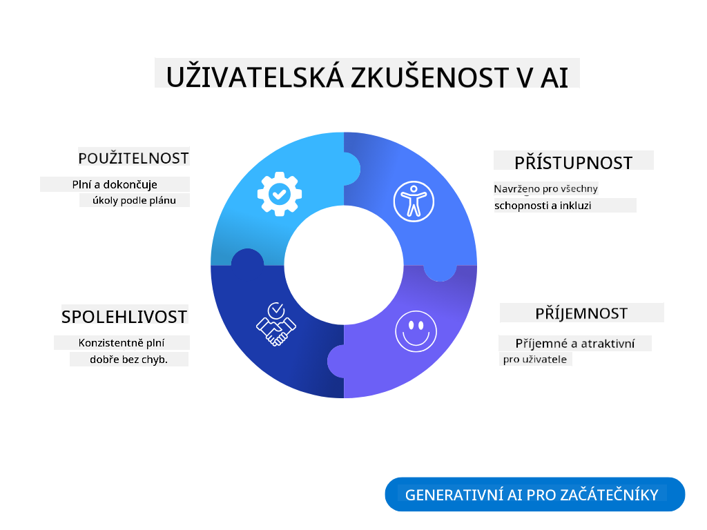
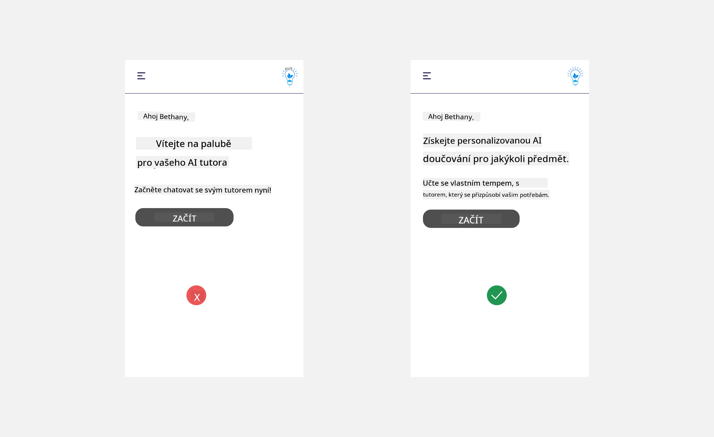
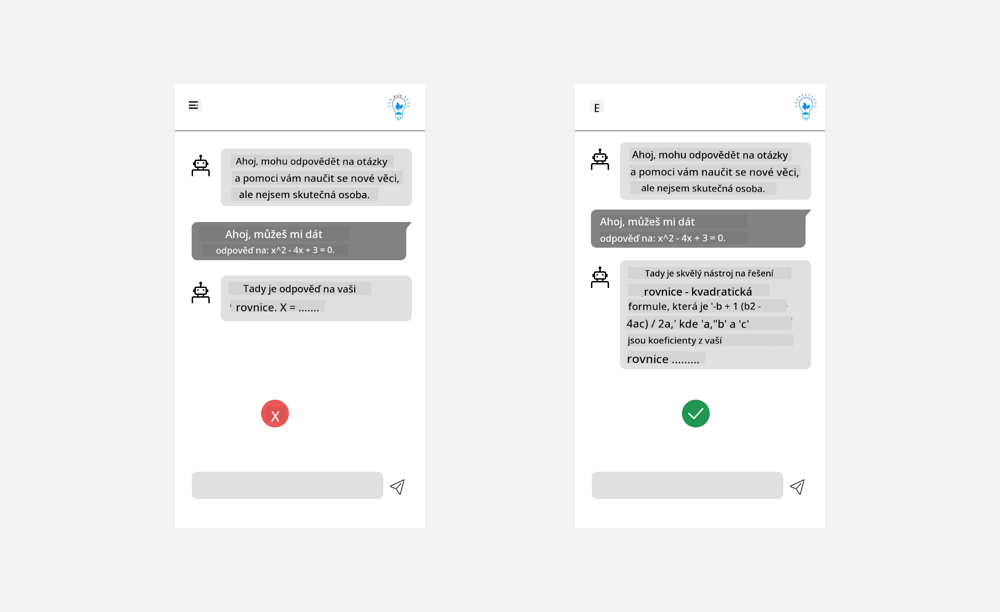
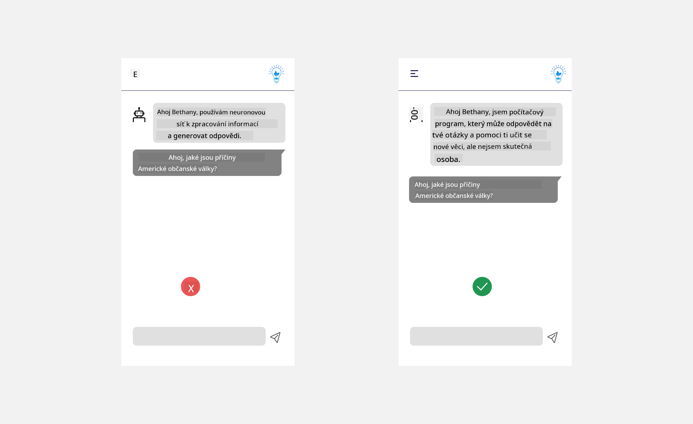
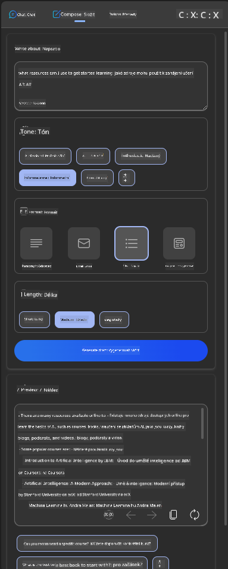
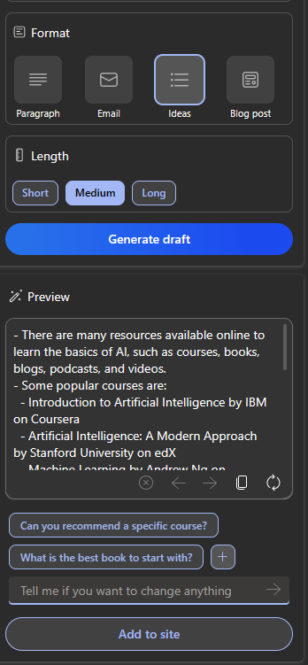
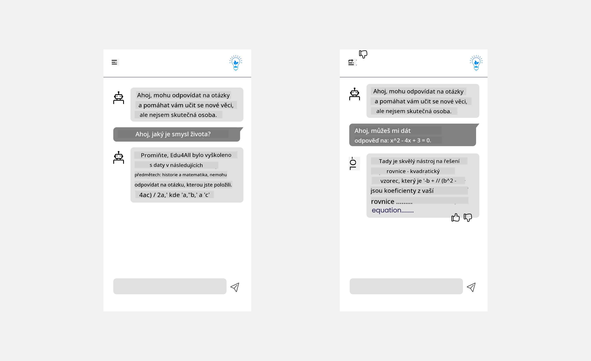

<!--
CO_OP_TRANSLATOR_METADATA:
{
  "original_hash": "ec385b41ee50579025d50cc03bfb3a25",
  "translation_date": "2025-06-25T20:31:52+00:00",
  "source_file": "12-designing-ux-for-ai-applications/README.md",
  "language_code": "cs"
}
-->
# Navrhování UX pro AI aplikace

> _(Klikněte na obrázek výše pro zhlédnutí videa této lekce)_

Uživatelská zkušenost je velmi důležitý aspekt při vytváření aplikací. Uživatelé potřebují být schopni používat vaši aplikaci efektivně k provádění úkolů. Být efektivní je jedna věc, ale také musíte navrhnout aplikace tak, aby je mohl používat každý, a učinit je tak _přístupnými_. Tato kapitola se zaměří na tuto oblast, abyste nakonec navrhli aplikaci, kterou lidé mohou a chtějí používat.

## Úvod

Uživatelská zkušenost je způsob, jakým uživatel interaguje a používá konkrétní produkt nebo službu, ať už jde o systém, nástroj nebo design. Při vývoji AI aplikací se vývojáři nezaměřují pouze na zajištění efektivní uživatelské zkušenosti, ale také etické. V této lekci se zaměříme na to, jak budovat aplikace umělé inteligence (AI), které řeší potřeby uživatelů.

Lekce pokryje následující oblasti:

- Úvod do uživatelské zkušenosti a pochopení potřeb uživatelů
- Navrhování AI aplikací pro důvěru a transparentnost
- Navrhování AI aplikací pro spolupráci a zpětnou vazbu

## Cíle učení

Po absolvování této lekce budete schopni:

- Pochopit, jak budovat AI aplikace, které splňují potřeby uživatelů.
- Navrhovat AI aplikace, které podporují důvěru a spolupráci.

### Předpoklad

Věnujte čas a přečtěte si více o [uživatelské zkušenosti a designovém myšlení.](https://learn.microsoft.com/training/modules/ux-design?WT.mc_id=academic-105485-koreyst)

## Úvod do uživatelské zkušenosti a pochopení potřeb uživatelů

V našem fiktivním vzdělávacím startupu máme dva hlavní uživatele, učitele a studenty. Každý z těchto uživatelů má jedinečné potřeby. Design zaměřený na uživatele upřednostňuje uživatele a zajišťuje, že produkty jsou relevantní a prospěšné pro ty, pro které jsou určeny.

Aplikace by měla být **užitečná, spolehlivá, přístupná a příjemná**, aby poskytovala dobrou uživatelskou zkušenost.

### Použitelnost

Být užitečný znamená, že aplikace má funkce, které odpovídají jejímu zamýšlenému účelu, jako je automatizace procesu hodnocení nebo generování kartiček pro opakování. Aplikace, která automatizuje proces hodnocení, by měla být schopna přesně a efektivně přiřadit body k práci studentů na základě předem definovaných kritérií. Podobně by aplikace, která generuje kartičky pro opakování, měla být schopna vytvářet relevantní a rozmanité otázky na základě svých dat.

### Spolehlivost

Být spolehlivý znamená, že aplikace může plnit svůj úkol konzistentně a bez chyb. Nicméně, AI stejně jako lidé není dokonalá a může být náchylná k chybám. Aplikace se mohou setkat s chybami nebo neočekávanými situacemi, které vyžadují lidský zásah nebo opravu. Jak zvládáte chyby? V poslední části této lekce se zaměříme na to, jak jsou AI systémy a aplikace navrženy pro spolupráci a zpětnou vazbu.

### Přístupnost

Být přístupný znamená rozšířit uživatelskou zkušenost na uživatele s různými schopnostmi, včetně těch s postižením, a zajistit, že nikdo nezůstane opomenut. Dodržováním zásad a pokynů přístupnosti se AI řešení stávají inkluzivnějšími, použitelnějšími a prospěšnějšími pro všechny uživatele.

### Příjemnost

Být příjemný znamená, že je aplikace příjemná k použití. Atraktivní uživatelská zkušenost může mít pozitivní dopad na uživatele, povzbuzovat je k návratu k aplikaci a zvyšovat obchodní výnosy.

Ne každý problém lze vyřešit pomocí AI. AI přichází na pomoc vaší uživatelské zkušenosti, ať už jde o automatizaci manuálních úkolů nebo personalizaci uživatelských zkušeností.

## Navrhování AI aplikací pro důvěru a transparentnost

Budování důvěry je při navrhování AI aplikací zásadní. Důvěra zajišťuje, že uživatel je přesvědčen, že aplikace úkol zvládne, dodá výsledky konzistentně a výsledky jsou takové, jaké uživatel potřebuje. Rizikem v této oblasti je nedůvěra a přehnaná důvěra. Nedůvěra nastává, když uživatel má malou nebo žádnou důvěru v AI systém, což vede k tomu, že uživatel vaši aplikaci odmítne. Přehnaná důvěra nastává, když uživatel přeceňuje schopnosti AI systému, což vede k tomu, že uživatelé důvěřují AI systému příliš. Například automatizovaný systém hodnocení v případě přehnané důvěry by mohl vést k tomu, že učitel nezkontroluje některé práce, aby se ujistil, že hodnotící systém funguje dobře. To by mohlo mít za následek nespravedlivé nebo nepřesné známky pro studenty nebo zmeškané příležitosti pro zpětnou vazbu a zlepšení.

Dva způsoby, jak zajistit, že důvěra je středem designu, jsou vysvětlitelnost a kontrola.

### Vysvětlitelnost

Když AI pomáhá informovat rozhodnutí, jako je předávání znalostí budoucím generacím, je zásadní, aby učitelé a rodiče rozuměli, jak AI rozhodnutí činí. To je vysvětlitelnost - porozumění tomu, jak AI aplikace činí rozhodnutí. Navrhování pro vysvětlitelnost zahrnuje přidání podrobností o příkladech toho, co AI aplikace může dělat. Například místo "Začněte s AI učitelem" může systém použít: "Shrňte si své poznámky pro snazší opakování pomocí AI."

Dalším příkladem je, jak AI používá uživatelská a osobní data. Například uživatel s personou studenta může mít omezení na základě své persony. AI nemusí být schopna odhalit odpovědi na otázky, ale může pomoci uživateli přemýšlet o tom, jak mohou problém vyřešit.

Poslední klíčovou částí vysvětlitelnosti je zjednodušení vysvětlení. Studenti a učitelé nemusí být odborníky na AI, proto by vysvětlení toho, co aplikace může nebo nemůže dělat, měla být zjednodušená a snadno pochopitelná.

### Kontrola

Generativní AI vytváří spolupráci mezi AI a uživatelem, kde například uživatel může upravovat výzvy pro různé výsledky. Kromě toho, jakmile je generován výstup, uživatelé by měli být schopni upravit výsledky, což jim dává pocit kontroly. Například při používání Bingu můžete přizpůsobit svou výzvu na základě formátu, tónu a délky. Kromě toho můžete přidat změny do svého výstupu a upravit výstup, jak je uvedeno níže:

Další funkcí v Bingu, která umožňuje uživateli mít kontrolu nad aplikací, je možnost přihlásit se a odhlásit se z dat, která AI používá. Pro školní aplikaci by student mohl chtít používat své poznámky i zdroje učitelů jako materiál pro opakování.

> Při navrhování AI aplikací je klíčová úmyslnost, aby se zajistilo, že uživatelé nebudou přehnaně důvěřovat a nastavovat nereálná očekávání ohledně schopností. Jedním ze způsobů, jak toho dosáhnout, je vytváření tření mezi výzvami a výsledky. Připomínání uživateli, že to je AI a ne jiný člověk.

## Navrhování AI aplikací pro spolupráci a zpětnou vazbu

Jak bylo zmíněno dříve, generativní AI vytváří spolupráci mezi uživatelem a AI. Většina interakcí probíhá s uživatelem zadávajícím výzvu a AI generující výstup. Co když je výstup nesprávný? Jak aplikace zvládá chyby, pokud k nim dojde? Obviňuje AI uživatele nebo si dává čas na vysvětlení chyby?

AI aplikace by měly být postaveny tak, aby přijímaly a poskytovaly zpětnou vazbu. To nejen pomáhá AI systému zlepšovat se, ale také buduje důvěru s uživateli. Ve designu by měl být zahrnut zpětnovazební okruh, příkladem může být jednoduché palec nahoru nebo dolů na výstupu.

Dalším způsobem, jak to zvládnout, je jasně komunikovat schopnosti a omezení systému. Když uživatel udělá chybu a požádá o něco nad rámec schopností AI, měla by existovat také cesta, jak to zvládnout, jak je ukázáno níže.

Systémové chyby jsou běžné u aplikací, kde uživatel může potřebovat pomoc s informacemi mimo rozsah AI nebo aplikace může mít omezení na to, kolik otázek/předmětů může uživatel generovat souhrny. Například AI aplikace trénovaná s daty na omezených předmětech, například Historie a Matematika, nemusí být schopna zvládnout otázky týkající se Geografie. Aby se tomu předešlo, AI systém může dát odpověď jako: "Promiňte, náš produkt byl trénován s daty v následujících předmětech....., nemohu odpovědět na otázku, kterou jste položili."

AI aplikace nejsou dokonalé, proto jsou náchylné k chybám. Při navrhování vašich aplikací byste měli zajistit, že vytvoříte prostor pro zpětnou vazbu od uživatelů a zvládání chyb způsobem, který je jednoduchý a snadno vysvětlitelný.

## Zadání

Vezměte jakékoliv AI aplikace, které jste dosud vytvořili, a zvažte implementaci následujících kroků do vaší aplikace:

- **Příjemnost:** Zvažte, jak můžete udělat vaši aplikaci příjemnější. Přidáváte vysvětlení všude? Povzbuzujete uživatele k prozkoumávání? Jak formulujete své chybové zprávy?

- **Použitelnost:** Vytváření webové aplikace. Ujistěte se, že vaše aplikace je navigovatelná jak myší, tak klávesnicí.

- **Důvěra a transparentnost:** Nedůvěřujte AI úplně a jejím výstupům, zvažte, jak byste přidali člověka do procesu, aby ověřil výstup. Také zvažte a implementujte další způsoby, jak dosáhnout důvěry a transparentnosti.

- **Kontrola:** Dejte uživateli kontrolu nad daty, která poskytuje aplikaci. Implementujte způsob, jakým se uživatel může přihlásit a odhlásit ze sběru dat v AI aplikaci.

## Pokračujte ve svém učení!

Po dokončení této lekce si prohlédněte naši [kolekci Generative AI Learning](https://aka.ms/genai-collection?WT.mc_id=academic-105485-koreyst), abyste pokračovali v rozšiřování svých znalostí o Generative AI!

Přejděte na Lekci 13, kde se podíváme na to, jak [zabezpečit AI aplikace](../13-securing-ai-applications/README.md?WT.mc_id=academic-105485-koreyst)!

**Upozornění**:  
Tento dokument byl přeložen pomocí AI překladové služby [Co-op Translator](https://github.com/Azure/co-op-translator). I když se snažíme o přesnost, vezměte prosím na vědomí, že automatizované překlady mohou obsahovat chyby nebo nepřesnosti. Původní dokument v jeho rodném jazyce by měl být považován za autoritativní zdroj. Pro kritické informace se doporučuje profesionální lidský překlad. Neodpovídáme za žádné nedorozumění nebo nesprávné interpretace vyplývající z použití tohoto překladu.