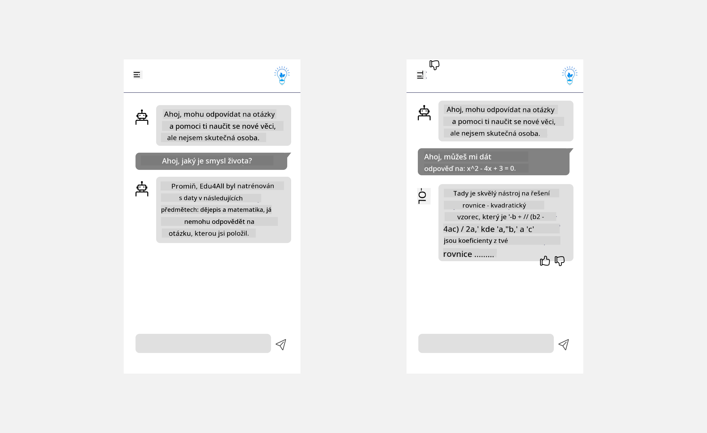

<!--
CO_OP_TRANSLATOR_METADATA:
{
  "original_hash": "ec385b41ee50579025d50cc03bfb3a25",
  "translation_date": "2025-07-09T15:03:40+00:00",
  "source_file": "12-designing-ux-for-ai-applications/README.md",
  "language_code": "cs"
}
-->
# Návrh UX pro AI aplikace

> _(Klikněte na obrázek výše pro zhlédnutí videa této lekce)_

Uživatelská zkušenost je velmi důležitým aspektem při tvorbě aplikací. Uživatelé musí být schopni efektivně používat vaši aplikaci k plnění úkolů. Efektivita je jedna věc, ale také je potřeba navrhnout aplikace tak, aby je mohl používat každý, tedy aby byly _přístupné_. Tato kapitola se zaměří právě na tuto oblast, abyste nakonec navrhli aplikaci, kterou lidé budou chtít a moci používat.

## Úvod

Uživatelská zkušenost popisuje, jak uživatel interaguje a používá konkrétní produkt nebo službu, ať už jde o systém, nástroj nebo design. Při vývoji AI aplikací se vývojáři zaměřují nejen na to, aby byla uživatelská zkušenost efektivní, ale také etická. V této lekci se naučíme, jak vytvářet aplikace umělé inteligence (AI), které odpovídají potřebám uživatelů.

Lekce pokryje následující oblasti:

- Úvod do uživatelské zkušenosti a porozumění potřebám uživatelů
- Návrh AI aplikací pro důvěru a transparentnost
- Návrh AI aplikací pro spolupráci a zpětnou vazbu

## Cíle učení

Po absolvování této lekce budete schopni:

- Pochopit, jak vytvářet AI aplikace, které odpovídají potřebám uživatelů.
- Navrhovat AI aplikace, které podporují důvěru a spolupráci.

### Předpoklady

Věnujte čas a přečtěte si více o [uživatelské zkušenosti a designovém myšlení.](https://learn.microsoft.com/training/modules/ux-design?WT.mc_id=academic-105485-koreyst)

## Úvod do uživatelské zkušenosti a porozumění potřebám uživatelů

V našem fiktivním vzdělávacím startupu máme dva hlavní uživatele – učitele a studenty. Každý z nich má své specifické potřeby. Uživatelsky orientovaný design klade uživatele na první místo a zajišťuje, že produkty jsou relevantní a prospěšné pro ty, pro které jsou určeny.

Aplikace by měla být **užitečná, spolehlivá, přístupná a příjemná**, aby poskytla dobrou uživatelskou zkušenost.

### Použitelnost

Být užitečný znamená, že aplikace má funkce odpovídající svému účelu, například automatizaci hodnocení nebo generování kartiček pro opakování. Aplikace, která automatizuje hodnocení, by měla být schopna přesně a efektivně přiřazovat známky na základě předem definovaných kritérií. Podobně aplikace generující kartičky by měla vytvářet relevantní a různorodé otázky na základě svých dat.

### Spolehlivost

Být spolehlivý znamená, že aplikace dokáže úkol plnit konzistentně a bez chyb. AI však, stejně jako lidé, není dokonalá a může chybovat. Aplikace mohou narazit na chyby nebo neočekávané situace, které vyžadují lidský zásah nebo opravu. Jak řešíte chyby? V poslední části této lekce se podíváme, jak jsou AI systémy a aplikace navrženy pro spolupráci a zpětnou vazbu.

### Přístupnost

Být přístupný znamená rozšířit uživatelskou zkušenost i na uživatele s různými schopnostmi, včetně osob s postižením, aby nikdo nebyl vynechán. Dodržováním zásad a pravidel přístupnosti se AI řešení stávají inkluzivnějšími, snadněji použitelnými a prospěšnými pro všechny uživatele.

### Příjemnost

Být příjemný znamená, že je aplikace radost používat. Příjemná uživatelská zkušenost může mít pozitivní dopad na uživatele, motivovat je k opakovanému používání aplikace a tím zvyšovat příjmy.

Ne každý problém lze vyřešit pomocí AI. AI slouží k doplnění uživatelské zkušenosti, například automatizací manuálních úkolů nebo personalizací uživatelských zážitků.

## Návrh AI aplikací pro důvěru a transparentnost

Budování důvěry je klíčové při návrhu AI aplikací. Důvěra zajišťuje, že uživatel věří, že aplikace splní úkol, bude konzistentně poskytovat výsledky a tyto výsledky odpovídají jeho potřebám. Rizikem v této oblasti je nedůvěra a přehnaná důvěra. Nedůvěra nastává, když uživatel má malou nebo žádnou důvěru v AI systém, což vede k odmítnutí aplikace. Přehnaná důvěra nastává, když uživatel přeceňuje schopnosti AI systému, což vede k přílišné důvěře. Například u automatizovaného systému hodnocení může přehnaná důvěra vést k tomu, že učitel nezkontroluje některé práce, aby ověřil správnost hodnocení. To může mít za následek nespravedlivé nebo nepřesné známky, nebo zmeškané příležitosti pro zpětnou vazbu a zlepšení.

Dva způsoby, jak zajistit, aby důvěra byla středobodem návrhu, jsou vysvětlitelnost a kontrola.

### Vysvětlitelnost

Když AI pomáhá při rozhodování, například při předávání znalostí budoucím generacím, je důležité, aby učitelé a rodiče rozuměli, jak AI rozhodnutí vznikají. To je vysvětlitelnost – pochopení, jak AI aplikace přijímají rozhodnutí. Návrh pro vysvětlitelnost zahrnuje přidání příkladů toho, co AI aplikace umí. Například místo „Začněte s AI učitelem“ může systém použít: „Shrňte své poznámky pro snadnější opakování pomocí AI.“

Dalším příkladem je, jak AI využívá uživatelská a osobní data. Například uživatel s rolí studenta může mít omezení vyplývající z jeho role. AI nemusí být schopna odhalit odpovědi na otázky, ale může uživatele vést, jak přemýšlet o řešení problému.

Poslední klíčovou součástí vysvětlitelnosti je zjednodušení vysvětlení. Studenti a učitelé nemusí být odborníky na AI, proto by vysvětlení, co aplikace umí nebo neumí, měla být jednoduchá a snadno pochopitelná.

### Kontrola

Generativní AI vytváří spolupráci mezi AI a uživatelem, kde například uživatel může upravovat vstupy pro různé výsledky. Navíc, jakmile je výstup vytvořen, uživatelé by měli mít možnost jej upravit, což jim dává pocit kontroly. Například při používání Bing můžete přizpůsobit svůj dotaz podle formátu, tónu a délky. Také můžete přidávat změny do výstupu a upravovat jej, jak je ukázáno níže:

Další funkcí v Bingu, která uživateli umožňuje kontrolu nad aplikací, je možnost zapnout a vypnout používání dat AI. Ve školní aplikaci může student chtít použít své poznámky i učitelovy zdroje jako materiál pro opakování.

> Při návrhu AI aplikací je klíčové záměrné přistupování, aby uživatelé nepřeháněli důvěru a nevytvářeli si nereálná očekávání ohledně schopností AI. Jedním ze způsobů je vytvořit určité tření mezi vstupy a výsledky, připomínající uživateli, že jde o AI, nikoli o jiného člověka.

## Návrh AI aplikací pro spolupráci a zpětnou vazbu

Jak již bylo zmíněno, generativní AI vytváří spolupráci mezi uživatelem a AI. Většina interakcí spočívá v tom, že uživatel zadá dotaz a AI vygeneruje odpověď. Co když je výstup nesprávný? Jak aplikace řeší chyby, pokud nastanou? Obviňuje AI uživatele, nebo si najde čas vysvětlit chybu?

AI aplikace by měly být navrženy tak, aby přijímaly a poskytovaly zpětnou vazbu. To nejen pomáhá AI systému zlepšovat se, ale také buduje důvěru uživatelů. V designu by měl být zahrnut zpětnovazební mechanismus, například jednoduché palec nahoru nebo dolů u výstupu.

Další možností, jak to řešit, je jasně komunikovat schopnosti a omezení systému. Když uživatel udělá chybu a požádá o něco, co AI neumí, měla by existovat možnost, jak to řešit, jak je ukázáno níže.

Systémové chyby jsou běžné u aplikací, kde uživatel může potřebovat pomoc s informacemi mimo rozsah AI, nebo aplikace může mít omezení, kolik otázek/předmětů může uživatel generovat. Například AI aplikace trénovaná na omezených předmětech, například dějepis a matematika, nemusí být schopna zpracovat otázky z geografie. Aby se tomu předešlo, může AI systém odpovědět například: „Omlouváme se, náš produkt byl trénován na následujících předmětech..., na vaši otázku nemohu odpovědět.“

AI aplikace nejsou dokonalé, proto budou dělat chyby. Při návrhu aplikací byste měli zajistit prostor pro zpětnou vazbu od uživatelů a řešení chyb způsobem, který je jednoduchý a snadno vysvětlitelný.

## Úkol

Vezměte jakoukoli AI aplikaci, kterou jste dosud vytvořili, a zvažte implementaci následujících kroků:

- **Příjemnost:** Zamyslete se, jak můžete svou aplikaci udělat příjemnější. Přidáváte všude vysvětlení? Povzbuzujete uživatele k objevování? Jak formulujete chybové zprávy?

- **Použitelnost:** Pokud vytváříte webovou aplikaci, ujistěte se, že je ovladatelná jak myší, tak klávesnicí.

- **Důvěra a transparentnost:** Nedůvěřujte AI a jejím výsledkům úplně, zvažte, jak do procesu zapojit člověka, který ověří výstup. Také zvažte a implementujte další způsoby, jak dosáhnout důvěry a transparentnosti.

- **Kontrola:** Dejte uživateli kontrolu nad daty, která aplikaci poskytuje. Implementujte možnost, aby uživatel mohl zapnout nebo vypnout sběr dat v AI aplikaci.

## Pokračujte ve svém vzdělávání!

Po dokončení této lekce si prohlédněte naši [kolekci Generative AI Learning](https://aka.ms/genai-collection?WT.mc_id=academic-105485-koreyst) a pokračujte ve zvyšování svých znalostí o generativní AI!

Přejděte k lekci 13, kde se podíváme na to, jak [zabezpečit AI aplikace](../13-securing-ai-applications/README.md?WT.mc_id=academic-105485-koreyst)!

**Prohlášení o vyloučení odpovědnosti**:  
Tento dokument byl přeložen pomocí AI překladatelské služby [Co-op Translator](https://github.com/Azure/co-op-translator). I když usilujeme o přesnost, mějte prosím na paměti, že automatizované překlady mohou obsahovat chyby nebo nepřesnosti. Původní dokument v jeho mateřském jazyce by měl být považován za závazný zdroj. Pro důležité informace se doporučuje profesionální lidský překlad. Nejsme odpovědní za jakékoliv nedorozumění nebo nesprávné výklady vyplývající z použití tohoto překladu.