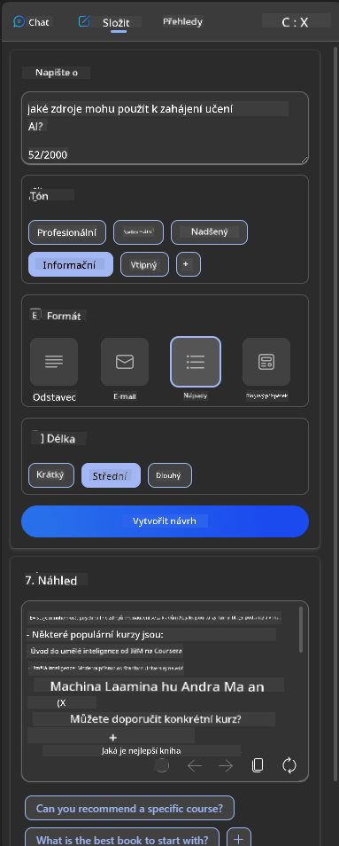
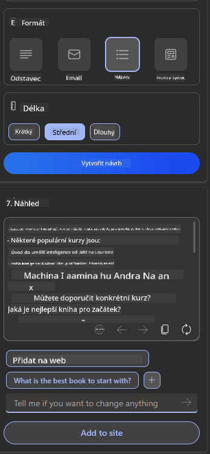

<!--
CO_OP_TRANSLATOR_METADATA:
{
  "original_hash": "747668e4c53d067369f06e9ec2e6313e",
  "translation_date": "2025-08-26T19:02:40+00:00",
  "source_file": "12-designing-ux-for-ai-applications/README.md",
  "language_code": "cs"
}
-->
# Navrhování UX pro AI aplikace

> _(Klikněte na obrázek výše pro zhlédnutí videa k této lekci)_

Uživatelská zkušenost je velmi důležitým aspektem při tvorbě aplikací. Uživatelé musí být schopni vaši aplikaci efektivně používat k plnění úkolů. Efektivita je jedna věc, ale je také potřeba navrhovat aplikace tak, aby je mohl používat každý, tedy aby byly _přístupné_. Tato kapitola se zaměří právě na tuto oblast, abyste nakonec navrhli aplikaci, kterou lidé mohou a chtějí používat.

## Úvod

Uživatelská zkušenost je způsob, jakým uživatel interaguje s konkrétním produktem nebo službou, ať už jde o systém, nástroj nebo design. Při vývoji AI aplikací se vývojáři nezaměřují jen na efektivitu uživatelské zkušenosti, ale také na její etičnost. V této lekci se zaměříme na to, jak stavět aplikace s umělou inteligencí (AI), které odpovídají potřebám uživatelů.

Lekce pokrývá následující oblasti:

- Úvod do uživatelské zkušenosti a pochopení potřeb uživatelů
- Navrhování AI aplikací pro důvěru a transparentnost
- Navrhování AI aplikací pro spolupráci a zpětnou vazbu

## Cíle lekce

Po absolvování této lekce budete schopni:

- Pochopit, jak stavět AI aplikace, které odpovídají potřebám uživatelů.
- Navrhovat AI aplikace, které podporují důvěru a spolupráci.

### Předpoklad

Věnujte chvíli a přečtěte si více o [uživatelské zkušenosti a design thinkingu.](https://learn.microsoft.com/training/modules/ux-design?WT.mc_id=academic-105485-koreyst)

## Úvod do uživatelské zkušenosti a pochopení potřeb uživatelů

V našem fiktivním vzdělávacím startupu máme dva hlavní uživatele: učitele a studenty. Každý z těchto uživatelů má své specifické potřeby. Design zaměřený na uživatele klade důraz na to, aby produkty byly relevantní a přínosné pro ty, kterým jsou určeny.

Aplikace by měla být **užitečná, spolehlivá, přístupná a příjemná**, aby poskytovala dobrou uživatelskou zkušenost.

### Použitelnost

Být užitečný znamená, že aplikace má funkce odpovídající svému účelu, například automatizaci hodnocení nebo generování kartiček pro opakování. Aplikace, která automatizuje hodnocení, by měla být schopna přesně a efektivně přiřazovat body studentům podle předem daných kritérií. Podobně aplikace, která generuje kartičky na opakování, by měla umět vytvářet relevantní a různorodé otázky na základě svých dat.

### Spolehlivost

Být spolehlivý znamená, že aplikace dokáže svou úlohu plnit konzistentně a bez chyb. AI, stejně jako lidé, není dokonalá a může chybovat. Aplikace se mohou setkat s chybami nebo nečekanými situacemi, které vyžadují zásah nebo opravu od člověka. Jak řešit chyby? V poslední části této lekce se budeme věnovat tomu, jak jsou AI systémy a aplikace navrhovány pro spolupráci a zpětnou vazbu.

### Přístupnost

Být přístupný znamená rozšířit uživatelskou zkušenost i na uživatele s různými schopnostmi, včetně těch se zdravotním postižením, aby nikdo nebyl vynechán. Dodržováním zásad a pravidel přístupnosti se AI řešení stávají inkluzivnějšími, použitelnějšími a přínosnějšími pro všechny uživatele.

### Příjemnost

Být příjemný znamená, že je aplikace radost používat. Příjemná uživatelská zkušenost může mít pozitivní dopad na uživatele, motivovat ho k návratu do aplikace a zvýšit příjmy firmy.

Ne každý problém lze vyřešit pomocí AI. AI slouží k vylepšení uživatelské zkušenosti, například automatizací manuálních úkolů nebo personalizací uživatelského prostředí.

## Navrhování AI aplikací pro důvěru a transparentnost

Budování důvěry je při navrhování AI aplikací zásadní. Důvěra zajišťuje, že uživatel věří, že aplikace úkol zvládne, bude poskytovat výsledky konzistentně a výsledky budou odpovídat jeho potřebám. Rizikem v této oblasti je nedůvěra a přehnaná důvěra. Nedůvěra nastává, když uživatel AI systému příliš nevěří nebo mu nevěří vůbec, což vede k odmítnutí vaší aplikace. Přehnaná důvěra nastává, když uživatel přeceňuje schopnosti AI systému a důvěřuje mu až příliš. Například v případě automatizovaného hodnocení může přehnaná důvěra vést k tomu, že učitel nebude kontrolovat některé práce, aby ověřil, že systém hodnotí správně. To může vést k nespravedlivým nebo nepřesným známkám, případně k promarněným příležitostem pro zpětnou vazbu a zlepšení.

Dva způsoby, jak zajistit, že důvěra bude v centru návrhu, jsou vysvětlitelnost a kontrola.

### Vysvětlitelnost

Když AI pomáhá při rozhodování, například při předávání znalostí budoucím generacím, je důležité, aby učitelé a rodiče rozuměli tomu, jak AI rozhodnutí dělá. To je vysvětlitelnost – pochopení, jak AI aplikace dochází ke svým rozhodnutím. Návrh s ohledem na vysvětlitelnost zahrnuje přidání detailů, které ukazují, jak AI došla k výsledku. Uživatelé musí vědět, že výstup je generován AI, a ne člověkem. Například místo „Začněte si teď povídat se svým tutorem“ použijte „Využijte AI tutora, který se přizpůsobí vašim potřebám a pomůže vám učit se vlastním tempem.“

Dalším příkladem je, jak AI využívá uživatelská a osobní data. Například uživatel s personou studenta může mít omezení podle své role. AI nemusí být schopna prozradit odpovědi na otázky, ale může uživatele navést, jak problém vyřešit.

Poslední klíčovou částí vysvětlitelnosti je zjednodušení vysvětlení. Studenti a učitelé nemusí být experti na AI, proto by vysvětlení toho, co aplikace umí a neumí, měla být jednoduchá a snadno pochopitelná.

### Kontrola

Generativní AI vytváří spolupráci mezi AI a uživatelem, kdy například uživatel může upravovat zadání pro různé výsledky. Jakmile je výstup vygenerován, uživatelé by měli mít možnost výsledek upravit, což jim dává pocit kontroly. Například při používání Bingu si můžete přizpůsobit zadání podle formátu, tónu a délky. Navíc můžete výstup dále upravovat, jak je vidět níže:

Další funkcí v Bingu, která uživateli umožňuje mít kontrolu nad aplikací, je možnost zapnout nebo vypnout využívání dat AI. Ve školní aplikaci může student chtít použít své poznámky i materiály od učitele jako podklady pro opakování.

> Při navrhování AI aplikací je důležité záměrně předcházet přehnané důvěře uživatelů a nereálným očekáváním ohledně schopností AI. Jedním ze způsobů je vytvořit určité tření mezi zadáním a výsledkem. Připomínejte uživateli, že jde o AI, ne o člověka.

## Navrhování AI aplikací pro spolupráci a zpětnou vazbu

Jak už bylo zmíněno, generativní AI vytváří spolupráci mezi uživatelem a AI. Nejčastěji uživatel zadá prompt a AI vygeneruje výstup. Co když je výstup chybný? Jak aplikace řeší chyby, pokud nastanou? Obviňuje AI uživatele, nebo si najde čas na vysvětlení chyby?

AI aplikace by měly být navrženy tak, aby uměly přijímat i poskytovat zpětnou vazbu. To nejen pomáhá AI systému se zlepšovat, ale také buduje důvěru uživatelů. Do návrhu by měla být zahrnuta zpětná vazba, například jednoduché tlačítko palec nahoru nebo dolů u výstupu.

Dalším způsobem je jasně komunikovat schopnosti a omezení systému. Když uživatel udělá chybu a požaduje něco mimo možnosti AI, měla by existovat možnost, jak tuto situaci řešit, jak je vidět níže.

Systémové chyby jsou u aplikací běžné, například když uživatel potřebuje informace mimo rozsah AI, nebo když má aplikace omezení na počet otázek/předmětů, ze kterých může generovat shrnutí. Například AI aplikace natrénovaná jen na omezený počet předmětů, například dějepis a matematiku, nemusí zvládnout otázky z geografie. V takovém případě může AI odpovědět například: „Omlouváme se, náš produkt je natrénován na následující předměty....., na vaši otázku nemohu odpovědět.“

AI aplikace nejsou dokonalé, proto se chyby nevyhnutelně objeví. Při navrhování aplikací byste měli zajistit prostor pro zpětnou vazbu od uživatelů a jednoduché a srozumitelné řešení chyb.

## Úkol

Vezměte jakoukoli AI aplikaci, kterou jste dosud vytvořili, a zkuste do ní implementovat následující kroky:

- **Příjemnost:** Zamyslete se, jak můžete svou aplikaci udělat příjemnější. Přidáváte vysvětlení všude, kde je to potřeba? Povzbuzujete uživatele k objevování? Jak formulujete chybové zprávy?

- **Použitelnost:** Stavíte webovou aplikaci. Ujistěte se, že je vaše aplikace ovladatelná jak myší, tak klávesnicí.

- **Důvěra a transparentnost:** Nespoléhejte se slepě na AI a její výstupy, zvažte, jak byste do procesu zapojili člověka pro ověření výsledků. Zamyslete se také nad dalšími způsoby, jak dosáhnout důvěry a transparentnosti.

- **Kontrola:** Dejte uživateli kontrolu nad daty, která aplikaci poskytuje. Implementujte možnost, aby uživatel mohl souhlasit nebo nesouhlasit se sběrem dat v AI aplikaci.

## Pokračujte ve studiu!

Po dokončení této lekce se podívejte na naši [sbírku kurzů o generativní AI](https://aka.ms/genai-collection?WT.mc_id=academic-105485-koreyst) a dále rozvíjejte své znalosti o generativní AI!

Pokračujte na Lekci 13, kde se podíváme na to, jak [zabezpečit AI aplikace](../13-securing-ai-applications/README.md?WT.mc_id=academic-105485-koreyst)!

---

**Prohlášení**:  
Tento dokument byl přeložen pomocí AI překladatelské služby [Co-op Translator](https://github.com/Azure/co-op-translator). Přestože se snažíme o přesnost, mějte prosím na paměti, že automatizované překlady mohou obsahovat chyby nebo nepřesnosti. Za autoritativní zdroj by měl být považován původní dokument v jeho rodném jazyce. Pro kritické informace doporučujeme profesionální lidský překlad. Neodpovídáme za žádné nedorozumění nebo nesprávné výklady vzniklé použitím tohoto překladu.