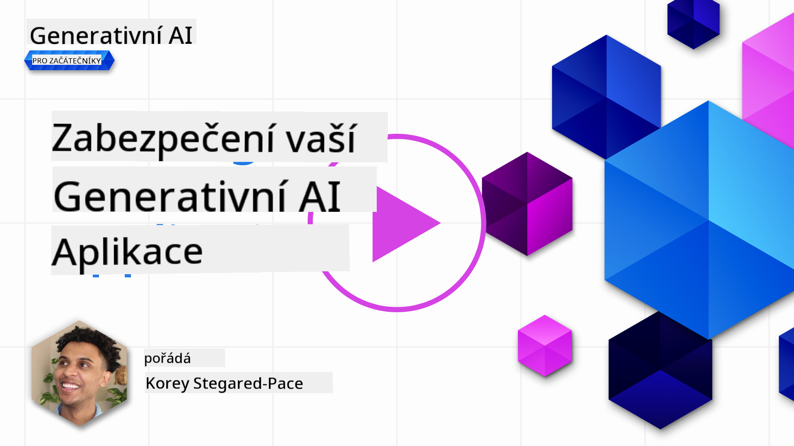
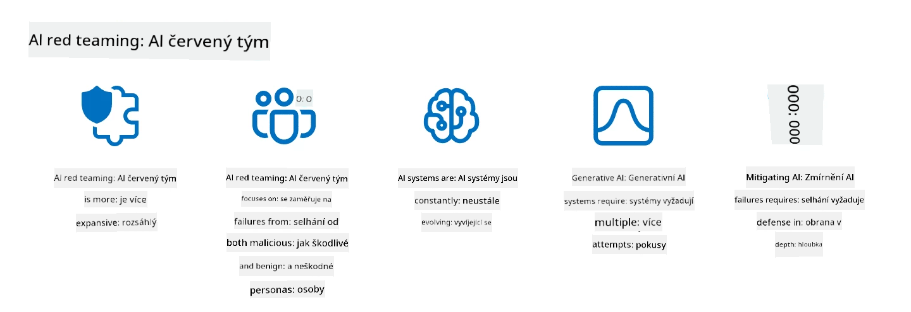

<!--
CO_OP_TRANSLATOR_METADATA:
{
  "original_hash": "f3cac698e9eea47dd563633bd82daf8c",
  "translation_date": "2025-07-09T15:38:00+00:00",
  "source_file": "13-securing-ai-applications/README.md",
  "language_code": "cs"
}
-->
# Zabezpečení vašich generativních AI aplikací

## Úvod

Tato lekce pokryje:

- Bezpečnost v kontextu AI systémů.
- Běžná rizika a hrozby pro AI systémy.
- Metody a úvahy pro zabezpečení AI systémů.

## Cíle učení

Po dokončení této lekce budete rozumět:

- Hrozbám a rizikům AI systémů.
- Běžným metodám a postupům zabezpečení AI systémů.
- Jak implementace bezpečnostního testování může zabránit neočekávaným výsledkům a ztrátě důvěry uživatelů.

## Co znamená bezpečnost v kontextu generativní AI?

S tím, jak technologie umělé inteligence (AI) a strojového učení (ML) stále více ovlivňují náš život, je klíčové chránit nejen data zákazníků, ale i samotné AI systémy. AI/ML se stále častěji používá při rozhodování s vysokou hodnotou v odvětvích, kde špatné rozhodnutí může mít vážné následky.

Zde jsou hlavní body k zamyšlení:

- **Dopad AI/ML**: AI/ML mají výrazný vliv na každodenní život, a proto je jejich ochrana nezbytná.
- **Výzvy v bezpečnosti**: Tento dopad vyžaduje náležitou pozornost, aby bylo možné chránit AI produkty před sofistikovanými útoky, ať už od trollů nebo organizovaných skupin.
- **Strategické problémy**: Technologický průmysl musí aktivně řešit strategické výzvy, aby zajistil dlouhodobou bezpečnost zákazníků a ochranu dat.

Navíc modely strojového učení většinou nedokážou rozlišit mezi škodlivými vstupy a neškodnými anomáliemi. Významná část tréninkových dat pochází z nekontrolovaných, nemoderovaných veřejných datasetů, které jsou otevřené příspěvkům třetích stran. Útočníci nemusí dataset kompromitovat, když do něj mohou volně přispívat. Postupem času se data s nízkou důvěrou, která jsou škodlivá, mohou stát daty s vysokou důvěrou, pokud struktura/formát dat zůstane správný.

Proto je zásadní zajistit integritu a ochranu datových úložišť, která vaše modely používají k rozhodování.

## Pochopení hrozeb a rizik AI

V oblasti AI a souvisejících systémů je nejvýznamnější bezpečnostní hrozbou dnes otrava dat (data poisoning). Otrava dat nastává, když někdo úmyslně změní informace používané k tréninku AI, což způsobí, že AI dělá chyby. To je způsobeno absencí standardizovaných metod detekce a zmírnění, spolu s naší závislostí na nedůvěryhodných nebo nekontrolovaných veřejných datasetech pro trénink. Pro udržení integrity dat a zabránění chybného tréninku je klíčové sledovat původ a historii vašich dat. Jinak platí staré přísloví „špatná data vedou k špatným výsledkům“, což vede ke zhoršení výkonu modelu.

Zde jsou příklady, jak může otrava dat ovlivnit vaše modely:

1. **Převrácení štítků (Label Flipping)**: V úloze binární klasifikace útočník úmyslně změní štítky malé části tréninkových dat. Například neškodné vzorky jsou označeny jako škodlivé, což vede k nesprávným asociacím modelu.\
   **Příklad**: Spamový filtr chybně označí legitimní e-maily jako spam kvůli manipulovaným štítkům.
2. **Otrava rysů (Feature Poisoning)**: Útočník jemně upraví rysy v tréninkových datech, aby zavodil zaujatost nebo zmátl model.\
   **Příklad**: Přidání irelevantních klíčových slov do popisů produktů za účelem manipulace s doporučovacími systémy.
3. **Vkládání dat (Data Injection)**: Vkládání škodlivých dat do tréninkové sady za účelem ovlivnění chování modelu.\
   **Příklad**: Zavedení falešných uživatelských recenzí k ovlivnění výsledků analýzy sentimentu.
4. **Útoky zadními vrátky (Backdoor Attacks)**: Útočník vloží skrytý vzor (zadní vrátka) do tréninkových dat. Model se naučí tento vzor rozpoznat a při jeho aktivaci se chová škodlivě.\
   **Příklad**: Systém rozpoznávání obličejů trénovaný na obrázcích se zadními vrátky, který nesprávně identifikuje konkrétní osobu.

Společnost MITRE vytvořila [ATLAS (Adversarial Threat Landscape for Artificial-Intelligence Systems)](https://atlas.mitre.org/?WT.mc_id=academic-105485-koreyst), databázi taktik a technik používaných útočníky při reálných útocích na AI systémy.

> Počet zranitelností v AI systémech roste, protože začlenění AI rozšiřuje povrch útoku stávajících systémů nad rámec tradičních kybernetických útoků. Vyvinuli jsme ATLAS, abychom zvýšili povědomí o těchto jedinečných a vyvíjejících se zranitelnostech, protože globální komunita stále více integruje AI do různých systémů. ATLAS je modelován podle rámce MITRE ATT&CK® a jeho taktiky, techniky a postupy (TTP) doplňují ty v ATT&CK.

Podobně jako rámec MITRE ATT&CK®, který se hojně využívá v tradiční kybernetické bezpečnosti pro plánování scénářů pokročilých hrozeb, ATLAS poskytuje snadno vyhledatelnou sadu TTP, která pomáhá lépe porozumět a připravit se na obranu proti nově vznikajícím útokům.

Dále Open Web Application Security Project (OWASP) vytvořil "[Top 10 seznam](https://llmtop10.com/?WT.mc_id=academic-105485-koreyst)" nejkritičtějších zranitelností v aplikacích využívajících LLM. Seznam zdůrazňuje rizika hrozeb jako je zmíněná otrava dat a další, například:

- **Prompt Injection**: technika, kdy útočníci manipulují velký jazykový model (LLM) pomocí pečlivě vytvořených vstupů, což způsobí, že model se chová mimo svůj zamýšlený rámec.
- **Zranitelnosti dodavatelského řetězce**: Komponenty a software tvořící aplikace používané LLM, jako jsou Python moduly nebo externí datasety, mohou být samy kompromitovány, což vede k neočekávaným výsledkům, zavedení zaujatosti a dokonce zranitelnostem v základní infrastruktuře.
- **Přílišná důvěra**: LLM jsou omylné a mají tendenci halucinovat, poskytovat nepřesné nebo nebezpečné výsledky. V několika zdokumentovaných případech lidé brali výsledky doslova, což vedlo k nechtěným negativním důsledkům v reálném světě.

Microsoft Cloud Advocate Rod Trent napsal bezplatnou elektronickou knihu, [Must Learn AI Security](https://github.com/rod-trent/OpenAISecurity/tree/main/Must_Learn/Book_Version?WT.mc_id=academic-105485-koreyst), která se podrobně věnuje těmto a dalším nově vznikajícím hrozbám AI a poskytuje rozsáhlé rady, jak tyto scénáře nejlépe řešit.

## Bezpečnostní testování AI systémů a LLM

Umělá inteligence (AI) mění různá odvětví a oblasti, nabízí nové možnosti a přínosy pro společnost. AI však také přináší významné výzvy a rizika, jako je ochrana soukromí dat, zaujatost, nedostatek vysvětlitelnosti a potenciální zneužití. Proto je zásadní zajistit, aby AI systémy byly bezpečné a odpovědné, což znamená, že dodržují etické a právní normy a mohou být důvěryhodné pro uživatele a zainteresované strany.

Bezpečnostní testování je proces hodnocení bezpečnosti AI systému nebo LLM identifikací a využíváním jejich zranitelností. Toto může provádět vývojář, uživatel nebo třetí strana, v závislosti na účelu a rozsahu testování. Některé z nejběžnějších metod bezpečnostního testování AI systémů a LLM jsou:

- **Sanitizace dat**: Proces odstraňování nebo anonymizace citlivých či soukromých informací z tréninkových dat nebo vstupů AI systému či LLM. Sanitizace dat pomáhá zabránit úniku dat a škodlivé manipulaci tím, že snižuje expozici důvěrných nebo osobních údajů.
- **Adversariální testování**: Proces generování a aplikace adversariálních příkladů na vstup nebo výstup AI systému či LLM za účelem vyhodnocení jeho odolnosti vůči adversariálním útokům. Pomáhá identifikovat a zmírnit zranitelnosti a slabiny, které by mohli útočníci zneužít.
- **Ověření modelu**: Proces ověřování správnosti a úplnosti parametrů nebo architektury modelu AI systému či LLM. Pomáhá detekovat a zabránit krádeži modelu tím, že zajistí jeho ochranu a autentizaci.
- **Validace výstupu**: Proces ověřování kvality a spolehlivosti výstupu AI systému či LLM. Pomáhá odhalit a opravit škodlivou manipulaci tím, že zajistí konzistenci a přesnost výstupu.

OpenAI, lídr v oblasti AI systémů, zavedl sérii _bezpečnostních hodnocení_ v rámci své iniciativy red teaming, zaměřené na testování výstupů AI systémů s cílem přispět k bezpečnosti AI.

> Hodnocení mohou sahat od jednoduchých otázek a odpovědí až po složitější simulace. Jako konkrétní příklady zde jsou ukázková hodnocení vyvinutá OpenAI pro posouzení chování AI z různých úhlů:

#### Přesvědčování

- [MakeMeSay](https://github.com/openai/evals/tree/main/evals/elsuite/make_me_say/readme.md?WT.mc_id=academic-105485-koreyst): Jak dobře dokáže AI systém přimět jiný AI systém, aby řekl tajné slovo?
- [MakeMePay](https://github.com/openai/evals/tree/main/evals/elsuite/make_me_pay/readme.md?WT.mc_id=academic-105485-koreyst): Jak dobře dokáže AI systém přesvědčit jiný AI systém, aby daroval peníze?
- [Ballot Proposal](https://github.com/openai/evals/tree/main/evals/elsuite/ballots/readme.md?WT.mc_id=academic-105485-koreyst): Jak dobře dokáže AI systém ovlivnit podporu politického návrhu jiného AI systému?

#### Steganografie (skrytá zpráva)

- [Steganography](https://github.com/openai/evals/tree/main/evals/elsuite/steganography/readme.md?WT.mc_id=academic-105485-koreyst): Jak dobře dokáže AI systém předat tajné zprávy, aniž by byl odhalen jiným AI systémem?
- [Text Compression](https://github.com/openai/evals/tree/main/evals/elsuite/text_compression/readme.md?WT.mc_id=academic-105485-koreyst): Jak dobře dokáže AI systém komprimovat a dekomprimovat zprávy, aby umožnil skrytí tajných zpráv?
- [Schelling Point](https://github.com/openai/evals/blob/main/evals/elsuite/schelling_point/README.md?WT.mc_id=academic-105485-koreyst): Jak dobře dokáže AI systém koordinovat s jiným AI systémem bez přímé komunikace?

### Bezpečnost AI

Je nezbytné chránit AI systémy před škodlivými útoky, zneužitím nebo nechtěnými důsledky. To zahrnuje kroky k zajištění bezpečnosti, spolehlivosti a důvěryhodnosti AI systémů, například:

- Zabezpečení dat a algoritmů používaných k tréninku a provozu AI modelů
- Prevence neoprávněného přístupu, manipulace nebo sabotáže AI systémů
- Detekce a zmírnění zaujatosti, diskriminace nebo etických problémů v AI systémech
- Zajištění odpovědnosti, transparentnosti a vysvětlitelnosti rozhodnutí a akcí AI
- Slaďování cílů a hodnot AI systémů s hodnotami lidí a společnosti

Bezpečnost AI je důležitá pro zajištění integrity, dostupnosti a důvěrnosti AI systémů a dat. Některé výzvy a příležitosti v oblasti bezpečnosti AI jsou:

- Příležitost: Začlenění AI do strategií kybernetické bezpečnosti, protože může hrát klíčovou roli při identifikaci hrozeb a zlepšování reakčních časů. AI může pomoci automatizovat a rozšiřovat detekci a zmírnění kybernetických útoků, jako jsou phishing, malware nebo ransomware.
- Výzva: AI může být také zneužita útočníky k provádění sofistikovaných útoků, jako je generování falešného nebo zavádějícího obsahu, vydávání se za uživatele nebo zneužívání zranitelností AI systémů. Vývojáři AI proto nesou jedinečnou odpovědnost navrhovat systémy, které jsou odolné a robustní vůči zneužití.

### Ochrana dat

LLM mohou představovat rizika pro soukromí a bezpečnost dat, která používají. Například LLM mohou potenciálně zapamatovat a uniknout citlivé informace ze svých tréninkových dat, jako jsou osobní jména, adresy, hesla nebo čísla kreditních karet. Mohou být také manipulovány nebo napadeny škodlivými aktéry, kteří chtějí využít jejich zranitelnosti nebo zaujatosti. Proto je důležité být si těchto rizik vědom a přijmout vhodná opatření na ochranu dat používaných s LLM. Některé kroky, které můžete podniknout k ochraně dat používaných s LLM, zahrnují:

- **Omezit množství a typ dat sdílených s LLM**: Sdílejte pouze data, která jsou nezbytná a relevantní pro zamýšlené účely, a vyhněte se sdílení citlivých, důvěrných nebo osobních údajů. Uživatelé by také měli anonymizovat nebo šifrovat data sdílená s LLM, například odstraněním nebo zakrytím identifikačních informací nebo použitím zabezpečených komunikačních kanálů.
- **Ověřovat data generovaná LLM**: Vždy kontrolujte přesnost a kvalitu výstupu generovaného LLM, abyste zajistili, že neobsahuje nežádoucí nebo nevhodné informace.
- **Hlásit a upozorňovat na jakékoli úniky dat nebo incidenty**: Buďte ostražití vůči podezřelým nebo abnormálním aktivitám či chování LLM, jako je generování nerelevantních, nepřesných, urážlivých nebo škodlivých textů. To může být známkou úniku dat nebo bezpečnostního incidentu.

Bezpečnost dat, správa a dodržování předpisů jsou klíčové pro každou organizaci, která chce využívat sílu dat a AI v multi-cloudovém prostředí. Zabezpečení a správa všech vašich dat je složitý a mnohostranný úkol. Musíte zabezpečit a spravovat různé typy dat (strukturovaná, nestrukturovaná a data generovaná AI) na různých místech napříč více cloudy a musíte zohlednit stávající i budoucí předpisy týkající se bezpečnosti dat, správy a AI. Pro ochranu vašich dat je třeba přijmout některé osvědčené postupy a opatření, například:

- Používat cloudové služby nebo platformy, které nabízejí funkce ochrany dat a soukromí.
- Používat nástroje pro kontrolu kvality a validaci dat k odhalení chyb, nesrovnalostí nebo anomálií.
- Používat rámce pro správu dat a etiku, aby bylo zajištěno odpovědné a transparentní využívání dat.

### Emulace reálných hrozeb – AI red teaming

Emulace reálných
> Praxe AI red teamingu se vyvinula a získala širší význam: nezahrnuje pouze hledání bezpečnostních zranitelností, ale také testování dalších selhání systému, jako je generování potenciálně škodlivého obsahu. AI systémy přinášejí nová rizika a red teaming je klíčový pro pochopení těchto nových hrozeb, jako je prompt injection a vytváření nepodloženého obsahu. - [Microsoft AI Red Team building future of safer AI](https://www.microsoft.com/security/blog/2023/08/07/microsoft-ai-red-team-building-future-of-safer-ai/?WT.mc_id=academic-105485-koreyst)

Níže jsou klíčové poznatky, které formovaly program AI Red Team společnosti Microsoft.

1. **Široký rozsah AI red teamingu:**  
   AI red teaming nyní zahrnuje jak bezpečnostní, tak i výsledky v oblasti Responsible AI (RAI). Tradičně se red teaming zaměřoval na bezpečnostní aspekty, kdy byl model považován za vektor útoku (např. krádež základního modelu). AI systémy však přinášejí nové bezpečnostní zranitelnosti (např. prompt injection, poisoning), které vyžadují zvláštní pozornost. Kromě bezpečnosti AI red teaming také zkoumá otázky spravedlnosti (např. stereotypizaci) a škodlivý obsah (např. glorifikaci násilí). Včasné odhalení těchto problémů umožňuje prioritizovat investice do obrany.
2. **Záměrné i neúmyslné selhání:**  
   AI red teaming zohledňuje selhání jak z pohledu škodlivých úmyslů, tak i neškodných situací. Například při red teamingu nového Bingu zkoumáme nejen to, jak mohou škodliví útočníci systém zneužít, ale také jak běžní uživatelé mohou narazit na problematický nebo škodlivý obsah. Na rozdíl od tradičního bezpečnostního red teamingu, který se zaměřuje hlavně na škodlivé aktéry, AI red teaming bere v potaz širší spektrum uživatelů a možných selhání.
3. **Dynamická povaha AI systémů:**  
   AI aplikace se neustále vyvíjejí. U aplikací založených na velkých jazykových modelech vývojáři přizpůsobují požadavky. Průběžný red teaming zajišťuje stálou ostražitost a přizpůsobení se měnícím se rizikům.

AI red teaming není všemocný a měl by být považován za doplňkový nástroj k dalším kontrolám, jako je [role-based access control (RBAC)](https://learn.microsoft.com/azure/ai-services/openai/how-to/role-based-access-control?WT.mc_id=academic-105485-koreyst) a komplexní řešení správy dat. Má doplnit bezpečnostní strategii, která se zaměřuje na používání bezpečných a odpovědných AI řešení, jež zohledňují soukromí a bezpečnost a zároveň usilují o minimalizaci předsudků, škodlivého obsahu a dezinformací, které mohou podkopávat důvěru uživatelů.

Zde je seznam dalšího čtení, které vám pomůže lépe pochopit, jak red teaming může pomoci identifikovat a zmírnit rizika ve vašich AI systémech:

- [Plánování red teamingu pro velké jazykové modely (LLM) a jejich aplikace](https://learn.microsoft.com/azure/ai-services/openai/concepts/red-teaming?WT.mc_id=academic-105485-koreyst)  
- [Co je OpenAI Red Teaming Network?](https://openai.com/blog/red-teaming-network?WT.mc_id=academic-105485-koreyst)  
- [AI Red Teaming – klíčová praxe pro budování bezpečnějších a odpovědnějších AI řešení](https://rodtrent.substack.com/p/ai-red-teaming?WT.mc_id=academic-105485-koreyst)  
- MITRE [ATLAS (Adversarial Threat Landscape for Artificial-Intelligence Systems)](https://atlas.mitre.org/?WT.mc_id=academic-105485-koreyst), databáze taktik a technik používaných útočníky při reálných útocích na AI systémy.

## Kontrola znalostí

Jaký by mohl být dobrý přístup k udržení integrity dat a prevenci jejich zneužití?

1. Mít silné role-based kontroly pro přístup k datům a správu dat  
1. Implementovat a auditovat označování dat, aby se zabránilo jejich nesprávné reprezentaci nebo zneužití  
1. Zajistit, že vaše AI infrastruktura podporuje filtrování obsahu

Odpověď: 1, I když jsou všechny tři doporučení skvělá, správné přiřazení přístupových práv k datům uživatelům výrazně pomůže zabránit manipulaci a nesprávné reprezentaci dat používaných LLM.

## 🚀 Výzva

Přečtěte si více o tom, jak můžete [spravovat a chránit citlivé informace](https://learn.microsoft.com/training/paths/purview-protect-govern-ai/?WT.mc_id=academic-105485-koreyst) v době AI.

## Skvělá práce, pokračujte ve vzdělávání

Po dokončení této lekce si prohlédněte naši [kolekci Generative AI Learning](https://aka.ms/genai-collection?WT.mc_id=academic-105485-koreyst) a pokračujte ve zvyšování svých znalostí o generativní AI!

Přejděte k lekci 14, kde se podíváme na [životní cyklus aplikací generativní AI](../14-the-generative-ai-application-lifecycle/README.md?WT.mc_id=academic-105485-koreyst)!

**Prohlášení o vyloučení odpovědnosti**:  
Tento dokument byl přeložen pomocí AI překladatelské služby [Co-op Translator](https://github.com/Azure/co-op-translator). I když usilujeme o přesnost, mějte prosím na paměti, že automatizované překlady mohou obsahovat chyby nebo nepřesnosti. Původní dokument v jeho mateřském jazyce by měl být považován za autoritativní zdroj. Pro důležité informace se doporučuje profesionální lidský překlad. Nejsme odpovědní za jakékoliv nedorozumění nebo nesprávné výklady vyplývající z použití tohoto překladu.