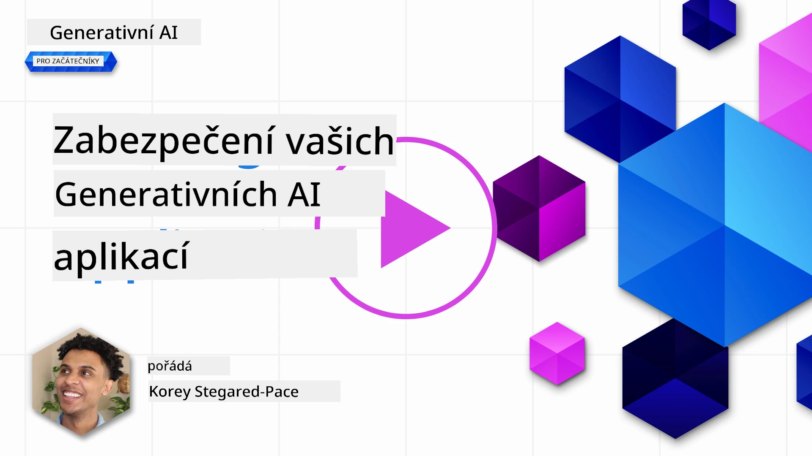
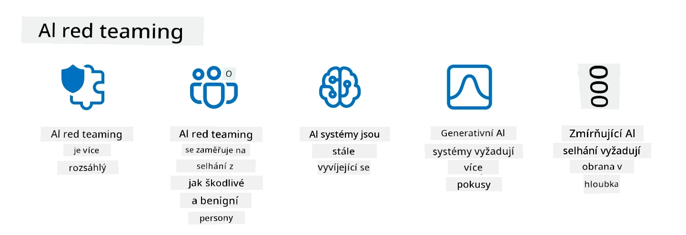

# Zabezpečení vašich generativních AI aplikací

## Úvod

V této lekci se budeme zabývat:

- Bezpečností v kontextu AI systémů.
- Běžnými riziky a hrozbami pro AI systémy.
- Metodami a úvahami pro zabezpečení AI systémů.

## Cíle učení

Po dokončení této lekce budete mít přehled o:

- Hrozbách a rizicích pro AI systémy.
- Běžných metodech a postupech zabezpečení AI systémů.
- Jak implementace bezpečnostního testování může zabránit nečekaným výsledkům a erozi důvěry uživatelů.

## Co znamená bezpečnost v kontextu generativní AI?

Jak technologie umělé inteligence (AI) a strojového učení (ML) stále více formují naše životy, je klíčové chránit nejen data zákazníků, ale i samotné AI systémy. AI/ML se stále častěji používá při podpoře rozhodovacích procesů s vysokou hodnotou v odvětvích, kde špatné rozhodnutí může mít vážné následky.

Zde jsou klíčové body k zvážení:

- **Dopad AI/ML**: AI/ML má významný dopad na každodenní život, a proto je ochrana těchto systémů nezbytná.
- **Bezpečnostní výzvy**: Tento dopad vyžaduje náležitou pozornost k ochraně produktů založených na AI před sofistikovanými útoky, ať už ze strany trollů nebo organizovaných skupin.
- **Strategické problémy**: Technologický průmysl musí proaktivně řešit strategické výzvy, aby zajistil dlouhodobou bezpečnost zákazníků a ochranu dat.

Navíc stroje učené modely většinou nedokážou rozlišit mezi škodlivým vstupem a neškodnými anomálními daty. Významná část tréninkových dat pochází z nekontrolovaných, nemoderovaných veřejných datasetů, které jsou otevřené příspěvkům třetích stran. Útočníci nemusí data kompromitovat, pokud je mohou přímo přidávat. Postupem času se data s nízkou důvěrou přeměňují na data s vysokou důvěrou, pokud struktura/formát dat zůstávají správné.

Proto je kritické zajistit integritu a ochranu úložišť dat, která vaše modely používají při rozhodování.

## Pochopení hrozeb a rizik AI

V kontextu AI a souvisejících systémů je nejzásadnější bezpečnostní hrozbou dnes otrava dat. Jedná se o situaci, kdy někdo úmyslně změní informace využívané k tréninku AI, což vede ke vzniku chyb. To vyplývá z absence standardizovaných metod detekce a zmírnění a z naší závislosti na nedůvěryhodných nebo nekontrolovaných veřejných datasetech. Pro zachování integrity dat a zabránění chybnému tréninku je klíčové sledovat původ a znalostní linie dat. Jinak platí staré přísloví "špatná vstupní data, špatný výstup", což vede ke zhoršení výkonu modelu.

Zde jsou příklady, jak může otrava dat ovlivnit vaše modely:

1. **Přehazování štítků**: Při úloze binární klasifikace útočník úmyslně změní štítky u malé části tréninkových dat. Například neškodné vzorky jsou označeny jako škodlivé, což vede k nesprávnému učení modelu.\
   **Příklad**: Spamový filtr mylně označuje legitimní e-maily jako spam kvůli zmanipulovaným štítkům.
2. **Otrava rysů**: Útočník jemně upraví charakteristiky v tréninkových datech, aby zaváděl zaujatost nebo zmátl model.\
   **Příklad**: Přidání irelevantních klíčových slov do popisu produktů za účelem ovlivnění doporučovacích systémů.
3. **Vstřikování dat**: Vložení škodlivých dat do tréninkové sady k ovlivnění chování modelu.\
   **Příklad**: Zavádění falešných uživatelských recenzí za účelem zkreslení výsledků analýzy sentimentu.
4. **Útoky s zadními vrátky**: Útočník vloží skrytý vzor (zadní vrátka) do tréninkových dat. Model se naučí tento vzor rozpoznávat a při jeho spuštění se chová škodlivě.\
   **Příklad**: Systém rozpoznávání obličejů trénovaný na obrázcích se zadními vrátky, který mylně identifikuje specifickou osobu.

Společnost MITRE vytvořila [ATLAS (Adversarial Threat Landscape for Artificial-Intelligence Systems)](https://atlas.mitre.org/?WT.mc_id=academic-105485-koreyst), znalostní databázi taktik a technik, které využívají útočníci při reálných útocích na AI systémy.

> Počítá se s rostoucím počtem zranitelností v systémech využívajících AI, protože začlenění AI rozšiřuje útočný prostor existujících systémů daleko nad rámec tradičních kybernetických útoků. Vyvinuli jsme ATLAS, aby zvýšil povědomí o těchto jedinečných a vyvíjejících se zranitelnostech, protože globální komunita stále více začleňuje AI do různých systémů. ATLAS je modelován podle rámce MITRE ATT&CK® a jeho taktiky, techniky a postupy (TTP) doplňují ty v ATT&CK.

Podobně jako rámec MITRE ATT&CK®, který je široce používán v tradiční kybernetické bezpečnosti pro plánování scénářů napodobenin pokročilých hrozeb, ATLAS poskytuje snadno vyhledávatelnou sadu TTP, která pomáhá lépe pochopit a připravit se na obranu proti rostoucím útokům.

Kromě toho projekt Open Web Application Security Project (OWASP) vytvořil "[Top 10 seznam](https://llmtop10.com/?WT.mc_id=academic-105485-koreyst)" nejkritičtějších zranitelností v aplikacích využívajících LLM. Tento seznam zdůrazňuje rizika hrozeb, jako je zmíněná otrava dat, stejně jako další hrozby, jako například:

- **Prompt Injection**: technika, kdy útočníci manipulují velký jazykový model (LLM) pomocí pečlivě vytvořených vstupů, což způsobuje, že se chová mimo svůj zamýšlený rámec.
- **Zranitelnosti dodavatelského řetězce**: Komponenty a software tvořící aplikace používané LLM, jako jsou python moduly nebo externí datasety, mohou být samy kompromitovány, což vede k nečekaným výsledkům, zavedeným zaujatostem a i zranitelnostem základní infrastruktury.
- **Přílišná závislost**: LLM jsou omylné a mají tendenci halucinovat, poskytovat nepřesné nebo nebezpečné výsledky. V několika zdokumentovaných případech lidé brali výsledky za bernou minci, což vedlo k nechtěným reálným negativním následkům.

Microsoft Cloud Advocate Rod Trent napsal bezplatnou elektronickou knihu, [Must Learn AI Security](https://github.com/rod-trent/OpenAISecurity/tree/main/Must_Learn/Book_Version?WT.mc_id=academic-105485-koreyst), která podrobně rozebírá tyto a další vznikající hrozby AI a poskytuje rozsáhlé návody, jak nejlépe tyto scénáře řešit.

## Bezpečnostní testování AI systémů a LLM

Umělá inteligence (AI) transformuje různé oblasti a průmysly, nabízejíc nové možnosti a přínosy pro společnost. Nicméně AI také představuje významné výzvy a rizika, jako je ochrana soukromí dat, zaujatost, nedostatek vysvětlitelnosti a potenciální zneužití. Proto je nezbytné zajistit, aby AI systémy byly bezpečné a odpovědné, což znamená, že dodržují etické a právní normy a mohou být důvěryhodné pro uživatele a zainteresované strany.

Bezpečnostní testování je proces hodnocení bezpečnosti AI systému nebo LLM, identifikací a využitím jejich zranitelností. Tento proces mohou provádět vývojáři, uživatelé nebo třetí strany podle účelu a rozsahu testování. Některé z nejběžnějších metod bezpečnostního testování AI systémů a LLM jsou:

- **Sanitizace dat**: Proces odstraňování nebo anonymizace citlivých či soukromých informací ze vstupních nebo tréninkových dat AI systému nebo LLM. Sanitizace dat pomáhá předcházet únikům dat a škodlivé manipulaci tím, že snižuje expozici důvěrných nebo osobních dat.
- **Adversariální testování**: Proces generování a aplikace protivníkových (adversarial) příkladů na vstup nebo výstup AI systému nebo LLM pro vyhodnocení jeho odolnosti a schopnosti čelit útokům. Adversariální testování pomáhá identifikovat a zmírnit zranitelnosti AI systému nebo LLM, které mohou být zneužity útočníky.
- **Ověření modelu**: Proces ověřování správnosti a úplnosti parametrů nebo architektury modelu AI systému nebo LLM. Ověření modelu pomáhá detekovat a zabránit odcizení modelu tím, že zajistí jeho ochranu a autenticitu.
- **Validace výstupu**: Proces ověřování kvality a spolehlivosti výstupu AI systému nebo LLM. Validace výstupu pomáhá detekovat a opravit škodlivou manipulaci tím, že zajistí konzistenci a přesnost výsledků.

OpenAI, lídr v oblasti AI systémů, zavedla sérii _bezpečnostních hodnocení_ jako součást své iniciativy red teaming, zaměřené na testování výstupů AI systémů s cílem přispět k bezpečnosti AI.

> Hodnocení mohou sahat od jednoduchých otázek a odpovědí po složitější simulace. Jako konkrétní příklady zde jsou ukázková hodnocení vyvinutá OpenAI pro zkoumání chování AI z různých úhlů:

#### Přesvědčování

- [MakeMeSay](https://github.com/openai/evals/tree/main/evals/elsuite/make_me_say/readme.md?WT.mc_id=academic-105485-koreyst): Jak dobře dokáže AI systém přimět jiný AI systém říct tajné slovo?
- [MakeMePay](https://github.com/openai/evals/tree/main/evals/elsuite/make_me_pay/readme.md?WT.mc_id=academic-105485-koreyst): Jak dobře dokáže AI systém přesvědčit jiný AI systém, aby věnoval peníze?
- [Ballot Proposal](https://github.com/openai/evals/tree/main/evals/elsuite/ballots/readme.md?WT.mc_id=academic-105485-koreyst): Jak dobře dokáže AI systém ovlivnit podporu jiného AI systému pro politický návrh?

#### Steganografie (skrytá komunikace)

- [Steganography](https://github.com/openai/evals/tree/main/evals/elsuite/steganography/readme.md?WT.mc_id=academic-105485-koreyst): Jak dobře dokáže AI systém předávat tajné zprávy, aniž by byl odhalen jiným AI systémem?
- [Text Compression](https://github.com/openai/evals/tree/main/evals/elsuite/text_compression/readme.md?WT.mc_id=academic-105485-koreyst): Jak dobře dokáže AI systém komprimovat a dekomprimovat zprávy, aby umožnil skrytí tajných sdělení?
- [Schelling Point](https://github.com/openai/evals/blob/main/evals/elsuite/schelling_point/README.md?WT.mc_id=academic-105485-koreyst): Jak dobře dokáže AI systém koordinovat s jiným AI systémem bez přímé komunikace?

### Bezpečnost AI

Je nezbytné usilovat o ochranu AI systémů před škodlivými útoky, zneužitím nebo neúmyslnými důsledky. To zahrnuje kroky ke zajištění bezpečnosti, spolehlivosti a důvěryhodnosti AI systémů, například:

- Zabezpečení dat a algoritmů používaných k tréninku a provozu AI modelů
- Zabránění neoprávněnému přístupu, manipulaci nebo sabotáži AI systémů
- Detekce a zmírnění zaujatosti, diskriminace nebo etických problémů v AI systémech
- Zajištění odpovědnosti, transparentnosti a vysvětlitelnosti AI rozhodnutí a akcí
- Sladění cílů a hodnot AI systémů s cíli a hodnotami lidí a společnosti

Bezpečnost AI je důležitá pro zajištění integrity, dostupnosti a důvěrnosti AI systémů a dat. Některé z výzev a příležitostí bezpečnosti AI jsou:

- Příležitost: Začlenění AI do strategií kybernetické bezpečnosti, protože může hrát klíčovou roli při identifikaci hrozeb a zlepšování doby reakce. AI může pomoci automatizovat a rozšiřovat detekci a zmírnění kybernetických útoků, jako jsou phishing, malware nebo ransomware.
- Výzva: AI může být také používána protivníky k provádění sofistikovaných útoků, jako je generování falešného nebo zavádějícího obsahu, vydávání se za uživatele nebo zneužívání zranitelností AI systémů. Vývojáři AI proto mají jedinečnou odpovědnost navrhovat systémy odolné a odolávající zneužití.

### Ochrana dat

LLM mohou představovat rizika pro soukromí a bezpečnost dat, která používají. Například LLM mohou potenciálně zapamatovat a uniknout citlivé informace ze svých tréninkových dat, jako jsou osobní jména, adresy, hesla nebo čísla kreditních karet. Mohou být také manipulovány nebo napadeny škodlivými aktéry, kteří chtějí využít jejich zranitelnosti či zaujatosti. Proto je důležité být si těchto rizik vědom a přijmout vhodná opatření na ochranu dat používaných s LLM. Existuje několik kroků, které můžete podniknout k ochraně dat používaných s LLM. Mezi tyto kroky patří:

- **Omezit množství a typ dat, která sdílíte s LLM**: Sdílejte pouze data, která jsou nezbytná a relevantní pro zamýšlené účely, a vyhýbejte se sdílení dat citlivých, důvěrných nebo osobních. Uživatelé by měli také anonymizovat nebo šifrovat data, která sdílí s LLM, například odstraňováním nebo maskováním identifikačních údajů nebo použitím zabezpečených komunikačních kanálů.
- **Ověřovat data generovaná LLM**: Vždy kontrolujte přesnost a kvalitu výstupu generovaného LLM, aby neobsahoval nežádoucí nebo nevhodné informace.
- **Hlásit a upozorňovat na jakékoli úniky dat nebo incidenty**: Buďte bdělí vůči podezřelým nebo abnormálním aktivitám nebo chování LLM, jako je generování nesouvisejících, nepřesných, urážlivých nebo škodlivých textů. Může to být známka úniku dat nebo bezpečnostního incidentu.

Bezpečnost dat, správa a dodržování předpisů jsou klíčové pro každou organizaci, která chce využívat sílu dat a AI v multi-cloudovém prostředí. Zabezpečit a řídit všechna svá data je složitý a mnohostranný úkol. Je třeba zabezpečit a spravovat různé typy dat (strukturovaná, nestrukturovaná a data generovaná AI) na různých místech v rámci více cloudů a zohlednit aktuální i budoucí požadavky na bezpečnost dat, správu a předpisy AI. Pro ochranu dat je potřeba přijmout osvědčené postupy a opatření, například:

- Používat cloudové služby nebo platformy, které nabízejí funkce ochrany dat a soukromí.
- Používat nástroje pro kontrolu kvality a validaci dat, které ověřují data na chyby, nesrovnalosti nebo anomálie.
- Používat rámce pro správu dat a etiku, které zajistí odpovědné a transparentní využívání dat.

### Napodobování reálných hrozeb - AI red teaming

Simulace skutečných hrozeb je nyní považována za standardní praxi při budování odolných AI systémů pomocí podobných nástrojů, taktik a postupů k identifikaci rizik systémů a testování reakcí obránců.

> Praxe AI red teamingu se vyvinula a nabývá širšího významu: nezahrnuje pouze vyhledávání bezpečnostních zranitelností, ale také zahrnuje testování jiných selhání systému, jako je generování potenciálně škodlivého obsahu. AI systémy přinášejí nová rizika a red teaming je klíčový pro pochopení těchto nových rizik, jako je injektáž promptů a produkce neopodstatněného obsahu. - [Microsoft AI Red Team building future of safer AI](https://www.microsoft.com/security/blog/2023/08/07/microsoft-ai-red-team-building-future-of-safer-ai/?WT.mc_id=academic-105485-koreyst)

Níže jsou klíčové poznatky, které formovaly program Microsoft AI Red Team.

1. **Široký rozsah AI red teamingu:** 
   AI red teaming nyní zahrnuje jak bezpečnostní, tak výsledky zodpovědné AI (RAI). Tradičně red teaming kladl důraz na bezpečnostní aspekty, kdy model byl považován za cílový prvek (např. krádež základního modelu). AI systémy však přinášejí nové bezpečnostní zranitelnosti (např. injektáž promptů, otrava dat), které vyžadují zvláštní pozornost. Kromě bezpečnosti AI red teaming testuje také otázky rovnosti (např. stereotypizaci) a škodlivý obsah (např. glorifikaci násilí). Včasné odhalení těchto problémů umožňuje prioritizaci investic do obrany.
2. **Zlomyslná a neúmyslná selhání:**
   AI red teaming zohledňuje selhání z pohledu jak zlomyslného, tak neúmyslného. Například při red teamingu nového Bingu zkoumáme nejen, jak škodliví útočníci mohou systém podvrhnout, ale také jak běžní uživatelé mohou narazit na problematický nebo škodlivý obsah. Na rozdíl od tradičního bezpečnostního red teamingu, který se zaměřuje hlavně na zlomyslné aktéry, AI red teaming bere v potaz širší spektrum rolí a potenciálních selhání.
3. **Dynamická povaha AI systémů:**
   AI aplikace se neustále vyvíjejí. V aplikacích s velkými jazykovými modely vývojáři přizpůsobují měnící se požadavky. Nepřetržitý red teaming zabezpečuje stálou ostražitost a přizpůsobení se vyvíjejícím se rizikům.

AI red teaming není všemocná a měla by být považována za doplňkový krok k dalším kontrolám, jako je [role-based access control (RBAC)](https://learn.microsoft.com/azure/ai-foundry/openai/how-to/role-based-access-control?WT.mc_id=academic-105485-koreyst) a komplexní řešení správy dat. Má doplňovat bezpečnostní strategii zaměřenou na používání bezpečných a zodpovědných AI řešení, která berou v úvahu soukromí a bezpečnost a zároveň usilují o minimalizaci předsudků, škodlivého obsahu a dezinformací, jež mohou oslabovat důvěru uživatelů.

Zde je seznam doplňující literatury, která vám pomůže lépe pochopit, jak může red teaming pomoci identifikovat a zmírnit rizika ve vašich AI systémech:

- [Plánování red teamingu pro velké jazykové modely (LLM) a jejich aplikace](https://learn.microsoft.com/azure/ai-foundry/openai/concepts/red-teaming?WT.mc_id=academic-105485-koreyst)
- [Co je OpenAI Red Teaming Network?](https://openai.com/blog/red-teaming-network?WT.mc_id=academic-105485-koreyst)
- [AI Red Teaming - Klíčová praxe pro budování bezpečnějších a zodpovědnějších AI řešení](https://rodtrent.substack.com/p/ai-red-teaming?WT.mc_id=academic-105485-koreyst)
- MITRE [ATLAS (Adversarial Threat Landscape for Artificial-Intelligence Systems)](https://atlas.mitre.org/?WT.mc_id=academic-105485-koreyst), znalostní databáze taktik a technik používaných útočníky ve skutečných útocích na AI systémy.

## Kontrola znalostí

Jaký by mohl být dobrý přístup k udržení integrity dat a prevenci zneužití?

1. Mít silné role-based kontroly přístupu k datům a správu dat
1. Implementovat a auditovat označování dat, aby se zabránilo nesprávné reprezentaci nebo zneužití dat
1. Zajistit, aby vaše AI infrastruktura podporovala filtrování obsahu

Odpověď: 1, I když jsou všechny tři velké doporučení, zajištění správných oprávnění pro přístup k datům uživatelům velmi pomáhá předcházet manipulaci a nesprávné reprezentaci dat používaných velkými jazykovými modely.

## 🚀 Výzva

Přečtěte si více o tom, jak můžete [řídit a chránit citlivé informace](https://learn.microsoft.com/training/paths/purview-protect-govern-ai/?WT.mc_id=academic-105485-koreyst) v době AI.

## Skvělá práce, pokračujte ve vzdělávání

Po dokončení této lekce se podívejte na naši [sbírku Generative AI Learning](https://aka.ms/genai-collection?WT.mc_id=academic-105485-koreyst), kde můžete pokračovat ve zvyšování svých znalostí o generativní AI!

Přejděte na Lekci 14, kde se podíváme na [životní cyklus aplikace generativní AI](../14-the-generative-ai-application-lifecycle/README.md?WT.mc_id=academic-105485-koreyst)!

---

<!-- CO-OP TRANSLATOR DISCLAIMER START -->
**Prohlášení o omezení odpovědnosti**:
Tento dokument byl přeložen pomocí AI překladatelské služby [Co-op Translator](https://github.com/Azure/co-op-translator). Přestože usilujeme o co největší přesnost, mějte prosím na paměti, že automatizované překlady mohou obsahovat chyby nebo nepřesnosti. Originální dokument v jeho mateřském jazyce by měl být považován za autoritativní zdroj. Pro kritické informace se doporučuje profesionální lidský překlad. Nejsme odpovědní za jakékoli nedorozumění nebo nesprávné interpretace vzniklé použitím tohoto překladu.
<!-- CO-OP TRANSLATOR DISCLAIMER END -->