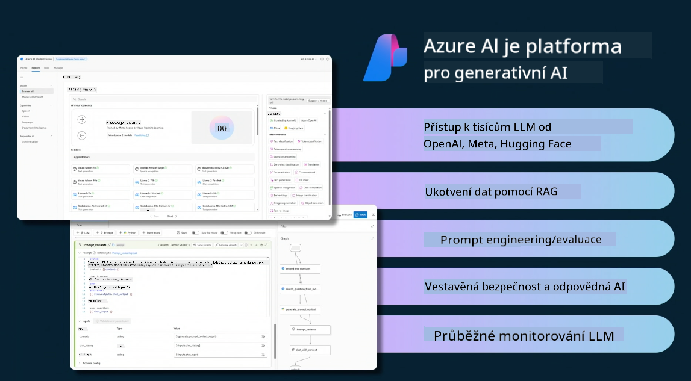

<!--
CO_OP_TRANSLATOR_METADATA:
{
  "original_hash": "df44972d5575ea8cef3c52ee31696d04",
  "translation_date": "2025-12-19T16:44:39+00:00",
  "source_file": "14-the-generative-ai-application-lifecycle/README.md",
  "language_code": "cs"
}
-->

# Životní cyklus aplikace generativní AI

Důležitou otázkou pro všechny AI aplikace je relevance AI funkcí, protože AI je rychle se vyvíjející oblast. Aby vaše aplikace zůstala relevantní, spolehlivá a robustní, je potřeba ji neustále sledovat, vyhodnocovat a zlepšovat. Právě zde přichází na řadu životní cyklus generativní AI.

Životní cyklus generativní AI je rámec, který vás provází fázemi vývoje, nasazení a údržby generativní AI aplikace. Pomáhá vám definovat vaše cíle, měřit výkon, identifikovat výzvy a implementovat řešení. Také pomáhá sladit vaši aplikaci s etickými a právními standardy vašeho oboru a zainteresovaných stran. Dodržováním životního cyklu generativní AI zajistíte, že vaše aplikace vždy přináší hodnotu a uspokojuje uživatele.

## Úvod

V této kapitole se naučíte:

- Porozumět posunu paradigmatu z MLOps na LLMOps
- Životní cyklus LLM
- Nástroje pro životní cyklus
- Metrifikace a vyhodnocení životního cyklu

## Porozumět posunu paradigmatu z MLOps na LLMOps

LLM jsou novým nástrojem v arzenálu umělé inteligence, jsou neuvěřitelně silné v úlohách analýzy a generování pro aplikace, avšak tato síla má určité důsledky pro to, jak zefektivňujeme úkoly AI a klasického strojového učení.

Potřebujeme tedy nové paradigma, které tento nástroj adaptuje dynamicky a s vhodnými pobídkami. Starší AI aplikace můžeme kategorizovat jako „ML aplikace“ a novější AI aplikace jako „GenAI aplikace“ nebo jednoduše „AI aplikace“, což odráží hlavní používané technologie a techniky v dané době. To posouvá náš narativ v několika směrech, podívejte se na následující srovnání.

Všimněte si, že v LLMOps se více zaměřujeme na vývojáře aplikací, používáme integrace jako klíčový bod, využíváme „Modely jako službu“ a uvažujeme o následujících metrikách.

- Kvalita: Kvalita odpovědi
- Škoda: Odpovědná AI
- Poctivost: Základnost odpovědi (Dává smysl? Je správná?)
- Náklady: Rozpočet řešení
- Latence: Průměrný čas na odpověď tokenu

## Životní cyklus LLM

Nejprve, abychom pochopili životní cyklus a jeho úpravy, podívejme se na následující infografiku.

Jak si můžete všimnout, je to odlišné od běžných životních cyklů v MLOps. LLM mají mnoho nových požadavků, jako je promptování, různé techniky pro zlepšení kvality (doladění, RAG, meta-promptování), odlišné hodnocení a odpovědnost s ohledem na odpovědnou AI, a nakonec nové hodnotící metriky (kvalita, škoda, poctivost, náklady a latence).

Například se podívejte, jak generujeme nápady. Používáme prompt engineering k experimentování s různými LLM, abychom prozkoumali možnosti a otestovali, zda by jejich hypotéza mohla být správná.

Všimněte si, že to není lineární, ale integrované smyčky, iterativní a s celkovým cyklem.

Jak bychom mohli tyto kroky prozkoumat? Pojďme se podrobněji podívat, jak můžeme vytvořit životní cyklus.

Může to vypadat trochu složitě, zaměřme se nejprve na tři hlavní kroky.

1. Generování nápadů / průzkum: Průzkum, zde můžeme zkoumat podle našich obchodních potřeb. Prototypování, vytváření [PromptFlow](https://microsoft.github.io/promptflow/index.html?WT.mc_id=academic-105485-koreyst) a testování, zda je dostatečně efektivní pro naši hypotézu.
1. Budování / rozšiřování: Implementace, nyní začínáme hodnotit větší datové sady, implementovat techniky jako doladění a RAG, abychom ověřili robustnost našeho řešení. Pokud nefunguje, může pomoci jeho přeimplementování, přidání nových kroků do našeho toku nebo restrukturalizace dat. Po otestování našeho toku a škálování, pokud funguje a splňuje naše metriky, je připraveno na další krok.
1. Provozování: Integrace, nyní přidáváme monitorovací a výstražné systémy do našeho systému, nasazení a integraci aplikace do naší aplikace.

Poté máme celkový cyklus řízení, zaměřený na bezpečnost, shodu a správu.

Gratulujeme, nyní máte svou AI aplikaci připravenou k provozu. Pro praktickou zkušenost se podívejte na [Contoso Chat Demo.](https://nitya.github.io/contoso-chat/?WT.mc_id=academic-105485-koreys)

Jaké nástroje tedy můžeme použít?

## Nástroje pro životní cyklus

Pro nástroje Microsoft poskytuje [Azure AI Platform](https://azure.microsoft.com/solutions/ai/?WT.mc_id=academic-105485-koreys) a [PromptFlow](https://microsoft.github.io/promptflow/index.html?WT.mc_id=academic-105485-koreyst), které usnadňují a zjednodušují implementaci vašeho cyklu.

[Azure AI Platform](https://azure.microsoft.com/solutions/ai/?WT.mc_id=academic-105485-koreys) vám umožňuje používat [AI Studio](https://ai.azure.com/?WT.mc_id=academic-105485-koreys). AI Studio je webový portál, který vám umožňuje prozkoumávat modely, ukázky a nástroje. Spravovat vaše zdroje, vývojové toky UI a možnosti SDK/CLI pro vývoj zaměřený na kód.

Azure AI vám umožňuje používat různé zdroje pro správu vašich operací, služeb, projektů, vyhledávání vektorů a databází.

Vytvářejte od Proof-of-Concept (POC) až po aplikace ve velkém měřítku s PromptFlow:

- Navrhujte a vytvářejte aplikace z VS Code s vizuálními a funkčními nástroji
- Testujte a dolaďujte své aplikace pro kvalitní AI snadno
- Používejte Azure AI Studio pro integraci a iteraci s cloudem, push a nasazení pro rychlou integraci

## Skvělé! Pokračujte ve svém učení!

Úžasné, nyní se naučte více o tom, jak strukturovat aplikaci, abyste mohli použít koncepty s [Contoso Chat App](https://nitya.github.io/contoso-chat/?WT.mc_id=academic-105485-koreyst), a zjistěte, jak Cloud Advocacy přidává tyto koncepty do demonstrací. Pro více obsahu si prohlédněte naši [Ignite breakout session!
](https://www.youtube.com/watch?v=DdOylyrTOWg)

Nyní si prohlédněte Lekci 15, abyste pochopili, jak [Retrieval Augmented Generation a vektorové databáze](../15-rag-and-vector-databases/README.md?WT.mc_id=academic-105485-koreyst) ovlivňují generativní AI a jak vytvářet poutavější aplikace!

---

<!-- CO-OP TRANSLATOR DISCLAIMER START -->
**Prohlášení o vyloučení odpovědnosti**:
Tento dokument byl přeložen pomocí AI překladatelské služby [Co-op Translator](https://github.com/Azure/co-op-translator). Přestože usilujeme o přesnost, mějte prosím na paměti, že automatizované překlady mohou obsahovat chyby nebo nepřesnosti. Původní dokument v jeho mateřském jazyce by měl být považován za autoritativní zdroj. Pro kritické informace se doporučuje profesionální lidský překlad. Nejsme odpovědní za jakékoliv nedorozumění nebo nesprávné výklady vyplývající z použití tohoto překladu.
<!-- CO-OP TRANSLATOR DISCLAIMER END -->