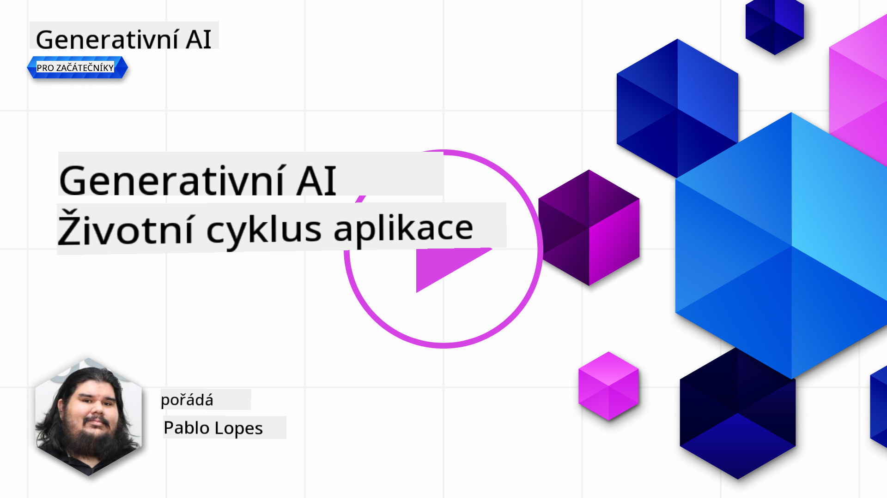
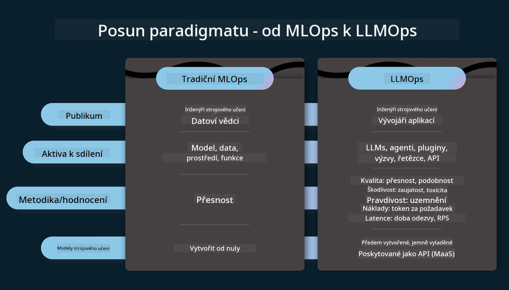
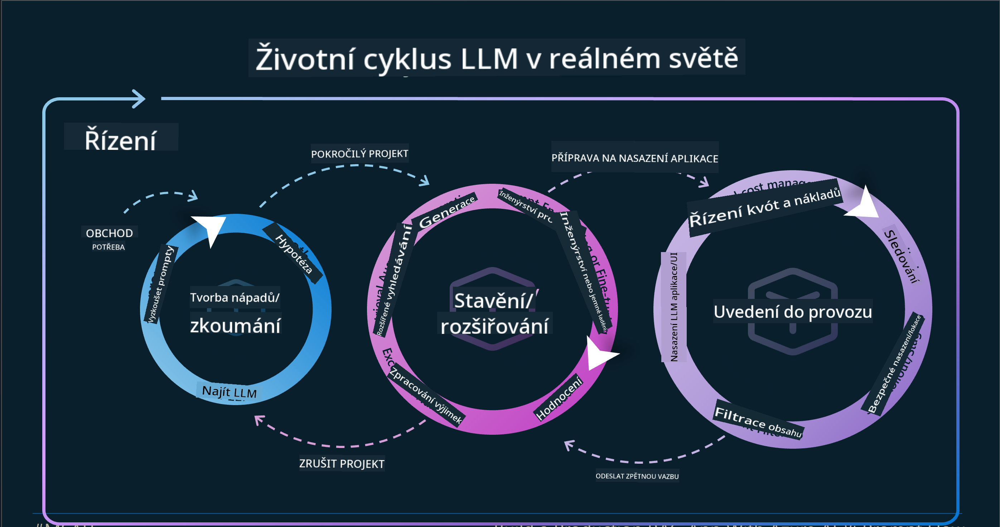
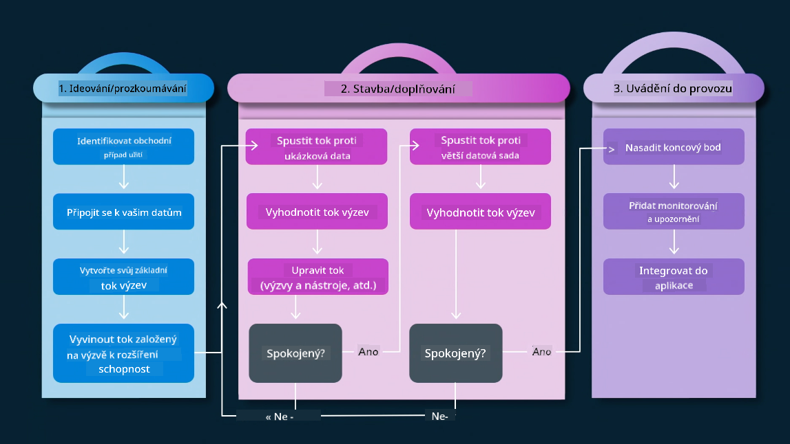
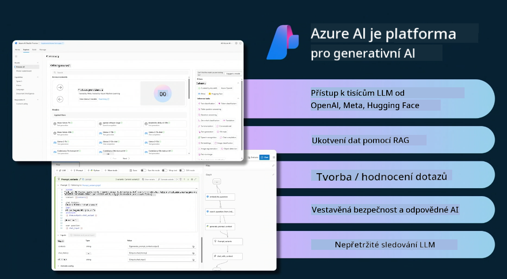
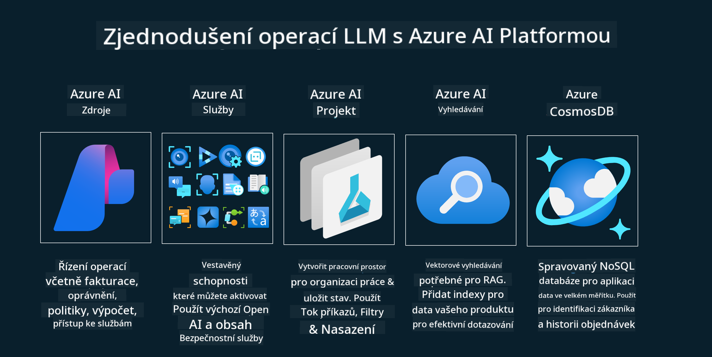
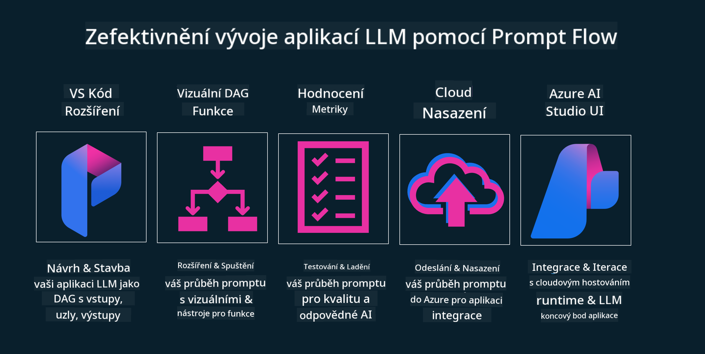

<!--
CO_OP_TRANSLATOR_METADATA:
{
  "original_hash": "27a5347a5022d5ef0a72ab029b03526a",
  "translation_date": "2025-06-25T22:09:33+00:00",
  "source_file": "14-the-generative-ai-application-lifecycle/README.md",
  "language_code": "cs"
}
-->

# Životní cyklus aplikace generativní AI

Důležitou otázkou pro všechny AI aplikace je relevance AI funkcí, protože AI je rychle se rozvíjející obor. Aby vaše aplikace zůstala relevantní, spolehlivá a robustní, je potřeba ji neustále monitorovat, vyhodnocovat a zlepšovat. Zde přichází na řadu životní cyklus generativní AI.

Životní cyklus generativní AI je rámec, který vás provede fázemi vývoje, nasazení a údržby generativní AI aplikace. Pomáhá vám definovat vaše cíle, měřit výkon, identifikovat výzvy a implementovat řešení. Také vám pomáhá sladit vaši aplikaci s etickými a právními standardy vašeho oboru a vašich zainteresovaných stran. Dodržováním životního cyklu generativní AI zajistíte, že vaše aplikace vždy přináší hodnotu a uspokojuje uživatele.

## Úvod

V této kapitole se naučíte:

- Pochopit posun paradigmatu z MLOps na LLMOps
- Životní cyklus LLM
- Nástroje pro životní cyklus
- Metrifikace a hodnocení životního cyklu

## Pochopit posun paradigmatu z MLOps na LLMOps

LLM jsou nový nástroj v arzenálu umělé inteligence, jsou neuvěřitelně silné v úlohách analýzy a generování pro aplikace, avšak tato síla má určité důsledky pro to, jak zefektivňujeme úlohy AI a klasického strojového učení.

S tím potřebujeme nové paradigma, abychom tento nástroj adaptovali dynamicky a se správnými pobídkami. Můžeme kategorizovat starší AI aplikace jako "ML Apps" a novější AI aplikace jako "GenAI Apps" nebo jen "AI Apps", což odráží mainstreamové technologie a techniky používané v dané době. To posouvá náš narativ v několika ohledech, podívejte se na následující srovnání.

Všimněte si, že v LLMOps se více zaměřujeme na vývojáře aplikací, používáme integrace jako klíčový bod, používáme "Modely jako službu" a přemýšlíme o následujících bodech pro metriky.

- Kvalita: Kvalita odpovědí
- Škoda: Odpovědná AI
- Poctivost: Základ odpovědi (Dává smysl? Je to správně?)
- Náklady: Rozpočet řešení
- Latence: Průměrný čas na odpověď tokenu

## Životní cyklus LLM

Nejprve, abychom pochopili životní cyklus a jeho úpravy, podívejme se na následující infografiku.

Jak si můžete všimnout, toto se liší od obvyklých životních cyklů z MLOps. LLM mají mnoho nových požadavků, jako je Prompting, různé techniky pro zlepšení kvality (Fine-Tuning, RAG, Meta-Prompts), různé hodnocení a odpovědnost s odpovědnou AI, a nakonec nové hodnotící metriky (Kvalita, Škoda, Poctivost, Náklady a Latence).

Například se podívejte na to, jak vymýšlíme. Používáme inženýrství promptů k experimentování s různými LLM, abychom prozkoumali možnosti testování, zda jejich hypotéza může být správná.

Všimněte si, že to není lineární, ale integrované smyčky, iterativní a s převažujícím cyklem.

Jak bychom mohli tyto kroky prozkoumat? Pojďme se podívat na detaily, jak bychom mohli vybudovat životní cyklus.

To může vypadat trochu složitě, zaměřme se nejprve na tři velké kroky.

1. Vymýšlení/Prozkoumávání: Prozkoumávání, zde můžeme prozkoumat podle našich obchodních potřeb. Prototypování, vytváření [PromptFlow](https://microsoft.github.io/promptflow/index.html?WT.mc_id=academic-105485-koreyst) a testování, zda je dostatečně efektivní pro naši hypotézu.
2. Stavění/Rozšiřování: Implementace, nyní začínáme hodnotit pro větší datasety implementovat techniky, jako je Fine-tuning a RAG, abychom zkontrolovali robustnost našeho řešení. Pokud ne, může pomoci jeho přeimplementování, přidání nových kroků do našeho toku nebo restrukturalizace dat. Po testování našeho toku a našeho měřítka, pokud to funguje a zkontrolujeme naše metriky, je připraveno na další krok.
3. Operationalizace: Integrace, nyní přidáváme monitorovací a výstražné systémy do našeho systému, nasazení a integraci aplikace do naší aplikace.

Pak máme převažující cyklus řízení, zaměřený na bezpečnost, dodržování předpisů a řízení.

Gratulujeme, nyní máte svou AI aplikaci připravenou k provozu. Pro praktické zkušenosti se podívejte na [Contoso Chat Demo.](https://nitya.github.io/contoso-chat/?WT.mc_id=academic-105485-koreys)

Jaké nástroje bychom nyní mohli použít?

## Nástroje pro životní cyklus

Pro nástroje poskytuje Microsoft [Azure AI Platform](https://azure.microsoft.com/solutions/ai/?WT.mc_id=academic-105485-koreys) a [PromptFlow](https://microsoft.github.io/promptflow/index.html?WT.mc_id=academic-105485-koreyst), které usnadňují a zjednodušují implementaci vašeho cyklu a připravují jej k použití.

[Azure AI Platform](https://azure.microsoft.com/solutions/ai/?WT.mc_id=academic-105485-koreys) vám umožňuje používat [AI Studio](https://ai.azure.com/?WT.mc_id=academic-105485-koreys). AI Studio je webový portál, který vám umožňuje prozkoumávat modely, vzorky a nástroje. Spravovat vaše zdroje, vývojové toky uživatelského rozhraní a možnosti SDK/CLI pro vývoj zaměřený na kód.

Azure AI vám umožňuje používat více zdrojů, spravovat vaše operace, služby, projekty, potřeby vektorového vyhledávání a databází.

Vybudujte, od proof-of-concept (POC) až po rozsáhlé aplikace s PromptFlow:

- Navrhněte a sestavte aplikace z VS Code s vizuálními a funkčními nástroji
- Testujte a dolaďujte své aplikace pro kvalitní AI snadno.
- Použijte Azure AI Studio k integraci a iteraci s cloudem, nasazení a rychlé integraci.

## Skvělé! Pokračujte ve svém vzdělávání!

Úžasné, nyní se dozvíte více o tom, jak strukturovat aplikaci k použití konceptů s [Contoso Chat App](https://nitya.github.io/contoso-chat/?WT.mc_id=academic-105485-koreyst), abyste zjistili, jak Cloud Advocacy přidává tyto koncepty v demonstracích. Pro více obsahu se podívejte na naši [Ignite breakout session!
](https://www.youtube.com/watch?v=DdOylyrTOWg)

Nyní se podívejte na Lekci 15, abyste pochopili, jak [Retrieval Augmented Generation a Vektorové Databáze](../15-rag-and-vector-databases/README.md?WT.mc_id=academic-105485-koreyst) ovlivňují generativní AI a jak vytvořit více angažující aplikace!

**Prohlášení**:  
Tento dokument byl přeložen pomocí AI překladatelské služby [Co-op Translator](https://github.com/Azure/co-op-translator). I když se snažíme o přesnost, mějte na paměti, že automatizované překlady mohou obsahovat chyby nebo nepřesnosti. Původní dokument ve svém rodném jazyce by měl být považován za autoritativní zdroj. Pro důležité informace se doporučuje profesionální lidský překlad. Nejsme zodpovědní za jakékoli nedorozumění nebo mylné interpretace vyplývající z použití tohoto překladu.