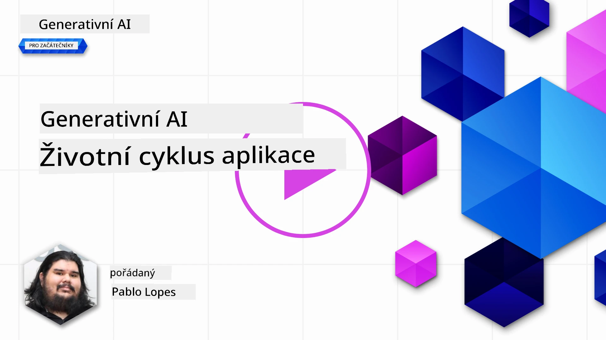
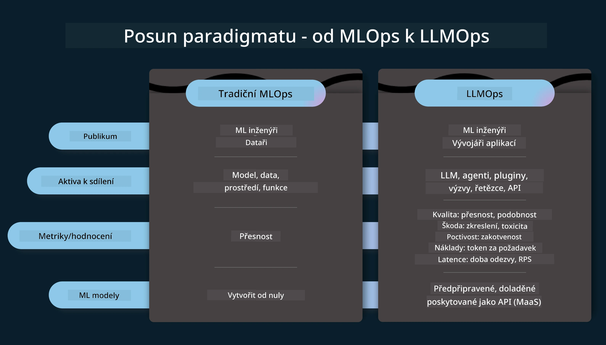
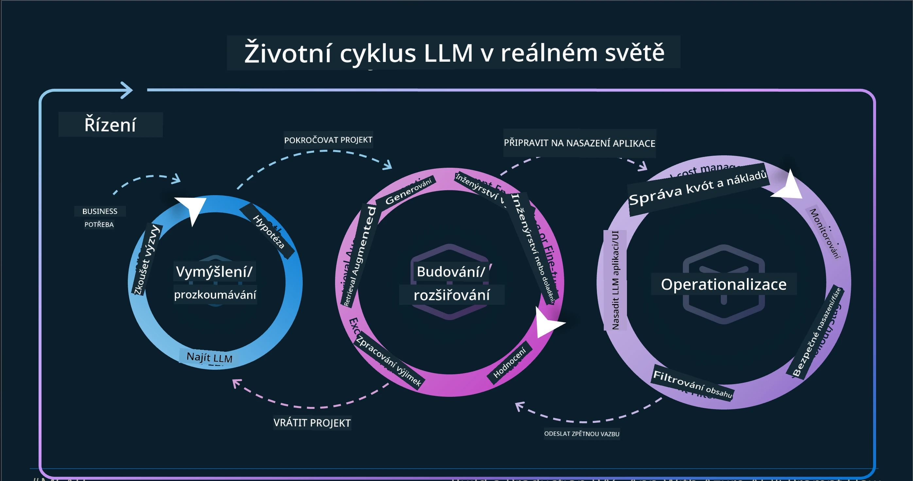
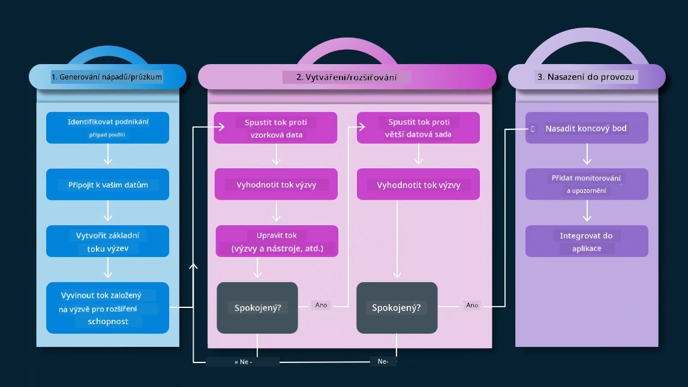
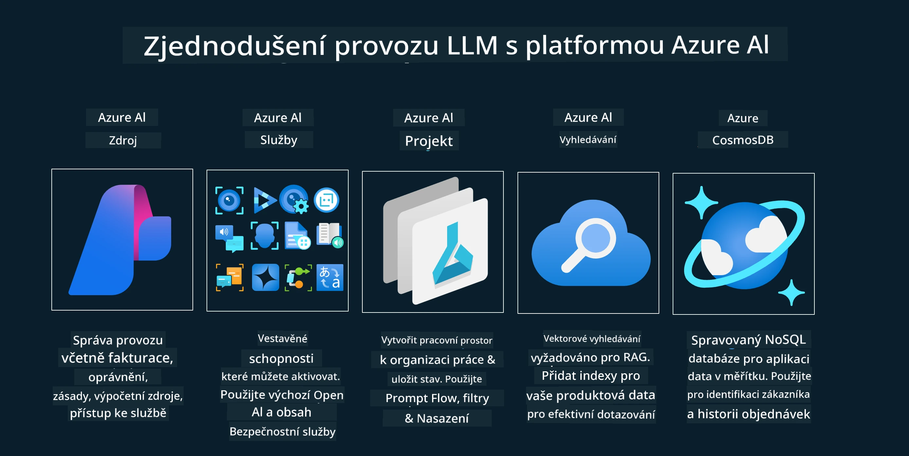
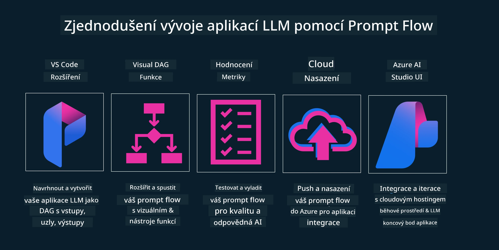

# Životní cyklus aplikace generativní AI

Důležitá otázka pro všechny AI aplikace je relevance AI funkcí, protože AI je rychle se vyvíjející oblast, pro zajištění, že vaše aplikace zůstane relevantní, spolehlivá a robustní, je potřeba ji neustále sledovat, hodnotit a zlepšovat. Zde přichází na řadu životní cyklus generativní AI.

Životní cyklus generativní AI je rámec, který vás provede fázemi vývoje, nasazení a údržby generativní AI aplikace. Pomáhá vám definovat cíle, měřit výkon, identifikovat výzvy a zavádět řešení. Také pomáhá sladit vaši aplikaci s etickými a právními standardy vašeho oboru i zúčastněných stran. Dodržováním životního cyklu generativní AI zajistíte, že vaše aplikace vždy přináší hodnotu a uspokojuje uživatele.

## Úvod

V této kapitole se naučíte:

- Porozumět posunu paradigmat od MLOps k LLMOps
- Životní cyklus LLM
- Nástroje životního cyklu
- Metrifikace a hodnocení životního cyklu

## Porozumět posunu paradigmat od MLOps k LLMOps

LLM jsou nový nástroj v arzenálu umělé inteligence, jsou neuvěřitelně výkonné v analyzačních a generativních úlohách pro aplikace, ovšem tato síla má své důsledky v tom, jak zefektivňujeme AI a klasické strojové učení.

S tím potřebujeme nové paradigma, aby byl tento nástroj adaptován dynamicky, s vhodnými incentivami. Můžeme starší AI aplikace kategorizovat jako „ML Apps“ a novější AI aplikace jako „GenAI Apps“ nebo prostě „AI Apps“, což odráží hlavní technologii a techniky užívané v daném čase. Tím se náš narativ mění v několika směrech, podívejte se na následující srovnání.

Všimněte si, že u LLMOps se více zaměřujeme na vývojáře aplikací, používáme integrace jako klíčový bod, používáme „Models-as-a-Service“ a uvažujeme o následujících bodech metrik.

- Kvalita: kvalita odpovědi
- Škoda: odpovědná AI
- Poctivost: zakotvení odpovědi (dává smysl? Je správná?)
- Náklady: rozpočet řešení
- Latence: průměrný čas na odpověď tokenu

## Životní cyklus LLM

Nejprve, abychom pochopili životní cyklus a úpravy, všimněme si následující infografiky.

Jak si možná všimnete, to se liší od obvyklých životních cyklů MLOps. LLM mají mnoho nových požadavků, jako promptování, různé techniky pro zlepšení kvality (Fine-Tuning, RAG, Meta-Prompts), různé hodnocení a zodpovědnost s ohledem na odpovědnou AI, nakonec nové hodnotící metriky (Kvalita, Škoda, Poctivost, Náklady a Latence).

Například se podívejte, jak přicházíme s nápady. Používáme prompt engineering k experimentování s různými LLM k prozkoumání možností a testování, zda jejich hypotéza může být správná.

Všimněte si, že to není lineární, ale integrované smyčky, iterativní a s celkovým cyklem.

Jak bychom mohli tyto kroky prozkoumat? Podívejme se podrobněji na to, jak můžeme životní cyklus sestavit.

To může vypadat složitě, nejprve se soustřeďme na tři velké kroky.

1. Ideace/Prozkoumání: Průzkum, zde můžeme zkoumat podle našich obchodních potřeb. Prototypování, vytváření [PromptFlow](https://microsoft.github.io/promptflow/index.html?WT.mc_id=academic-105485-koreyst) a testování, zda je dostatečně efektivní pro naši hypotézu.
1. Stavění/Rozšiřování: Implementace, nyní začínáme hodnotit na větších datech, zavádět techniky jako Fine-tuning a RAG, abychom ověřili robustnost našeho řešení. Pokud nefunguje, může pomoci znovuimplementace, přidání nových kroků do toku nebo restrukturalizace dat. Po otestování toku a škálování, pokud to funguje a splňuje metriky, je připraveno na další krok.
1. Provozování: Integrace, nyní přidáváme monitorování a systém upozornění do našeho systému, nasazení a integraci aplikace do naší aplikace.

Poté máme celkový cyklus správy, zaměřující se na bezpečnost, soulad a řízení.

Gratulujeme, nyní máte AI aplikaci připravenou k nasazení a provozu. Pro praktickou zkušenost se podívejte na [Contoso Chat Demo.](https://nitya.github.io/contoso-chat/?WT.mc_id=academic-105485-koreyst)

Jaké nástroje bychom mohli použít?

## Nástroje životního cyklu

Pro nástroje Microsoft poskytuje [Azure AI Platform](https://azure.microsoft.com/solutions/ai/?WT.mc_id=academic-105485-koreyst) a [PromptFlow](https://microsoft.github.io/promptflow/index.html?WT.mc_id=academic-105485-koreyst), které usnadňují a umožňují snadnou implementaci vašeho cyklu.

[Azure AI Platform](https://azure.microsoft.com/solutions/ai/?WT.mc_id=academic-105485-koreyst) vám umožňuje použít [AI Studio](https://ai.azure.com/?WT.mc_id=academic-105485-koreyst). AI Studio je webový portál, který umožňuje prozkoumávat modely, ukázky a nástroje. Spravovat zdroje, vývojové toky UI a možnosti SDK/CLI pro vývoj zaměřený na kód.

Azure AI vám umožňuje použít více zdrojů k řízení vašeho provozu, služeb, projektů, vektorového vyhledávání a databází.

Konstruujte od Proof-of-Concept (POC) až po velké škálovatelné aplikace pomocí PromptFlow:

- Navrhujte a budujte aplikace z VS Code s vizuálními a funkčními nástroji
- Testujte a dolaďujte aplikace pro kvalitní AI, snadno.
- Používejte Azure AI Studio k integraci a iteraci s cloudem, Push a Deploy pro rychlou integraci.

## Skvělé! Pokračujte ve výuce!

Úžasné, nyní se naučte více o tom, jak strukturovat aplikaci a využít koncepty s [Contoso Chat App](https://nitya.github.io/contoso-chat/?WT.mc_id=academic-105485-koreyst), abyste viděli, jak Cloud Advocacy přidává tyto koncepty do demonstrací. Pro více obsahu si prohlédněte náš [Ignite breakout session!
](https://www.youtube.com/watch?v=DdOylyrTOWg)

Nyní se podívejte na lekci 15 a pochopte, jak [Retrieval Augmented Generation a vektorové databáze](../15-rag-and-vector-databases/README.md?WT.mc_id=academic-105485-koreyst) ovlivňují generativní AI a jak vytvářet poutavější aplikace!

---

<!-- CO-OP TRANSLATOR DISCLAIMER START -->
**Prohlášení o vyloučení odpovědnosti**:  
Tento dokument byl přeložen pomocí AI překladatelské služby [Co-op Translator](https://github.com/Azure/co-op-translator). Přestože usilujeme o přesnost, mějte prosím na paměti, že automatizované překlady mohou obsahovat chyby nebo nepřesnosti. Originální dokument v jeho mateřském jazyce by měl být považován za autoritativní zdroj. Pro zásadní informace se doporučuje profesionální lidský překlad. Nejsme odpovědní za jakékoli nedorozumění nebo nesprávné výklady vyplývající z použití tohoto překladu.
<!-- CO-OP TRANSLATOR DISCLAIMER END -->