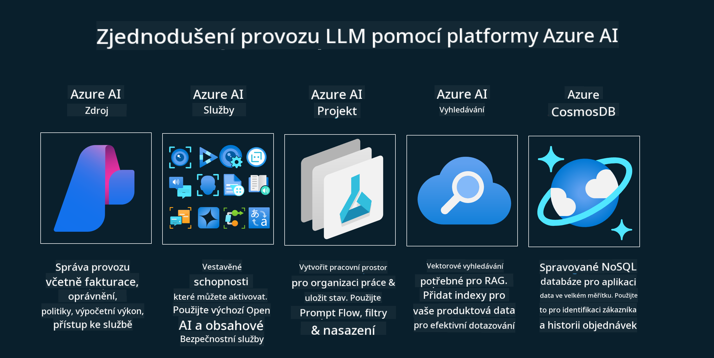

<!--
CO_OP_TRANSLATOR_METADATA:
{
  "original_hash": "b9d32511b27373a1b21b5789d4fda057",
  "translation_date": "2025-10-17T21:41:25+00:00",
  "source_file": "14-the-generative-ai-application-lifecycle/README.md",
  "language_code": "cs"
}
-->

# Životní cyklus aplikací generativní AI

Důležitou otázkou pro všechny AI aplikace je relevance AI funkcí, protože AI je rychle se vyvíjející oblast. Aby vaše aplikace zůstala relevantní, spolehlivá a robustní, je nutné ji neustále monitorovat, hodnotit a zlepšovat. Právě zde přichází na řadu životní cyklus generativní AI.

Životní cyklus generativní AI je rámec, který vás provede fázemi vývoje, nasazení a údržby generativní AI aplikace. Pomáhá vám definovat cíle, měřit výkon, identifikovat výzvy a implementovat řešení. Také vám pomáhá sladit vaši aplikaci s etickými a právními standardy vašeho oboru a vašich zainteresovaných stran. Dodržováním životního cyklu generativní AI zajistíte, že vaše aplikace bude vždy přinášet hodnotu a uspokojovat uživatele.

## Úvod

V této kapitole se naučíte:

- Porozumět posunu paradigmatu z MLOps na LLMOps
- Životní cyklus LLM
- Nástroje pro životní cyklus
- Metrifikace a hodnocení životního cyklu

## Porozumění posunu paradigmatu z MLOps na LLMOps

LLM jsou nový nástroj v arzenálu umělé inteligence. Jsou neuvěřitelně silné v analýze a generování úkolů pro aplikace, avšak tato síla má určité důsledky pro způsob, jakým optimalizujeme úkoly AI a klasického strojového učení.

Kvůli tomu potřebujeme nové paradigma, které tento nástroj adaptuje dynamicky a s vhodnými pobídkami. Starší AI aplikace můžeme kategorizovat jako "ML aplikace" a novější AI aplikace jako "GenAI aplikace" nebo jednoduše "AI aplikace", což odráží hlavní technologie a techniky používané v dané době. Tento posun mění náš přístup v mnoha ohledech, podívejte se na následující srovnání.

Všimněte si, že v LLMOps se více zaměřujeme na vývojáře aplikací, používáme integrace jako klíčový bod, využíváme "Modely jako službu" a zaměřujeme se na následující metriky:

- Kvalita: Kvalita odpovědí
- Škodlivost: Odpovědná AI
- Pravdivost: Základ odpovědí (Dává to smysl? Je to správné?)
- Náklady: Rozpočet řešení
- Latence: Průměrný čas na odpověď tokenu

## Životní cyklus LLM

Nejprve, abychom pochopili životní cyklus a jeho úpravy, podívejme se na následující infografiku.

Jak si můžete všimnout, toto se liší od obvyklých životních cyklů MLOps. LLM mají mnoho nových požadavků, jako je vytváření promptů, různé techniky pro zlepšení kvality (Fine-Tuning, RAG, Meta-Prompts), odlišné hodnocení a odpovědnost s odpovědnou AI, a nakonec nové metriky hodnocení (Kvalita, Škodlivost, Pravdivost, Náklady a Latence).

Například se podívejte, jak přemýšlíme. Používáme prompt engineering k experimentování s různými LLM, abychom prozkoumali možnosti a otestovali, zda jejich hypotéza může být správná.

Všimněte si, že tento proces není lineární, ale zahrnuje integrované smyčky, je iterativní a má celkový cyklus.

Jak bychom mohli prozkoumat tyto kroky? Pojďme se podrobněji podívat na to, jak bychom mohli vytvořit životní cyklus.

To může vypadat trochu složitě, zaměřme se nejprve na tři hlavní kroky.

1. Nápady/Průzkum: Průzkum, zde můžeme zkoumat podle našich obchodních potřeb. Prototypování, vytvoření [PromptFlow](https://microsoft.github.io/promptflow/index.html?WT.mc_id=academic-105485-koreyst) a testování, zda je dostatečně efektivní pro naši hypotézu.
2. Stavba/Zlepšování: Implementace, nyní začínáme hodnotit větší datové sady, implementovat techniky jako Fine-tuning a RAG, abychom ověřili robustnost našeho řešení. Pokud nefunguje, může pomoci jeho přepracování, přidání nových kroků do našeho toku nebo restrukturalizace dat. Po testování našeho toku a naší škály, pokud funguje a splňuje naše metriky, je připraven na další krok.
3. Provozování: Integrace, nyní přidáváme monitorovací a výstražné systémy do našeho systému, nasazení a integraci aplikace do naší aplikace.

Poté máme celkový cyklus správy, zaměřený na bezpečnost, shodu a řízení.

Gratulujeme, nyní máte svou AI aplikaci připravenou k provozu. Pro praktickou zkušenost se podívejte na [Contoso Chat Demo.](https://nitya.github.io/contoso-chat/?WT.mc_id=academic-105485-koreys)

Jaké nástroje bychom mohli použít?

## Nástroje pro životní cyklus

Pro nástroje Microsoft poskytuje [Azure AI Platform](https://azure.microsoft.com/solutions/ai/?WT.mc_id=academic-105485-koreys) a [PromptFlow](https://microsoft.github.io/promptflow/index.html?WT.mc_id=academic-105485-koreyst), které usnadňují a umožňují snadnou implementaci vašeho cyklu.

[Azure AI Platform](https://azure.microsoft.com/solutions/ai/?WT.mc_id=academic-105485-koreys) vám umožňuje používat [AI Studio](https://ai.azure.com/?WT.mc_id=academic-105485-koreys). AI Studio je webový portál, který vám umožňuje prozkoumávat modely, ukázky a nástroje. Spravovat vaše zdroje, vývojové toky UI a možnosti SDK/CLI pro vývoj zaměřený na kód.

Azure AI vám umožňuje používat různé zdroje pro správu vašich operací, služeb, projektů, vyhledávání vektoru a potřeb databází.

Vytvářejte od Proof-of-Concept (POC) až po aplikace ve velkém měřítku s PromptFlow:

- Navrhujte a vytvářejte aplikace z VS Code pomocí vizuálních a funkčních nástrojů
- Testujte a dolaďujte své aplikace pro kvalitní AI snadno.
- Používejte Azure AI Studio k integraci a iteraci s cloudem, nasazení a rychlé integraci.

## Skvělé! Pokračujte v učení!

Úžasné, nyní se dozvíte více o tom, jak strukturovat aplikaci, abyste mohli využít tyto koncepty s [Contoso Chat App](https://nitya.github.io/contoso-chat/?WT.mc_id=academic-105485-koreyst), a zjistíte, jak Cloud Advocacy přidává tyto koncepty do demonstrací. Pro více obsahu se podívejte na naši [Ignite breakout session!
](https://www.youtube.com/watch?v=DdOylyrTOWg)

Nyní se podívejte na lekci 15, abyste pochopili, jak [Retrieval Augmented Generation a vektorové databáze](../15-rag-and-vector-databases/README.md?WT.mc_id=academic-105485-koreyst) ovlivňují generativní AI a jak vytvořit více poutavé aplikace!

---

**Prohlášení**:  
Tento dokument byl přeložen pomocí služby AI pro překlady [Co-op Translator](https://github.com/Azure/co-op-translator). I když se snažíme o přesnost, mějte prosím na paměti, že automatizované překlady mohou obsahovat chyby nebo nepřesnosti. Původní dokument v jeho rodném jazyce by měl být považován za autoritativní zdroj. Pro důležité informace se doporučuje profesionální lidský překlad. Neodpovídáme za žádná nedorozumění nebo nesprávné interpretace vyplývající z použití tohoto překladu.