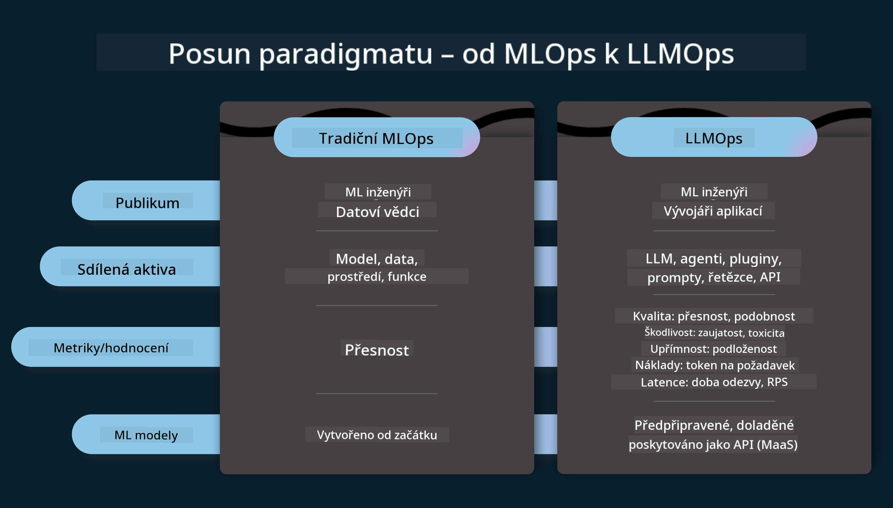
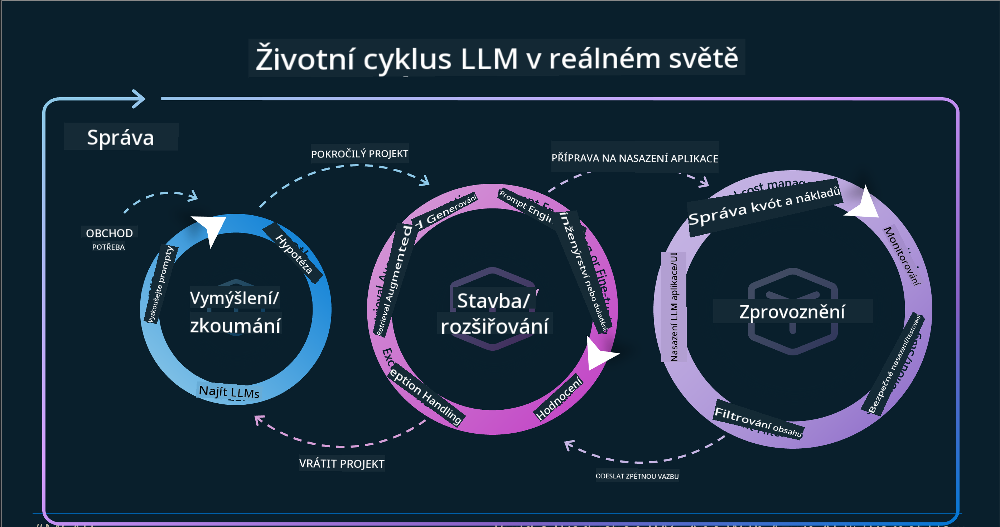
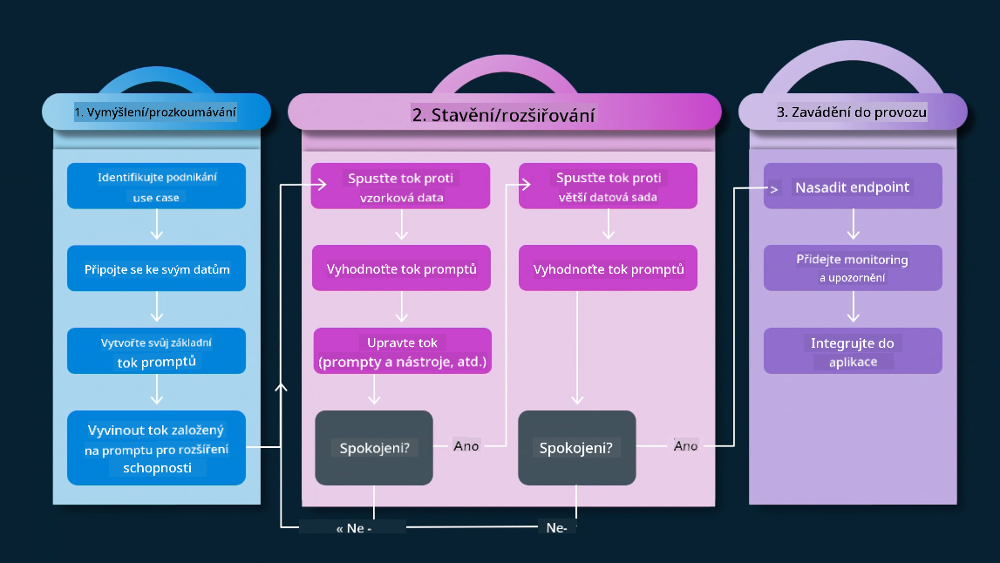
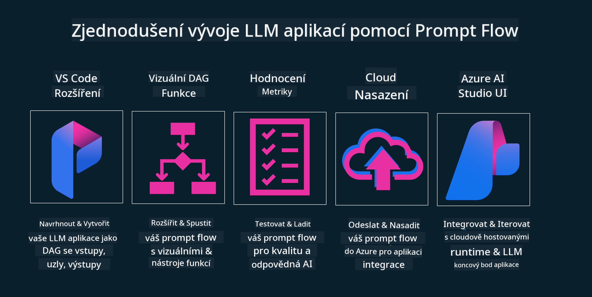

<!--
CO_OP_TRANSLATOR_METADATA:
{
  "original_hash": "27a5347a5022d5ef0a72ab029b03526a",
  "translation_date": "2025-07-09T15:57:56+00:00",
  "source_file": "14-the-generative-ai-application-lifecycle/README.md",
  "language_code": "cs"
}
-->

# Životní cyklus aplikace generativní AI

Důležitou otázkou pro všechny AI aplikace je relevance AI funkcí, protože AI je rychle se vyvíjející oblast. Aby vaše aplikace zůstala relevantní, spolehlivá a robustní, je potřeba ji neustále sledovat, vyhodnocovat a zlepšovat. Právě zde přichází na řadu životní cyklus generativní AI.

Životní cyklus generativní AI je rámec, který vás provede jednotlivými fázemi vývoje, nasazení a údržby generativní AI aplikace. Pomáhá vám definovat cíle, měřit výkon, identifikovat problémy a zavádět řešení. Také vám pomáhá sladit aplikaci s etickými a právními standardy vašeho oboru a zainteresovaných stran. Díky dodržování životního cyklu generativní AI zajistíte, že vaše aplikace bude vždy přinášet hodnotu a uspokojovat uživatele.

## Úvod

V této kapitole se naučíte:

- Pochopit posun paradigmatu z MLOps na LLMOps
- Životní cyklus LLM
- Nástroje pro životní cyklus
- Metriky a vyhodnocování životního cyklu

## Pochopit posun paradigmatu z MLOps na LLMOps

LLM jsou novým nástrojem v arzenálu umělé inteligence, jsou neuvěřitelně silné v analytických a generativních úlohách pro aplikace, avšak tato síla má dopady na to, jak zefektivňujeme úkoly AI a klasického strojového učení.

Potřebujeme tedy nové paradigma, které tento nástroj přizpůsobí dynamicky a s vhodnými pobídkami. Starší AI aplikace můžeme kategorizovat jako „ML aplikace“ a novější AI aplikace jako „GenAI aplikace“ nebo jednoduše „AI aplikace“, což odráží hlavní používané technologie a techniky v dané době. Tento posun mění náš pohled v několika směrech, podívejte se na následující srovnání.

Všimněte si, že v LLMOps se více zaměřujeme na vývojáře aplikací, klíčovým prvkem jsou integrace, využíváme „Modely jako službu“ a přemýšlíme o následujících metrikách.

- Kvalita: Kvalita odpovědi
- Škoda: Odpovědná AI
- Poctivost: Založenost odpovědi (Dává smysl? Je správná?)
- Náklady: Rozpočet řešení
- Latence: Průměrná doba odezvy na token

## Životní cyklus LLM

Nejprve, abychom pochopili životní cyklus a jeho úpravy, podívejme se na následující infografiku.

Jak si můžete všimnout, liší se od běžných životních cyklů v MLOps. LLM mají mnoho nových požadavků, jako je promptování, různé techniky pro zlepšení kvality (Fine-Tuning, RAG, Meta-Prompts), odlišné hodnocení a odpovědnost v rámci odpovědné AI, a nakonec nové hodnotící metriky (Kvalita, Škoda, Poctivost, Náklady a Latence).

Například se podívejte, jak probíhá ideace. Používáme prompt engineering k experimentování s různými LLM, abychom prozkoumali možnosti a otestovali, zda by jejich hypotéza mohla být správná.

Všimněte si, že to není lineární proces, ale integrované smyčky, iterativní a s celkovým cyklem.

Jak bychom mohli tyto kroky prozkoumat? Pojďme se podrobněji podívat, jak můžeme vytvořit životní cyklus.

Může to vypadat trochu složitě, nejprve se zaměřme na tři hlavní kroky.

1. Ideace/Průzkum: Průzkum, zde můžeme zkoumat podle našich obchodních potřeb. Prototypování, vytváření [PromptFlow](https://microsoft.github.io/promptflow/index.html?WT.mc_id=academic-105485-koreyst) a testování, zda je dostatečně efektivní pro naši hypotézu.
1. Vývoj/Rozšíření: Implementace, nyní začínáme hodnotit na větších datech, zavádíme techniky jako Fine-tuning a RAG, abychom ověřili robustnost našeho řešení. Pokud nefunguje, může pomoci jeho přepracování, přidání nových kroků do našeho procesu nebo restrukturalizace dat. Po otestování našeho procesu a škálování, pokud vše funguje a metriky jsou v pořádku, je připraveno na další krok.
1. Provozování: Integrace, nyní přidáváme monitorování a systém upozornění, nasazení a integraci aplikace do našeho systému.

Poté máme celkový cyklus řízení, zaměřený na bezpečnost, dodržování předpisů a správu.

Gratulujeme, nyní máte svou AI aplikaci připravenou k provozu. Pro praktickou zkušenost se podívejte na [Contoso Chat Demo.](https://nitya.github.io/contoso-chat/?WT.mc_id=academic-105485-koreys)

Jaké nástroje tedy můžeme použít?

## Nástroje pro životní cyklus

Pro nástroje Microsoft nabízí [Azure AI Platform](https://azure.microsoft.com/solutions/ai/?WT.mc_id=academic-105485-koreys) a [PromptFlow](https://microsoft.github.io/promptflow/index.html?WT.mc_id=academic-105485-koreyst), které usnadňují implementaci a zjednodušují váš cyklus.

[Azure AI Platform](https://azure.microsoft.com/solutions/ai/?WT.mc_id=academic-105485-koreys) vám umožňuje používat [AI Studio](https://ai.azure.com/?WT.mc_id=academic-105485-koreys). AI Studio je webový portál, který umožňuje prozkoumávat modely, ukázky a nástroje. Spravovat vaše zdroje, vývoj UI toků a možnosti SDK/CLI pro vývoj zaměřený na kód.

Azure AI vám umožňuje využívat různé zdroje pro správu operací, služeb, projektů, vyhledávání vektorů a databází.

Vytvářejte od Proof-of-Concept (POC) až po rozsáhlé aplikace s PromptFlow:

- Navrhujte a budujte aplikace ve VS Code s vizuálními a funkčními nástroji
- Testujte a dolaďujte své aplikace pro kvalitní AI jednoduše
- Používejte Azure AI Studio pro integraci a iteraci s cloudem, push a nasazení pro rychlou integraci

## Skvěle! Pokračujte ve vzdělávání!

Úžasné, nyní se naučte více o tom, jak strukturovat aplikaci a využít tyto koncepty s [Contoso Chat App](https://nitya.github.io/contoso-chat/?WT.mc_id=academic-105485-koreyst), kde Cloud Advocacy ukazuje tyto koncepty v demonstracích. Pro více obsahu si prohlédněte naši [Ignite breakout session!](https://www.youtube.com/watch?v=DdOylyrTOWg)

Nyní pokračujte Lekcí 15, kde pochopíte, jak [Retrieval Augmented Generation a vektorové databáze](../15-rag-and-vector-databases/README.md?WT.mc_id=academic-105485-koreyst) ovlivňují generativní AI a jak vytvářet zajímavější aplikace!

**Prohlášení o vyloučení odpovědnosti**:  
Tento dokument byl přeložen pomocí AI překladatelské služby [Co-op Translator](https://github.com/Azure/co-op-translator). I když usilujeme o přesnost, mějte prosím na paměti, že automatické překlady mohou obsahovat chyby nebo nepřesnosti. Původní dokument v jeho mateřském jazyce by měl být považován za závazný zdroj. Pro důležité informace se doporučuje profesionální lidský překlad. Nejsme odpovědní za jakékoliv nedorozumění nebo nesprávné výklady vyplývající z použití tohoto překladu.