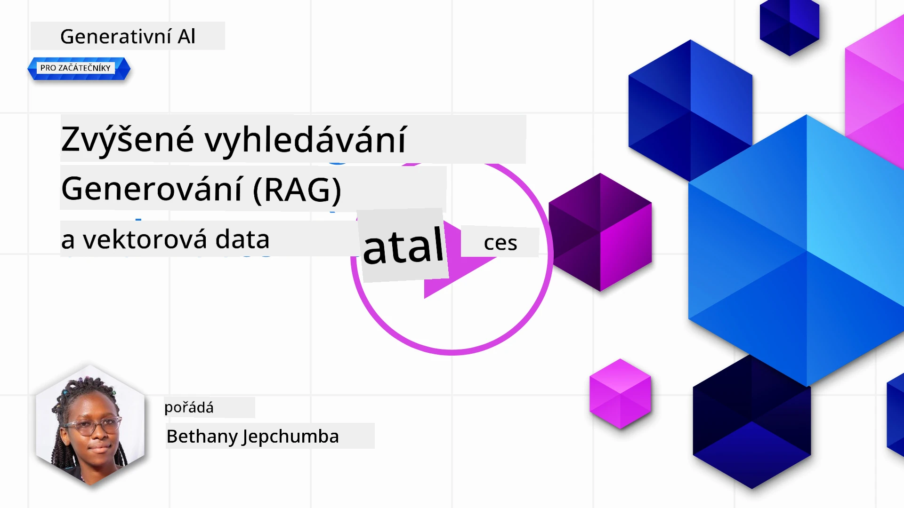
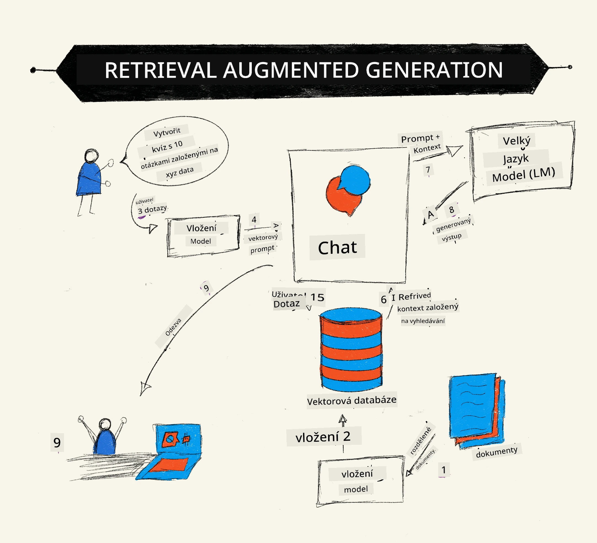
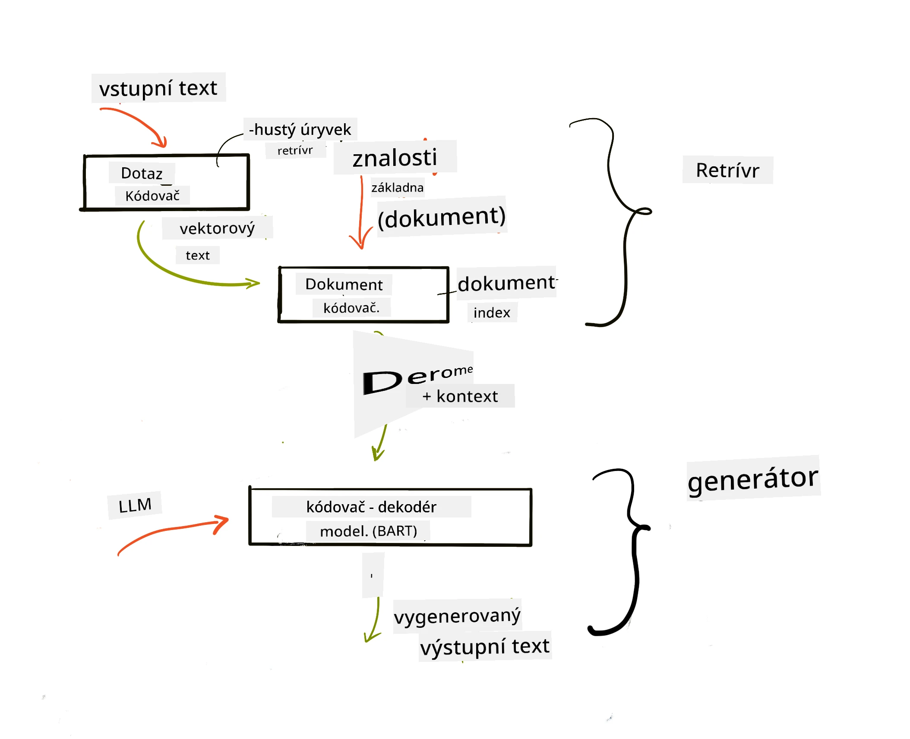
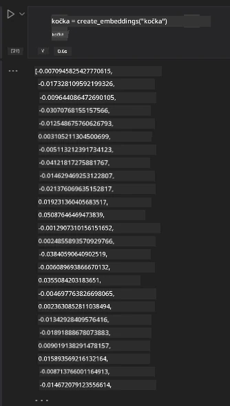

# Retrieval Augmented Generation (RAG) a vektorové databáze

[](https://youtu.be/4l8zhHUBeyI?si=BmvDmL1fnHtgQYkL)

V lekci o vyhledávacích aplikacích jsme se stručně naučili, jak integrovat vlastní data do Velkých jazykových modelů (LLM). V této lekci se podíváme podrobněji na koncepty zakládání vašich dat v aplikaci LLM, mechaniku tohoto procesu a metody ukládání dat, včetně embeddingů i textu.

> **Video brzy k dispozici**

## Úvod

V této lekci pokryjeme následující témata:

- Úvod do RAG, co to je a proč se používá v AI (umělé inteligenci).

- Pochopení, co jsou vektorové databáze a vytvoření jedné pro naši aplikaci.

- Praktický příklad, jak integrovat RAG do aplikace.

## Výukové cíle

Po dokončení této lekce budete schopni:

- Vysvětlit význam RAG při získávání a zpracování dat.

- Nastavit aplikaci RAG a zakotvit svá data do LLM.

- Efektivně integrovat RAG a vektorové databáze v aplikacích založených na LLM.

## Náš scénář: vylepšení našich LLM pomocí vlastních dat

Pro tuto lekci chceme přidat naše vlastní poznámky do vzdělávací startupové aplikace, což umožní chatbotu získat více informací o různých tématech. Použitím poznámek, které máme, budou studenti schopni se lépe učit a porozumět různým tématům, což usnadní opakování pro jejich zkoušky. Pro vytvoření scénáře použijeme:

- `Azure OpenAI:` LLM, které použijeme k vytvoření našeho chatbota

- `Lekce AI pro začátečníky o neuronových sítích:` na těchto datech založíme náš LLM

- `Azure AI Search` a `Azure Cosmos DB:` vektorová databáze pro ukládání našich dat a vytvoření vyhledávacího indexu

Uživatelé budou moci vytvářet cvičné kvízy z jejich poznámek, kartičky pro opakování a shrnutí do koncizních přehledů. Pro začátek si pojďme ukázat, co je RAG a jak funguje:

## Retrieval Augmented Generation (RAG)

Chatbot založený na LLM zpracovává uživatelské dotazy k vytvoření odpovědí. Je navržen tak, aby byl interaktivní a komunikoval s uživateli na široké spektrum témat. Jeho odpovědi jsou však omezeny kontextem, který byl poskytnut, a základními tréninkovými daty. Například znalostní mez GPT-4 je září 2021, což znamená, že postrádá informace o událostech po tomto období. Navíc data použitá pro trénink LLM nezahrnují důvěrné informace, jako jsou osobní poznámky nebo uživatelský manuál společnosti.

### Jak fungují RAG (Retrieval Augmented Generation)



Předpokládejme, že chcete nasadit chatbota, který vytváří kvízy z vašich poznámek; budete potřebovat připojení k znalostní bázi. Zde přichází na pomoc RAG. RAG fungují takto:

- **Znalostní báze:** Před vyhledáváním je třeba dokumenty importovat a předzpracovat, obvykle rozdělením velkých dokumentů na menší části, převedením na textové embeddingy a uložení do databáze.

- **Uživatelský dotaz:** uživatel položí otázku.

- **Vyhledávání:** Když uživatel položí otázku, embeddingový model vyhledá relevantní informace ze znalostní báze, aby poskytl více kontextu, který bude zahrnut do promptu.

- **Rozšířená generace:** LLM vylepšuje svou odpověď na základě získaných dat. Umožňuje generovat odpovědi nejen na základě předem natrénovaných dat, ale i relevantních informací z dodaného kontextu. Získaná data slouží k rozšíření odpovědí LLM. LLM pak vrací odpověď na dotaz uživatele.



Architektura RAG je implementována pomocí transformátorů skládajících se ze dvou částí: enkodéru a dekodéru. Například když uživatel položí otázku, vstupní text je „zakódován“ do vektorů zachycujících význam slov, a tyto vektory jsou „dekódovány“ na náš index dokumentů a generují nový text na základě uživatelského dotazu. LLM používá model enkodér-dekodér k vytvoření výstupu.

Dva přístupy k implementaci RAG podle navrhovaného článku: [Retrieval-Augmented Generation for Knowledge intensive NLP (natural language processing software) Tasks](https://arxiv.org/pdf/2005.11401.pdf?WT.mc_id=academic-105485-koreyst) jsou:

- **_RAG-Sequence_** používající získané dokumenty k předpovědi nejlepší možné odpovědi na uživatelský dotaz

- **RAG-Token** používající dokumenty k generování dalšího tokenu, a poté je znovu získat k odpovědi na dotaz uživatele

### Proč používat RAG?

- **Bohatost informací:** zajišťuje, že textové odpovědi jsou aktuální a aktuální. Zvýrazňuje výkon na specifických doménových úlohách přístupem do interní znalostní báze.

- Snižuje výrobu nesprávných informací využitím **ověřitelných dat** v znalostní bázi k poskytnutí kontextu uživatelským dotazům.

- Je **nákladově efektivní**, protože je ekonomičtější než doladění (fine-tuning) LLM.

## Vytvoření znalostní báze

Naše aplikace je založena na našich osobních datech, tj. lekci o neuronových sítích z kurikula AI pro začátečníky.

### Vektorové databáze

Vektorová databáze, na rozdíl od tradičních databází, je specializovaná databáze navržená k ukládání, správě a vyhledávání vložených vektorů. Ukládá číselné reprezentace dokumentů. Rozložení dat na číselné embeddingy usnadňuje našemu AI systému porozumění a zpracování dat.

Ukládáme naše embeddingy ve vektorových databázích, protože LLM mají omezený počet tokenů, které přijímají jako vstup. Jelikož nelze poslat celé embeddingy do LLM, musíme je rozdělit na části a když uživatel položí otázku, vrátí se nejpravděpodobnější embeddingy spolu s promptem. Rozdělení také snižuje náklady na počet tokenů odesílaných do LLM.

Mezi oblíbené vektorové databáze patří Azure Cosmos DB, Clarifyai, Pinecone, Chromadb, ScaNN, Qdrant a DeepLake. Azure Cosmos DB model můžete vytvořit pomocí Azure CLI pomocí následujícího příkazu:

```bash
az login
az group create -n <resource-group-name> -l <location>
az cosmosdb create -n <cosmos-db-name> -r <resource-group-name>
az cosmosdb list-keys -n <cosmos-db-name> -g <resource-group-name>
```

### Od textu k embeddingům

Před uložením dat je třeba je převést na vektorové embeddingy. Pokud pracujete s velkými dokumenty nebo dlouhými texty, můžete je rozdělit na části podle očekávaných dotazů. Rozdělení může být na úrovni vět nebo odstavců. Protože rozdělení odvozuje významy z okolních slov, můžete k části přidat i jiný kontext, například název dokumentu nebo nějaký text před nebo za částí. Data můžete rozdělit takto:

```python
def split_text(text, max_length, min_length):
    words = text.split()
    chunks = []
    current_chunk = []

    for word in words:
        current_chunk.append(word)
        if len(' '.join(current_chunk)) < max_length and len(' '.join(current_chunk)) > min_length:
            chunks.append(' '.join(current_chunk))
            current_chunk = []

    # Pokud poslední kus nedosáhl minimální délky, přidejte ho přesto
    if current_chunk:
        chunks.append(' '.join(current_chunk))

    return chunks
```

Jakmile máme data rozdělená na části, můžeme je vložit pomocí různých embedding modelů. Některé modely, které můžete použít, zahrnují: word2vec, ada-002 od OpenAI, Azure Computer Vision a mnoho dalších. Výběr modelu závisí na jazycích, které používáte, na typu kódovaného obsahu (text/obrázky/audio), velikosti vstupu, který může kódovat, a délce výstupního embeddingu.

Příklad vloženého textu pomocí modelu OpenAI `text-embedding-ada-002` je:


## Vyhledávání a vektorové dotazy

Když uživatel položí otázku, vyhledávač ji převede na vektor pomocí dotazového enkodéru a poté prohledává náš vyhledávací index dokumentů, hledaje relevantní vektory v dokumentu vztahující se k vstupu. Jakmile je vyhledávání hotovo, převede vstupní vektor i vektory dokumentů zpět na text a předá je LLM.

### Vyhledávání

Vyhledávání nastává, když se systém snaží rychle najít dokumenty v indexu, které splňují kritéria vyhledávání. Cílem vyhledávače je získat dokumenty, které budou použity k poskytnutí kontextu a zakotvení LLM ve vašich datech.

Existuje několik způsobů, jak vyhledávat v databázi, například:

- **Klíčové slovo** - používá se pro textové vyhledávání

- **Vektorové vyhledávání** - převádí dokumenty z textu do vektorové reprezentace pomocí embedding modelů, což umožňuje **sémantické vyhledávání** podle významu slov. Vyhledávání probíhá dotazem na dokumenty, jejichž vektorové reprezentace jsou nejbližší dotazu uživatele.

- **Hybridní** - kombinace klíčového slova a vektorového vyhledávání.

Výzvou při vyhledávání je situace, kdy v databázi není žádná podobná odpověď na dotaz, systém potom vrátí nejlepší dostupné informace. Můžete však použít taktiky jako nastavení maximální vzdálenosti pro relevanci nebo hybridní vyhledávání, které kombinuje klíčová slova s vektorovým vyhledáváním. V této lekci použijeme hybridní vyhledávání, tedy kombinaci vektorového a klíčového vyhledávání. Data uložíme do dataframe s sloupci obsahujícími části dat i embeddingy.

### Vektorová podobnost

Vyhledávač prohledá znalostní databázi na embeddingy, které jsou blízké, neboli nejbližší sousedé, protože jsou texty podobné. V situaci, kdy uživatel položí dotaz, je nejprve vložen a poté porovnán s podobnými embeddingy. Běžným měřítkem podobnosti je kosinová podobnost, založená na úhlu mezi dvěma vektory.

Podobnost lze měřit i dalšími alternativami, například Euklidovskou vzdáleností, což je přímá vzdálenost mezi koncovými body vektorů, nebo skalárním součinem, který měří součet součinů odpovídajících prvků dvou vektorů.

### Vyhledávací index

Při vyhledávání je nutné před samotným hledáním vytvořit vyhledávací index pro naši znalostní bázi. Index uloží naše embeddingy a může rychle najít nejpodobnější části i v rozsáhlé databázi. Index můžeme vytvořit lokálně pomocí:

```python
from sklearn.neighbors import NearestNeighbors

embeddings = flattened_df['embeddings'].to_list()

# Vytvořit vyhledávací index
nbrs = NearestNeighbors(n_neighbors=5, algorithm='ball_tree').fit(embeddings)

# K dotazu na index můžete použít metodu kneighbors
distances, indices = nbrs.kneighbors(embeddings)
```

### Přerovnávání výsledků (Re-ranking)

Po získání výsledků z databáze je často potřeba je seřadit dle relevance. Přerovnávací LLM využívá strojové učení ke zlepšení relevance vyhledávacích výsledků pomocí jejich seřazení od nejrelevantnějších. Pomocí Azure AI Search je přerovnání provedeno automaticky díky sémantickému přerovnavači. Příklad přerovnání pomocí nejbližších sousedů:

```python
# Najděte nejpodobnější dokumenty
distances, indices = nbrs.kneighbors([query_vector])

index = []
# Vytiskněte nejpodobnější dokumenty
for i in range(3):
    index = indices[0][i]
    for index in indices[0]:
        print(flattened_df['chunks'].iloc[index])
        print(flattened_df['path'].iloc[index])
        print(flattened_df['distances'].iloc[index])
    else:
        print(f"Index {index} not found in DataFrame")
```

## Vše spojeno dohromady

Posledním krokem je začlenění našeho LLM do procesu, abychom mohli získat odpovědi založené na našich datech. Můžeme to implementovat následovně:

```python
user_input = "what is a perceptron?"

def chatbot(user_input):
    # Převeďte otázku na vektor dotazu
    query_vector = create_embeddings(user_input)

    # Najděte nejpodobnější dokumenty
    distances, indices = nbrs.kneighbors([query_vector])

    # přidejte dokumenty k dotazu pro poskytnutí kontextu
    history = []
    for index in indices[0]:
        history.append(flattened_df['chunks'].iloc[index])

    # spojte historii a uživatelský vstup
    history.append(user_input)

    # vytvořte objekt zprávy
    messages=[
        {"role": "system", "content": "You are an AI assistant that helps with AI questions."},
        {"role": "user", "content": "\n\n".join(history) }
    ]

    # použijte dokončení chatu pro generování odpovědi
    response = openai.chat.completions.create(
        model="gpt-4",
        temperature=0.7,
        max_tokens=800,
        messages=messages
    )

    return response.choices[0].message

chatbot(user_input)
```

## Hodnocení naší aplikace

### Evaluační metriky

- Kvalita odpovědí, aby zněly přirozeně, plynule a lidsky

- Zakotvení dat: hodnocení, zda odpověď vychází ze poskytnutých dokumentů

- Relevance: hodnocení, zda odpověď odpovídá a souvisí s položenou otázkou

- Plynulost – zda odpověď dává gramatický smysl

## Případové použití RAG (Retrieval Augmented Generation) a vektorových databází

Existuje mnoho různých případů použití, kde mohou funkční volání zlepšit vaši aplikaci, například:

- Otázky a odpovědi: zakotvení firemních dat do chatu, který mohou zaměstnanci použít k dotazování.

- Doporučovací systémy: kde můžete vytvořit systém, který přiřadí nejpodobnější hodnoty, např. filmy, restaurace a mnoho dalších.

- Chatbot služby: lze ukládat historii chatu a personalizovat konverzaci na základě uživatelských dat.

- Vyhledávání obrázků na základě vektorových embeddingů, užitečné pro rozpoznávání obrázků a detekci anomálií.

## Shrnutí

Probrali jsme základní oblasti RAG od přidání našich dat do aplikace, uživatelského dotazu až po výstup. Pro zjednodušení tvorby RAG můžete použít frameworky jako Semanti Kernel, Langchain nebo Autogen.

## Zadání

Pro pokračování ve studiu Retrieval Augmented Generation (RAG) můžete vytvořit:

- Front-end pro aplikaci pomocí vámi zvoleného frameworku

- Využít framework LangChain nebo Semantic Kernel a znovu vytvořit svou aplikaci.

Gratulujeme k dokončení lekce 👏.

## Učení zde nekončí, pokračujte v cestě

Po dokončení této lekce si prohlédněte naši [sbírku Generative AI Learning collection](https://aka.ms/genai-collection?WT.mc_id=academic-105485-koreyst), abyste pokračovali ve zvyšování svých znalostí Generativní AI!

---

<!-- CO-OP TRANSLATOR DISCLAIMER START -->
**Prohlášení o omezení odpovědnosti**:
Tento dokument byl přeložen pomocí AI překladatelské služby [Co-op Translator](https://github.com/Azure/co-op-translator). Přestože usilujeme o přesnost, mějte prosím na paměti, že automatizované překlady mohou obsahovat chyby nebo nepřesnosti. Původní dokument v jeho mateřském jazyce by měl být považován za závazný zdroj. Pro důležité informace se doporučuje profesionální lidský překlad. Nejsme odpovědní za jakékoliv nedorozumění nebo nesprávné výklady vzniklé použitím tohoto překladu.
<!-- CO-OP TRANSLATOR DISCLAIMER END -->