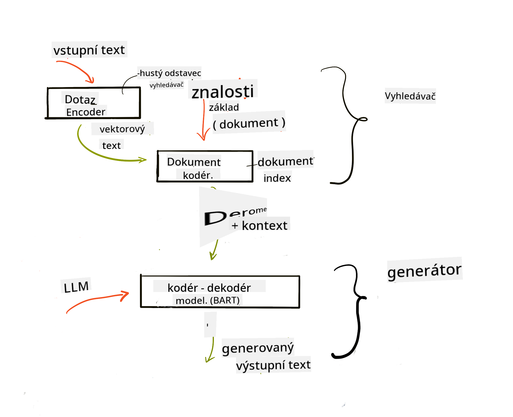

<!--
CO_OP_TRANSLATOR_METADATA:
{
  "original_hash": "e2861bbca91c0567ef32bc77fe054f9e",
  "translation_date": "2025-05-20T01:40:20+00:00",
  "source_file": "15-rag-and-vector-databases/README.md",
  "language_code": "cs"
}
-->
# Retrieval Augmented Generation (RAG) a vektorové databáze

[](https://aka.ms/gen-ai-lesson15-gh?WT.mc_id=academic-105485-koreyst)

V lekci o vyhledávacích aplikacích jsme se stručně naučili, jak integrovat vlastní data do velkých jazykových modelů (LLM). V této lekci se podrobněji podíváme na koncepty zakotvení vašich dat v aplikaci LLM, mechanismy procesu a metody ukládání dat, včetně embeddingů a textu.

> **Video brzy dostupné**

## Úvod

V této lekci se budeme zabývat následujícími tématy:

- Úvod do RAG, co to je a proč se používá v umělé inteligenci (AI).

- Pochopení, co jsou vektorové databáze, a vytvoření jedné pro naši aplikaci.

- Praktický příklad, jak integrovat RAG do aplikace.

## Cíle učení

Po dokončení této lekce budete schopni:

- Vysvětlit význam RAG při získávání a zpracování dat.

- Nastavit aplikaci RAG a zakotvit svá data do LLM.

- Efektivní integrace RAG a vektorových databází v aplikacích LLM.

## Naše scénář: vylepšení našich LLM vlastními daty

V této lekci chceme přidat vlastní poznámky do vzdělávacího startupu, což umožní chatbotovi získat více informací o různých předmětech. Pomocí poznámek, které máme, se studenti budou moci lépe učit a porozumět různým tématům, což usnadní přípravu na zkoušky. K vytvoření našeho scénáře použijeme:

- `Azure OpenAI:` LLM, které použijeme k vytvoření našeho chatbota

- `AI for beginners' lesson on Neural Networks`: to budou data, na kterých zakotvíme naše LLM

- `Azure AI Search` a `Azure Cosmos DB:` vektorová databáze pro uložení našich dat a vytvoření vyhledávacího indexu

Uživatelé budou moci vytvářet cvičné kvízy z jejich poznámek, revizní kartičky a shrnout je do stručných přehledů. Abychom začali, podívejme se, co je RAG a jak funguje:

## Retrieval Augmented Generation (RAG)

Chatbot poháněný LLM zpracovává uživatelské podněty k generování odpovědí. Je navržen tak, aby byl interaktivní a zapojoval se do široké škály témat. Jeho odpovědi jsou však omezeny na kontext, který mu je poskytnut, a jeho základní tréninková data. Například, GPT-4 má znalostní limit do září 2021, což znamená, že postrádá znalosti o událostech, které nastaly po tomto období. Navíc data použitá k tréninku LLM vylučují důvěrné informace, jako jsou osobní poznámky nebo manuál produktu společnosti.

### Jak fungují RAGs (Retrieval Augmented Generation)


Představte si, že chcete nasadit chatbota, který vytváří kvízy z vašich poznámek, budete potřebovat spojení s databází znalostí. Zde přichází RAG na pomoc. RAGs fungují následovně:

- **Databáze znalostí:** Před získáváním musí být tyto dokumenty ingestovány a předzpracovány, obvykle rozdělením velkých dokumentů na menší části, transformací na textové embeddingy a uložením do databáze.

- **Dotaz uživatele:** uživatel položí otázku

- **Získávání:** Když uživatel položí otázku, embedding model získá relevantní informace z naší databáze znalostí, aby poskytl více kontextu, který bude začleněn do podnětu.

- **Augmentovaná generace:** LLM vylepšuje svou odpověď na základě získaných dat. To umožňuje, aby odpověď byla založena nejen na předtrénovaných datech, ale také na relevantních informacích z přidaného kontextu. Získaná data jsou použita k augmentaci odpovědí LLM. LLM pak vrátí odpověď na otázku uživatele.



Architektura pro RAGs je implementována pomocí transformátorů, které se skládají ze dvou částí: enkodéru a dekodéru. Například, když uživatel položí otázku, vstupní text je 'zakódován' do vektorů zachycujících význam slov a vektory jsou 'dekódovány' do našeho indexu dokumentů a generují nový text na základě dotazu uživatele. LLM používá model enkodér-dekodér k vygenerování výstupu.

Dva přístupy při implementaci RAG podle navrhovaného dokumentu: [Retrieval-Augmented Generation for Knowledge intensive NLP (natural language processing software) Tasks](https://arxiv.org/pdf/2005.11401.pdf?WT.mc_id=academic-105485-koreyst) jsou:

- **_RAG-Sequence_** používající získané dokumenty k predikci nejlepší možné odpovědi na dotaz uživatele

- **RAG-Token** používající dokumenty k vygenerování dalšího tokenu, poté je získá k odpovědi na dotaz uživatele

### Proč byste použili RAGs? 

- **Bohatost informací:** zajišťuje, že textové odpovědi jsou aktuální a moderní. Proto zlepšuje výkon při úkolech specifických pro danou doménu přístupem k interní databázi znalostí.

- Snižuje fabulaci využitím **ověřitelných dat** v databázi znalostí k poskytnutí kontextu uživatelským dotazům.

- Je **nákladově efektivní**, protože je ekonomičtější než doladění LLM.

## Vytváření databáze znalostí

Naše aplikace je založena na našich osobních datech, tj. lekci o neuronových sítích v kurikulu AI pro začátečníky.

### Vektorové databáze

Vektorová databáze, na rozdíl od tradičních databází, je specializovaná databáze určená k ukládání, správě a vyhledávání vložených vektorů. Ukládá číselné reprezentace dokumentů. Rozložení dat na číselné embeddingy usnadňuje našemu AI systému porozumění a zpracování dat.

Ukládáme naše embeddingy do vektorových databází, protože LLM mají limit počtu tokenů, které přijímají jako vstup. Protože nemůžete předat celé embeddingy do LLM, budeme je muset rozdělit na části a když uživatel položí otázku, embeddingy nejvíce podobné otázce budou vráceny spolu s podnětem. Rozdělení také snižuje náklady na počet tokenů prošlých LLM.

Některé populární vektorové databáze zahrnují Azure Cosmos DB, Clarifyai, Pinecone, Chromadb, ScaNN, Qdrant a DeepLake. Můžete vytvořit model Azure Cosmos DB pomocí Azure CLI s následujícím příkazem:

```bash
az login
az group create -n <resource-group-name> -l <location>
az cosmosdb create -n <cosmos-db-name> -r <resource-group-name>
az cosmosdb list-keys -n <cosmos-db-name> -g <resource-group-name>
```

### Od textu k embeddingům

Před uložením našich dat je budeme muset převést na vektorové embeddingy, než budou uloženy v databázi. Pokud pracujete s velkými dokumenty nebo dlouhými texty, můžete je rozdělit na základě dotazů, které očekáváte. Rozdělení může být provedeno na úrovni vět nebo na úrovni odstavců. Protože rozdělení odvozuje významy z okolních slov, můžete přidat nějaký další kontext k části, například přidáním názvu dokumentu nebo zahrnutím nějakého textu před nebo po části. Můžete data rozdělit následovně:

```python
def split_text(text, max_length, min_length):
    words = text.split()
    chunks = []
    current_chunk = []

    for word in words:
        current_chunk.append(word)
        if len(' '.join(current_chunk)) < max_length and len(' '.join(current_chunk)) > min_length:
            chunks.append(' '.join(current_chunk))
            current_chunk = []

    # If the last chunk didn't reach the minimum length, add it anyway
    if current_chunk:
        chunks.append(' '.join(current_chunk))

    return chunks
```

Jakmile jsou rozdělena, můžeme naše texty vložit pomocí různých embeddingových modelů. Některé modely, které můžete použít, zahrnují: word2vec, ada-002 od OpenAI, Azure Computer Vision a mnoho dalších. Výběr modelu, který použijete, bude záviset na jazycích, které používáte, typu obsahu kódovaného (text/obrázky/audio), velikosti vstupu, který může kódovat, a délce výstupu embeddingu.

Příklad vloženého textu pomocí modelu `text-embedding-ada-002` od OpenAI je:


## Získávání a vektorové vyhledávání

Když uživatel položí otázku, retriever ji transformuje na vektor pomocí enkodéru dotazu, poté prohledává náš vyhledávací index dokumentů pro relevantní vektory v dokumentu, které jsou spojeny se vstupem. Jakmile je hotovo, převádí jak vstupní vektor, tak vektory dokumentu na text a předává jej přes LLM.

### Získávání

Získávání se děje, když se systém snaží rychle najít dokumenty z indexu, které splňují kritéria vyhledávání. Cílem retrieveru je získat dokumenty, které budou použity k poskytnutí kontextu a zakotvení LLM na vašich datech.

Existuje několik způsobů, jak provádět vyhledávání v naší databázi, například:

- **Vyhledávání klíčových slov** - používá se pro textové vyhledávání

- **Sémantické vyhledávání** - používá sémantický význam slov

- **Vektorové vyhledávání** - převádí dokumenty z textu na vektorové reprezentace pomocí embeddingových modelů. Získávání bude provedeno dotazováním dokumentů, jejichž vektorové reprezentace jsou nejblíže otázce uživatele.

- **Hybridní** - kombinace jak vyhledávání klíčových slov, tak vektorového vyhledávání.

Výzva při získávání přichází, když v databázi není podobná odpověď na dotaz, systém pak vrátí nejlepší informace, které může získat, nicméně můžete použít taktiky jako nastavení maximální vzdálenosti pro relevantnost nebo použití hybridního vyhledávání, které kombinuje jak klíčová slova, tak vektorové vyhledávání. V této lekci použijeme hybridní vyhledávání, kombinaci jak vektorového, tak klíčového vyhledávání. Uložíme naše data do datového rámce se sloupci obsahujícími části i embeddingy.

### Vektorová podobnost

Retriever prohledá databázi znalostí pro embeddingy, které jsou blízko sebe, nejbližší soused, protože jsou to texty, které jsou podobné. V případě, že uživatel položí dotaz, je nejprve vložen a poté spárován s podobnými embeddingy. Běžné měření, které se používá k zjištění, jak podobné jsou různé vektory, je kosinová podobnost, která je založena na úhlu mezi dvěma vektory.

Můžeme měřit podobnost pomocí jiných alternativ, které můžeme použít, jako je Euklidovská vzdálenost, která je přímkou mezi koncovými body vektorů, a skalární součin, který měří součet součinů odpovídajících prvků dvou vektorů.

### Vyhledávací index

Při provádění získávání budeme potřebovat vytvořit vyhledávací index pro naši databázi znalostí před provedením vyhledávání. Index uloží naše embeddingy a může rychle získat nejpodobnější části i ve velké databázi. Můžeme vytvořit náš index lokálně pomocí:

```python
from sklearn.neighbors import NearestNeighbors

embeddings = flattened_df['embeddings'].to_list()

# Create the search index
nbrs = NearestNeighbors(n_neighbors=5, algorithm='ball_tree').fit(embeddings)

# To query the index, you can use the kneighbors method
distances, indices = nbrs.kneighbors(embeddings)
```

### Přerovnání

Jakmile dotazujete databázi, možná budete potřebovat seřadit výsledky od nejrelevantnějších. Přerovnávací LLM využívá strojové učení ke zlepšení relevance výsledků vyhledávání jejich uspořádáním od nejrelevantnějších. Pomocí Azure AI Search je přerovnání provedeno automaticky pomocí sémantického přerovnávače. Příklad, jak přerovnání funguje pomocí nejbližších sousedů:

```python
# Find the most similar documents
distances, indices = nbrs.kneighbors([query_vector])

index = []
# Print the most similar documents
for i in range(3):
    index = indices[0][i]
    for index in indices[0]:
        print(flattened_df['chunks'].iloc[index])
        print(flattened_df['path'].iloc[index])
        print(flattened_df['distances'].iloc[index])
    else:
        print(f"Index {index} not found in DataFrame")
```

## Spojení všeho dohromady

Posledním krokem je přidání našeho LLM do směsi, abychom mohli získat odpovědi, které jsou zakotvené v našich datech. Můžeme to implementovat následovně:

```python
user_input = "what is a perceptron?"

def chatbot(user_input):
    # Convert the question to a query vector
    query_vector = create_embeddings(user_input)

    # Find the most similar documents
    distances, indices = nbrs.kneighbors([query_vector])

    # add documents to query  to provide context
    history = []
    for index in indices[0]:
        history.append(flattened_df['chunks'].iloc[index])

    # combine the history and the user input
    history.append(user_input)

    # create a message object
    messages=[
        {"role": "system", "content": "You are an AI assistant that helps with AI questions."},
        {"role": "user", "content": history[-1]}
    ]

    # use chat completion to generate a response
    response = openai.chat.completions.create(
        model="gpt-4",
        temperature=0.7,
        max_tokens=800,
        messages=messages
    )

    return response.choices[0].message

chatbot(user_input)
```

## Hodnocení naší aplikace

### Hodnotící metriky

- Kvalita poskytovaných odpovědí zajišťující, že zní přirozeně, plynule a lidsky

- Zakotvenost dat: hodnocení, zda odpověď pochází z poskytnutých dokumentů

- Relevance: hodnocení, zda odpověď odpovídá a souvisí s položenou otázkou

- Plynulost - zda odpověď dává smysl gramaticky

## Použití RAG (Retrieval Augmented Generation) a vektorových databází

Existuje mnoho různých případů použití, kde funkční volání může zlepšit vaši aplikaci, například:

- Otázky a odpovědi: zakotvení dat vaší společnosti do chatu, který mohou zaměstnanci používat k pokládání otázek.

- Doporučovací systémy: kde můžete vytvořit systém, který páruje nejpodobnější hodnoty, např. filmy, restaurace a mnoho dalších.

- Služby chatbotů: můžete ukládat historii chatu a personalizovat konverzaci na základě uživatelských dat.

- Vyhledávání obrázků na základě vektorových embeddingů, užitečné při rozpoznávání obrázků a detekci anomálií.

## Shrnutí

Pokryli jsme základní oblasti RAG od přidání našich dat do aplikace, uživatelského dotazu a výstupu. K zjednodušení tvorby RAG můžete použít rámce jako Semanti Kernel, Langchain nebo Autogen.

## Zadání

Pro pokračování ve studiu Retrieval Augmented Generation (RAG) můžete vytvořit:

- Vytvořte front-end pro aplikaci pomocí vámi zvoleného rámce

- Využijte rámec, buď LangChain nebo Semantic Kernel, a znovu vytvořte svou aplikaci.

Gratulujeme k dokončení lekce 👏.

## Učení zde nekončí, pokračujte v cestě

Po dokončení této lekce se podívejte na naši [Generativní AI Learning kolekci](https://aka.ms/genai-collection?WT.mc_id=academic-105485-koreyst) a pokračujte v rozšiřování svých znalostí o generativní AI!

**Prohlášení**:  
Tento dokument byl přeložen pomocí AI překladové služby [Co-op Translator](https://github.com/Azure/co-op-translator). Ačkoli se snažíme o přesnost, mějte prosím na paměti, že automatizované překlady mohou obsahovat chyby nebo nepřesnosti. Původní dokument v jeho rodném jazyce by měl být považován za autoritativní zdroj. Pro důležité informace se doporučuje profesionální lidský překlad. Nejsme zodpovědní za jakékoli nedorozumění nebo nesprávné interpretace vyplývající z použití tohoto překladu.