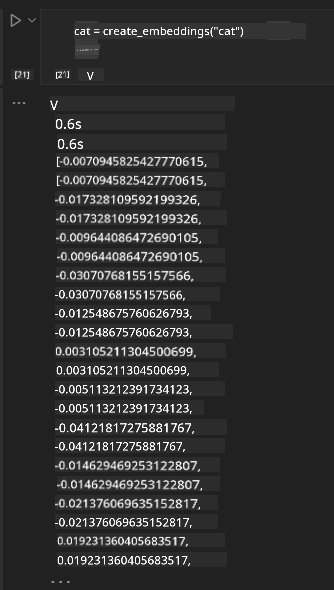

<!--
CO_OP_TRANSLATOR_METADATA:
{
  "original_hash": "e2861bbca91c0567ef32bc77fe054f9e",
  "translation_date": "2025-07-09T16:19:06+00:00",
  "source_file": "15-rag-and-vector-databases/README.md",
  "language_code": "cs"
}
-->
# Retrieval Augmented Generation (RAG) a vektorové databáze

[](https://aka.ms/gen-ai-lesson15-gh?WT.mc_id=academic-105485-koreyst)

V lekci o vyhledávacích aplikacích jsme si stručně ukázali, jak integrovat vlastní data do velkých jazykových modelů (LLM). V této lekci se podrobněji podíváme na koncept zakotvení vašich dat v aplikaci LLM, na mechaniku tohoto procesu a metody ukládání dat, včetně embeddingů i textu.

> **Video brzy k dispozici**

## Úvod

V této lekci se budeme věnovat následujícím tématům:

- Úvod do RAG, co to je a proč se používá v AI (umělé inteligenci).

- Pochopení, co jsou vektorové databáze a vytvoření jedné pro naši aplikaci.

- Praktický příklad, jak integrovat RAG do aplikace.

## Cíle učení

Po dokončení této lekce budete schopni:

- Vysvětlit význam RAG při vyhledávání a zpracování dat.

- Nastavit RAG aplikaci a zakotvit svá data v LLM.

- Efektivně integrovat RAG a vektorové databáze v aplikacích LLM.

## Náš scénář: vylepšení našich LLM pomocí vlastních dat

Pro tuto lekci chceme přidat vlastní poznámky do vzdělávacího startupu, což umožní chatbotovi získat více informací o různých předmětech. Díky poznámkám, které máme, budou studenti schopni lépe studovat a porozumět různým tématům, což jim usnadní přípravu na zkoušky. Pro vytvoření našeho scénáře použijeme:

- `Azure OpenAI:` LLM, které použijeme k vytvoření našeho chatbota

- `Lekci AI pro začátečníky o neuronových sítích:` tato data použijeme jako základ pro naše LLM

- `Azure AI Search` a `Azure Cosmos DB:` vektorová databáze pro ukládání dat a vytvoření vyhledávacího indexu

Uživatelé budou moci vytvářet cvičné kvízy ze svých poznámek, opakovací flash karty a shrnutí do přehledných přehledů. Pro začátek si pojďme vysvětlit, co je RAG a jak funguje:

## Retrieval Augmented Generation (RAG)

Chatbot poháněný LLM zpracovává uživatelské dotazy a generuje odpovědi. Je navržen tak, aby byl interaktivní a komunikoval s uživateli na široké škále témat. Jeho odpovědi jsou však omezeny kontextem, který má k dispozici, a základními tréninkovými daty. Například znalostní hranice GPT-4 je září 2021, což znamená, že nezná události, které nastaly po tomto datu. Navíc data použitá k tréninku LLM neobsahují důvěrné informace, jako jsou osobní poznámky nebo manuály produktů firmy.

### Jak fungují RAG (Retrieval Augmented Generation)


Představte si, že chcete nasadit chatbota, který vytváří kvízy z vašich poznámek, budete potřebovat připojení k databázi znalostí. Právě zde přichází na scénu RAG. RAG funguje takto:

- **Databáze znalostí:** Před vyhledáváním je potřeba dokumenty načíst a předzpracovat, obvykle rozdělením velkých dokumentů na menší části, převedením na textové embeddingy a uložením do databáze.

- **Uživatelský dotaz:** uživatel položí otázku

- **Vyhledávání:** Když uživatel položí otázku, embeddingový model vyhledá relevantní informace v databázi znalostí, aby poskytl více kontextu, který bude začleněn do promptu.

- **Rozšířená generace:** LLM vylepší svou odpověď na základě získaných dat. To umožňuje, aby odpověď nebyla založena pouze na předtrénovaných datech, ale také na relevantních informacích z přidaného kontextu. Získaná data se používají k rozšíření odpovědí LLM. LLM pak vrátí odpověď na uživatelskou otázku.


Architektura RAG je implementována pomocí transformerů, které se skládají ze dvou částí: enkodéru a dekodéru. Například když uživatel položí otázku, vstupní text je „zakódován“ do vektorů, které zachycují význam slov, a tyto vektory jsou „dekódovány“ do našeho dokumentového indexu a generují nový text na základě uživatelského dotazu. LLM používá model enkodér-dekodér k vytvoření výstupu.

Dva přístupy k implementaci RAG podle navrženého článku: [Retrieval-Augmented Generation for Knowledge intensive NLP Tasks](https://arxiv.org/pdf/2005.11401.pdf?WT.mc_id=academic-105485-koreyst) jsou:

- **_RAG-Sequence_** používá získané dokumenty k predikci nejlepší možné odpovědi na uživatelský dotaz

- **RAG-Token** používá dokumenty k generování dalšího tokenu a poté je znovu získává k odpovědi na dotaz uživatele

### Proč používat RAG?

- **Bohatost informací:** zajišťuje, že textové odpovědi jsou aktuální a relevantní. Tím zlepšuje výkon v úlohách specifických pro danou oblast díky přístupu k interní databázi znalostí.

- Snižuje vymyšlené informace tím, že využívá **ověřitelná data** v databázi znalostí k poskytnutí kontextu uživatelským dotazům.

- Je **nákladově efektivní**, protože je levnější než doladění LLM.

## Vytvoření databáze znalostí

Naše aplikace je založena na našich osobních datech, tj. lekci o neuronových sítích z kurikula AI pro začátečníky.

### Vektorové databáze

Vektorová databáze, na rozdíl od tradičních databází, je specializovaná databáze navržená pro ukládání, správu a vyhledávání vektorových embeddingů. Ukládá číselné reprezentace dokumentů. Rozložení dat na číselné embeddingy usnadňuje našemu AI systému porozumět a zpracovat data.

Embeddingy ukládáme do vektorových databází, protože LLM mají omezený počet tokenů, které mohou přijmout jako vstup. Jelikož nelze předat celé embeddingy najednou, musíme je rozdělit na části a když uživatel položí otázku, vrátí se embeddingy nejvíce odpovídající dotazu spolu s promptem. Rozdělení také snižuje náklady na počet tokenů předávaných LLM.

Mezi populární vektorové databáze patří Azure Cosmos DB, Clarifyai, Pinecone, Chromadb, ScaNN, Qdrant a DeepLake. Azure Cosmos DB model můžete vytvořit pomocí Azure CLI příkazem:

```bash
az login
az group create -n <resource-group-name> -l <location>
az cosmosdb create -n <cosmos-db-name> -r <resource-group-name>
az cosmosdb list-keys -n <cosmos-db-name> -g <resource-group-name>
```

### Od textu k embeddingům

Než data uložíme, musíme je převést na vektorové embeddingy. Pokud pracujete s velkými dokumenty nebo dlouhými texty, můžete je rozdělit podle očekávaných dotazů. Rozdělení lze provést na úrovni vět nebo odstavců. Protože rozdělení vychází z významu slov v okolí, můžete k části přidat další kontext, například název dokumentu nebo text před či za částí. Data můžete rozdělit takto:

```python
def split_text(text, max_length, min_length):
    words = text.split()
    chunks = []
    current_chunk = []

    for word in words:
        current_chunk.append(word)
        if len(' '.join(current_chunk)) < max_length and len(' '.join(current_chunk)) > min_length:
            chunks.append(' '.join(current_chunk))
            current_chunk = []

    # If the last chunk didn't reach the minimum length, add it anyway
    if current_chunk:
        chunks.append(' '.join(current_chunk))

    return chunks
```

Po rozdělení můžeme text vložit do embeddingů pomocí různých embeddingových modelů. Některé modely, které můžete použít, jsou: word2vec, ada-002 od OpenAI, Azure Computer Vision a další. Výběr modelu závisí na jazycích, které používáte, typu obsahu (text/obrázky/audio), velikosti vstupu, který může model zpracovat, a délce výstupu embeddingu.

Příklad embeddingu slova „cat“ pomocí modelu OpenAI `text-embedding-ada-002` je:


## Vyhledávání a vektorové hledání

Když uživatel položí otázku, retriever ji převede na vektor pomocí query enkodéru, poté prohledá náš dokumentový index a hledá relevantní vektory v dokumentech, které souvisejí se vstupem. Po dokončení převede vstupní i dokumentové vektory zpět na text a předá je LLM.

### Vyhledávání

Vyhledávání probíhá, když systém rychle hledá dokumenty v indexu, které splňují kritéria vyhledávání. Cílem retrieveru je získat dokumenty, které poskytnou kontext a zakotví LLM ve vašich datech.

Existuje několik způsobů, jak vyhledávat v databázi, například:

- **Vyhledávání podle klíčových slov** – používá se pro textové vyhledávání

- **Sémantické vyhledávání** – využívá sémantický význam slov

- **Vektorové vyhledávání** – převádí dokumenty z textu na vektorové reprezentace pomocí embeddingových modelů. Vyhledávání probíhá dotazováním dokumentů, jejichž vektorové reprezentace jsou nejblíže uživatelské otázce.

- **Hybridní** – kombinace vyhledávání podle klíčových slov a vektorového vyhledávání.

Problém nastává, když v databázi není žádná podobná odpověď na dotaz, systém pak vrátí nejlepší dostupné informace. Můžete však použít taktiky jako nastavení maximální vzdálenosti pro relevanci nebo použít hybridní vyhledávání, které kombinuje klíčová slova a vektorové vyhledávání. V této lekci použijeme hybridní vyhledávání, tedy kombinaci vektorového a klíčového vyhledávání. Data uložíme do dataframe s sloupci obsahujícími části textu i embeddingy.

### Vektorová podobnost

Retriever bude hledat v databázi znalostí embeddingy, které jsou blízko sebe, tedy nejbližší sousedy, protože se jedná o podobné texty. V našem scénáři, když uživatel položí dotaz, je nejprve převeden na embedding a poté porovnán s podobnými embeddingy. Běžnou metrikou pro měření podobnosti vektorů je kosinová podobnost, která vychází z úhlu mezi dvěma vektory.

Podobnost můžeme měřit i jinými způsoby, například eukleidovskou vzdáleností, což je přímá vzdálenost mezi koncovými body vektorů, nebo skalárním součinem, který měří součet součinů odpovídajících prvků dvou vektorů.

### Vyhledávací index

Před vyhledáváním je potřeba vytvořit vyhledávací index pro naši databázi znalostí. Index uloží naše embeddingy a umožní rychle najít nejpodobnější části i ve velké databázi. Index můžeme vytvořit lokálně pomocí:

```python
from sklearn.neighbors import NearestNeighbors

embeddings = flattened_df['embeddings'].to_list()

# Create the search index
nbrs = NearestNeighbors(n_neighbors=5, algorithm='ball_tree').fit(embeddings)

# To query the index, you can use the kneighbors method
distances, indices = nbrs.kneighbors(embeddings)
```

### Přerovnání výsledků (re-ranking)

Po dotazu do databáze může být potřeba výsledky seřadit podle relevance. Přerovnávací LLM využívá strojové učení ke zlepšení relevance výsledků tím, že je seřadí od nejrelevantnějších. Pomocí Azure AI Search je přerovnání automaticky prováděno pomocí sémantického přerovnavače. Příklad, jak funguje přerovnání pomocí nejbližších sousedů:

```python
# Find the most similar documents
distances, indices = nbrs.kneighbors([query_vector])

index = []
# Print the most similar documents
for i in range(3):
    index = indices[0][i]
    for index in indices[0]:
        print(flattened_df['chunks'].iloc[index])
        print(flattened_df['path'].iloc[index])
        print(flattened_df['distances'].iloc[index])
    else:
        print(f"Index {index} not found in DataFrame")
```

## Vše dohromady

Posledním krokem je přidání našeho LLM, aby bylo možné získat odpovědi zakotvené v našich datech. Implementaci provedeme takto:

```python
user_input = "what is a perceptron?"

def chatbot(user_input):
    # Convert the question to a query vector
    query_vector = create_embeddings(user_input)

    # Find the most similar documents
    distances, indices = nbrs.kneighbors([query_vector])

    # add documents to query  to provide context
    history = []
    for index in indices[0]:
        history.append(flattened_df['chunks'].iloc[index])

    # combine the history and the user input
    history.append(user_input)

    # create a message object
    messages=[
        {"role": "system", "content": "You are an AI assistant that helps with AI questions."},
        {"role": "user", "content": history[-1]}
    ]

    # use chat completion to generate a response
    response = openai.chat.completions.create(
        model="gpt-4",
        temperature=0.7,
        max_tokens=800,
        messages=messages
    )

    return response.choices[0].message

chatbot(user_input)
```

## Hodnocení naší aplikace

### Metriky hodnocení

- Kvalita odpovědí – zajistit, aby odpovědi zněly přirozeně, plynule a lidsky

- Zakotvení dat – ověřit, zda odpověď vychází z poskytnutých dokumentů

- Relevance – zhodnotit, zda odpověď odpovídá a souvisí s položenou otázkou

- Plynulost – zda odpověď dává gramatický smysl

## Případy použití RAG a vektorových databází

Existuje mnoho různých případů, kde mohou funkční volání zlepšit vaši aplikaci, například:

- Otázky a odpovědi: zakotvení firemních dat do chatu, který mohou zaměstnanci používat k dotazům.

- Doporučovací systémy: kde můžete vytvořit systém, který najde nejpodobnější hodnoty, např. filmy, restaurace a další.

- Chatbot služby: můžete ukládat historii chatu a personalizovat konverzaci na základě uživatelských dat.

- Vyhledávání obrázků na základě vektorových embeddingů, užitečné při rozpoznávání obrázků a detekci anomálií.

## Shrnutí

Probrali jsme základní oblasti RAG od přidání dat do aplikace, přes uživatelský dotaz až po výstup. Pro zjednodušení tvorby RAG můžete použít frameworky jako Semantic Kernel, Langchain nebo Autogen.

## Zadání

Pro pokračování ve studiu Retrieval Augmented Generation (RAG) můžete:

- Vytvořit front-end aplikace pomocí frameworku dle vašeho výběru

- Využít framework LangChain nebo Semantic Kernel a znovu vytvořit svou aplikaci.

Gratulujeme k dokončení lekce 👏.

## Učení zde nekončí, pokračujte v cestě

Po dokončení této lekce si prohlédněte naši [kolekci Generative AI Learning](https://aka.ms/genai-collection?WT.mc_id=academic-105485-koreyst) a pokračujte ve zvyšování svých znalostí v oblasti generativní AI!

**Prohlášení o vyloučení odpovědnosti**:  
Tento dokument byl přeložen pomocí AI překladatelské služby [Co-op Translator](https://github.com/Azure/co-op-translator). I když usilujeme o přesnost, mějte prosím na paměti, že automatizované překlady mohou obsahovat chyby nebo nepřesnosti. Původní dokument v jeho mateřském jazyce by měl být považován za autoritativní zdroj. Pro důležité informace se doporučuje profesionální lidský překlad. Nejsme odpovědní za jakékoliv nedorozumění nebo nesprávné výklady vyplývající z použití tohoto překladu.