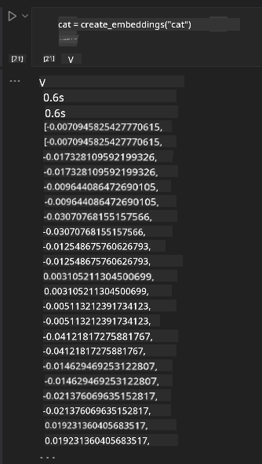

<!--
CO_OP_TRANSLATOR_METADATA:
{
  "original_hash": "e2861bbca91c0567ef32bc77fe054f9e",
  "translation_date": "2025-06-25T22:44:18+00:00",
  "source_file": "15-rag-and-vector-databases/README.md",
  "language_code": "cs"
}
-->
# Generování doplněné vyhledáváním (RAG) a vektorové databáze

V lekci o vyhledávacích aplikacích jsme se stručně naučili, jak integrovat vlastní data do velkých jazykových modelů (LLM). V této lekci se podrobněji podíváme na koncepty ukotvení vašich dat ve vaší LLM aplikaci, na mechaniku procesu a metody ukládání dat, včetně jak embedů, tak textu.

> **Video již brzy**

## Úvod

V této lekci se zaměříme na následující:

- Úvod do RAG, co to je a proč se používá v AI (umělá inteligence).

- Pochopení, co jsou vektorové databáze, a vytvoření jedné pro naši aplikaci.

- Praktický příklad, jak integrovat RAG do aplikace.

## Cíle učení

Po dokončení této lekce budete schopni:

- Vysvětlit význam RAG při vyhledávání a zpracování dat.

- Nastavit aplikaci RAG a ukotvit svá data k LLM.

- Efektivní integraci RAG a vektorových databází v LLM aplikacích.

## Naše scénář: vylepšení našich LLM vlastními daty

Pro tuto lekci chceme přidat naše vlastní poznámky do vzdělávacího startupu, což umožní chatbotu získat více informací o různých předmětech. Použitím poznámek, které máme, budou mít studenti možnost lépe studovat a porozumět různým tématům, což usnadní přípravu na zkoušky. Pro vytvoření našeho scénáře použijeme:

- `Azure OpenAI:` LLM, které použijeme k vytvoření našeho chatbota

- `AI for beginners' lesson on Neural Networks`: to budou data, na která ukotvíme naše LLM

- `Azure AI Search` a `Azure Cosmos DB:` vektorovou databázi pro ukládání našich dat a vytvoření vyhledávacího indexu

Uživatelé budou moci vytvářet cvičné kvízy ze svých poznámek, kartičky pro opakování a shrnovat je do stručných přehledů. Abychom mohli začít, podívejme se, co je RAG a jak funguje:

## Generování doplněné vyhledáváním (RAG)

Chatbot poháněný LLM zpracovává uživatelské podněty, aby generoval odpovědi. Je navržen tak, aby byl interaktivní a zapojoval se s uživateli na široké škále témat. Jeho odpovědi jsou však omezeny kontextem, který je poskytnut, a základními tréninkovými daty. Například GPT-4 má omezené znalosti do září 2021, což znamená, že mu chybí znalosti událostí, které se odehrály po tomto období. Kromě toho data použitá k tréninku LLM vylučují důvěrné informace, jako jsou osobní poznámky nebo manuál k produktu společnosti.

### Jak fungují RAGs (Generování doplněné vyhledáváním)

Představte si, že chcete nasadit chatbota, který vytváří kvízy z vašich poznámek, budete potřebovat připojení k znalostní bázi. Zde přichází na pomoc RAG. RAG funguje následovně:

- **Znalostní báze:** Před vyhledáváním je třeba tyto dokumenty načíst a předzpracovat, obvykle rozdělením velkých dokumentů na menší části, přeměnou na textové embedy a uložením do databáze.

- **Dotaz uživatele:** uživatel položí otázku

- **Vyhledávání:** Když uživatel položí otázku, model pro embedování vyhledá relevantní informace z naší znalostní báze, aby poskytl více kontextu, který bude začleněn do podnětu.

- **Doplněné generování:** LLM zlepšuje svou odpověď na základě získaných dat. Umožňuje, aby generovaná odpověď nebyla založena pouze na předtrénovaných datech, ale také na relevantních informacích z přidaného kontextu. Získaná data se používají k doplnění odpovědí LLM. LLM pak vrátí odpověď na otázku uživatele.

Architektura pro RAGs je implementována pomocí transformátorů sestávajících ze dvou částí: enkodéru a dekodéru. Například když uživatel položí otázku, vstupní text je 'zakódován' do vektorů zachycujících význam slov a vektory jsou 'dekódovány' do našeho indexu dokumentů a generují nový text na základě uživatelského dotazu. LLM používá jak model enkodér-dekodér, aby vygeneroval výstup.

Dva přístupy při implementaci RAG podle navrhovaného článku: [Generování doplněné vyhledáváním pro úkoly zpracování přirozeného jazyka náročné na znalosti](https://arxiv.org/pdf/2005.11401.pdf?WT.mc_id=academic-105485-koreyst) jsou:

- **_RAG-Sequence_** používání načtených dokumentů k předpovědi nejlepší možné odpovědi na uživatelský dotaz

- **RAG-Token** používání dokumentů k generování dalšího tokenu, poté je načte k odpovědi na uživatelský dotaz

### Proč byste používali RAGs? 

- **Bohatost informací:** zajišťuje, že textové odpovědi jsou aktuální a současné. Zlepšuje tak výkon na úkolech specifických pro danou doménu přístupem k interní znalostní bázi.

- Snižuje vymýšlení využitím **ověřitelných dat** ve znalostní bázi k poskytnutí kontextu k uživatelským dotazům.

- Je **nákladově efektivní**, protože jsou ekonomičtější ve srovnání s doladěním LLM.

## Vytváření znalostní báze

Naše aplikace je založena na našich osobních datech, tj. lekci o neuronových sítích v kurikulu AI pro začátečníky.

### Vektorové databáze

Vektorová databáze, na rozdíl od tradičních databází, je specializovaná databáze navržená pro ukládání, správu a vyhledávání vektorů embedů. Ukládá číselné reprezentace dokumentů. Rozdělení dat na číselné embedy usnadňuje našemu AI systému porozumění a zpracování dat.

Naše embedy ukládáme do vektorových databází, protože LLM mají omezení počtu tokenů, které přijímají jako vstup. Protože nemůžete předat celé embedy do LLM, budeme je muset rozdělit na části a když uživatel položí otázku, embedy nejvíce podobné otázce budou vráceny spolu s podnětem. Dělení na části také snižuje náklady na počet tokenů procházejících LLM.

Mezi populární vektorové databáze patří Azure Cosmos DB, Clarifyai, Pinecone, Chromadb, ScaNN, Qdrant a DeepLake. Můžete vytvořit model Azure Cosmos DB pomocí Azure CLI s následujícím příkazem:

```bash
az login
az group create -n <resource-group-name> -l <location>
az cosmosdb create -n <cosmos-db-name> -r <resource-group-name>
az cosmosdb list-keys -n <cosmos-db-name> -g <resource-group-name>
```

### Od textu k embedům

Než uložíme naše data, budeme je muset převést na vektorové embedy, než budou uložena do databáze. Pokud pracujete s velkými dokumenty nebo dlouhými texty, můžete je rozdělit na základě očekávaných dotazů. Dělení může být provedeno na úrovni vět, nebo na úrovni odstavců. Protože dělení odvozuje významy z okolních slov, můžete k části přidat nějaký další kontext, například přidáním názvu dokumentu nebo zahrnutím textu před nebo po části. Můžete data rozdělit následujícím způsobem:

```python
def split_text(text, max_length, min_length):
    words = text.split()
    chunks = []
    current_chunk = []

    for word in words:
        current_chunk.append(word)
        if len(' '.join(current_chunk)) < max_length and len(' '.join(current_chunk)) > min_length:
            chunks.append(' '.join(current_chunk))
            current_chunk = []

    # If the last chunk didn't reach the minimum length, add it anyway
    if current_chunk:
        chunks.append(' '.join(current_chunk))

    return chunks
```

Jakmile jsou rozdělena, můžeme pak embedovat náš text pomocí různých modelů embedů. Některé modely, které můžete použít, zahrnují: word2vec, ada-002 od OpenAI, Azure Computer Vision a mnoho dalších. Výběr modelu k použití bude záviset na jazycích, které používáte, typu obsahu kódovaného (text/obrázky/zvuk), velikosti vstupu, který může kódovat, a délce výstupu embedu.

Příklad embedu textu pomocí modelu `text-embedding-ada-002` od OpenAI je:


## Vyhledávání a vektorové hledání

Když uživatel položí otázku, retriever ji transformuje na vektor pomocí enkodéru dotazu, poté prohledá náš vyhledávací index dokumentů pro relevantní vektory v dokumentu, které souvisejí se vstupem. Jakmile je hotovo, převede jak vstupní vektor, tak vektory dokumentu na text a předá je přes LLM.

### Vyhledávání

Vyhledávání probíhá, když se systém snaží rychle najít dokumenty z indexu, které splňují kritéria vyhledávání. Cílem retrieveru je získat dokumenty, které budou použity k poskytnutí kontextu a ukotvení LLM na vašich datech.

Existuje několik způsobů, jak provést vyhledávání v naší databázi, jako například:

- **Vyhledávání podle klíčových slov** - používá se pro textové vyhledávání

- **Sémantické vyhledávání** - používá sémantický význam slov

- **Vektorové vyhledávání** - převádí dokumenty z textu na vektorové reprezentace pomocí modelů embedů. Vyhledávání bude provedeno dotazováním dokumentů, jejichž vektorové reprezentace jsou nejblíže uživatelské otázce.

- **Hybridní** - kombinace vyhledávání podle klíčových slov a vektorového vyhledávání.

Výzvou u vyhledávání je, když neexistuje podobná odpověď na dotaz v databázi, systém pak vrátí nejlepší informace, které může získat, nicméně, můžete použít taktiky jako nastavení maximální vzdálenosti pro relevantnost nebo použití hybridního vyhledávání, které kombinuje klíčová slova a vektorové vyhledávání. V této lekci použijeme hybridní vyhledávání, kombinaci vektorového a klíčového vyhledávání. Naše data uložíme do datového rámce se sloupci obsahujícími části i embedy.

### Vektorová podobnost

Retriever prohledá znalostní databázi pro embedy, které jsou blízko sebe, nejbližší sousedé, protože jsou to texty, které jsou podobné. V případě, že uživatel položí dotaz, nejprve se embeduje a pak se porovná s podobnými embedy. Běžné měření, které se používá k zjištění, jak podobné jsou různé vektory, je kosinová podobnost, která je založena na úhlu mezi dvěma vektory.

Můžeme měřit podobnost pomocí jiných alternativ, které můžeme použít, jako je Euklidovská vzdálenost, která je přímkou mezi koncovými body vektorů, a skalární součin, který měří součet součinů odpovídajících prvků dvou vektorů.

### Vyhledávací index

Při provádění vyhledávání budeme potřebovat vytvořit vyhledávací index pro naši znalostní bázi, než provedeme vyhledávání. Index bude ukládat naše embedy a může rychle načíst nejpodobnější části i v rozsáhlé databázi. Můžeme vytvořit náš index lokálně pomocí:

```python
from sklearn.neighbors import NearestNeighbors

embeddings = flattened_df['embeddings'].to_list()

# Create the search index
nbrs = NearestNeighbors(n_neighbors=5, algorithm='ball_tree').fit(embeddings)

# To query the index, you can use the kneighbors method
distances, indices = nbrs.kneighbors(embeddings)
```

### Přerovnání

Jakmile dotážete databázi, možná budete potřebovat seřadit výsledky od nejrelevantnějších. Přerovnávací LLM využívá strojové učení k vylepšení relevance výsledků vyhledávání jejich uspořádáním od nejrelevantnějších. Pomocí Azure AI Search je přerovnání automaticky provedeno pomocí sémantického přerovnávače. Příklad, jak funguje přerovnání pomocí nejbližších sousedů:

```python
# Find the most similar documents
distances, indices = nbrs.kneighbors([query_vector])

index = []
# Print the most similar documents
for i in range(3):
    index = indices[0][i]
    for index in indices[0]:
        print(flattened_df['chunks'].iloc[index])
        print(flattened_df['path'].iloc[index])
        print(flattened_df['distances'].iloc[index])
    else:
        print(f"Index {index} not found in DataFrame")
```

## Vše dohromady

Posledním krokem je přidání našeho LLM do mixu, aby bylo možné získat odpovědi, které jsou ukotveny na našich datech. Můžeme to implementovat následovně:

```python
user_input = "what is a perceptron?"

def chatbot(user_input):
    # Convert the question to a query vector
    query_vector = create_embeddings(user_input)

    # Find the most similar documents
    distances, indices = nbrs.kneighbors([query_vector])

    # add documents to query  to provide context
    history = []
    for index in indices[0]:
        history.append(flattened_df['chunks'].iloc[index])

    # combine the history and the user input
    history.append(user_input)

    # create a message object
    messages=[
        {"role": "system", "content": "You are an AI assistant that helps with AI questions."},
        {"role": "user", "content": history[-1]}
    ]

    # use chat completion to generate a response
    response = openai.chat.completions.create(
        model="gpt-4",
        temperature=0.7,
        max_tokens=800,
        messages=messages
    )

    return response.choices[0].message

chatbot(user_input)
```

## Hodnocení naší aplikace

### Metodiky hodnocení

- Kvalita dodávaných odpovědí zajišťující, že zní přirozeně, plynule a lidsky

- Ukotvení dat: hodnocení, zda odpověď pocházela z dodaných dokumentů

- Relevance: hodnocení, zda odpověď odpovídá a souvisí s položenou otázkou

- Plynulost - zda odpověď dává gramaticky smysl

## Použití pro RAG (Generování doplněné vyhledáváním) a vektorové databáze

Existuje mnoho různých případů použití, kde mohou funkční volání zlepšit vaši aplikaci, jako například:

- Otázky a odpovědi: ukotvení dat vaší společnosti k chatu, který mohou zaměstnanci používat k pokládání otázek.

- Systémy doporučení: kde můžete vytvořit systém, který odpovídá nejpodobnějším hodnotám, např. filmy, restaurace a mnoho dalšího.

- Služby chatbotů: můžete uložit historii chatu a personalizovat konverzaci na základě uživatelských dat.

- Vyhledávání obrázků na základě vektorových embedů, užitečné při rozpoznávání obrázků a detekci anomálií.

## Shrnutí

Pokryli jsme základní oblasti RAG od přidání našich dat do aplikace, uživatelského dotazu a výstupu. Aby bylo vytvoření RAG jednodušší, můžete použít frameworky jako Semantic Kernel, Langchain nebo Autogen.

## Úkol

Pokračujte ve svém učení o Generování doplněném vyhledáváním (RAG) tím, že vytvoříte:

- Vytvořte front-end pro aplikaci pomocí vámi zvoleného frameworku

- Využijte framework, buď LangChain nebo Semantic Kernel, a znovu vytvořte svou aplikaci.

Gratulujeme k dokončení lekce 👏.

## Učení zde nekončí, pokračujte v cestě

Po dokončení této lekce se podívejte na naši [sbírku učení o generativní AI](https://aka.ms/genai-collection?WT.mc_id=academic-105485-koreyst) a pokračujte ve zvyšování svých znalostí o generativní AI!

**Prohlášení**:  
Tento dokument byl přeložen pomocí služby pro automatický překlad [Co-op Translator](https://github.com/Azure/co-op-translator). Ačkoli se snažíme o přesnost, vezměte prosím na vědomí, že automatizované překlady mohou obsahovat chyby nebo nepřesnosti. Původní dokument v jeho rodném jazyce by měl být považován za autoritativní zdroj. Pro kritické informace je doporučen profesionální lidský překlad. Nejsme odpovědní za žádná nedorozumění nebo nesprávné interpretace vyplývající z použití tohoto překladu.