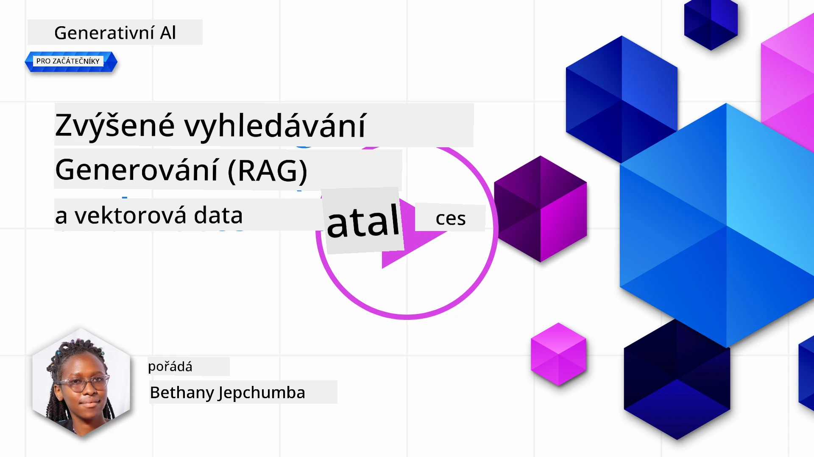
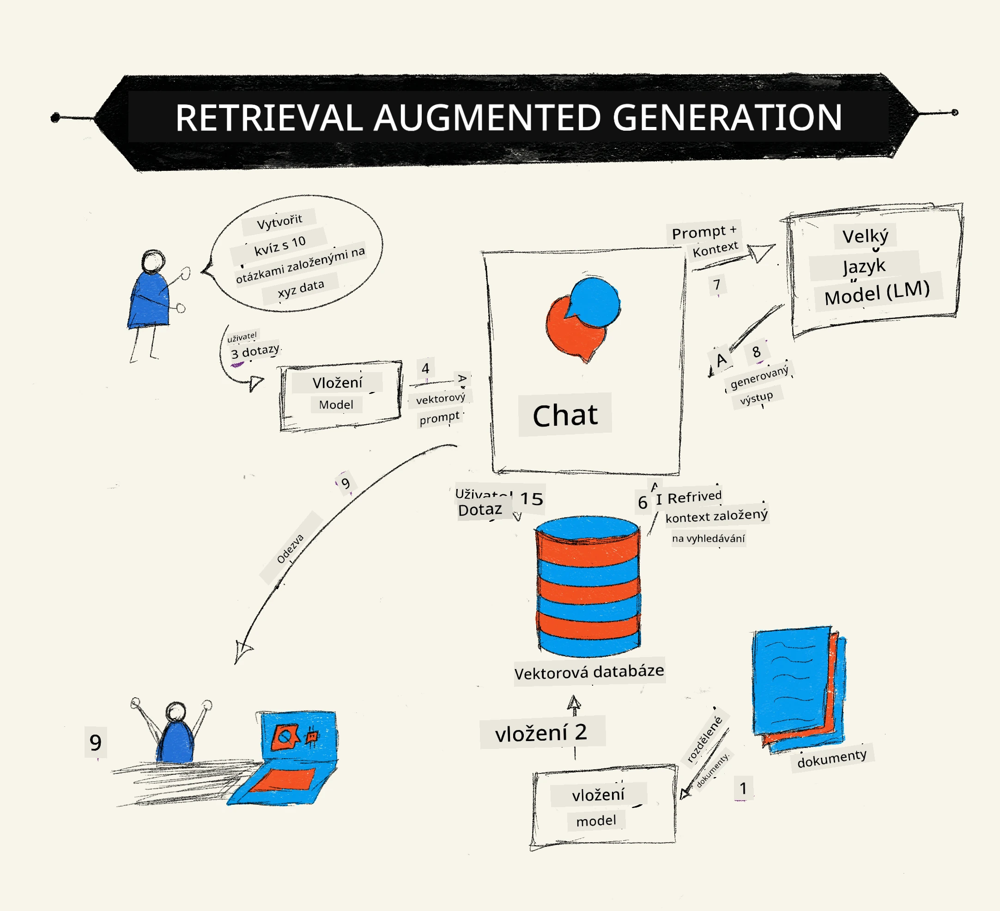
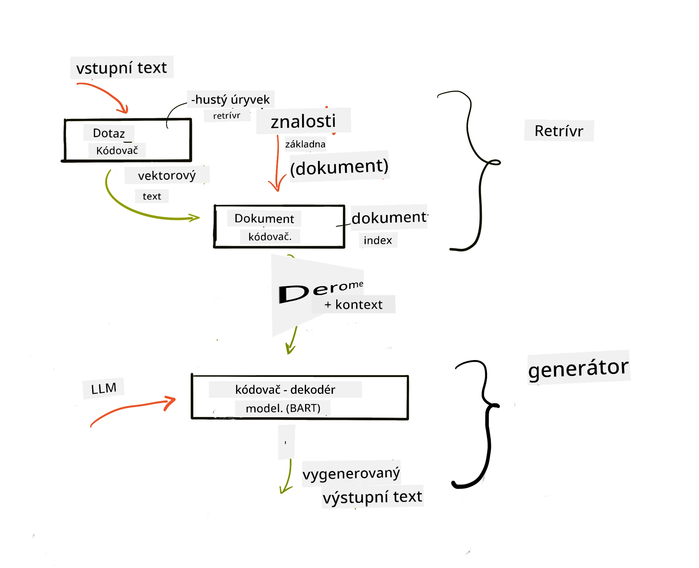
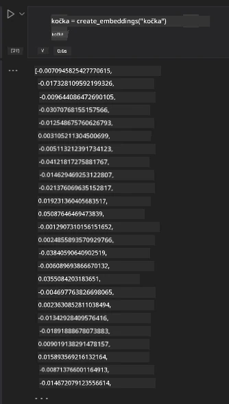

# Retrieval Augmented Generation (RAG) a vektorové databáze

[](https://youtu.be/4l8zhHUBeyI?si=BmvDmL1fnHtgQYkL)

V lekci o vyhledávacích aplikacích jsme si stručně ukázali, jak integrovat vaše vlastní data do velkých jazykových modelů (LLM). V této lekci se podrobněji podíváme na koncept ukotvení vašich dat ve vaší LLM aplikaci, mechaniku procesu a metody ukládání dat, včetně embeddingů a textů.

> **Video brzy k dispozici**

## Úvod

V této lekci pokryjeme následující témata:

- Úvod do RAG, co to je a proč se používá v umělé inteligenci (AI).

- Pochopení, co jsou vektorové databáze a vytvoření jedné pro naši aplikaci.

- Praktický příklad, jak integrovat RAG do aplikace.

## Výukové cíle

Po dokončení této lekce budete schopni:

- Vysvětlit význam RAG při vyhledávání a zpracování dat.

- Nastavit RAG aplikaci a ukotvit vaše data v LLM

- Efektivně integrovat RAG a vektorové databáze v LLM aplikacích.

## Náš scénář: vylepšení našich LLM vlastním daty

Pro tuto lekci chceme přidat naše poznámky do vzdělávací start-up aplikace, která umožní chatbotovi získat více informací o různých předmětech. Díky poznámkám, které máme, budou si studenti moci lépe studovat a porozumět různým tématům, což usnadní přípravu na zkoušky. Pro vytvoření scénáře použijeme:

- `Azure OpenAI:` LLM, které použijeme k vytvoření chatbota

- `Lekce AI pro začátečníky o neuronových sítích`: toto budou data, na kterých ukotvíme naše LLM

- `Azure AI Search` a `Azure Cosmos DB:` vektorová databáze pro ukládání dat a vytvoření vyhledávacího indexu

Uživatelé budou moci vytvářet cvičné kvízy ze svých poznámek, opakovací flash karty a shrnutí do přehledných přehledů. Pojďme se nejdříve podívat, co je RAG a jak funguje:

## Retrieval Augmented Generation (RAG)

Chatbot poháněný LLM zpracovává uživatelské podněty, aby generoval odpovědi. Je navržen tak, aby byl interaktivní a komunikoval s uživateli o široké škále témat. Nicméně jeho odpovědi jsou omezené kontextem, který má k dispozici, a tréninkovými daty. Například znalostní omezení GPT-4 je září 2021, což znamená, že nezná události po tomto datu. Navíc data použita k tréninku LLM vylučují důvěrné informace, jako jsou osobní poznámky nebo příručky společnosti.

### Jak fungují RAG (Retrieval Augmented Generation)



Představte si, že chcete nasadit chatbota, který vytváří kvízy z vašich poznámek, budete potřebovat připojení k databázi znalostí. Zde přichází RAG na pomoc. RAG funguje takto:

- **Databáze znalostí:** Před vyhledáváním je nutné dokumenty nahrát a předzpracovat, obvykle rozdělení velkých dokumentů na menší části, převod na embeddingy textu a uložení do databáze.

- **Uživatelský dotaz:** uživatel položí otázku

- **Vyhledávání:** když uživatel položí dotaz, embedding model vyhledá relevantní informace v databázi znalostí, aby poskytl více kontextu, který bude začleněn do promptu.

- **Rozšířená generace:** LLM vylepšuje svou odpověď na základě získaných dat. Umožňuje, aby odpověď byla založená nejen na předtrénovaných datech, ale také na relevantních informacích z přidaného kontextu. Získaná data se používají k rozšíření odpovědí LLM. LLM poté vrátí odpověď na otázku uživatele.



Architektura RAG je implementována pomocí transformerů, které se skládají ze dvou částí: enkodéru a dekodéru. Například když uživatel položí otázku, vstupní text je „zakódován“ do vektorů zachycujících význam slov a vektory jsou „dekódovány“ do našeho dokumentového indexu a generují nový text založený na uživatelském dotazu. LLM používá model enkodér-dekodér k vygenerování výstupu.

Dva přístupy při implementaci RAG podle navrženého článku: [Retrieval-Augmented Generation for Knowledge intensive NLP (natural language processing) Tasks](https://arxiv.org/pdf/2005.11401.pdf?WT.mc_id=academic-105485-koreyst) jsou:

- **_RAG-Sequence_** – použití nalezených dokumentů k předpovědi nejlepší možné odpovědi na uživatelský dotaz

- **RAG-Token** – použití dokumentů k vygenerování dalšího tokenu, poté je znovu vyhledat pro odpověď na dotaz uživatele

### Proč používat RAG? 

- **Bohatství informací:** zajišťuje, že textové odpovědi jsou aktuální a správné. Zvyšuje výkon na úlohách specifických pro doménu díky přístupu k interní databázi znalostí.

- Snižuje vymýšlení informací díky využití **ověřitelných dat** v databázi znalostí pro kontext uživatelských dotazů.

- Je **nákladově efektivní**, protože je ekonomičtější než doladění LLM.

## Vytvoření databáze znalostí

Naše aplikace je založena na našich osobních datech, tj. lekci o neuronových sítích z kurikula AI pro začátečníky.

### Vektorové databáze

Vektorová databáze, na rozdíl od tradičních databází, je specializovaná databáze navržená pro ukládání, správu a vyhledávání vložených vektorů. Ukládá numerické reprezentace dokumentů. Rozdělení dat na numerické embeddingy usnadňuje našemu AI systému porozumění a zpracování dat.

Ukládáme naše embeddingy do vektorových databází, protože LLM mají omezení počtu tokenů, které přijímají jako vstup. Jelikož nemůžete předat celé embeddingy do LLM, musíme je rozdělit na části a když uživatel položí otázku, vrátí se embeddingy nejvíce odpovídající otázce společně s promptem. Chunking také snižuje náklady na počet tokenů poslaných přes LLM.

Mezi populární vektorové databáze patří Azure Cosmos DB, Clarifyai, Pinecone, Chromadb, ScaNN, Qdrant a DeepLake. Můžete vytvořit model Azure Cosmos DB pomocí Azure CLI s následujícím příkazem:

```bash
az login
az group create -n <resource-group-name> -l <location>
az cosmosdb create -n <cosmos-db-name> -r <resource-group-name>
az cosmosdb list-keys -n <cosmos-db-name> -g <resource-group-name>
```

### Od textu k embeddingům

Před uložením dat je třeba je převést na vektorové embeddingy, než budou uložena v databázi. Pokud pracujete s velkými dokumenty nebo dlouhými texty, můžete je rozdělit na části podle očekávaných dotazů. Chunking může být na úrovni věty nebo odstavce. Protože chunking vyvozuje význam z okolních slov, můžete přidat další kontext k jednotlivému chunku, například přidáním názvu dokumentu nebo zahrnutím textu před nebo za chunk. Data můžete rozdělit takto:

```python
def split_text(text, max_length, min_length):
    words = text.split()
    chunks = []
    current_chunk = []

    for word in words:
        current_chunk.append(word)
        if len(' '.join(current_chunk)) < max_length and len(' '.join(current_chunk)) > min_length:
            chunks.append(' '.join(current_chunk))
            current_chunk = []

    # Pokud poslední úsek nedosáhl minimální délky, přidejte jej i tak
    if current_chunk:
        chunks.append(' '.join(current_chunk))

    return chunks
```

Jakmile jsou data rozčleněna, můžeme text vložit pomocí různých embedding modelů. Některé modely, které můžete použít, zahrnují: word2vec, ada-002 od OpenAI, Azure Computer Vision a mnoho dalších. Volba modelu závisí na jazyce, který používáte, typu kódovaného obsahu (text/obrázky/audio), velikosti vstupu, který může model zakódovat, a délce výstupu embeddingů.

Příklad textového embeddingu pomocí OpenAI modelu `text-embedding-ada-002` je:


## Vyhledávání a vektorové hledání

Když uživatel položí otázku, retriever ji převede na vektor pomocí query enkodéru, poté prohledá náš index dokumentů pro relevantní vektory související s dotazem. Po vyhledání převede jak vstupní vektor, tak dokumentové vektory zpět na text a předá je LLM.

### Vyhledávání

Vyhledávání nastává, když systém rychle hledá dokumenty v indexu, které splňují kritéria vyhledávání. Cílem retrieveru je najít dokumenty, které poskytnou kontext a ukotví LLM na vašich datech.

Existuje několik způsobů vyhledávání v databázi, např.:

- **Vyhledávání podle klíčových slov** – používané pro textové vyhledávání

- **Vektorové vyhledávání** – převádí dokumenty z textu na vektorové reprezentace pomocí embedding modelů, což umožňuje **sémantické vyhledávání** založené na významu slov. Vyhledávání probíhá dotazováním dokumentů, jejichž vektorové reprezentace jsou nejblíže dotazu uživatele.

- **Hybridní** – kombinace vyhledávání podle klíčových slov a vektorového vyhledávání.

Problém s vyhledáváním nastává, pokud v databázi není odpovídající reakce na dotaz, systém pak vrátí nejlepší možné informace. Můžete však použít taktiky, jako nastavení maximální vzdálenosti pro relevanci nebo využití hybridního vyhledávání kombinujícího klíčová slova a vektorové vyhledávání. V této lekci použijeme hybridní vyhledávání, kombinaci vektorového a klíčového vyhledávání. Data budeme ukládat do dataframe sloupců obsahujících chunky i embeddingy.

### Vektorová podobnost

Retriever bude vyhledávat v databázi znalostí embeddingy, které jsou blízko sebe, tedy nejbližší sousedy, protože jde o podobné texty. Když uživatel položí dotaz, je nejdříve embedován a poté porovnán s podobnými embeddingy. Běžná metrika pro určení podobnosti vektorů je kosinová podobnost založená na úhlu mezi dvěma vektory.

Dalšími alternativami jsou eukleidovská vzdálenost, což je přímka mezi koncovými body vektorů, a skalární součin, který měří součet součinů odpovídajících prvků dvou vektorů.

### Index vyhledávání

Při vyhledávání je potřeba nejdříve vytvořit index vyhledávání pro naši databázi znalostí. Index ukládá embeddingy a může rychle vrátit nejpodobnější části i ve velké databázi. Index můžeme vytvořit lokálně pomocí:

```python
from sklearn.neighbors import NearestNeighbors

embeddings = flattened_df['embeddings'].to_list()

# Vytvořit vyhledávací index
nbrs = NearestNeighbors(n_neighbors=5, algorithm='ball_tree').fit(embeddings)

# Pro dotazování do indexu můžete použít metodu kneighbors
distances, indices = nbrs.kneighbors(embeddings)
```

### Přehodnocení výsledků (Re-ranking)

Po dotazu do databáze možná budete chtít seřadit výsledky od nejrelevantnějších. Re-ranking LLM využívá strojové učení ke zlepšení relevance výsledků tím, že je seřadí od nejrelevantnějších. Použitím Azure AI Search je re-ranking prováděn automaticky pomocí sémantického přehodnocovače. Příklad, jak funguje re-ranking pomocí nejbližších sousedů:

```python
# Najděte nejpodobnější dokumenty
distances, indices = nbrs.kneighbors([query_vector])

index = []
# Vytiskněte nejpodobnější dokumenty
for i in range(3):
    index = indices[0][i]
    for index in indices[0]:
        print(flattened_df['chunks'].iloc[index])
        print(flattened_df['path'].iloc[index])
        print(flattened_df['distances'].iloc[index])
    else:
        print(f"Index {index} not found in DataFrame")
```

## Celkové shrnutí

Posledním krokem je přidání našeho LLM do procesu, aby bylo možné získat odpovědi založené na našich datech. Implementaci můžeme provést takto:

```python
user_input = "what is a perceptron?"

def chatbot(user_input):
    # Převést otázku na dotazový vektor
    query_vector = create_embeddings(user_input)

    # Najít nejpodobnější dokumenty
    distances, indices = nbrs.kneighbors([query_vector])

    # přidat dokumenty k dotazu pro poskytnutí kontextu
    history = []
    for index in indices[0]:
        history.append(flattened_df['chunks'].iloc[index])

    # zkombinovat historii a uživatelský vstup
    history.append(user_input)

    # vytvořit objekt zprávy
    messages=[
        {"role": "system", "content": "You are an AI assistant that helps with AI questions."},
        {"role": "user", "content": "\n\n".join(history) }
    ]

    # použít API Odpovědí k vygenerování odpovědi
    response = client.responses.create(
        model="gpt-5-mini",
        max_output_tokens=800,
        input=messages,
        store=False,
    )

    return response.output_text

chatbot(user_input)
```

## Hodnocení naší aplikace

### Evaluační metriky

- Kvalita odpovědí, aby zněly přirozeně, plynule a lidsky

- Ukotvení dat: zda odpověď vychází z dodaných dokumentů

- Relevance: zda odpověď odpovídá a souvisí s položenou otázkou

- Plynulost – zda je odpověď gramaticky srozumitelná

## Případy použití RAG (Retrieval Augmented Generation) a vektorových databází

Existuje mnoho různých případů použití, kde mohou funkční volání zlepšit vaši aplikaci, například:

- Otázky a odpovědi: ukotvení firemních dat do chatu, který mohou zaměstnanci používat k pokládání dotazů.

- Doporučovací systémy: můžete vytvořit systém, který vyhledává nejpodobnější hodnoty, například filmy, restaurace a další.

- Chatboti: ukládání historie konverzace a personalizace konverzace na základě uživatelských dat.

- Vyhledávání obrázků na základě vektorových embeddingů, užitečné při rozpoznávání obrázků a detekci anomálií.

## Shrnutí

Pokryli jsme základní oblasti RAG od přidání našich dat do aplikace, uživatelského dotazu až po výstup. Pro usnadnění tvorby RAG můžete použít frameworky jako Semanti Kernel, Langchain nebo Autogen.

## Zadání

Pro pokračování ve výuce Retrieval Augmented Generation (RAG) můžete vytvořit:

- Vytvořit front-end aplikace pomocí frameworku dle vašeho výběru

- Využít framework, například LangChain nebo Semantic Kernel, a znovu vytvořit vaši aplikaci.

Gratulujeme k dokončení lekce 👏.

## Učení zde nekončí, pokračujte na cestě

Po dokončení této lekce se podívejte na naši [kolekci pro Generativní AI učení](https://aka.ms/genai-collection?WT.mc_id=academic-105485-koreyst), kde můžete dále rozšiřovat své znalosti o Generativní AI!

---

<!-- CO-OP TRANSLATOR DISCLAIMER START -->
**Prohlášení o omezení odpovědnosti**:
Tento dokument byl přeložen pomocí AI překladatelské služby [Co-op Translator](https://github.com/Azure/co-op-translator). Přestože usilujeme o co největší přesnost, mějte prosím na paměti, že automatizované překlady mohou obsahovat chyby nebo nepřesnosti. Originální dokument v jeho mateřském jazyce by měl být považován za autoritativní zdroj. Pro kritické informace se doporučuje profesionální lidský překlad. Nejsme odpovědní za jakékoli nedorozumění nebo nesprávné interpretace vzniklé použitím tohoto překladu.
<!-- CO-OP TRANSLATOR DISCLAIMER END -->