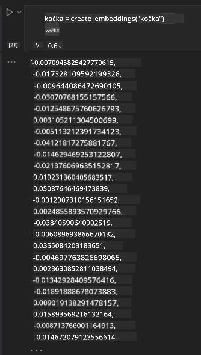

<!--
CO_OP_TRANSLATOR_METADATA:
{
  "original_hash": "b4b0266fbadbba7ded891b6485adc66d",
  "translation_date": "2025-10-17T21:39:04+00:00",
  "source_file": "15-rag-and-vector-databases/README.md",
  "language_code": "cs"
}
-->
# Generov치n칤 s podporou vyhled치v치n칤 (RAG) a vektorov칠 datab치ze

[](https://youtu.be/4l8zhHUBeyI?si=BmvDmL1fnHtgQYkL)

V lekci o vyhled치vac칤ch aplikac칤ch jsme se kr치tce nau캜ili, jak integrovat vlastn칤 data do model콢 velk칳ch jazyk콢 (LLMs). V t칠to lekci se podrobn캩ji zam캩콏칤me na koncepty zakotven칤 va코ich dat v aplikaci LLM, na mechaniku procesu a na metody ukl치d치n칤 dat, v캜etn캩 vektorov칳ch reprezentac칤 a textu.

> **Video bude brzy dostupn칠**

## 칔vod

V t칠to lekci se budeme zab칳vat n치sleduj칤c칤mi t칠maty:

- 칔vod do RAG, co to je a pro캜 se pou쮂셨치 v oblasti um캩l칠 inteligence (AI).

- Porozum캩n칤 tomu, co jsou vektorov칠 datab치ze, a vytvo콏en칤 jedn칠 pro na코i aplikaci.

- Praktick칳 p콏칤klad, jak integrovat RAG do aplikace.

## C칤le u캜en칤

Po dokon캜en칤 t칠to lekce budete schopni:

- Vysv캩tlit v칳znam RAG p콏i vyhled치v치n칤 a zpracov치n칤 dat.

- Nastavit aplikaci RAG a zakotvit va코e data do LLM.

- Efektivn캩 integrovat RAG a vektorov칠 datab치ze do aplikac칤 LLM.

## N치코 sc칠n치콏: vylep코en칤 na코ich LLM pomoc칤 vlastn칤ch dat

V t칠to lekci chceme p콏idat na코e vlastn칤 pozn치mky do vzd캩l치vac칤ho startupu, co umo쬹칤 chatbotu z칤skat v칤ce informac칤 o r콢zn칳ch t칠matech. D칤ky pozn치mk치m, kter칠 m치me, budou studenti schopni l칠pe studovat a porozum캩t r콢zn칳m t칠mat콢m, co jim usnadn칤 p콏칤pravu na zkou코ky. Pro vytvo콏en칤 na코eho sc칠n치콏e pou쬴jeme:

- `Azure OpenAI:` LLM, kter칳 pou쬴jeme k vytvo콏en칤 na코eho chatbota

- `Lekce pro za캜치te캜n칤ky o neuronov칳ch s칤t칤ch:` to budou data, na kter칳ch zakotv칤me n치코 LLM

- `Azure AI Search` a `Azure Cosmos DB:` vektorov치 datab치ze pro ukl치d치n칤 na코ich dat a vytvo콏en칤 vyhled치vac칤ho indexu

U쬴vatel칠 budou schopni vytv치콏et cvi캜n칠 kv칤zy ze sv칳ch pozn치mek, studijn칤 karti캜ky a shrnut칤 do stru캜n칳ch p콏ehled콢. Abychom mohli za캜칤t, pod칤vejme se, co je RAG a jak funguje:

## Generov치n칤 s podporou vyhled치v치n칤 (RAG)

Chatbot poh치n캩n칳 LLM zpracov치v치 u쬴vatelsk칠 dotazy a generuje odpov캩di. Je navr쬰n tak, aby byl interaktivn칤 a komunikoval s u쬴vateli na 코irok칠 코k치le t칠mat. Jeho odpov캩di jsou v코ak omezeny na kontext, kter칳 je mu poskytnut, a na jeho z치kladn칤 tr칠ninkov치 data. Nap콏칤klad GPT-4 m치 znalostn칤 limit k z치콏칤 2021, co znamen치, 쬰 nem치 znalosti o ud치lostech, kter칠 se staly po tomto obdob칤. Krom캩 toho data pou쬴t치 k tr칠nov치n칤 LLM vylu캜uj칤 d콢v캩rn칠 informace, jako jsou osobn칤 pozn치mky nebo manu치l produkt콢 spole캜nosti.

### Jak funguj칤 RAG (Generov치n칤 s podporou vyhled치v치n칤)


P콏edstavte si, 쬰 chcete nasadit chatbota, kter칳 vytv치콏칤 kv칤zy z va코ich pozn치mek, budete pot콏ebovat p콏ipojen칤 k datab치zi znalost칤. Zde p콏ich치z칤 na 콏adu RAG. RAG funguje n치sledovn캩:

- **Datab치ze znalost칤:** P콏ed vyhled치v치n칤m je t콏eba tyto dokumenty nahr치t a p콏edzpracovat, obvykle rozd캩len칤m velk칳ch dokument콢 na men코칤 캜치sti, jejich transformac칤 na vektorov칠 reprezentace a ulo쬰n칤m do datab치ze.

- **Dotaz u쬴vatele:** U쬴vatel polo쮂 ot치zku.

- **Vyhled치v치n칤:** Kdy u쬴vatel polo쮂 ot치zku, model vektorov칳ch reprezentac칤 vyhled치 relevantn칤 informace v na코칤 datab치zi znalost칤, aby poskytl v칤ce kontextu, kter칳 bude za캜len캩n do dotazu.

- **Generov치n칤 s podporou:** LLM vylep코칤 svou odpov캩캞 na z치klad캩 z칤skan칳ch dat. To umo쮄갓je, aby odpov캩캞 byla nejen zalo쬰na na p콏edtr칠novan칳ch datech, ale tak칠 na relevantn칤ch informac칤ch z p콏idan칠ho kontextu. Z칤skan치 data se pou쮂셨aj칤 k vylep코en칤 odpov캩d칤 LLM. LLM pot칠 vr치t칤 odpov캩캞 na ot치zku u쬴vatele.


Architektura RAG je implementov치na pomoc칤 transform치tor콢, kter칠 se skl치daj칤 ze dvou 캜치st칤: kod칠ru a dekod칠ru. Nap콏칤klad kdy u쬴vatel polo쮂 ot치zku, vstupn칤 text je "zak칩dov치n" do vektor콢 zachycuj칤c칤ch v칳znam slov a vektory jsou "dek칩dov치ny" do na코eho indexu dokument콢 a generuj칤 nov칳 text na z치klad캩 dotazu u쬴vatele. LLM pou쮂셨치 model kod칠r-dekod칠r k vytvo콏en칤 v칳stupu.

Dva p콏칤stupy p콏i implementaci RAG podle navrhovan칠ho 캜l치nku: [Generov치n칤 s podporou vyhled치v치n칤 pro 칰koly NLP (zpracov치n칤 p콏irozen칠ho jazyka) n치ro캜n칠 na znalosti](https://arxiv.org/pdf/2005.11401.pdf?WT.mc_id=academic-105485-koreyst) jsou:

- **_RAG-Sequence_** pou쮂셨치 z칤skan칠 dokumenty k p콏edpov캩di nejlep코칤 mo쬹칠 odpov캩di na dotaz u쬴vatele.

- **RAG-Token** pou쮂셨치 dokumenty k vytvo콏en칤 dal코칤ho tokenu, pot칠 je z칤sk치 k odpov캩di na dotaz u쬴vatele.

### Pro캜 pou쮂셨at RAG?

- **Bohatost informac칤:** zaji코콘uje, 쬰 textov칠 odpov캩di jsou aktu치ln칤 a relevantn칤. Zvy코uje tak v칳kon p콏i 칰kolech specifick칳ch pro danou oblast d칤ky p콏칤stupu k intern칤 datab치zi znalost칤.

- Sni쬿je zkreslen칤 vyu쬴t칤m **ov캩콏iteln칳ch dat** v datab치zi znalost칤 k poskytnut칤 kontextu k dotaz콢m u쬴vatel콢.

- Je **n치kladov캩 efektivn칤**, proto쬰 je ekonomi캜t캩j코칤 ne jemn칠 lad캩n칤 LLM.

## Vytvo콏en칤 datab치ze znalost칤

Na코e aplikace je zalo쬰na na na코ich osobn칤ch datech, tj. na lekci o neuronov칳ch s칤t칤ch z kurikula AI pro za캜치te캜n칤ky.

### Vektorov칠 datab치ze

Vektorov치 datab치ze, na rozd칤l od tradi캜n칤ch datab치z칤, je specializovan치 datab치ze navr쬰n치 k ukl치d치n칤, spr치v캩 a vyhled치v치n칤 vektorov칳ch reprezentac칤. Ukl치d치 캜칤seln칠 reprezentace dokument콢. Rozd캩len칤 dat na 캜칤seln칠 vektorov칠 reprezentace usnad켿uje na코emu AI syst칠mu porozum캩n칤 a zpracov치n칤 dat.

Vektorov칠 reprezentace ukl치d치me do vektorov칳ch datab치z칤, proto쬰 LLM maj칤 limit po캜tu token콢, kter칠 p콏ij칤maj칤 jako vstup. Jeliko nem콢쬰te p콏edat cel칠 vektorov칠 reprezentace LLM, mus칤me je rozd캩lit na 캜치sti a kdy u쬴vatel polo쮂 ot치zku, vektorov칠 reprezentace nejv칤ce podobn칠 ot치zce budou vr치ceny spolu s dotazem. Rozd캩len칤 na 캜치sti tak칠 sni쬿je n치klady na po캜et token콢 p콏edan칳ch LLM.

Mezi obl칤ben칠 vektorov칠 datab치ze pat콏칤 Azure Cosmos DB, Clarifyai, Pinecone, Chromadb, ScaNN, Qdrant a DeepLake. Model Azure Cosmos DB m콢쬰te vytvo콏it pomoc칤 Azure CLI pomoc칤 n치sleduj칤c칤ho p콏칤kazu:

```bash
az login
az group create -n <resource-group-name> -l <location>
az cosmosdb create -n <cosmos-db-name> -r <resource-group-name>
az cosmosdb list-keys -n <cosmos-db-name> -g <resource-group-name>
```

### Od textu k vektorov칳m reprezentac칤m

Ne ulo쮂셠e na코e data, budeme je muset p콏ev칠st na vektorov칠 reprezentace, ne budou ulo쬰na v datab치zi. Pokud pracujete s velk칳mi dokumenty nebo dlouh칳mi texty, m콢쬰te je rozd캩lit na 캜치sti na z치klad캩 o캜ek치van칳ch dotaz콢. Rozd캩len칤 na 캜치sti m콢쬰 b칳t provedeno na 칰rovni v캩ty nebo odstavce. Jeliko rozd캩len칤 na 캜치sti odvozuje v칳znam ze slov kolem nich, m콢쬰te p콏idat n캩jak칳 dal코칤 kontext k 캜치sti, nap콏칤klad p콏id치n칤m n치zvu dokumentu nebo zahrnut칤m textu p콏ed nebo za 캜치st. Data m콢쬰te rozd캩lit na 캜치sti n치sleduj칤c칤m zp콢sobem:

```python
def split_text(text, max_length, min_length):
    words = text.split()
    chunks = []
    current_chunk = []

    for word in words:
        current_chunk.append(word)
        if len(' '.join(current_chunk)) < max_length and len(' '.join(current_chunk)) > min_length:
            chunks.append(' '.join(current_chunk))
            current_chunk = []

    # If the last chunk didn't reach the minimum length, add it anyway
    if current_chunk:
        chunks.append(' '.join(current_chunk))

    return chunks
```

Jakmile jsou data rozd캩lena na 캜치sti, m콢쬰me je pot칠 zak칩dovat pomoc칤 r콢zn칳ch model콢 vektorov칳ch reprezentac칤. N캩kter칠 modely, kter칠 m콢쬰te pou쮂셦, zahrnuj칤: word2vec, ada-002 od OpenAI, Azure Computer Vision a mnoho dal코칤ch. V칳b캩r modelu z치vis칤 na jazyc칤ch, kter칠 pou쮂셨치te, typu obsahu, kter칳 je k칩dov치n (text/obr치zky/audio), velikosti vstupu, kter칳 m콢쬰 b칳t zak칩dov치n, a d칠lce v칳stupu vektorov칠 reprezentace.

P콏칤klad zak칩dovan칠ho textu pomoc칤 modelu OpenAI `text-embedding-ada-002` je:


## Vyhled치v치n칤 a vektorov칠 hled치n칤

Kdy u쬴vatel polo쮂 ot치zku, vyhled치va캜 ji transformuje na vektor pomoc칤 kod칠ru dotaz콢, pot칠 prohled치 n치코 index dokument콢 pro relevantn칤 vektory v dokumentu, kter칠 souvisej칤 se vstupem. Jakmile je to hotovo, p콏evede jak vstupn칤 vektor, tak vektory dokument콢 na text a p콏ed치 je LLM.

### Vyhled치v치n칤

Vyhled치v치n칤 prob칤h치, kdy se syst칠m sna쮂 rychle naj칤t dokumenty z indexu, kter칠 spl켿uj칤 krit칠ria vyhled치v치n칤. C칤lem vyhled치va캜e je z칤skat dokumenty, kter칠 budou pou쬴ty k poskytnut칤 kontextu a zakotven칤 LLM na va코ich datech.

Existuje n캩kolik zp콢sob콢, jak prov치d캩t vyhled치v치n칤 v na코칤 datab치zi, nap콏칤klad:

- **Vyhled치v치n칤 podle kl칤캜ov칳ch slov** - pou쮂셨치 se pro textov칠 vyhled치v치n칤.

- **S칠mantick칠 vyhled치v치n칤** - pou쮂셨치 s칠mantick칳 v칳znam slov.

- **Vektorov칠 vyhled치v치n칤** - p콏ev치d칤 dokumenty z textu na vektorov칠 reprezentace pomoc칤 model콢 vektorov칳ch reprezentac칤. Vyhled치v치n칤 bude provedeno dotazov치n칤m dokument콢, jejich vektorov칠 reprezentace jsou nejbl칤쬰 ot치zce u쬴vatele.

- **Hybridn칤** - kombinace vyhled치v치n칤 podle kl칤캜ov칳ch slov a vektorov칠ho vyhled치v치n칤.

V칳zvou p콏i vyhled치v치n칤 je situace, kdy v datab치zi nen칤 podobn치 odpov캩캞 na dotaz, syst칠m pak vr치t칤 nejlep코칤 informace, kter칠 m콢쬰 z칤skat. M콢쬰te v코ak pou쮂셦 taktiky, jako je nastaven칤 maxim치ln칤 vzd치lenosti pro relevanci nebo pou쬴t칤 hybridn칤ho vyhled치v치n칤, kter칠 kombinuje vyhled치v치n칤 podle kl칤캜ov칳ch slov a vektorov칠 vyhled치v치n칤. V t칠to lekci pou쬴jeme hybridn칤 vyhled치v치n칤, kombinaci vektorov칠ho a vyhled치v치n칤 podle kl칤캜ov칳ch slov. Na코e data ulo쮂셠e do datov칠ho r치mce se sloupci obsahuj칤c칤mi 캜치sti textu i vektorov칠 reprezentace.

### Vektorov치 podobnost

Vyhled치va캜 prohled치 datab치zi znalost칤 pro vektorov칠 reprezentace, kter칠 jsou bl칤zko sebe, nejbli쮄뫆 soused칠, proto쬰 se jedn치 o texty, kter칠 jsou podobn칠. V p콏칤pad캩, 쬰 u쬴vatel polo쮂 dotaz, je nejprve zak칩dov치n a pot칠 porovn치n s podobn칳mi vektorov칳mi reprezentacemi. B캩쬹칠 m캩콏en칤, kter칠 se pou쮂셨치 k ur캜en칤, jak podobn칠 jsou r콢zn칠 vektory, je kosinov치 podobnost, kter치 je zalo쬰na na 칰hlu mezi dv캩ma vektory.

K m캩콏en칤 podobnosti m콢쬰me pou쮂셦 i jin칠 alternativy, nap콏칤klad euklidovskou vzd치lenost, co je p콏칤m치 캜치ra mezi koncov칳mi body vektor콢, nebo skal치rn칤 sou캜in, kter칳 m캩콏칤 sou캜et sou캜in콢 odpov칤daj칤c칤ch prvk콢 dvou vektor콢.

### Vyhled치vac칤 index

P콏i vyhled치v치n칤 budeme muset vytvo콏it vyhled치vac칤 index pro na코i datab치zi znalost칤, ne provedeme vyhled치v치n칤. Index bude ukl치dat na코e vektorov칠 reprezentace a m콢쬰 rychle z칤skat nejpodobn캩j코칤 캜치sti i ve velk칠 datab치zi. Index m콢쬰me vytvo콏it lok치ln캩 pomoc칤:

```python
from sklearn.neighbors import NearestNeighbors

embeddings = flattened_df['embeddings'].to_list()

# Create the search index
nbrs = NearestNeighbors(n_neighbors=5, algorithm='ball_tree').fit(embeddings)

# To query the index, you can use the kneighbors method
distances, indices = nbrs.kneighbors(embeddings)
```

### P콏erovn치n칤

Jakmile dotazujete datab치zi, mo쬹치 budete muset se콏adit v칳sledky od nejrelevantn캩j코칤ch. P콏erovn치vac칤 LLM vyu쮂셨치 strojov칠 u캜en칤 ke zlep코en칤 relevance v칳sledk콢 vyhled치v치n칤 t칤m, 쬰 je se콏ad칤 od nejrelevantn캩j코칤ch. Pomoc칤 Azure AI Search je p콏erovn치n칤 provedeno automaticky pomoc칤 s칠mantick칠ho p콏erovn치va캜e. P콏칤klad, jak p콏erovn치n칤 funguje pomoc칤 nejbli쮄뫆셖h soused콢:

```python
# Find the most similar documents
distances, indices = nbrs.kneighbors([query_vector])

index = []
# Print the most similar documents
for i in range(3):
    index = indices[0][i]
    for index in indices[0]:
        print(flattened_df['chunks'].iloc[index])
        print(flattened_df['path'].iloc[index])
        print(flattened_df['distances'].iloc[index])
    else:
        print(f"Index {index} not found in DataFrame")
```

## Spojen칤 v코eho dohromady

Posledn칤m krokem je p콏id치n칤 na코eho LLM do mixu, aby bylo mo쬹칠 z칤skat odpov캩di, kter칠 jsou zakotveny na na코ich datech. M콢쬰me to implementovat n치sleduj칤c칤m zp콢sobem:

```python
user_input = "what is a perceptron?"

def chatbot(user_input):
    # Convert the question to a query vector
    query_vector = create_embeddings(user_input)

    # Find the most similar documents
    distances, indices = nbrs.kneighbors([query_vector])

    # add documents to query  to provide context
    history = []
    for index in indices[0]:
        history.append(flattened_df['chunks'].iloc[index])

    # combine the history and the user input
    history.append(user_input)

    # create a message object
    messages=[
        {"role": "system", "content": "You are an AI assistant that helps with AI questions."},
        {"role": "user", "content": history[-1]}
    ]

    # use chat completion to generate a response
    response = openai.chat.completions.create(
        model="gpt-4",
        temperature=0.7,
        max_tokens=800,
        messages=messages
    )

    return response.choices[0].message

chatbot(user_input)
```

## Hodnocen칤 na코칤 aplikace

### Hodnot칤c칤 metriky

- Kvalita poskytnut칳ch odpov캩d칤, zaji코t캩n칤, 쬰 zn칤 p콏irozen캩, plynule a lidsky.

- Zakotven칤 dat: hodnocen칤, zda odpov캩캞 poch치z칤 z poskytnut칳ch dokument콢.

- Relevance: hodnocen칤, zda odpov캩캞 odpov칤d치 a souvis칤 s polo쬰nou ot치zkou.

- Plynulost - zda odpov캩캞 d치v치 smysl gramaticky.

## P콏칤pady pou쬴t칤 RAG (Generov치n칤 s podporou vyhled치v치n칤) a vektorov칳ch datab치z칤

Existuje mnoho r콢zn칳ch p콏칤pad콢 pou쬴t칤, kde vol치n칤 funkc칤 m콢쬰 zlep코it va코i aplikaci, nap콏칤klad:

- Ot치zky a odpov캩di: zakotven칤 dat va코칤 spole캜nosti do chatu, kter칳 mohou zam캩stnanci pou쮂셨at k pokl치d치n칤 ot치zek.

- Doporu캜ovac칤 syst칠my: kde m콢쬰te vytvo콏it syst칠m, kter칳 odpov칤d치 nejpodobn캩j코칤m hodnot치m, nap콏. filmy, restaurace a mnoho dal코칤ch.

- Slu쬭y chatbot콢: m콢쬰te ukl치dat historii chatu a personalizovat konverzaci na z치klad캩 u쬴vatelsk칳ch dat.

- Vyhled치v치n칤 obr치zk콢 na z치klad캩 vektorov칳ch reprezentac칤, u쬴te캜n칠 p콏i rozpozn치v치n칤 obr치zk콢 a detekci anom치li칤.

## Shrnut칤

Pokryli jsme z치kladn칤 oblasti RAG od p콏id치n칤 na코ich dat do aplikace, p콏es u쬴vatelsk칳 dotaz a po v칳stup. Pro zjednodu코en칤 tvorby RAG m콢쬰te pou쮂셦 frameworky jako Semantic Kernel, Langchain nebo Autogen.

## 칔kol

Pro pokra캜ov치n칤 ve studiu Generov치n칤 s podporou vyhled치v치n칤 (RAG) m콢쬰te vytvo콏it:

- Vytvo콏te front-end pro aplikaci pomoc칤 v치mi zvolen칠ho frameworku.

- Vyu쬴jte framework, bu캞 LangChain nebo Semantic Kernel, a znovu vytvo콏te va코i aplikaci.

Gratulujeme k dokon캜en칤 lekce 游녪.

## U캜en칤 zde nekon캜칤, pokra캜ujte v cest캩

Po dokon캜en칤 t칠to lekce se pod칤vejte na na코i [sb칤rku u캜en칤 o generativn칤 AI](https://aka.ms/genai-collection?WT.mc_id=academic-105485-koreyst), abyste d치le rozv칤jeli sv칠 znalosti o generativn칤 AI!

---

**Prohl치코en칤**:  
Tento dokument byl p콏elo쬰n pomoc칤 slu쬭y AI pro p콏eklady [Co-op Translator](https://github.com/Azure/co-op-translator). I kdy se sna쮂셠e o p콏esnost, m캩jte na pam캩ti, 쬰 automatizovan칠 p콏eklady mohou obsahovat chyby nebo nep콏esnosti. P콢vodn칤 dokument v jeho p콢vodn칤m jazyce by m캩l b칳t pova쬺v치n za autoritativn칤 zdroj. Pro d콢le쬴t칠 informace se doporu캜uje profesion치ln칤 lidsk칳 p콏eklad. Neodpov칤d치me za 쮂멳n치 nedorozum캩n칤 nebo nespr치vn칠 interpretace vypl칳vaj칤c칤 z pou쬴t칤 tohoto p콏ekladu.