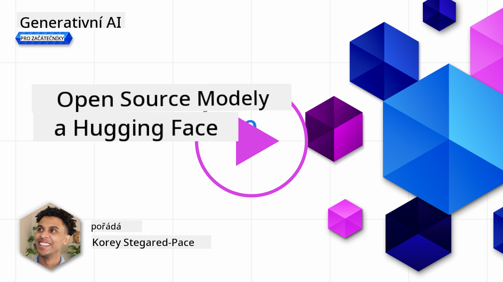
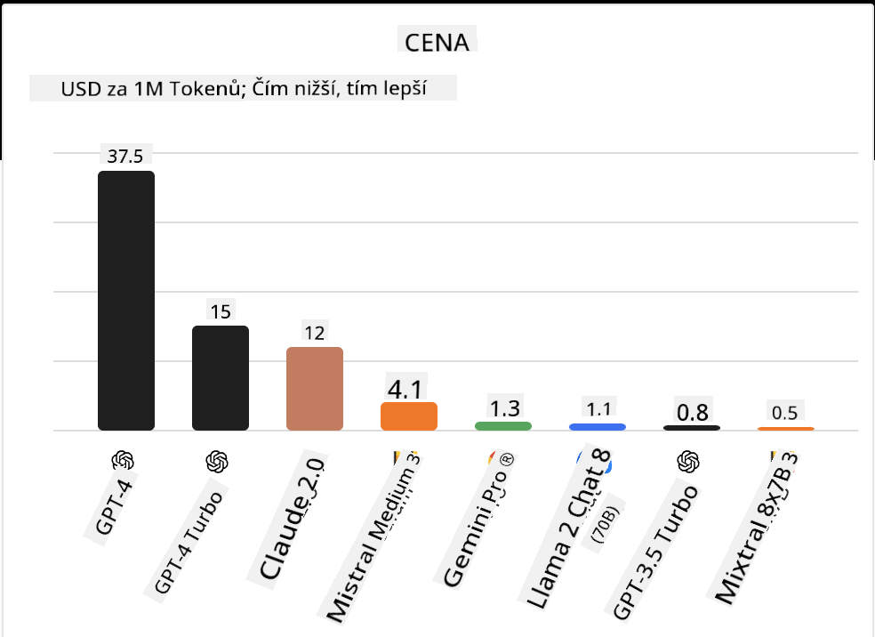
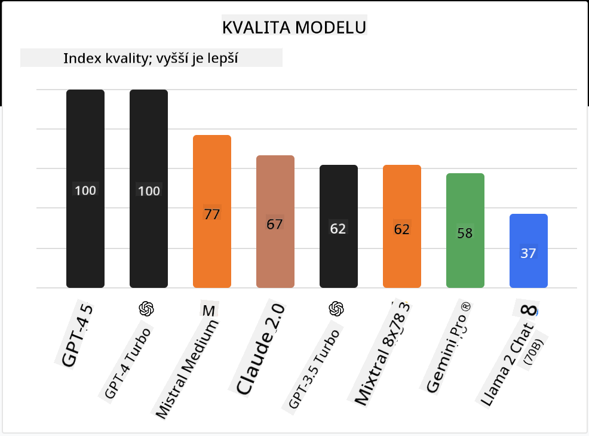

<!--
CO_OP_TRANSLATOR_METADATA:
{
  "original_hash": "0bba96e53ab841d99db731892a51fab8",
  "translation_date": "2025-07-09T17:14:12+00:00",
  "source_file": "16-open-source-models/README.md",
  "language_code": "cs"
}
-->

## Úvod

Svět open source LLM je vzrušující a neustále se vyvíjí. Tento kurz si klade za cíl poskytnout podrobný pohled na open source modely. Pokud hledáte informace o tom, jak se proprietární modely srovnávají s open source modely, přejděte na lekci ["Exploring and Comparing Different LLMs"](../02-exploring-and-comparing-different-llms/README.md?WT.mc_id=academic-105485-koreyst). Tato lekce se také bude věnovat tématu doladění (fine-tuning), ale podrobnější vysvětlení najdete v lekci ["Fine-Tuning LLMs"](../18-fine-tuning/README.md?WT.mc_id=academic-105485-koreyst).

## Cíle učení

- Získat přehled o open source modelech  
- Pochopit výhody práce s open source modely  
- Prozkoumat dostupné open modely na Hugging Face a v Azure AI Studiu  

## Co jsou Open Source Modely?

Open source software sehrál klíčovou roli v rozvoji technologií v různých oblastech. Open Source Initiative (OSI) definovala [10 kritérií pro software](https://web.archive.org/web/20241126001143/https://opensource.org/osd?WT.mc_id=academic-105485-koreyst), aby mohl být klasifikován jako open source. Zdrojový kód musí být veřejně sdílen pod licencí schválenou OSI.

Vývoj LLM má s vývojem softwaru podobné prvky, ale proces není úplně stejný. To vyvolalo v komunitě mnoho diskuzí o definici open source v kontextu LLM. Aby model odpovídal tradiční definici open source, měly by být veřejně dostupné následující informace:

- Datové sady použité k tréninku modelu  
- Kompletní váhy modelu jako součást tréninku  
- Kód pro vyhodnocení  
- Kód pro doladění (fine-tuning)  
- Kompletní váhy modelu a metriky tréninku  

V současnosti existuje jen několik modelů, které těmto kritériím vyhovují. [OLMo model vytvořený Allen Institute for Artificial Intelligence (AllenAI)](https://huggingface.co/allenai/OLMo-7B?WT.mc_id=academic-105485-koreyst) je jedním z nich.

V této lekci budeme modely označovat jako „open modely“, protože nemusí v době psaní přesně splňovat výše uvedená kritéria.

## Výhody Open Modelů

**Vysoce přizpůsobitelné** – Protože open modely jsou zveřejněny s podrobnými informacemi o tréninku, výzkumníci a vývojáři mohou upravovat vnitřní strukturu modelu. To umožňuje vytvářet vysoce specializované modely, které jsou doladěné pro konkrétní úkol nebo oblast. Příklady zahrnují generování kódu, matematické operace nebo biologii.

**Cena** – Cena za token při používání a nasazení těchto modelů je nižší než u proprietárních modelů. Při vytváření aplikací Generativní AI je důležité zvážit poměr výkon/cena pro váš konkrétní případ použití.

  
Zdroj: Artificial Analysis

**Flexibilita** – Práce s open modely vám umožňuje být flexibilní při používání různých modelů nebo jejich kombinování. Příkladem jsou [HuggingChat Assistants](https://huggingface.co/chat?WT.mc_id=academic-105485-koreyst), kde si uživatel může přímo v uživatelském rozhraní vybrat model, který chce použít:

## Prozkoumání různých Open Modelů

### Llama 2

[LLama2](https://huggingface.co/meta-llama?WT.mc_id=academic-105485-koreyst), vyvinutý společností Meta, je open model optimalizovaný pro chatovací aplikace. Je to díky metodě doladění, která zahrnovala velké množství dialogů a zpětné vazby od lidí. Díky tomu model generuje výsledky více odpovídající lidským očekáváním, což zlepšuje uživatelský zážitek.

Příklady doladěných verzí Llama zahrnují [Japanese Llama](https://huggingface.co/elyza/ELYZA-japanese-Llama-2-7b?WT.mc_id=academic-105485-koreyst), specializovaný na japonštinu, a [Llama Pro](https://huggingface.co/TencentARC/LLaMA-Pro-8B?WT.mc_id=academic-105485-koreyst), což je vylepšená verze základního modelu.

### Mistral

[Mistral](https://huggingface.co/mistralai?WT.mc_id=academic-105485-koreyst) je open model s důrazem na vysoký výkon a efektivitu. Používá přístup Mixture-of-Experts, který kombinuje skupinu specializovaných expertních modelů do jednoho systému, kde jsou podle vstupu vybírány určité modely k použití. To zefektivňuje výpočet, protože modely řeší pouze vstupy, na které jsou specializované.

Příklady doladěných verzí Mistral zahrnují [BioMistral](https://huggingface.co/BioMistral/BioMistral-7B?text=Mon+nom+est+Thomas+et+mon+principal?WT.mc_id=academic-105485-koreyst), zaměřený na medicínskou oblast, a [OpenMath Mistral](https://huggingface.co/nvidia/OpenMath-Mistral-7B-v0.1-hf?WT.mc_id=academic-105485-koreyst), který provádí matematické výpočty.

### Falcon

[Falcon](https://huggingface.co/tiiuae?WT.mc_id=academic-105485-koreyst) je LLM vytvořený Technology Innovation Institute (**TII**). Falcon-40B byl trénován na 40 miliardách parametrů a ukázal se být výkonnější než GPT-3 při nižších nárocích na výpočetní výkon. Je to díky použití algoritmu FlashAttention a multiquery attention, které snižují paměťové nároky při inferenci. Díky zkrácené době inferenčního procesu je Falcon-40B vhodný pro chatovací aplikace.

Příklady doladěných verzí Falcon jsou [OpenAssistant](https://huggingface.co/OpenAssistant/falcon-40b-sft-top1-560?WT.mc_id=academic-105485-koreyst), asistent postavený na open modelech, a [GPT4ALL](https://huggingface.co/nomic-ai/gpt4all-falcon?WT.mc_id=academic-105485-koreyst), který nabízí vyšší výkon než základní model.

## Jak vybrat

Neexistuje jednoznačná odpověď, jak vybrat open model. Dobré je začít filtrováním podle úkolu v Azure AI Studiu. To vám pomůže pochopit, pro jaké typy úkolů byl model trénován. Hugging Face také udržuje LLM žebříček, který ukazuje nejlepší modely podle různých metrik.

Pokud chcete porovnat LLM napříč různými typy, [Artificial Analysis](https://artificialanalysis.ai/?WT.mc_id=academic-105485-koreyst) je další skvělý zdroj:

  
Zdroj: Artificial Analysis

Pokud pracujete na konkrétním případě použití, může být efektivní hledat doladěné verze zaměřené na stejnou oblast. Také je dobré experimentovat s více open modely a sledovat, jak si vedou podle vašich a uživatelských očekávání.

## Další kroky

Nejlepší na open modelech je, že s nimi můžete začít pracovat velmi rychle. Podívejte se na [Azure AI Studio Model Catalog](https://ai.azure.com?WT.mc_id=academic-105485-koreyst), který obsahuje speciální kolekci Hugging Face s modely, o kterých jsme zde mluvili.

## Učení zde nekončí, pokračujte na své cestě

Po dokončení této lekce navštivte naši [Generative AI Learning collection](https://aka.ms/genai-collection?WT.mc_id=academic-105485-koreyst) a pokračujte ve zvyšování svých znalostí o Generativní AI!

**Prohlášení o vyloučení odpovědnosti**:  
Tento dokument byl přeložen pomocí AI překladatelské služby [Co-op Translator](https://github.com/Azure/co-op-translator). I když usilujeme o přesnost, mějte prosím na paměti, že automatické překlady mohou obsahovat chyby nebo nepřesnosti. Původní dokument v jeho mateřském jazyce by měl být považován za autoritativní zdroj. Pro důležité informace se doporučuje profesionální lidský překlad. Nejsme odpovědní za jakékoliv nedorozumění nebo nesprávné výklady vyplývající z použití tohoto překladu.