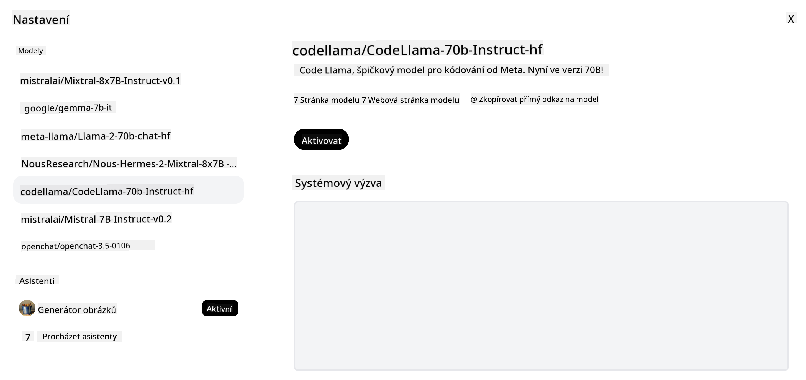

<!--
CO_OP_TRANSLATOR_METADATA:
{
  "original_hash": "0bba96e53ab841d99db731892a51fab8",
  "translation_date": "2025-05-20T07:02:32+00:00",
  "source_file": "16-open-source-models/README.md",
  "language_code": "cs"
}
-->

## Úvod

Svět open-source LLM je vzrušující a neustále se vyvíjející. Tato lekce si klade za cíl poskytnout podrobný pohled na open source modely. Pokud hledáte informace o tom, jak se proprietární modely srovnávají s open source modely, navštivte lekci ["Zkoumání a srovnávání různých LLM"](../02-exploring-and-comparing-different-llms/README.md?WT.mc_id=academic-105485-koreyst). Tato lekce se také zabývá tématem doladění, ale podrobnější vysvětlení najdete v lekci ["Doladění LLM"](../18-fine-tuning/README.md?WT.mc_id=academic-105485-koreyst).

## Cíle učení

- Získat porozumění open source modelům
- Pochopení výhod práce s open source modely
- Prozkoumání otevřených modelů dostupných na Hugging Face a Azure AI Studio

## Co jsou Open Source Modely?

Open source software sehrál klíčovou roli v růstu technologií v různých oblastech. Open Source Initiative (OSI) definovala [10 kritérií pro software](https://web.archive.org/web/20241126001143/https://opensource.org/osd?WT.mc_id=academic-105485-koreyst), aby mohl být klasifikován jako open source. Zdrojový kód musí být otevřeně sdílen pod licencí schválenou OSI.

Ačkoli vývoj LLM má podobné prvky jako vývoj softwaru, proces není zcela stejný. To vyvolalo mnoho diskusí v komunitě o definici open source v kontextu LLM. Aby model odpovídal tradiční definici open source, měly by být veřejně dostupné následující informace:

- Datové sady použité k trénování modelu.
- Úplné váhy modelu jako součást tréninku.
- Kód pro hodnocení.
- Kód pro doladění.
- Úplné váhy modelu a metriky tréninku.

V současnosti existuje jen několik modelů, které splňují tato kritéria. [Model OLMo vytvořený Allen Institute for Artificial Intelligence (AllenAI)](https://huggingface.co/allenai/OLMo-7B?WT.mc_id=academic-105485-koreyst) je jedním z nich.

Pro tuto lekci budeme dále modely označovat jako "otevřené modely", protože v době psaní nemusí odpovídat výše uvedeným kritériím.

## Výhody otevřených modelů

**Vysoce přizpůsobitelné** - Jelikož jsou otevřené modely uvolněny s podrobnými informacemi o tréninku, mohou výzkumníci a vývojáři upravovat vnitřní části modelu. To umožňuje vytvářet vysoce specializované modely, které jsou doladěny pro konkrétní úkol nebo oblast studia. Některé příklady zahrnují generování kódu, matematické operace a biologii.

**Náklady** - Náklady na token pro použití a nasazení těchto modelů jsou nižší než u proprietárních modelů. Při vytváření aplikací Generative AI byste měli zvážit výkon vs. cenu při práci s těmito modely na vašem případu použití.

 Zdroj: Artificial Analysis

**Flexibilita** - Práce s otevřenými modely vám umožňuje být flexibilní při používání různých modelů nebo jejich kombinaci. Příkladem je [HuggingChat Assistants](https://huggingface.co/chat?WT.mc_id=academic-105485-koreyst), kde si uživatel může přímo v uživatelském rozhraní vybrat model, který se používá:

## Prozkoumání různých otevřených modelů

### Llama 2

[LLama2](https://huggingface.co/meta-llama?WT.mc_id=academic-105485-koreyst), vyvinutý Meta, je otevřený model optimalizovaný pro chatové aplikace. To je díky jeho metodě doladění, která zahrnovala velké množství dialogů a lidské zpětné vazby. S touto metodou model generuje více výsledků, které odpovídají očekávání uživatele, což poskytuje lepší uživatelský zážitek.

Některé příklady doladěných verzí Llama zahrnují [Japanese Llama](https://huggingface.co/elyza/ELYZA-japanese-Llama-2-7b?WT.mc_id=academic-105485-koreyst), která se specializuje na japonštinu, a [Llama Pro](https://huggingface.co/TencentARC/LLaMA-Pro-8B?WT.mc_id=academic-105485-koreyst), což je vylepšená verze základního modelu.

### Mistral

[Mistral](https://huggingface.co/mistralai?WT.mc_id=academic-105485-koreyst) je otevřený model se silným zaměřením na vysoký výkon a efektivitu. Používá přístup Mixture-of-Experts, který kombinuje skupinu specializovaných expertních modelů do jednoho systému, kde v závislosti na vstupu jsou vybrány určité modely k použití. To činí výpočet efektivnějším, protože modely se zabývají pouze vstupy, na které jsou specializovány.

Některé příklady doladěných verzí Mistral zahrnují [BioMistral](https://huggingface.co/BioMistral/BioMistral-7B?text=Mon+nom+est+Thomas+et+mon+principal?WT.mc_id=academic-105485-koreyst), který se zaměřuje na lékařskou oblast, a [OpenMath Mistral](https://huggingface.co/nvidia/OpenMath-Mistral-7B-v0.1-hf?WT.mc_id=academic-105485-koreyst), který provádí matematické výpočty.

### Falcon

[Falcon](https://huggingface.co/tiiuae?WT.mc_id=academic-105485-koreyst) je LLM vytvořený Technologickým inovačním institutem (**TII**). Falcon-40B byl trénován na 40 miliardách parametrů, což se ukázalo jako lepší než GPT-3 s menším výpočetním rozpočtem. To je díky použití algoritmu FlashAttention a multiquery attention, které umožňují snížit paměťové požadavky v době inference. S touto sníženou dobou inference je Falcon-40B vhodný pro chatové aplikace.

Některé příklady doladěných verzí Falcon jsou [OpenAssistant](https://huggingface.co/OpenAssistant/falcon-40b-sft-top1-560?WT.mc_id=academic-105485-koreyst), asistent postavený na otevřených modelech, a [GPT4ALL](https://huggingface.co/nomic-ai/gpt4all-falcon?WT.mc_id=academic-105485-koreyst), který poskytuje vyšší výkon než základní model.

## Jak si vybrat

Neexistuje jedna odpověď na výběr otevřeného modelu. Dobré místo pro začátek je použití funkce filtrování podle úkolu ve Azure AI Studio. To vám pomůže pochopit, pro jaké typy úkolů byl model trénován. Hugging Face také udržuje LLM Leaderboard, který vám ukáže nejlepší modely podle určitých metrik.

Pokud hledáte srovnání LLM napříč různými typy, [Artificial Analysis](https://artificialanalysis.ai/?WT.mc_id=academic-105485-koreyst) je další skvělý zdroj:

 Zdroj: Artificial Analysis

Pokud pracujete na konkrétním případu použití, může být efektivní hledání doladěných verzí zaměřených na stejnou oblast. Experimentování s více otevřenými modely, abyste viděli, jak fungují podle vašich a uživatelských očekávání, je další dobrá praxe.

## Další kroky

Nejlepší na otevřených modelech je, že s nimi můžete začít pracovat poměrně rychle. Podívejte se na [Azure AI Studio Model Catalog](https://ai.azure.com?WT.mc_id=academic-105485-koreyst), který obsahuje specifickou kolekci Hugging Face s těmito modely, o kterých jsme zde diskutovali.

## Učení nekončí zde, pokračujte v cestě

Po dokončení této lekce se podívejte na naši [Generative AI Learning collection](https://aka.ms/genai-collection?WT.mc_id=academic-105485-koreyst), abyste pokračovali ve zvyšování svých znalostí o Generative AI!

**Upozornění**:  
Tento dokument byl přeložen pomocí služby pro automatický překlad [Co-op Translator](https://github.com/Azure/co-op-translator). Ačkoli se snažíme o přesnost, mějte prosím na paměti, že automatizované překlady mohou obsahovat chyby nebo nepřesnosti. Původní dokument ve svém rodném jazyce by měl být považován za autoritativní zdroj. Pro důležité informace se doporučuje profesionální lidský překlad. Nejsme zodpovědní za jakékoli nedorozumění nebo nesprávné interpretace vyplývající z použití tohoto překladu.