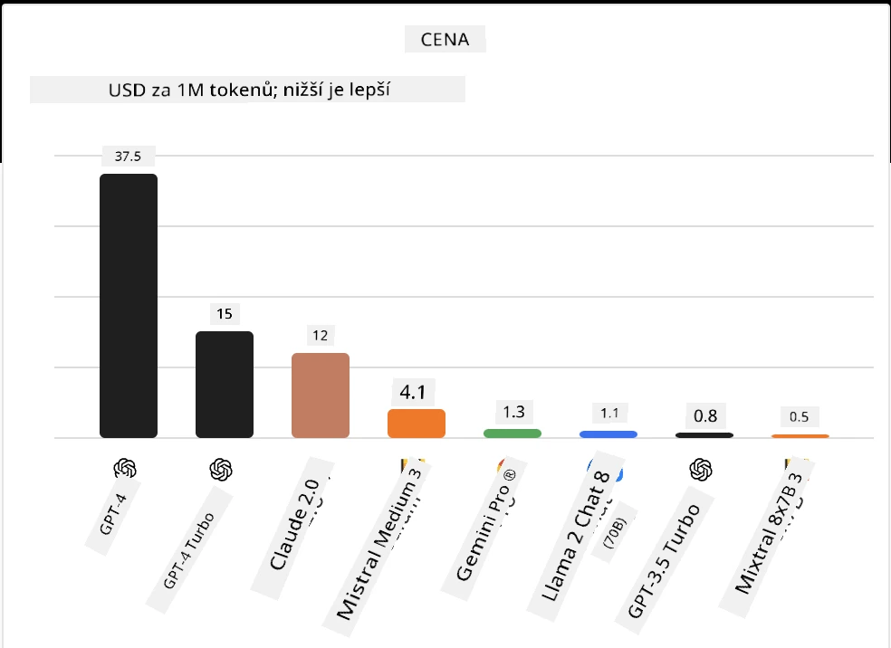
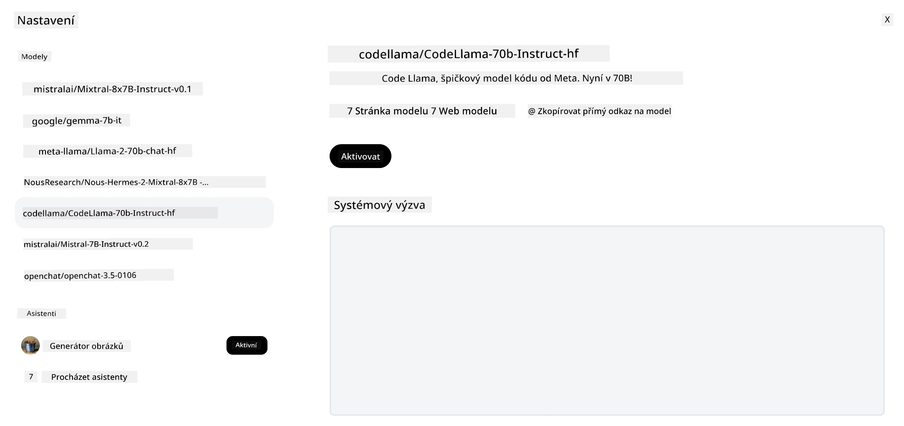
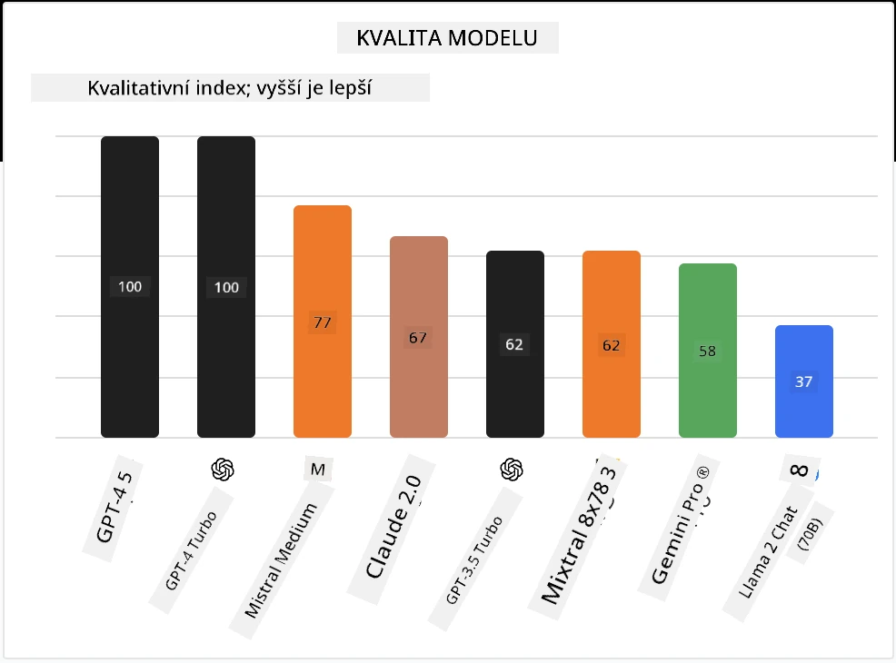

## Úvod

Svět open-source LLM je vzrušující a neustále se vyvíjející. Cílem této lekce je poskytnout podrobný pohled na open source modely. Pokud hledáte informace o tom, jak se proprietární modely srovnávají s open source modely, přejděte na lekci ["Prozkoumání a porovnání různých LLM"](../02-exploring-and-comparing-different-llms/README.md?WT.mc_id=academic-105485-koreyst). Tato lekce také pokryje téma ladění, ale podrobnější vysvětlení najdete v lekci ["Ladění LLM"](../18-fine-tuning/README.md?WT.mc_id=academic-105485-koreyst).

## Cíle učení

- Získat pochopení open source modelů
- Pochopení výhod práce s open source modely
- Prozkoumání dostupných otevřených modelů na Hugging Face a v katalogu modelů Microsoft Foundry

## Co jsou Open Source modely?

Open source software sehrál klíčovou roli v růstu technologií v různých oblastech. Open Source Initiative (OSI) definovala [10 kritérií pro software](https://web.archive.org/web/20241126001143/https://opensource.org/osd?WT.mc_id=academic-105485-koreyst), aby byl klasifikován jako open source. Zdrojový kód musí být veřejně sdílen pod licencí schválenou OSI.

Vývoj LLM má podobné prvky jako vývoj softwaru, ale proces není zcela stejný. To vedlo k mnoha diskuzím v komunitě o definici open source v kontextu LLM. Pro to, aby model odpovídal tradiční definici open source, by měly být veřejně dostupné následující informace:

- Datové sady použité k tréninku modelu.
- Kompletní váhy modelu jako součást tréninku.
- Kód pro vyhodnocení.
- Kód pro ladění (fine-tuning).
- Kompletní váhy modelu a metriky tréninku.

V současné době existuje jen několik modelů, které splňují tato kritéria. [Model OLMo vytvořený Allen Institute for Artificial Intelligence (AllenAI)](https://huggingface.co/allenai/OLMo-7B?WT.mc_id=academic-105485-koreyst) patří mezi ty, které do této kategorie spadají.

Pro tuto lekci budeme modely nadále označovat jako "otevřené modely", protože v době psaní nemusí splňovat výše uvedená kritéria.

## Výhody otevřených modelů

**Vysoce přizpůsobitelné** - Jelikož jsou otevřené modely vydávány s podrobnými informacemi o tréninku, výzkumníci a vývojáři mohou měnit vnitřní strukturu modelu. To umožňuje vytvářet vysoce specializované modely, které jsou laděné pro konkrétní úkol nebo oblast studia. Příklady takových specializací jsou generování kódu, matematické operace a biologie.

**Cena** - Cena za token při používání a nasazení těchto modelů je nižší než u proprietárních modelů. Při vytváření generativních AI aplikací je vhodné sledovat poměr výkonu k ceně při práci s těmito modely pro váš konkrétní případ použití.

Zdroj: Artificial Analysis

**Flexibilita** - Práce s otevřenými modely umožňuje být flexibilní v používání různých modelů nebo jejich kombinování. Příkladem jsou [HuggingChat asistenti](https://huggingface.co/chat?WT.mc_id=academic-105485-koreyst), kde uživatel může přímo v uživatelském rozhraní vybrat model, který se má použít:

## Prozkoumání různých otevřených modelů

### Llama 2

[Llama2](https://huggingface.co/meta-llama?WT.mc_id=academic-105485-koreyst), vyvinutý společností Meta, je otevřený model optimalizovaný pro chatové aplikace. To je díky jeho metodě ladění, která zahrnovala značné množství dialogu a lidské zpětné vazby. Tímto způsobem model vytváří výsledky více odpovídající lidským očekáváním, což zlepšuje uživatelský zážitek.

Příklady laděných verzí Llamy zahrnují [Japanese Llama](https://huggingface.co/elyza/ELYZA-japanese-Llama-2-7b?WT.mc_id=academic-105485-koreyst), specializovaný na japonštinu, a [Llama Pro](https://huggingface.co/TencentARC/LLaMA-Pro-8B?WT.mc_id=academic-105485-koreyst), což je vylepšená verze základního modelu.

### Mistral

[Mistral](https://huggingface.co/mistralai?WT.mc_id=academic-105485-koreyst) je otevřený model se silným zaměřením na vysoký výkon a efektivitu. Používá přístup Mixture-of-Experts, který kombinuje skupinu specializovaných expertních modelů do jednoho systému, kde podle vstupu jsou vybrány určité modely k použití. To činí výpočet efektivnějším, protože modely zpracovávají pouze ty vstupy, ve kterých jsou specializované.

Příklady laděných verzí Mistralu zahrnují [BioMistral](https://huggingface.co/BioMistral/BioMistral-7B?text=Mon+nom+est+Thomas+et+mon+principal?WT.mc_id=academic-105485-koreyst), zaměřený na lékařskou oblast, a [OpenMath Mistral](https://huggingface.co/nvidia/OpenMath-Mistral-7B-v0.1-hf?WT.mc_id=academic-105485-koreyst), který provádí matematické výpočty.

### Falcon

[Falcon](https://huggingface.co/tiiuae?WT.mc_id=academic-105485-koreyst) je LLM vytvořený Technologickým institutem inovací (**TII**). Falcon-40B byl trénován na 40 miliardách parametrů a ukázalo se, že dosahuje lepšího výkonu než GPT-3 s menším výpočetním rozpočtem. Důvodem je jeho použití algoritmu FlashAttention a multiquery attention, které umožňují snížit paměťové nároky během inferenčního času. Díky tomuto zkrácenému času inferencí je Falcon-40B vhodný pro chatové aplikace.

Příklady laděných verzí Falconu jsou [OpenAssistant](https://huggingface.co/OpenAssistant/falcon-40b-sft-top1-560?WT.mc_id=academic-105485-koreyst), asistent postavený na otevřených modelech, a [GPT4ALL](https://huggingface.co/nomic-ai/gpt4all-falcon?WT.mc_id=academic-105485-koreyst), který poskytuje vyšší výkon než základní model.

## Jak vybrat

Neexistuje jediná správná odpověď, jak vybrat otevřený model. Dobré místo pro začátek je využití filtru podle úkolu v katalogu modelů Microsoft Foundry. To vám pomůže pochopit, pro jaké typy úkolů byl model trénován. Hugging Face také udržuje žebříček LLM, který ukazuje nejlepší modely podle určitých metrik.

Pokud chcete porovnat LLM napříč různými typy, [Artificial Analysis](https://artificialanalysis.ai/?WT.mc_id=academic-105485-koreyst) je další skvělý zdroj:

Zdroj: Artificial Analysis

Pokud pracujete na konkrétním případě použití, může být efektivní hledat laděné verze zaměřené na stejnou oblast. Experimentování s několika otevřenými modely a sledování jejich výkonu podle vašich a uživatelových očekávání je také dobrá praxe.

## Další kroky

Nejlepší na otevřených modelech je, že s nimi můžete začít pracovat poměrně rychle. Prohlédněte si [katalog modelů Microsoft Foundry](https://ai.azure.com?WT.mc_id=academic-105485-koreyst), který obsahuje speciální kolekci Hugging Face s modely, o kterých jsme zde hovořili.

## Učení zde nekončí, pokračujte na cestě

Po dokončení této lekce si prohlédněte naši [kolekci Generative AI Learning](https://aka.ms/genai-collection?WT.mc_id=academic-105485-koreyst), abyste pokračovali ve zvyšování znalostí o Generativní AI!

---

<!-- CO-OP TRANSLATOR DISCLAIMER START -->
**Prohlášení o omezení odpovědnosti**:
Tento dokument byl přeložen pomocí AI překladatelské služby [Co-op Translator](https://github.com/Azure/co-op-translator). Přestože usilujeme o co největší přesnost, mějte prosím na paměti, že automatizované překlady mohou obsahovat chyby nebo nepřesnosti. Originální dokument v jeho mateřském jazyce by měl být považován za autoritativní zdroj. Pro kritické informace se doporučuje profesionální lidský překlad. Nejsme odpovědní za jakékoli nedorozumění nebo nesprávné interpretace vzniklé použitím tohoto překladu.
<!-- CO-OP TRANSLATOR DISCLAIMER END -->