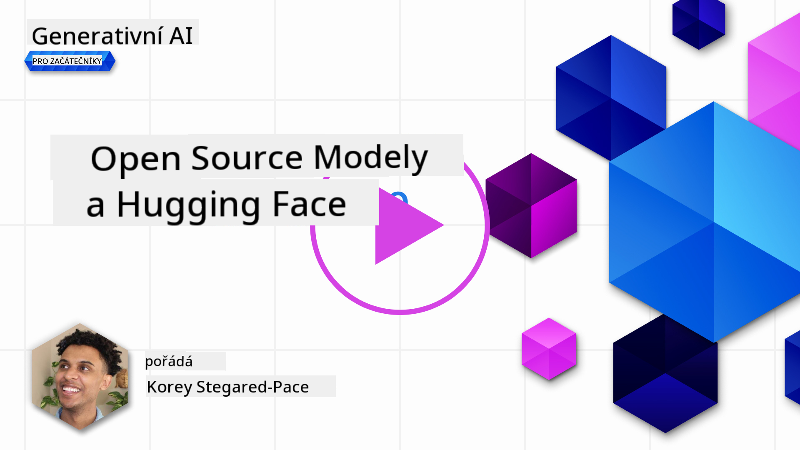
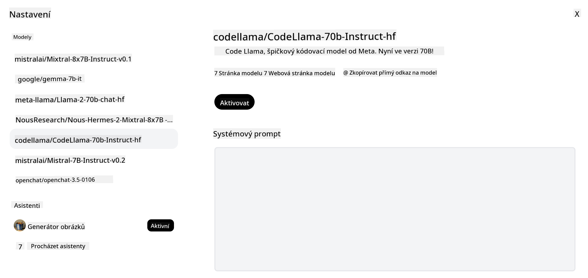
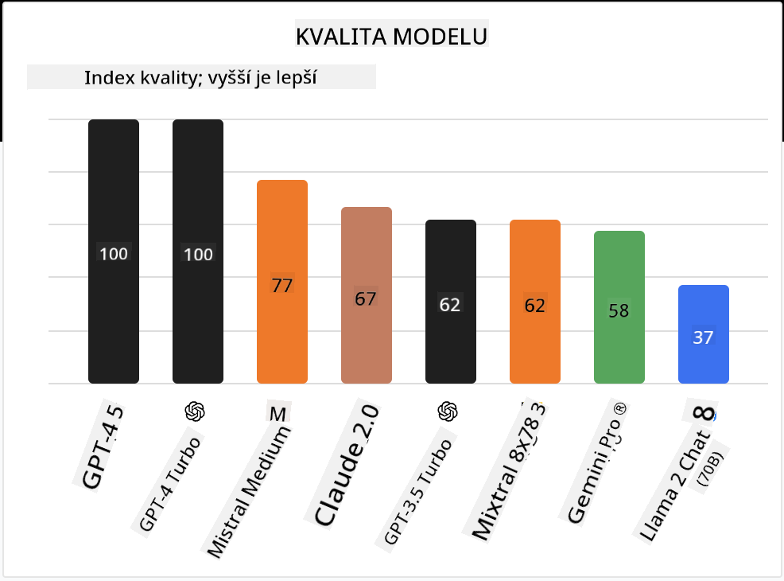

<!--
CO_OP_TRANSLATOR_METADATA:
{
  "original_hash": "0bba96e53ab841d99db731892a51fab8",
  "translation_date": "2025-06-26T00:02:49+00:00",
  "source_file": "16-open-source-models/README.md",
  "language_code": "cs"
}
-->

## Úvod

Svět open-source LLM je vzrušující a neustále se vyvíjí. Tato lekce si klade za cíl poskytnout podrobný pohled na open source modely. Pokud hledáte informace o tom, jak se proprietární modely srovnávají s open source modely, přejděte na lekci ["Zkoumání a porovnávání různých LLM"](../02-exploring-and-comparing-different-llms/README.md?WT.mc_id=academic-105485-koreyst). Tato lekce se také zaměří na téma doladění, ale podrobnější vysvětlení naleznete v lekci ["Doladění LLM"](../18-fine-tuning/README.md?WT.mc_id=academic-105485-koreyst).

## Cíle učení

- Získat porozumění open source modelům
- Pochopit výhody práce s open source modely
- Prozkoumat dostupné open modely na Hugging Face a Azure AI Studio

## Co jsou Open Source modely?

Open source software hrál klíčovou roli v růstu technologií napříč různými oblastmi. Open Source Initiative (OSI) definovala [10 kritérií pro software](https://web.archive.org/web/20241126001143/https://opensource.org/osd?WT.mc_id=academic-105485-koreyst), aby mohl být klasifikován jako open source. Zdrojový kód musí být otevřeně sdílen pod licencí schválenou OSI.

Ačkoli vývoj LLM má podobné prvky jako vývoj softwaru, proces není úplně stejný. To vyvolalo mnoho diskusí v komunitě o definici open source v kontextu LLM. Aby model odpovídal tradiční definici open source, měly by být veřejně dostupné následující informace:

- Datové sady použité k trénování modelu.
- Plné váhy modelu jako součást tréninku.
- Kód pro hodnocení.
- Kód pro doladění.
- Plné váhy modelu a metriky tréninku.

V současné době existuje jen několik modelů, které splňují tato kritéria. [Model OLMo vytvořený Allen Institute for Artificial Intelligence (AllenAI)](https://huggingface.co/allenai/OLMo-7B?WT.mc_id=academic-105485-koreyst) je jedním z nich.

Pro tuto lekci budeme dále označovat modely jako "open modely", protože v době psaní nemusí splňovat výše uvedená kritéria.

## Výhody Open modelů

**Vysoce přizpůsobitelné** - Protože open modely jsou vydávány s podrobnými informacemi o tréninku, výzkumníci a vývojáři mohou upravit vnitřní strukturu modelu. To umožňuje vytvářet vysoce specializované modely, které jsou doladěny pro konkrétní úkol nebo oblast studia. Některé příklady zahrnují generování kódu, matematické operace a biologii.

**Náklady** - Náklady na token při použití a nasazení těchto modelů jsou nižší než u proprietárních modelů. Při budování aplikací generativní AI by mělo být zváženo výkon versus cena při práci s těmito modely na vašem případě použití.

 Zdroj: Artificial Analysis

**Flexibilita** - Práce s open modely umožňuje být flexibilní při používání různých modelů nebo jejich kombinaci. Příkladem je [HuggingChat Assistants](https://huggingface.co/chat?WT.mc_id=academic-105485-koreyst), kde si uživatel může vybrat model, který se používá přímo v uživatelském rozhraní:

## Prozkoumání různých Open modelů

### Llama 2

[LLama2](https://huggingface.co/meta-llama?WT.mc_id=academic-105485-koreyst), vyvinutý společností Meta, je open model, který je optimalizován pro aplikace založené na chatu. To je díky jeho metodě doladění, která zahrnovala velké množství dialogů a lidské zpětné vazby. Tímto způsobem model produkuje více výsledků, které odpovídají lidským očekáváním, což poskytuje lepší uživatelský zážitek.

Některé příklady doladěných verzí Llama zahrnují [Japanese Llama](https://huggingface.co/elyza/ELYZA-japanese-Llama-2-7b?WT.mc_id=academic-105485-koreyst), který se specializuje na japonštinu, a [Llama Pro](https://huggingface.co/TencentARC/LLaMA-Pro-8B?WT.mc_id=academic-105485-koreyst), což je vylepšená verze základního modelu.

### Mistral

[Mistral](https://huggingface.co/mistralai?WT.mc_id=academic-105485-koreyst) je open model s důrazem na vysoký výkon a efektivitu. Používá přístup Mixture-of-Experts, který kombinuje skupinu specializovaných expertních modelů do jednoho systému, kde v závislosti na vstupu jsou vybrány určité modely k použití. Tím je výpočet efektivnější, protože modely se zabývají pouze vstupy, na které jsou specializované.

Některé příklady doladěných verzí Mistral zahrnují [BioMistral](https://huggingface.co/BioMistral/BioMistral-7B?text=Mon+nom+est+Thomas+et+mon+principal?WT.mc_id=academic-105485-koreyst), který se zaměřuje na lékařskou oblast, a [OpenMath Mistral](https://huggingface.co/nvidia/OpenMath-Mistral-7B-v0.1-hf?WT.mc_id=academic-105485-koreyst), který provádí matematické výpočty.

### Falcon

[Falcon](https://huggingface.co/tiiuae?WT.mc_id=academic-105485-koreyst) je LLM vytvořený Technologickým inovačním institutem (**TII**). Falcon-40B byl trénován na 40 miliardách parametrů, což se ukázalo jako lepší než GPT-3 s menším výpočetním rozpočtem. To je díky použití algoritmu FlashAttention a multiquery attention, které umožňují snížit paměťové nároky při inferenci. S tímto sníženým časem inference je Falcon-40B vhodný pro chatové aplikace.

Některé příklady doladěných verzí Falcon zahrnují [OpenAssistant](https://huggingface.co/OpenAssistant/falcon-40b-sft-top1-560?WT.mc_id=academic-105485-koreyst), asistenta postaveného na open modelech, a [GPT4ALL](https://huggingface.co/nomic-ai/gpt4all-falcon?WT.mc_id=academic-105485-koreyst), který poskytuje vyšší výkon než základní model.

## Jak vybrat

Neexistuje jednoznačná odpověď na výběr open modelu. Dobrým místem, kde začít, je použití funkce filtru podle úkolu v Azure AI Studio. To vám pomůže pochopit, pro jaké typy úkolů byl model trénován. Hugging Face také udržuje LLM Leaderboard, který vám ukáže nejvýkonnější modely na základě určitých metrik.

Při porovnávání LLM napříč různými typy je [Artificial Analysis](https://artificialanalysis.ai/?WT.mc_id=academic-105485-koreyst) dalším skvělým zdrojem:

 Zdroj: Artificial Analysis

Pokud pracujete na konkrétním případě použití, hledání doladěných verzí, které se zaměřují na stejnou oblast, může být efektivní. Experimentování s více open modely, abyste zjistili, jak si vedou podle vašich a uživatelských očekávání, je další dobrou praxí.

## Další kroky

Nejlepší na open modelech je, že s nimi můžete začít pracovat poměrně rychle. Podívejte se na [Katalog modelů Azure AI Studio](https://ai.azure.com?WT.mc_id=academic-105485-koreyst), který obsahuje specifickou kolekci Hugging Face s těmito modely, o kterých jsme zde diskutovali.

## Učení zde nekončí, pokračujte v cestě

Po dokončení této lekce se podívejte na naši [Generativní AI Learning kolekci](https://aka.ms/genai-collection?WT.mc_id=academic-105485-koreyst), abyste pokračovali ve zvyšování svých znalostí o generativní AI!

**Prohlášení:**
Tento dokument byl přeložen pomocí služby AI překladatele [Co-op Translator](https://github.com/Azure/co-op-translator). I když se snažíme o přesnost, mějte na paměti, že automatizované překlady mohou obsahovat chyby nebo nepřesnosti. Původní dokument v jeho rodném jazyce by měl být považován za autoritativní zdroj. Pro kritické informace se doporučuje profesionální lidský překlad. Nejsme odpovědní za jakékoli nedorozumění nebo nesprávné interpretace vyplývající z použití tohoto překladu.