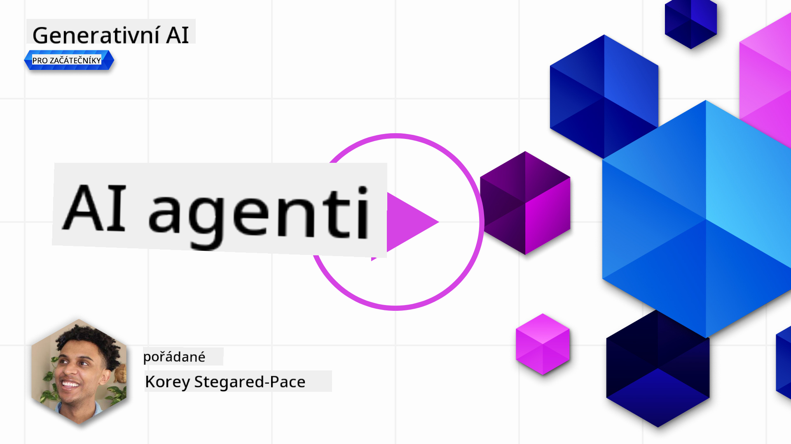
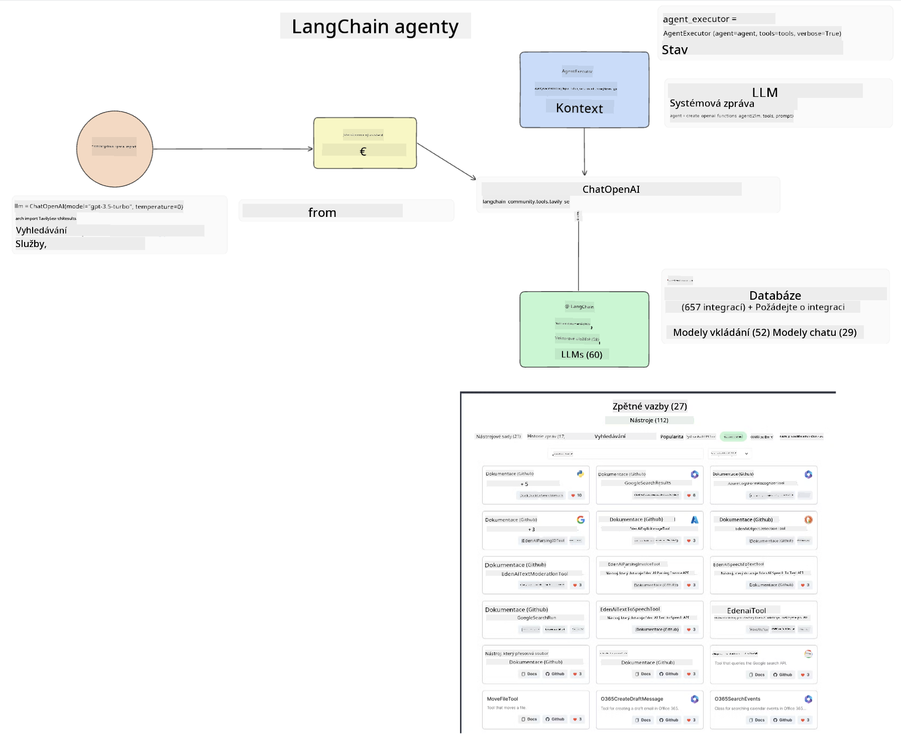
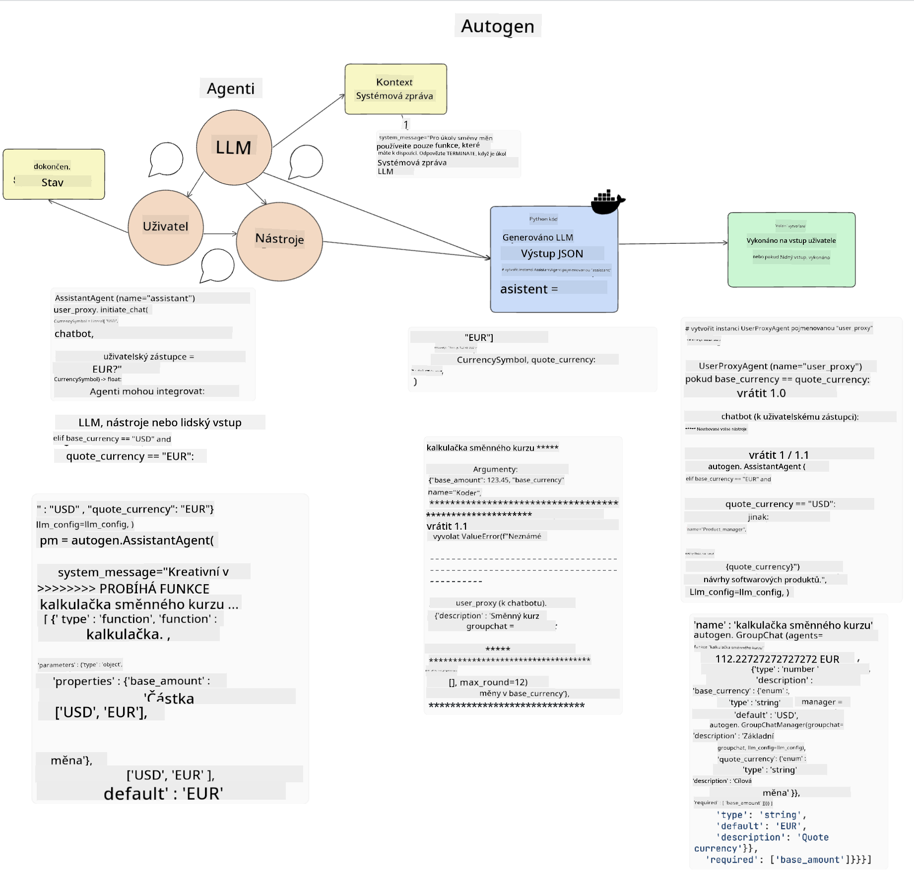
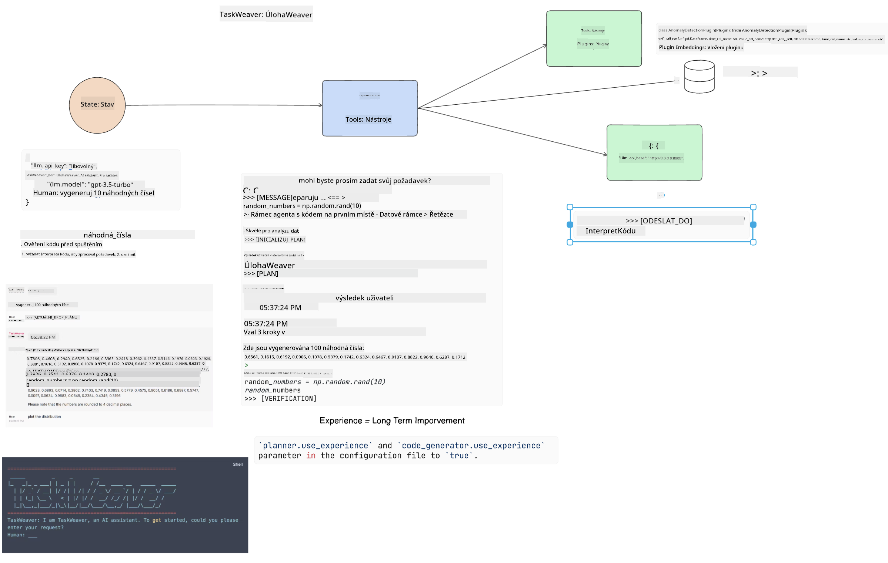
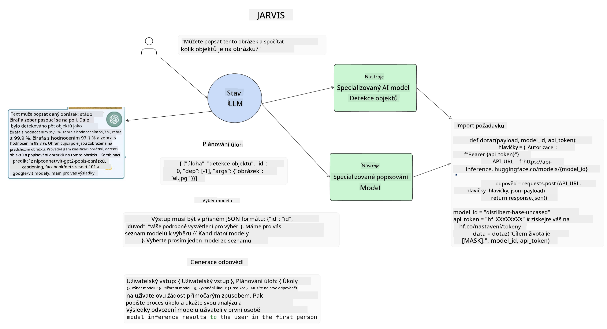

<!--
CO_OP_TRANSLATOR_METADATA:
{
  "original_hash": "11f03c81f190d9cbafd0f977dcbede6c",
  "translation_date": "2025-05-20T07:30:35+00:00",
  "source_file": "17-ai-agents/README.md",
  "language_code": "cs"
}
-->
[](https://aka.ms/gen-ai-lesson17-gh?WT.mc_id=academic-105485-koreyst)

## Úvod

AI agenti představují vzrušující vývoj v oblasti Generative AI, umožňující velkým jazykovým modelům (LLM) vyvíjet se z asistentů na agenty schopné podnikat kroky. Rámce AI agentů umožňují vývojářům vytvářet aplikace, které poskytují LLM přístup k nástrojům a správě stavu. Tyto rámce také zvyšují viditelnost, což uživatelům a vývojářům umožňuje sledovat akce plánované LLM, čímž se zlepšuje řízení zkušeností.

Lekce se zaměří na následující oblasti:

- Pochopení, co je AI agent - Co přesně je AI agent?
- Prozkoumání čtyř různých rámců AI agentů - Co je činí jedinečnými?
- Aplikace těchto AI agentů na různé případy použití - Kdy bychom měli použít AI agenty?

## Cíle učení

Po absolvování této lekce budete schopni:

- Vysvětlit, co jsou AI agenti a jak je lze použít.
- Mít přehled o rozdílech mezi některými populárními rámci AI agentů a jak se liší.
- Pochopit, jak AI agenti fungují, abyste s nimi mohli vytvářet aplikace.

## Co jsou AI agenti?

AI agenti jsou velmi vzrušující oblastí ve světě Generative AI. S tímto nadšením však někdy přichází zmatek ohledně pojmů a jejich použití. Abychom věci zjednodušili a zahrnuli většinu nástrojů, které se odkazují na AI agenty, použijeme tuto definici:

AI agenti umožňují velkým jazykovým modelům (LLM) vykonávat úkoly tím, že jim poskytují přístup ke **stavu** a **nástrojům**.


Pojďme si definovat tyto pojmy:

**Velké jazykové modely** - To jsou modely, na které se v tomto kurzu odkazujeme, jako GPT-3.5, GPT-4, Llama-2 atd.

**Stav** - Toto označuje kontext, ve kterém LLM pracuje. LLM využívá kontext svých minulých akcí a aktuální kontext, což vede jeho rozhodování pro následující akce. Rámce AI agentů umožňují vývojářům tento kontext snadněji udržovat.

**Nástroje** - Aby bylo možné dokončit úkol, který uživatel požadoval a který LLM naplánoval, potřebuje LLM přístup k nástrojům. Některé příklady nástrojů mohou být databáze, API, externí aplikace nebo dokonce další LLM!

Tyto definice by vám měly poskytnout dobrý základ pro další postup, když se podíváme na to, jak jsou implementovány. Pojďme prozkoumat několik různých rámců AI agentů:

## LangChain Agents

[LangChain Agents](https://python.langchain.com/docs/how_to/#agents?WT.mc_id=academic-105485-koreyst) je implementace definic, které jsme uvedli výše.

K řízení **stavu** používá vestavěnou funkci zvanou `AgentExecutor`. Tato funkce přijímá definované `agent` a dostupné `tools`.

`Agent Executor` také ukládá historii chatu, aby poskytla kontext chatu.



LangChain nabízí [katalog nástrojů](https://integrations.langchain.com/tools?WT.mc_id=academic-105485-koreyst), které lze importovat do vaší aplikace, ve které může LLM získat přístup. Tyto nástroje jsou vytvářeny komunitou a týmem LangChain.

Tyto nástroje pak můžete definovat a předat je `Agent Executor`.

Viditelnost je dalším důležitým aspektem při hovoru o AI agentech. Je důležité, aby vývojáři aplikací pochopili, který nástroj LLM používá a proč. Pro tento účel tým LangChain vyvinul LangSmith.

## AutoGen

Další rámec AI agentů, který budeme diskutovat, je [AutoGen](https://microsoft.github.io/autogen/?WT.mc_id=academic-105485-koreyst). Hlavním zaměřením AutoGen je konverzace. Agenti jsou jak **konverzační**, tak **přizpůsobitelní**.

**Konverzační -** LLM mohou zahájit a pokračovat v konverzaci s jiným LLM, aby dokončili úkol. To se provádí vytvořením `AssistantAgents` a poskytnutím specifické systémové zprávy.

```python

autogen.AssistantAgent( name="Coder", llm_config=llm_config, ) pm = autogen.AssistantAgent( name="Product_manager", system_message="Creative in software product ideas.", llm_config=llm_config, )

```

**Přizpůsobitelní** - Agenti mohou být definováni nejen jako LLM, ale také jako uživatel nebo nástroj. Jako vývojář můžete definovat `UserProxyAgent`, který je zodpovědný za interakci s uživatelem pro zpětnou vazbu při dokončování úkolu. Tato zpětná vazba může buď pokračovat v provádění úkolu, nebo jej zastavit.

```python
user_proxy = UserProxyAgent(name="user_proxy")
```

### Stav a nástroje

Pro změnu a správu stavu generuje asistenční agent k dokončení úkolu kód v Pythonu.

Zde je příklad procesu:



#### LLM definovaný se systémovou zprávou

```python
system_message="For weather related tasks, only use the functions you have been provided with. Reply TERMINATE when the task is done."
```

Tato systémová zpráva směruje tento konkrétní LLM k tomu, které funkce jsou relevantní pro jeho úkol. Pamatujte, že s AutoGen můžete mít více definovaných AssistantAgents s různými systémovými zprávami.

#### Chat je zahájen uživatelem

```python
user_proxy.initiate_chat( chatbot, message="I am planning a trip to NYC next week, can you help me pick out what to wear? ", )

```

Tato zpráva od user_proxy (lidského) je tím, co spustí proces agenta prozkoumat možné funkce, které by měl vykonat.

#### Funkce je vykonána

```bash
chatbot (to user_proxy):

***** Suggested tool Call: get_weather ***** Arguments: {"location":"New York City, NY","time_periond:"7","temperature_unit":"Celsius"} ******************************************************** --------------------------------------------------------------------------------

>>>>>>>> EXECUTING FUNCTION get_weather... user_proxy (to chatbot): ***** Response from calling function "get_weather" ***** 112.22727272727272 EUR ****************************************************************

```

Jakmile je počáteční chat zpracován, agent odešle navrhovaný nástroj k volání. V tomto případě je to funkce nazvaná `get_weather`. Depending on your configuration, this function can be automatically executed and read by the Agent or can be executed based on user input.

You can find a list of [AutoGen code samples](https://microsoft.github.io/autogen/docs/Examples/?WT.mc_id=academic-105485-koreyst) to further explore how to get started building.

## Taskweaver

The next agent framework we will explore is [Taskweaver](https://microsoft.github.io/TaskWeaver/?WT.mc_id=academic-105485-koreyst). It is known as a "code-first" agent because instead of working strictly with `strings` , it can work with DataFrames in Python. This becomes extremely useful for data analysis and generation tasks. This can be things like creating graphs and charts or generating random numbers.

### State and Tools

To manage the state of the conversation, TaskWeaver uses the concept of a `Planner`. The `Planner` is a LLM that takes the request from the users and maps out the tasks that need to be completed to fulfill this request.

To complete the tasks the `Planner` is exposed to the collection of tools called `Plugins`. To mohou být třídy Pythonu nebo obecný interpret kódu. Tyto pluginy jsou uloženy jako embeddings, aby LLM mohl lépe vyhledávat správný plugin.



Zde je příklad pluginu pro zpracování detekce anomálií:

```python
class AnomalyDetectionPlugin(Plugin): def __call__(self, df: pd.DataFrame, time_col_name: str, value_col_name: str):
```

Kód je před vykonáním ověřen. Další funkcí pro správu kontextu v Taskweaveru je `experience`. Experience allows for the context of a conversation to be stored over to the long term in a YAML file. This can be configured so that the LLM improves over time on certain tasks given that it is exposed to prior conversations.

## JARVIS

The last agent framework we will explore is [JARVIS](https://github.com/microsoft/JARVIS?tab=readme-ov-file?WT.mc_id=academic-105485-koreyst). What makes JARVIS unique is that it uses an LLM to manage the `state` konverzace a `tools` jsou další AI modely. Každý z AI modelů je specializovaný model, který vykonává určité úkoly, jako je detekce objektů, přepis nebo popis obrázků.



LLM, jakožto model obecného účelu, přijímá požadavek od uživatele a identifikuje specifický úkol a jakékoliv argumenty/data, které jsou potřebné k dokončení úkolu.

```python
[{"task": "object-detection", "id": 0, "dep": [-1], "args": {"image": "e1.jpg" }}]
```

LLM pak formátuje požadavek způsobem, který specializovaný AI model může interpretovat, například jako JSON. Jakmile AI model vrátí svou předpověď na základě úkolu, LLM obdrží odpověď.

Pokud je k dokončení úkolu zapotřebí více modelů, také interpretuje odpovědi z těchto modelů, než je spojí dohromady, aby vygeneroval odpověď pro uživatele.

Příklad níže ukazuje, jak by to fungovalo, když uživatel požaduje popis a počet objektů na obrázku:

## Zadání

Pro pokračování ve svém učení o AI agentech můžete stavět s AutoGen:

- Aplikaci, která simuluje obchodní schůzku s různými odděleními startupu v oblasti vzdělávání.
- Vytvořte systémové zprávy, které vedou LLM k porozumění různým osobnostem a prioritám a umožňují uživateli představit nový produktový nápad.
- LLM by pak mělo generovat následné otázky z každého oddělení, aby vylepšilo a zlepšilo návrh a produktový nápad.

## Učení nekončí zde, pokračujte v cestě

Po dokončení této lekce se podívejte na naši [kolekci pro učení Generative AI](https://aka.ms/genai-collection?WT.mc_id=academic-105485-koreyst), abyste pokračovali ve zvyšování svých znalostí v oblasti Generative AI!

**Upozornění**:  
Tento dokument byl přeložen pomocí služby AI překladu [Co-op Translator](https://github.com/Azure/co-op-translator). Přestože se snažíme o přesnost, vezměte prosím na vědomí, že automatizované překlady mohou obsahovat chyby nebo nepřesnosti. Původní dokument ve svém rodném jazyce by měl být považován za autoritativní zdroj. Pro kritické informace se doporučuje profesionální lidský překlad. Nejsme zodpovědní za jakékoli nedorozumění nebo nesprávné interpretace vyplývající z použití tohoto překladu.