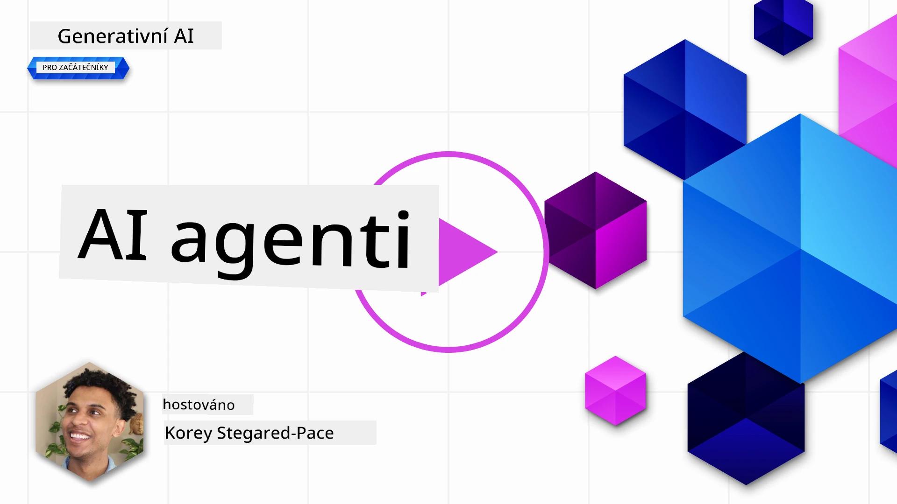
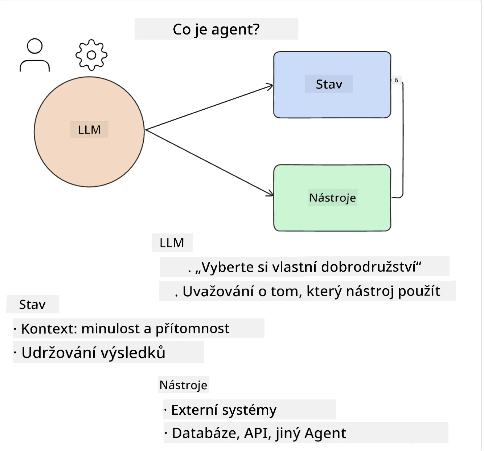
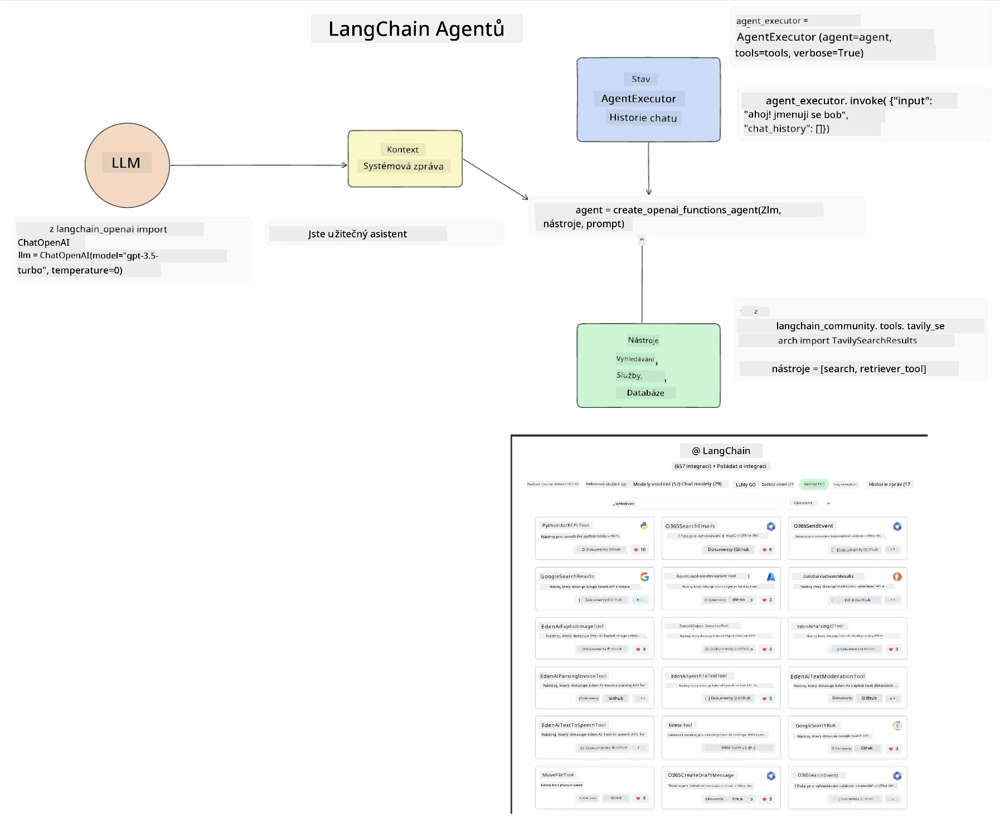
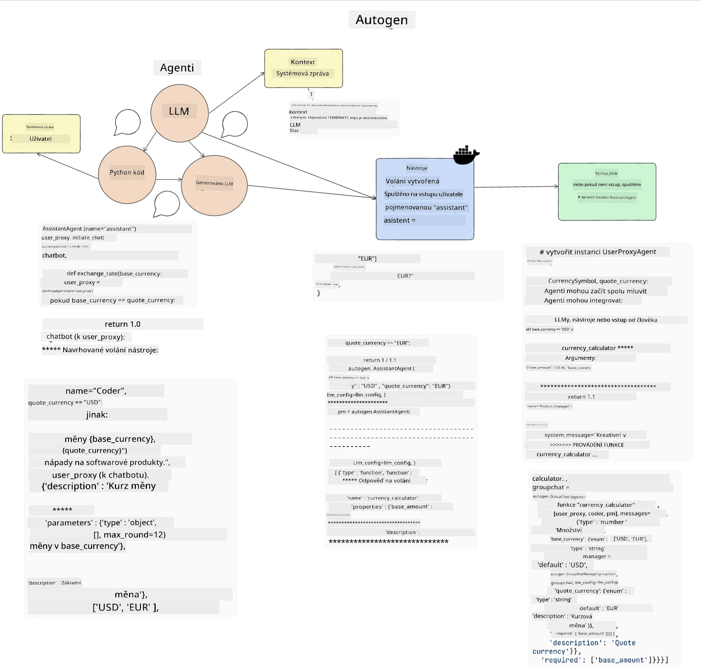
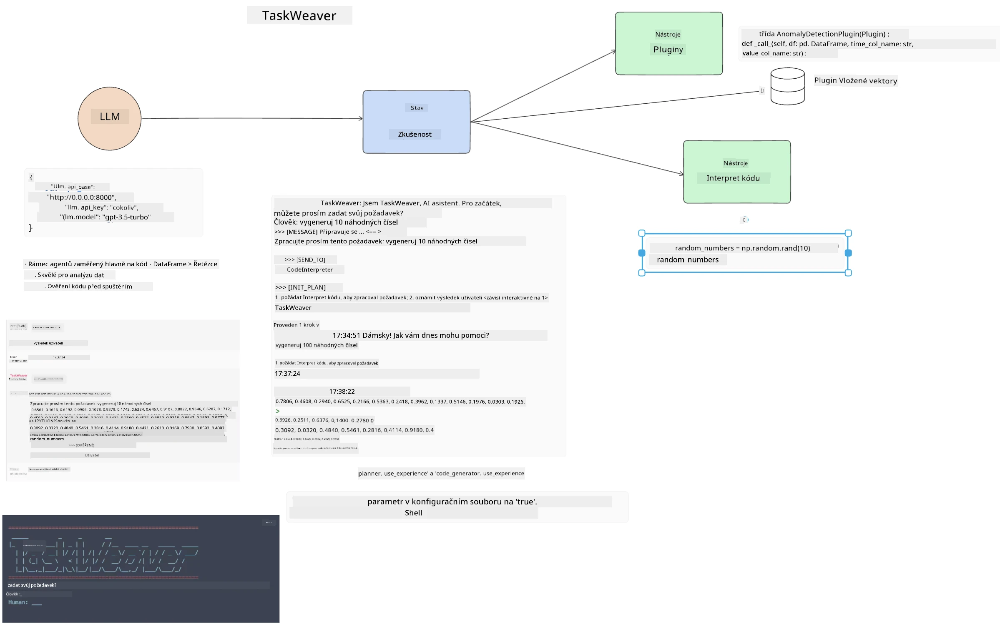
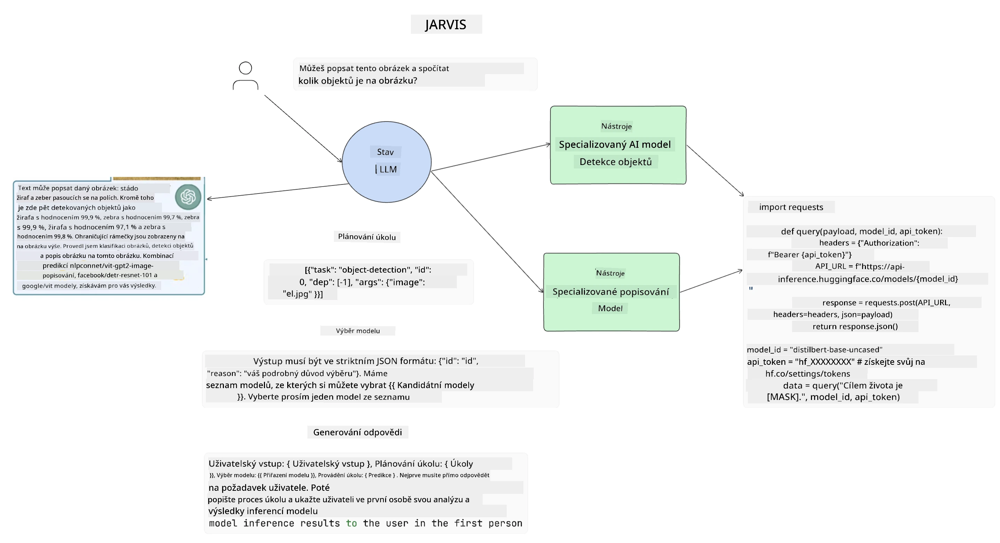

[](https://youtu.be/yAXVW-lUINc?si=bOtW9nL6jc3XJgOM)

## Úvod

AI agenti představují vzrušující vývoj v oblasti generativní AI, umožňující velkým jazykovým modelům (LLM) se vyvinout z asistentů na agenty schopné provádět akce. Rámce AI agentů umožňují vývojářům vytvářet aplikace, které dávají LLM přístup k nástrojům a správě stavu. Tyto rámce také zlepšují přehlednost, což uživatelům a vývojářům umožňuje sledovat akce plánované LLM, čímž zlepšují správu uživatelského zážitku.

Lekce pokryje následující oblasti:

- Pochopení, co je AI agent - Co přesně je AI agent?
- Prozkoumání čtyř různých rámců AI agentů - Čím jsou jedinečné?
- Použití těchto AI agentů v různých případech použití - Kdy bychom měli používat AI agenty?

## Cíle učení

Po absolvování této lekce budete schopni:

- Vysvětlit, co jsou AI agenti a jak mohou být použiti.
- Mít přehled o rozdílech mezi některými z populárních rámců AI agentů a jak se liší.
- Pochopit, jak AI agenti fungují, aby bylo možné s nimi vytvářet aplikace.

## Co jsou AI agenti?

AI agenti jsou velmi vzrušující oblastí ve světě generativní AI. Tuto vzrušující oblast však občas doprovází zmatení pojmů a jejich použití. Abychom to udrželi jednoduché a zahrnuli většinu nástrojů označovaných jako AI agenti, použijeme tuto definici:

AI agenti umožňují velkým jazykovým modelům (LLM) vykonávat úkoly tím, že jim dávají přístup ke **stavu** a **nástrojům**.



Definujme tyto pojmy:

**Velké jazykové modely** - Jedná se o modely zmiňované v tomto kurzu, jako jsou GPT-3.5, GPT-4, Llama-2 atd.

**Stav** - Odkazuje na kontext, ve kterém LLM pracuje. LLM používá kontext svých minulých akcí a aktuálního kontextu, který řídí jeho rozhodování o dalších krocích. Rámce AI agentů umožňují vývojářům snadněji udržovat tento kontext.

**Nástroje** - K dokončení úkolu, který uživatel požaduje a který LLM naplánovalo, LLM potřebuje přístup k nástrojům. Některé příklady nástrojů mohou být databáze, API, externí aplikace nebo dokonce další LLM!

Tyto definice vám snad poskytnou dobrý základ pro další průzkum toho, jak jsou implementovány. Prozkoumejme několik různých rámců AI agentů:

## LangChain agenti

[LangChain agenti](https://python.langchain.com/docs/how_to/#agents?WT.mc_id=academic-105485-koreyst) jsou implementací výše uvedených definic.

K správě **stavu** používá vestavěnou funkci nazvanou `AgentExecutor`. Ta přijímá definovaného `agenta` a dostupné `nástroje`.

`Agent Executor` také ukládá historii chatu, aby poskytl kontext konverzace.



LangChain nabízí [katalog nástrojů](https://integrations.langchain.com/tools?WT.mc_id=academic-105485-koreyst), které lze importovat do vaší aplikace, ke kterým LLM může získat přístup. Tyto nástroje vytváří komunita a tým LangChain.

Poté můžete tyto nástroje definovat a předat je `Agent Executor`.

Přehlednost je dalším důležitým aspektem při hovoru o AI agentech. Je důležité, aby vývojáři aplikací rozuměli, jaký nástroj LLM používá a proč. Proto tým LangChain vyvinul LangSmith.

## AutoGen

Další rámec AI agentů, o kterém budeme mluvit, je [AutoGen](https://microsoft.github.io/autogen/?WT.mc_id=academic-105485-koreyst). Hlavním zaměřením AutoGen jsou konverzace. Agenti jsou zároveň **konverzační** a **přizpůsobitelní**.

**Konverzační -** LLM mohou zahájit a pokračovat v konverzaci s jiným LLM za účelem dokončení úkolu. To se provádí vytvořením `AssistantAgents` a přiřazením konkrétní systémové zprávy.

```python

autogen.AssistantAgent( name="Coder", llm_config=llm_config, ) pm = autogen.AssistantAgent( name="Product_manager", system_message="Creative in software product ideas.", llm_config=llm_config, )

```

**Přizpůsobitelní** - Agentů lze definovat nejen jako LLM, ale také jako uživatele nebo nástroj. Jako vývojář můžete definovat `UserProxyAgent`, který je odpovědný za interakci s uživatelem za účelem zpětné vazby při plnění úkolu. Tato zpětná vazba může pokračovat ve vykonávání úkolu nebo jej zastavit.

```python
user_proxy = UserProxyAgent(name="user_proxy")
```

### Stav a nástroje

Pro změnu a správu stavu asistent agent generuje Python kód pro dokončení úkolu.

Zde je příklad procesu:



#### LLM definováno systémovou zprávou

```python
system_message="For weather related tasks, only use the functions you have been provided with. Reply TERMINATE when the task is done."
```

Tato systémová zpráva směruje specifický LLM, které funkce jsou pro jeho úkol relevantní. Pamatujte, že s AutoGen můžete mít více definovaných AssistantAgents s různými systémovými zprávami.

#### Chat je iniciován uživatelem

```python
user_proxy.initiate_chat( chatbot, message="I am planning a trip to NYC next week, can you help me pick out what to wear? ", )

```

Tato zpráva od user_proxy (člověk) spustí proces, kdy agent prozkoumá možné funkce, které by měl vykonat.

#### Funkce je vykonána

```bash
chatbot (to user_proxy):

***** Suggested tool Call: get_weather ***** Arguments: {"location":"New York City, NY","time_periond:"7","temperature_unit":"Celsius"} ******************************************************** --------------------------------------------------------------------------------

>>>>>>>> EXECUTING FUNCTION get_weather... user_proxy (to chatbot): ***** Response from calling function "get_weather" ***** 112.22727272727272 EUR ****************************************************************

```

Jakmile je počáteční chat zpracován, agent odešle navržený nástroj k zavolání. V tomto případě je to funkce nazvaná `get_weather`. V závislosti na konfiguraci může být tato funkce automaticky vykonána a přečtena agentem, nebo může být vykonána na základě vstupu uživatele.

Seznam [ukázek kódu AutoGen](https://microsoft.github.io/autogen/docs/Examples/?WT.mc_id=academic-105485-koreyst) najdete pro další prozkoumání, jak začít stavět.

## Taskweaver

Další rámec agentů, který prozkoumáme, je [Taskweaver](https://microsoft.github.io/TaskWeaver/?WT.mc_id=academic-105485-koreyst). Je známý jako "code-first" agent, protože místo práce pouze s `řetězci` dokáže pracovat také s DataFrames v Pythonu. To je velmi užitečné pro úlohy analýzy dat a generování. Může se jednat například o vytváření grafů a diagramů nebo generování náhodných čísel.

### Stav a nástroje

Pro správu stavu konverzace používá TaskWeaver koncept `Planner`. `Planner` je LLM, který přijímá požadavek od uživatelů a mapuje úkoly, které je potřeba splnit k jeho vykonání.

K dokončení úkolů má `Planner` přístup ke kolekci nástrojů nazvaných `Plugins`. Mohou to být Python třídy nebo obecný interpretr kódu. Tyto pluginy jsou uloženy jako embeddingy, aby LLM lépe vyhledával správný plugin.



Zde je příklad pluginu pro detekci anomálií:

```python
class AnomalyDetectionPlugin(Plugin): def __call__(self, df: pd.DataFrame, time_col_name: str, value_col_name: str):
```

Kód je ověřen před spuštěním. Další funkcí pro správu kontextu v Taskweaver je `experience`. Experience umožňuje uložit kontext konverzace na dlouhou dobu v YAML souboru. To lze konfigurovat tak, aby se LLM postupem času zlepšoval v určitých úlohách, pokud je vystaven předchozím konverzacím.

## JARVIS

Posledním rámcem agentů, který prozkoumáme, je [JARVIS](https://github.com/microsoft/JARVIS?tab=readme-ov-file&WT.mc_id=academic-105485-koreyst). Co dělá JARVIS jedinečným je to, že používá LLM ke správě `stavu` konverzace a `nástroje` jsou jiné AI modely. Každý z AI modelů je specializovaný model, který vykonává určité úkoly, jako je detekce objektů, přepis nebo popis obrázků.



LLM, jako obecný model, přijímá požadavek od uživatele a identifikuje konkrétní úkol a jakékoliv argumenty/data potřebná k jeho dokončení.

```python
[{"task": "object-detection", "id": 0, "dep": [-1], "args": {"image": "e1.jpg" }}]
```

LLM pak formátuje požadavek tak, aby jej specializovaný AI model mohl interpretovat, například jako JSON. Jakmile AI model vrátí své předpovědi na základě úkolu, LLM přijme odpověď.

Pokud je pro dokončení úkolu potřeba vícero modelů, také interpretuje odpovědi těchto modelů, než je spojí dohromady a vytvoří odpověď pro uživatele.

Následující příklad ukazuje, jak by to fungovalo, když uživatel žádá popis a počet objektů na obrázku:

## Zadání

Pro pokračování ve vzdělávání o AI agentech můžete s AutoGen vytvořit:

- Aplikaci, která simuluje obchodní schůzku s různými odděleními vzdělávacího startupu.
- Vytvořit systémové zprávy, které vedou LLM v pochopení různých person a priorit, a umožní uživateli představit novou myšlenku produktu.
- LLM by pak měl generovat doplňující otázky od jednotlivých oddělení, aby vylepšil a zdokonalil prezentaci a myšlenku produktu.

## Učení zde nekončí, pokračujte v cestě

Po dokončení této lekce si prohlédněte naši [sbírku učení o generativní AI](https://aka.ms/genai-collection?WT.mc_id=academic-105485-koreyst), abyste pokračovali v rozšiřování svých znalostí o generativní AI!

---

<!-- CO-OP TRANSLATOR DISCLAIMER START -->
**Prohlášení o vyloučení odpovědnosti**:
Tento dokument byl přeložen pomocí AI překladatelské služby [Co-op Translator](https://github.com/Azure/co-op-translator). Přestože usilujeme o přesnost, uvědomte si, že automatizované překlady mohou obsahovat chyby nebo nepřesnosti. Původní dokument v jeho mateřském jazyce by měl být považován za autoritativní zdroj. Pro důležité informace se doporučuje profesionální lidský překlad. Nejsme odpovědní za jakékoli nedorozumění nebo mylné výklady vzniklé použitím tohoto překladu.
<!-- CO-OP TRANSLATOR DISCLAIMER END -->