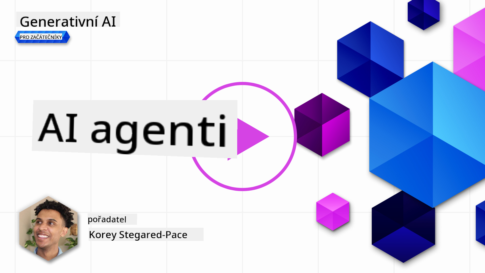
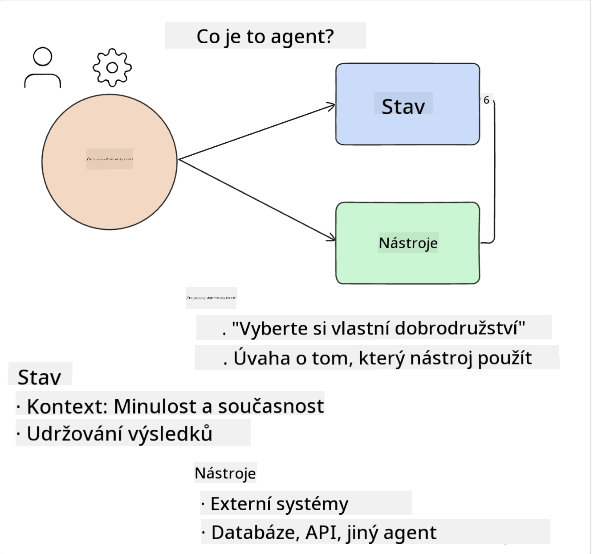
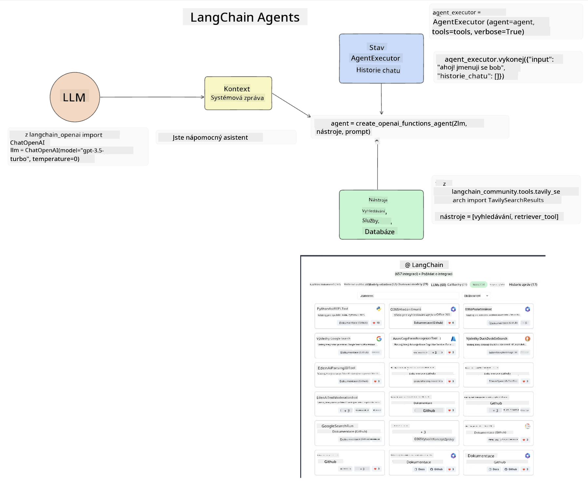
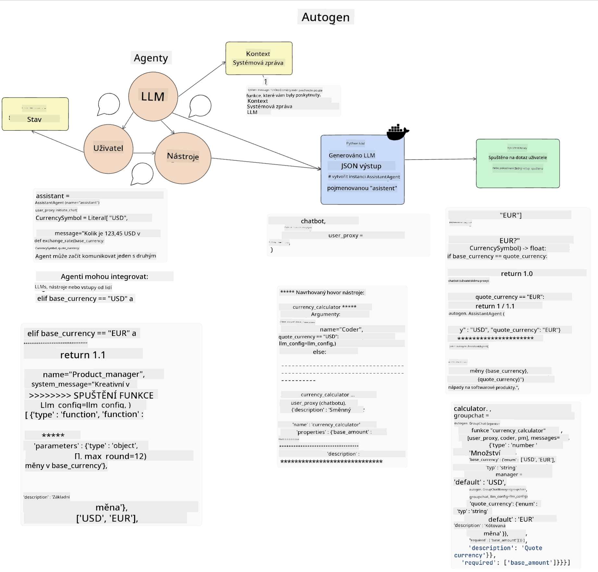
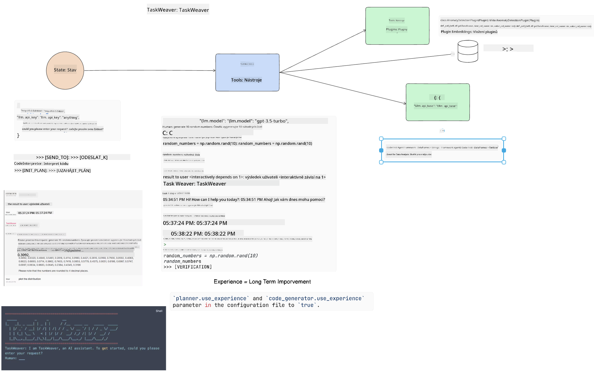

<!--
CO_OP_TRANSLATOR_METADATA:
{
  "original_hash": "11f03c81f190d9cbafd0f977dcbede6c",
  "translation_date": "2025-06-26T00:24:15+00:00",
  "source_file": "17-ai-agents/README.md",
  "language_code": "cs"
}
-->
[](https://aka.ms/gen-ai-lesson17-gh?WT.mc_id=academic-105485-koreyst)

## Úvod

AI Agenti představují vzrušující vývoj v oblasti Generativní AI, který umožňuje Velkým jazykovým modelům (LLMs) přechod z asistentů na agenty schopné provádět akce. Rámce AI Agentů umožňují vývojářům vytvářet aplikace, které poskytují LLMs přístup k nástrojům a správě stavu. Tyto rámce také zlepšují viditelnost, což uživatelům a vývojářům umožňuje sledovat akce plánované LLMs, čímž se zlepšuje řízení zkušeností.

Lekce pokryje následující oblasti:

- Pochopení, co je AI Agent - Co přesně je AI Agent?
- Prozkoumání čtyř různých rámců AI Agentů - Co je dělá jedinečnými?
- Aplikace těchto AI Agentů na různé případy použití - Kdy bychom měli použít AI Agenty?

## Cíle učení

Po absolvování této lekce budete schopni:

- Vysvětlit, co jsou AI Agenti a jak je lze použít.
- Mít porozumění rozdílům mezi některými populárními rámci AI Agentů a jak se liší.
- Pochopit, jak AI Agenti fungují, abyste s nimi mohli vytvářet aplikace.

## Co jsou AI Agenti?

AI Agenti jsou velmi vzrušující oblastí ve světě Generativní AI. S tímto nadšením někdy přichází zmatek v pojmech a jejich aplikaci. Abychom to udrželi jednoduché a zahrnuli většinu nástrojů, které se týkají AI Agentů, použijeme tuto definici:

AI Agenti umožňují Velkým jazykovým modelům (LLMs) provádět úkoly tím, že jim poskytují přístup ke **stavu** a **nástrojům**.



Pojďme si tyto pojmy definovat:

**Velké jazykové modely** - To jsou modely zmiňované v celém tomto kurzu, jako GPT-3.5, GPT-4, Llama-2, atd.

**Stav** - Toto se týká kontextu, ve kterém LLM pracuje. LLM využívá kontext svých minulých akcí a aktuální kontext, který řídí jeho rozhodování pro následné akce. Rámce AI Agentů umožňují vývojářům snadněji udržovat tento kontext.

**Nástroje** - Aby LLM dokončilo úkol, který uživatel požadoval a který LLM naplánovalo, potřebuje přístup k nástrojům. Příklady nástrojů mohou být databáze, API, externí aplikace nebo dokonce další LLM!

Tyto definice vám doufejme poskytnou dobrý základ pro další pochopení, jak jsou implementovány. Pojďme prozkoumat několik různých rámců AI Agentů:

## LangChain Agenti

[LangChain Agenti](https://python.langchain.com/docs/how_to/#agents?WT.mc_id=academic-105485-koreyst) je implementace definic, které jsme uvedli výše.

Pro správu **stavu** používá vestavěnou funkci zvanou `AgentExecutor`. Ta přijímá definované `agent` a `tools`, které jsou k dispozici.

`Agent Executor` také ukládá historii chatu, aby poskytl kontext chatu.



LangChain nabízí [katalog nástrojů](https://integrations.langchain.com/tools?WT.mc_id=academic-105485-koreyst), které lze importovat do vaší aplikace, ve které může LLM získat přístup. Tyto nástroje jsou vytvořeny komunitou a týmem LangChain.

Poté můžete tyto nástroje definovat a předat je `Agent Executor`.

Viditelnost je dalším důležitým aspektem při diskusi o AI Agentech. Je důležité, aby vývojáři aplikací rozuměli, který nástroj LLM používá a proč. Pro to tým v LangChain vyvinul LangSmith.

## AutoGen

Další rámec AI Agentů, o kterém budeme diskutovat, je [AutoGen](https://microsoft.github.io/autogen/?WT.mc_id=academic-105485-koreyst). Hlavní zaměření AutoGen je na konverzace. Agenti jsou jak **konverzační**, tak **přizpůsobitelní**.

**Konverzační -** LLMs mohou zahájit a pokračovat v konverzaci s jiným LLM, aby dokončili úkol. To se provádí vytvořením `AssistantAgents` a poskytnutím specifické systémové zprávy.

```python

autogen.AssistantAgent( name="Coder", llm_config=llm_config, ) pm = autogen.AssistantAgent( name="Product_manager", system_message="Creative in software product ideas.", llm_config=llm_config, )

```

**Přizpůsobitelní** - Agenti mohou být definováni nejen jako LLMs, ale také jako uživatel nebo nástroj. Jako vývojář můžete definovat `UserProxyAgent`, který je zodpovědný za interakci s uživatelem pro zpětnou vazbu při dokončování úkolu. Tato zpětná vazba může buď pokračovat v provádění úkolu, nebo jej zastavit.

```python
user_proxy = UserProxyAgent(name="user_proxy")
```

### Stav a Nástroje

Pro změnu a správu stavu generuje asistent Agent Python kód k dokončení úkolu.

Zde je příklad procesu:



#### LLM Definovaný se Systémovou Zprávou

```python
system_message="For weather related tasks, only use the functions you have been provided with. Reply TERMINATE when the task is done."
```

Tato systémová zpráva nasměruje tento konkrétní LLM, které funkce jsou relevantní pro jeho úkol. Pamatujte, že s AutoGen můžete mít více definovaných AssistantAgents s různými systémovými zprávami.

#### Chat je Zahájen Uživatel

```python
user_proxy.initiate_chat( chatbot, message="I am planning a trip to NYC next week, can you help me pick out what to wear? ", )

```

Tato zpráva od user_proxy (Člověk) je to, co zahájí proces Agenta prozkoumat možné funkce, které by měl vykonat.

#### Funkce je Vykonána

```bash
chatbot (to user_proxy):

***** Suggested tool Call: get_weather ***** Arguments: {"location":"New York City, NY","time_periond:"7","temperature_unit":"Celsius"} ******************************************************** --------------------------------------------------------------------------------

>>>>>>>> EXECUTING FUNCTION get_weather... user_proxy (to chatbot): ***** Response from calling function "get_weather" ***** 112.22727272727272 EUR ****************************************************************

```

Jakmile je počáteční chat zpracován, Agent pošle návrh nástroje, který má být volán. V tomto případě jde o funkci zvanou `get_weather`. Depending on your configuration, this function can be automatically executed and read by the Agent or can be executed based on user input.

You can find a list of [AutoGen code samples](https://microsoft.github.io/autogen/docs/Examples/?WT.mc_id=academic-105485-koreyst) to further explore how to get started building.

## Taskweaver

The next agent framework we will explore is [Taskweaver](https://microsoft.github.io/TaskWeaver/?WT.mc_id=academic-105485-koreyst). It is known as a "code-first" agent because instead of working strictly with `strings` , it can work with DataFrames in Python. This becomes extremely useful for data analysis and generation tasks. This can be things like creating graphs and charts or generating random numbers.

### State and Tools

To manage the state of the conversation, TaskWeaver uses the concept of a `Planner`. The `Planner` is a LLM that takes the request from the users and maps out the tasks that need to be completed to fulfill this request.

To complete the tasks the `Planner` is exposed to the collection of tools called `Plugins`. To mohou být Python třídy nebo obecný interpret kódu. Tyto pluginy jsou uloženy jako embeddings, aby LLM mohl lépe vyhledávat správný plugin.



Zde je příklad pluginu pro zpracování detekce anomálií:

```python
class AnomalyDetectionPlugin(Plugin): def __call__(self, df: pd.DataFrame, time_col_name: str, value_col_name: str):
```

Kód je ověřen před vykonáním. Další funkcí pro správu kontextu v Taskweaver je `experience`. Experience allows for the context of a conversation to be stored over to the long term in a YAML file. This can be configured so that the LLM improves over time on certain tasks given that it is exposed to prior conversations.

## JARVIS

The last agent framework we will explore is [JARVIS](https://github.com/microsoft/JARVIS?tab=readme-ov-file?WT.mc_id=academic-105485-koreyst). What makes JARVIS unique is that it uses an LLM to manage the `state` konverzace a `tools` jsou další AI modely. Každý z AI modelů jsou specializované modely, které provádějí určité úkoly, jako je detekce objektů, přepis nebo popis obrázků.


LLM, jakožto model pro obecné účely, přijímá požadavek od uživatele a identifikuje specifický úkol a jakékoliv argumenty/data, které jsou potřebné k dokončení úkolu.

```python
[{"task": "object-detection", "id": 0, "dep": [-1], "args": {"image": "e1.jpg" }}]
```

LLM pak formátuje požadavek tak, aby jej specializovaný AI model mohl interpretovat, například jako JSON. Jakmile AI model vrátí svou predikci na základě úkolu, LLM přijímá odpověď.

Pokud je pro dokončení úkolu potřeba více modelů, také interpretuje odpověď od těchto modelů, než je spojí, aby vygeneroval odpověď uživateli.

Příklad níže ukazuje, jak by to fungovalo, když uživatel požaduje popis a počet objektů na obrázku:

## Úkol

Pro pokračování ve svém učení o AI Agentech můžete stavět s AutoGen:

- Aplikaci, která simuluje obchodní schůzku s různými odděleními vzdělávacího startupu.
- Vytvořte systémové zprávy, které vedou LLMs k pochopení různých osobností a priorit a umožní uživateli předložit nový nápad na produkt.
- LLM by pak měl generovat následné otázky od každého oddělení, aby zdokonalil a vylepšil nápad na produkt a prezentaci.

## Učení zde nekončí, pokračujte v cestě

Po dokončení této lekce se podívejte na naši [sbírku učení Generativní AI](https://aka.ms/genai-collection?WT.mc_id=academic-105485-koreyst) a pokračujte v rozšiřování svých znalostí o Generativní AI!

**Prohlášení**:  
Tento dokument byl přeložen pomocí AI překladatelské služby [Co-op Translator](https://github.com/Azure/co-op-translator). I když se snažíme o přesnost, vezměte prosím na vědomí, že automatizované překlady mohou obsahovat chyby nebo nepřesnosti. Původní dokument v jeho rodném jazyce by měl být považován za autoritativní zdroj. Pro důležité informace je doporučen profesionální lidský překlad. Nejsme zodpovědní za jakékoli nedorozumění nebo nesprávné výklady vyplývající z použití tohoto překladu.