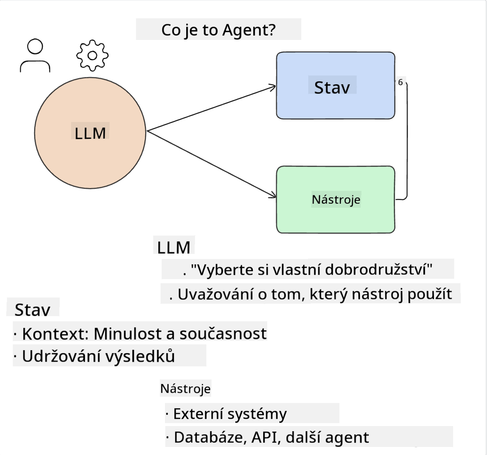
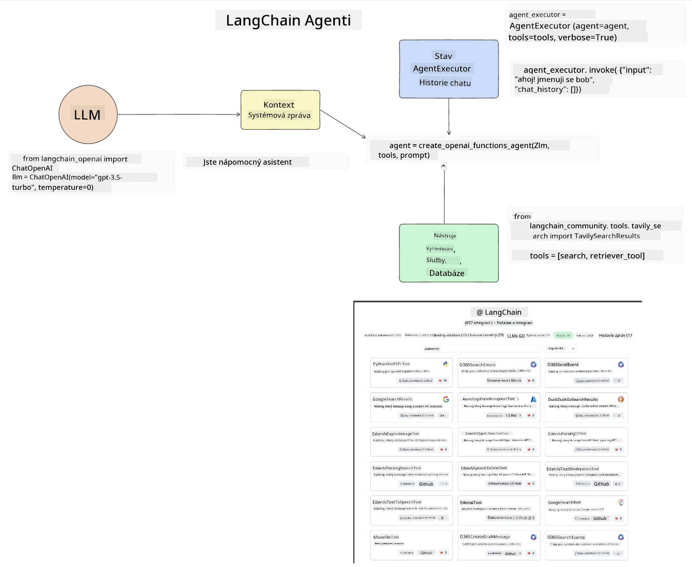
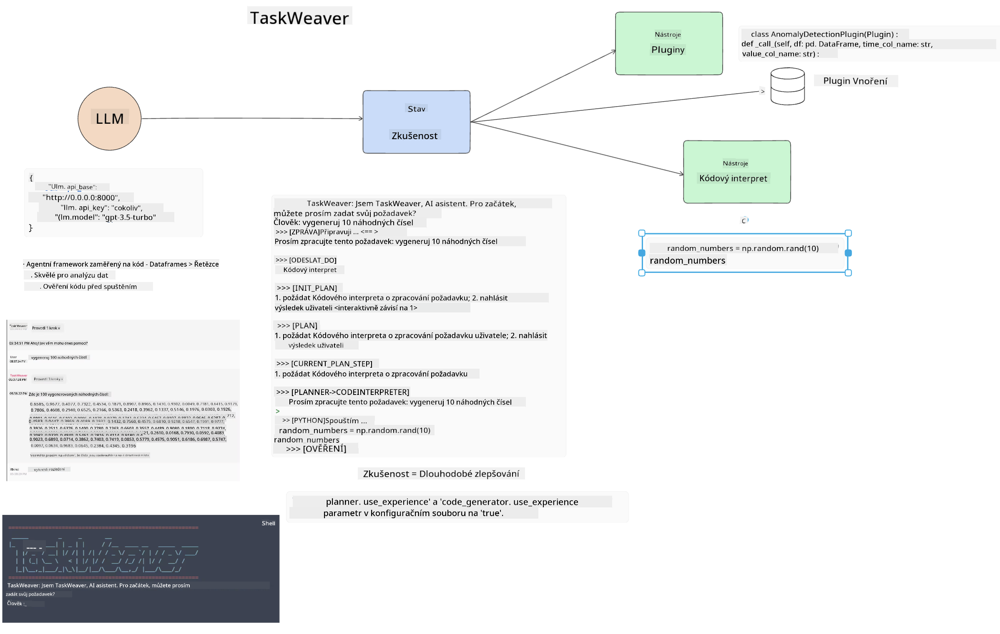
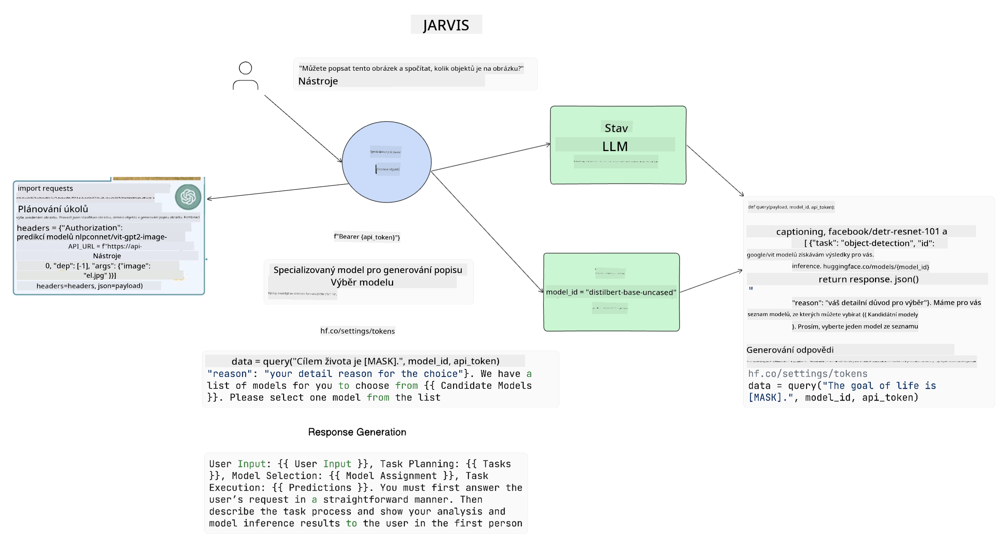

<!--
CO_OP_TRANSLATOR_METADATA:
{
  "original_hash": "11f03c81f190d9cbafd0f977dcbede6c",
  "translation_date": "2025-07-09T17:30:31+00:00",
  "source_file": "17-ai-agents/README.md",
  "language_code": "cs"
}
-->
[](https://aka.ms/gen-ai-lesson17-gh?WT.mc_id=academic-105485-koreyst)

## Úvod

AI agenti představují vzrušující vývoj v oblasti generativní AI, který umožňuje velkým jazykovým modelům (LLM) přejít z role asistentů na agenty schopné samostatně jednat. Rámce pro AI agenty umožňují vývojářům vytvářet aplikace, které dávají LLM přístup k nástrojům a správě stavu. Tyto rámce také zlepšují přehlednost, což umožňuje uživatelům a vývojářům sledovat akce plánované LLM, a tím zlepšují správu uživatelského zážitku.

Tato lekce se bude zabývat následujícími oblastmi:

- Pochopení, co je AI agent – Co přesně AI agent je?
- Prozkoumání čtyř různých rámců AI agentů – Čím jsou jedinečné?
- Aplikace těchto AI agentů na různé případy použití – Kdy bychom měli AI agenty používat?

## Cíle učení

Po absolvování této lekce budete schopni:

- Vysvětlit, co jsou AI agenti a jak je lze využít.
- Porozumět rozdílům mezi některými populárními rámci AI agentů a jak se liší.
- Pochopit, jak AI agenti fungují, abyste s nimi mohli vytvářet aplikace.

## Co jsou AI agenti?

AI agenti jsou velmi vzrušující oblastí ve světě generativní AI. S tímto nadšením však někdy přichází i zmatek ohledně pojmů a jejich použití. Abychom to zjednodušili a zahrnuli většinu nástrojů, které se označují jako AI agenti, použijeme tuto definici:

AI agenti umožňují velkým jazykovým modelům (LLM) vykonávat úkoly tím, že jim dávají přístup ke **stavu** a **nástrojům**.



Pojďme si tyto pojmy definovat:

**Velké jazykové modely** – Jsou to modely, o kterých se v tomto kurzu mluví, například GPT-3.5, GPT-4, Llama-2 a další.

**Stav** – Označuje kontext, ve kterém LLM pracuje. LLM využívá kontext svých předchozích akcí a aktuální kontext, který řídí jeho rozhodování o dalších krocích. Rámce AI agentů umožňují vývojářům tento kontext snadněji udržovat.

**Nástroje** – Aby LLM mohl dokončit úkol, který uživatel požaduje a který LLM naplánoval, potřebuje přístup k nástrojům. Příklady nástrojů mohou být databáze, API, externí aplikace nebo dokonce jiný LLM!

Tyto definice by vám měly poskytnout dobrý základ pro další pochopení implementace. Pojďme prozkoumat několik různých rámců AI agentů:

## LangChain Agents

[LangChain Agents](https://python.langchain.com/docs/how_to/#agents?WT.mc_id=academic-105485-koreyst) je implementace výše uvedených definic.

Pro správu **stavu** používá vestavěnou funkci nazvanou `AgentExecutor`. Ta přijímá definovaného `agenta` a dostupné `nástroje`.

`AgentExecutor` také ukládá historii chatu, aby poskytl kontext konverzace.



LangChain nabízí [katalog nástrojů](https://integrations.langchain.com/tools?WT.mc_id=academic-105485-koreyst), které lze importovat do vaší aplikace a ke kterým může LLM získat přístup. Tyto nástroje vytváří komunita i tým LangChain.

Tyto nástroje pak můžete definovat a předat `AgentExecutor`.

Přehlednost je dalším důležitým aspektem při práci s AI agenty. Je důležité, aby vývojáři aplikací rozuměli, který nástroj LLM používá a proč. Proto tým LangChain vyvinul LangSmith.

## AutoGen

Dalším rámcem AI agentů, který si představíme, je [AutoGen](https://microsoft.github.io/autogen/?WT.mc_id=academic-105485-koreyst). Hlavním zaměřením AutoGen jsou konverzace. Agenti jsou jak **konverzační**, tak **přizpůsobitelní**.

**Konverzační** – LLM mohou zahájit a pokračovat v konverzaci s jiným LLM, aby dokončili úkol. To se provádí vytvořením `AssistantAgents` a přiřazením specifické systémové zprávy.

```python

autogen.AssistantAgent( name="Coder", llm_config=llm_config, ) pm = autogen.AssistantAgent( name="Product_manager", system_message="Creative in software product ideas.", llm_config=llm_config, )

```

**Přizpůsobitelní** – Agenti nemusí být definováni pouze jako LLM, ale mohou být i uživatel nebo nástroj. Jako vývojář můžete definovat `UserProxyAgent`, který je zodpovědný za interakci s uživatelem a získávání zpětné vazby při plnění úkolu. Tato zpětná vazba může buď pokračovat v provádění úkolu, nebo jej zastavit.

```python
user_proxy = UserProxyAgent(name="user_proxy")
```

### Stav a nástroje

Pro změnu a správu stavu generuje asistent Agent Python kód k dokončení úkolu.

Zde je příklad tohoto procesu:


#### LLM definovaný systémovou zprávou

```python
system_message="For weather related tasks, only use the functions you have been provided with. Reply TERMINATE when the task is done."
```

Tato systémová zpráva určuje, které funkce jsou pro daný LLM relevantní. Pamatujte, že v AutoGen můžete mít více definovaných AssistantAgents s různými systémovými zprávami.

#### Konverzace je zahájena uživatelem

```python
user_proxy.initiate_chat( chatbot, message="I am planning a trip to NYC next week, can you help me pick out what to wear? ", )

```

Tato zpráva od user_proxy (člověka) spustí proces, kdy Agent prozkoumá možné funkce, které by měl vykonat.

#### Funkce je vykonána

```bash
chatbot (to user_proxy):

***** Suggested tool Call: get_weather ***** Arguments: {"location":"New York City, NY","time_periond:"7","temperature_unit":"Celsius"} ******************************************************** --------------------------------------------------------------------------------

>>>>>>>> EXECUTING FUNCTION get_weather... user_proxy (to chatbot): ***** Response from calling function "get_weather" ***** 112.22727272727272 EUR ****************************************************************

```

Jakmile je počáteční zpráva zpracována, Agent navrhne nástroj k zavolání. V tomto případě je to funkce `get_weather`. Podle vaší konfigurace může být tato funkce automaticky vykonána a její výsledek přečten Agentem, nebo může být spuštěna na základě vstupu uživatele.

Pro další průzkum, jak začít s vývojem, najdete seznam [AutoGen ukázek kódu](https://microsoft.github.io/autogen/docs/Examples/?WT.mc_id=academic-105485-koreyst).

## Taskweaver

Dalším rámcem agentů, který prozkoumáme, je [Taskweaver](https://microsoft.github.io/TaskWeaver/?WT.mc_id=academic-105485-koreyst). Je známý jako „code-first“ agent, protože místo práce pouze s `řetězci` může pracovat s DataFrames v Pythonu. To je velmi užitečné pro úkoly analýzy dat a generování. Může jít například o vytváření grafů a diagramů nebo generování náhodných čísel.

### Stav a nástroje

Pro správu stavu konverzace používá TaskWeaver koncept `Planner`. `Planner` je LLM, který přijímá požadavky uživatelů a rozplánovává úkoly, které je třeba splnit k jejich vyřízení.

K dokončení úkolů má `Planner` přístup ke sbírce nástrojů nazvaných `Plugins`. Mohou to být Python třídy nebo obecný interpret kódu. Tyto pluginy jsou uloženy jako embeddingy, aby LLM mohl lépe vyhledávat správný plugin.



Zde je příklad pluginu pro detekci anomálií:

```python
class AnomalyDetectionPlugin(Plugin): def __call__(self, df: pd.DataFrame, time_col_name: str, value_col_name: str):
```

Kód je před spuštěním ověřen. Další funkcí pro správu kontextu v Taskweaver je `experience`. Experience umožňuje ukládat kontext konverzace dlouhodobě do YAML souboru. To lze nastavit tak, aby se LLM v průběhu času zlepšoval v určitých úkolech na základě předchozích konverzací.

## JARVIS

Posledním rámcem agentů, který si představíme, je [JARVIS](https://github.com/microsoft/JARVIS?tab=readme-ov-file?WT.mc_id=academic-105485-koreyst). Co dělá JARVIS jedinečným, je to, že používá LLM ke správě `stavu` konverzace a `nástroje` jsou jiné AI modely. Každý z těchto AI modelů je specializovaný na určité úkoly, jako je detekce objektů, přepis nebo popis obrázků.



LLM, jako model obecného určení, přijímá požadavek od uživatele, identifikuje konkrétní úkol a jakékoliv argumenty/data potřebné k jeho splnění.

```python
[{"task": "object-detection", "id": 0, "dep": [-1], "args": {"image": "e1.jpg" }}]
```

LLM pak formátuje požadavek tak, aby jej specializovaný AI model mohl interpretovat, například ve formátu JSON. Jakmile AI model vrátí svůj výsledek na základě úkolu, LLM obdrží odpověď.

Pokud je k dokončení úkolu potřeba více modelů, LLM také interpretuje odpovědi těchto modelů, než je spojí a vytvoří odpověď pro uživatele.

Následující příklad ukazuje, jak by to fungovalo, když uživatel požaduje popis a počet objektů na obrázku:

## Zadání

Pro pokračování ve studiu AI agentů můžete s AutoGen vytvořit:

- Aplikaci, která simuluje obchodní schůzku různých oddělení vzdělávacího startupu.
- Vytvořit systémové zprávy, které pomohou LLM pochopit různé role a priority a umožní uživateli představit nový produkt.
- LLM by pak měl generovat doplňující otázky od jednotlivých oddělení, aby se návrh a produktová myšlenka zdokonalily.

## Učení zde nekončí, pokračujte na své cestě

Po dokončení této lekce si prohlédněte naši [kolekci Generative AI Learning](https://aka.ms/genai-collection?WT.mc_id=academic-105485-koreyst) a pokračujte ve zvyšování svých znalostí v oblasti generativní AI!

**Prohlášení o vyloučení odpovědnosti**:  
Tento dokument byl přeložen pomocí AI překladatelské služby [Co-op Translator](https://github.com/Azure/co-op-translator). I když usilujeme o přesnost, mějte prosím na paměti, že automatizované překlady mohou obsahovat chyby nebo nepřesnosti. Původní dokument v jeho mateřském jazyce by měl být považován za autoritativní zdroj. Pro důležité informace se doporučuje profesionální lidský překlad. Nejsme odpovědní za jakékoliv nedorozumění nebo nesprávné výklady vyplývající z použití tohoto překladu.