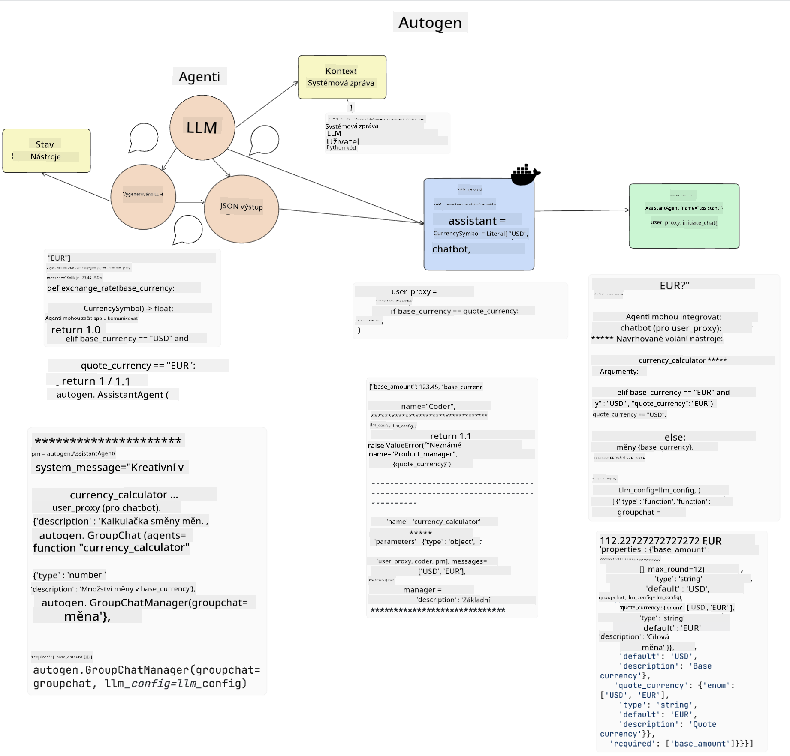

<!--
CO_OP_TRANSLATOR_METADATA:
{
  "original_hash": "8e8d1f6a63da606af7176a87ff8e92b6",
  "translation_date": "2025-10-17T21:44:29+00:00",
  "source_file": "17-ai-agents/README.md",
  "language_code": "cs"
}
-->
[](https://youtu.be/yAXVW-lUINc?si=bOtW9nL6jc3XJgOM)

## Úvod

AI agenti představují vzrušující vývoj v oblasti generativní AI, který umožňuje velkým jazykovým modelům (LLMs) přejít od role asistentů k agentům schopným provádět akce. Rámce AI agentů umožňují vývojářům vytvářet aplikace, které poskytují LLMs přístup k nástrojům a správě stavu. Tyto rámce také zlepšují přehlednost, což uživatelům a vývojářům umožňuje sledovat plánované akce LLMs a tím zlepšovat správu uživatelského zážitku.

Tato lekce se zaměří na následující oblasti:

- Porozumění tomu, co je AI agent - Co přesně je AI agent?
- Prozkoumání čtyř různých rámců AI agentů - Čím jsou jedinečné?
- Použití těchto AI agentů v různých případech - Kdy bychom měli AI agenty používat?

## Cíle učení

Po absolvování této lekce budete schopni:

- Vysvětlit, co jsou AI agenti a jak je lze využít.
- Porozumět rozdílům mezi některými populárními rámci AI agentů a jejich odlišnostem.
- Pochopit, jak AI agenti fungují, abyste mohli s jejich pomocí vytvářet aplikace.

## Co jsou AI agenti?

AI agenti jsou velmi vzrušující oblastí ve světě generativní AI. S tímto nadšením však někdy přichází i zmatek ohledně pojmů a jejich použití. Abychom věci zjednodušili a zahrnuli většinu nástrojů, které se označují jako AI agenti, použijeme následující definici:

AI agenti umožňují velkým jazykovým modelům (LLMs) vykonávat úkoly tím, že jim poskytují přístup ke **stavu** a **nástrojům**.


Definujme si tyto pojmy:

**Velké jazykové modely** - Jedná se o modely, o kterých se v tomto kurzu hovoří, jako například GPT-3.5, GPT-4, Llama-2 atd.

**Stav** - Tím se rozumí kontext, ve kterém LLM pracuje. LLM využívá kontext svých minulých akcí a aktuálního stavu, což mu pomáhá při rozhodování o dalších krocích. Rámce AI agentů umožňují vývojářům tento kontext snadněji udržovat.

**Nástroje** - Aby LLM mohl splnit úkol, který mu uživatel zadal a který si naplánoval, potřebuje přístup k nástrojům. Příklady nástrojů mohou být databáze, API, externí aplikace nebo dokonce jiný LLM!

Tyto definice by vám měly poskytnout dobrý základ pro další postup, když se podíváme na jejich implementaci. Prozkoumejme několik různých rámců AI agentů:

## LangChain Agents

[LangChain Agents](https://python.langchain.com/docs/how_to/#agents?WT.mc_id=academic-105485-koreyst) je implementace výše uvedených definic.

Pro správu **stavu** používá vestavěnou funkci nazvanou `AgentExecutor`. Ta přijímá definovaného `agenta` a dostupné `nástroje`.

`AgentExecutor` také ukládá historii chatu, aby poskytl kontext chatu.


LangChain nabízí [katalog nástrojů](https://integrations.langchain.com/tools?WT.mc_id=academic-105485-koreyst), které lze importovat do vaší aplikace, kde k nim LLM může získat přístup. Tyto nástroje jsou vytvořeny komunitou a týmem LangChain.

Tyto nástroje můžete definovat a předat je `AgentExecutor`.

Viditelnost je dalším důležitým aspektem při diskusi o AI agentech. Je důležité, aby vývojáři aplikací rozuměli tomu, který nástroj LLM používá a proč. K tomu tým LangChain vyvinul LangSmith.

## AutoGen

Dalším rámcem AI agentů, který budeme diskutovat, je [AutoGen](https://microsoft.github.io/autogen/?WT.mc_id=academic-105485-koreyst). Hlavním zaměřením AutoGen jsou konverzace. Agenti jsou jak **konverzační**, tak **přizpůsobitelní**.

**Konverzační -** LLMs mohou zahájit a pokračovat v konverzaci s jiným LLM, aby splnily úkol. To se provádí vytvořením `AssistantAgents` a přiřazením specifické systémové zprávy.

```python

autogen.AssistantAgent( name="Coder", llm_config=llm_config, ) pm = autogen.AssistantAgent( name="Product_manager", system_message="Creative in software product ideas.", llm_config=llm_config, )

```

**Přizpůsobitelní** - Agenti mohou být definováni nejen jako LLMs, ale také jako uživatelé nebo nástroje. Jako vývojář můžete definovat `UserProxyAgent`, který je zodpovědný za interakci s uživatelem a získávání zpětné vazby při plnění úkolu. Tato zpětná vazba může buď pokračovat v provádění úkolu, nebo jej zastavit.

```python
user_proxy = UserProxyAgent(name="user_proxy")
```

### Stav a nástroje

Pro změnu a správu stavu generuje asistent Agent Python kód k dokončení úkolu.

Zde je příklad procesu:



#### LLM definovaný systémovou zprávou

```python
system_message="For weather related tasks, only use the functions you have been provided with. Reply TERMINATE when the task is done."
```

Tato systémová zpráva určuje konkrétnímu LLM, které funkce jsou relevantní pro jeho úkol. Pamatujte, že s AutoGen můžete mít více definovaných AssistantAgents s různými systémovými zprávami.

#### Chat zahájen uživatelem

```python
user_proxy.initiate_chat( chatbot, message="I am planning a trip to NYC next week, can you help me pick out what to wear? ", )

```

Tato zpráva od user_proxy (člověka) zahájí proces, kdy agent prozkoumá možné funkce, které by měl vykonat.

#### Funkce je vykonána

```bash
chatbot (to user_proxy):

***** Suggested tool Call: get_weather ***** Arguments: {"location":"New York City, NY","time_periond:"7","temperature_unit":"Celsius"} ******************************************************** --------------------------------------------------------------------------------

>>>>>>>> EXECUTING FUNCTION get_weather... user_proxy (to chatbot): ***** Response from calling function "get_weather" ***** 112.22727272727272 EUR ****************************************************************

```

Jakmile je počáteční chat zpracován, agent navrhne nástroj, který by měl být použit. V tomto případě se jedná o funkci nazvanou `get_weather`. V závislosti na vaší konfiguraci může být tato funkce automaticky vykonána a přečtena agentem, nebo může být vykonána na základě vstupu uživatele.

Seznam [AutoGen ukázek kódu](https://microsoft.github.io/autogen/docs/Examples/?WT.mc_id=academic-105485-koreyst) vám umožní dále prozkoumat, jak začít s budováním.

## Taskweaver

Dalším rámcem agentů, který prozkoumáme, je [Taskweaver](https://microsoft.github.io/TaskWeaver/?WT.mc_id=academic-105485-koreyst). Je známý jako "code-first" agent, protože místo práce výhradně s `řetězci` může pracovat s DataFrames v Pythonu. To je velmi užitečné pro úkoly analýzy dat a generování. Může se jednat například o vytváření grafů a diagramů nebo generování náhodných čísel.

### Stav a nástroje

Pro správu stavu konverzace používá TaskWeaver koncept `Plánovače`. `Plánovač` je LLM, který přijímá požadavek od uživatele a mapuje úkoly, které je třeba splnit, aby byl požadavek splněn.

Pro splnění úkolů má `Plánovač` přístup ke sbírce nástrojů nazvané `Pluginy`. Tyto pluginy mohou být Python třídy nebo obecný interpret kódu. Pluginy jsou uloženy jako embeddings, aby LLM mohl lépe vyhledávat správný plugin.


Zde je příklad pluginu pro detekci anomálií:

```python
class AnomalyDetectionPlugin(Plugin): def __call__(self, df: pd.DataFrame, time_col_name: str, value_col_name: str):
```

Kód je před vykonáním ověřen. Další funkcí pro správu kontextu v Taskweaver je `zkušenost`. Zkušenost umožňuje uchovávat kontext konverzace dlouhodobě v YAML souboru. To lze nakonfigurovat tak, aby se LLM zlepšoval v určitých úkolech na základě předchozích konverzací.

## JARVIS

Posledním rámcem agentů, který prozkoumáme, je [JARVIS](https://github.com/microsoft/JARVIS?tab=readme-ov-file?WT.mc_id=academic-105485-koreyst). Co činí JARVIS jedinečným, je to, že používá LLM k řízení `stavu` konverzace a `nástroje` jsou jiné AI modely. Každý z AI modelů je specializovaný na určité úkoly, jako je detekce objektů, přepis nebo popis obrázků.


LLM, jako obecný model, přijímá požadavek od uživatele a identifikuje konkrétní úkol a jaké argumenty/data jsou potřebné k jeho splnění.

```python
[{"task": "object-detection", "id": 0, "dep": [-1], "args": {"image": "e1.jpg" }}]
```

LLM poté formátuje požadavek způsobem, který specializovaný AI model dokáže interpretovat, například jako JSON. Jakmile AI model vrátí svou predikci na základě úkolu, LLM přijme odpověď.

Pokud je k dokončení úkolu zapotřebí více modelů, LLM také interpretuje odpovědi od těchto modelů, než je spojí dohromady a vytvoří odpověď pro uživatele.

Níže je uveden příklad, jak by to fungovalo, když uživatel požaduje popis a počet objektů na obrázku:

## Úkol

Pro pokračování ve studiu AI agentů můžete vytvořit aplikaci s AutoGen:

- Aplikaci, která simuluje obchodní schůzku různých oddělení vzdělávacího startupu.
- Vytvořte systémové zprávy, které pomohou LLMs pochopit různé role a priority, a umožněte uživateli představit nový produktový nápad.
- LLM by měl poté generovat následné otázky od každého oddělení, aby nápad na produkt a prezentaci dále rozvinul a zlepšil.

## Učení nekončí zde, pokračujte v cestě

Po dokončení této lekce se podívejte na naši [sbírku vzdělávacích materiálů o generativní AI](https://aka.ms/genai-collection?WT.mc_id=academic-105485-koreyst), abyste si dále rozšířili své znalosti o generativní AI!

---

**Prohlášení**:  
Tento dokument byl přeložen pomocí služby AI pro překlad [Co-op Translator](https://github.com/Azure/co-op-translator). I když se snažíme o přesnost, mějte prosím na paměti, že automatizované překlady mohou obsahovat chyby nebo nepřesnosti. Původní dokument v jeho původním jazyce by měl být považován za autoritativní zdroj. Pro důležité informace se doporučuje profesionální lidský překlad. Neodpovídáme za žádná nedorozumění nebo nesprávné interpretace vyplývající z použití tohoto překladu.