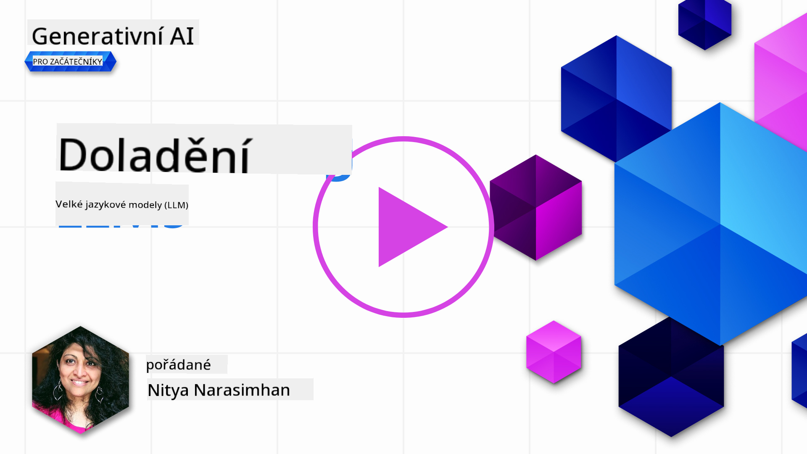
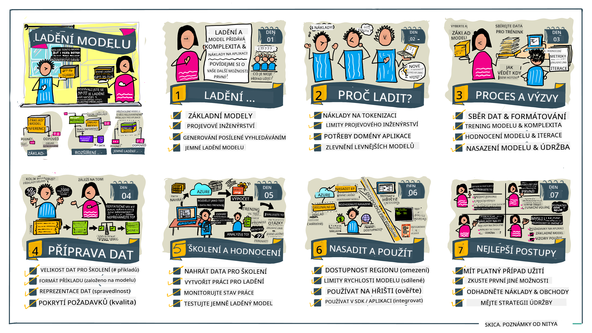

<!--
CO_OP_TRANSLATOR_METADATA:
{
  "original_hash": "68664f7e754a892ae1d8d5e2b7bd2081",
  "translation_date": "2025-05-20T07:56:55+00:00",
  "source_file": "18-fine-tuning/README.md",
  "language_code": "cs"
}
-->

# Vyladění vašeho LLM

Používání velkých jazykových modelů pro budování generativních AI aplikací přináší nové výzvy. Klíčovým problémem je zajištění kvality odpovědí (přesnost a relevance) v obsahu generovaném modelem pro daný požadavek uživatele. V předchozích lekcích jsme diskutovali o technikách jako návrh promptů a generování s podporou vyhledávání, které se snaží řešit problém _upravováním vstupu promptu_ do existujícího modelu.

V dnešní lekci se zabýváme třetí technikou, **vyladěním**, která se snaží řešit výzvu _přeškolením samotného modelu_ s dodatečnými daty. Pojďme se ponořit do podrobností.

## Cíle učení

Tato lekce zavádí koncept vyladění pro předtrénované jazykové modely, zkoumá výhody a výzvy tohoto přístupu a poskytuje rady, kdy a jak použít vyladění k zlepšení výkonu vašich generativních AI modelů.

Na konci této lekce byste měli být schopni odpovědět na následující otázky:

- Co je vyladění pro jazykové modely?
- Kdy a proč je vyladění užitečné?
- Jak mohu vyladit předtrénovaný model?
- Jaká jsou omezení vyladění?

Připraveni? Pojďme začít.

## Ilustrovaný průvodce

Chcete získat celkový přehled o tom, co budeme probírat, než se do toho ponoříme? Podívejte se na tento ilustrovaný průvodce, který popisuje cestu učení pro tuto lekci - od učení základních konceptů a motivace pro vyladění, po porozumění procesu a osvědčeným postupům pro provádění úkolu vyladění. Toto je fascinující téma k prozkoumání, takže nezapomeňte se podívat na stránku [Zdroje](./RESOURCES.md?WT.mc_id=academic-105485-koreyst) pro další odkazy, které podpoří vaši samostatně vedenou cestu učení!

## Co je vyladění pro jazykové modely?

Podle definice jsou velké jazykové modely _předtrénované_ na velkém množství textu získaného z různých zdrojů včetně internetu. Jak jsme se naučili v předchozích lekcích, potřebujeme techniky jako _návrh promptů_ a _generování s podporou vyhledávání_, abychom zlepšili kvalitu odpovědí modelu na otázky uživatelů ("promptů").

Oblíbenou technikou návrhu promptů je dát modelu více vodítek o tom, co se očekává v odpovědi, buď poskytnutím _instrukcí_ (explicitní vedení), nebo _dáním několika příkladů_ (implicitní vedení). To se označuje jako _few-shot learning_, ale má to dvě omezení:

- Limity tokenů modelu mohou omezit počet příkladů, které můžete poskytnout, a omezit efektivitu.
- Náklady na tokeny modelu mohou ztížit přidání příkladů ke každému promptu a omezit flexibilitu.

Vyladění je běžná praxe v systémech strojového učení, kde vezmeme předtrénovaný model a přeškolíme ho s novými daty, abychom zlepšili jeho výkon na konkrétním úkolu. V kontextu jazykových modelů můžeme vyladit předtrénovaný model _s kurátorskou sadou příkladů pro daný úkol nebo aplikační doménu_, abychom vytvořili **vlastní model**, který může být přesnější a relevantnější pro tento konkrétní úkol nebo doménu. Vedlejším přínosem vyladění je, že může také snížit počet potřebných příkladů pro few-shot learning - snižující použití tokenů a související náklady.

## Kdy a proč bychom měli modely vyladit?

V _tomto_ kontextu, když mluvíme o vyladění, máme na mysli **supervizované** vyladění, kde se přeškolení provádí **přidáním nových dat**, která nebyla součástí původního tréninkového datového souboru. To se liší od nesupervizovaného přístupu vyladění, kde je model přeškolen na původních datech, ale s různými hyperparametry.

Klíčovou věcí, kterou si pamatovat, je, že vyladění je pokročilá technika, která vyžaduje určitou úroveň odbornosti, aby bylo dosaženo požadovaných výsledků. Pokud je provedeno nesprávně, nemusí poskytnout očekávaná zlepšení a může dokonce zhoršit výkon modelu pro vaši cílovou doménu.

Takže, než se naučíte "jak" vyladit jazykové modely, potřebujete vědět "proč" byste se měli touto cestou vydat a "kdy" začít proces vyladění. Začněte kladením si těchto otázek:

- **Použití**: Jaký je váš _případ použití_ pro vyladění? Jaký aspekt současného předtrénovaného modelu chcete vylepšit?
- **Alternativy**: Zkusili jste _jiné techniky_ k dosažení požadovaných výsledků? Použijte je k vytvoření základní linie pro srovnání.
  - Návrh promptů: Vyzkoušejte techniky jako few-shot prompting s příklady relevantních odpovědí na prompt. Vyhodnoťte kvalitu odpovědí.
  - Generování s podporou vyhledávání: Zkuste doplnit prompty výsledky dotazů získaných vyhledáváním ve vašich datech. Vyhodnoťte kvalitu odpovědí.
- **Náklady**: Identifikovali jste náklady na vyladění?
  - Laditelnost - je předtrénovaný model k dispozici pro vyladění?
  - Úsilí - pro přípravu tréninkových dat, hodnocení a zdokonalování modelu.
  - Výpočetní výkon - pro spuštění úloh vyladění a nasazení vyladěného modelu.
  - Data - přístup k dostatečnému množství kvalitních příkladů pro vyladění.
- **Přínosy**: Potvrdili jste přínosy pro vyladění?
  - Kvalita - překonal vyladěný model základní linii?
  - Náklady - snižuje použití tokenů zjednodušením promptů?
  - Rozšiřitelnost - můžete přizpůsobit základní model pro nové domény?

Odpovědí na tyto otázky byste měli být schopni rozhodnout, zda je vyladění správným přístupem pro váš případ použití. Ideálně je přístup platný pouze tehdy, pokud přínosy převyšují náklady. Jakmile se rozhodnete pokračovat, je čas přemýšlet o _tom, jak_ můžete vyladit předtrénovaný model.

Chcete získat více informací o rozhodovacím procesu? Podívejte se na [Vyladit nebo nevyladit](https://www.youtube.com/watch?v=0Jo-z-MFxJs)

## Jak můžeme vyladit předtrénovaný model?

K vyladění předtrénovaného modelu potřebujete mít:

- předtrénovaný model k vyladění
- datový soubor pro vyladění
- tréninkové prostředí pro spuštění úlohy vyladění
- hostingové prostředí pro nasazení vyladěného modelu

## Vyladění v praxi

Následující zdroje poskytují podrobné návody, které vás provedou reálným příkladem použití vybraného modelu s kurátorským datovým souborem. Pro práci s těmito návody potřebujete účet u konkrétního poskytovatele, spolu s přístupem k příslušnému modelu a datovým souborům.

| Poskytovatel | Návod                                                                                                                                                                       | Popis                                                                                                                                                                                                                                                                                                                                                                                                                        |
| ------------ | --------------------------------------------------------------------------------------------------------------------------------------------------------------------------- | ---------------------------------------------------------------------------------------------------------------------------------------------------------------------------------------------------------------------------------------------------------------------------------------------------------------------------------------------------------------------------------------------------------------------------------- |
| OpenAI       | [Jak vyladit chatovací modely](https://github.com/openai/openai-cookbook/blob/main/examples/How_to_finetune_chat_models.ipynb?WT.mc_id=academic-105485-koreyst)                | Naučte se vyladit `gpt-35-turbo` pro konkrétní doménu ("asistent receptů") přípravou tréninkových dat, spuštěním úlohy vyladění a použitím vyladěného modelu pro inferenci.                                                                                                                                                                                                                                              |
| Azure OpenAI | [Návod na vyladění GPT 3.5 Turbo](https://learn.microsoft.com/azure/ai-services/openai/tutorials/fine-tune?tabs=python-new%2Ccommand-line?WT.mc_id=academic-105485-koreyst) | Naučte se vyladit model `gpt-35-turbo-0613` **na Azure** tím, že podniknete kroky k vytvoření a nahrání tréninkových dat, spuštění úlohy vyladění. Nasadit a použít nový model.                                                                                                                                                                                                                                                                 |
| Hugging Face | [Vyladění LLMs s Hugging Face](https://www.philschmid.de/fine-tune-llms-in-2024-with-trl?WT.mc_id=academic-105485-koreyst)                                               | Tento blogový příspěvek vás provede vyladěním _otevřeného LLM_ (např. `CodeLlama 7B`) pomocí knihovny [transformers](https://huggingface.co/docs/transformers/index?WT.mc_id=academic-105485-koreyst) a [Transformers Reinforcement Learning (TRL)](https://huggingface.co/docs/trl/index?WT.mc_id=academic-105485-koreyst) s otevřenými [datovými soubory](https://huggingface.co/docs/datasets/index?WT.mc_id=academic-105485-koreyst) na Hugging Face. |
|              |                                                                                                                                                                                |                                                                                                                                                                                                                                                                                                                                                                                                                                    |
| 🤗 AutoTrain | [Vyladění LLMs s AutoTrain](https://github.com/huggingface/autotrain-advanced/?WT.mc_id=academic-105485-koreyst)                                                         | AutoTrain (nebo AutoTrain Advanced) je python knihovna vyvinutá Hugging Face, která umožňuje vyladění pro mnoho různých úkolů včetně vyladění LLM. AutoTrain je řešení bez kódu a vyladění může být provedeno ve vašem vlastním cloudu, na Hugging Face Spaces nebo lokálně. Podporuje jak webové rozhraní GUI, CLI, tak i trénink prostřednictvím konfiguračních souborů yaml.                                                                               |
|              |                                                                                                                                                                                |                                                                                                                                                                                                                                                                                                                                                                                                                                    |

## Zadání

Vyberte si jeden z výše uvedených návodů a projděte si ho. _Můžeme replikovat verzi těchto návodů v Jupyter Noteboocích v tomto repozitáři pouze pro referenci. Prosím, použijte přímo původní zdroje, abyste získali nejnovější verze_.

## Skvělá práce! Pokračujte ve svém učení.

Po dokončení této lekce se podívejte na naši [kolekci učení o generativní AI](https://aka.ms/genai-collection?WT.mc_id=academic-105485-koreyst), abyste pokračovali v rozšiřování svých znalostí o generativní AI!

Gratulujeme!! Dokončili jste poslední lekci ze série v2 tohoto kurzu! Nepřestávejte se učit a tvořit. \*\*Podívejte se na stránku [ZDROJE](RESOURCES.md?WT.mc_id=academic-105485-koreyst) pro seznam dalších návrhů jen na toto téma.

Naše série lekcí v1 byla také aktualizována s více úkoly a koncepty. Tak si dejte chvilku na osvěžení svých znalostí - a prosím [sdílejte své otázky a zpětnou vazbu](https://github.com/microsoft/generative-ai-for-beginners/issues?WT.mc_id=academic-105485-koreyst), abyste nám pomohli zlepšit tyto lekce pro komunitu.

**Zřeknutí se odpovědnosti**:  
Tento dokument byl přeložen pomocí služby pro automatizovaný překlad [Co-op Translator](https://github.com/Azure/co-op-translator). I když se snažíme o přesnost, mějte prosím na paměti, že automatizované překlady mohou obsahovat chyby nebo nepřesnosti. Původní dokument v jeho rodném jazyce by měl být považován za autoritativní zdroj. Pro důležité informace se doporučuje profesionální lidský překlad. Nejsme odpovědní za jakékoli nedorozumění nebo nesprávné interpretace vyplývající z použití tohoto překladu.