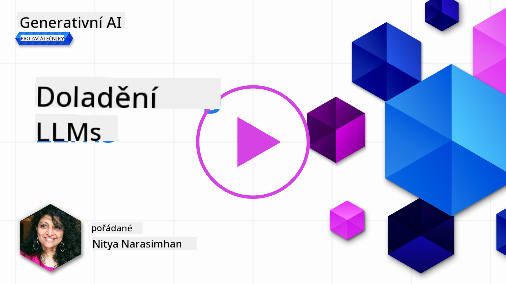
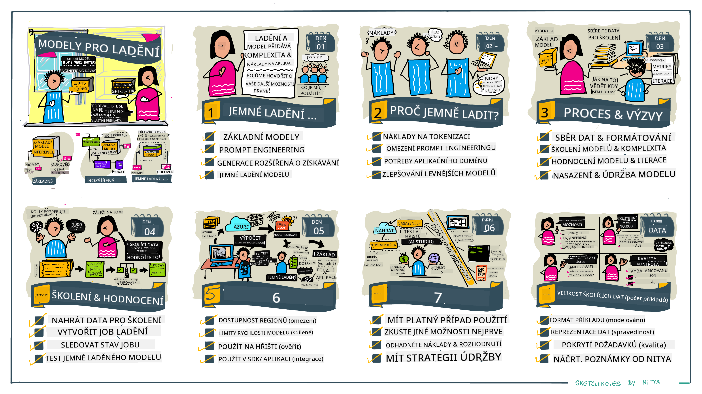

<!--
CO_OP_TRANSLATOR_METADATA:
{
  "original_hash": "68664f7e754a892ae1d8d5e2b7bd2081",
  "translation_date": "2025-07-09T17:48:44+00:00",
  "source_file": "18-fine-tuning/README.md",
  "language_code": "cs"
}
-->

# Doladění vašeho LLM

Používání velkých jazykových modelů pro tvorbu generativních AI aplikací přináší nové výzvy. Klíčovým problémem je zajistit kvalitu odpovědí (přesnost a relevanci) v obsahu generovaném modelem na základě uživatelského požadavku. V předchozích lekcích jsme probírali techniky jako prompt engineering a retrieval-augmented generation, které se snaží problém vyřešit _úpravou vstupního promptu_ pro existující model.

V dnešní lekci se zaměříme na třetí techniku, **doladění (fine-tuning)**, která se snaží výzvu řešit _přeškolením samotného modelu_ s využitím dodatečných dat. Pojďme se podívat na podrobnosti.

## Cíle učení

Tato lekce představuje koncept doladění předtrénovaných jazykových modelů, zkoumá výhody a výzvy tohoto přístupu a poskytuje rady, kdy a jak doladění použít ke zlepšení výkonu vašich generativních AI modelů.

Na konci lekce byste měli být schopni odpovědět na následující otázky:

- Co je doladění jazykových modelů?
- Kdy a proč je doladění užitečné?
- Jak mohu doladit předtrénovaný model?
- Jaká jsou omezení doladění?

Jste připraveni? Pojďme na to.

## Ilustrovaný průvodce

Chcete získat přehled o tom, co budeme probírat, než se do toho pustíme? Podívejte se na tento ilustrovaný průvodce, který popisuje vzdělávací cestu této lekce – od pochopení základních konceptů a motivace pro doladění až po porozumění procesu a osvědčeným postupům při provádění doladění. Je to fascinující téma k prozkoumání, tak nezapomeňte navštívit stránku [Resources](./RESOURCES.md?WT.mc_id=academic-105485-koreyst) pro další odkazy, které podpoří vaše samostatné učení!

## Co je doladění jazykových modelů?

Velké jazykové modely jsou podle definice _předtrénované_ na velkém množství textů pocházejících z různých zdrojů včetně internetu. Jak jsme se naučili v předchozích lekcích, potřebujeme techniky jako _prompt engineering_ a _retrieval-augmented generation_, abychom zlepšili kvalitu odpovědí modelu na uživatelské dotazy („prompty“).

Oblíbenou technikou prompt engineeringu je poskytnout modelu více vodítek, co se od odpovědi očekává, buď formou _instrukcí_ (explicitní vedení), nebo _předložením několika příkladů_ (implicitní vedení). Tomu se říká _few-shot learning_, ale má to dvě omezení:

- Limity počtu tokenů modelu omezují počet příkladů, které můžete zadat, a tím i efektivitu.
- Náklady na tokeny modelu mohou být vysoké, pokud přidáváte příklady ke každému promptu, což omezuje flexibilitu.

Doladění je běžná praxe v systémech strojového učení, kdy vezmeme předtrénovaný model a přeškolíme ho na nových datech, abychom zlepšili jeho výkon pro konkrétní úkol. V kontextu jazykových modelů můžeme doladit předtrénovaný model _pomocí pečlivě vybraných příkladů pro daný úkol nebo oblast použití_, čímž vytvoříme **vlastní model**, který může být přesnější a relevantnější pro daný úkol nebo doménu. Vedlejším přínosem doladění je, že může také snížit počet příkladů potřebných pro few-shot learning – což snižuje spotřebu tokenů a související náklady.

## Kdy a proč bychom měli modely doladit?

V _tomto_ kontextu, když mluvíme o doladění, máme na mysli **supervidované** doladění, kdy se přeškolení provádí **přidáním nových dat**, která nebyla součástí původního tréninkového datasetu. To se liší od nesupervidovaného doladění, kdy je model přeškolen na původních datech, ale s jinými hyperparametry.

Klíčové je si uvědomit, že doladění je pokročilá technika, která vyžaduje určitou úroveň odbornosti, aby přinesla požadované výsledky. Pokud je provedena nesprávně, nemusí přinést očekávané zlepšení a může dokonce zhoršit výkon modelu pro vaši cílovou doménu.

Než se tedy naučíte „jak“ doladit jazykové modely, musíte vědět „proč“ byste měli touto cestou jít a „kdy“ začít proces doladění. Začněte tím, že si položíte tyto otázky:

- **Případ použití**: Jaký je váš _případ použití_ pro doladění? Který aspekt současného předtrénovaného modelu chcete zlepšit?
- **Alternativy**: Zkoušeli jste _jiné techniky_ k dosažení požadovaných výsledků? Použijte je jako základ pro srovnání.
  - Prompt engineering: Vyzkoušejte techniky jako few-shot prompting s příklady relevantních odpovědí. Zhodnoťte kvalitu odpovědí.
  - Retrieval Augmented Generation: Zkuste doplnit prompty o výsledky dotazů získané vyhledáváním ve vašich datech. Zhodnoťte kvalitu odpovědí.
- **Náklady**: Identifikovali jste náklady spojené s doladěním?
  - Možnost ladění – je předtrénovaný model dostupný pro doladění?
  - Úsilí – příprava tréninkových dat, vyhodnocení a ladění modelu.
  - Výpočetní zdroje – pro spuštění doladění a nasazení doladěného modelu.
  - Data – přístup k dostatečně kvalitním příkladům pro efektivní doladění.
- **Přínosy**: Potvrdili jste přínosy doladění?
  - Kvalita – překonal doladěný model základní verzi?
  - Náklady – snižuje spotřebu tokenů díky zjednodušení promptů?
  - Rozšiřitelnost – lze základní model znovu použít pro nové domény?

Odpovědí na tyto otázky byste měli být schopni rozhodnout, zda je doladění správný přístup pro váš případ použití. Ideálně je tento přístup vhodný pouze tehdy, pokud přínosy převáží náklady. Jakmile se rozhodnete pokračovat, je čas přemýšlet o tom, _jak_ můžete doladit předtrénovaný model.

Chcete získat více informací o rozhodovacím procesu? Podívejte se na [To fine-tune or not to fine-tune](https://www.youtube.com/watch?v=0Jo-z-MFxJs)

## Jak můžeme doladit předtrénovaný model?

Pro doladění předtrénovaného modelu potřebujete:

- předtrénovaný model k doladění
- dataset pro doladění
- tréninkové prostředí pro spuštění doladění
- hostingové prostředí pro nasazení doladěného modelu

## Doladění v praxi

Následující zdroje poskytují krok za krokem návody, které vás provedou reálným příkladem použití vybraného modelu s pečlivě vybraným datasetem. Pro práci s těmito návody potřebujete účet u konkrétního poskytovatele a přístup k relevantním modelům a datasetům.

| Poskytovatel | Návod                                                                                                                                                                         | Popis                                                                                                                                                                                                                                                                                                                                                                                                                            |
| ------------ | ---------------------------------------------------------------------------------------------------------------------------------------------------------------------------- | -------------------------------------------------------------------------------------------------------------------------------------------------------------------------------------------------------------------------------------------------------------------------------------------------------------------------------------------------------------------------------------------------------------------------------- |
| OpenAI       | [Jak doladit chatovací modely](https://github.com/openai/openai-cookbook/blob/main/examples/How_to_finetune_chat_models.ipynb?WT.mc_id=academic-105485-koreyst)              | Naučte se doladit `gpt-35-turbo` pro konkrétní doménu („asistent pro recepty“) přípravou tréninkových dat, spuštěním doladění a použitím doladěného modelu pro inferenci.                                                                                                                                                                                                                                                      |
| Azure OpenAI | [Návod na doladění GPT 3.5 Turbo](https://learn.microsoft.com/azure/ai-services/openai/tutorials/fine-tune?tabs=python-new%2Ccommand-line?WT.mc_id=academic-105485-koreyst)     | Naučte se doladit model `gpt-35-turbo-0613` **na Azure** krok za krokem – vytvoření a nahrání tréninkových dat, spuštění doladění, nasazení a použití nového modelu.                                                                                                                                                                                                                                                             |
| Hugging Face | [Doladění LLM s Hugging Face](https://www.philschmid.de/fine-tune-llms-in-2024-with-trl?WT.mc_id=academic-105485-koreyst)                                                     | Tento blogový příspěvek vás provede doladěním _otevřeného LLM_ (např. `CodeLlama 7B`) pomocí knihovny [transformers](https://huggingface.co/docs/transformers/index?WT.mc_id=academic-105485-koreyst) a [Transformer Reinforcement Learning (TRL)](https://huggingface.co/docs/trl/index?WT.mc_id=academic-105485-koreyst) s otevřenými [dataset](https://huggingface.co/docs/datasets/index?WT.mc_id=academic-105485-koreyst) na Hugging Face. |
|              |                                                                                                                                                                              |                                                                                                                                                                                                                                                                                                                                                                                                                                  |
| 🤗 AutoTrain | [Doladění LLM s AutoTrain](https://github.com/huggingface/autotrain-advanced/?WT.mc_id=academic-105485-koreyst)                                                               | AutoTrain (nebo AutoTrain Advanced) je python knihovna vyvinutá Hugging Face, která umožňuje doladění pro různé úkoly včetně doladění LLM. AutoTrain je řešení bez nutnosti kódování a doladění lze provádět ve vašem vlastním cloudu, na Hugging Face Spaces nebo lokálně. Podporuje webové GUI, CLI i trénink přes yaml konfigurační soubory.                                                                                     |
|              |                                                                                                                                                                              |                                                                                                                                                                                                                                                                                                                                                                                                                                  |

## Zadání

Vyberte si jeden z výše uvedených návodů a projděte si ho krok za krokem. _Můžeme vytvořit verzi těchto návodů v Jupyter Noteboocích v tomto repozitáři pouze pro referenci. Pro nejnovější verze prosím používejte přímo originální zdroje_.

## Skvělá práce! Pokračujte ve svém vzdělávání.

Po dokončení této lekce se podívejte na naši [kolekci Generative AI Learning](https://aka.ms/genai-collection?WT.mc_id=academic-105485-koreyst), kde můžete dále rozšiřovat své znalosti o generativní AI!

Gratulujeme!! Dokončili jste závěrečnou lekci z verze 2 tohoto kurzu! Nepřestávejte se učit a tvořit. \*\*Navštivte stránku [RESOURCES](RESOURCES.md?WT.mc_id=academic-105485-koreyst) pro seznam dalších doporučení právě k tomuto tématu.

Naše série lekcí verze 1 byla také aktualizována o další úkoly a koncepty. Věnujte chvíli osvěžení svých znalostí – a prosím [sdílejte své otázky a zpětnou vazbu](https://github.com/microsoft/generative-ai-for-beginners/issues?WT.mc_id=academic-105485-koreyst), abychom mohli tyto lekce pro komunitu dále zlepšovat.

**Prohlášení o vyloučení odpovědnosti**:  
Tento dokument byl přeložen pomocí AI překladatelské služby [Co-op Translator](https://github.com/Azure/co-op-translator). I když usilujeme o přesnost, mějte prosím na paměti, že automatické překlady mohou obsahovat chyby nebo nepřesnosti. Původní dokument v jeho mateřském jazyce by měl být považován za závazný zdroj. Pro důležité informace se doporučuje profesionální lidský překlad. Nejsme odpovědní za jakékoliv nedorozumění nebo nesprávné výklady vyplývající z použití tohoto překladu.