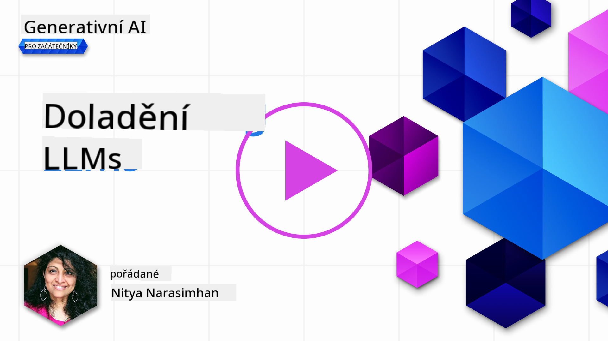
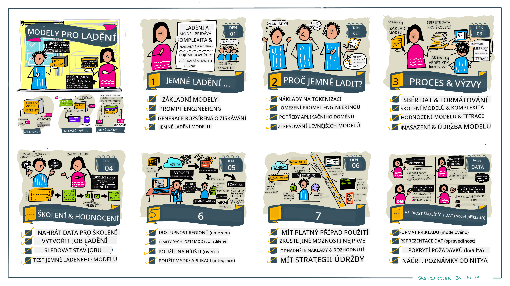

<!--
CO_OP_TRANSLATOR_METADATA:
{
  "original_hash": "68664f7e754a892ae1d8d5e2b7bd2081",
  "translation_date": "2025-06-26T00:50:10+00:00",
  "source_file": "18-fine-tuning/README.md",
  "language_code": "cs"
}
-->

# Doladění vašeho LLM

Použití velkých jazykových modelů k vytváření generativních AI aplikací přináší nové výzvy. Klíčovým problémem je zajištění kvality odpovědí (přesnost a relevance) v obsahu generovaném modelem pro daný uživatelský dotaz. V předchozích lekcích jsme diskutovali techniky jako inženýrství promptů a generování obohacené o vyhledávání, které se snaží řešit problém _úpravou vstupního promptu_ pro stávající model.

V dnešní lekci probereme třetí techniku, **doladění**, která se snaží řešit výzvu _přeškolením samotného modelu_ s dalšími daty. Pojďme se ponořit do podrobností.

## Cíle učení

Tato lekce představuje koncept doladění pro předtrénované jazykové modely, zkoumá výhody a výzvy tohoto přístupu a poskytuje návod, kdy a jak použít doladění ke zlepšení výkonu vašich generativních AI modelů.

Na konci této lekce byste měli být schopni odpovědět na následující otázky:

- Co je doladění jazykových modelů?
- Kdy a proč je doladění užitečné?
- Jak mohu doladit předtrénovaný model?
- Jaká jsou omezení doladění?

Připraveni? Pojďme začít.

## Ilustrovaný průvodce

Chcete získat celkový obraz o tom, co budeme probírat, než se ponoříme dovnitř? Podívejte se na tento ilustrovaný průvodce, který popisuje cestu učení pro tuto lekci - od naučení se základních konceptů a motivace k doladění, až po pochopení procesu a osvědčených postupů pro provedení úkolu doladění. Toto je fascinující téma k prozkoumání, takže nezapomeňte se podívat na stránku [Zdroje](./RESOURCES.md?WT.mc_id=academic-105485-koreyst) pro další odkazy, které podpoří vaši samostatnou cestu učení!

## Co je doladění jazykových modelů?

Podle definice jsou velké jazykové modely _předtrénovány_ na velkém množství textu získaného z různých zdrojů včetně internetu. Jak jsme se naučili v předchozích lekcích, potřebujeme techniky jako _inženýrství promptů_ a _generování obohacené o vyhledávání_, abychom zlepšili kvalitu odpovědí modelu na otázky uživatelů ("prompty").

Populární technika inženýrství promptů zahrnuje poskytnutí modelu více pokynů o tom, co se očekává v odpovědi, buď poskytnutím _instrukcí_ (explicitní vedení) nebo _poskytnutím několika příkladů_ (implicitní vedení). To se nazývá _učení s několika příklady_, ale má dvě omezení:

- Omezení počtu tokenů modelu může omezit počet příkladů, které můžete poskytnout, a tím i efektivitu.
- Náklady na tokeny modelu mohou učinit přidání příkladů ke každému promptu drahým a omezit flexibilitu.

Doladění je běžnou praxí v systémech strojového učení, kde vezmeme předtrénovaný model a znovu ho trénujeme s novými daty, abychom zlepšili jeho výkon na konkrétním úkolu. V kontextu jazykových modelů můžeme doladit předtrénovaný model _s pečlivě vybranou sadou příkladů pro daný úkol nebo aplikační doménu_, abychom vytvořili **vlastní model**, který může být přesnější a relevantnější pro daný úkol nebo doménu. Vedlejším přínosem doladění je, že může také snížit počet potřebných příkladů pro učení s několika příklady - čímž se snižuje používání tokenů a související náklady.

## Kdy a proč bychom měli modely doladit?

V _tomto_ kontextu, když mluvíme o doladění, máme na mysli **supervizované** doladění, kdy se přeškolování provádí **přidáním nových dat**, která nebyla součástí původního tréninkového datového souboru. To se liší od nesupervizovaného přístupu k doladění, kde je model znovu trénován na původních datech, ale s různými hyperparametry.

Klíčovou věcí k zapamatování je, že doladění je pokročilá technika, která vyžaduje určitou úroveň odbornosti k dosažení požadovaných výsledků. Pokud je provedeno nesprávně, nemusí poskytnout očekávaná zlepšení a může dokonce zhoršit výkon modelu pro vaši cílovou doménu.

Než se tedy naučíte "jak" doladit jazykové modely, musíte vědět "proč" byste měli tuto cestu zvolit a "kdy" začít proces doladění. Začněte tím, že si položíte tyto otázky:

- **Použití**: Jaký je váš _případ použití_ pro doladění? Jaký aspekt současného předtrénovaného modelu chcete zlepšit?
- **Alternativy**: Vyzkoušeli jste _jiné techniky_ k dosažení požadovaných výsledků? Použijte je k vytvoření základní úrovně pro srovnání.
  - Inženýrství promptů: Vyzkoušejte techniky jako promptování s několika příklady relevantních odpovědí. Vyhodnoťte kvalitu odpovědí.
  - Generování obohacené o vyhledávání: Zkuste obohatit prompty výsledky dotazů získaných vyhledáváním ve vašich datech. Vyhodnoťte kvalitu odpovědí.
- **Náklady**: Identifikovali jste náklady na doladění?
  - Doladitelnost - je předtrénovaný model dostupný pro doladění?
  - Úsilí - pro přípravu tréninkových dat, hodnocení a zdokonalování modelu.
  - Výpočet - pro spuštění úloh doladění a nasazení doladěného modelu
  - Data - přístup k dostatečně kvalitním příkladům pro dopad doladění
- **Přínosy**: Potvrdili jste přínosy doladění?
  - Kvalita - překonal doladěný model základní úroveň?
  - Náklady - snižuje použití tokenů zjednodušením promptů?
  - Rozšiřitelnost - můžete základní model přizpůsobit novým doménám?

Odpovězením na tyto otázky byste měli být schopni rozhodnout, zda je doladění správným přístupem pro váš případ použití. Ideálně je přístup platný pouze tehdy, pokud přínosy převáží náklady. Jakmile se rozhodnete pokračovat, je čas přemýšlet o tom, _jak_ můžete doladit předtrénovaný model.

Chcete získat více informací o rozhodovacím procesu? Podívejte se na [Doladit nebo nedoladit](https://www.youtube.com/watch?v=0Jo-z-MFxJs)

## Jak můžeme doladit předtrénovaný model?

Pro doladění předtrénovaného modelu potřebujete mít:

- předtrénovaný model k doladění
- datovou sadu k použití pro doladění
- tréninkové prostředí pro spuštění úlohy doladění
- hostitelské prostředí pro nasazení doladěného modelu

## Doladění v praxi

Následující zdroje poskytují návody krok za krokem, které vás provedou skutečným příkladem použití vybraného modelu s pečlivě vybranou datovou sadou. Pro projití těchto návodů potřebujete účet u konkrétního poskytovatele, spolu s přístupem k relevantním modelům a datovým sadám.

| Poskytovatel | Návod                                                                                                                                                                           | Popis                                                                                                                                                                                                                                                                                                                                                                                                                                 |
| ------------ | -------------------------------------------------------------------------------------------------------------------------------------------------------------------------------- | ------------------------------------------------------------------------------------------------------------------------------------------------------------------------------------------------------------------------------------------------------------------------------------------------------------------------------------------------------------------------------------------------------------------------------------- |
| OpenAI       | [Jak doladit chatovací modely](https://github.com/openai/openai-cookbook/blob/main/examples/How_to_finetune_chat_models.ipynb?WT.mc_id=academic-105485-koreyst)                   | Naučte se doladit `gpt-35-turbo` pro konkrétní doménu ("asistent pro recepty") přípravou tréninkových dat, spuštěním úlohy doladění a použitím doladěného modelu pro inferenci.                                                                                                                                                                                                                                                       |
| Azure OpenAI | [Návod na doladění GPT 3.5 Turbo](https://learn.microsoft.com/azure/ai-services/openai/tutorials/fine-tune?tabs=python-new%2Ccommand-line?WT.mc_id=academic-105485-koreyst)      | Naučte se doladit model `gpt-35-turbo-0613` **na Azure** tím, že provedete kroky k vytvoření a nahrání tréninkových dat, spuštění úlohy doladění. Nasazení a použití nového modelu.                                                                                                                                                                                                                                                      |
| Hugging Face | [Doladění LLM s Hugging Face](https://www.philschmid.de/fine-tune-llms-in-2024-with-trl?WT.mc_id=academic-105485-koreyst)                                                        | Tento blogový příspěvek vás provede doladěním _otevřeného LLM_ (např. `CodeLlama 7B`) pomocí knihovny [transformers](https://huggingface.co/docs/transformers/index?WT.mc_id=academic-105485-koreyst) a [Transformer Reinforcement Learning (TRL)](https://huggingface.co/docs/trl/index?WT.mc_id=academic-105485-koreyst]) s otevřenými [datovými sadami](https://huggingface.co/docs/datasets/index?WT.mc_id=academic-105485-koreyst) na Hugging Face. |
|              |                                                                                                                                                                                  |                                                                                                                                                                                                                                                                                                                                                                                                                                       |
| 🤗 AutoTrain | [Doladění LLM s AutoTrain](https://github.com/huggingface/autotrain-advanced/?WT.mc_id=academic-105485-koreyst)                                                                  | AutoTrain (nebo AutoTrain Advanced) je knihovna v pythonu vyvinutá Hugging Face, která umožňuje doladění pro mnoho různých úkolů včetně doladění LLM. AutoTrain je řešení bez kódu a doladění může být provedeno ve vašem vlastním cloudu, na Hugging Face Spaces nebo lokálně. Podporuje jak webové rozhraní GUI, CLI, tak trénování pomocí konfiguračních souborů yaml.                                                                 |

## Zadání

Vyberte jeden z výše uvedených návodů a projděte si jej. _Můžeme replikovat verzi těchto návodů v Jupyter Noteboocích v tomto repozitáři pouze pro referenci. Použijte prosím přímo původní zdroje, abyste získali nejnovější verze_.

## Skvělá práce! Pokračujte ve svém učení.

Po dokončení této lekce se podívejte na naši [sbírku Generative AI Learning](https://aka.ms/genai-collection?WT.mc_id=academic-105485-koreyst), abyste pokračovali v rozšiřování svých znalostí o generativní AI!

Gratulujeme!! Dokončili jste poslední lekci ze série v2 tohoto kurzu! Nepřestávejte se učit a stavět. \*\*Podívejte se na stránku [ZDROJE](RESOURCES.md?WT.mc_id=academic-105485-koreyst) pro seznam dalších návrhů právě k tomuto tématu.

Naše série lekcí v1 byla také aktualizována s více úkoly a koncepty. Takže si udělejte chvíli na osvěžení svých znalostí - a prosím [sdílejte své otázky a zpětnou vazbu](https://github.com/microsoft/generative-ai-for-beginners/issues?WT.mc_id=academic-105485-koreyst), abyste nám pomohli tyto lekce zlepšit pro komunitu.

**Prohlášení:**
Tento dokument byl přeložen pomocí služby AI pro překlad [Co-op Translator](https://github.com/Azure/co-op-translator). Ačkoli se snažíme o přesnost, mějte prosím na paměti, že automatizované překlady mohou obsahovat chyby nebo nepřesnosti. Původní dokument ve svém rodném jazyce by měl být považován za autoritativní zdroj. Pro kritické informace se doporučuje profesionální lidský překlad. Nejsme odpovědní za jakékoli nedorozumění nebo mylné výklady vyplývající z použití tohoto překladu.