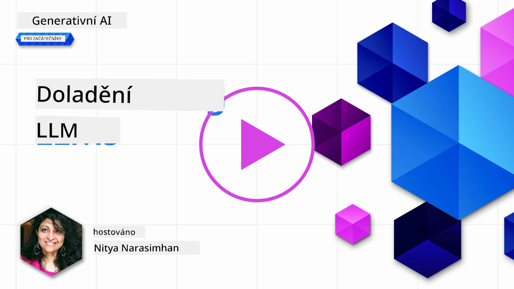
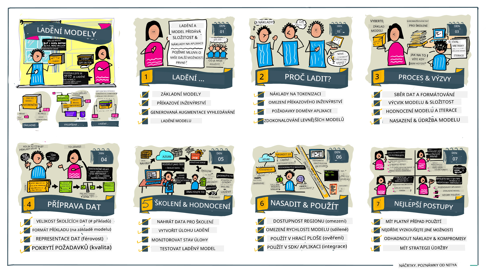

# Doladění vašeho LLM

Používání velkých jazykových modelů k tvorbě generativních AI aplikací přináší nové výzvy. Klíčovým problémem je zajištění kvality odpovědí (přesnost a relevance) v obsahu generovaném modelem na základě daného uživatelského požadavku. V předchozích lekcích jsme diskutovali techniky jako prompt engineering a retrieval-augmented generation, které se snaží tento problém řešit _úpravou vstupního promptu_ pro existující model.

V dnešní lekci se budeme věnovat třetí technice, **doladění (fine-tuning)**, která se snaží problém řešit _přeučením samotného modelu_ pomocí dodatečných dat. Pojďme se podívat na detaily.

## Výukové cíle

Tato lekce představuje koncept doladění předtrénovaných jazykových modelů, zkoumá výhody a výzvy tohoto přístupu a poskytuje pokyny, kdy a jak doladění použít ke zlepšení výkonu vašich generativních AI modelů.

Na konci této lekce byste měli být schopni odpovědět na následující otázky:

- Co je doladění jazykových modelů?
- Kdy a proč je doladění užitečné?
- Jak mohu doladit předtrénovaný model?
- Jaká jsou omezení doladění?

Jste připraveni? Pojďme začít.

## Ilustrovaný průvodce

Chcete získat přehled o tom, co budeme probírat, než se do toho pustíme? Podívejte se na tento ilustrovaný průvodce, který popisuje vzdělávací cestu této lekce - od seznámení se se základními koncepty a motivací pro doladění až po pochopení procesu a nejlepších postupů pro provedení úkolu doladění. Je to fascinující téma k prozkoumání, takže nezapomeňte navštívit stránku [Resources](./RESOURCES.md?WT.mc_id=academic-105485-koreyst) pro další odkazy, které podpoří vaši samostatnou studijní cestu!

## Co je doladění jazykových modelů?

Velké jazykové modely jsou podle definice _předtrénovány_ na velkém množství textu z různorodých zdrojů včetně internetu. Jak jsme se naučili v předchozích lekcích, k zlepšení kvality odpovědí modelu na uživatelské otázky ("prompty") potřebujeme techniky jako _prompt engineering_ a _retrieval-augmented generation_.

Oblíbená technika prompt engineeringu spočívá v tom, že modelu poskytneme více vedení ohledně toho, co očekáváme v odpovědi, buď poskytnutím _pokynů_ (explicitní vedení), nebo _několika příklady_ (implicitní vedení). Tomu říkáme _few-shot learning_, ale má to dvě omezení:

- Token limity modelu mohou omezit počet příkladů, které můžete poskytnout, a tím snížit efektivitu.
- Náklady na tokeny modelu mohou být vysoké, když přidáváte příklady ke každému promptu, což omezuje flexibilitu.

Doladění je běžná praxe v systémech strojového učení, kde vezmeme předtrénovaný model a přeučíme ho novými daty, aby se zlepšil jeho výkon na konkrétním úkolu. V kontextu jazykových modelů můžeme doladit předtrénovaný model _pomocí pečlivě vybraného souboru příkladů pro daný úkol nebo doménu aplikace_, abychom vytvořili **vlastní model**, který může být přesnější a relevantnější pro daný úkol nebo oblast. Vedlejším přínosem doladění je, že může také snížit počet příkladů potřebných pro few-shot learning – čímž se snižuje využití tokenů a s tím spojené náklady.

## Kdy a proč bychom měli doladit modely?

V _tomto_ kontextu, kdy mluvíme o doladění, máme na mysli **dozorované** doladění, kdy se přeučení provádí **přidáním nových dat**, která nebyla součástí původního tréninkového datasetu. To se liší od nedozerovaného doladění, kdy je model přeučen na původních datech, ale s jinými hyperparametry.

Klíčové je si uvědomit, že doladění je pokročilá technika, která vyžaduje určitou úroveň odbornosti, aby přinesla požadované výsledky. Pokud je provedena nesprávně, nemusí přinést očekávaná zlepšení a může dokonce zhoršit výkon modelu v cílové doméně.

Než se tedy naučíte „jak“ doladit jazykové modely, musíte vědět „proč“ byste měli touto cestou jít, a „kdy“ začít proces doladění. Začněte těmito otázkami:

- **Případ použití**: Jaký je váš _případ použití_ pro doladění? Jaký aspekt stávajícího předtrénovaného modelu chcete zlepšit?
- **Alternativy**: Zkoušeli jste _jiné techniky_, jak dosáhnout požadovaných výsledků? Použijte je k vytvoření základny pro porovnání.
  - Prompt engineering: Vyzkoušejte techniky jako few-shot prompting s příklady relevantních odpovědí. Ohodnoťte kvalitu odpovědí.
  - Retrieval Augmented Generation: Zkuste obohatit prompty o výsledky vyhledávání ve vašich datech. Ohodnoťte kvalitu odpovědí.
- **Náklady**: Identifikovali jste náklady na doladění?
  - Možnost ladění – je předtrénovaný model k doladění dostupný?
  - Úsilí – příprava tréninkových dat, hodnocení a dolaďování modelu.
  - Výpočetní zdroje – pro spuštění doladěcích úloh a nasazení doladěného modelu.
  - Data – přístup k dostatečně kvalitním příkladům pro efekt doladění.
- **Výhody**: Potvrdili jste přínosy doladění?
  - Kvalita – překonal doladěný model základní verzi?
  - Náklady – snižuje používání tokenů zjednodušením promptů?
  - Rozšiřitelnost – můžete základní model využít i v jiných doménách?

Odpovědí na tyto otázky byste měli být schopni rozhodnout, zda je doladění správný přístup pro váš případ použití. Ideálně je tento přístup platný jen tehdy, pokud přínosy převáží náklady. Jakmile se rozhodnete pokračovat, je čas přemýšlet o tom, _jak_ můžete doladit předtrénovaný model.

Chcete získat více informací o rozhodovacím procesu? Podívejte se na [To fine-tune or not to fine-tune](https://www.youtube.com/watch?v=0Jo-z-MFxJs).

## Jak můžeme doladit předtrénovaný model?

K doladění předtrénovaného modelu potřebujete:

- předtrénovaný model k doladění
- dataset pro doladění
- tréninkové prostředí pro spuštění doladění
- hostingové prostředí pro nasazení doladěného modelu

## Doladění v praxi

Následující zdroje obsahují postupné návody, které vás provedou reálným příkladem použití vybraného modelu s pečlivě vybraným datasetem. K dokončení těchto tutoriálů potřebujete účet u konkrétního poskytovatele spolu s přístupem k danému modelu a datasetům.

| Poskytovatel | Tutoriál                                                                                                                                                                       | Popis                                                                                                                                                                                                                                                                                                                                                                                                                             |
| ------------ | ------------------------------------------------------------------------------------------------------------------------------------------------------------------------------ | --------------------------------------------------------------------------------------------------------------------------------------------------------------------------------------------------------------------------------------------------------------------------------------------------------------------------------------------------------------------------------------------------------------------------------- |
| OpenAI       | [Jak doladit chatovací modely](https://github.com/openai/openai-cookbook/blob/main/examples/How_to_finetune_chat_models.ipynb?WT.mc_id=academic-105485-koreyst)               | Naučte se doladit `gpt-35-turbo` pro konkrétní doménu („asistent na recepty“) přípravou tréninkových dat, spuštěním doladění a použitím doladěného modelu pro inference.                                                                                                                                                                                                                                                         |
| Azure OpenAI | [Návod na doladění GPT 3.5 Turbo](https://learn.microsoft.com/azure/ai-services/openai/tutorials/fine-tune?tabs=python-new%2Ccommand-line&WT.mc_id=academic-105485-koreyst)       | Naučte se doladit model `gpt-35-turbo-0613` **na Azure** krok za krokem: vytvořit a nahrát tréninková data, spustit doladění, nasadit a používat nový model.                                                                                                                                                                                                                                                                       |
| Hugging Face | [Doladění LLMs s Hugging Face](https://www.philschmid.de/fine-tune-llms-in-2024-with-trl?WT.mc_id=academic-105485-koreyst)                                                    | Tento blogový příspěvek vás provede doladěním _otevřeného LLM_ (např. `CodeLlama 7B`) pomocí knihovny [transformers](https://huggingface.co/docs/transformers/index?WT.mc_id=academic-105485-koreyst) a [Transformer Reinforcement Learning (TRL)](https://huggingface.co/docs/trl/index?WT.mc_id=academic-105485-koreyst) s otevřenými [dataset](https://huggingface.co/docs/datasets/index?WT.mc_id=academic-105485-koreyst) na Hugging Face. |
|              |                                                                                                                                                                                |                                                                                                                                                                                                                                                                                                                                                                                                                                   |
| 🤗 AutoTrain | [Doladění LLMs s AutoTrain](https://github.com/huggingface/autotrain-advanced/?WT.mc_id=academic-105485-koreyst)                                                               | AutoTrain (nebo AutoTrain Advanced) je python knihovna vyvinutá Hugging Face, která umožňuje doladění pro mnoho různých úkolů včetně doladění LLM. AutoTrain je řešení bez nutnosti kódování a doladění je možné provádět ve vašem vlastním cloudu, na Hugging Face Spaces nebo lokálně. Podporuje jak webové GUI, CLI, tak trénink pomocí yaml konfiguračních souborů.                                                                         |
|              |                                                                                                                                                                                |                                                                                                                                                                                                                                                                                                                                                                                                                                   |
| 🦥 Unsloth  | [Doladění LLMs s Unsloth](https://github.com/unslothai/unsloth)                                                                                                              | Unsloth je open-source framework, který podporuje doladění LLM a reinforcement learning (RL). Unsloth usnadňuje lokální trénink, hodnocení a nasazení s připravenými [notebooky](https://github.com/unslothai/notebooks). Podporuje také text-to-speech (TTS), BERT a multimodální modely. Pro začátek si přečtěte jejich krok za krokem [Průvodce doladěním LLM](https://docs.unsloth.ai/get-started/fine-tuning-llms-guide).                         |
|              |                                                                                                                                                                                |                                                                                                                                                                                                                                                                                                                                                                                                                                   |
## Úkol

Vyberte si jeden z výše uvedených tutoriálů a projděte si ho. _Můžeme některé z těchto tutoriálů replikovat v Jupyter Noteboocích v tomto repozitáři pouze pro referenci. Používejte však přímo originální zdroje, abyste měli nejnovější verze_.

## Výborně! Pokračujte ve studiu.

Po dokončení této lekce si prohlédněte naši kolekci [Generative AI Learning collection](https://aka.ms/genai-collection?WT.mc_id=academic-105485-koreyst) a pokračujte ve zvyšování svých znalostí o generativní AI!

Gratulujeme!! Dokončili jste poslední lekci ze série verze 2 tohoto kurzu! Nepřestávejte se učit a tvořit. \*\*Prohlédněte si stránku [RESOURCES](RESOURCES.md?WT.mc_id=academic-105485-koreyst) pro seznam dalších doporučení k tomuto tématu.

Naše série lekcí verze 1 byla také aktualizována o více úkolů a konceptů. Takže si dejte chvíli na obnovu svých znalostí – a prosím [sdílejte své otázky a zpětnou vazbu](https://github.com/microsoft/generative-ai-for-beginners/issues?WT.mc_id=academic-105485-koreyst), abychom mohli tyto lekce pro komunitu zlepšovat.

---

<!-- CO-OP TRANSLATOR DISCLAIMER START -->
**Prohlášení o vyloučení odpovědnosti**:  
Tento dokument byl přeložen pomocí AI překladatelské služby [Co-op Translator](https://github.com/Azure/co-op-translator). Přestože usilujeme o přesnost, mějte prosím na paměti, že automatické překlady mohou obsahovat chyby nebo nepřesnosti. Původní dokument v rodném jazyce by měl být považován za závazný zdroj. Pro zásadní informace se doporučuje profesionální lidský překlad. Nejsme odpovědní za jakékoliv nedorozumění nebo nesprávné interpretace vyplývající z použití tohoto překladu.
<!-- CO-OP TRANSLATOR DISCLAIMER END -->