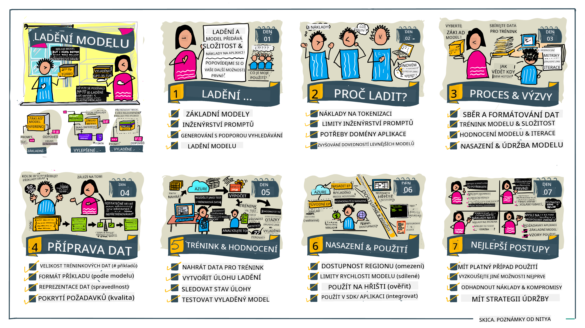

<!--
CO_OP_TRANSLATOR_METADATA:
{
  "original_hash": "807f0d9fc1747e796433534e1be6a98a",
  "translation_date": "2025-10-17T21:41:42+00:00",
  "source_file": "18-fine-tuning/README.md",
  "language_code": "cs"
}
-->

# Doladění vašeho LLM

Používání velkých jazykových modelů k vytváření aplikací generativní AI přináší nové výzvy. Klíčovým problémem je zajištění kvality odpovědí (přesnosti a relevance) v obsahu generovaném modelem na základě konkrétního požadavku uživatele. V předchozích lekcích jsme diskutovali o technikách, jako je návrh promptů a generování obohacené o vyhledávání, které se snaží tento problém řešit _úpravou vstupního promptu_ existujícího modelu.

V dnešní lekci se zaměříme na třetí techniku, **doladění**, která se snaží tento problém řešit _přeškolením samotného modelu_ pomocí dodatečných dat. Pojďme se ponořit do podrobností.

## Cíle učení

Tato lekce představuje koncept doladění předtrénovaných jazykových modelů, zkoumá výhody a výzvy tohoto přístupu a poskytuje návod, kdy a jak použít doladění ke zlepšení výkonu vašich generativních AI modelů.

Na konci této lekce byste měli být schopni odpovědět na následující otázky:

- Co je doladění jazykových modelů?
- Kdy a proč je doladění užitečné?
- Jak mohu doladit předtrénovaný model?
- Jaké jsou omezení doladění?

Připraveni? Pojďme začít.

## Ilustrovaný průvodce

Chcete získat celkový přehled o tom, co budeme probírat, než se ponoříme do detailů? Podívejte se na tento ilustrovaný průvodce, který popisuje vzdělávací cestu této lekce - od pochopení základních konceptů a motivace pro doladění až po porozumění procesu a osvědčeným postupům pro provedení úkolu doladění. Toto je fascinující téma k prozkoumání, takže nezapomeňte navštívit stránku [Resources](./RESOURCES.md?WT.mc_id=academic-105485-koreyst) pro další odkazy, které podpoří vaši samostatnou vzdělávací cestu!

## Co je doladění jazykových modelů?

Velké jazykové modely jsou podle definice _předtrénované_ na velkém množství textů pocházejících z různých zdrojů, včetně internetu. Jak jsme se naučili v předchozích lekcích, potřebujeme techniky jako _návrh promptů_ a _generování obohacené o vyhledávání_, abychom zlepšili kvalitu odpovědí modelu na otázky uživatele ("prompty").

Oblíbenou technikou návrhu promptů je poskytnutí modelu více pokynů, co se od něj očekává v odpovědi, buď _instrukcemi_ (explicitní pokyny), nebo _několika příklady_ (implicitní pokyny). Tomu se říká _few-shot learning_, ale má dvě omezení:

- Omezení počtu tokenů modelu může omezit počet příkladů, které můžete poskytnout, a tím i účinnost.
- Náklady na tokeny modelu mohou být vysoké, pokud přidáváte příklady ke každému promptu, což omezuje flexibilitu.

Doladění je běžná praxe v systémech strojového učení, kdy vezmeme předtrénovaný model a přeškolíme ho s novými daty, abychom zlepšili jeho výkon na konkrétním úkolu. V kontextu jazykových modelů můžeme doladit předtrénovaný model _s pečlivě vybranou sadou příkladů pro daný úkol nebo aplikační doménu_, abychom vytvořili **vlastní model**, který může být přesnější a relevantnější pro daný úkol nebo doménu. Vedlejším přínosem doladění je, že může také snížit počet příkladů potřebných pro few-shot learning - čímž se snižuje využití tokenů a související náklady.

## Kdy a proč bychom měli doladit modely?

V _tomto_ kontextu, když mluvíme o doladění, máme na mysli **supervizované** doladění, kdy se přeškolení provádí **přidáním nových dat**, která nebyla součástí původního tréninkového datasetu. To se liší od nesupervizovaného doladění, kdy je model přeškolen na původních datech, ale s různými hyperparametry.

Klíčové je si uvědomit, že doladění je pokročilá technika, která vyžaduje určitou úroveň odbornosti, aby bylo dosaženo požadovaných výsledků. Pokud je provedeno nesprávně, nemusí přinést očekávaná zlepšení a může dokonce zhoršit výkon modelu pro vaši cílovou doménu.

Než se tedy naučíte "jak" doladit jazykové modely, musíte vědět "proč" byste měli tuto cestu zvolit a "kdy" začít proces doladění. Začněte tím, že si položíte tyto otázky:

- **Použití**: Jaký je váš _případ použití_ pro doladění? Jaký aspekt aktuálního předtrénovaného modelu chcete zlepšit?
- **Alternativy**: Vyzkoušeli jste _jiné techniky_, abyste dosáhli požadovaných výsledků? Použijte je k vytvoření základního srovnání.
  - Návrh promptů: Vyzkoušejte techniky jako few-shot prompting s příklady relevantních odpovědí na prompty. Zhodnoťte kvalitu odpovědí.
  - Generování obohacené o vyhledávání: Zkuste obohatit prompty o výsledky vyhledávání ve vašich datech. Zhodnoťte kvalitu odpovědí.
- **Náklady**: Identifikovali jste náklady na doladění?
  - Možnost doladění - je předtrénovaný model dostupný pro doladění?
  - Úsilí - příprava tréninkových dat, hodnocení a zdokonalování modelu.
  - Výpočetní výkon - spuštění úloh doladění a nasazení doladěného modelu.
  - Data - přístup k dostatečnému množství kvalitních příkladů pro dopad doladění.
- **Přínosy**: Potvrdili jste přínosy doladění?
  - Kvalita - překonal doladěný model základní srovnání?
  - Náklady - snižuje využití tokenů zjednodušením promptů?
  - Rozšiřitelnost - lze základní model přizpůsobit novým doménám?

Odpovědí na tyto otázky byste měli být schopni rozhodnout, zda je doladění správným přístupem pro váš případ použití. Ideálně je tento přístup platný pouze tehdy, pokud přínosy převyšují náklady. Jakmile se rozhodnete pokračovat, je čas přemýšlet o _tom, jak_ můžete doladit předtrénovaný model.

Chcete získat více informací o rozhodovacím procesu? Podívejte se na [Doladit nebo nedoladit](https://www.youtube.com/watch?v=0Jo-z-MFxJs)

## Jak můžeme doladit předtrénovaný model?

K doladění předtrénovaného modelu potřebujete:

- předtrénovaný model k doladění
- dataset pro doladění
- tréninkové prostředí pro spuštění úlohy doladění
- hostingové prostředí pro nasazení doladěného modelu

## Doladění v praxi

Následující zdroje poskytují podrobné návody, které vás provedou skutečným příkladem použití vybraného modelu s pečlivě vybraným datasetem. Pro práci s těmito návody potřebujete účet u konkrétního poskytovatele spolu s přístupem k relevantnímu modelu a datasetům.

| Poskytovatel | Návod                                                                                                                                                                       | Popis                                                                                                                                                                                                                                                                                                                                                                                                                        |
| ------------ | --------------------------------------------------------------------------------------------------------------------------------------------------------------------------- | ---------------------------------------------------------------------------------------------------------------------------------------------------------------------------------------------------------------------------------------------------------------------------------------------------------------------------------------------------------------------------------------------------------------------------------- |
| OpenAI       | [Jak doladit chatovací modely](https://github.com/openai/openai-cookbook/blob/main/examples/How_to_finetune_chat_models.ipynb?WT.mc_id=academic-105485-koreyst)             | Naučte se doladit `gpt-35-turbo` pro konkrétní doménu ("asistent pro recepty") přípravou tréninkových dat, spuštěním úlohy doladění a použitím doladěného modelu pro inferenci.                                                                                                                                                                                                                                              |
| Azure OpenAI | [Návod na doladění GPT 3.5 Turbo](https://learn.microsoft.com/azure/ai-services/openai/tutorials/fine-tune?tabs=python-new%2Ccommand-line?WT.mc_id=academic-105485-koreyst) | Naučte se doladit model `gpt-35-turbo-0613` **na Azure** provedením kroků k vytvoření a nahrání tréninkových dat, spuštění úlohy doladění. Nasazení a použití nového modelu.                                                                                                                                                                                                                                                                 |
| Hugging Face | [Doladění LLM pomocí Hugging Face](https://www.philschmid.de/fine-tune-llms-in-2024-with-trl?WT.mc_id=academic-105485-koreyst)                                               | Tento blogový příspěvek vás provede doladěním _otevřeného LLM_ (např. `CodeLlama 7B`) pomocí knihovny [transformers](https://huggingface.co/docs/transformers/index?WT.mc_id=academic-105485-koreyst) a [Transformer Reinforcement Learning (TRL)](https://huggingface.co/docs/trl/index?WT.mc_id=academic-105485-koreyst]) s otevřenými [datovými sadami](https://huggingface.co/docs/datasets/index?WT.mc_id=academic-105485-koreyst) na Hugging Face. |
|              |                                                                                                                                                                             |                                                                                                                                                                                                                                                                                                                                                                                                                                    |
| 🤗 AutoTrain | [Doladění LLM pomocí AutoTrain](https://github.com/huggingface/autotrain-advanced/?WT.mc_id=academic-105485-koreyst)                                                         | AutoTrain (nebo AutoTrain Advanced) je pythonová knihovna vyvinutá společností Hugging Face, která umožňuje doladění pro mnoho různých úkolů včetně doladění LLM. AutoTrain je řešení bez nutnosti kódování a doladění lze provést ve vašem vlastním cloudu, na Hugging Face Spaces nebo lokálně. Podporuje jak webové GUI, tak CLI a trénink prostřednictvím yaml konfiguračních souborů.                                                                               |
|              |                                                                                                                                                                             |                                                                                                                                                                                                                                                                                                                                                                                                                                    |

## Úkol

Vyberte si jeden z výše uvedených návodů a projděte si ho. _Můžeme vytvořit verzi těchto návodů v Jupyter Notebooks v tomto repozitáři pouze pro referenci. Použijte prosím přímo původní zdroje, abyste získali nejnovější verze_.

## Skvělá práce! Pokračujte ve svém vzdělávání.

Po dokončení této lekce se podívejte na naši [kolekci učení o generativní AI](https://aka.ms/genai-collection?WT.mc_id=academic-105485-koreyst), abyste pokračovali ve zvyšování svých znalostí o generativní AI!

Gratulujeme!! Dokončili jste poslední lekci ze série v2 tohoto kurzu! Nepřestávejte se učit a tvořit. \*\*Podívejte se na stránku [RESOURCES](RESOURCES.md?WT.mc_id=academic-105485-koreyst) pro seznam dalších návrhů právě k tomuto tématu.

Naše série lekcí v1 byla také aktualizována o další úkoly a koncepty. Takže si udělejte chvíli na osvěžení svých znalostí - a prosím [sdílejte své otázky a zpětnou vazbu](https://github.com/microsoft/generative-ai-for-beginners/issues?WT.mc_id=academic-105485-koreyst), abyste nám pomohli tyto lekce pro komunitu zlepšit.

---

**Prohlášení**:  
Tento dokument byl přeložen pomocí služby AI pro překlady [Co-op Translator](https://github.com/Azure/co-op-translator). I když se snažíme o přesnost, mějte prosím na paměti, že automatické překlady mohou obsahovat chyby nebo nepřesnosti. Původní dokument v jeho rodném jazyce by měl být považován za autoritativní zdroj. Pro důležité informace se doporučuje profesionální lidský překlad. Neodpovídáme za žádná nedorozumění nebo nesprávné interpretace vyplývající z použití tohoto překladu.