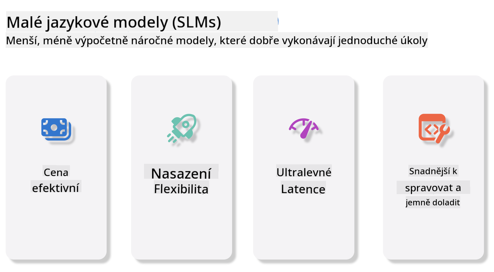
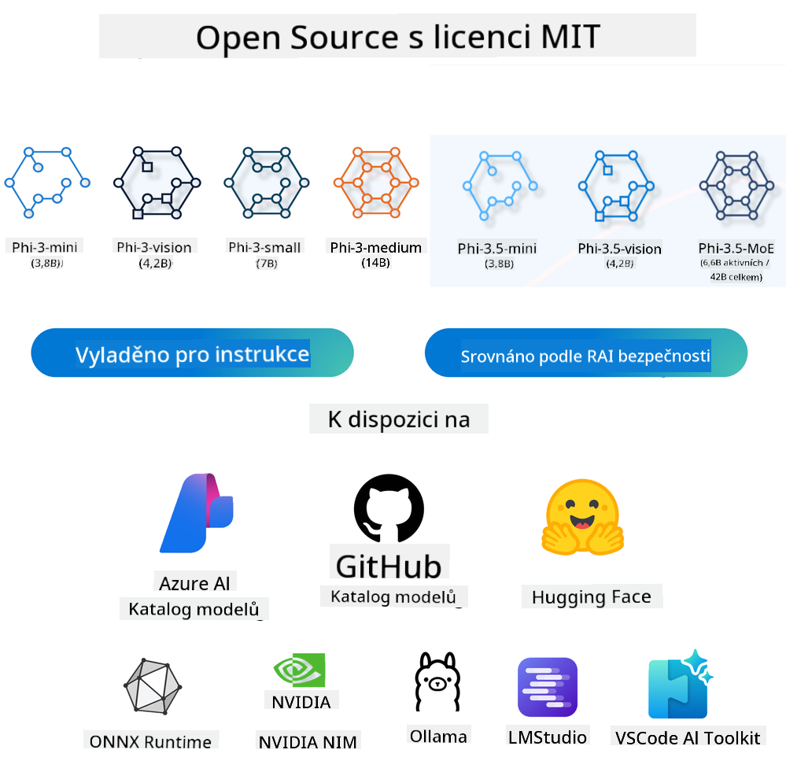
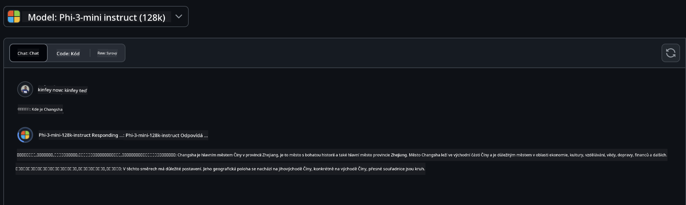
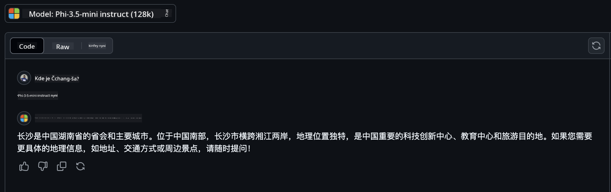

<!--
CO_OP_TRANSLATOR_METADATA:
{
  "original_hash": "124ad36cfe96f74038811b6e2bb93e9d",
  "translation_date": "2025-05-20T10:28:50+00:00",
  "source_file": "19-slm/README.md",
  "language_code": "cs"
}
-->
# Úvod do malých jazykových modelů pro generativní AI pro začátečníky Generativní AI je fascinující oblast umělé inteligence, která se zaměřuje na vytváření systémů schopných generovat nový obsah. Tento obsah může zahrnovat text a obrázky, hudbu a dokonce i celé virtuální prostředí. Jednou z nejzajímavějších aplikací generativní AI je oblast jazykových modelů. ## Co jsou malé jazykové modely? Malý jazykový model (SLM) představuje zmenšenou variantu velkého jazykového modelu (LLM), využívající mnoho architektonických principů a technik LLM, přičemž vykazuje výrazně sníženou výpočetní stopu. SLM jsou podmnožinou jazykových modelů navržených k vytváření textu podobného lidskému. Na rozdíl od svých větších protějšků, jako je GPT-4, jsou SLM kompaktnější a efektivnější, což je ideální pro aplikace, kde jsou omezené výpočetní zdroje. I přes svou menší velikost mohou stále vykonávat řadu úkolů. Obvykle jsou SLM konstruovány kompresí nebo destilací LLM, s cílem zachovat podstatnou část původní funkčnosti modelu a jazykových schopností. Toto zmenšení velikosti modelu snižuje celkovou složitost, což činí SLM efektivnějšími z hlediska paměťového využití a výpočetních požadavků. I přes tyto optimalizace mohou SLM stále vykonávat širokou škálu úloh zpracování přirozeného jazyka (NLP): - Generování textu: Vytváření koherentních a kontextově relevantních vět nebo odstavců. - Doplňování textu: Predikce a doplňování vět na základě zadaného podnětu. - Překlad: Převod textu z jednoho jazyka do druhého. - Shrnutí: Zkrácení dlouhých textů do kratších, snadno stravitelných souhrnů. Ačkoliv s určitými kompromisy ve výkonu nebo hloubce porozumění ve srovnání s jejich většími protějšky. ## Jak malé jazykové modely fungují? SLM jsou trénovány na obrovském množství textových dat. Během tréninku se učí vzory a struktury jazyka, což jim umožňuje generovat text, který je gramaticky správný a kontextově vhodný. Proces tréninku zahrnuje: - Sběr dat: Shromažďování velkých datových sad textu z různých zdrojů. - Předzpracování: Čištění a organizace dat, aby byla vhodná pro trénink. - Trénink: Použití algoritmů strojového učení k naučení modelu, jak rozumět a generovat text. - Doladění: Úprava modelu pro zlepšení jeho výkonu na specifických úkolech. Vývoj SLM se shoduje s rostoucí potřebou modelů, které lze nasadit v prostředích s omezenými zdroji, jako jsou mobilní zařízení nebo platformy pro výpočet na okraji sítě, kde plně škálované LLM mohou být nepraktické kvůli jejich vysokým nárokům na zdroje. Zaměřením na efektivitu SLM vyvažují výkon s dostupností, což umožňuje širší aplikaci v různých doménách.  ## Výukové cíle V této lekci doufáme, že představíme znalosti o SLM a zkombinujeme je s Microsoft Phi-3, abychom se naučili různé scénáře v textovém obsahu, vizuální oblasti a MoE. Na konci této lekce byste měli být schopni odpovědět na následující otázky: - Co je SLM - Jaký je rozdíl mezi SLM a LLM - Co je rodina Microsoft Phi-3/3.5 - Jak inferovat rodinu Microsoft Phi-3/3.5 Připraven? Začněme. ## Rozdíly mezi velkými jazykovými modely (LLM) a malými jazykovými modely (SLM) Oba LLM a SLM jsou postaveny na základních principech pravděpodobnostního strojového učení, následují podobné přístupy ve svém architektonickém designu, metodikách tréninku, procesech generování dat a technikách hodnocení modelu. Nicméně několik klíčových faktorů odlišuje tyto dva typy modelů. ## Aplikace malých jazykových modelů SLM mají širokou škálu aplikací, včetně: - Chatboti: Poskytování zákaznické podpory a interakce s uživateli konverzačním způsobem. - Tvorba obsahu: Pomoc spisovatelům při generování nápadů nebo dokonce při psaní celých článků. - Vzdělávání: Pomoc studentům s psaním úkolů nebo učením nových jazyků. - Přístupnost: Vytváření nástrojů pro osoby se zdravotním postižením, jako jsou systémy převodu textu na řeč. **Velikost** Primární rozdíl mezi LLM a SLM spočívá v měřítku modelů. LLM, jako ChatGPT (GPT-4), mohou obsahovat odhadovaných 1,76 bilionu parametrů, zatímco open-source SLM, jako Mistral 7B, jsou navrženy s výrazně menším počtem parametrů—přibližně 7 miliard. Tento rozdíl je primárně způsoben rozdíly v architektuře modelu a procesech tréninku. Například ChatGPT používá mechanismus self-attention v rámci encoder-decoder, zatímco Mistral 7B používá sliding window attention, což umožňuje efektivnější trénink v modelu pouze s dekodérem. Tato architektonická variace má zásadní dopady na složitost a výkon těchto modelů. **Porozumění** SLM jsou obvykle optimalizovány pro výkon v konkrétních doménách, což je činí vysoce specializovanými, ale potenciálně omezenými ve své schopnosti poskytovat široké kontextové porozumění napříč více obory znalostí. Naopak LLM se snaží simulovat lidskou inteligenci na komplexnější úrovni. Trénovány na rozsáhlých, rozmanitých datových sadách, jsou LLM navrženy tak, aby dobře fungovaly napříč různými doménami, nabízejí větší všestrannost a adaptabilitu. Následkem toho jsou LLM vhodnější pro širší škálu následných úkolů, jako je zpracování přirozeného jazyka a programování. **Výpočetní výkon** Trénink a nasazení LLM jsou procesy náročné na zdroje, často vyžadující významnou výpočetní infrastrukturu, včetně velkých klastrů GPU. Například trénink modelu jako ChatGPT od začátku může vyžadovat tisíce GPU po dlouhou dobu. Naopak SLM, se svým menším počtem parametrů, jsou přístupnější z hlediska výpočetních zdrojů. Modely jako Mistral 7B mohou být trénovány a spuštěny na místních strojích vybavených středními schopnostmi GPU, i když trénink stále vyžaduje několik hodin na více GPU. **Předpojatost** Předpojatost je známý problém u LLM, primárně kvůli povaze tréninkových dat. Tyto modely často spoléhají na surová, volně dostupná data z internetu, která mohou nedostatečně reprezentovat nebo špatně reprezentovat určité skupiny, zavádět chybné označování nebo odrážet jazykové předpojatosti ovlivněné dialektem, geografickými variacemi a gramatickými pravidly. Navíc složitost architektur LLM může neúmyslně zesílit předpojatost, která může zůstat bez povšimnutí bez pečlivého doladění. Na druhou stranu SLM, které jsou trénovány na omezenějších, specifických datových sadách, jsou přirozeně méně náchylné k takovým předpojatostem, i když nejsou vůči nim imunní. **Inferování** Zmenšená velikost SLM jim poskytuje významnou výhodu z hlediska rychlosti inferování, což jim umožňuje efektivně generovat výstupy na místním hardwaru bez potřeby rozsáhlého paralelního zpracování. Naopak LLM, kvůli své velikosti a složitosti, často vyžadují značné paralelní výpočetní zdroje k dosažení přijatelné doby inferování. Přítomnost více současných uživatelů dále zpomaluje dobu odezvy LLM, zejména při nasazení ve velkém měřítku. Na závěr, zatímco oba LLM a SLM sdílejí základní základnu v strojovém učení, výrazně se liší z hlediska velikosti modelu, požadavků na zdroje, kontextového porozumění, náchylnosti k předpojatosti a rychlosti inferování. Tyto rozdíly odrážejí jejich příslušnou vhodnost pro různé případy použití, přičemž LLM jsou všestrannější, ale náročné na zdroje, a SLM nabízejí více doménově specifickou efektivitu se sníženými výpočetními nároky. ***Poznámka: V této kapitole představíme SLM pomocí Microsoft Phi-3 / 3.5 jako příklad.*** ## Představení rodiny Phi-3 / Phi-3.5 Rodina Phi-3 / 3.5 se primárně zaměřuje na textové, vizuální a Agent (MoE) aplikační scénáře: ### Phi-3 / 3.5 Instruct Hlavně pro generování textu, dokončování chatů a extrakci informací z obsahu atd. **Phi-3-mini** Jazykový model s 3,8 miliardami parametrů je dostupný na Microsoft Azure AI Studio, Hugging Face a Ollama. Modely Phi-3 výrazně překonávají jazykové modely stejné a větší velikosti na klíčových benchmarkech (viz níže uvedená čísla benchmarků, vyšší čísla jsou lepší). Phi-3-mini překonává modely dvakrát větší, zatímco Phi-3-small a Phi-3-medium překonávají větší modely, včetně GPT-3.5 **Phi-3-small & medium** S pouhými 7 miliardami parametrů Phi-3-small překonává GPT-3.5T na různých jazykových, logických, kódovacích a matematických benchmarkech. Phi-3-medium s 14 miliardami parametrů pokračuje v tomto trendu a překonává Gemini 1.0 Pro. **Phi-3.5-mini** Můžeme si to představit jako upgrade Phi-3-mini. Zatímco parametry zůstávají nezměněné, zlepšuje schopnost podpory více jazyků (podpora více než 20 jazyků: arabština, čínština, čeština, dánština, holandština, angličtina, finština, francouzština, němčina, hebrejština, maďarština, italština, japonština, korejština, norština, polština, portugalština, ruština, španělština, švédština, thajština, turečtina, ukrajinština) a přidává silnější podporu pro dlouhý kontext. Phi-3.5-mini s 3,8 miliardami parametrů překonává jazykové modely stejné velikosti a je na úrovni modelů dvakrát větší. ### Phi-3 / 3.5 Vision Můžeme si představit model Instruct Phi-3/3.5 jako schopnost Phi rozumět, a Vision je to, co dává Phi oči k pochopení světa. **Phi-3-Vision** Phi-3-vision, s pouhými 4,2 miliardami parametrů, pokračuje v tomto trendu a překonává větší modely jako Claude-3 Haiku a Gemini 1.0 Pro V v obecných úlohách vizuálního uvažování, OCR a úlohách porozumění tabulkám a diagramům. **Phi-3.5-Vision** Phi-3.5-Vision je také upgrade Phi-3-Vision, přidává podporu pro více obrázků. Můžete si to představit jako zlepšení vidění, nejen že můžete vidět obrázky, ale také videa. Phi-3.5-vision překonává větší modely jako Claude-3.5 Sonnet a Gemini 1.5 Flash v úlohách porozumění OCR, tabulkám a grafům a je na úrovni v obecných úlohách uvažování na základě vizuálních znalostí. Podpora vstupu s více snímky, tj. provádění uvažování na více vstupních obrázcích ### Phi-3.5-MoE ***Směs expertů (MoE)*** umožňuje modelům být předtrénovány s mnohem menšími výpočetními nároky, což znamená, že můžete dramaticky zvýšit velikost modelu nebo datové sady se stejným výpočetním rozpočtem jako hustý model. Zejména by model MoE měl dosáhnout stejné kvality jako jeho hustý protějšek mnohem rychleji během předtrénování. Phi-3.5-MoE zahrnuje 16x3,8 miliardy expertních modulů. Phi-3.5-MoE s pouhými 6,6 miliardami aktivních parametrů dosahuje podobné úrovně uvažování, porozumění jazyku a matematiky jako mnohem větší modely. Můžeme použít model rodiny Phi-3/3.5 na základě různých scénářů. Na rozdíl od LLM můžete nasadit Phi-3/3.5-mini nebo Phi-3/3.5-Vision na zařízení na okraji sítě. ## Jak používat modely rodiny Phi-3/3.5 Doufáme, že použijeme Phi-3/3.5 v různých scénářích. Dále použijeme Phi-3/3.5 na základě různých scénářů.  ### Rozdíl v inferenci Cloud's API **GitHub Models** GitHub
Modely jsou nejpřímější způsob. K modelu Phi-3/3.5-Instruct můžete rychle přistupovat prostřednictvím GitHub Models. V kombinaci s Azure AI Inference SDK / OpenAI SDK můžete přistupovat k API prostřednictvím kódu a dokončit volání Phi-3/3.5-Instruct. Můžete také testovat různé efekty prostřednictvím Playground. - Demo: Porovnání efektů Phi-3-mini a Phi-3.5-mini v čínských scénářích   **Azure AI Studio** Nebo pokud chceme použít vision a MoE modely, můžete použít Azure AI Studio k dokončení volání. Pokud máte zájem, můžete si přečíst Phi-3 Cookbook a naučit se, jak volat Phi-3/3.5 Instruct, Vision, MoE prostřednictvím Azure AI Studio [Klikněte na tento odkaz](https://github.com/microsoft/Phi-3CookBook/blob/main/md/02.QuickStart/AzureAIStudio_QuickStart.md?WT.mc_id=academic-105485-koreyst) **NVIDIA NIM** Kromě cloudových řešení Model Catalog poskytovaných Azure a GitHub můžete také použít [Nivida NIM](https://developer.nvidia.com/nim?WT.mc_id=academic-105485-koreyst) k dokončení souvisejících volání. Můžete navštívit NIVIDA NIM a dokončit volání API rodiny Phi-3/3.5. NVIDIA NIM (NVIDIA Inference Microservices) je sada akcelerovaných inferenčních mikroservis navržených tak, aby pomohly vývojářům efektivně nasazovat AI modely napříč různými prostředími, včetně cloudů, datových center a pracovních stanic. Zde jsou některé klíčové vlastnosti NVIDIA NIM: - **Snadné nasazení:** NIM umožňuje nasazení AI modelů jedním příkazem, což usnadňuje integraci do stávajících pracovních postupů. - **Optimalizovaný výkon:** Využívá předoptimalizované inferenční motory NVIDIA, jako jsou TensorRT a TensorRT-LLM, k zajištění nízké latence a vysoké propustnosti. - **Škálovatelnost:** NIM podporuje autoscaling na Kubernetes, což mu umožňuje efektivně zvládat proměnlivé pracovní zatížení. - **Bezpečnost a kontrola:** Organizace mohou udržovat kontrolu nad svými daty a aplikacemi hostováním NIM mikroservis na vlastní spravované infrastruktuře. - **Standardní API:** NIM poskytuje průmyslově standardní API, což usnadňuje vytváření a integraci AI aplikací, jako jsou chatboti, AI asistenti a další. NIM je součástí NVIDIA AI Enterprise, které má za cíl zjednodušit nasazení a provoz AI modelů, aby běžely efektivně na NVIDIA GPU. - Demo: Použití Nividia NIM k volání Phi-3.5-Vision-API [[Klikněte na tento odkaz](../../../19-slm/python/Phi-3-Vision-Nividia-NIM.ipynb)] ### Inference Phi-3/3.5 v lokálním prostředí Inference ve vztahu k Phi-3 nebo jakémukoli jazykovému modelu jako GPT-3 se vztahuje k procesu generování odpovědí nebo předpovědí na základě vstupu, který obdrží. Když poskytnete podnět nebo otázku Phi-3, použije svůj trénovaný neuronový síť k odvození nejpravděpodobnější a nejrelevantnější odpovědi analýzou vzorců a vztahů v datech, na kterých byl trénován. **Hugging Face Transformer** Hugging Face Transformers je výkonná knihovna navržená pro zpracování přirozeného jazyka (NLP) a další úkoly strojového učení. Zde jsou některé klíčové body o ní: 1. **Předtrénované modely**: Poskytuje tisíce předtrénovaných modelů, které lze použít pro různé úkoly, jako je klasifikace textu, rozpoznávání pojmenovaných entit, odpovídání na otázky, shrnutí, překlad a generování textu. 2. **Interoperabilita frameworků**: Knihovna podporuje více frameworků hlubokého učení, včetně PyTorch, TensorFlow a JAX. To umožňuje trénovat model v jednom frameworku a používat ho v jiném. 3. **Multimodální schopnosti**: Kromě NLP podporuje Hugging Face Transformers také úkoly v počítačovém vidění (např. klasifikace obrazů, detekce objektů) a zpracování zvuku (např. rozpoznávání řeči, klasifikace zvuku). 4. **Snadné použití**: Knihovna nabízí API a nástroje pro snadné stahování a doladění modelů, což je přístupné pro začátečníky i odborníky. 5. **Komunita a zdroje**: Hugging Face má živou komunitu a rozsáhlou dokumentaci, návody a průvodce, které pomáhají uživatelům začít a co nejlépe využít knihovnu. [oficiální dokumentace](https://huggingface.co/docs/transformers/index?WT.mc_id=academic-105485-koreyst) nebo jejich [GitHub repository](https://github.com/huggingface/transformers?WT.mc_id=academic-105485-koreyst). Toto je nejčastěji používaná metoda, ale také vyžaduje akceleraci GPU. Nakonec, scény jako Vision a MoE vyžadují mnoho výpočtů, které budou velmi omezené na CPU, pokud nebudou kvantizovány. - Demo: Použití Transformeru k volání Phi-3.5-Instruct [Klikněte na tento odkaz](../../../19-slm/python/phi35-instruct-demo.ipynb) - Demo: Použití Transformeru k volání Phi-3.5-Vision[Klikněte na tento odkaz](../../../19-slm/python/phi35-vision-demo.ipynb) - Demo: Použití Transformeru k volání Phi-3.5-MoE[Klikněte na tento odkaz](../../../19-slm/python/phi35_moe_demo.ipynb) **Ollama** [Ollama](https://ollama.com/?WT.mc_id=academic-105485-koreyst) je platforma navržená tak, aby usnadnila spuštění velkých jazykových modelů (LLM) lokálně na vašem počítači. Podporuje různé modely jako Llama 3.1, Phi 3, Mistral a Gemma 2, mezi jinými. Platforma zjednodušuje proces tím, že balí váhy modelu, konfiguraci a data do jednoho balíčku, což usnadňuje uživatelům přizpůsobení a vytváření vlastních modelů. Ollama je k dispozici pro macOS, Linux a Windows. Je to skvělý nástroj, pokud chcete experimentovat s nebo nasadit LLM bez spoléhání se na cloudové služby. Ollama je nejpřímější způsob, stačí jen provést následující příkaz. ```bash

ollama run phi3.5

``` **ONNX Runtime pro GenAI** [ONNX Runtime](https://github.com/microsoft/onnxruntime-genai?WT.mc_id=academic-105485-koreyst) je multiplatformní akcelerátor inferenčních a tréninkových strojového učení. ONNX Runtime pro Generative AI (GENAI) je výkonný nástroj, který vám pomáhá efektivně provozovat generativní AI modely na různých platformách. ## Co je ONNX Runtime? ONNX Runtime je open-source projekt, který umožňuje vysoce výkonné inference strojových modelů. Podporuje modely ve formátu Open Neural Network Exchange (ONNX), což je standard pro reprezentaci strojových modelů. Inference ONNX Runtime může umožnit rychlejší zákaznické zkušenosti a nižší náklady, podporuje modely z frameworků hlubokého učení jako PyTorch a TensorFlow/Keras, stejně jako klasické knihovny strojového učení jako scikit-learn, LightGBM, XGBoost atd. ONNX Runtime je kompatibilní s různým hardwarem, ovladači a operačními systémy a poskytuje optimální výkon využitím hardwarových akcelerátorů tam, kde je to možné, spolu s optimalizacemi grafů a transformacemi. ## Co je Generative AI? Generative AI se vztahuje na AI systémy, které mohou generovat nový obsah, jako je text, obrázky nebo hudba, na základě dat, na kterých byly trénovány. Příklady zahrnují jazykové modely jako GPT-3 a modely generování obrazů jako Stable Diffusion. Knihovna ONNX Runtime pro GenAI poskytuje generativní AI smyčku pro ONNX modely, včetně inference s ONNX Runtime, zpracování logitů, vyhledávání a vzorkování a správy KV cache. ## ONNX Runtime pro GENAI ONNX Runtime pro GENAI rozšiřuje schopnosti ONNX Runtime pro podporu generativních AI modelů. Zde jsou některé klíčové vlastnosti: - **Široká podpora platforem:** Funguje na různých platformách, včetně Windows, Linux, macOS, Android a iOS. - **Podpora modelů:** Podporuje mnoho populárních generativních AI modelů, jako jsou LLaMA, GPT-Neo, BLOOM a další. - **Optimalizace výkonu:** Zahrnuje optimalizace pro různé hardwarové akcelerátory, jako jsou NVIDIA GPU, AMD GPU a další2. - **Snadné použití:** Poskytuje API pro snadnou integraci do aplikací, což umožňuje generovat text, obrázky a další obsah s minimálním kódem - Uživatelé mohou volat vysoce úroveň generovat() metodu nebo spustit každou iteraci modelu ve smyčce, generovat jeden token najednou a volitelně aktualizovat parametry generování uvnitř smyčky. - ONNX runtime má také podporu pro greedy/beam search a TopP, TopK vzorkování pro generování sekvencí tokenů a vestavěné zpracování logitů jako penalizace opakování. Můžete také snadno přidat vlastní hodnocení. ## Začínáme Chcete-li začít s ONNX Runtime pro GENAI, můžete postupovat podle těchto kroků: ### Nainstalujte ONNX Runtime: ```Python
pip install onnxruntime
``` ### Nainstalujte rozšíření Generative AI: ```Python
pip install onnxruntime-genai
``` ### Spusťte model: Zde je jednoduchý příklad v Pythonu: ```Python
import onnxruntime_genai as og

model = og.Model('path_to_your_model.onnx')

tokenizer = og.Tokenizer(model)

input_text = "Hello, how are you?"

input_tokens = tokenizer.encode(input_text)

output_tokens = model.generate(input_tokens)

output_text = tokenizer.decode(output_tokens)

print(output_text) 
``` ### Demo: Použití ONNX Runtime GenAI k volání Phi-3.5-Vision ```python

import onnxruntime_genai as og

model_path = './Your Phi-3.5-vision-instruct ONNX Path'

img_path = './Your Image Path'

model = og.Model(model_path)

processor = model.create_multimodal_processor()

tokenizer_stream = processor.create_stream()

text = "Your Prompt"

prompt = "<|user|>\n"

prompt += "<|image_1|>\n"

prompt += f"{text}<|end|>\n"

prompt += "<|assistant|>\n"

image = og.Images.open(img_path)

inputs = processor(prompt, images=image)

params = og.GeneratorParams(model)

params.set_inputs(inputs)

params.set_search_options(max_length=3072)

generator = og.Generator(model, params)

while not generator.is_done():

    generator.compute_logits()
    
    generator.generate_next_token()

    new_token = generator.get_next_tokens()[0]
    
    code += tokenizer_stream.decode(new_token)
    
    print(tokenizer_stream.decode(new_token), end='', flush=True)

``` **Ostatní** Kromě metod odkazování ONNX Runtime a Ollama můžeme také dokončit odkazování kvantitativních modelů na základě metod odkazování modelů poskytovaných různými výrobci. Jako Apple MLX framework s Apple Metal, Qualcomm QNN s NPU, Intel OpenVINO s CPU/GPU atd. Můžete také získat více obsahu z [Phi-3 Cookbook](https://github.com/microsoft/phi-3cookbook?WT.mc_id=academic-105485-koreyst) ## Více Naučili jsme se základy rodiny Phi-3/3.5, ale abychom se dozvěděli více o SLM, potřebujeme více znalostí. Odpovědi můžete najít v Phi-3 Cookbook. Pokud se chcete dozvědět více, navštivte [Phi-3 Cookbook](https://github.com/microsoft/phi-3cookbook?WT.mc_id=academic-105485-koreyst).

**Upozornění**:  
Tento dokument byl přeložen pomocí služby AI pro překlad [Co-op Translator](https://github.com/Azure/co-op-translator). Přestože se snažíme o přesnost, mějte prosím na paměti, že automatizované překlady mohou obsahovat chyby nebo nepřesnosti. Původní dokument v jeho rodném jazyce by měl být považován za závazný zdroj. Pro důležité informace se doporučuje profesionální lidský překlad. Nejsme zodpovědní za jakékoli nedorozumění nebo mylné interpretace vyplývající z použití tohoto překladu.