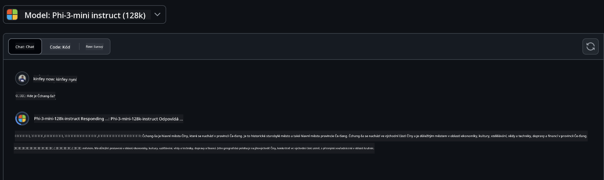
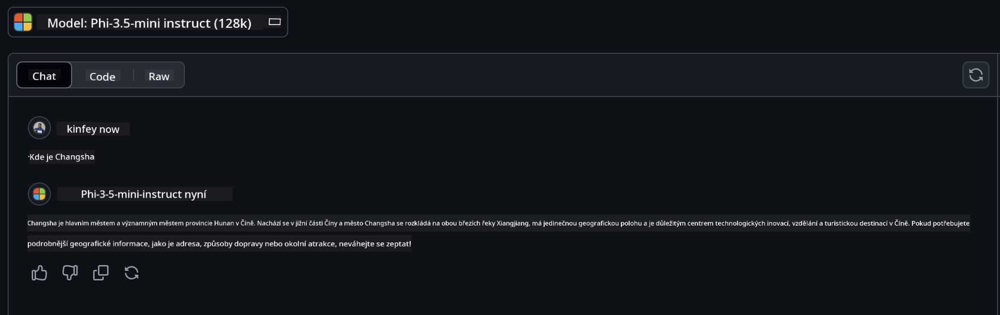

<!--
CO_OP_TRANSLATOR_METADATA:
{
  "original_hash": "124ad36cfe96f74038811b6e2bb93e9d",
  "translation_date": "2025-06-26T02:48:26+00:00",
  "source_file": "19-slm/README.md",
  "language_code": "cs"
}
-->

Modely jsou nejpřímější cestou. Můžete rychle získat přístup k modelu Phi-3/3.5-Instruct prostřednictvím GitHub Models. V kombinaci s Azure AI Inference SDK / OpenAI SDK můžete získat přístup k API prostřednictvím kódu pro dokončení volání Phi-3/3.5-Instruct. Můžete také testovat různé efekty prostřednictvím Playground. - Demo: Srovnání efektů Phi-3-mini a Phi-3.5-mini v čínských scénářích   **Azure AI Studio** Nebo pokud chceme používat modely vision a MoE, můžete použít Azure AI Studio pro dokončení volání. Pokud máte zájem, můžete si přečíst Phi-3 Cookbook a naučit se, jak volat Phi-3/3.5 Instruct, Vision, MoE prostřednictvím Azure AI Studio [Klikněte na tento odkaz](https://github.com/microsoft/Phi-3CookBook/blob/main/md/02.QuickStart/AzureAIStudio_QuickStart.md?WT.mc_id=academic-105485-koreyst) **NVIDIA NIM** Kromě cloudových řešení Model Catalog poskytovaných Azure a GitHub můžete také použít [Nivida NIM](https://developer.nvidia.com/nim?WT.mc_id=academic-105485-koreyst) pro dokončení souvisejících volání. Můžete navštívit NIVIDA NIM pro dokončení volání API rodiny Phi-3/3.5. NVIDIA NIM (NVIDIA Inference Microservices) je sada akcelerovaných inference mikroslužeb navržených tak, aby pomohly vývojářům efektivně nasadit AI modely napříč různými prostředími, včetně cloudů, datových center a pracovních stanic. Zde jsou některé klíčové vlastnosti NVIDIA NIM: - **Snadnost nasazení:** NIM umožňuje nasazení AI modelů jediným příkazem, což usnadňuje integraci do stávajících pracovních postupů. - **Optimalizovaný výkon:** Využívá předoptimalizované inference enginy NVIDIA, jako jsou TensorRT a TensorRT-LLM, aby zajistil nízkou latenci a vysokou propustnost. - **Škálovatelnost:** NIM podporuje autoscaling na Kubernetes, což mu umožňuje efektivně zvládat různé pracovní zatížení. - **Bezpečnost a kontrola:** Organizace mohou udržovat kontrolu nad svými daty a aplikacemi hostováním NIM mikroslužeb na vlastní spravované infrastruktuře. - **Standardní API:** NIM poskytuje průmyslové standardní API, což usnadňuje vytváření a integraci AI aplikací, jako jsou chatboti, AI asistenti a další. NIM je součástí NVIDIA AI Enterprise, která má za cíl zjednodušit nasazení a provozování AI modelů, čímž zajišťuje jejich efektivní běh na NVIDIA GPU. - Demo: Použití Nividia NIM pro volání Phi-3.5-Vision-API [[Klikněte na tento odkaz](../../../19-slm/python/Phi-3-Vision-Nividia-NIM.ipynb)] ### Inference Phi-3/3.5 v lokálním prostředí Inference ve vztahu k Phi-3, nebo jakémukoliv jazykovému modelu jako GPT-3, se týká procesu generování odpovědí nebo předpovědí na základě vstupu, který obdrží. Když poskytnete podnět nebo otázku Phi-3, použije svůj vytrénovaný neuronový síťový model k odvození nejpravděpodobnější a nejrelevantnější odpovědi analýzou vzorců a vztahů v datech, na kterých byl vytrénován. **Hugging Face Transformer** Hugging Face Transformers je výkonná knihovna určená pro zpracování přirozeného jazyka (NLP) a další úkoly strojového učení. Zde jsou některé klíčové body o ní: 1. **Předtrénované modely**: Poskytuje tisíce předtrénovaných modelů, které lze použít pro různé úkoly, jako je klasifikace textu, rozpoznávání pojmenovaných entit, odpovídání na otázky, shrnutí, překlad a generování textu. 2. **Interoperabilita rámců**: Knihovna podporuje více rámců hlubokého učení, včetně PyTorch, TensorFlow a JAX. To vám umožňuje trénovat model v jednom rámci a používat ho v jiném. 3. **Multimodální schopnosti**: Kromě NLP podporuje Hugging Face Transformers také úkoly v počítačovém vidění (např. klasifikace obrázků, detekce objektů) a zpracování zvuku (např. rozpoznávání řeči, klasifikace zvuku). 4. **Snadnost použití**: Knihovna nabízí API a nástroje pro snadné stahování a doladění modelů, což ji činí přístupnou jak pro začátečníky, tak pro odborníky. 5. **Komunita a zdroje**: Hugging Face má živou komunitu a rozsáhlou dokumentaci, tutoriály a průvodce, které uživatelům pomáhají začít a co nejlépe využít knihovnu. [oficiální dokumentace](https://huggingface.co/docs/transformers/index?WT.mc_id=academic-105485-koreyst) nebo jejich [GitHub repozitář](https://github.com/huggingface/transformers?WT.mc_id=academic-105485-koreyst). Toto je nejčastěji používaná metoda, ale také vyžaduje akceleraci GPU. Koneckonců, scény jako Vision a MoE vyžadují hodně výpočtů, což bude velmi omezené na CPU, pokud nebudou kvantizovány. - Demo: Použití Transformeru pro volání Phi-3.5-Instuct [Klikněte na tento odkaz](../../../19-slm/python/phi35-instruct-demo.ipynb) - Demo: Použití Transformeru pro volání Phi-3.5-Vision [Klikněte na tento odkaz](../../../19-slm/python/phi35-vision-demo.ipynb) - Demo: Použití Transformeru pro volání Phi-3.5-MoE [Klikněte na tento odkaz](../../../19-slm/python/phi35_moe_demo.ipynb) **Ollama** [Ollama](https://ollama.com/?WT.mc_id=academic-105485-koreyst) je platforma navržená tak, aby usnadnila běh velkých jazykových modelů (LLM) lokálně na vašem počítači. Podporuje různé modely jako Llama 3.1, Phi 3, Mistral a Gemma 2, mimo jiné. Platforma zjednodušuje proces tím, že balí váhy modelu, konfiguraci a data do jednoho balíčku, což uživatelům usnadňuje přizpůsobení a vytváření vlastních modelů. Ollama je k dispozici pro macOS, Linux a Windows. Je to skvělý nástroj, pokud chcete experimentovat nebo nasadit LLM bez spoléhání se na cloudové služby. Ollama je nejpřímější cestou, stačí jen spustit následující příkaz. ```bash

ollama run phi3.5

``` **ONNX Runtime pro GenAI** [ONNX Runtime](https://github.com/microsoft/onnxruntime-genai?WT.mc_id=academic-105485-koreyst) je multiplatformní akcelerátor strojového učení pro inference a trénink. ONNX Runtime pro Generative AI (GENAI) je výkonný nástroj, který vám pomůže efektivně provozovat generativní AI modely napříč různými platformami. ## Co je ONNX Runtime? ONNX Runtime je open-source projekt, který umožňuje vysoce výkonnou inferenci strojových modelů. Podporuje modely ve formátu Open Neural Network Exchange (ONNX), což je standard pro reprezentaci strojových modelů. Inference ONNX Runtime může umožnit rychlejší zákaznické zkušenosti a nižší náklady, podporuje modely z rámců hlubokého učení, jako jsou PyTorch a TensorFlow/Keras, stejně jako klasické strojové knihovny, jako jsou scikit-learn, LightGBM, XGBoost atd. ONNX Runtime je kompatibilní s různým hardwarem, ovladači a operačními systémy a poskytuje optimální výkon využitím hardwarových akcelerátorů tam, kde je to možné, spolu s optimalizacemi grafu a transformacemi. ## Co je Generative AI? Generative AI se týká AI systémů, které mohou generovat nový obsah, jako je text, obrázky nebo hudba, na základě dat, na kterých byly vytrénovány. Příklady zahrnují jazykové modely jako GPT-3 a modely generování obrázků jako Stable Diffusion. Knihovna ONNX Runtime pro GenAI poskytuje generativní AI smyčku pro ONNX modely, včetně inference s ONNX Runtime, zpracování logitů, vyhledávání a vzorkování a správy KV cache. ## ONNX Runtime pro GENAI ONNX Runtime pro GENAI rozšiřuje schopnosti ONNX Runtime pro podporu generativních AI modelů. Zde jsou některé klíčové vlastnosti: - **Široká podpora platforem:** Funguje na různých platformách, včetně Windows, Linux, macOS, Android a iOS. - **Podpora modelů:** Podporuje mnoho populárních generativních AI modelů, jako jsou LLaMA, GPT-Neo, BLOOM a další. - **Optimalizace výkonu:** Zahrnuje optimalizace pro různé hardwarové akcelerátory, jako jsou NVIDIA GPU, AMD GPU a další. - **Snadnost použití:** Poskytuje API pro snadnou integraci do aplikací, což vám umožňuje generovat text, obrázky a další obsah s minimálním kódem - Uživatelé mohou volat vysoce úroveň generate() metody nebo spustit každou iteraci modelu v smyčce, generující jeden token najednou, a volitelně aktualizovat generování parametrů uvnitř smyčky. - ONNX runtime také podporuje greedy/beam vyhledávání a TopP, TopK vzorkování pro generování sekvencí tokenů a vestavěné zpracování logitů jako opakovací tresty. Můžete také snadno přidat vlastní skórování. ## Začínáme Chcete-li začít s ONNX Runtime pro GENAI, můžete postupovat podle těchto kroků: ### Instalace ONNX Runtime: ```Python
pip install onnxruntime
``` ### Instalace rozšíření pro Generative AI: ```Python
pip install onnxruntime-genai
``` ### Spuštění modelu: Zde je jednoduchý příklad v Pythonu: ```Python
import onnxruntime_genai as og

model = og.Model('path_to_your_model.onnx')

tokenizer = og.Tokenizer(model)

input_text = "Hello, how are you?"

input_tokens = tokenizer.encode(input_text)

output_tokens = model.generate(input_tokens)

output_text = tokenizer.decode(output_tokens)

print(output_text) 
``` ### Demo: Použití ONNX Runtime GenAI pro volání Phi-3.5-Vision ```python

import onnxruntime_genai as og

model_path = './Your Phi-3.5-vision-instruct ONNX Path'

img_path = './Your Image Path'

model = og.Model(model_path)

processor = model.create_multimodal_processor()

tokenizer_stream = processor.create_stream()

text = "Your Prompt"

prompt = "<|user|>\n"

prompt += "<|image_1|>\n"

prompt += f"{text}<|end|>\n"

prompt += "<|assistant|>\n"

image = og.Images.open(img_path)

inputs = processor(prompt, images=image)

params = og.GeneratorParams(model)

params.set_inputs(inputs)

params.set_search_options(max_length=3072)

generator = og.Generator(model, params)

while not generator.is_done():

    generator.compute_logits()
    
    generator.generate_next_token()

    new_token = generator.get_next_tokens()[0]
    
    code += tokenizer_stream.decode(new_token)
    
    print(tokenizer_stream.decode(new_token), end='', flush=True)

``` **Ostatní** Kromě referenčních metod ONNX Runtime a Ollama můžeme také dokončit referenci kvantitativních modelů na základě referenčních metod modelů poskytovaných různými výrobci. Například Apple MLX framework s Apple Metal, Qualcomm QNN s NPU, Intel OpenVINO s CPU/GPU atd. Další obsah můžete také získat z [Phi-3 Cookbook](https://github.com/microsoft/phi-3cookbook?WT.mc_id=academic-105485-koreyst) ## Více Naučili jsme se základy rodiny Phi-3/3.5, ale abychom se naučili více o SLM, potřebujeme více znalostí. Odpovědi můžete najít v Phi-3 Cookbook. Pokud se chcete dozvědět více, navštivte prosím [Phi-3 Cookbook](https://github.com/microsoft/phi-3cookbook?WT.mc_id=academic-105485-koreyst).

**Upozornění**:  
Tento dokument byl přeložen pomocí služby AI pro překlad [Co-op Translator](https://github.com/Azure/co-op-translator). I když se snažíme o přesnost, mějte prosím na paměti, že automatizované překlady mohou obsahovat chyby nebo nepřesnosti. Původní dokument ve svém rodném jazyce by měl být považován za autoritativní zdroj. Pro důležité informace je doporučen profesionální lidský překlad. Nejsme zodpovědní za jakékoli nedorozumění nebo nesprávné interpretace vyplývající z použití tohoto překladu.