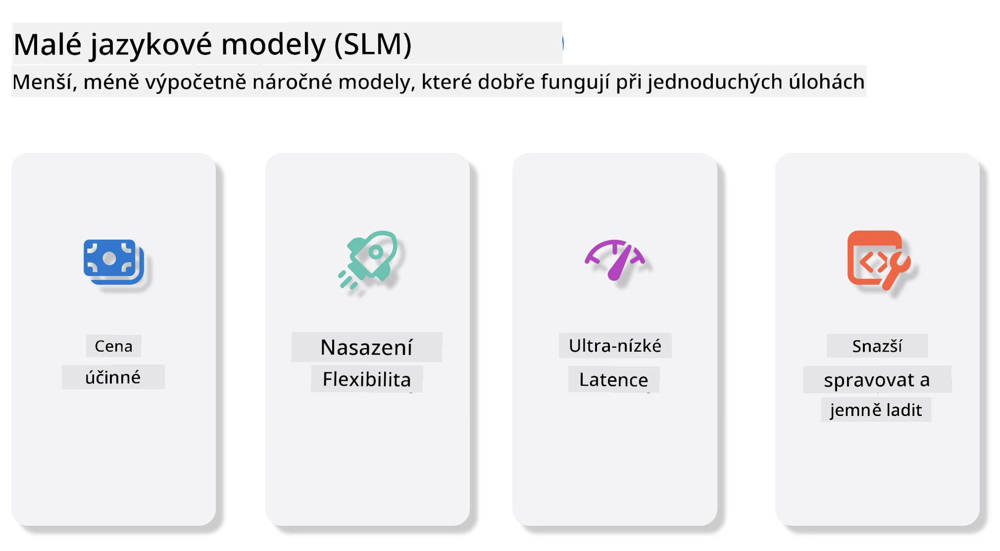
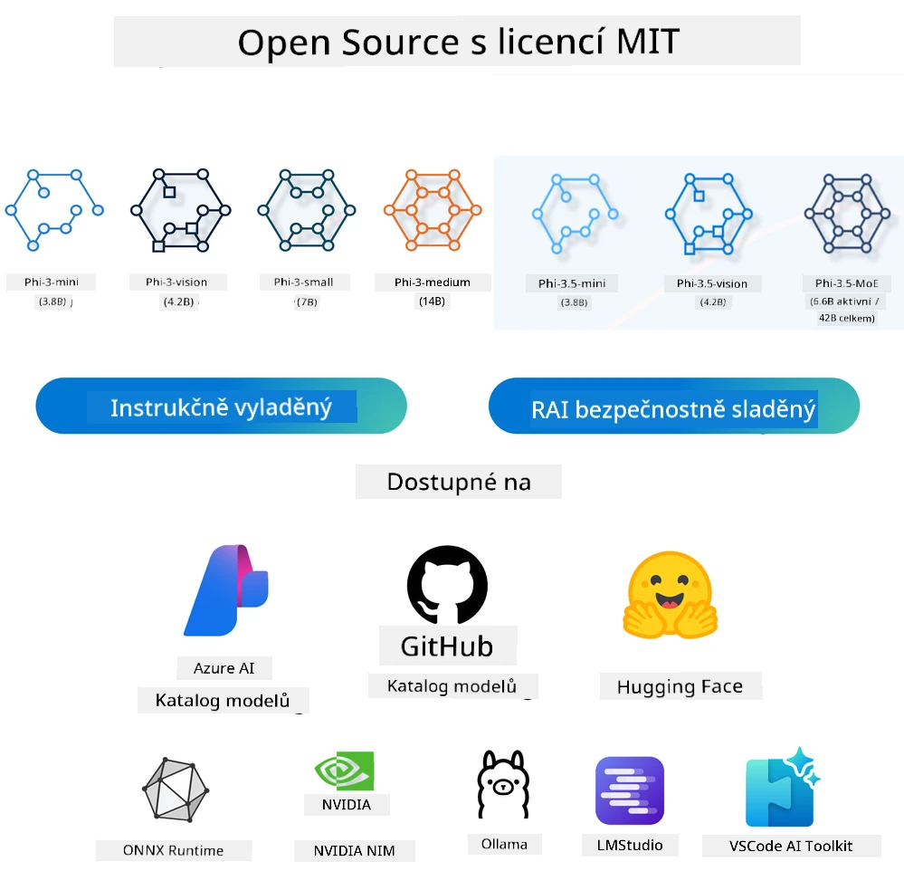
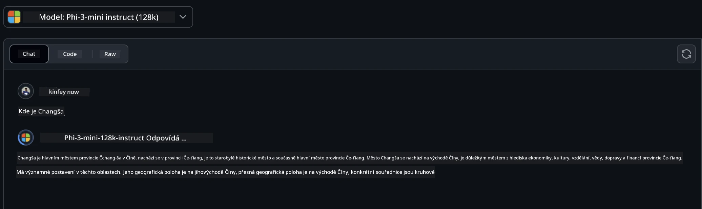
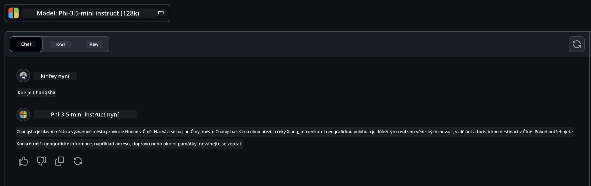

# Úvod do malých jazykových modelů pro generativní AI pro začátečníky
Generativní AI je fascinující oblast umělé inteligence, která se zaměřuje na vytváření systémů schopných generovat nový obsah. Tento obsah může zahrnovat texty, obrázky, hudbu nebo dokonce celé virtuální prostředí. Jednou z nejzajímavějších aplikací generativní AI je oblast jazykových modelů.

## Co jsou malé jazykové modely?

Malý jazykový model (SLM) představuje zmenšenou variantu velkého jazykového modelu (LLM), využívající mnoho architektonických principů a technik LLM, přičemž vykazuje výrazně sníženou výpočetní náročnost.

SLM jsou podmnožinou jazykových modelů navržených k tvorbě textu podobného lidskému. Na rozdíl od svých větších protějšků, jako je GPT-4, jsou SLM kompaktnější a efektivnější, což je činí ideálními pro aplikace, kde jsou omezené výpočetní zdroje. Přestože jsou menší, dokáží plnit řadu úkolů. Obvykle jsou SLM konstruovány kompresí nebo destilací LLM, s cílem zachovat značnou část původní funkčnosti a jazykových schopností. Toto zmenšení velikosti modelu snižuje celkovou složitost, díky čemuž jsou SLM efektivnější z hlediska paměťové náročnosti i výpočetních požadavků. Navzdory těmto optimalizacím jsou SLM schopny zvládat širokou škálu úloh zpracování přirozeného jazyka (NLP):

- Generování textu: Tvorba soudržných a kontextuálně relevantních vět nebo odstavců.
- Dokončování textu: Predikce a doplnění vět na základě daného promptu.
- Překlad: Převod textu z jednoho jazyka do druhého.
- Shrnutí: Zkrácení rozsáhlých textů do kratších, lépe stravitelných shrnutí.

Ačkoliv s určitými kompromisy v oblasti výkonu nebo hloubky porozumění ve srovnání s jejich většími protějšky.

## Jak malé jazykové modely fungují?
SLM jsou trénovány na obrovských množstvích textových dat. Během tréninku se učí vzory a struktury jazyka, což jim umožňuje generovat text gramaticky správný a kontextuálně vhodný. Proces tréninku zahrnuje:

- Sběr dat: Shromáždění velkých datasetů textu z různých zdrojů.
- Předzpracování: Čištění a organizování dat tak, aby byla vhodná pro trénink.
- Trénování: Použití algoritmů strojového učení k naučení modelu porozumět a generovat text.
- Doladění (Fine-Tuning): Úprava modelu ke zlepšení výkonu v konkrétních úlohách.

Vývoj SLM odpovídá rostoucí potřebě modelů, které mohou být nasazeny v prostředích s omezenými zdroji, jako jsou mobilní zařízení nebo edge computing platformy, kde by plnohodnotné LLM mohly být nepraktické vzhledem k jejich vysokým nárokům na zdroje. Zaměřením na efektivitu balancují SLM výkon s dostupností a umožňují širší využití v různých oblastech.



## Výukové cíle

V této lekci se doufáme, že představíme znalosti o SLM a spojíme je s Microsoft Phi-3, abychom se naučili různé scénáře v oblasti textového obsahu, vidění a MoE.

Na konci této lekce byste měli umět odpovědět na následující otázky:

- Co je SLM?
- Jaký je rozdíl mezi SLM a LLM?
- Co je rodina Microsoft Phi-3/3.5?
- Jak spustit inferenci s rodinou Microsoft Phi-3/3.5?

Připraveni? Pojďme začít.

## Rozdíly mezi velkými jazykovými modely (LLM) a malými jazykovými modely (SLM)

Oba modely, LLM i SLM, jsou postaveny na základních principech pravděpodobnostního strojového učení a sledují podobné přístupy v architektonickém návrhu, metodikách tréninku, procesech generování dat a technikách hodnocení modelu. Nicméně, několik klíčových faktorů tyto dva typy modelů odlišuje.

## Použití malých jazykových modelů

SLM mají široké spektrum použití, mezi něž patří:

- Chatboti: Poskytování zákaznické podpory a interakce s uživateli konverzačním způsobem.
- Tvorba obsahu: Pomoc spisovatelům generováním nápadů nebo dokonce návrhů celých článků.
- Vzdělávání: Pomoc studentům s psaním úkolů nebo učením se novým jazykům.
- Přístupnost: Vytváření nástrojů pro osoby se zdravotním postižením, například systémy převodu textu na řeč.

**Velikost**

Hlavní rozdíl mezi LLM a SLM spočívá ve velikosti modelů. LLM, jako ChatGPT (GPT-4), může obsahovat odhadovaných 1,76 bilionu parametrů, zatímco open-source SLM jako Mistral 7B mají výrazně méně parametrů – přibližně 7 miliard. Tento rozdíl je způsoben především rozdíly v architektuře modelu a procesech tréninku. Například ChatGPT používá mechanismus self-attention v rámci architektury encoder-decoder, zatímco Mistral 7B využívá sliding window attention, což umožňuje efektivnější trénink v rámci modelu založeného pouze na decoderu. Tento architektonický rozdíl má zásadní dopad na složitost a výkon těchto modelů.

**Porozumění**

SLM jsou obvykle optimalizovány pro výkon v konkrétních doménách, což je činí vysoce specializovanými, ale potenciálně omezenými ve schopnosti poskytovat široké kontextové porozumění přes více oblastí znalostí. Naopak LLM se snaží simulovat lidskou inteligenci na komplexnější úrovni. Jsou trénovány na rozsáhlých a různorodých datech, navrženy tak, aby dobře fungovaly v různých doménách, a nabízejí větší všestrannost a adaptabilitu. Proto jsou LLM vhodnější pro širší škálu následných úloh, jako je zpracování přirozeného jazyka a programování.

**Výpočetní náročnost**

Trénink a nasazení LLM jsou procesy náročné na zdroje a často vyžadují rozsáhlou výpočetní infrastrukturu, včetně velkých GPU clusterů. Například trénink modelu jako ChatGPT od nuly může vyžadovat tisíce GPU po dlouhou dobu. Naopak SLM, díky svému menšímu počtu parametrů, jsou dostupnější z hlediska výpočetních zdrojů. Modely jako Mistral 7B lze trénovat a provozovat na lokálních strojích vybavených středně výkonnými GPU, i když trénink stále vyžaduje několik hodin na více GPU.

**Bias (Předpojatost)**

Bias je známý problém u LLM, který pramení především z povahy tréninkových dat. Tyto modely často spoléhají na surová, veřejně dostupná data z internetu, která mohou podreprezentovat nebo nesprávně zobrazovat některé skupiny, obsahovat chybné označení nebo odrážet jazykové předsudky způsobené dialekty, geografickými rozdíly a gramatickými pravidly. Navíc složitost architektur LLM může tyto předsudky nechtěně zesílit, což může být bez pečlivého ladění těžko rozpoznatelné. Na druhé straně jsou SLM, trénovány na úzce zaměřených, doménově specifických datech, inherentně méně náchylné k takovým biasům, i když nejsou vůči nim zcela imunní.

**Inference**

Menší velikost SLM jim poskytuje významnou výhodu v rychlosti inference, což jim umožňuje efektivní generování výstupů na lokálním hardwaru bez potřeby rozsáhlého paralelního zpracování. Naopak LLM kvůli své velikosti a složitosti často vyžadují značné paralelní výpočetní zdroje k dosažení přijatelných časů inference. Přítomnost více současných uživatelů pak zpomaluje odezvu LLM, zvláště při nasazení ve velkém měřítku.

Shrnuto, ačkoliv LLM i SLM sdílejí základy ve strojovém učení, výrazně se liší ve velikosti modelu, požadavcích na zdroje, schopnosti porozumění kontextu, náchylnosti k předsudkům a rychlosti inference. Tyto rozdíly reflektují jejich vhodnost pro různé scénáře použití, přičemž LLM jsou všestrannější, ale náročnější na zdroje, zatímco SLM nabízejí efektivitu zaměřenou na konkrétní domény s nižšími výpočetními požadavky.

***Poznámka: V této lekci představíme SLM na příkladu Microsoft Phi-3 / 3.5.***

## Představení rodiny Phi-3 / Phi-3.5

Rodina Phi-3 / 3.5 je primárně určena pro textové, vizuální a Agentní (MoE) aplikační scénáře:

### Phi-3 / 3.5 Instruct

Hlavně pro generování textu, dokončování chatů a extrakci obsahových informací atd.

**Phi-3-mini**

Jazykový model s 3,8 miliardami parametrů je dostupný na Microsoft Azure AI Studio, Hugging Face a Ollama. Modely Phi-3 výrazně překonávají jazykové modely stejné i větší velikosti na klíčových benchmarkech (viz benchmarková čísla níže, vyšší hodnota znamená lepší výsledek). Phi-3-mini překonává modely s dvojnásobnou velikostí, zatímco Phi-3-small a Phi-3-medium překonávají větší modely, včetně GPT-3.5.

**Phi-3-small & medium**

S pouhými 7 miliardami parametrů Phi-3-small poráží GPT-3.5T v různých jazykových, rozumových, programovacích a matematických benchmarkech.

Phi-3-medium s 14 miliardami parametrů pokračuje v tomto trendu a překonává Gemini 1.0 Pro.

**Phi-3.5-mini**

Můžeme jej vnímat jako upgradovanou verzi Phi-3-mini. Parametry zůstávají nezměněny, ale zlepšuje schopnost podporovat více jazyků (podpora 20+ jazyků: arabština, čínština, čeština, dánština, holandština, angličtina, finština, francouzština, němčina, hebrejština, maďarština, italština, japonština, korejština, norština, polština, portugalština, ruština, španělština, švédština, thajština, turečtina, ukrajinština) a přidává silnější podporu pro dlouhé kontexty.

Phi-3.5-mini s 3,8 miliardami parametrů překonává jazykové modely stejné velikosti a je srovnatelný s modely dvojnásobné velikosti.

### Phi-3 / 3.5 Vision

Můžeme Instruct model Phi-3/3.5 považovat za schopnost Phi porozumět, a Vision je tím, co Phi dává oči, aby rozuměla světu.

**Phi-3-Vision**

Phi-3-Vision, s pouhými 4,2 miliardami parametrů, pokračuje v trendu a překonává větší modely jako Claude-3 Haiku a Gemini 1.0 Pro V v úlohách obecného vizuálního rozumování, OCR a porozumění tabulkám a diagramům.

**Phi-3.5-Vision**

Phi-3.5-Vision je také upgradem Phi-3-Vision, přidává podporu pro více obrázků. Můžete si to představit jako vylepšení vidění – nevidíte jen obrázky, ale také videa.

Phi-3.5-Vision překonává větší modely jako Claude-3.5 Sonnet a Gemini 1.5 Flash v úlohách OCR, porozumění tabulkám a grafům a je na stejné úrovni v úlohách obecného vizuálního znalostního rozumování. Podporuje vícerámcové vstupy, tedy provádí rozumování na více vstupních obrázcích.

### Phi-3.5-MoE

***Mix expertů (MoE)*** umožňuje modelům být předtrénovány s výrazně nižší výpočetní náročností, což znamená, že můžete dramaticky zvětšit velikost modelu nebo datasetu při stejném výpočetním rozpočtu jako u hustého modelu (dense modelu). Zejména by model MoE měl dosáhnout stejné kvality jako jeho hustý protějšek mnohem rychleji během předtréninku.

Phi-3.5-MoE sestává z 16x3,8 miliard parametrů expertů. Phi-3.5-MoE s pouhými 6,6 miliardami aktivních parametrů dosahuje podobné úrovně v oblasti rozumování, porozumění jazyka a matematiky jako mnohem větší modely.

Rodinu modelů Phi-3/3.5 můžeme používat podle různých scénářů. Na rozdíl od LLM lze Phi-3/3.5-mini nebo Phi-3/3.5-Vision nasadit na edge zařízeních.

## Jak používat modely rodiny Phi-3/3.5

Doufáme, že využijeme Phi-3/3.5 v různých scénářích. Následně budeme používat Phi-3/3.5 podle různých scénářů.



### Inferenční volání přes Cloud API

**GitHub Models**

GitHub Models je nejpřímější cesta. Můžete rychle získat přístup k modelu Phi-3/3.5-Instruct přes GitHub Models. V kombinaci s Azure AI Inference SDK / OpenAI SDK lze přes kód přistupovat k API a provádět volání Phi-3/3.5-Instruct. Také můžete testovat různé funkce přes Playground.

- Demo: Porovnání výkonu Phi-3-mini a Phi-3.5-mini v čínských scénářích





**Azure AI Studio**

Pokud chcete využít modely Vision a MoE, můžete ke spuštění použít Azure AI Studio. Pokud máte zájem, můžete si přečíst Phi-3 Cookbook, kde se naučíte, jak volat Phi-3/3.5 Instruct, Vision, MoE přes Azure AI Studio [Klikněte na tento odkaz](https://github.com/microsoft/Phi-3CookBook/blob/main/md/02.QuickStart/AzureAIStudio_QuickStart.md?WT.mc_id=academic-105485-koreyst)

**NVIDIA NIM**

Kromě cloudových řešení Model Catalog nabízených Azure a GitHub můžete také použít [NVIDIA NIM](https://developer.nvidia.com/nim?WT.mc_id=academic-105485-koreyst) k provedení příslušných volání. Můžete navštívit NVIDIA NIM a provádět API volání rodiny Phi-3/3.5. NVIDIA NIM (NVIDIA Inference Microservices) je sada akcelerovaných inferenčních mikroservis navržených pomoci vývojářům efektivně nasadit AI modely v různých prostředích, včetně cloudů, datových center a pracovních stanic.

Zde jsou některé klíčové vlastnosti NVIDIA NIM:
- **Snadné nasazení:** NIM umožňuje nasazení AI modelů jedním příkazem, což usnadňuje integraci do stávajících pracovních postupů.
- **Optimalizovaný výkon:** Využívá předem optimalizované inferenční enginy NVIDIA, jako jsou TensorRT a TensorRT-LLM, aby zajistil nízkou latenci a vysokou propustnost.
- **Škálovatelnost:** NIM podporuje autoskalování na Kubernetes, což umožňuje efektivně zvládat různé pracovní zatížení.
- **Bezpečnost a kontrola:** Organizace si mohou udržet kontrolu nad svými daty a aplikacemi tím, že samy provozují microservices NIM na své vlastní spravované infrastruktuře.
- **Standardní API:** NIM poskytuje průmyslové standardní API, což usnadňuje vytváření a integraci AI aplikací jako jsou chatboti, AI asistenti a další.

NIM je součástí NVIDIA AI Enterprise, které si klade za cíl zjednodušit nasazení a provoz AI modelů a zajistit jejich efektivní běh na GPU NVIDIA.

- Demo: Použití NVIDIA NIM pro volání Phi-3.5-Vision-API  [[Klikněte na tento odkaz](./python/Phi-3-Vision-Nividia-NIM.ipynb?WT.mc_id=academic-105485-koreyst)]


### Lokální spuštění Phi-3/3.5
Inferencí ve vztahu k Phi-3 nebo jakémukoli jazykovému modelu jako GPT-3 se rozumí proces generování odpovědí nebo předpovědí na základě zadaného vstupu. Když Phi-3 poskytnete výzvu nebo otázku, využije svůj trénovaný neuronový síťový model k tomu, aby odvodil nejpravděpodobnější a nejrelevantnější odpověď analýzou vzorů a vztahů v datech, na kterých byl trénován.

**Hugging Face Transformer**
Hugging Face Transformers je výkonná knihovna navržená pro zpracování přirozeného jazyka (NLP) a další úlohy strojového učení. Zde jsou některé klíčové body:

1. **Předtrénované modely:** Poskytuje tisíce předtrénovaných modelů, které lze využít pro různé úkoly jako klasifikace textu, rozpoznávání pojmenovaných entit, odpovídání na otázky, shrnování, překlad a generování textu.

2. **Interoperabilita rámců:** Knihovna podporuje více frameworků hlubokého učení, včetně PyTorch, TensorFlow a JAX. To umožňuje trénování modelu v jednom rámci a použití v jiném.

3. **Multimodální schopnosti:** Kromě NLP Hugging Face Transformers podporuje také úlohy v oblasti počítačového vidění (např. klasifikace obrázků, detekce objektů) a zpracování zvuku (např. rozpoznání řeči, klasifikace zvuků).

4. **Snadné použití:** Knihovna nabízí API a nástroje pro jednoduché stahování a doladění modelů, což ji zpřístupňuje jak začátečníkům, tak odborníkům.

5. **Komunita a zdroje:** Hugging Face má živou komunitu a rozsáhlou dokumentaci, výukové materiály a návody, které pomáhají uživatelům začít a využít knihovnu naplno.
[oficiální dokumentace](https://huggingface.co/docs/transformers/index?WT.mc_id=academic-105485-koreyst) nebo jejich [GitHub repozitář](https://github.com/huggingface/transformers?WT.mc_id=academic-105485-koreyst).

Toto je nejběžnější metoda, ale také vyžaduje akceleraci pomocí GPU. Koneckonců scénáře jako Vision a MoE vyžadují hodně výpočtů, které budou na CPU velmi pomalé, pokud nejsou kvantizovány.


- Demo: Použití Transformeru pro volání Phi-3.5-Instruct [Klikněte na tento odkaz](./python/phi35-instruct-demo.ipynb?WT.mc_id=academic-105485-koreyst)

- Demo: Použití Transformeru pro volání Phi-3.5-Vision [Klikněte na tento odkaz](./python/phi35-vision-demo.ipynb?WT.mc_id=academic-105485-koreyst)

- Demo: Použití Transformeru pro volání Phi-3.5-MoE [Klikněte na tento odkaz](./python/phi35_moe_demo.ipynb?WT.mc_id=academic-105485-koreyst)

**Ollama**
[Ollama](https://ollama.com/?WT.mc_id=academic-105485-koreyst) je platforma navržená tak, aby usnadnila lokální spuštění velkých jazykových modelů (LLM) na vašem počítači. Podporuje různé modely jako Llama 3.1, Phi 3, Mistral a Gemma 2, mezi dalšími. Platforma zjednodušuje proces tím, že bundluje váhy modelu, konfiguraci a data do jednoho balíčku, což uživatelům usnadňuje přizpůsobení a tvorbu vlastních modelů. Ollama je dostupná pro macOS, Linux a Windows. Je to skvělý nástroj, pokud chcete experimentovat s LLM nebo je nasadit bez spoléhání na cloudové služby. Ollama je nejpřímější cesta, stačí jen spustit následující příkaz.


```bash

ollama run phi3.5

```


**ONNX Runtime pro GenAI**

[ONNX Runtime](https://github.com/microsoft/onnxruntime-genai?WT.mc_id=academic-105485-koreyst) je multiplatformní akcelerátor pro inferenci a trénink strojového učení. ONNX Runtime pro Generative AI (GENAI) je výkonný nástroj, který vám pomáhá efektivně spouštět generativní AI modely napříč různými platformami.

## Co je ONNX Runtime?
ONNX Runtime je open-source projekt, který umožňuje vysokovýkonnou inferenci modelů strojového učení. Podporuje modely ve formátu Open Neural Network Exchange (ONNX), což je standard pro reprezentaci modelů strojového učení. Inferenci v ONNX Runtime může umožnit rychlejší zákaznické zážitky a nižší náklady, přičemž podporuje modely z frameworků hlubokého učení jako PyTorch a TensorFlow/Keras, stejně jako klasické knihovny strojového učení jako scikit-learn, LightGBM, XGBoost atd. ONNX Runtime je kompatibilní s různým hardwarem, ovladači a operačními systémy a poskytuje optimální výkon díky využití hardwarových akcelerátorů spolu s optimalizacemi a transformacemi grafu.

## Co je Generative AI?
Generativní AI označuje AI systémy, které dokážou generovat nový obsah, jako je text, obrázky nebo hudba, na základě dat, na kterých byly trénovány. Příklady zahrnují jazykové modely jako GPT-3 a modely pro generování obrázků jako Stable Diffusion. Knihovna ONNX Runtime pro GenAI poskytuje generativní AI smyčku pro ONNX modely, včetně inferencí pomocí ONNX Runtime, zpracování logitů, vyhledávání a vzorkování a správy KV cache.

## ONNX Runtime pro GENAI
ONNX Runtime pro GENAI rozšiřuje schopnosti ONNX Runtime tak, aby podporoval generativní AI modely. Zde jsou některé klíčové vlastnosti:

- **Široká podpora platforem:** Funguje na různých platformách, včetně Windows, Linux, macOS, Android a iOS.
- **Podpora modelů:** Podporuje mnoho populárních generativních AI modelů, jako jsou LLaMA, GPT-Neo, BLOOM a další.
- **Optimalizace výkonu:** Obsahuje optimalizace pro různé hardwarové akcelerátory, jako jsou NVIDIA GPU, AMD GPU a další.
- **Snadné použití:** Poskytuje API pro snadnou integraci do aplikací, umožňující generovat text, obrázky a další obsah s minimálním množstvím kódu.
- Uživatelé mohou volat vysokou úroveň metodu generate(), nebo spouštět jednotlivé iterace modelu v cyklu, generovat jeden token po tokenu a volitelně aktualizovat parametry generování uvnitř cyklu.
- ONNX runtime také podporuje greedy/beam vyhledávání a TopP, TopK vzorkování pro generování sekvencí tokenů a vestavěné zpracování logitů jako penalizace opakování. Lze také jednoduše přidat vlastní skórování.

## Začínáme
Chcete-li začít s ONNX Runtime pro GENAI, můžete postupovat podle těchto kroků:

### Instalujte ONNX Runtime:
```Python
pip install onnxruntime
```
### Instalujte rozšíření pro Generativní AI:
```Python
pip install onnxruntime-genai
```

### Spusťte model: Zde je jednoduchý příklad v Pythonu:
```Python
import onnxruntime_genai as og

model = og.Model('path_to_your_model.onnx')

tokenizer = og.Tokenizer(model)

input_text = "Hello, how are you?"

input_tokens = tokenizer.encode(input_text)

output_tokens = model.generate(input_tokens)

output_text = tokenizer.decode(output_tokens)

print(output_text) 
```
### Demo:Použití ONNX Runtime GenAI pro volání Phi-3.5-Vision


```python

import onnxruntime_genai as og

model_path = './Your Phi-3.5-vision-instruct ONNX Path'

img_path = './Your Image Path'

model = og.Model(model_path)

processor = model.create_multimodal_processor()

tokenizer_stream = processor.create_stream()

text = "Your Prompt"

prompt = "<|user|>\n"

prompt += "<|image_1|>\n"

prompt += f"{text}<|end|>\n"

prompt += "<|assistant|>\n"

image = og.Images.open(img_path)

inputs = processor(prompt, images=image)

params = og.GeneratorParams(model)

params.set_inputs(inputs)

params.set_search_options(max_length=3072)

generator = og.Generator(model, params)

while not generator.is_done():

    generator.compute_logits()
    
    generator.generate_next_token()

    new_token = generator.get_next_tokens()[0]
    
    output = tokenizer_stream.decode(new_token)
    
    print(tokenizer_stream.decode(new_token), end='', flush=True)

```


**Další**

Kromě ONNX Runtime a Ollama referenčních metod můžeme také doplnit referenci kvantitativních modelů na základě referenčních metod dodávaných různými výrobci. Například Apple MLX framework s Apple Metal, Qualcomm QNN s NPU, Intel OpenVINO s CPU/GPU atd. Více obsahu naleznete také v [Phi-3 Cookbook](https://github.com/microsoft/phi-3cookbook?WT.mc_id=academic-105485-koreyst)


## Další informace

Naučili jsme se základy rodiny Phi-3/3.5, ale k lepšímu pochopení SLM potřebujeme více znalostí. Odpovědi najdete v Phi-3 Cookbook. Pokud se chcete dozvědět více, navštivte prosím [Phi-3 Cookbook](https://github.com/microsoft/phi-3cookbook?WT.mc_id=academic-105485-koreyst).

---

<!-- CO-OP TRANSLATOR DISCLAIMER START -->
**Prohlášení o vyloučení odpovědnosti**:  
Tento dokument byl přeložen za použití služby AI překladatele [Co-op Translator](https://github.com/Azure/co-op-translator). Ačkoli usilujeme o přesnost, mějte prosím na paměti, že automatické překlady mohou obsahovat chyby nebo nepřesnosti. Původní dokument v jeho rodném jazyce by měl být považován za autoritativní zdroj. Pro zásadní informace se doporučuje profesionální lidský překlad. Za jakákoli nedorozumění nebo nesprávné interpretace vyplývající z použití tohoto překladu neneseme odpovědnost.
<!-- CO-OP TRANSLATOR DISCLAIMER END -->