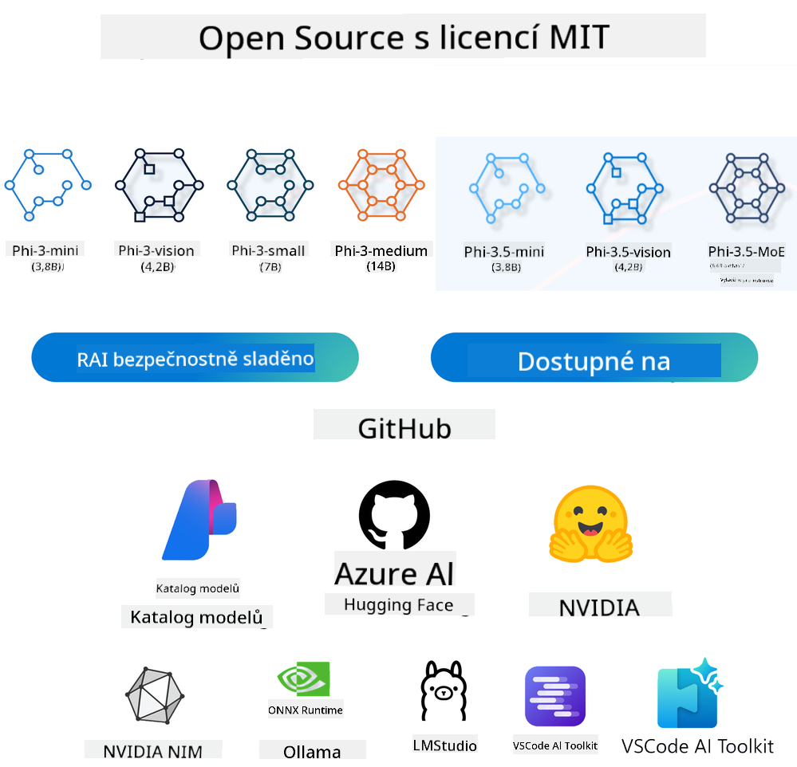
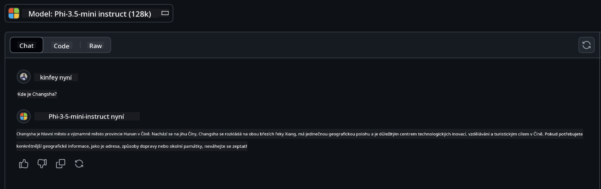

<!--
CO_OP_TRANSLATOR_METADATA:
{
  "original_hash": "124ad36cfe96f74038811b6e2bb93e9d",
  "translation_date": "2025-07-09T18:45:36+00:00",
  "source_file": "19-slm/README.md",
  "language_code": "cs"
}
-->
# Úvod do malých jazykových modelů pro generativní AI pro začátečníky
Generativní AI je fascinující oblast umělé inteligence, která se zaměřuje na vytváření systémů schopných generovat nový obsah. Tento obsah může zahrnovat texty, obrázky, hudbu nebo dokonce celé virtuální prostředí. Jednou z nejzajímavějších aplikací generativní AI jsou jazykové modely.

## Co jsou malé jazykové modely?

Malý jazykový model (SLM) představuje zmenšenou verzi velkého jazykového modelu (LLM), která využívá mnoho architektonických principů a technik LLM, ale s výrazně nižšími nároky na výpočetní výkon.

SLM jsou podmnožinou jazykových modelů navržených k generování textu podobného lidskému. Na rozdíl od svých větších protějšků, jako je GPT-4, jsou SLM kompaktnější a efektivnější, což je ideální pro aplikace s omezenými výpočetními zdroji. Přestože jsou menší, dokážou zvládnout různé úkoly. Obvykle jsou SLM vytvořeny kompresí nebo destilací LLM, s cílem zachovat podstatnou část původní funkčnosti a jazykových schopností modelu. Tato redukce velikosti modelu snižuje celkovou složitost, díky čemuž jsou SLM efektivnější jak z hlediska paměti, tak výpočetních požadavků. Přes tyto optimalizace mohou SLM stále vykonávat širokou škálu úloh zpracování přirozeného jazyka (NLP):

- Generování textu: Tvorba koherentních a kontextuálně relevantních vět nebo odstavců.
- Dokončování textu: Predikce a doplnění vět na základě zadaného podnětu.
- Překlad: Převod textu z jednoho jazyka do druhého.
- Shrnutí: Zkrácení dlouhých textů do kratších, snadněji stravitelných souhrnů.

S určitými kompromisy v oblasti výkonu nebo hloubky porozumění ve srovnání s většími modely.

## Jak malé jazykové modely fungují?
SLM jsou trénovány na obrovském množství textových dat. Během tréninku se učí vzory a struktury jazyka, což jim umožňuje generovat text, který je gramaticky správný a kontextuálně vhodný. Proces tréninku zahrnuje:

- Sběr dat: Shromažďování rozsáhlých textových datasetů z různých zdrojů.
- Předzpracování: Čištění a organizaci dat tak, aby byla vhodná pro trénink.
- Trénink: Použití algoritmů strojového učení k naučení modelu porozumět a generovat text.
- Doladění: Úpravu modelu pro zlepšení výkonu na konkrétních úlohách.

Vývoj SLM odpovídá rostoucí potřebě modelů, které lze nasadit v prostředích s omezenými zdroji, jako jsou mobilní zařízení nebo edge computing platformy, kde by plnohodnotné LLM byly kvůli vysokým nárokům nepraktické. Díky zaměření na efektivitu SLM vyvažují výkon a dostupnost, což umožňuje širší využití v různých oblastech.


## Výukové cíle

V této lekci si přejeme představit znalosti o SLM a spojit je s Microsoft Phi-3, abychom se naučili různé scénáře v oblasti textového obsahu, vidění a MoE.

Na konci této lekce byste měli být schopni odpovědět na následující otázky:

- Co je SLM
- Jaký je rozdíl mezi SLM a LLM
- Co je Microsoft Phi-3/3.5 Family
- Jak provádět inference s Microsoft Phi-3/3.5 Family

Jste připraveni? Pojďme na to.

## Rozdíly mezi velkými jazykovými modely (LLM) a malými jazykovými modely (SLM)

Oba, LLM i SLM, jsou postaveny na základních principech pravděpodobnostního strojového učení a používají podobné přístupy v architektuře, metodách tréninku, generování dat a hodnocení modelů. Nicméně několik klíčových faktorů tyto dva typy modelů odlišuje.

## Aplikace malých jazykových modelů

SLM mají široké spektrum využití, včetně:

- Chatboti: Poskytování zákaznické podpory a komunikace s uživateli v konverzačním stylu.
- Tvorba obsahu: Pomoc spisovatelům generováním nápadů nebo dokonce návrhů celých článků.
- Vzdělávání: Pomoc studentům s psaním úkolů nebo učením nových jazyků.
- Přístupnost: Vytváření nástrojů pro osoby s postižením, například systémy převodu textu na řeč.

**Velikost**

Hlavní rozdíl mezi LLM a SLM spočívá ve velikosti modelů. LLM, jako je ChatGPT (GPT-4), mohou mít odhadovaných 1,76 bilionu parametrů, zatímco open-source SLM jako Mistral 7B jsou navrženy s výrazně menším počtem parametrů – přibližně 7 miliard. Tento rozdíl je způsoben především odlišnostmi v architektuře modelu a tréninkových procesech. Například ChatGPT využívá mechanismus self-attention v rámci encoder-decoder architektury, zatímco Mistral 7B používá sliding window attention, což umožňuje efektivnější trénink v rámci decoder-only modelu. Tato architektonická odlišnost má zásadní dopad na složitost a výkon modelů.

**Porozumění**

SLM jsou obvykle optimalizovány pro výkon v konkrétních doménách, což je činí vysoce specializovanými, ale potenciálně omezenými v poskytování širokého kontextuálního porozumění napříč různými oblastmi znalostí. Naopak LLM se snaží simulovat lidskou inteligenci na komplexnější úrovni. Jsou trénovány na rozsáhlých a různorodých datech, aby dobře fungovaly v různých doménách, nabízejí větší všestrannost a přizpůsobivost. Proto jsou LLM vhodnější pro širší spektrum úloh, jako je zpracování přirozeného jazyka a programování.

**Výpočetní nároky**

Trénink a nasazení LLM jsou náročné na zdroje a často vyžadují rozsáhlou výpočetní infrastrukturu, včetně velkých GPU clusterů. Například trénink modelu jako ChatGPT od začátku může vyžadovat tisíce GPU po dlouhou dobu. Naopak SLM, díky menšímu počtu parametrů, jsou dostupnější z hlediska výpočetních zdrojů. Modely jako Mistral 7B lze trénovat a provozovat na lokálních strojích s mírnými GPU kapacitami, i když trénink stále vyžaduje několik hodin na více GPU.

**Bias (předpojatost)**

Bias je známý problém u LLM, především kvůli povaze tréninkových dat. Tyto modely často využívají surová, veřejně dostupná data z internetu, která mohou některé skupiny nedostatečně zastupovat nebo zkreslovat, obsahovat chybné označení nebo odrážet jazykové předsudky ovlivněné dialekty, geografickými rozdíly a gramatickými pravidly. Navíc složitost architektury LLM může nechtěně bias ještě zhoršovat, což může zůstat bez povšimnutí bez pečlivého doladění. Naopak SLM, trénované na omezenějších, doménově specifických datech, jsou přirozeně méně náchylné k takovým biasům, i když nejsou zcela imunní.

**Inference**

Menší velikost SLM jim poskytuje výraznou výhodu v rychlosti inference, což jim umožňuje efektivně generovat výstupy na lokálním hardwaru bez potřeby rozsáhlého paralelního zpracování. LLM naopak kvůli své velikosti a složitosti často vyžadují značné paralelní výpočetní zdroje, aby dosáhly přijatelné doby odezvy. Přítomnost více současných uživatelů dále zpomaluje reakční časy LLM, zejména při nasazení ve velkém měřítku.

Shrnuto, ačkoliv LLM i SLM sdílejí základní principy strojového učení, výrazně se liší ve velikosti modelu, požadavcích na zdroje, schopnosti kontextuálního porozumění, náchylnosti k biasu a rychlosti inference. Tyto rozdíly odrážejí jejich vhodnost pro různé případy použití – LLM jsou univerzálnější, ale náročnější na zdroje, zatímco SLM nabízejí efektivitu v konkrétních doménách s nižšími výpočetními nároky.

***Poznámka: V této kapitole představíme SLM na příkladu Microsoft Phi-3 / 3.5.***

## Představení rodiny Phi-3 / Phi-3.5

Rodina Phi-3 / 3.5 je zaměřena především na scénáře textu, vidění a Agent (MoE):

### Phi-3 / 3.5 Instruct

Hlavně pro generování textu, dokončování konverzací a extrakci informací z obsahu.

**Phi-3-mini**

Jazykový model s 3,8 miliardami parametrů je dostupný na Microsoft Azure AI Studio, Hugging Face a Ollama. Modely Phi-3 výrazně překonávají jazykové modely stejné nebo větší velikosti v klíčových benchmarkech (viz níže, vyšší čísla znamenají lepší výsledky). Phi-3-mini překonává modely dvojnásobné velikosti, zatímco Phi-3-small a Phi-3-medium překonávají i větší modely, včetně GPT-3.5.

**Phi-3-small & medium**

S pouhými 7 miliardami parametrů Phi-3-small překonává GPT-3.5T v různých jazykových, logických, programovacích a matematických benchmarkech.

Phi-3-medium s 14 miliardami parametrů pokračuje v tomto trendu a překonává Gemini 1.0 Pro.

**Phi-3.5-mini**

Můžeme jej považovat za vylepšení Phi-3-mini. Parametry zůstávají stejné, ale zlepšuje schopnost podpory více jazyků (podpora více než 20 jazyků: arabština, čínština, čeština, dánština, nizozemština, angličtina, finština, francouzština, němčina, hebrejština, maďarština, italština, japonština, korejština, norština, polština, portugalština, ruština, španělština, švédština, thajština, turečtina, ukrajinština) a přidává silnější podporu pro dlouhý kontext.

Phi-3.5-mini s 3,8 miliardami parametrů překonává jazykové modely stejné velikosti a je srovnatelný s modely dvojnásobné velikosti.

### Phi-3 / 3.5 Vision

Můžeme si představit Instruct model Phi-3/3.5 jako schopnost Phi rozumět, a Vision je to, co Phi dává oči k pochopení světa.

**Phi-3-Vision**

Phi-3-vision s pouhými 4,2 miliardami parametrů pokračuje v tomto trendu a překonává větší modely jako Claude-3 Haiku a Gemini 1.0 Pro V v obecných úlohách vizuálního uvažování, OCR a porozumění tabulkám a diagramům.

**Phi-3.5-Vision**

Phi-3.5-Vision je také vylepšením Phi-3-Vision, přidává podporu pro více obrázků. Můžete si to představit jako zlepšení vidění – nejenže vidíte obrázky, ale i videa.

Phi-3.5-vision překonává větší modely jako Claude-3.5 Sonnet a Gemini 1.5 Flash v úlohách OCR, porozumění tabulkám a grafům a je srovnatelný v obecných úlohách vizuálního uvažování. Podporuje vícerámcový vstup, tedy uvažování nad více vstupními obrázky.

### Phi-3.5-MoE

***Mixture of Experts (MoE)*** umožňuje modelům být předtrénovány s mnohem menšími výpočetními nároky, což znamená, že můžete dramaticky zvětšit velikost modelu nebo datasetu při stejném výpočetním rozpočtu jako u hustého modelu. Konkrétně by měl MoE model dosáhnout stejné kvality jako jeho hustý protějšek mnohem rychleji během předtréninku.

Phi-3.5-MoE se skládá z 16x3,8 miliard parametrů expertů. Phi-3.5-MoE s pouhými 6,6 miliardami aktivních parametrů dosahuje podobné úrovně uvažování, porozumění jazyku a matematiky jako mnohem větší modely.

Modely rodiny Phi-3/3.5 můžeme používat podle různých scénářů. Na rozdíl od LLM můžete nasadit Phi-3/3.5-mini nebo Phi-3/3.5-Vision na edge zařízeních.

## Jak používat modely rodiny Phi-3/3.5

Chceme využít Phi-3/3.5 v různých scénářích. Následující část ukáže použití Phi-3/3.5 podle různých scénářů.



### Rozdíly v inferenci přes cloudové API

**GitHub Models**

GitHub Models je nejpřímější cesta. Můžete rychle získat přístup k modelu Phi-3/3.5-Instruct přes GitHub Models. V kombinaci s Azure AI Inference SDK / OpenAI SDK můžete přistupovat k API přes kód a dokončit volání Phi-3/3.5-Instruct. Různé efekty můžete také testovat přes Playground.

- Demo: Porovnání efektů Phi-3-mini a Phi-3.5-mini v čínských scénářích




**Azure AI Studio**

Pokud chcete používat modely Vision a MoE, můžete využít Azure AI Studio k dokončení volání. Pokud máte zájem, můžete si přečíst Phi-3 Cookbook, kde se naučíte, jak volat Phi-3/3.5 Instruct, Vision a MoE přes Azure AI Studio [Klikněte na tento odkaz](https://github.com/microsoft/Phi-3CookBook/blob/main/md/02.QuickStart/AzureAIStudio_QuickStart.md?WT.mc_id=academic-105485-koreyst)

**NVIDIA NIM**

Kromě cloudových řešení Model Catalog poskytovaných Azure a GitHub můžete také použít [NVIDIA NIM](https://developer.nvidia.com/nim?WT.mc_id=academic-105485-koreyst) k dokončení příslušných volání. Navštivte NVIDIA NIM pro API volání rodiny Phi-3/3.5. NVIDIA NIM (NVIDIA Inference Microservices) je sada akcelerovaných mikroservisů pro inference, navržených tak, aby pomohly vývojářům efektivně nasazovat AI modely v různých prostředích, včetně cloudů, datových center a pracovních stanic.

Některé klíčové vlastnosti NVIDIA NIM:

- **Snadné nasazení:** NIM umožňuje nasazení AI modelů jediným příkazem, což usnadňuje integraci do stávajících pracovních postupů.
- **Optimalizovaný výkon:** Využívá předoptimalizované inference enginy NVIDIA, jako jsou TensorRT a TensorRT-LLM, pro zajištění nízké latence a vysoké propustnosti.
- **Škálovatelnost:** NIM podporuje autoscaling na Kubernetes, což umožňuje efektivně zvládat proměnlivou zátěž.
- **Bezpečnost a kontrola:** Organizace si mohou udržet kontrolu nad svými daty a aplikacemi tím, že budou NIM mikroslužby provozovat na vlastní spravované infrastruktuře.
- **Standardní API:** NIM poskytuje průmyslově standardizovaná API, což usnadňuje vytváření a integraci AI aplikací, jako jsou chatboti, AI asistenti a další.

NIM je součástí NVIDIA AI Enterprise, jehož cílem je zjednodušit nasazení a provoz AI modelů a zajistit jejich efektivní běh na NVIDIA GPU.

- Demo: Použití Nvidia NIM pro volání Phi-3.5-Vision-API [[Klikněte zde](python/Phi-3-Vision-Nividia-NIM.ipynb)]


### Inference Phi-3/3.5 v lokálním prostředí
Inference ve vztahu k Phi-3, nebo jakémukoli jazykovému modelu jako GPT-3, znamená proces generování odpovědí nebo předpovědí na základě vstupu, který model obdrží. Když zadáte prompt nebo otázku Phi-3, využívá svůj natrénovaný neuronový model k odvození nejpravděpodobnější a nejrelevantnější odpovědi analýzou vzorců a vztahů v datech, na kterých byl trénován.

**Hugging Face Transformer**  
Hugging Face Transformers je výkonná knihovna určená pro zpracování přirozeného jazyka (NLP) a další úlohy strojového učení. Zde jsou některé klíčové body:

1. **Předtrénované modely:** Nabízí tisíce předtrénovaných modelů, které lze použít pro různé úkoly, jako je klasifikace textu, rozpoznávání pojmenovaných entit, odpovídání na otázky, shrnování, překlad a generování textu.

2. **Podpora více frameworků:** Knihovna podporuje několik frameworků hlubokého učení, včetně PyTorch, TensorFlow a JAX. To umožňuje trénovat model v jednom frameworku a používat ho v jiném.

3. **Multimodální schopnosti:** Kromě NLP podporuje Hugging Face Transformers také úlohy v oblasti počítačového vidění (např. klasifikace obrázků, detekce objektů) a zpracování zvuku (např. rozpoznávání řeči, klasifikace zvuku).

4. **Snadné použití:** Knihovna nabízí API a nástroje pro snadné stahování a doladění modelů, což ji činí přístupnou jak pro začátečníky, tak pro experty.

5. **Komunita a zdroje:** Hugging Face má živou komunitu a rozsáhlou dokumentaci, návody a průvodce, které pomáhají uživatelům začít a co nejlépe využít knihovnu.  
[oficiální dokumentace](https://huggingface.co/docs/transformers/index?WT.mc_id=academic-105485-koreyst) nebo jejich [GitHub repozitář](https://github.com/huggingface/transformers?WT.mc_id=academic-105485-koreyst).

Toto je nejčastěji používaná metoda, ale vyžaduje také GPU akceleraci. Scény jako Vision a MoE totiž vyžadují hodně výpočtů, které by na CPU bez kvantizace byly velmi omezené.


- Demo: Použití Transformeru pro volání Phi-3.5-Instuct [Klikněte zde](python/phi35-instruct-demo.ipynb)

- Demo: Použití Transformeru pro volání Phi-3.5-Vision [Klikněte zde](python/phi35-vision-demo.ipynb)

- Demo: Použití Transformeru pro volání Phi-3.5-MoE [Klikněte zde](python/phi35_moe_demo.ipynb)

**Ollama**  
[Ollama](https://ollama.com/?WT.mc_id=academic-105485-koreyst) je platforma navržená tak, aby usnadnila spuštění velkých jazykových modelů (LLM) lokálně na vašem počítači. Podporuje různé modely jako Llama 3.1, Phi 3, Mistral a Gemma 2 a další. Platforma zjednodušuje proces tím, že balí modelové váhy, konfiguraci a data do jednoho balíčku, což uživatelům usnadňuje přizpůsobení a tvorbu vlastních modelů. Ollama je dostupná pro macOS, Linux a Windows. Je to skvělý nástroj, pokud chcete experimentovat s LLM nebo je nasadit bez závislosti na cloudových službách. Ollama je nejpřímější cesta, stačí spustit následující příkaz.


```bash

ollama run phi3.5

```


**ONNX Runtime pro GenAI**

[ONNX Runtime](https://github.com/microsoft/onnxruntime-genai?WT.mc_id=academic-105485-koreyst) je multiplatformní akcelerátor pro inference a trénink strojového učení. ONNX Runtime pro Generative AI (GENAI) je výkonný nástroj, který vám pomáhá efektivně spouštět generativní AI modely na různých platformách.

## Co je ONNX Runtime?  
ONNX Runtime je open-source projekt, který umožňuje vysoce výkonnou inferenci strojových modelů. Podporuje modely ve formátu Open Neural Network Exchange (ONNX), což je standard pro reprezentaci modelů strojového učení. ONNX Runtime inference může zrychlit zákaznické zkušenosti a snížit náklady, podporuje modely z frameworků hlubokého učení jako PyTorch a TensorFlow/Keras, stejně jako klasické knihovny strojového učení jako scikit-learn, LightGBM, XGBoost a další. ONNX Runtime je kompatibilní s různým hardwarem, ovladači a operačními systémy a poskytuje optimální výkon díky využití hardwarových akcelerátorů tam, kde je to možné, spolu s optimalizacemi a transformacemi grafu.

## Co je Generative AI?  
Generativní AI označuje AI systémy, které dokážou vytvářet nový obsah, jako jsou texty, obrázky nebo hudba, na základě dat, na kterých byly trénovány. Příklady zahrnují jazykové modely jako GPT-3 a modely generování obrázků jako Stable Diffusion. Knihovna ONNX Runtime pro GenAI poskytuje generativní AI smyčku pro ONNX modely, včetně inference s ONNX Runtime, zpracování logitů, vyhledávání a vzorkování a správu KV cache.

## ONNX Runtime pro GENAI  
ONNX Runtime pro GENAI rozšiřuje schopnosti ONNX Runtime o podporu generativních AI modelů. Zde jsou některé klíčové vlastnosti:

- **Široká podpora platforem:** Funguje na různých platformách, včetně Windows, Linux, macOS, Android a iOS.
- **Podpora modelů:** Podporuje mnoho populárních generativních AI modelů, jako jsou LLaMA, GPT-Neo, BLOOM a další.
- **Optimalizace výkonu:** Obsahuje optimalizace pro různé hardwarové akcelerátory jako NVIDIA GPU, AMD GPU a další.
- **Snadné použití:** Poskytuje API pro snadnou integraci do aplikací, umožňující generovat text, obrázky a další obsah s minimem kódu.
- Uživatelé mohou volat vysoce úrovňovou metodu generate(), nebo spouštět každou iteraci modelu v cyklu, generovat jeden token po druhém a volitelně upravovat parametry generování uvnitř cyklu.
- ONNX Runtime také podporuje greedy/beam search a TopP, TopK vzorkování pro generování sekvencí tokenů a vestavěné zpracování logitů jako penalizace opakování. Snadno lze přidat i vlastní skórování.

## Začínáme  
Pro začátek s ONNX Runtime pro GENAI můžete postupovat takto:

### Instalace ONNX Runtime:  
```Python
pip install onnxruntime
```  
### Instalace rozšíření Generative AI:  
```Python
pip install onnxruntime-genai
```

### Spuštění modelu: Zde je jednoduchý příklad v Pythonu:  
```Python
import onnxruntime_genai as og

model = og.Model('path_to_your_model.onnx')

tokenizer = og.Tokenizer(model)

input_text = "Hello, how are you?"

input_tokens = tokenizer.encode(input_text)

output_tokens = model.generate(input_tokens)

output_text = tokenizer.decode(output_tokens)

print(output_text) 
```  
### Demo: Použití ONNX Runtime GenAI pro volání Phi-3.5-Vision


```python

import onnxruntime_genai as og

model_path = './Your Phi-3.5-vision-instruct ONNX Path'

img_path = './Your Image Path'

model = og.Model(model_path)

processor = model.create_multimodal_processor()

tokenizer_stream = processor.create_stream()

text = "Your Prompt"

prompt = "<|user|>\n"

prompt += "<|image_1|>\n"

prompt += f"{text}<|end|>\n"

prompt += "<|assistant|>\n"

image = og.Images.open(img_path)

inputs = processor(prompt, images=image)

params = og.GeneratorParams(model)

params.set_inputs(inputs)

params.set_search_options(max_length=3072)

generator = og.Generator(model, params)

while not generator.is_done():

    generator.compute_logits()
    
    generator.generate_next_token()

    new_token = generator.get_next_tokens()[0]
    
    code += tokenizer_stream.decode(new_token)
    
    print(tokenizer_stream.decode(new_token), end='', flush=True)

```


**Další**

Kromě referenčních metod ONNX Runtime a Ollama můžeme také doplnit reference kvantitativních modelů založených na referenčních metodách modelů poskytovaných různými výrobci. Například Apple MLX framework s Apple Metal, Qualcomm QNN s NPU, Intel OpenVINO s CPU/GPU a další. Více informací najdete také v [Phi-3 Cookbook](https://github.com/microsoft/phi-3cookbook?WT.mc_id=academic-105485-koreyst)


## Více

Naučili jsme se základy rodiny Phi-3/3.5, ale pro hlubší znalosti o SLM potřebujeme více informací. Odpovědi najdete v Phi-3 Cookbook. Pokud chcete vědět víc, navštivte prosím [Phi-3 Cookbook](https://github.com/microsoft/phi-3cookbook?WT.mc_id=academic-105485-koreyst).

**Prohlášení o vyloučení odpovědnosti**:  
Tento dokument byl přeložen pomocí AI překladatelské služby [Co-op Translator](https://github.com/Azure/co-op-translator). I když usilujeme o přesnost, mějte prosím na paměti, že automatické překlady mohou obsahovat chyby nebo nepřesnosti. Původní dokument v jeho mateřském jazyce by měl být považován za autoritativní zdroj. Pro důležité informace se doporučuje profesionální lidský překlad. Nejsme odpovědní za jakékoliv nedorozumění nebo nesprávné výklady vyplývající z použití tohoto překladu.