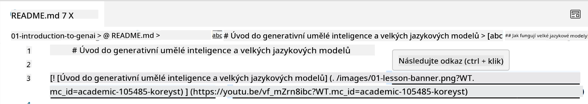
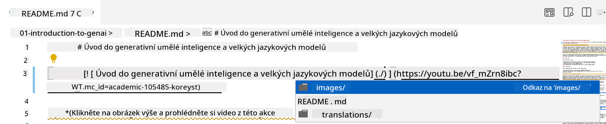
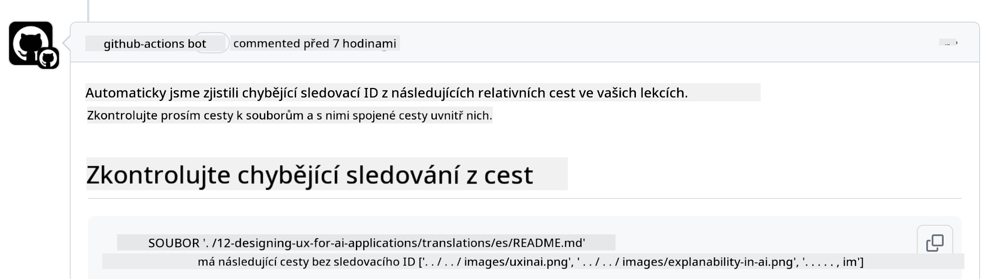
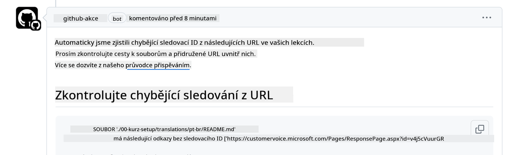
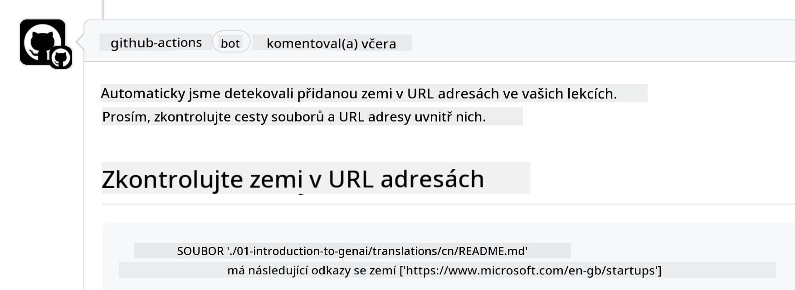

<!--
CO_OP_TRANSLATOR_METADATA:
{
  "original_hash": "57c41f2af71001a2cff9d8eb797cb843",
  "translation_date": "2025-05-19T11:23:47+00:00",
  "source_file": "CONTRIBUTING.md",
  "language_code": "cs"
}
-->
# Přispívání

Tento projekt vítá příspěvky a návrhy. Většina příspěvků vyžaduje, abyste souhlasili s licenční smlouvou pro přispěvatele (CLA), která prohlašuje, že máte právo, a skutečně nám udělujete práva k použití vašeho příspěvku. Podrobnosti najdete na <https://cla.microsoft.com>.

> Důležité: při překládání textu v tomto repozitáři prosím zajistěte, abyste nepoužívali strojový překlad. Překlady ověříme prostřednictvím komunity, takže se dobrovolně přihlaste pouze k překladům do jazyků, které ovládáte.

Když podáte žádost o přetažení (pull request), CLA-bot automaticky zjistí, zda je potřeba poskytnout CLA a upraví PR podle potřeby (např. označení, komentář). Jednoduše postupujte podle pokynů uvedených botem. Toto budete muset udělat pouze jednou napříč všemi repozitáři, které používají náš CLA.

## Kodex chování

Tento projekt přijal [Kodex chování pro otevřený zdroj od Microsoftu](https://opensource.microsoft.com/codeofconduct/?WT.mc_id=academic-105485-koreyst). Pro více informací si přečtěte [FAQ ke kodexu chování](https://opensource.microsoft.com/codeofconduct/faq/?WT.mc_id=academic-105485-koreyst) nebo kontaktujte [opencode@microsoft.com](mailto:opencode@microsoft.com) s jakýmikoliv dalšími otázkami či komentáři.

## Dotaz nebo problém?

Prosím, neotevírejte problémy na GitHubu pro obecné dotazy na podporu, protože seznam GitHubu by měl být používán pro žádosti o funkce a hlášení chyb. Tímto způsobem můžeme snáze sledovat skutečné problémy nebo chyby z kódu a udržovat obecnou diskusi oddělenou od skutečného kódu.

## Překlepy, problémy, chyby a příspěvky

Kdykoliv podáváte jakékoliv změny do repozitáře Generative AI for Beginners, prosím, dodržujte následující doporučení.

* Vždy před provedením úprav forkněte repozitář na svůj účet
* Nekombinujte více změn do jedné žádosti o přetažení. Například, podávejte jakékoliv opravy chyb a aktualizace dokumentace pomocí samostatných PR
* Pokud vaše žádost o přetažení vykazuje konflikty při slučování, ujistěte se, že aktualizujete svůj místní main tak, aby byl zrcadlem toho, co je v hlavním repozitáři, před provedením úprav
* Pokud podáváte překlad, vytvořte jednu PR pro všechny přeložené soubory, protože nepřijímáme částečné překlady obsahu
* Pokud podáváte opravu překlepu nebo dokumentace, můžete kombinovat úpravy do jednoho PR, kde je to vhodné

## Obecné pokyny pro psaní

- Ujistěte se, že všechny vaše URL jsou uzavřeny v hranatých závorkách následovaných závorkou bez dalších mezer kolem nich nebo uvnitř nich ``.
- Ujistěte se, že jakýkoliv relativní odkaz (tj. odkazy na jiné soubory a složky v repozitáři) začíná `./` odkazující na soubor nebo složku umístěnou v aktuálním pracovním adresáři nebo `../` odkazující na soubor nebo složku umístěnou v nadřazeném pracovním adresáři.
- Ujistěte se, že jakýkoliv relativní odkaz (tj. odkazy na jiné soubory a složky v repozitáři) má na konci sledovací ID (tj. `?` nebo `&` a pak `wt.mc_id=` nebo `WT.mc_id=`).
- Ujistěte se, že jakékoliv URL z následujících domén _github.com, microsoft.com, visualstudio.com, aka.ms, a azure.com_ má na konci sledovací ID (tj. `?` nebo `&` a pak `wt.mc_id=` nebo `WT.mc_id=`).
- Ujistěte se, že vaše odkazy nemají v sobě specifickou lokalitu země (tj. `/en-us/` nebo `/en/`).
- Ujistěte se, že všechny obrázky jsou uloženy ve složce `./images`.
- Ujistěte se, že obrázky mají popisné názvy používající anglické znaky, čísla a pomlčky v názvu vašeho obrázku.

## GitHub Workflows

Když podáte žádost o přetažení, spustí se čtyři různé pracovní postupy, které ověří předchozí pravidla. Jednoduše postupujte podle pokynů zde uvedených, abyste prošli kontrolami pracovního postupu.

- [Kontrola nefunkčních relativních cest](../..)
- [Kontrola cest s trackováním](../..)
- [Kontrola URL s trackováním](../..)
- [Kontrola URL bez lokalizace](../..)

### Kontrola nefunkčních relativních cest

Tento pracovní postup zajišťuje, že jakákoliv relativní cesta ve vašich souborech funguje. Tento repozitář je nasazen na GitHub pages, takže musíte být velmi opatrní, když píšete odkazy, které spojují všechno dohromady, aby nikoho neodvedly na špatné místo.

Aby jste se ujistili, že vaše odkazy fungují správně, jednoduše použijte VS code k jejich kontrole.

Například, když se vznášíte nad jakýmkoliv odkazem ve vašich souborech, budete vyzváni, abyste odkaz sledovali stisknutím **ctrl + klik**

Pokud kliknete na odkaz a nefunguje lokálně, pak jistě spustí pracovní postup a nebude fungovat na GitHubu.

K vyřešení tohoto problému se pokuste napsat odkaz s pomocí VS code.

Když napíšete `./` nebo `../`, VS code vás vyzve k výběru z dostupných možností podle toho, co jste napsali.

Sledujte cestu kliknutím na požadovaný soubor nebo složku a budete si jisti, že vaše cesta není přerušená.

Jakmile přidáte správnou relativní cestu, uložte a odešlete své změny, pracovní postup se znovu spustí, aby ověřil vaše změny. Pokud projdete kontrolou, pak jste připraveni.

### Kontrola cest s trackováním

Tento pracovní postup zajišťuje, že jakákoliv relativní cesta má v sobě trackování. Tento repozitář je nasazen na GitHub pages, takže potřebujeme sledovat pohyb mezi různými soubory a složkami.

Aby jste se ujistili, že vaše relativní cesty mají v sobě trackování, jednoduše zkontrolujte následující text `?wt.mc_id=` na konci cesty. Pokud je připojen k vašim relativním cestám, projdete touto kontrolou.

Pokud ne, můžete dostat následující chybu.

K vyřešení tohoto problému se pokuste otevřít cestu souboru, kterou pracovní postup zvýraznil, a přidejte sledovací ID na konec relativních cest.

Jakmile přidáte sledovací ID, uložte a odešlete své změny, pracovní postup se znovu spustí, aby ověřil vaše změny. Pokud projdete kontrolou, pak jste připraveni.

### Kontrola URL s trackováním

Tento pracovní postup zajišťuje, že jakákoliv webová URL má v sobě trackování. Tento repozitář je dostupný všem, takže se musíte ujistit, že sledujete přístup, abyste věděli, odkud přichází provoz.

Aby jste se ujistili, že vaše URL mají v sobě trackování, jednoduše zkontrolujte následující text `?wt.mc_id=` na konci URL. Pokud je připojen k vašim URL, projdete touto kontrolou.

Pokud ne, můžete dostat následující chybu.

K vyřešení tohoto problému se pokuste otevřít cestu souboru, kterou pracovní postup zvýraznil, a přidejte sledovací ID na konec URL.

Jakmile přidáte sledovací ID, uložte a odešlete své změny, pracovní postup se znovu spustí, aby ověřil vaše změny. Pokud projdete kontrolou, pak jste připraveni.

### Kontrola URL bez lokalizace

Tento pracovní postup zajišťuje, že jakákoliv webová URL nemá v sobě specifickou lokalitu země. Tento repozitář je dostupný všem po celém světě, takže se musíte ujistit, že do URL nezahrnujete lokalitu své země.

Aby jste se ujistili, že vaše URL nemají v sobě lokalitu země, jednoduše zkontrolujte následující text `/en-us/` nebo `/en/` nebo jakoukoliv jinou jazykovou lokalitu kdekoliv v URL. Pokud není přítomen ve vašich URL, projdete touto kontrolou.

Pokud ne, můžete dostat následující chybu.

K vyřešení tohoto problému se pokuste otevřít cestu souboru, kterou pracovní postup zvýraznil, a odstraňte lokalitu země z URL.

Jakmile odstraníte lokalitu země, uložte a odešlete své změny, pracovní postup se znovu spustí, aby ověřil vaše změny. Pokud projdete kontrolou, pak jste připraveni.

Gratulujeme! Co nejdříve se vám ozveme s zpětnou vazbou ohledně vašeho příspěvku.

**Upozornění**:  
Tento dokument byl přeložen pomocí AI překladatelské služby [Co-op Translator](https://github.com/Azure/co-op-translator). I když se snažíme o přesnost, mějte prosím na paměti, že automatizované překlady mohou obsahovat chyby nebo nepřesnosti. Původní dokument v jeho rodném jazyce by měl být považován za autoritativní zdroj. Pro kritické informace se doporučuje profesionální lidský překlad. Nezodpovídáme za jakékoli nedorozumění nebo nesprávné interpretace vyplývající z použití tohoto překladu.