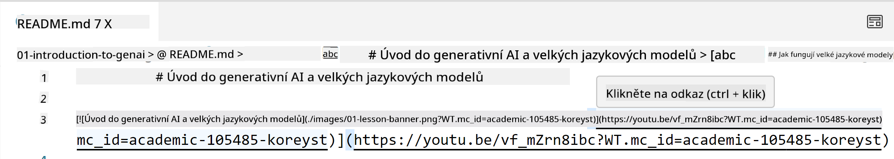
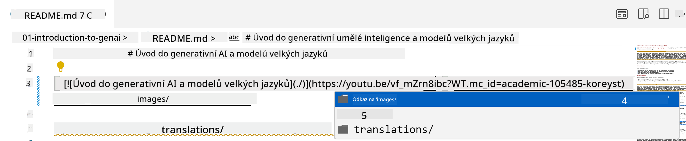
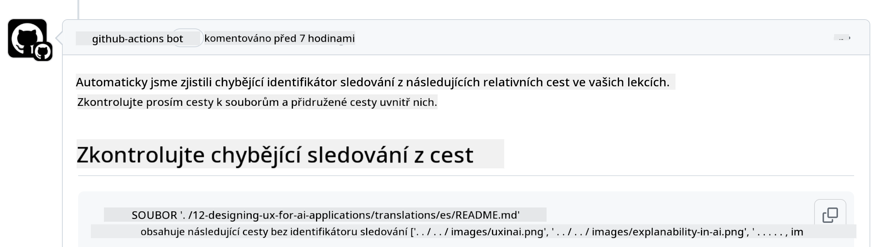
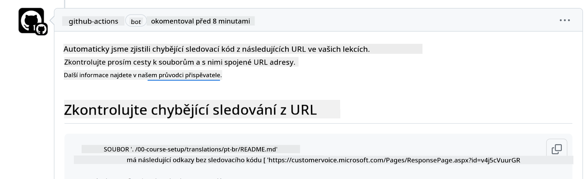
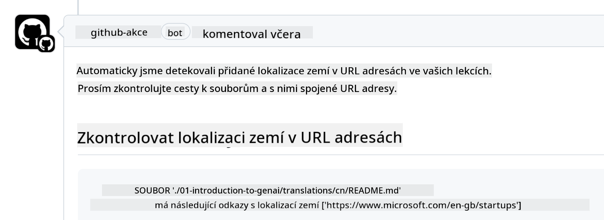

<!--
CO_OP_TRANSLATOR_METADATA:
{
  "original_hash": "57c41f2af71001a2cff9d8eb797cb843",
  "translation_date": "2025-06-25T07:18:14+00:00",
  "source_file": "CONTRIBUTING.md",
  "language_code": "cs"
}
-->
# Přispívání

Tento projekt vítá příspěvky a návrhy. Většina příspěvků vyžaduje, abyste souhlasili s licenční smlouvou pro přispěvatele (CLA), která prohlašuje, že máte právo a skutečně nám poskytujete práva k využití vašeho příspěvku. Podrobnosti naleznete na <https://cla.microsoft.com>.

> Důležité: při překladu textu v tomto repozitáři se ujistěte, že nepoužíváte strojový překlad. Překlady ověříme prostřednictvím komunity, takže se prosím hlaste pouze k překladům do jazyků, ve kterých jste zběhlí.

Když podáte pull request, CLA-bot automaticky určí, zda potřebujete poskytnout CLA a správně označí PR (např. štítek, komentář). Jednoduše postupujte podle pokynů poskytnutých botem. Toto budete muset udělat pouze jednou ve všech repozitářích, které používají naši CLA.

## Kodex chování

Tento projekt přijal [Kodex chování pro otevřený zdroj od Microsoftu](https://opensource.microsoft.com/codeofconduct/?WT.mc_id=academic-105485-koreyst). Pro více informací si přečtěte [FAQ ke Kodexu chování](https://opensource.microsoft.com/codeofconduct/faq/?WT.mc_id=academic-105485-koreyst) nebo kontaktujte [opencode@microsoft.com](mailto:opencode@microsoft.com) s jakýmikoli dalšími otázkami nebo komentáři.

## Dotaz nebo problém?

Prosím, neotvírejte problémy na GitHubu pro obecné dotazy na podporu, protože seznam GitHubu by měl být používán pro požadavky na funkce a hlášení chyb. Tímto způsobem můžeme snadněji sledovat skutečné problémy nebo chyby z kódu a udržet obecnou diskusi oddělenou od skutečného kódu.

## Překlepy, problémy, chyby a příspěvky

Kdykoli odesíláte jakékoli změny do repozitáře Generative AI for Beginners, postupujte podle těchto doporučení.

* Vždy před provedením úprav forkni repozitář do svého účtu
* Nekombinujte více změn do jednoho pull requestu. Například, jakoukoli opravu chyby a aktualizace dokumentace podávejte pomocí samostatných PR
* Pokud váš pull request ukazuje konflikty při slučování, ujistěte se, že aktualizujete svůj lokální main, aby byl zrcadlem toho, co je v hlavním repozitáři, před provedením vašich úprav
* Pokud podáváte překlad, vytvořte jeden PR pro všechny přeložené soubory, protože nepřijímáme částečné překlady obsahu
* Pokud podáváte opravu překlepu nebo dokumentace, můžete kombinovat úpravy do jednoho PR, kde je to vhodné

## Obecné pokyny pro psaní

- Ujistěte se, že všechny vaše URL jsou uzavřeny ve hranatých závorkách následovaných závorkou bez mezer kolem nich nebo uvnitř nich ``.
- Ujistěte se, že jakýkoli relativní odkaz (tj. odkazy na jiné soubory a složky v repozitáři) začíná `./` odkazující na soubor nebo složku umístěnou v aktuálním pracovním adresáři nebo `../` odkazující na soubor nebo složku umístěnou v nadřazeném pracovním adresáři.
- Ujistěte se, že jakýkoli relativní odkaz (tj. odkazy na jiné soubory a složky v repozitáři) má sledovací ID (tj. `?` nebo `&` poté `wt.mc_id=` nebo `WT.mc_id=`) na konci.
- Ujistěte se, že jakékoli URL z následujících domén _github.com, microsoft.com, visualstudio.com, aka.ms, a azure.com_ má sledovací ID (tj. `?` nebo `&` poté `wt.mc_id=` nebo `WT.mc_id=`) na konci.
- Ujistěte se, že vaše odkazy nemají v sobě zemi specifickou lokalizaci (tj. `/en-us/` nebo `/en/`).
- Ujistěte se, že všechny obrázky jsou uloženy ve složce `./images`.
- Ujistěte se, že obrázky mají popisné názvy používající anglické znaky, čísla a pomlčky v názvu vašeho obrázku.

## GitHub Workflows

Když podáte pull request, spustí se čtyři různé pracovní postupy k ověření předchozích pravidel. Jednoduše postupujte podle pokynů uvedených zde, abyste prošli kontrolami pracovního postupu.

- [Zkontrolovat rozbité relativní cesty](../..)
- [Zkontrolovat, zda cesty mají sledování](../..)
- [Zkontrolovat, zda URL mají sledování](../..)
- [Zkontrolovat, zda URL nemají lokalizaci](../..)

### Zkontrolovat rozbité relativní cesty

Tento pracovní postup zajišťuje, že jakákoli relativní cesta ve vašich souborech funguje. Tento repozitář je nasazen na GitHub pages, takže musíte být velmi opatrní při psaní odkazů, které vše spojují, aby nikdo nebyl nasměrován na špatné místo.

Chcete-li se ujistit, že vaše odkazy fungují správně, jednoduše použijte VS code ke kontrole.

Například, když se přesunete myší nad jakýkoli odkaz ve vašich souborech, budete vyzváni k následování odkazu stisknutím **ctrl + klik**

Pokud kliknete na odkaz a nefunguje lokálně, pak jistě spustí pracovní postup a nebude fungovat na GitHubu.

Chcete-li tento problém vyřešit, zkuste napsat odkaz s pomocí VS code.

Když napíšete `./` nebo `../`, VS code vás vyzve k výběru z dostupných možností podle toho, co jste napsali.

Sledujte cestu kliknutím na požadovaný soubor nebo složku a budete si jisti, že vaše cesta není rozbitá.

Jakmile přidáte správnou relativní cestu, uložte a odešlete své změny, pracovní postup bude znovu spuštěn, aby ověřil vaše změny. Pokud projdete kontrolou, pak jste na správné cestě.

### Zkontrolovat, zda cesty mají sledování

Tento pracovní postup zajišťuje, že jakákoli relativní cesta má v sobě sledování. Tento repozitář je nasazen na GitHub pages, takže potřebujeme sledovat pohyb mezi různými soubory a složkami.

Chcete-li se ujistit, že vaše relativní cesty mají v sobě sledování, jednoduše zkontrolujte následující text `?wt.mc_id=` na konci cesty. Pokud je připojen k vašim relativním cestám, pak projdete touto kontrolou.

Pokud ne, můžete obdržet následující chybu.

Chcete-li tento problém vyřešit, zkuste otevřít cestu k souboru, kterou pracovní postup zvýraznil, a přidejte sledovací ID na konec relativních cest.

Jakmile přidáte sledovací ID, uložte a odešlete své změny, pracovní postup bude znovu spuštěn, aby ověřil vaše změny. Pokud projdete kontrolou, pak jste na správné cestě.

### Zkontrolovat, zda URL mají sledování

Tento pracovní postup zajišťuje, že jakékoli webové URL má v sobě sledování. Tento repozitář je dostupný pro všechny, takže se musíte ujistit, že sledujete přístup, abyste věděli, odkud přichází návštěvnost.

Chcete-li se ujistit, že vaše URL mají v sobě sledování, jednoduše zkontrolujte následující text `?wt.mc_id=` na konci URL. Pokud je připojen k vašim URL, pak projdete touto kontrolou.

Pokud ne, můžete obdržet následující chybu.

Chcete-li tento problém vyřešit, zkuste otevřít cestu k souboru, kterou pracovní postup zvýraznil, a přidejte sledovací ID na konec URL.

Jakmile přidáte sledovací ID, uložte a odešlete své změny, pracovní postup bude znovu spuštěn, aby ověřil vaše změny. Pokud projdete kontrolou, pak jste na správné cestě.

### Zkontrolovat, zda URL nemají lokalizaci

Tento pracovní postup zajišťuje, že jakékoli webové URL nemá v sobě zemi specifickou lokalizaci. Tento repozitář je dostupný pro všechny po celém světě, takže se musíte ujistit, že do URL nezahrnujete lokalizaci své země.

Chcete-li se ujistit, že vaše URL nemají v sobě zemi specifickou lokalizaci, jednoduše zkontrolujte následující text `/en-us/` nebo `/en/` nebo jakoukoli jinou jazykovou lokalizaci kdekoli v URL. Pokud není přítomna ve vašich URL, pak projdete touto kontrolou.

Pokud ne, můžete obdržet následující chybu.

Chcete-li tento problém vyřešit, zkuste otevřít cestu k souboru, kterou pracovní postup zvýraznil, a odstranit lokalizaci země z URL.

Jakmile odstraníte lokalizaci země, uložte a odešlete své změny, pracovní postup bude znovu spuštěn, aby ověřil vaše změny. Pokud projdete kontrolou, pak jste na správné cestě.

Gratulujeme! Co nejdříve se vám ozveme s odezvou na váš příspěvek.

**Prohlášení:**
Tento dokument byl přeložen pomocí služby pro automatický překlad [Co-op Translator](https://github.com/Azure/co-op-translator). I když se snažíme o přesnost, mějte prosím na paměti, že automatizované překlady mohou obsahovat chyby nebo nepřesnosti. Původní dokument v jeho rodném jazyce by měl být považován za autoritativní zdroj. Pro důležité informace se doporučuje profesionální lidský překlad. Nejsme odpovědní za žádné nedorozumění nebo chybné interpretace vyplývající z použití tohoto překladu.