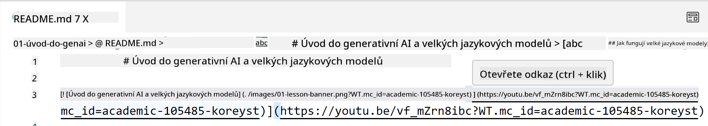
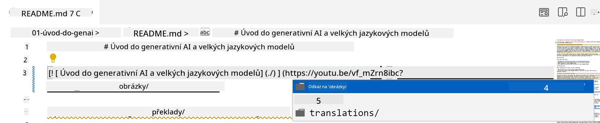
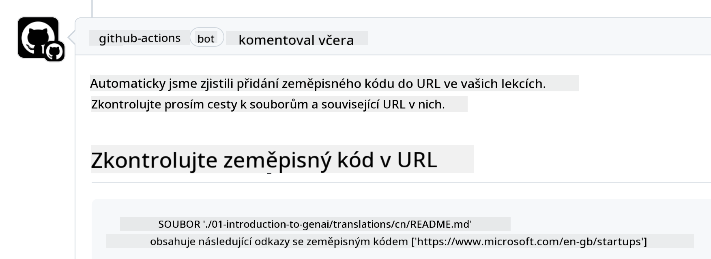

<!--
CO_OP_TRANSLATOR_METADATA:
{
  "original_hash": "57c41f2af71001a2cff9d8eb797cb843",
  "translation_date": "2025-07-09T06:11:43+00:00",
  "source_file": "CONTRIBUTING.md",
  "language_code": "cs"
}
-->
# Přispívání

Tento projekt vítá příspěvky a návrhy. Většina příspěvků vyžaduje, abyste souhlasili s Contributor License Agreement (CLA), ve kterém prohlašujete, že máte právo a skutečně nám udělujete práva k použití vašeho příspěvku. Podrobnosti najdete na <https://cla.microsoft.com>.

> Důležité: při překladu textů v tomto repozitáři prosím nepoužívejte strojový překlad. Překlady budou ověřovány komunitou, proto se prosím přihlašujte k překladu pouze do jazyků, ve kterých jste zdatní.

Když odešlete pull request, CLA-bot automaticky zjistí, zda je potřeba poskytnout CLA, a označí PR odpovídajícím způsobem (např. štítek, komentář). Stačí postupovat podle pokynů bota. Toto budete muset udělat pouze jednou pro všechny repozitáře používající náš CLA.

## Kodex chování

Tento projekt přijal [Microsoft Open Source Code of Conduct](https://opensource.microsoft.com/codeofconduct/?WT.mc_id=academic-105485-koreyst).
Pro více informací si přečtěte [Často kladené otázky k Kodexu chování](https://opensource.microsoft.com/codeofconduct/faq/?WT.mc_id=academic-105485-koreyst) nebo kontaktujte [opencode@microsoft.com](mailto:opencode@microsoft.com) s dalšími dotazy či připomínkami.

## Máte otázku nebo problém?

Prosíme, neotvírejte na GitHubu issues pro obecné dotazy na podporu, protože seznam na GitHubu by měl sloužit pro požadavky na nové funkce a hlášení chyb. Tímto způsobem můžeme lépe sledovat skutečné problémy nebo chyby v kódu a oddělit obecnou diskusi od samotného kódu.

## Překlepy, problémy, chyby a příspěvky

Kdykoli odesíláte změny do repozitáře Generative AI for Beginners, dodržujte prosím následující doporučení.

* Vždy si nejprve vytvořte fork repozitáře na svůj účet, než začnete s úpravami
* Neslučujte více změn do jednoho pull requestu. Například opravy chyb a aktualizace dokumentace odesílejte v samostatných PR
* Pokud váš pull request vykazuje konflikty při slučování, ujistěte se, že máte lokální větev main aktuální a odpovídá hlavnímu repozitáři, než začnete s úpravami
* Pokud odesíláte překlad, vytvořte prosím jeden PR pro všechny přeložené soubory, protože nepřijímáme částečné překlady obsahu
* Pokud odesíláte opravu překlepu nebo dokumentace, můžete vhodně sloučit více úprav do jednoho PR

## Obecná doporučení pro psaní

- Ujistěte se, že všechny vaše URL jsou uzavřeny v hranatých závorkách následovaných kulatými závorkami bez mezer uvnitř ani kolem ``.
- Ujistěte se, že jakýkoli relativní odkaz (tj. odkazy na jiné soubory a složky v repozitáři) začíná `./` odkazujícím na soubor nebo složku v aktuálním pracovním adresáři, nebo `../` odkazujícím na soubor či složku v nadřazeném adresáři.
- Ujistěte se, že jakýkoli relativní odkaz obsahuje na konci sledovací ID (tj. `?` nebo `&` následované `wt.mc_id=` nebo `WT.mc_id=`).
- Ujistěte se, že jakákoli URL z domén _github.com, microsoft.com, visualstudio.com, aka.ms a azure.com_ má na konci sledovací ID (tj. `?` nebo `&` následované `wt.mc_id=` nebo `WT.mc_id=`).
- Ujistěte se, že vaše odkazy neobsahují lokalizaci specifickou pro zemi (např. `/en-us/` nebo `/en/`).
- Ujistěte se, že všechny obrázky jsou uloženy ve složce `./images`.
- Ujistěte se, že obrázky mají popisné názvy používající anglické znaky, čísla a pomlčky.

## GitHub Workflows

Když odešlete pull request, spustí se čtyři různé workflow, které ověří dodržení výše uvedených pravidel.
Stačí postupovat podle pokynů uvedených zde, abyste prošli kontrolami workflow.

- [Kontrola nefunkčních relativních cest](../..)
- [Kontrola, zda cesty obsahují sledování](../..)
- [Kontrola, zda URL obsahují sledování](../..)
- [Kontrola, zda URL neobsahují lokalizaci](../..)

### Kontrola nefunkčních relativních cest

Toto workflow ověřuje, že všechny relativní cesty ve vašich souborech fungují.
Tento repozitář je nasazen na GitHub Pages, proto je potřeba být velmi opatrný při psaní odkazů, aby nikdo nebyl přesměrován na nesprávné místo.

Pro ověření správnosti odkazů jednoduše použijte VS Code.

Například, když najedete myší na jakýkoli odkaz ve vašich souborech, zobrazí se vám možnost otevřít odkaz stisknutím **ctrl + kliknutí**

Pokud na odkaz kliknete a lokálně nefunguje, workflow jej také označí jako chybný a nebude fungovat ani na GitHubu.

Pro opravu zkuste odkaz napsat s pomocí VS Code.

Když začnete psát `./` nebo `../`, VS Code vám nabídne dostupné možnosti podle toho, co jste napsali.

Vyberte cestu kliknutím na požadovaný soubor nebo složku a budete mít jistotu, že cesta není poškozená.

Jakmile přidáte správnou relativní cestu, uložte a pushněte změny, workflow se znovu spustí a ověří vaše úpravy.
Pokud kontrolu projdete, můžete pokračovat.

### Kontrola, zda cesty obsahují sledování

Toto workflow ověřuje, že všechny relativní cesty obsahují sledovací ID.
Repozitář je nasazen na GitHub Pages, proto je potřeba sledovat pohyb mezi různými soubory a složkami.

Pro ověření, že relativní cesty obsahují sledování, zkontrolujte, zda na konci cesty je text `?wt.mc_id=`.
Pokud je přidán, kontrolu projdete.

Pokud ne, může se objevit následující chyba.

Pro opravu otevřete soubor, který workflow označil, a přidejte sledovací ID na konec relativních cest.

Jakmile přidáte sledovací ID, uložte a pushněte změny, workflow se znovu spustí a ověří úpravy.
Pokud kontrolu projdete, můžete pokračovat.

### Kontrola, zda URL obsahují sledování

Toto workflow ověřuje, že všechny webové URL obsahují sledovací ID.
Repozitář je veřejně dostupný, proto je potřeba sledovat přístupy a zjistit, odkud návštěvnost přichází.

Pro ověření, že URL obsahují sledování, zkontrolujte, zda na konci URL je text `?wt.mc_id=`.
Pokud je přidán, kontrolu projdete.

Pokud ne, může se objevit následující chyba.

Pro opravu otevřete soubor, který workflow označil, a přidejte sledovací ID na konec URL.

Jakmile přidáte sledovací ID, uložte a pushněte změny, workflow se znovu spustí a ověří úpravy.
Pokud kontrolu projdete, můžete pokračovat.

### Kontrola, zda URL neobsahují lokalizaci

Toto workflow ověřuje, že žádná webová URL neobsahuje lokalizaci specifickou pro zemi.
Repozitář je dostupný celosvětově, proto je potřeba zajistit, aby URL neobsahovaly lokalizaci vaší země.

Pro ověření, že URL neobsahují lokalizaci, zkontrolujte, zda URL neobsahují text `/en-us/`, `/en/` nebo jinou jazykovou lokalizaci kdekoli v URL.
Pokud není přítomna, kontrolu projdete.

Pokud ano, může se objevit následující chyba.

Pro opravu otevřete soubor, který workflow označil, a odstraňte lokalizaci z URL.

Jakmile lokalizaci odstraníte, uložte a pushněte změny, workflow se znovu spustí a ověří úpravy.
Pokud kontrolu projdete, můžete pokračovat.

Gratulujeme! Ozveme se vám co nejdříve s připomínkami k vašemu příspěvku.

**Prohlášení o vyloučení odpovědnosti**:  
Tento dokument byl přeložen pomocí AI překladatelské služby [Co-op Translator](https://github.com/Azure/co-op-translator). I když usilujeme o přesnost, mějte prosím na paměti, že automatické překlady mohou obsahovat chyby nebo nepřesnosti. Původní dokument v jeho mateřském jazyce by měl být považován za závazný zdroj. Pro důležité informace se doporučuje profesionální lidský překlad. Nejsme odpovědní za jakékoliv nedorozumění nebo nesprávné výklady vyplývající z použití tohoto překladu.