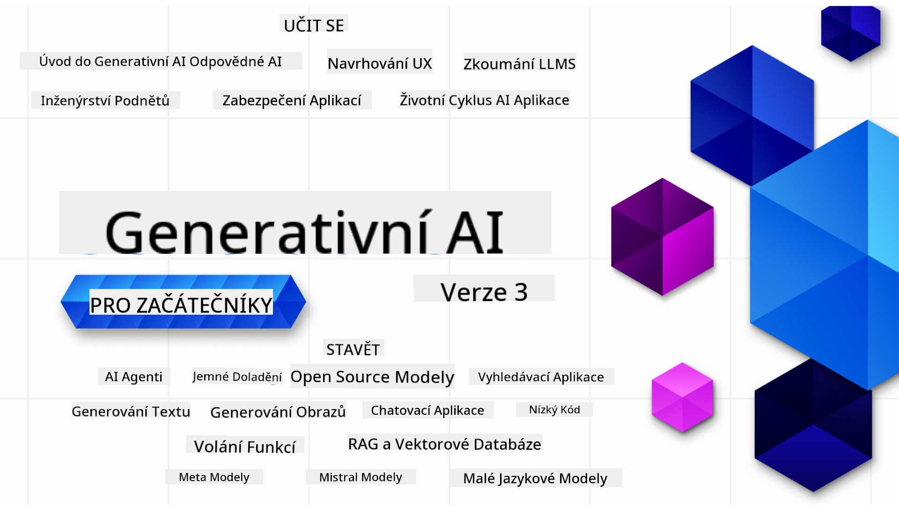

<!--
CO_OP_TRANSLATOR_METADATA:
{
  "original_hash": "ca2afa136ed9aca0634f39f51239746e",
  "translation_date": "2025-08-27T08:52:25+00:00",
  "source_file": "README.md",
  "language_code": "cs"
}
-->

### 21 lekcí, které vás naučí vše, co potřebujete vědět, abyste mohli začít vytvářet aplikace s generativní AI

  
  
  
  
  

  
  
  

### 🌐 Podpora více jazyků

#### Podporováno prostřednictvím GitHub Action (automatizováno a vždy aktuální)

[Francouzština](../fr/README.md) | [Španělština](../es/README.md) | [Němčina](../de/README.md) | [Ruština](../ru/README.md) | [Arabština](../ar/README.md) | [Perština (Farsí)](../fa/README.md) | [Urdu](../ur/README.md) | [Čínština (zjednodušená)](../zh/README.md) | [Čínština (tradiční, Macao)](../mo/README.md) | [Čínština (tradiční, Hongkong)](../hk/README.md) | [Čínština (tradiční, Tchaj-wan)](../tw/README.md) | [Japonština](../ja/README.md) | [Korejština](../ko/README.md) | [Hindština](../hi/README.md) | [Bengálština](../bn/README.md) | [Maráthština](../mr/README.md) | [Nepálština](../ne/README.md) | [Paňdžábština (Gurmukhi)](../pa/README.md) | [Portugalština (Portugalsko)](../pt/README.md) | [Portugalština (Brazílie)](../br/README.md) | [Italština](../it/README.md) | [Litevština](../lt/README.md) | [Polština](../pl/README.md) | [Turečtina](../tr/README.md) | [Řečtina](../el/README.md) | [Thajština](../th/README.md) | [Švédština](../sv/README.md) | [Dánština](../da/README.md) | [Norština](../no/README.md) | [Finština](../fi/README.md) | [Nizozemština](../nl/README.md) | [Hebrejština](../he/README.md) | [Vietnamština](../vi/README.md) | [Indonéština](../id/README.md) | [Malajština](../ms/README.md) | [Tagalog (Filipíny)](../tl/README.md) | [Svahilština](../sw/README.md) | [Maďarština](../hu/README.md) | [Čeština](./README.md) | [Slovenština](../sk/README.md) | [Rumunština](../ro/README.md) | [Bulharština](../bg/README.md) | [Srbština (cyrilice)](../sr/README.md) | [Chorvatština](../hr/README.md) | [Slovinština](../sl/README.md) | [Ukrajinština](../uk/README.md) | [Barmština (Myanmar)](../my/README.md)

# Generativní AI pro začátečníky (verze 3) – Kurz

Naučte se základy tvorby aplikací s generativní AI prostřednictvím našeho komplexního kurzu o 21 lekcích od Microsoft Cloud Advocates.

## 🌱 Začínáme

Tento kurz obsahuje 21 lekcí. Každá lekce pokrývá své vlastní téma, takže můžete začít, kde chcete!

Lekce jsou označeny buď jako "Learn" (naučte se), kde se vysvětluje koncept generativní AI, nebo jako "Build" (vytvořte), kde se kromě konceptu ukazují i příklady kódu v **Pythonu** a **TypeScriptu**, pokud je to možné.

Pro vývojáře v .NET doporučujeme [Generativní AI pro začátečníky (.NET edice)](https://github.com/microsoft/Generative-AI-for-beginners-dotnet?WT.mc_id=academic-105485-koreyst)!

Každá lekce také obsahuje sekci "Keep Learning" s dalšími vzdělávacími nástroji.

## Co budete potřebovat
### Pro spuštění kódu z tohoto kurzu můžete použít:
 - [Azure OpenAI Service](https://aka.ms/genai-beginners/azure-open-ai?WT.mc_id=academic-105485-koreyst) - **Lekce:** "aoai-assignment"  
 - [GitHub Marketplace Model Catalog](https://aka.ms/genai-beginners/gh-models?WT.mc_id=academic-105485-koreyst) - **Lekce:** "githubmodels"  
 - [OpenAI API](https://aka.ms/genai-beginners/open-ai?WT.mc_id=academic-105485-koreyst) - **Lekce:** "oai-assignment"  

- Základní znalost Pythonu nebo TypeScriptu je užitečná - \*Pro úplné začátečníky doporučujeme tyto kurzy [Python](https://aka.ms/genai-beginners/python?WT.mc_id=academic-105485-koreyst) a [TypeScript](https://aka.ms/genai-beginners/typescript?WT.mc_id=academic-105485-koreyst)  
- GitHub účet pro [forknutí tohoto repozitáře](https://aka.ms/genai-beginners/github?WT.mc_id=academic-105485-koreyst) do vašeho vlastního GitHub účtu  

Vytvořili jsme lekci **[Course Setup](./00-course-setup/README.md?WT.mc_id=academic-105485-koreyst)**, která vám pomůže nastavit vývojové prostředí.

Nezapomeňte si [označit hvězdičkou (🌟) tento repozitář](https://docs.github.com/en/get-started/exploring-projects-on-github/saving-repositories-with-stars?WT.mc_id=academic-105485-koreyst), abyste ho později snadno našli.

## 🧠 Připraveni na nasazení?

Pokud hledáte pokročilejší ukázky kódu, podívejte se na naši [sbírku ukázek kódu pro generativní AI](https://aka.ms/genai-beg-code?WT.mc_id=academic-105485-koreyst) v **Pythonu** i **TypeScriptu**.

## 🗣️ Spojte se s ostatními studenty, získejte podporu

Připojte se na náš [oficiální Discord server Azure AI Foundry](https://aka.ms/genai-discord?WT.mc_id=academic-105485-koreyst), kde se můžete setkat a propojit s dalšími studenty tohoto kurzu a získat podporu.

Pokládejte otázky nebo sdílejte zpětnou vazbu k produktu na našem [Azure AI Foundry Developer Foru](https://aka.ms/azureaifoundry/forum) na GitHubu.

## 🚀 Zakládáte startup?

Navštivte [Microsoft for Startups](https://www.microsoft.com/startups), kde se dozvíte, jak začít budovat s Azure kredity ještě dnes.

## 🙏 Chcete pomoci?

Máte návrhy nebo jste našli chyby v textu či kódu? [Vytvořte issue](https://github.com/microsoft/generative-ai-for-beginners/issues?WT.mc_id=academic-105485-koreyst) nebo [vytvořte pull request](https://github.com/microsoft/generative-ai-for-beginners/pulls?WT.mc_id=academic-105485-koreyst).

## 📂 Každá lekce obsahuje:

- Krátké video s úvodem do tématu  
- Písemnou lekci umístěnou v README  
- Ukázky kódu v Pythonu a TypeScriptu podporující Azure OpenAI a OpenAI API  
- Odkazy na další zdroje pro pokračování ve studiu  

## 🗃️ Lekce

| #   | **Odkaz na lekci**                                                                                                                              | **Popis**                                                                                 | **Video**                                                                   | **Další učení**                                                             |
| --- | -------------------------------------------------------------------------------------------------------------------------------------------- | ----------------------------------------------------------------------------------------------- | --------------------------------------------------------------------------- | ------------------------------------------------------------------------------ |
| 00  | [Course Setup](./00-course-setup/README.md?WT.mc_id=academic-105485-koreyst)                                                                 | **Learn:** Jak nastavit vývojové prostředí                                            | Video brzy k dispozici                                                                 | [Více informací](https://aka.ms/genai-collection?WT.mc_id=academic-105485-koreyst) |
| 01  | [Úvod do generativní AI a LLM](./01-introduction-to-genai/README.md?WT.mc_id=academic-105485-koreyst)                              | **Learn:** Co je generativní AI a jak fungují velké jazykové modely (LLM).       | [Video](https://aka.ms/gen-ai-lesson-1-gh?WT.mc_id=academic-105485-koreyst) | [Více informací](https://aka.ms/genai-collection?WT.mc_id=academic-105485-koreyst) |
| 02  | [Zkoumání a porovnávání různých LLM](./02-exploring-and-comparing-different-llms/README.md?WT.mc_id=academic-105485-koreyst)             | **Learn:** Jak vybrat správný model pro váš případ použití                                      | [Video](https://aka.ms/gen-ai-lesson2-gh?WT.mc_id=academic-105485-koreyst)  | [Více informací](https://aka.ms/genai-collection?WT.mc_id=academic-105485-koreyst) |
| 03  | [Používání generativní AI zodpovědně](./03-using-generative-ai-responsibly/README.md?WT.mc_id=academic-105485-koreyst)                           | **Learn:** Jak vytvářet aplikace s generativní AI zodpovědně                                  | [Video](https://aka.ms/gen-ai-lesson3-gh?WT.mc_id=academic-105485-koreyst)  | [Více informací](https://aka.ms/genai-collection?WT.mc_id=academic-105485-koreyst) |
| 04  | [Základy inženýrství promptů](./04-prompt-engineering-fundamentals/README.md?WT.mc_id=academic-105485-koreyst)             | **Learn:** Praktické osvědčené postupy pro inženýrství promptů                                           | [Video](https://aka.ms/gen-ai-lesson4-gh?WT.mc_id=academic-105485-koreyst)  | [Více informací](https://aka.ms/genai-collection?WT.mc_id=academic-105485-koreyst) |
| 05  | [Vytváření pokročilých promptů](./05-advanced-prompts/README.md?WT.mc_id=academic-105485-koreyst)                                                | **Learn:** Jak aplikovat techniky inženýrství promptů pro zlepšení výsledků vašich promptů. | [Video](https://aka.ms/gen-ai-lesson5-gh?WT.mc_id=academic-105485-koreyst)  | [Více informací](https://aka.ms/genai-collection?WT.mc_id=academic-105485-koreyst) |
| 06  | [Vytváření aplikací pro generování textu](./06-text-generation-apps/README.md?WT.mc_id=academic-105485-koreyst)                                | **Vytvořte:** Aplikaci pro generování textu pomocí Azure OpenAI / OpenAI API                                | [Video](https://aka.ms/gen-ai-lesson6-gh?WT.mc_id=academic-105485-koreyst)  | [Zjistit více](https://aka.ms/genai-collection?WT.mc_id=academic-105485-koreyst) |
| 07  | [Vytváření chatovacích aplikací](./07-building-chat-applications/README.md?WT.mc_id=academic-105485-koreyst)                                     | **Vytvořte:** Techniky pro efektivní vytváření a integraci chatovacích aplikací.               | [Video](https://aka.ms/gen-ai-lessons7-gh?WT.mc_id=academic-105485-koreyst) | [Zjistit více](https://aka.ms/genai-collection?WT.mc_id=academic-105485-koreyst) |
| 08  | [Vytváření vyhledávacích aplikací s vektorovými databázemi](./08-building-search-applications/README.md?WT.mc_id=academic-105485-koreyst)                        | **Vytvořte:** Vyhledávací aplikaci, která používá vkládání pro hledání dat.                        | [Video](https://aka.ms/gen-ai-lesson8-gh?WT.mc_id=academic-105485-koreyst)  | [Zjistit více](https://aka.ms/genai-collection?WT.mc_id=academic-105485-koreyst) |
| 09  | [Vytváření aplikací pro generování obrázků](./09-building-image-applications/README.md?WT.mc_id=academic-105485-koreyst)                        | **Vytvořte:** Aplikaci pro generování obrázků                                                       | [Video](https://aka.ms/gen-ai-lesson9-gh?WT.mc_id=academic-105485-koreyst)  | [Zjistit více](https://aka.ms/genai-collection?WT.mc_id=academic-105485-koreyst) |
| 10  | [Vytváření AI aplikací s nízkým kódem](./10-building-low-code-ai-applications/README.md?WT.mc_id=academic-105485-koreyst)                       | **Vytvořte:** Generativní AI aplikaci pomocí nástrojů s nízkým kódem                                     | [Video](https://aka.ms/gen-ai-lesson10-gh?WT.mc_id=academic-105485-koreyst) | [Zjistit více](https://aka.ms/genai-collection?WT.mc_id=academic-105485-koreyst) |
| 11  | [Integrace externích aplikací pomocí volání funkcí](./11-integrating-with-function-calling/README.md?WT.mc_id=academic-105485-koreyst) | **Vytvořte:** Co je volání funkcí a jeho využití v aplikacích                          | [Video](https://aka.ms/gen-ai-lesson11-gh?WT.mc_id=academic-105485-koreyst) | [Zjistit více](https://aka.ms/genai-collection?WT.mc_id=academic-105485-koreyst) |
| 12  | [Navrhování UX pro AI aplikace](./12-designing-ux-for-ai-applications/README.md?WT.mc_id=academic-105485-koreyst)                         | **Naučte se:** Jak aplikovat principy UX designu při vývoji generativních AI aplikací         | [Video](https://aka.ms/gen-ai-lesson12-gh?WT.mc_id=academic-105485-koreyst) | [Zjistit více](https://aka.ms/genai-collection?WT.mc_id=academic-105485-koreyst) |
| 13  | [Zabezpečení vašich generativních AI aplikací](./13-securing-ai-applications/README.md?WT.mc_id=academic-105485-koreyst)                         | **Naučte se:** Hrozby a rizika pro AI systémy a metody jejich zabezpečení.             | [Video](https://aka.ms/gen-ai-lesson13-gh?WT.mc_id=academic-105485-koreyst) | [Zjistit více](https://aka.ms/genai-collection?WT.mc_id=academic-105485-koreyst) |
| 14  | [Životní cyklus generativních AI aplikací](./14-the-generative-ai-application-lifecycle/README.md?WT.mc_id=academic-105485-koreyst)           | **Naučte se:** Nástroje a metriky pro správu životního cyklu LLM a LLMOps                         | [Video](https://aka.ms/gen-ai-lesson14-gh?WT.mc_id=academic-105485-koreyst) | [Zjistit více](https://aka.ms/genai-collection?WT.mc_id=academic-105485-koreyst) |
| 15  | [Generování s podporou vyhledávání (RAG) a vektorové databáze](./15-rag-and-vector-databases/README.md?WT.mc_id=academic-105485-koreyst)        | **Vytvořte:** Aplikaci využívající RAG framework pro získávání vkládání z vektorových databází  | [Video](https://aka.ms/gen-ai-lesson15-gh?WT.mc_id=academic-105485-koreyst) | [Zjistit více](https://aka.ms/genai-collection?WT.mc_id=academic-105485-koreyst) |
| 16  | [Open Source modely a Hugging Face](./16-open-source-models/README.md?WT.mc_id=academic-105485-koreyst)                                    | **Vytvořte:** Aplikaci využívající open source modely dostupné na Hugging Face                    | [Video](https://aka.ms/gen-ai-lesson16-gh?WT.mc_id=academic-105485-koreyst) | [Zjistit více](https://aka.ms/genai-collection?WT.mc_id=academic-105485-koreyst) |
| 17  | [AI agenti](./17-ai-agents/README.md?WT.mc_id=academic-105485-koreyst)                                                                       | **Vytvořte:** Aplikaci využívající framework AI agentů                                           | [Video](https://aka.ms/gen-ai-lesson17-gh?WT.mc_id=academic-105485-koreyst) | [Zjistit více](https://aka.ms/genai-collection?WT.mc_id=academic-105485-koreyst) |
| 18  | [Doladění LLM](./18-fine-tuning/README.md?WT.mc_id=academic-105485-koreyst)                                                              | **Naučte se:** Co, proč a jak doladit LLM                                            | [Video](https://aka.ms/gen-ai-lesson18-gh?WT.mc_id=academic-105485-koreyst) | [Zjistit více](https://aka.ms/genai-collection?WT.mc_id=academic-105485-koreyst) |
| 19  | [Vytváření s SLM](./19-slm/README.md?WT.mc_id=academic-105485-koreyst)                                                              | **Naučte se:** Výhody vytváření s malými jazykovými modely                                            | Video brzy k dispozici | [Zjistit více](https://aka.ms/genai-collection?WT.mc_id=academic-105485-koreyst) |
| 20  | [Vytváření s modely Mistral](./20-mistral/README.md?WT.mc_id=academic-105485-koreyst)                                                              | **Naučte se:** Funkce a rozdíly modelů rodiny Mistral                                           | Video brzy k dispozici | [Zjistit více](https://aka.ms/genai-collection?WT.mc_id=academic-105485-koreyst) |
| 21  | [Vytváření s modely Meta](./21-meta/README.md?WT.mc_id=academic-105485-koreyst)                                                              | **Naučte se:** Funkce a rozdíly modelů rodiny Meta                                           | Video brzy k dispozici | [Zjistit více](https://aka.ms/genai-collection?WT.mc_id=academic-105485-koreyst) |

### 🌟 Speciální poděkování

Speciální poděkování [**Johnu Azizovi**](https://www.linkedin.com/in/john0isaac/) za vytvoření všech GitHub Actions a workflowů.

[**Bernhardu Merkleovi**](https://www.linkedin.com/in/bernhard-merkle-738b73/) za klíčové příspěvky ke každé lekci, které zlepšily zážitek pro studenty i práci s kódem.

## 🎒 Další kurzy

Náš tým vytváří další kurzy! Podívejte se na:

- [**NOVÉ** Model Context Protocol pro začátečníky](https://github.com/microsoft/mcp-for-beginners)
- [AI agenti pro začátečníky](https://github.com/microsoft/ai-agents-for-beginners)
- [Generativní AI pro začátečníky s využitím .NET](https://github.com/microsoft/Generative-AI-for-beginners-dotnet)
- [Generativní AI pro začátečníky s využitím JavaScriptu](https://aka.ms/genai-js-course)
- [Generativní AI pro začátečníky s využitím Javy](https://aka.ms/genaijava)
- [ML pro začátečníky](https://aka.ms/ml-beginners)
- [Data Science pro začátečníky](https://aka.ms/datascience-beginners)
- [AI pro začátečníky](https://aka.ms/ai-beginners)
- [Kybernetická bezpečnost pro začátečníky](https://github.com/microsoft/Security-101)
- [Webový vývoj pro začátečníky](https://aka.ms/webdev-beginners)
- [IoT pro začátečníky](https://aka.ms/iot-beginners)
- [Vývoj XR pro začátečníky](https://github.com/microsoft/xr-development-for-beginners)
- [Ovládnutí GitHub Copilot pro párové programování s AI](https://aka.ms/GitHubCopilotAI)
- [Ovládnutí GitHub Copilot pro vývojáře C#/.NET](https://github.com/microsoft/mastering-github-copilot-for-dotnet-csharp-developers)
- [Vyberte si vlastní dobrodružství s Copilotem](https://github.com/microsoft/CopilotAdventures)

---

**Upozornění**:  
Tento dokument byl přeložen pomocí služby pro automatický překlad [Co-op Translator](https://github.com/Azure/co-op-translator). I když se snažíme o co největší přesnost, mějte prosím na paměti, že automatické překlady mohou obsahovat chyby nebo nepřesnosti. Za autoritativní zdroj by měl být považován původní dokument v jeho původním jazyce. Pro důležité informace doporučujeme profesionální lidský překlad. Neodpovídáme za žádná nedorozumění nebo nesprávné výklady vyplývající z použití tohoto překladu.