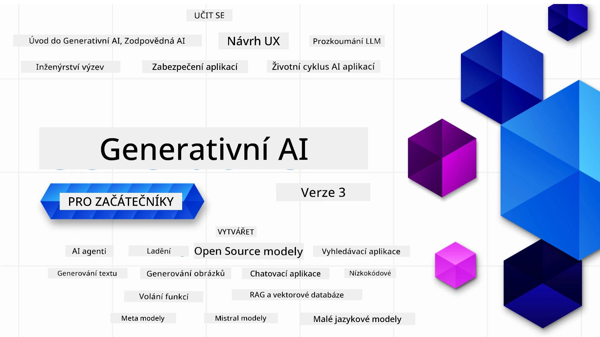

### 21 lekcí, které vás naučí vše, co potřebujete vědět k začátku tvorby aplikací s generativní AI

[](https://github.com/microsoft/Generative-AI-For-Beginners/blob/master/LICENSE?WT.mc_id=academic-105485-koreyst)
[](https://GitHub.com/microsoft/Generative-AI-For-Beginners/graphs/contributors/?WT.mc_id=academic-105485-koreyst)
[](https://GitHub.com/microsoft/Generative-AI-For-Beginners/issues/?WT.mc_id=academic-105485-koreyst)
[](https://GitHub.com/microsoft/Generative-AI-For-Beginners/pulls/?WT.mc_id=academic-105485-koreyst)
[](http://makeapullrequest.com?WT.mc_id=academic-105485-koreyst)

[](https://GitHub.com/microsoft/Generative-AI-For-Beginners/watchers/?WT.mc_id=academic-105485-koreyst)
[](https://GitHub.com/microsoft/Generative-AI-For-Beginners/network/?WT.mc_id=academic-105485-koreyst)
[](https://GitHub.com/microsoft/Generative-AI-For-Beginners/stargazers/?WT.mc_id=academic-105485-koreyst)

[](https://discord.gg/nTYy5BXMWG)

### 🌐 Podpora vícejazyčnosti

#### Podporováno pomocí GitHub Action (automatizované a vždy aktuální)

<!-- CO-OP TRANSLATOR LANGUAGES TABLE START -->
[Arabic](../ar/README.md) | [Bengali](../bn/README.md) | [Bulgarian](../bg/README.md) | [Burmese (Myanmar)](../my/README.md) | [Chinese (Simplified)](../zh-CN/README.md) | [Chinese (Traditional, Hong Kong)](../zh-HK/README.md) | [Chinese (Traditional, Macau)](../zh-MO/README.md) | [Chinese (Traditional, Taiwan)](../zh-TW/README.md) | [Croatian](../hr/README.md) | [Czech](./README.md) | [Danish](../da/README.md) | [Dutch](../nl/README.md) | [Estonian](../et/README.md) | [Finnish](../fi/README.md) | [French](../fr/README.md) | [German](../de/README.md) | [Greek](../el/README.md) | [Hebrew](../he/README.md) | [Hindi](../hi/README.md) | [Hungarian](../hu/README.md) | [Indonesian](../id/README.md) | [Italian](../it/README.md) | [Japanese](../ja/README.md) | [Kannada](../kn/README.md) | [Khmer](../km/README.md) | [Korean](../ko/README.md) | [Lithuanian](../lt/README.md) | [Malay](../ms/README.md) | [Malayalam](../ml/README.md) | [Marathi](../mr/README.md) | [Nepali](../ne/README.md) | [Nigerian Pidgin](../pcm/README.md) | [Norwegian](../no/README.md) | [Persian (Farsi)](../fa/README.md) | [Polish](../pl/README.md) | [Portuguese (Brazil)](../pt-BR/README.md) | [Portuguese (Portugal)](../pt-PT/README.md) | [Punjabi (Gurmukhi)](../pa/README.md) | [Romanian](../ro/README.md) | [Russian](../ru/README.md) | [Serbian (Cyrillic)](../sr/README.md) | [Slovak](../sk/README.md) | [Slovenian](../sl/README.md) | [Spanish](../es/README.md) | [Swahili](../sw/README.md) | [Swedish](../sv/README.md) | [Tagalog (Filipino)](../tl/README.md) | [Tamil](../ta/README.md) | [Telugu](../te/README.md) | [Thai](../th/README.md) | [Turkish](../tr/README.md) | [Ukrainian](../uk/README.md) | [Urdu](../ur/README.md) | [Vietnamese](../vi/README.md)

> **Raději klonovat lokálně?**
>
> Tento repozitář obsahuje přes 50 jazykových překladů, což významně zvyšuje velikost stahování. Pro klonování bez překladů použijte sparse checkout:
>
> **Bash / macOS / Linux:**
> ```bash
> git clone --filter=blob:none --sparse https://github.com/microsoft/generative-ai-for-beginners.git
> cd generative-ai-for-beginners
> git sparse-checkout set --no-cone '/*' '!translations' '!translated_images'
> ```
>
> **CMD (Windows):**
> ```cmd
> git clone --filter=blob:none --sparse https://github.com/microsoft/generative-ai-for-beginners.git
> cd generative-ai-for-beginners
> git sparse-checkout set --no-cone "/*" "!translations" "!translated_images"
> ```
>
> Toto vám poskytne vše potřebné pro dokončení kurzu s mnohem rychlejším stahováním.
<!-- CO-OP TRANSLATOR LANGUAGES TABLE END -->

# Generativní AI pro začátečníky (Verze 3) - Kurz

Naučte se základy tvorby aplikací generativní AI s naším komplexním kursem o 21 lekcích od Microsoft Cloud Advocates.

## 🌱 Začínáme

Tento kurz má 21 lekcí. Každá lekce pokrývá vlastní téma, takže začněte, kde chcete!

Lekce jsou označeny jako buď "Learn" lekce vysvětlující koncept generativní AI, nebo "Build" lekce, které vysvětlují koncept a ukázky kódu v **Pythonu** a **TypeScriptu**, pokud je to možné.

Pro vývojáře .NET si prohlédněte [Generative AI for Beginners (.NET Edition)](https://github.com/microsoft/Generative-AI-for-beginners-dotnet?WT.mc_id=academic-105485-koreyst)!

Každá lekce také obsahuje sekci "Keep Learning" s dalšími nástroji pro učení.

## Co potřebujete
### Pro spuštění kódu z tohoto kurzu můžete použít některé z následujících: 
 - [Azure OpenAI Service](https://aka.ms/genai-beginners/azure-open-ai?WT.mc_id=academic-105485-koreyst) - **Lekce:** "aoai-assignment"
 - [Microsoft Foundry Models](https://ai.azure.com/catalog/models?WT.mc_id=academic-105485-koreyst) - **Lekce:** "githubmodels" (GitHub Models bude ukončen na konci července 2026 - místo toho používejte Microsoft Foundry Models)
 - [OpenAI API](https://aka.ms/genai-beginners/open-ai?WT.mc_id=academic-105485-koreyst) - **Lekce:** "oai-assignment" 
 - [Foundry Local](https://foundrylocal.ai?WT.mc_id=academic-105485-koreyst) - Spouštějte modely plně offline na vlastním zařízení, není potřeba cloudové předplatné
   
- Základní znalost Pythonu nebo TypeScriptu je užitečná - \*Pro úplné začátečníky prohlédněte tyto kurzy [Python](https://aka.ms/genai-beginners/python?WT.mc_id=academic-105485-koreyst) a [TypeScript](https://aka.ms/genai-beginners/typescript?WT.mc_id=academic-105485-koreyst)
- GitHub účet pro [forkování celého tohoto repozitáře](https://aka.ms/genai-beginners/github?WT.mc_id=academic-105485-koreyst) na váš vlastní GitHub účet

Vytvořili jsme lekci **[Course Setup](./00-course-setup/README.md?WT.mc_id=academic-105485-koreyst)**, která vám pomůže s nastavením vývojového prostředí.

Nezapomeňte [označit hvězdičkou (🌟) tento repozitář](https://docs.github.com/en/get-started/exploring-projects-on-github/saving-repositories-with-stars?WT.mc_id=academic-105485-koreyst), abyste ho později snadno našli.

## 🧠 Připraveno k nasazení?

Pokud hledáte pokročilejší ukázky kódu, podívejte se na naši [sbírku ukázek kódu generativní AI](https://aka.ms/genai-beg-code?WT.mc_id=academic-105485-koreyst) v **Pythonu** i **TypeScriptu**.

## 🗣️ Poznejte další studenty, získejte podporu

Připojte se k našemu [oficiálnímu Microsoft Foundry Discord serveru](https://aka.ms/genai-discord?WT.mc_id=academic-105485-koreyst), kde můžete setkat další studenty tohoto kurzu a získat podporu.

Ptejte se nebo sdílejte zpětnou vazbu k produktu v našem [Microsoft Foundry Developer Forum](https://aka.ms/azureaifoundry/forum) na GitHubu.

## 🚀 Stavíte startup?

Navštivte [Microsoft for Startups](https://www.microsoft.com/startups) a zjistěte, jak začít budovat s Azure kredity již dnes.

## 🙏 Chcete pomoci?

Máte návrhy nebo jste našli chyby v pravopisu či kódu? [Nahlaste problém](https://github.com/microsoft/generative-ai-for-beginners/issues?WT.mc_id=academic-105485-koreyst) nebo [vytvořte pull request](https://github.com/microsoft/generative-ai-for-beginners/pulls?WT.mc_id=academic-105485-koreyst)

## 📂 Každá lekce obsahuje:

- Krátké video úvod k tématu
- Psání lekce v README
- Ukázky kódu v Pythonu a TypeScriptu podporující Azure OpenAI a OpenAI API
- Odkazy na další zdroje pro pokračování ve studiu

## 🗃️ Lekce

| #   | **Odkaz na lekci**                                                                                                                             | **Popis**                                                                                     | **Video**                                                                 | **Další učení**                                                             |
| --- | -------------------------------------------------------------------------------------------------------------------------------------------- | ----------------------------------------------------------------------------------------------- | ------------------------------------------------------------------------- | -------------------------------------------------------------------------- |
| 00  | [Nastavení kurzu](./00-course-setup/README.md?WT.mc_id=academic-105485-koreyst)                                                                 | **Learn:** Jak nastavit vaše vývojové prostředí                                               | Video brzy vyjde                                                             | [Více info](https://aka.ms/genai-collection?WT.mc_id=academic-105485-koreyst) |
| 01  | [Úvod do generativní AI a LLM](./01-introduction-to-genai/README.md?WT.mc_id=academic-105485-koreyst)                                             | **Learn:** Pochopení, co je generativní AI a jak fungují velké jazykové modely (LLM).          | [Video](https://aka.ms/gen-ai-lesson-1-gh?WT.mc_id=academic-105485-koreyst) | [Více info](https://aka.ms/genai-collection?WT.mc_id=academic-105485-koreyst) |
| 02  | [Prozkoumání a srovnání různých LLM](./02-exploring-and-comparing-different-llms/README.md?WT.mc_id=academic-105485-koreyst)                     | **Learn:** Jak vybrat správný model pro váš případ užití                                       | [Video](https://aka.ms/gen-ai-lesson2-gh?WT.mc_id=academic-105485-koreyst)  | [Více info](https://aka.ms/genai-collection?WT.mc_id=academic-105485-koreyst) |
| 03  | [Odpovědné používání generativní AI](./03-using-generative-ai-responsibly/README.md?WT.mc_id=academic-105485-koreyst)                            | **Learn:** Jak stavět aplikace generativní AI zodpovědně                                      | [Video](https://aka.ms/gen-ai-lesson3-gh?WT.mc_id=academic-105485-koreyst)  | [Více info](https://aka.ms/genai-collection?WT.mc_id=academic-105485-koreyst) |

| 04  | [Pochopení základů návrhu promptů](./04-prompt-engineering-fundamentals/README.md?WT.mc_id=academic-105485-koreyst)             | **Naučte se:** Praktické osvědčené postupy v návrhu promptů                                           | [Video](https://aka.ms/gen-ai-lesson4-gh?WT.mc_id=academic-105485-koreyst)  | [Více informací](https://aka.ms/genai-collection?WT.mc_id=academic-105485-koreyst) |
| 05  | [Tvorba pokročilých promptů](./05-advanced-prompts/README.md?WT.mc_id=academic-105485-koreyst)                                                | **Naučte se:** Jak aplikovat techniky návrhu promptů, které zlepšují výsledek vašich promptů. | [Video](https://aka.ms/gen-ai-lesson5-gh?WT.mc_id=academic-105485-koreyst)  | [Více informací](https://aka.ms/genai-collection?WT.mc_id=academic-105485-koreyst) |
| 06  | [Vytváření aplikací pro generování textu](./06-text-generation-apps/README.md?WT.mc_id=academic-105485-koreyst)                                | **Vybudujte:** Aplikaci pro generování textu pomocí Azure OpenAI / OpenAI API                                | [Video](https://aka.ms/gen-ai-lesson6-gh?WT.mc_id=academic-105485-koreyst)  | [Více informací](https://aka.ms/genai-collection?WT.mc_id=academic-105485-koreyst) |
| 07  | [Vytváření chatovacích aplikací](./07-building-chat-applications/README.md?WT.mc_id=academic-105485-koreyst)                                     | **Vybudujte:** Techniky pro efektivní tvorbu a integraci chatovacích aplikací.               | [Video](https://aka.ms/gen-ai-lessons7-gh?WT.mc_id=academic-105485-koreyst) | [Více informací](https://aka.ms/genai-collection?WT.mc_id=academic-105485-koreyst) |
| 08  | [Vytváření vyhledávacích aplikací s vektorovými databázemi](./08-building-search-applications/README.md?WT.mc_id=academic-105485-koreyst)                        | **Vybudujte:** Vyhledávací aplikaci využívající embeddings pro hledání dat.                        | [Video](https://aka.ms/gen-ai-lesson8-gh?WT.mc_id=academic-105485-koreyst)  | [Více informací](https://aka.ms/genai-collection?WT.mc_id=academic-105485-koreyst) |
| 09  | [Vytváření aplikací pro generování obrázků](./09-building-image-applications/README.md?WT.mc_id=academic-105485-koreyst)                        | **Vybudujte:** Aplikaci pro generování obrázků                                                       | [Video](https://aka.ms/gen-ai-lesson9-gh?WT.mc_id=academic-105485-koreyst)  | [Více informací](https://aka.ms/genai-collection?WT.mc_id=academic-105485-koreyst) |
| 10  | [Vytváření low-code AI aplikací](./10-building-low-code-ai-applications/README.md?WT.mc_id=academic-105485-koreyst)                       | **Vybudujte:** Generativní AI aplikaci využívající low-code nástroje                                     | [Video](https://aka.ms/gen-ai-lesson10-gh?WT.mc_id=academic-105485-koreyst) | [Více informací](https://aka.ms/genai-collection?WT.mc_id=academic-105485-koreyst) |
| 11  | [Integrace externích aplikací s voláním funkcí](./11-integrating-with-function-calling/README.md?WT.mc_id=academic-105485-koreyst) | **Vybudujte:** Co je volání funkcí a jeho případy použití v aplikacích                          | [Video](https://aka.ms/gen-ai-lesson11-gh?WT.mc_id=academic-105485-koreyst) | [Více informací](https://aka.ms/genai-collection?WT.mc_id=academic-105485-koreyst) |
| 12  | [Návrh UX pro AI aplikace](./12-designing-ux-for-ai-applications/README.md?WT.mc_id=academic-105485-koreyst)                         | **Naučte se:** Jak aplikovat principy UX designu při vývoji generativních AI aplikací         | [Video](https://aka.ms/gen-ai-lesson12-gh?WT.mc_id=academic-105485-koreyst) | [Více informací](https://aka.ms/genai-collection?WT.mc_id=academic-105485-koreyst) |
| 13  | [Zabezpečení vašich generativních AI aplikací](./13-securing-ai-applications/README.md?WT.mc_id=academic-105485-koreyst)                         | **Naučte se:** Hrozby a rizika pro AI systémy a metody jejich zabezpečení.             | [Video](https://aka.ms/gen-ai-lesson13-gh?WT.mc_id=academic-105485-koreyst) | [Více informací](https://aka.ms/genai-collection?WT.mc_id=academic-105485-koreyst) |
| 14  | [Životní cyklus generativní AI aplikace](./14-the-generative-ai-application-lifecycle/README.md?WT.mc_id=academic-105485-koreyst)           | **Naučte se:** Nástroje a metriky pro řízení životního cyklu LLM a LLMOps                         | [Video](https://aka.ms/gen-ai-lesson14-gh?WT.mc_id=academic-105485-koreyst) | [Více informací](https://aka.ms/genai-collection?WT.mc_id=academic-105485-koreyst) |
| 15  | [Retrieval Augmented Generation (RAG) a vektorové databáze](./15-rag-and-vector-databases/README.md?WT.mc_id=academic-105485-koreyst)        | **Vybudujte:** Aplikaci využívající RAG Framework pro získávání embeddings z vektorových databází  | [Video](https://aka.ms/gen-ai-lesson15-gh?WT.mc_id=academic-105485-koreyst) | [Více informací](https://aka.ms/genai-collection?WT.mc_id=academic-105485-koreyst) |
| 16  | [Open source modely a Hugging Face](./16-open-source-models/README.md?WT.mc_id=academic-105485-koreyst)                                    | **Vybudujte:** Aplikaci využívající open source modely dostupné na Hugging Face                    | [Video](https://aka.ms/gen-ai-lesson16-gh?WT.mc_id=academic-105485-koreyst) | [Více informací](https://aka.ms/genai-collection?WT.mc_id=academic-105485-koreyst) |
| 17  | [AI agenti](./17-ai-agents/README.md?WT.mc_id=academic-105485-koreyst)                                                                       | **Vybudujte:** Aplikaci využívající rámec AI agenta                                           | [Video](https://aka.ms/gen-ai-lesson17-gh?WT.mc_id=academic-105485-koreyst) | [Více informací](https://aka.ms/genai-collection?WT.mc_id=academic-105485-koreyst) |
| 18  | [Doladění LLM](./18-fine-tuning/README.md?WT.mc_id=academic-105485-koreyst)                                                              | **Naučte se:** Co, proč a jak doladit LLM                                            | [Video](https://aka.ms/gen-ai-lesson18-gh?WT.mc_id=academic-105485-koreyst) | [Více informací](https://aka.ms/genai-collection?WT.mc_id=academic-105485-koreyst) |
| 19  | [Vytváření s malými jazykovými modely (SLM)](./19-slm/README.md?WT.mc_id=academic-105485-koreyst)                                                              | **Naučte se:** Výhody vytváření s malými jazykovými modely                                            | Video brzy k dispozici | [Více informací](https://aka.ms/genai-collection?WT.mc_id=academic-105485-koreyst) |
| 20  | [Vytváření s modely Mistral](./20-mistral/README.md?WT.mc_id=academic-105485-koreyst)                                                              | **Naučte se:** Vlastnosti a rozdíly modelů rodiny Mistral                                           | Video brzy k dispozici | [Více informací](https://aka.ms/genai-collection?WT.mc_id=academic-105485-koreyst) |
| 21  | [Vytváření s modely Meta](./21-meta/README.md?WT.mc_id=academic-105485-koreyst)                                                              | **Naučte se:** Vlastnosti a rozdíly modelů rodiny Meta                                           | Video brzy k dispozici | [Více informací](https://aka.ms/genai-collection?WT.mc_id=academic-105485-koreyst) |

### 🌟 Zvláštní poděkování

Zvláštní poděkování patří [**Johnu Azizovi**](https://www.linkedin.com/in/john0isaac/) za vytvoření všech GitHub Actions a workflow

[**Bernhardu Merklovi**](https://www.linkedin.com/in/bernhard-merkle-738b73/), který přispěl klíčovými vstupy do každé lekce pro zlepšení zážitku z učení a kódu.

## 🎒 Další kurzy

Náš tým vytváří i další kurzy! Podívejte se na:

<!-- CO-OP TRANSLATOR OTHER COURSES START -->
### LangChain
[](https://aka.ms/langchain4j-for-beginners)
[](https://aka.ms/langchainjs-for-beginners?WT.mc_id=m365-94501-dwahlin)
[](https://github.com/microsoft/langchain-for-beginners?WT.mc_id=m365-94501-dwahlin)
---

### Azure / Edge / MCP / Agenti
[](https://github.com/microsoft/AZD-for-beginners?WT.mc_id=academic-105485-koreyst)
[](https://github.com/microsoft/edgeai-for-beginners?WT.mc_id=academic-105485-koreyst)
[](https://github.com/microsoft/mcp-for-beginners?WT.mc_id=academic-105485-koreyst)
[](https://github.com/microsoft/ai-agents-for-beginners?WT.mc_id=academic-105485-koreyst)

---
 
### Série Generativní AI
[](https://github.com/microsoft/generative-ai-for-beginners?WT.mc_id=academic-105485-koreyst)
[-9333EA?style=for-the-badge&labelColor=E5E7EB&color=9333EA)](https://github.com/microsoft/Generative-AI-for-beginners-dotnet?WT.mc_id=academic-105485-koreyst)
[-C084FC?style=for-the-badge&labelColor=E5E7EB&color=C084FC)](https://github.com/microsoft/generative-ai-for-beginners-java?WT.mc_id=academic-105485-koreyst)

[-E879F9?style=for-the-badge&labelColor=E5E7EB&color=E879F9)](https://github.com/microsoft/generative-ai-with-javascript?WT.mc_id=academic-105485-koreyst)

---
 
### Základní vzdělávání
[](https://aka.ms/ml-beginners?WT.mc_id=academic-105485-koreyst)
[](https://aka.ms/datascience-beginners?WT.mc_id=academic-105485-koreyst)
[](https://aka.ms/ai-beginners?WT.mc_id=academic-105485-koreyst)
[](https://github.com/microsoft/Security-101?WT.mc_id=academic-96948-sayoung)
[](https://aka.ms/webdev-beginners?WT.mc_id=academic-105485-koreyst)
[](https://aka.ms/iot-beginners?WT.mc_id=academic-105485-koreyst)
[](https://github.com/microsoft/xr-development-for-beginners?WT.mc_id=academic-105485-koreyst)

---
 
### Série Copilot
[](https://aka.ms/GitHubCopilotAI?WT.mc_id=academic-105485-koreyst)
[](https://github.com/microsoft/mastering-github-copilot-for-dotnet-csharp-developers?WT.mc_id=academic-105485-koreyst)
[](https://github.com/microsoft/CopilotAdventures?WT.mc_id=academic-105485-koreyst)
<!-- CO-OP TRANSLATOR OTHER COURSES END -->

## Získání pomoci

Pokud uvíznete nebo máte nějaké otázky ohledně tvorby AI aplikací. Přidejte se ke komunitě studentů a zkušených vývojářů v diskusích o MCP. Je to podpůrná komunita, kde jsou otázky vítány a znalosti se sdílejí volně.

[](https://discord.gg/nTYy5BXMWG)

Pokud máte zpětnou vazbu k produktu nebo narazíte na chyby při tvorbě, navštivte:

[](https://aka.ms/foundry/forum)

---

<!-- CO-OP TRANSLATOR DISCLAIMER START -->
**Prohlášení o omezení odpovědnosti**:
Tento dokument byl přeložen pomocí AI překladatelské služby [Co-op Translator](https://github.com/Azure/co-op-translator). Přestože usilujeme o co největší přesnost, mějte prosím na paměti, že automatizované překlady mohou obsahovat chyby nebo nepřesnosti. Originální dokument v jeho mateřském jazyce by měl být považován za autoritativní zdroj. Pro kritické informace se doporučuje profesionální lidský překlad. Nejsme odpovědní za jakékoli nedorozumění nebo nesprávné interpretace vzniklé použitím tohoto překladu.
<!-- CO-OP TRANSLATOR DISCLAIMER END -->