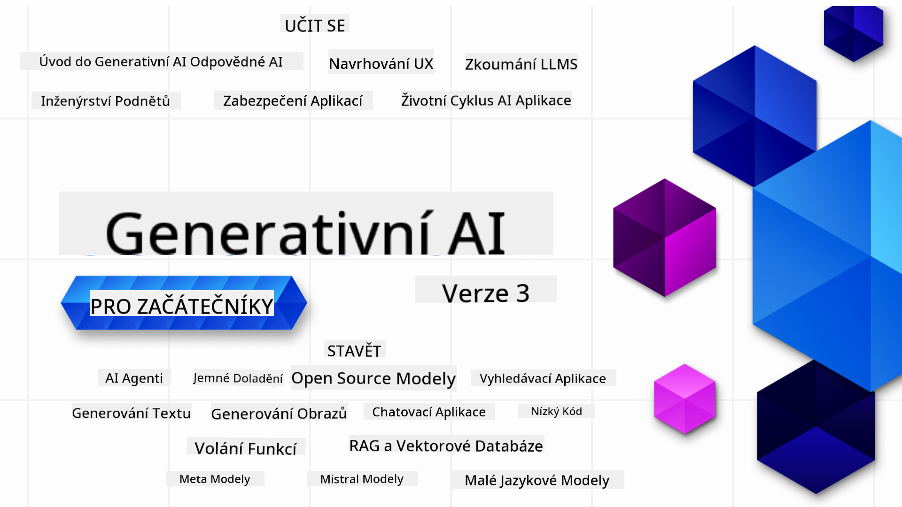

<!--
CO_OP_TRANSLATOR_METADATA:
{
  "original_hash": "6e3f4c8a4f323b8eab1cf11ded304b0f",
  "translation_date": "2025-06-25T08:13:03+00:00",
  "source_file": "README.md",
  "language_code": "cs"
}
-->

### 21 lekcí, které vás naučí vše, co potřebujete vědět, abyste mohli začít vytvářet aplikace generativní AI

### 🌐 Podpora více jazyků

#### Podporováno pomocí GitHub Action (automatizováno a vždy aktuální)

# Generativní AI pro začátečníky (Verze 3) - Kurz

Naučte se základy tvorby aplikací s generativní AI s naším komplexním kurzem o 21 lekcích od Microsoft Cloud Advocates.

## 🌱 Začínáme

Tento kurz má 21 lekcí. Každá lekce pokrývá své vlastní téma, takže můžete začít, kde chcete!

Lekce jsou označeny buď jako "Learn" lekce, které vysvětlují koncept generativní AI, nebo jako "Build" lekce, které vysvětlují koncept a příklady kódu v **Pythonu** a **TypeScriptu**, pokud je to možné.

Pro vývojáře .NET se podívejte na [Generativní AI pro začátečníky (.NET Edition)](https://github.com/microsoft/Generative-AI-for-beginners-dotnet?WT.mc_id=academic-105485-koreyst)!

Každá lekce také obsahuje sekci "Keep Learning" s dalšími nástroji pro učení.

## Co potřebujete
### Pro spuštění kódu z tohoto kurzu můžete použít buď:
- [Azure OpenAI Service](https://aka.ms/genai-beginners/azure-open-ai?WT.mc_id=academic-105485-koreyst) - **Lekce:** "aoai-assignment"
- [GitHub Marketplace Model Catalog](https://aka.ms/genai-beginners/gh-models?WT.mc_id=academic-105485-koreyst) - **Lekce:** "githubmodels"
- [OpenAI API](https://aka.ms/genai-beginners/open-ai?WT.mc_id=academic-105485-koreyst) - **Lekce:** "oai-assignment"

- Základní znalosti Pythonu nebo TypeScriptu jsou užitečné - \*Pro úplné začátečníky se podívejte na tyto kurzy [Python](https://aka.ms/genai-beginners/python?WT.mc_id=academic-105485-koreyst) a [TypeScript](https://aka.ms/genai-beginners/typescript?WT.mc_id=academic-105485-koreyst)
- GitHub účet pro [forkování celého tohoto repozitáře](https://aka.ms/genai-beginners/github?WT.mc_id=academic-105485-koreyst) na váš vlastní GitHub účet

Vytvořili jsme lekci **[Course Setup](./00-course-setup/README.md?WT.mc_id=academic-105485-koreyst)**, která vám pomůže s nastavením vývojového prostředí.

Nezapomeňte [ohvězdičkovat (🌟) tento repozitář](https://docs.github.com/en/get-started/exploring-projects-on-github/saving-repositories-with-stars?WT.mc_id=academic-105485-koreyst), abyste ho později snadněji našli.

## 🧠 Připraveni na nasazení?

Pokud hledáte pokročilejší ukázky kódu, podívejte se na naši [kolekci ukázek kódu generativní AI](https://aka.ms/genai-beg-code?WT.mc_id=academic-105485-koreyst) v **Pythonu** a **TypeScriptu**.

## 🗣️ Seznamte se s ostatními studenty, získejte podporu

Připojte se k našemu [oficiálnímu serveru Azure AI Foundry na Discordu](https://aka.ms/genai-discord?WT.mc_id=academic-105485-koreyst), abyste se setkali a navázali kontakty s ostatními studenty, kteří tento kurz absolvují, a získali podporu.

Ptejte se nebo sdílejte zpětnou vazbu k produktu na našem [Azure AI Foundry Developer Foru](https://aka.ms/azureaifoundry/forum) na Githubu.

## 🚀 Stavíte startup?

Zaregistrujte se do [Microsoft for Startups Founders Hub](https://aka.ms/genai-foundershub?WT.mc_id=academic-105485-koreyst), abyste získali **zdarma OpenAI kredity** a až **150 000 $ na Azure kredity pro přístup k modelům OpenAI prostřednictvím Azure OpenAI Services**.

## 🙏 Chcete pomoci?

Máte návrhy nebo jste našli pravopisné či kódové chyby? [Nahlaste problém](https://github.com/microsoft/generative-ai-for-beginners/issues?WT.mc_id=academic-105485-koreyst) nebo [Vytvořte pull request](https://github.com/microsoft/generative-ai-for-beginners/pulls?WT.mc_id=academic-105485-koreyst)

## 📂 Každá lekce obsahuje:

- Krátké video s úvodem do tématu
- Písemnou lekci umístěnou v README
- Ukázky kódu v Pythonu a TypeScriptu podporující Azure OpenAI a OpenAI API
- Odkazy na další zdroje pro pokračování ve vašem učení

## 🗃️ Lekce

| #   | **Odkaz na lekci**                                                                                                                           | **Popis**                                                                                        | **Video**                                                                   | **Další učení**                                                               |
| --- | -------------------------------------------------------------------------------------------------------------------------------------------- | ----------------------------------------------------------------------------------------------- | --------------------------------------------------------------------------- | ------------------------------------------------------------------------------ |
| 00  | [Course Setup](./00-course-setup/README.md?WT.mc_id=academic-105485-koreyst)                                                                 | **Learn:** Jak nastavit své vývojové prostředí                                                  | Video brzy přijde                                                           | [Více informací](https://aka.ms/genai-collection?WT.mc_id=academic-105485-koreyst) |
| 01  | [Úvod do generativní AI a LLMs](./01-introduction-to-genai/README.md?WT.mc_id=academic-105485-koreyst)                                       | **Learn:** Porozumění tomu, co je generativní AI a jak fungují velké jazykové modely (LLMs).    | [Video](https://aka.ms/gen-ai-lesson-1-gh?WT.mc_id=academic-105485-koreyst) | [Více informací](https://aka.ms/genai-collection?WT.mc_id=academic-105485-koreyst) |
| 02  | [Zkoumání a porovnávání různých LLMs](./02-exploring-and-comparing-different-llms/README.md?WT.mc_id=academic-105485-koreyst)               | **Learn:** Jak vybrat správný model pro váš případ použití                                       | [Video](https://aka.ms/gen-ai-lesson2-gh?WT.mc_id=academic-105485-koreyst)  | [Více informací](https://aka.ms/genai-collection?WT.mc_id=academic-105485-koreyst) |
| 03  | [Používání generativní AI zodpovědně](./03-using-generative-ai-responsibly/README.md?WT.mc_id=academic-105485-koreyst)                      | **Learn:** Jak zodpovědně budovat aplikace s generativní AI                                     | [Video](https://aka.ms/gen-ai-lesson3-gh?WT.mc_id=academic-105485-koreyst)  | [Více informací](https://aka.ms/genai-collection?WT.mc_id=academic-105485-koreyst) |
| 04  | [Pochopení základů prompt engineering](./04-prompt-engineering-fundamentals/README.md?WT.mc_id=academic-105485-koreyst)                     | **Learn:** Praktické nejlepší postupy pro prompt engineering                                    | [Video](https://aka.ms/gen-ai-lesson4-gh?WT.mc_id=academic-105485-koreyst)  | [Více informací](https://aka.ms/genai-collection?WT.mc_id=academic-105485-koreyst) |
| 05  | [Vytváření pokročilých promptů](./05-advanced-prompts/README.md?WT.mc_id=academic-105485-koreyst)                                                | **Učit se:** Jak aplikovat techniky návrhu promptů, které zlepšují výsledek vašich promptů. | [Video](https://aka.ms/gen-ai-lesson5-gh?WT.mc_id=academic-105485-koreyst)  | [Zjistit více](https://aka.ms/genai-collection?WT.mc_id=academic-105485-koreyst) |
| 06  | [Vytváření aplikací pro generování textu](./06-text-generation-apps/README.md?WT.mc_id=academic-105485-koreyst)                                | **Vytvořit:** Aplikaci pro generování textu pomocí Azure OpenAI / OpenAI API                                | [Video](https://aka.ms/gen-ai-lesson6-gh?WT.mc_id=academic-105485-koreyst)  | [Zjistit více](https://aka.ms/genai-collection?WT.mc_id=academic-105485-koreyst) |
| 07  | [Vytváření chatovacích aplikací](./07-building-chat-applications/README.md?WT.mc_id=academic-105485-koreyst)                                     | **Vytvořit:** Techniky pro efektivní vytváření a integraci chatovacích aplikací.               | [Video](https://aka.ms/gen-ai-lessons7-gh?WT.mc_id=academic-105485-koreyst) | [Zjistit více](https://aka.ms/genai-collection?WT.mc_id=academic-105485-koreyst) |
| 08  | [Vytváření vyhledávacích aplikací s vektorovými databázemi](./08-building-search-applications/README.md?WT.mc_id=academic-105485-koreyst)                        | **Vytvořit:** Vyhledávací aplikaci, která používá vkládání k vyhledávání dat.                        | [Video](https://aka.ms/gen-ai-lesson8-gh?WT.mc_id=academic-105485-koreyst)  | [Zjistit více](https://aka.ms/genai-collection?WT.mc_id=academic-105485-koreyst) |
| 09  | [Vytváření aplikací pro generování obrázků](./09-building-image-applications/README.md?WT.mc_id=academic-105485-koreyst)                        | **Vytvořit:** Aplikaci pro generování obrázků                                                       | [Video](https://aka.ms/gen-ai-lesson9-gh?WT.mc_id=academic-105485-koreyst)  | [Zjistit více](https://aka.ms/genai-collection?WT.mc_id=academic-105485-koreyst) |
| 10  | [Vytváření AI aplikací s nízkým kódem](./10-building-low-code-ai-applications/README.md?WT.mc_id=academic-105485-koreyst)                       | **Vytvořit:** Generativní AI aplikaci pomocí nástrojů s nízkým kódem                                     | [Video](https://aka.ms/gen-ai-lesson10-gh?WT.mc_id=academic-105485-koreyst) | [Zjistit více](https://aka.ms/genai-collection?WT.mc_id=academic-105485-koreyst) |
| 11  | [Integrace externích aplikací s voláním funkcí](./11-integrating-with-function-calling/README.md?WT.mc_id=academic-105485-koreyst) | **Vytvořit:** Co je volání funkcí a jeho případy použití pro aplikace                          | [Video](https://aka.ms/gen-ai-lesson11-gh?WT.mc_id=academic-105485-koreyst) | [Zjistit více](https://aka.ms/genai-collection?WT.mc_id=academic-105485-koreyst) |
| 12  | [Navrhování UX pro AI aplikace](./12-designing-ux-for-ai-applications/README.md?WT.mc_id=academic-105485-koreyst)                         | **Učit se:** Jak aplikovat principy návrhu UX při vývoji generativních AI aplikací         | [Video](https://aka.ms/gen-ai-lesson12-gh?WT.mc_id=academic-105485-koreyst) | [Zjistit více](https://aka.ms/genai-collection?WT.mc_id=academic-105485-koreyst) |
| 13  | [Zabezpečení vašich generativních AI aplikací](./13-securing-ai-applications/README.md?WT.mc_id=academic-105485-koreyst)                         | **Učit se:** Hrozby a rizika pro AI systémy a metody zabezpečení těchto systémů.             | [Video](https://aka.ms/gen-ai-lesson13-gh?WT.mc_id=academic-105485-koreyst) | [Zjistit více](https://aka.ms/genai-collection?WT.mc_id=academic-105485-koreyst) |
| 14  | [Životní cyklus generativní AI aplikace](./14-the-generative-ai-application-lifecycle/README.md?WT.mc_id=academic-105485-koreyst)           | **Učit se:** Nástroje a metriky pro správu životního cyklu LLM a LLMOps                         | [Video](https://aka.ms/gen-ai-lesson14-gh?WT.mc_id=academic-105485-koreyst) | [Zjistit více](https://aka.ms/genai-collection?WT.mc_id=academic-105485-koreyst) |
| 15  | [Retrieval Augmented Generation (RAG) a Vektorové databáze](./15-rag-and-vector-databases/README.md?WT.mc_id=academic-105485-koreyst)        | **Vytvořte:** Aplikaci pomocí RAG Frameworku pro získávání vektorů z Vektorových databází  | [Video](https://aka.ms/gen-ai-lesson15-gh?WT.mc_id=academic-105485-koreyst) | [Zjistit více](https://aka.ms/genai-collection?WT.mc_id=academic-105485-koreyst) |
| 16  | [Open Source Modely a Hugging Face](./16-open-source-models/README.md?WT.mc_id=academic-105485-koreyst)                                    | **Vytvořte:** Aplikaci s využitím open source modelů dostupných na Hugging Face                    | [Video](https://aka.ms/gen-ai-lesson16-gh?WT.mc_id=academic-105485-koreyst) | [Zjistit více](https://aka.ms/genai-collection?WT.mc_id=academic-105485-koreyst) |
| 17  | [AI Agenti](./17-ai-agents/README.md?WT.mc_id=academic-105485-koreyst)                                                                       | **Vytvořte:** Aplikaci s využitím AI Agent Frameworku                                           | [Video](https://aka.ms/gen-ai-lesson17-gh?WT.mc_id=academic-105485-koreyst) | [Zjistit více](https://aka.ms/genai-collection?WT.mc_id=academic-105485-koreyst) |
| 18  | [Jemné ladění LLMs](./18-fine-tuning/README.md?WT.mc_id=academic-105485-koreyst)                                                              | **Naučte se:** Co, proč a jak jemně ladit LLMs                                            | [Video](https://aka.ms/gen-ai-lesson18-gh?WT.mc_id=academic-105485-koreyst) | [Zjistit více](https://aka.ms/genai-collection?WT.mc_id=academic-105485-koreyst) |
| 19  | [Stavění s SLMs](./19-slm/README.md?WT.mc_id=academic-105485-koreyst)                                                              | **Naučte se:** Výhody stavění s Malými jazykovými modely                                            | Video brzy k dispozici | [Zjistit více](https://aka.ms/genai-collection?WT.mc_id=academic-105485-koreyst) |
| 20  | [Stavění s Mistral Modely](./20-mistral/README.md?WT.mc_id=academic-105485-koreyst)                                                              | **Naučte se:** Vlastnosti a rozdíly Mistral Family Modelů                                           | Video brzy k dispozici | [Zjistit více](https://aka.ms/genai-collection?WT.mc_id=academic-105485-koreyst) |
| 21  | [Stavění s Meta Modely](./21-meta/README.md?WT.mc_id=academic-105485-koreyst)                                                              | **Naučte se:** Vlastnosti a rozdíly Meta Family Modelů                                           | Video brzy k dispozici | [Zjistit více](https://aka.ms/genai-collection?WT.mc_id=academic-105485-koreyst) |

### 🌟 Speciální poděkování

Speciální poděkování [**Johnu Azizovi**](https://www.linkedin.com/in/john0isaac/) za vytvoření všech GitHub Actions a workflowů

[**Bernhardu Merkle**](https://www.linkedin.com/in/bernhard-merkle-738b73/) za klíčové příspěvky k jednotlivým lekcím pro zlepšení zkušeností studentů a kódu.

## 🎒 Další kurzy

Náš tým vytváří i další kurzy! Podívejte se na:

- [**NOVÝ** Model Context Protocol pro začátečníky](https://github.com/microsoft/mcp-for-beginners?WT.mc_id=academic-105485-koreyst)
- [AI Agenti pro začátečníky](https://github.com/microsoft/ai-agents-for-beginners?WT.mc_id=academic-105485-koreyst)
- [Generativní AI pro začátečníky s využitím .NET](https://github.com/microsoft/Generative-AI-for-beginners-dotnet?WT.mc_id=academic-105485-koreyst)
- [Generativní AI pro začátečníky s využitím JavaScriptu](https://aka.ms/genai-js-course?WT.mc_id=academic-105485-koreyst)
- [ML pro začátečníky](https://aka.ms/ml-beginners?WT.mc_id=academic-105485-koreyst)
- [Data Science pro začátečníky](https://aka.ms/datascience-beginners?WT.mc_id=academic-105485-koreyst)
- [AI pro začátečníky](https://aka.ms/ai-beginners?WT.mc_id=academic-105485-koreyst)
- [Kybernetická bezpečnost pro začátečníky](https://github.com/microsoft/Security-101??WT.mc_id=academic-96948-sayoung)
- [Web Dev pro začátečníky](https://aka.ms/webdev-beginners?WT.mc_id=academic-105485-koreyst)
- [IoT pro začátečníky](https://aka.ms/iot-beginners?WT.mc_id=academic-105485-koreyst)
- [XR vývoj pro začátečníky](https://github.com/microsoft/xr-development-for-beginners?WT.mc_id=academic-105485-koreyst)
- [Ovládnutí GitHub Copilot pro AI párové programování](https://aka.ms/GitHubCopilotAI?WT.mc_id=academic-105485-koreyst)
- [Ovládnutí GitHub Copilot pro vývojáře C#/.NET](https://github.com/microsoft/mastering-github-copilot-for-dotnet-csharp-developers?WT.mc_id=academic-105485-koreyst)
- [Vyberte si své vlastní dobrodružství s Copilotem](https://github.com/microsoft/CopilotAdventures?WT.mc_id=academic-105485-koreyst)

**Prohlášení**:  
Tento dokument byl přeložen pomocí služby AI pro překlad [Co-op Translator](https://github.com/Azure/co-op-translator). Ačkoliv se snažíme o přesnost, prosím uvědomte si, že automatizované překlady mohou obsahovat chyby nebo nepřesnosti. Původní dokument v jeho rodném jazyce by měl být považován za autoritativní zdroj. Pro kritické informace se doporučuje profesionální lidský překlad. Nejsme odpovědní za jakékoliv nedorozumění nebo mylné interpretace vzniklé použitím tohoto překladu.