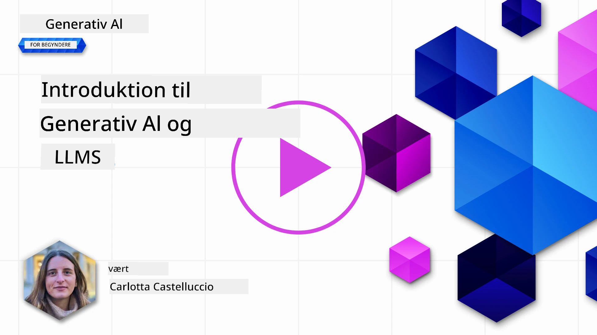
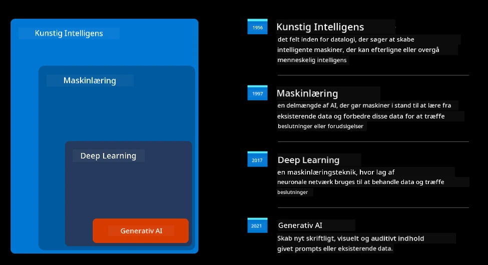
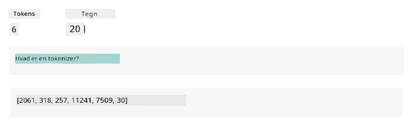
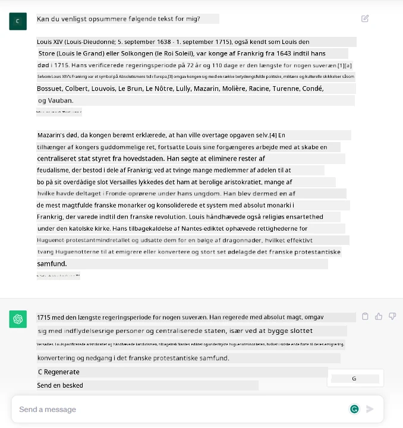
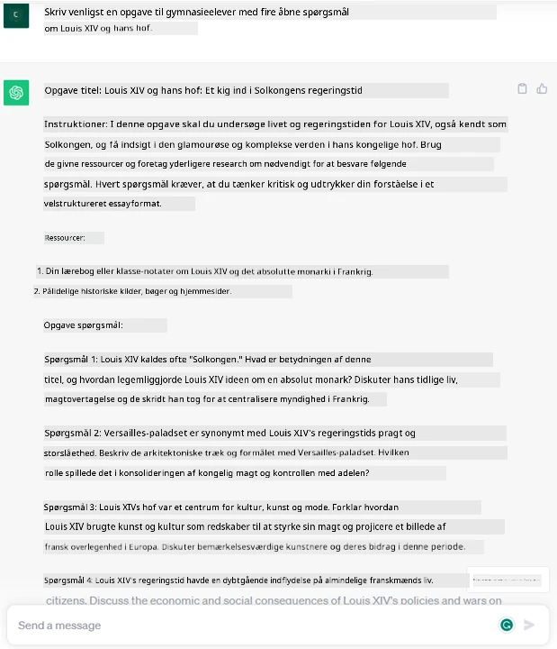
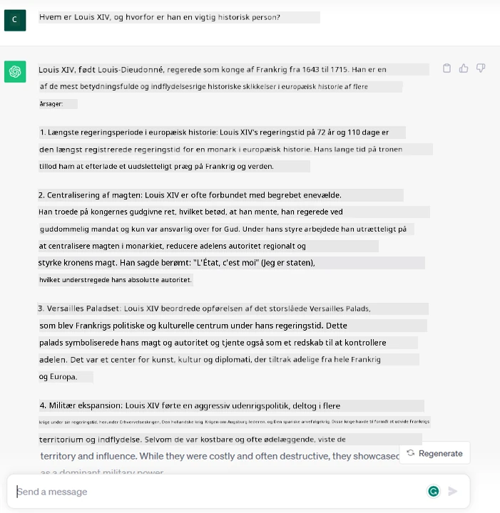
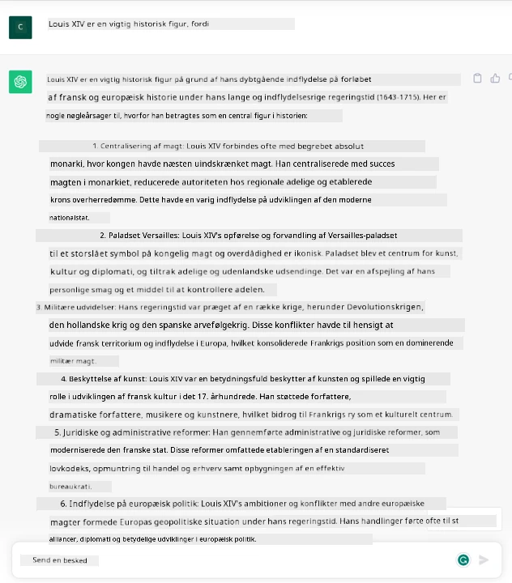
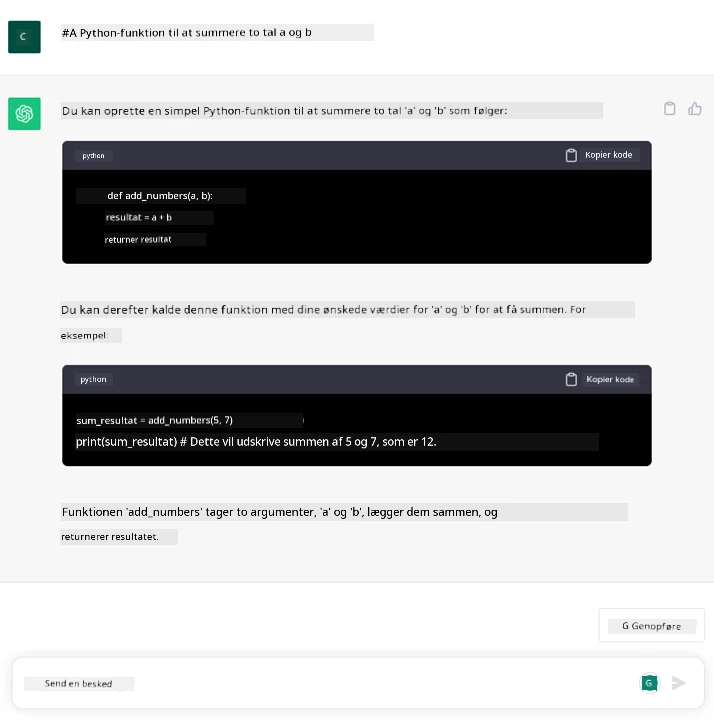

# Introduktion til Generativ AI og Store Sprogmodeller

_(Klik på billedet ovenfor for at se videoen af denne lektion)_

Generativ AI er kunstig intelligens, der er i stand til at generere tekst, billeder og andre typer indhold. Det, der gør det til en fantastisk teknologi, er, at den demokratiserer AI; alle kan bruge den med så lidt som en tekstprompt, en sætning skrevet på et naturligt sprog. Du behøver ikke at lære et sprog som Java eller SQL for at opnå noget værdifuldt, alt du behøver er at bruge dit sprog, angive hvad du ønsker, og så kommer der et forslag fra en AI-model. Anvendelserne og virkningen heraf er enorme, du kan skrive eller forstå rapporter, skrive ansøgninger og meget mere, alt sammen på sekunder.

I denne læseplan vil vi udforske, hvordan vores startup udnytter generativ AI til at åbne nye scenarier i uddannelsesverdenen, og hvordan vi håndterer de uundgåelige udfordringer forbundet med de sociale implikationer af dens anvendelse og teknologiske begrænsninger.

## Introduktion

Denne lektion vil dække:

- Introduktion til forretningsscenariet: vores startup-idé og mission.
- Generativ AI og hvordan vi er landet i det nuværende teknologilandskab.
- Indre virkemåde af en stor sprogmodel.
- Hovedfunktioner og praktiske anvendelsestilfælde for Store Sprogmodeller.

## Læringsmål

Efter at have gennemført denne lektion vil du forstå:

- Hvad generativ AI er, og hvordan Store Sprogmodeller fungerer.
- Hvordan du kan udnytte store sprogmodeller til forskellige anvendelsestilfælde med fokus på uddannelsesscenarier.

## Scenarie: vores uddannelsesstart-up

Generativ kunstig intelligens (AI) repræsenterer højdepunktet af AI-teknologi og flytter grænserne for, hvad der engang blev anset som umuligt. Generative AI-modeller har flere kapaciteter og anvendelser, men i denne læseplan vil vi udforske, hvordan det revolutionerer uddannelse gennem en fiktiv startup. Vi vil referere til denne startup som _vores startup_. Vores startup arbejder inden for uddannelsesdomænet med den ambitiøse mission:

> _at forbedre tilgængelighed i læring på globalt plan, sikre retfærdig adgang til uddannelse og levere personaliserede læringserfaringer til hver enkelt elev efter deres behov_.

Vores startup-hold er klar over, at vi ikke kan nå dette mål uden at udnytte et af de mest kraftfulde værktøjer i moderne tid – Store Sprogmodeller (LLMs).

Generativ AI forventes at revolutionere måden, vi lærer og underviser på i dag, med elever, der har virtuelle lærere til rådighed døgnet rundt, som giver store mængder information og eksempler, og lærere, der kan udnytte innovative værktøjer til at vurdere deres elever og give feedback.

For at starte, lad os definere nogle grundlæggende begreber og terminologi, som vi vil bruge gennem hele læseplanen.

## Hvordan fik vi Generativ AI?

På trods af den ekstraordinære _hype_, der er blevet skabt for nylig ved annonceringen af generative AI-modeller, er denne teknologi årtier under udvikling, hvor de første forskningsindsatser går tilbage til 60’erne. Vi er nu nået til et punkt, hvor AI har menneskelige kognitive evner, såsom samtale, som vist for eksempel ved [OpenAI ChatGPT](https://openai.com/chatgpt) eller [Microsoft Copilot](https://copilot.microsoft.com/?WT.mc_id=academic-105485-koreyst), som også bruger en GPT-model til sin samtale-baserede web-søgeoplevelse.

Hvis vi tager et skridt tilbage, bestod de allerførste AI-prototyper af tastaturbaserede chatbots, der byggede på en vidensbase udvundet fra en gruppe eksperter og repræsenteret i en computer. Svarene i vidensbasen blev udløst af nøgleord, der dukkede op i inputteksten.
Det blev dog hurtigt klart, at en sådan tilgang med tastaturbaserede chatbots ikke skalerede godt.

### En statistisk tilgang til AI: Maskinlæring

Et vendepunkt kom i 90’erne med anvendelsen af en statistisk tilgang til tekstanalyse. Dette førte til udviklingen af nye algoritmer – kendt som maskinlæring – som var i stand til at lære mønstre fra data uden at være eksplicit programmeret. Denne tilgang tillader maskiner at simulere menneskelig sprogforståelse: en statistisk model trænes på tekst-mærkningspar, hvilket gør modellen i stand til at klassificere ukendt inputtekst med en foruddefineret etiket, der repræsenterer intentionen i beskeden.

### Neurale netværk og moderne virtuelle assistenter

I de senere år har den teknologiske udvikling af hardware, der kan håndtere større mængder data og mere komplekse beregninger, opmuntret forskningen i AI og ført til udvikling af avancerede maskinlæringsalgoritmer kendt som neurale netværk eller dyb læringsalgoritmer.

Neurale netværk (og især Recurrent Neural Networks – RNNs) har markant forbedret naturlig sprogbehandling, hvilket muliggør en mere meningsfuld repræsentation af tekstens betydning, hvor konteksten af et ord i en sætning vægtes højt.

Dette er teknologien, der drev de virtuelle assistenter, der blev født i det første årti af det nye århundrede, og som er meget dygtige til at fortolke menneskesprog, identificere et behov og udføre en handling for at opfylde det – som at svare med et foruddefineret script eller benytte en tredjepartstjeneste.

### Nutiden, Generativ AI

Sådan kom vi frem til Generativ AI i dag, som kan ses som en underkategori af dyb læring.

Efter årtiers forskning inden for AI-feltet, overkom en ny modelarkitektur – kaldet _Transformer_ – begrænsningerne ved RNN’er ved at kunne håndtere meget længere tekstsekvenser som input. Transformere er baseret på opmærksomhedsmekanismen, som gør det muligt for modellen at tildele forskellige vægte til de inputs, den modtager, og ’give mere opmærksomhed’ der, hvor den mest relevante information er koncentreret, uanset deres rækkefølge i tekstsekvensen.

De fleste af de nyere generative AI-modeller – også kendt som Store Sprogmodeller (LLMs), da de arbejder med tekstbaserede input og output – er faktisk baseret på denne arkitektur. Det interessante ved disse modeller – trænet på en enorm mængde uetiketterede data fra forskellige kilder som bøger, artikler og hjemmesider – er, at de kan tilpasses til en bred vifte af opgaver og generere grammatisk korrekt tekst med en snert af kreativitet. Så ikke alene har de utroligt forbedret maskinens kapacitet til ’at forstå’ inputtekst, men de har også gjort det muligt for dem at generere et originalt svar på menneskesprog.

## Hvordan fungerer store sprogmodeller?

I det næste kapitel vil vi udforske forskellige typer af generative AI-modeller, men for nu lad os se på, hvordan store sprogmodeller fungerer med fokus på OpenAI GPT (Generative Pre-trained Transformer) modeller.

- **Tokenizer, tekst til tal**: Store Sprogmodeller modtager tekst som input og genererer tekst som output. Men som statistiske modeller fungerer de langt bedre med tal end tekstsekvenser. Derfor bliver hvert input til modellen behandlet af en tokenizer, før det bruges af kerne-modellen. En token er en tekstdel – bestående af et variabelt antal tegn, så tokenizerens hovedopgave er at opdele inputtet i en række tokens. Derefter er hver token kortlagt med et tokenindeks, som er den heltalskodning af den oprindelige tekstdel.

- **Forudsigelse af output-tokens**: Givet n tokens som input (med en maks n, der varierer fra model til model), er modellen i stand til at forudsige ét token som output. Dette token inkorporeres derefter i inputtet til næste iteration i et udvidende vinduesmønster, hvilket muliggør en bedre brugeroplevelse ved at få én (eller flere) sætninger som svar. Det forklarer, hvorfor, hvis du nogensinde har leget med ChatGPT, har du måske bemærket, at det nogle gange ser ud som om, den stopper midt i en sætning.

- **Udvælgelsesproces, sandsynlighedsfordeling**: Output-token vælges af modellen i henhold til sandsynligheden for, at det opstår efter den nuværende tekstsekvens. Dette skyldes, at modellen forudsiger en sandsynlighedsfordeling over alle mulige ’næste tokens’, beregnet ud fra dens træning. Dog vælges ikke altid det token med den højeste sandsynlighed fra den resulterende fordeling. En grad af tilfældighed tilføjes til dette valg, således at modellen opfører sig på en ikke-deterministisk måde – vi får ikke nøjagtig det samme output for samme input. Denne grad af tilfældighed er tilføjet for at simulere processen af kreativ tænkning, og den kan justeres med en modelparameter kaldet temperatur.

## Hvordan kan vores startup udnytte Store Sprogmodeller?

Nu hvor vi har en bedre forståelse af den indre virkemåde for en stor sprogmodel, lad os se på nogle praktiske eksempler på de mest almindelige opgaver, de kan udføre ganske godt, med fokus på vores forretningsscenarie.
Vi sagde, at hovedkapaciteten for en Stor Sprogmodel er _at generere tekst fra bunden, ud fra et tekstinput skrevet på naturligt sprog_.

Men hvilken slags tekstinput og output?
Inputtet til en stor sprogmodel kaldes en prompt, mens outputtet kaldes en completion, et udtryk der henviser til modellens mekanisme til at generere det næste token for at fuldføre det nuværende input. Vi vil dykke dybt ned i, hvad en prompt er, og hvordan man designer den, så man får mest muligt ud af vores model. Men for nu kan vi sige, at en prompt kan inkludere:

- En **instruks**, der specificerer typen af output, vi forventer fra modellen. Denne instruktion kan nogle gange indeholde nogle eksempler eller yderligere data.

  1. Opsummering af en artikel, bog, produktanmeldelser og mere, sammen med udtrækning af indsigt fra ustrukturerede data.
    
    
  
  2. Kreativ ideudvikling og udformning af en artikel, et essay, en opgave eller mere.
      
     

- Et **spørgsmål**, stillet i form af en samtale med en agent.
  
  

- Et stykke **tekst at fuldføre**, hvilket implicit er en anmodning om skrivningsassistance.
  
  

- Et stykke **kode** sammen med anmodning om forklaring og dokumentation af den, eller en kommentar, der beder om at generere et stykke kode, der udfører en bestemt opgave.
  
  

Eksemplerne ovenfor er ret simple og er ikke ment som en udtømmende demonstration af Store Sprogmodellers kapaciteter. De er beregnet til at vise potentialet ved at bruge generativ AI, især men ikke begrænset til uddannelseskontekster.

Desuden er outputtet fra en generativ AI-model ikke perfekt, og nogle gange kan modellens kreativitet spille modellen et puds ved at resultere i et output, som den menneskelige bruger kan tolke som en forvrængning af virkeligheden eller som stødende. Generativ AI er ikke intelligent – i det mere omfattende af intelligens, der inkluderer kritisk og kreativ tænkning eller følelsesmæssig intelligens; det er ikke deterministisk, og det er ikke pålideligt, da opspind som fejlagtige referencer, indhold og udsagn kan kombineres med korrekt information og præsenteres på en overbevisende og selvsikker måde. I de følgende lektioner vil vi håndtere alle disse begrænsninger og se, hvad vi kan gøre for at afhjælpe dem.

## Opgave

Din opgave er at læse mere om [generativ AI](https://en.wikipedia.org/wiki/Generative_artificial_intelligence?WT.mc_id=academic-105485-koreyst) og prøve at identificere et område, hvor du ville tilføje generativ AI i dag, som ikke allerede har det. Hvordan ville virkningen være anderledes end at gøre det på den "gamle måde", kan du gøre noget, du ikke kunne før, eller er du hurtigere? Skriv et 300-ords sammendrag om, hvordan dit drømme-AI-startup ville se ud, og inkluder overskrifter som "Problem", "Hvordan jeg ville bruge AI", "Virkning" og eventuelt en forretningsplan.

Hvis du har udført denne opgave, er du måske endda klar til at ansøge om Microsofts inkubator, [Microsoft for Startups Founders Hub](https://www.microsoft.com/startups?WT.mc_id=academic-105485-koreyst). Vi tilbyder kredit til både Azure, OpenAI, mentoring og meget mere, så tjek det ud!

## Videnscheck

Hvad er sandt om store sprogmodeller?

1. Du får det helt samme svar hver gang.
1. Den gør tingene perfekt, er god til at lægge tal sammen, producere fungerende kode osv.
1. Svaret kan variere, selv om den samme prompt bruges. Den er også god til at give dig et første udkast af noget, hvad enten det er tekst eller kode. Men du skal forbedre resultaterne.

A: 3, en LLM er ikke-deterministisk, svaret varierer, men du kan styre dens variation via en temperaturindstilling. Du bør heller ikke forvente, at den gør tingene perfekt; den er her for at udføre det tunge løft for dig, hvilket ofte betyder, at du får et godt første forsøg på noget, som du skal forbedre gradvist.

## Fremragende arbejde! Fortsæt rejsen

Når du har gennemført denne lektion, så se vores [Generative AI Learning collection](https://aka.ms/genai-collection?WT.mc_id=academic-105485-koreyst) for at fortsætte med at opgradere din viden om Generativ AI!

Gå videre til Lektion 2, hvor vi vil se på, hvordan man [udforsker og sammenligner forskellige typer LLM](../02-exploring-and-comparing-different-llms/README.md?WT.mc_id=academic-105485-koreyst)!

---

<!-- CO-OP TRANSLATOR DISCLAIMER START -->
**Ansvarsfraskrivelse**:
Dette dokument er blevet oversat ved hjælp af AI-oversættelsestjenesten [Co-op Translator](https://github.com/Azure/co-op-translator). Selvom vi bestræber os på nøjagtighed, skal du være opmærksom på, at automatiserede oversættelser kan indeholde fejl eller unøjagtigheder. Det originale dokument på dets oprindelige sprog bør betragtes som den autoritative kilde. For kritisk information anbefales professionel menneskelig oversættelse. Vi påtager os intet ansvar for misforståelser eller fejltolkninger, der opstår som følge af brugen af denne oversættelse.
<!-- CO-OP TRANSLATOR DISCLAIMER END -->