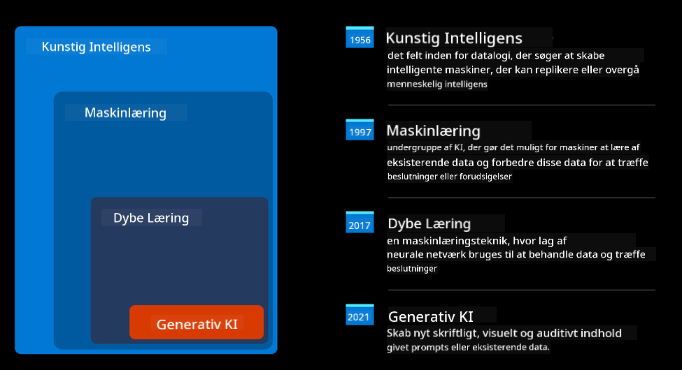
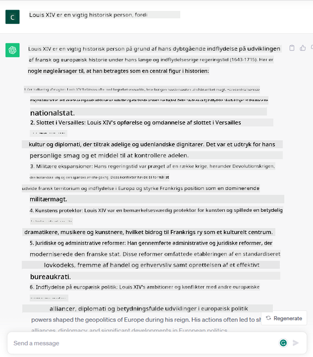

<!--
CO_OP_TRANSLATOR_METADATA:
{
  "original_hash": "f53ba0fa49164f9323043f1c6b11f2b1",
  "translation_date": "2025-07-09T07:54:49+00:00",
  "source_file": "01-introduction-to-genai/README.md",
  "language_code": "da"
}
-->
# Introduktion til Generativ AI og Store Sprogmodeller

_(Klik på billedet ovenfor for at se videoen til denne lektion)_

Generativ AI er kunstig intelligens, der kan generere tekst, billeder og andre typer indhold. Det, der gør det til en fantastisk teknologi, er, at den demokratiserer AI – alle kan bruge den med blot en tekstprompt, en sætning skrevet på et naturligt sprog. Du behøver ikke lære et sprog som Java eller SQL for at opnå noget meningsfuldt, alt hvad du skal gøre, er at bruge dit sprog, angive hvad du ønsker, og så kommer der et forslag fra en AI-model. Anvendelserne og effekten heraf er enorme; du kan skrive eller forstå rapporter, skrive ansøgninger og meget mere – alt sammen på få sekunder.

I dette undervisningsforløb vil vi udforske, hvordan vores startup udnytter generativ AI til at åbne op for nye scenarier i uddannelsesverdenen, og hvordan vi håndterer de uundgåelige udfordringer forbundet med de sociale konsekvenser af dens anvendelse samt teknologiske begrænsninger.

## Introduktion

Denne lektion vil dække:

- Introduktion til forretningsscenariet: vores startup-idé og mission.
- Generativ AI og hvordan vi er nået til det nuværende teknologilandskab.
- Den indre funktion af en stor sprogmodel.
- Hovedfunktioner og praktiske anvendelsestilfælde for Store Sprogmodeller.

## Læringsmål

Efter at have gennemført denne lektion vil du forstå:

- Hvad generativ AI er, og hvordan Store Sprogmodeller fungerer.
- Hvordan du kan udnytte store sprogmodeller til forskellige anvendelsestilfælde med fokus på uddannelsesscenarier.

## Scenarie: vores uddannelsesstartup

Generativ Kunstig Intelligens (AI) repræsenterer toppen af AI-teknologi og flytter grænserne for, hvad der tidligere blev anset som umuligt. Generative AI-modeller har mange funktioner og anvendelser, men i dette undervisningsforløb vil vi undersøge, hvordan det revolutionerer uddannelse gennem en fiktiv startup. Vi vil kalde denne startup _vores startup_. Vores startup arbejder inden for uddannelsesområdet med den ambitiøse mission:

> _at forbedre tilgængeligheden i læring på globalt plan, sikre lige adgang til uddannelse og tilbyde personlige læringsoplevelser til hver enkelt elev, tilpasset deres behov_.

Vores startup-team er klar over, at vi ikke kan nå dette mål uden at udnytte et af de mest kraftfulde værktøjer i moderne tid – Store Sprogmodeller (LLMs).

Generativ AI forventes at revolutionere den måde, vi lærer og underviser på i dag, hvor elever har virtuelle lærere til rådighed 24 timer i døgnet, som leverer store mængder information og eksempler, og lærere kan bruge innovative værktøjer til at vurdere deres elever og give feedback.

Lad os starte med at definere nogle grundlæggende begreber og terminologi, som vi vil bruge gennem hele undervisningsforløbet.

## Hvordan fik vi Generativ AI?

På trods af den enorme _hype_, der er opstået for nylig i forbindelse med annonceringen af generative AI-modeller, er denne teknologi årtier under udvikling, med de første forskningsindsatser tilbage i 60’erne. Vi er nu nået til et punkt, hvor AI har menneskelige kognitive evner, som for eksempel samtale, vist af blandt andre [OpenAI ChatGPT](https://openai.com/chatgpt) eller [Bing Chat](https://www.microsoft.com/edge/features/bing-chat?WT.mc_id=academic-105485-koreyst), som også bruger en GPT-model til websøgningssamtaler på Bing.

Hvis vi går lidt tilbage, bestod de allerførste AI-prototyper af tekstbaserede chatbots, der byggede på en vidensbase udtrukket fra en gruppe eksperter og repræsenteret i en computer. Svarene i vidensbasen blev udløst af nøgleord, der optrådte i inputteksten. Det blev dog hurtigt klart, at denne tilgang med tekstbaserede chatbots ikke skalerede godt.

### En statistisk tilgang til AI: Maskinlæring

Et vendepunkt kom i 90’erne med anvendelsen af en statistisk tilgang til tekstanalyse. Dette førte til udviklingen af nye algoritmer – kendt som maskinlæring – som kunne lære mønstre fra data uden at være eksplicit programmeret. Denne tilgang gør det muligt for maskiner at simulere menneskelig sprogforståelse: en statistisk model trænes på tekst-etiket-par, hvilket gør modellen i stand til at klassificere ukendt inputtekst med en foruddefineret etiket, der repræsenterer hensigten med beskeden.

### Neurale netværk og moderne virtuelle assistenter

I de senere år har den teknologiske udvikling af hardware, som kan håndtere større datamængder og mere komplekse beregninger, fremmet AI-forskning, hvilket har ført til udviklingen af avancerede maskinlæringsalgoritmer kendt som neurale netværk eller dyb læring.

Neurale netværk (især Recurrent Neural Networks – RNNs) forbedrede betydeligt naturlig sprogbehandling ved at gøre det muligt at repræsentere betydningen af tekst på en mere meningsfuld måde, hvor konteksten af et ord i en sætning vægtes.

Det er denne teknologi, der drev de virtuelle assistenter, som opstod i det første årti af det nye århundrede, meget dygtige til at fortolke menneskesprog, identificere et behov og udføre en handling for at opfylde det – som at svare med et foruddefineret script eller bruge en tredjepartstjeneste.

### Nutidens Generative AI

Sådan er vi nået til Generativ AI i dag, som kan ses som en underkategori af dyb læring.

Efter årtiers forskning inden for AI-området har en ny modelarkitektur – kaldet _Transformer_ – overvundet begrænsningerne ved RNN’er ved at kunne håndtere meget længere tekstsekvenser som input. Transformers er baseret på attention-mekanismen, som gør det muligt for modellen at tildele forskellige vægte til de input, den modtager, og ‘give mere opmærksomhed’ til de steder, hvor den mest relevante information er koncentreret, uanset deres rækkefølge i tekstsekvensen.

De fleste af de nyeste generative AI-modeller – også kendt som Store Sprogmodeller (LLMs), da de arbejder med tekstinput og -output – er baseret på denne arkitektur. Det interessante ved disse modeller – trænet på enorme mængder uetiketterede data fra forskellige kilder som bøger, artikler og hjemmesider – er, at de kan tilpasses til en bred vifte af opgaver og generere grammatisk korrekt tekst med en vis kreativitet. Så de har ikke kun forbedret maskinens evne til at ‘forstå’ en inputtekst, men også gjort det muligt for den at generere et originalt svar på menneskesprog.

## Hvordan fungerer store sprogmodeller?

I næste kapitel vil vi udforske forskellige typer af generative AI-modeller, men for nu lad os se på, hvordan store sprogmodeller fungerer, med fokus på OpenAI GPT (Generative Pre-trained Transformer) modeller.

- **Tokenizer, tekst til tal**: Store Sprogmodeller modtager tekst som input og genererer tekst som output. Men som statistiske modeller fungerer de langt bedre med tal end med tekstsekvenser. Derfor bliver hvert input til modellen først behandlet af en tokenizer, før det bruges af selve modellen. En token er et tekststykke – bestående af et varierende antal tegn, så tokenizerens hovedopgave er at opdele input i en række tokens. Derefter bliver hver token matchet med et tokenindeks, som er den heltalskodning af det oprindelige tekststykke.

- **Forudsigelse af output-tokens**: Givet n tokens som input (med max n, der varierer fra model til model), kan modellen forudsige én token som output. Denne token indgår derefter i input til næste iteration i et udvidende vinduesmønster, hvilket giver en bedre brugeroplevelse ved at modtage én (eller flere) sætninger som svar. Det forklarer, hvorfor du måske har oplevet, at ChatGPT nogle gange stopper midt i en sætning.

- **Udvælgelsesproces, sandsynlighedsfordeling**: Output-token vælges af modellen ud fra sandsynligheden for, at den optræder efter den aktuelle tekstsekvens. Modellen forudsiger nemlig en sandsynlighedsfordeling over alle mulige ‘næste tokens’, beregnet på baggrund af dens træning. Men det er ikke altid den token med højeste sandsynlighed, der vælges. Der tilføjes en grad af tilfældighed til valget, så modellen opfører sig ikke-deterministisk – vi får ikke det samme output hver gang for samme input. Denne tilfældighed simulerer den kreative tankeproces og kan justeres med en modelparameter kaldet temperature.

## Hvordan kan vores startup udnytte Store Sprogmodeller?

Nu hvor vi har en bedre forståelse af, hvordan en stor sprogmodel fungerer, lad os se på nogle praktiske eksempler på de mest almindelige opgaver, de kan udføre ret godt, med fokus på vores forretningsscenarie. Vi sagde, at hovedfunktionen af en Stor Sprogmodel er _at generere tekst fra bunden, ud fra et tekstinput skrevet på naturligt sprog_.

Men hvilken slags tekstinput og output?
Input til en stor sprogmodel kaldes en prompt, mens output kaldes en completion, et udtryk der henviser til modellens mekanisme til at generere den næste token for at fuldføre det aktuelle input. Vi vil dykke dybere ned i, hvad en prompt er, og hvordan man designer den for at få mest muligt ud af modellen. Men for nu kan vi sige, at en prompt kan indeholde:

- En **instruktion**, der specificerer den type output, vi forventer fra modellen. Denne instruktion kan nogle gange indeholde eksempler eller yderligere data.

  1. Opsummering af en artikel, bog, produktanmeldelser og mere, samt udtræk af indsigt fra ustrukturerede data.
    
    
  
  2. Kreativ idéudvikling og udformning af en artikel, et essay, en opgave eller mere.
      
     

- Et **spørgsmål**, stillet i form af en samtale med en agent.
  
  

- Et stykke **tekst, der skal færdiggøres**, hvilket implicit er en anmodning om skrivehjælp.
  
  

- Et stykke **kode** sammen med en anmodning om at forklare og dokumentere det, eller en kommentar, der beder om at generere et stykke kode, der udfører en specifik opgave.
  
  

Eksemplerne ovenfor er ret simple og er ikke ment som en udtømmende demonstration af Store Sprogmodellers kapaciteter. De skal vise potentialet ved at bruge generativ AI, især men ikke udelukkende i uddannelseskontekster.

Desuden er outputtet fra en generativ AI-model ikke perfekt, og nogle gange kan modellens kreativitet arbejde imod den, hvilket resulterer i et output, som brugeren kan opfatte som en forvrængning af virkeligheden eller som stødende. Generativ AI er ikke intelligent – i hvert fald ikke i den mere omfattende definition af intelligens, der inkluderer kritisk og kreativ tænkning eller følelsesmæssig intelligens; den er ikke deterministisk og ikke pålidelig, da fabrikationer som fejlagtige referencer, indhold og udsagn kan blandes med korrekt information og præsenteres på en overbevisende og selvsikker måde. I de følgende lektioner vil vi tage fat på alle disse begrænsninger og se, hvad vi kan gøre for at afbøde dem.

## Opgave

Din opgave er at læse mere om [generativ AI](https://en.wikipedia.org/wiki/Generative_artificial_intelligence?WT.mc_id=academic-105485-koreyst) og prøve at identificere et område, hvor du ville tilføje generativ AI i dag, som ikke har det. Hvordan ville effekten være anderledes end at gøre det på den "gamle måde"? Kan du gøre noget, du ikke kunne før, eller er du hurtigere? Skriv et 300-ords resumé om, hvordan din drømme-AI-startup ville se ud, og inkluder overskrifter som "Problem", "Hvordan jeg ville bruge AI", "Effekt" og eventuelt en forretningsplan.

Hvis du laver denne opgave, er du måske endda klar til at ansøge Microsofts inkubator, [Microsoft for Startups Founders Hub](https://www.microsoft.com/startups?WT.mc_id=academic-105485-koreyst). Vi tilbyder kreditter til både Azure, OpenAI, mentoring og meget mere – tjek det ud!

## Videnstest

Hvad er sandt om store sprogmodeller?

1. Du får det samme svar hver gang.
1. Den gør tingene perfekt, er god til at lægge tal sammen, producere fungerende kode osv.
1. Svaret kan variere, selvom du bruger den samme prompt. Den er også god til at give dig et første udkast af noget, hvad enten det er tekst eller kode. Men du skal forbedre resultatet.

Svar: 3, en LLM er ikke-deterministisk, svaret varierer, men du kan styre variationen via en temperaturindstilling. Du bør heller ikke forvente, at den gør tingene perfekt; den er her for at gøre det tunge løft for dig, hvilket ofte betyder, at du får et godt første forsøg, som du skal forbedre gradvist.

## Godt arbejde! Fortsæt rejsen

Efter at have gennemført denne lektion, kan du tjekke vores [Generative AI Learning collection](https://aka.ms/genai-collection?WT.mc_id=academic-105485-koreyst) for at fortsætte med at udvikle din viden om Generativ AI!
Gå videre til Lektion 2, hvor vi vil se på, hvordan man [udforsker og sammenligner forskellige typer LLM](../02-exploring-and-comparing-different-llms/README.md?WT.mc_id=academic-105485-koreyst)!

**Ansvarsfraskrivelse**:  
Dette dokument er blevet oversat ved hjælp af AI-oversættelsestjenesten [Co-op Translator](https://github.com/Azure/co-op-translator). Selvom vi bestræber os på nøjagtighed, bedes du være opmærksom på, at automatiserede oversættelser kan indeholde fejl eller unøjagtigheder. Det oprindelige dokument på dets oprindelige sprog bør betragtes som den autoritative kilde. For kritisk information anbefales professionel menneskelig oversættelse. Vi påtager os intet ansvar for misforståelser eller fejltolkninger, der opstår som følge af brugen af denne oversættelse.