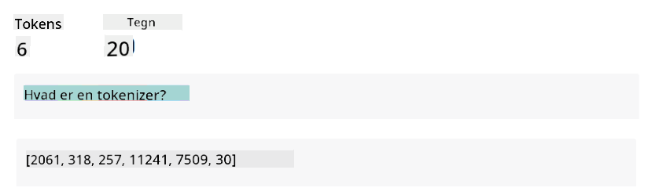
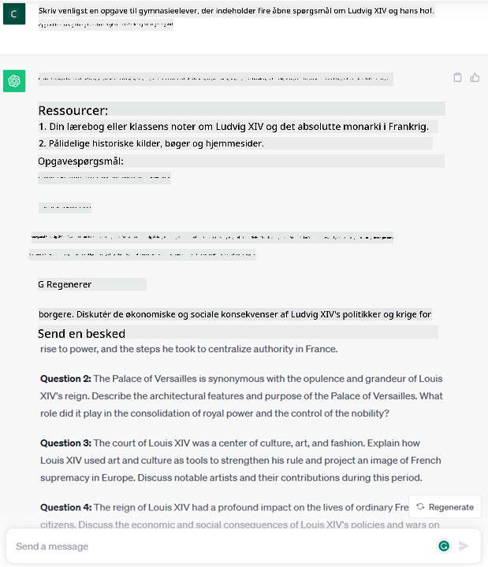
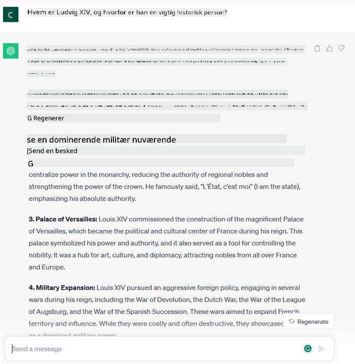

<!--
CO_OP_TRANSLATOR_METADATA:
{
  "original_hash": "bfb7901bdbece1ba3e9f35c400ca33e8",
  "translation_date": "2025-10-17T19:14:15+00:00",
  "source_file": "01-introduction-to-genai/README.md",
  "language_code": "da"
}
-->
# Introduktion til Generativ AI og Store Sproglige Modeller

_(Klik på billedet ovenfor for at se videoen til denne lektion)_

Generativ AI er kunstig intelligens, der er i stand til at generere tekst, billeder og andre typer indhold. Det, der gør det til en fantastisk teknologi, er, at det demokratiserer AI – alle kan bruge det med blot en tekstprompt, en sætning skrevet i naturligt sprog. Du behøver ikke at lære et programmeringssprog som Java eller SQL for at opnå noget værdifuldt; alt, hvad du behøver, er at bruge dit eget sprog, angive, hvad du ønsker, og så kommer der et forslag fra en AI-model. Anvendelserne og effekten af dette er enorme – du kan skrive eller forstå rapporter, lave applikationer og meget mere, alt sammen på få sekunder.

I dette pensum vil vi udforske, hvordan vores startup udnytter generativ AI til at åbne op for nye scenarier inden for uddannelsesverdenen, og hvordan vi håndterer de uundgåelige udfordringer forbundet med de sociale implikationer af dens anvendelse og teknologiens begrænsninger.

## Introduktion

Denne lektion vil dække:

- Introduktion til forretningsscenariet: vores startup-idé og mission.
- Generativ AI og hvordan vi er nået til det nuværende teknologilandskab.
- Hvordan en stor sproglig model fungerer.
- Hovedfunktioner og praktiske anvendelser af Store Sproglige Modeller.

## Læringsmål

Efter at have gennemført denne lektion vil du forstå:

- Hvad generativ AI er, og hvordan Store Sproglige Modeller fungerer.
- Hvordan du kan udnytte store sproglige modeller til forskellige anvendelser, med fokus på uddannelsesscenarier.

## Scenario: vores uddannelses-startup

Generativ kunstig intelligens (AI) repræsenterer toppen af AI-teknologi og skubber grænserne for, hvad der engang blev anset som umuligt. Generative AI-modeller har flere funktioner og anvendelser, men i dette pensum vil vi udforske, hvordan det revolutionerer uddannelse gennem en fiktiv startup. Vi vil referere til denne startup som _vores startup_. Vores startup arbejder inden for uddannelsesområdet med den ambitiøse mission:

> _at forbedre tilgængeligheden af læring på globalt plan, sikre lige adgang til uddannelse og tilbyde personlige læringsoplevelser til hver enkelt elev, baseret på deres behov_.

Vores startup-team er klar over, at vi ikke vil kunne opnå dette mål uden at udnytte et af de mest kraftfulde værktøjer i moderne tid – Store Sproglige Modeller (LLMs).

Generativ AI forventes at revolutionere den måde, vi lærer og underviser på i dag, med studerende, der har virtuelle lærere til rådighed 24 timer i døgnet, som giver store mængder information og eksempler, og lærere, der kan udnytte innovative værktøjer til at vurdere deres elever og give feedback.

Lad os starte med at definere nogle grundlæggende begreber og terminologi, som vi vil bruge gennem hele pensum.

## Hvordan fik vi Generativ AI?

På trods af den ekstraordinære _hype_, der for nylig er skabt af annonceringen af generative AI-modeller, har denne teknologi været under udvikling i årtier, med de første forskningsindsatser, der går tilbage til 60'erne. Vi er nu på et punkt, hvor AI har menneskelige kognitive evner, som samtale, vist for eksempel af [OpenAI ChatGPT](https://openai.com/chatgpt) eller [Bing Chat](https://www.microsoft.com/edge/features/bing-chat?WT.mc_id=academic-105485-koreyst), som også bruger en GPT-model til websøgnings-Bing-samtaler.

Hvis vi går lidt tilbage, bestod de allerførste prototyper af AI af skrivemaskine-chatbots, der var afhængige af en vidensbase udtrukket fra en gruppe eksperter og repræsenteret i en computer. Svarene i vidensbasen blev udløst af nøgleord, der optrådte i inputteksten.
Det blev dog hurtigt klart, at en sådan tilgang med skrivemaskine-chatbots ikke skalerede godt.

### En statistisk tilgang til AI: Maskinlæring

Et vendepunkt kom i 90'erne med anvendelsen af en statistisk tilgang til tekstanalyse. Dette førte til udviklingen af nye algoritmer – kendt som maskinlæring – der var i stand til at lære mønstre fra data uden at være eksplicit programmeret. Denne tilgang gør det muligt for maskiner at simulere menneskelig sprogforståelse: en statistisk model trænes på tekst-label-parringer, hvilket gør det muligt for modellen at klassificere ukendt inputtekst med en foruddefineret label, der repræsenterer budskabets intention.

### Neurale netværk og moderne virtuelle assistenter

I de senere år har den teknologiske udvikling inden for hardware, der er i stand til at håndtere større mængder data og mere komplekse beregninger, opmuntret forskning inden for AI og ført til udviklingen af avancerede maskinlæringsalgoritmer kendt som neurale netværk eller dyb læringsalgoritmer.

Neurale netværk (og især Recurrent Neural Networks – RNNs) forbedrede naturlig sprogbehandling betydeligt, hvilket gjorde det muligt at repræsentere betydningen af tekst på en mere meningsfuld måde, hvor konteksten af et ord i en sætning blev værdsat.

Dette er teknologien, der drev de virtuelle assistenter, der blev født i det første årti af det nye århundrede, meget dygtige til at fortolke menneskeligt sprog, identificere et behov og udføre en handling for at opfylde det – som at svare med et foruddefineret script eller forbruge en tredjepartstjeneste.

### Nutidens Generative AI

Sådan er vi kommet til Generativ AI i dag, som kan ses som en underkategori af dyb læring.

Efter årtiers forskning inden for AI-feltet overvandt en ny modelarkitektur – kaldet _Transformer_ – begrænsningerne ved RNNs, da den var i stand til at modtage meget længere tekstsekvenser som input. Transformers er baseret på opmærksomhedsmekanismen, der gør det muligt for modellen at give forskellige vægte til de input, den modtager, og 'fokusere mere' der, hvor de mest relevante oplysninger er koncentreret, uanset deres rækkefølge i tekstsekvensen.

De fleste af de nyere generative AI-modeller – også kendt som Store Sproglige Modeller (LLMs), da de arbejder med tekstbaserede input og output – er faktisk baseret på denne arkitektur. Det interessante ved disse modeller – trænet på enorme mængder ustrukturerede data fra forskellige kilder som bøger, artikler og hjemmesider – er, at de kan tilpasses en bred vifte af opgaver og generere grammatisk korrekt tekst med en vis grad af kreativitet. Så ikke alene har de utroligt forbedret en maskines evne til at 'forstå' en inputtekst, men de har også gjort det muligt for den at generere et originalt svar på menneskeligt sprog.

## Hvordan fungerer store sproglige modeller?

I det næste kapitel vil vi udforske forskellige typer af generative AI-modeller, men for nu lad os se på, hvordan store sproglige modeller fungerer, med fokus på OpenAI GPT (Generative Pre-trained Transformer) modeller.

- **Tokenizer, tekst til tal**: Store Sproglige Modeller modtager en tekst som input og genererer en tekst som output. Men da de er statistiske modeller, fungerer de meget bedre med tal end med tekstsekvenser. Derfor behandles hvert input til modellen af en tokenizer, før det bruges af selve modellen. En token er en tekstbid – bestående af et variabelt antal tegn, så tokenizerens hovedopgave er at opdele inputtet i en række tokens. Derefter matches hver token med et token-indeks, som er den numeriske kodning af den oprindelige tekstbid.

- **Forudsigelse af output-tokens**: Givet n tokens som input (med maks n, der varierer fra model til model), er modellen i stand til at forudsige én token som output. Denne token inkorporeres derefter i inputtet til næste iteration i et udvidende vinduesmønster, hvilket muliggør en bedre brugeroplevelse ved at få en (eller flere) sætninger som svar. Dette forklarer, hvorfor du, hvis du nogensinde har prøvet ChatGPT, måske har bemærket, at den nogle gange ser ud til at stoppe midt i en sætning.

- **Udvælgelsesproces, sandsynlighedsfordeling**: Output-tokenen vælges af modellen i henhold til dens sandsynlighed for at forekomme efter den aktuelle tekstsekvens. Dette skyldes, at modellen forudsiger en sandsynlighedsfordeling over alle mulige 'næste tokens', beregnet baseret på dens træning. Dog vælges ikke altid den token med den højeste sandsynlighed fra den resulterende fordeling. En grad af tilfældighed tilføjes til dette valg, så modellen opfører sig på en ikke-deterministisk måde – vi får ikke nøjagtigt det samme output for det samme input. Denne grad af tilfældighed tilføjes for at simulere processen med kreativ tænkning, og den kan justeres ved hjælp af en modelparameter kaldet temperatur.

## Hvordan kan vores startup udnytte Store Sproglige Modeller?

Nu hvor vi har en bedre forståelse af, hvordan en stor sproglig model fungerer, lad os se på nogle praktiske eksempler på de mest almindelige opgaver, de kan udføre ret godt, med fokus på vores forretningsscenario.
Vi sagde, at den primære funktion af en Stor Sproglig Model er _at generere tekst fra bunden, baseret på et tekstbaseret input, skrevet i naturligt sprog_.

Men hvilken slags tekstbaseret input og output?
Inputtet til en stor sproglig model er kendt som en prompt, mens outputtet er kendt som en completion, et begreb der refererer til modellens mekanisme til at generere den næste token for at fuldføre det aktuelle input. Vi vil dykke dybere ned i, hvad en prompt er, og hvordan man designer den på en måde, der får mest muligt ud af vores model. Men for nu lad os bare sige, at en prompt kan inkludere:

- En **instruktion**, der specificerer typen af output, vi forventer fra modellen. Denne instruktion kan nogle gange indeholde eksempler eller yderligere data.

  1. Opsummering af en artikel, bog, produktanmeldelser og mere, sammen med udtræk af indsigt fra ustrukturerede data.
    
    
  
  2. Kreativ idéudvikling og design af en artikel, et essay, en opgave eller mere.
      
     

- Et **spørgsmål**, stillet i form af en samtale med en agent.
  
  

- Et stykke **tekst til at fuldføre**, som implicit er en anmodning om skrivehjælp.
  
  

- Et stykke **kode** sammen med en anmodning om at forklare og dokumentere det, eller en kommentar, der beder om at generere et stykke kode, der udfører en specifik opgave.
  
  

Ovenstående eksempler er ret simple og er ikke beregnet til at være en udtømmende demonstration af Store Sproglige Modellers kapaciteter. De er ment til at vise potentialet ved at bruge generativ AI, især men ikke begrænset til uddannelsesmæssige kontekster.

Desuden er outputtet fra en generativ AI-model ikke perfekt, og nogle gange kan modellens kreativitet virke imod den, hvilket resulterer i et output, der er en kombination af ord, som den menneskelige bruger kan tolke som en forvrængning af virkeligheden, eller som kan være stødende. Generativ AI er ikke intelligent – i hvert fald ikke i den mere omfattende definition af intelligens, der inkluderer kritisk og kreativ ræsonnement eller følelsesmæssig intelligens; den er ikke deterministisk, og den er ikke pålidelig, da fabrikationer, såsom fejlagtige referencer, indhold og udsagn, kan kombineres med korrekt information og præsenteres på en overbevisende og selvsikker måde. I de følgende lektioner vil vi tage fat på alle disse begrænsninger og se, hvad vi kan gøre for at afhjælpe dem.

## Opgave

Din opgave er at læse mere om [generativ AI](https://en.wikipedia.org/wiki/Generative_artificial_intelligence?WT.mc_id=academic-105485-koreyst) og forsøge at identificere et område, hvor du ville tilføje generativ AI i dag, som ikke allerede har det. Hvordan ville effekten være anderledes end at gøre det på den "gamle måde"? Kan du gøre noget, du ikke kunne før, eller er du hurtigere? Skriv et 300-ords resumé om, hvordan din drømme-AI-startup ville se ud, og inkluder overskrifter som "Problem", "Hvordan jeg ville bruge AI", "Effekt" og eventuelt en forretningsplan.

Hvis du udfører denne opgave, er du måske endda klar til at ansøge om Microsofts inkubator, [Microsoft for Startups Founders Hub](https://www.microsoft.com/startups?WT.mc_id=academic-105485-koreyst), hvor vi tilbyder kreditter til både Azure, OpenAI, mentoring og meget mere – tjek det ud!

## Videnscheck

Hvad er sandt om store sproglige modeller?

1. Du får det samme svar hver gang.
1. Den gør alting perfekt, er god til at lægge tal sammen, producere fungerende kode osv.
1. Svaret kan variere, selvom du bruger den samme prompt. Den er også god til at give dig et første udkast til noget, hvad enten det er tekst eller kode. Men du skal forbedre resultaterne.

A: 3, en LLM er ikke-deterministisk, svaret varierer, men du kan kontrollere dens variation via en temperaturindstilling. Du bør heller ikke forvente, at den gør alting perfekt – den er her for at tage det tunge arbejde for dig, hvilket ofte betyder, at du får et godt første forsøg på noget, som du gradvist skal forbedre.

## Godt arbejde! Fortsæt rejsen

Efter at have gennemført denne lektion, kan du tjekke vores [Generativ AI Læringssamling](https://aka.ms/genai-collection?WT.mc_id=academic-105485-koreyst) for at fortsætte med at opbygge din viden om Generativ AI!
Gå videre til Lektion 2, hvor vi vil se på, hvordan man [undersøger og sammenligner forskellige LLM-typer](../02-exploring-and-comparing-different-llms/README.md?WT.mc_id=academic-105485-koreyst)!

---

**Ansvarsfraskrivelse**:  
Dette dokument er blevet oversat ved hjælp af AI-oversættelsestjenesten [Co-op Translator](https://github.com/Azure/co-op-translator). Selvom vi bestræber os på nøjagtighed, skal det bemærkes, at automatiserede oversættelser kan indeholde fejl eller unøjagtigheder. Det originale dokument på dets oprindelige sprog bør betragtes som den autoritative kilde. For kritisk information anbefales professionel menneskelig oversættelse. Vi er ikke ansvarlige for eventuelle misforståelser eller fejltolkninger, der opstår som følge af brugen af denne oversættelse.