<!--
CO_OP_TRANSLATOR_METADATA:
{
  "original_hash": "e2f686f2eb794941761252ac5e8e090b",
  "translation_date": "2025-07-09T08:29:00+00:00",
  "source_file": "02-exploring-and-comparing-different-llms/README.md",
  "language_code": "da"
}
-->
# Udforskning og sammenligning af forskellige LLM'er

[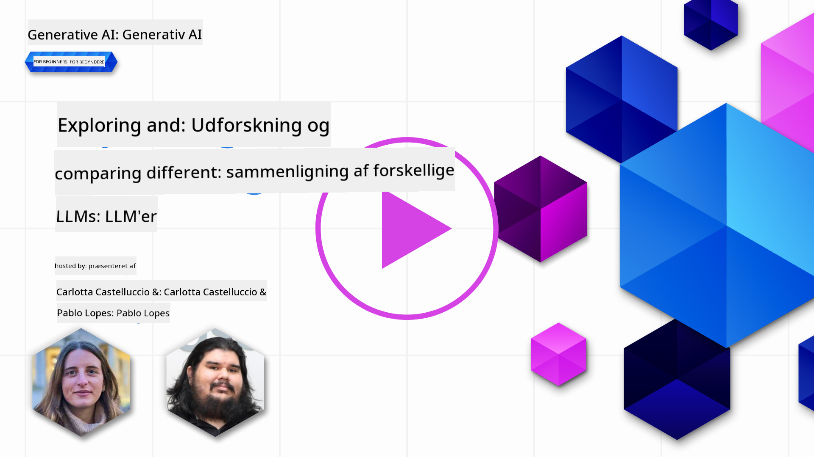](https://aka.ms/gen-ai-lesson2-gh?WT.mc_id=academic-105485-koreyst)

> _Klik på billedet ovenfor for at se videoen til denne lektion_

I den forrige lektion har vi set, hvordan Generativ AI ændrer teknologilandskabet, hvordan Large Language Models (LLM'er) fungerer, og hvordan en virksomhed – som vores startup – kan anvende dem til deres brugsscenarier og vokse! I dette kapitel vil vi sammenligne og kontrastere forskellige typer af store sprogmodeller (LLM'er) for at forstå deres fordele og ulemper.

Det næste skridt i vores startups rejse er at udforske det nuværende landskab af LLM'er og forstå, hvilke der er egnede til vores brugsscenarie.

## Introduktion

Denne lektion vil dække:

- Forskellige typer af LLM'er i det nuværende landskab.
- Test, iteration og sammenligning af forskellige modeller til dit brugsscenarie i Azure.
- Hvordan man implementerer en LLM.

## Læringsmål

Efter at have gennemført denne lektion vil du kunne:

- Vælge den rigtige model til dit brugsscenarie.
- Forstå, hvordan du tester, itererer og forbedrer din models ydeevne.
- Vide, hvordan virksomheder implementerer modeller.

## Forstå forskellige typer af LLM'er

LLM'er kan kategoriseres på flere måder baseret på deres arkitektur, træningsdata og brugsscenarie. At forstå disse forskelle vil hjælpe vores startup med at vælge den rette model til situationen og forstå, hvordan man tester, itererer og forbedrer ydeevnen.

Der findes mange forskellige typer af LLM-modeller, og dit valg afhænger af, hvad du ønsker at bruge dem til, dine data, hvor meget du er villig til at betale og mere.

Afhængigt af om du vil bruge modellerne til tekst, lyd, video, billedgenerering osv., kan du vælge en anden type model.

- **Lyd- og talegenkendelse**. Til dette formål er Whisper-typer modeller et godt valg, da de er alsidige og rettet mod talegenkendelse. De er trænet på forskelligartet lyd og kan udføre flersproget talegenkendelse. Læs mere om [Whisper-typer modeller her](https://platform.openai.com/docs/models/whisper?WT.mc_id=academic-105485-koreyst).

- **Billedgenerering**. Til billedgenerering er DALL-E og Midjourney to meget kendte valg. DALL-E tilbydes af Azure OpenAI. [Læs mere om DALL-E her](https://platform.openai.com/docs/models/dall-e?WT.mc_id=academic-105485-koreyst) og også i kapitel 9 i dette pensum.

- **Tekstgenerering**. De fleste modeller er trænet til tekstgenerering, og du har et stort udvalg fra GPT-3.5 til GPT-4. De har forskellige omkostninger, hvor GPT-4 er den dyreste. Det er værd at kigge på [Azure OpenAI playground](https://oai.azure.com/portal/playground?WT.mc_id=academic-105485-koreyst) for at vurdere, hvilke modeller der bedst passer til dine behov med hensyn til kapabilitet og pris.

- **Multi-modalitet**. Hvis du ønsker at håndtere flere typer data i input og output, kan du overveje modeller som [gpt-4 turbo med vision eller gpt-4o](https://learn.microsoft.com/azure/ai-services/openai/concepts/models#gpt-4-and-gpt-4-turbo-models?WT.mc_id=academic-105485-koreyst) – de nyeste OpenAI-modeller – som kan kombinere naturlig sprogbehandling med visuel forståelse og muliggør interaktioner gennem multimodale grænseflader.

At vælge en model betyder, at du får nogle grundlæggende funktioner, som dog ikke altid er tilstrækkelige. Ofte har man virksomheds-specifikke data, som man på en eller anden måde skal fortælle LLM’en om. Der findes flere forskellige tilgange til dette, som vi vil komme nærmere ind på i de kommende afsnit.

### Foundation Models versus LLM'er

Begrebet Foundation Model blev [introduceret af forskere fra Stanford](https://arxiv.org/abs/2108.07258?WT.mc_id=academic-105485-koreyst) og defineres som en AI-model, der opfylder visse kriterier, såsom:

- **De er trænet ved hjælp af unsupervised learning eller self-supervised learning**, hvilket betyder, at de er trænet på ikke-mærkede multimodale data og ikke kræver menneskelig annotering eller mærkning af data til træningsprocessen.
- **De er meget store modeller**, baseret på dybe neurale netværk trænet på milliarder af parametre.
- **De er normalt designet til at fungere som en ‘foundation’ for andre modeller**, hvilket betyder, at de kan bruges som udgangspunkt for at bygge andre modeller ovenpå, hvilket kan gøres ved finjustering.

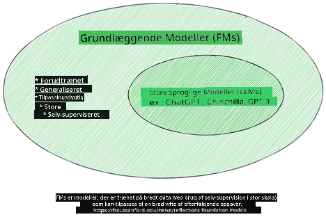

Billedkilde: [Essential Guide to Foundation Models and Large Language Models | by Babar M Bhatti | Medium](https://thebabar.medium.com/essential-guide-to-foundation-models-and-large-language-models-27dab58f7404)

For at tydeliggøre denne forskel, lad os tage ChatGPT som eksempel. Til at bygge den første version af ChatGPT blev en model kaldet GPT-3.5 brugt som foundation model. Det betyder, at OpenAI brugte noget chat-specifikt data til at skabe en finjusteret version af GPT-3.5, der var specialiseret i at klare sig godt i samtalescenarier, som f.eks. chatbots.

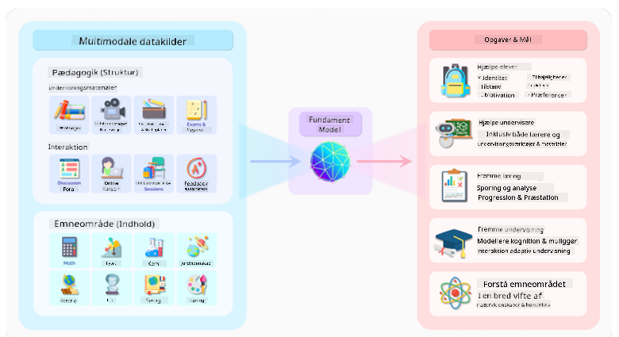

Billedkilde: [2108.07258.pdf (arxiv.org)](https://arxiv.org/pdf/2108.07258.pdf?WT.mc_id=academic-105485-koreyst)

### Open Source versus Proprietære modeller

En anden måde at kategorisere LLM'er på er, om de er open source eller proprietære.

Open source-modeller er modeller, der er gjort tilgængelige for offentligheden og kan bruges af alle. De stilles ofte til rådighed af virksomheden, der har skabt dem, eller af forskningsfællesskabet. Disse modeller må inspiceres, modificeres og tilpasses til forskellige brugsscenarier inden for LLM’er. Dog er de ikke altid optimeret til produktionsbrug og kan mangle ydeevne sammenlignet med proprietære modeller. Finansiering til open source-modeller kan være begrænset, og de vedligeholdes måske ikke på lang sigt eller opdateres ikke med den nyeste forskning. Eksempler på populære open source-modeller inkluderer [Alpaca](https://crfm.stanford.edu/2023/03/13/alpaca.html?WT.mc_id=academic-105485-koreyst), [Bloom](https://huggingface.co/bigscience/bloom) og [LLaMA](https://llama.meta.com).

Proprietære modeller ejes af en virksomhed og er ikke tilgængelige for offentligheden. Disse modeller er ofte optimeret til produktionsbrug. De må ikke inspiceres, modificeres eller tilpasses til forskellige brugsscenarier. De er heller ikke altid gratis og kan kræve abonnement eller betaling for brug. Brugere har ikke kontrol over de data, der bruges til at træne modellen, hvilket betyder, at de skal have tillid til model-ejeren for at sikre databeskyttelse og ansvarlig AI-anvendelse. Eksempler på populære proprietære modeller inkluderer [OpenAI modeller](https://platform.openai.com/docs/models/overview?WT.mc_id=academic-105485-koreyst), [Google Bard](https://sapling.ai/llm/bard?WT.mc_id=academic-105485-koreyst) og [Claude 2](https://www.anthropic.com/index/claude-2?WT.mc_id=academic-105485-koreyst).

### Embedding versus billedgenerering versus tekst- og kodegenerering

LLM'er kan også kategoriseres efter den type output, de genererer.

Embeddings er en type modeller, der kan omdanne tekst til en numerisk form, kaldet embedding, som er en numerisk repræsentation af input-teksten. Embeddings gør det lettere for maskiner at forstå relationerne mellem ord eller sætninger og kan bruges som input til andre modeller, såsom klassifikationsmodeller eller klyngeanalyser, der har bedre ydeevne på numeriske data. Embedding-modeller bruges ofte til transfer learning, hvor en model bygges til en surrogatopgave med rigeligt data, og derefter genbruges modelvægt (embeddings) til andre opgaver. Et eksempel på denne kategori er [OpenAI embeddings](https://platform.openai.com/docs/models/embeddings?WT.mc_id=academic-105485-koreyst).

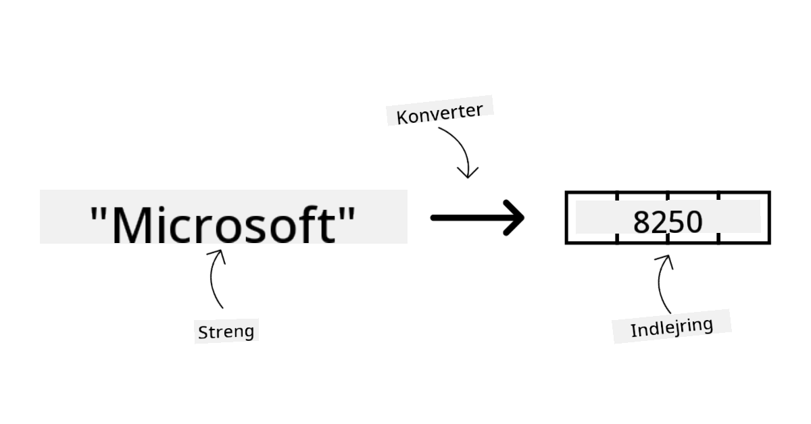

Billedgenereringsmodeller er modeller, der genererer billeder. Disse modeller bruges ofte til billedredigering, billedsyntese og billedoversættelse. De trænes ofte på store billeddatasæt, såsom [LAION-5B](https://laion.ai/blog/laion-5b/?WT.mc_id=academic-105485-koreyst), og kan bruges til at generere nye billeder eller redigere eksisterende billeder med teknikker som inpainting, superopløsning og farvelægning. Eksempler inkluderer [DALL-E-3](https://openai.com/dall-e-3?WT.mc_id=academic-105485-koreyst) og [Stable Diffusion modeller](https://github.com/Stability-AI/StableDiffusion?WT.mc_id=academic-105485-koreyst).

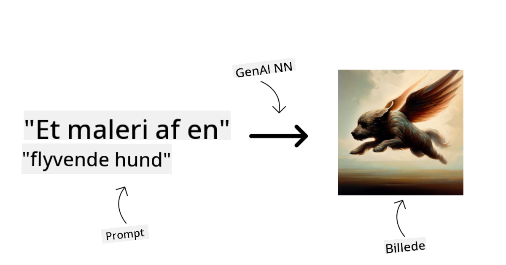

Tekst- og kodegenereringsmodeller er modeller, der genererer tekst eller kode. De bruges ofte til tekstopsummering, oversættelse og besvarelse af spørgsmål. Tekstgenereringsmodeller trænes ofte på store tekstdatasæt, såsom [BookCorpus](https://www.cv-foundation.org/openaccess/content_iccv_2015/html/Zhu_Aligning_Books_and_ICCV_2015_paper.html?WT.mc_id=academic-105485-koreyst), og kan bruges til at generere ny tekst eller besvare spørgsmål. Kodegenereringsmodeller, som [CodeParrot](https://huggingface.co/codeparrot?WT.mc_id=academic-105485-koreyst), trænes ofte på store kodemængder, såsom GitHub, og kan bruges til at generere ny kode eller rette fejl i eksisterende kode.

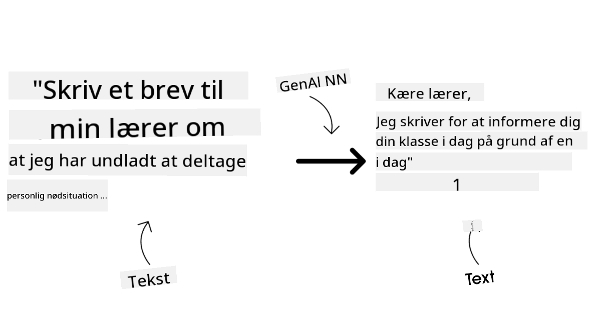

### Encoder-Decoder versus Decoder-only

For at forklare de forskellige typer arkitekturer i LLM'er, lad os bruge en analogi.

Forestil dig, at din leder har givet dig opgaven at skrive en quiz til eleverne. Du har to kolleger; den ene står for at skabe indholdet, og den anden står for at gennemgå det.

Indholdsskaberen er som en Decoder-only model, de kan se på emnet og det, du allerede har skrevet, og så skrive et kursus baseret på det. De er gode til at skrive engagerende og informativt indhold, men er ikke så gode til at forstå emnet og læringsmålene. Nogle eksempler på Decoder-modeller er GPT-familien, såsom GPT-3.

Gennemgåeren er som en Encoder-only model, de ser på det skrevne kursus og svarene, bemærker relationerne mellem dem og forstår konteksten, men er ikke gode til at generere indhold. Et eksempel på en Encoder-only model er BERT.

Forestil dig, at vi også kan have en, der både kan skabe og gennemgå quizzen – det er en Encoder-Decoder model. Eksempler på sådanne modeller er BART og T5.

### Service versus Model

Lad os nu tale om forskellen mellem en service og en model. En service er et produkt, der tilbydes af en Cloud Service Provider, og er ofte en kombination af modeller, data og andre komponenter. En model er den centrale komponent i en service og er ofte en foundation model, såsom en LLM.

Services er ofte optimeret til produktionsbrug og er ofte nemmere at bruge end modeller via en grafisk brugerflade. Services er dog ikke altid gratis og kan kræve abonnement eller betaling for brug, til gengæld for at udnytte serviceudbyderens udstyr og ressourcer, optimere omkostninger og let skalere. Et eksempel på en service er [Azure OpenAI Service](https://learn.microsoft.com/azure/ai-services/openai/overview?WT.mc_id=academic-105485-koreyst), som tilbyder en pay-as-you-go prisplan, hvor brugere betaler proportionalt med deres forbrug. Azure OpenAI Service tilbyder også sikkerhed på virksomhedsniveau og en ansvarlig AI-ramme oven på modellernes kapabiliteter.

Modeller er blot det neurale netværk med parametre, vægte og andet. Virksomheder kan køre dem lokalt, men skal så købe udstyr, bygge en struktur til skalering og købe en licens eller bruge en open source-model. En model som LLaMA er tilgængelig til brug, men kræver regnekraft for at køre.

## Hvordan man tester og itererer med forskellige modeller for at forstå ydeevne i Azure

Når vores team har udforsket det nuværende LLM-landskab og identificeret nogle gode kandidater til deres scenarier, er næste skridt at teste dem på deres data og arbejdsbelastning. Dette er en iterativ proces, der foregår gennem eksperimenter og målinger.
De fleste af de modeller, vi nævnte i de foregående afsnit (OpenAI-modeller, open source-modeller som Llama2 og Hugging Face-transformers), er tilgængelige i [Model Catalog](https://learn.microsoft.com/azure/ai-studio/how-to/model-catalog-overview?WT.mc_id=academic-105485-koreyst) i [Azure AI Studio](https://ai.azure.com/?WT.mc_id=academic-105485-koreyst).

[Azure AI Studio](https://learn.microsoft.com/azure/ai-studio/what-is-ai-studio?WT.mc_id=academic-105485-koreyst) er en cloudplatform designet til udviklere, der vil bygge generative AI-applikationer og styre hele udviklingslivscyklussen – fra eksperimentering til evaluering – ved at samle alle Azure AI-tjenester i et enkelt hub med en brugervenlig GUI. Model Catalog i Azure AI Studio giver brugeren mulighed for at:

- Finde det Foundation Model, man er interesseret i, i kataloget – enten proprietært eller open source, med filtrering efter opgave, licens eller navn. For at gøre søgningen lettere er modellerne organiseret i samlinger, som Azure OpenAI-samlingen, Hugging Face-samlingen og flere.

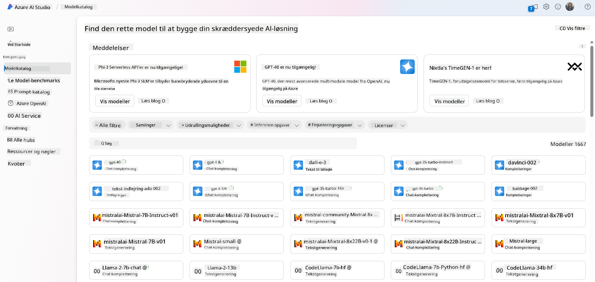

- Gennemgå modelkortet, som indeholder en detaljeret beskrivelse af tiltænkt brug og træningsdata, kodeeksempler og evalueringsresultater fra det interne evalueringsbibliotek.

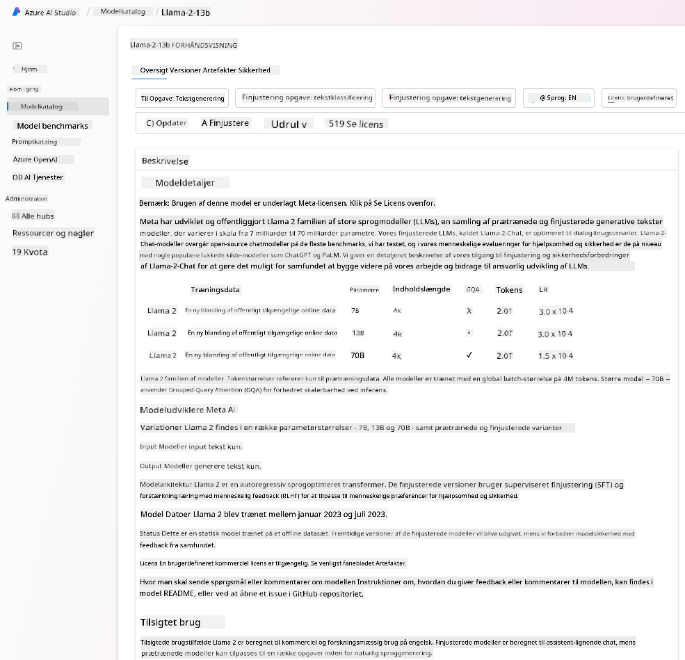

- Sammenligne benchmarks på tværs af modeller og datasæt tilgængelige i branchen for at vurdere, hvilken der passer til forretningsscenariet, via [Model Benchmarks](https://learn.microsoft.com/azure/ai-studio/how-to/model-benchmarks?WT.mc_id=academic-105485-koreyst)-panelet.

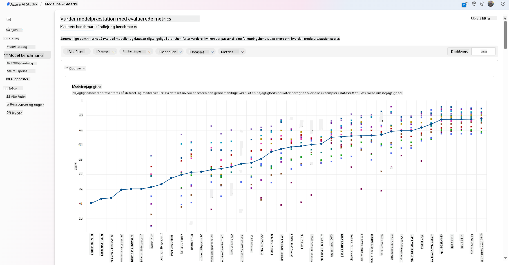

- Finjustere modellen på egne træningsdata for at forbedre modellens ydeevne i en specifik arbejdsbyrde ved at udnytte eksperimenterings- og sporingsfunktionerne i Azure AI Studio.

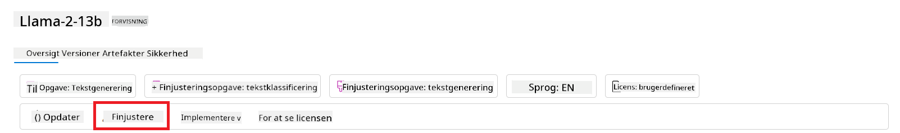

- Udrulle den oprindelige fortrænede model eller den finjusterede version til en fjern realtidsinference – managed compute – eller serverløs API-endpoint – [pay-as-you-go](https://learn.microsoft.com/azure/ai-studio/how-to/model-catalog-overview#model-deployment-managed-compute-and-serverless-api-pay-as-you-go?WT.mc_id=academic-105485-koreyst) – for at gøre det muligt for applikationer at bruge den.

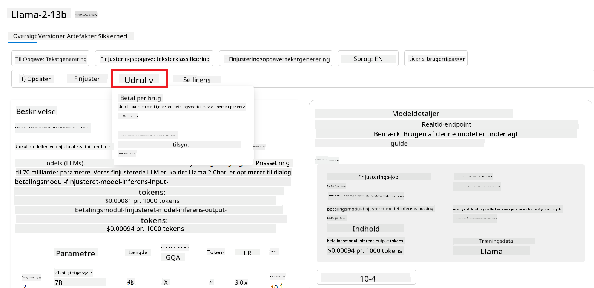

> [!NOTE]
> Ikke alle modeller i kataloget er i øjeblikket tilgængelige for finjustering og/eller pay-as-you-go-udrulning. Tjek modelkortet for detaljer om modellens kapaciteter og begrænsninger.

## Forbedring af LLM-resultater

Vi har sammen med vores startup-team undersøgt forskellige typer LLM’er og en cloudplatform (Azure Machine Learning), som gør det muligt for os at sammenligne forskellige modeller, evaluere dem på testdata, forbedre ydeevnen og udrulle dem på inference-endpoints.

Men hvornår bør man overveje at finjustere en model frem for at bruge en fortrænet? Findes der andre metoder til at forbedre modellens ydeevne på specifikke arbejdsopgaver?

Der er flere tilgange, en virksomhed kan bruge for at opnå de ønskede resultater med en LLM. Man kan vælge forskellige typer modeller med varierende grader af træning, når man udruller en LLM i produktion, med forskellige niveauer af kompleksitet, omkostninger og kvalitet. Her er nogle forskellige tilgange:

- **Prompt engineering med kontekst**. Ideen er at give nok kontekst i prompten for at sikre, at man får de svar, man har brug for.

- **Retrieval Augmented Generation, RAG**. Dine data kan for eksempel findes i en database eller et web-endpoint. For at sikre, at disse data eller et udsnit af dem inkluderes ved prompten, kan du hente de relevante data og gøre dem til en del af brugerens prompt.

- **Finjusteret model**. Her træner du modellen yderligere på dine egne data, hvilket gør modellen mere præcis og lydhør over for dine behov, men det kan være omkostningstungt.

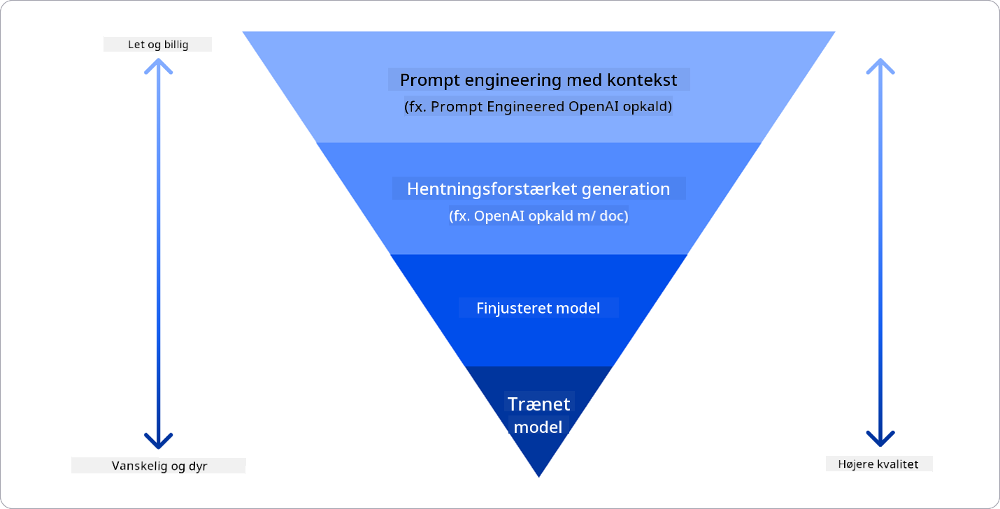

Billedkilde: [Four Ways that Enterprises Deploy LLMs | Fiddler AI Blog](https://www.fiddler.ai/blog/four-ways-that-enterprises-deploy-llms?WT.mc_id=academic-105485-koreyst)

### Prompt Engineering med Kontekst

Fortrænede LLM’er fungerer rigtig godt på generelle opgaver inden for naturligt sprog, selv ved at kalde dem med en kort prompt, som en sætning der skal fuldføres eller et spørgsmål – det såkaldte “zero-shot” læring.

Men jo mere brugeren kan indramme sin forespørgsel med en detaljeret anmodning og eksempler – altså konteksten – desto mere præcis og tæt på brugerens forventninger bliver svaret. Her taler vi om “one-shot” læring, hvis prompten kun indeholder ét eksempel, og “few-shot” læring, hvis den indeholder flere eksempler. Prompt engineering med kontekst er den mest omkostningseffektive måde at komme i gang på.

### Retrieval Augmented Generation (RAG)

LLM’er har den begrænsning, at de kun kan bruge de data, der er blevet brugt under deres træning, til at generere et svar. Det betyder, at de ikke kender til begivenheder, der er sket efter træningsprocessen, og de kan ikke tilgå ikke-offentlig information (som virksomhedsdata).  
Dette kan overvindes med RAG, en teknik der udvider prompten med eksterne data i form af dokumentstykker, under hensyntagen til promptens længdebegrænsninger. Dette understøttes af vektordatabaser (som [Azure Vector Search](https://learn.microsoft.com/azure/search/vector-search-overview?WT.mc_id=academic-105485-koreyst)), der henter de relevante stykker fra forskellige foruddefinerede datakilder og tilføjer dem til promptens kontekst.

Denne teknik er meget nyttig, når en virksomhed ikke har nok data, tid eller ressourcer til at finjustere en LLM, men stadig ønsker at forbedre ydeevnen på en specifik arbejdsopgave og mindske risikoen for fejlinformation, altså forvrængning af virkeligheden eller skadeligt indhold.

### Finjusteret model

Finjustering er en proces, der udnytter transfer learning til at ‘tilpasse’ modellen til en specifik opgave eller problemstilling. I modsætning til few-shot læring og RAG resulterer det i, at der genereres en ny model med opdaterede vægte og bias. Det kræver et sæt træningseksempler bestående af en enkelt input (prompten) og det tilhørende output (fuldførelsen).  
Dette vil være den foretrukne tilgang, hvis:

- **Brug af finjusterede modeller**. En virksomhed ønsker at bruge finjusterede, mindre kapable modeller (som embedding-modeller) frem for højtydende modeller, hvilket giver en mere omkostningseffektiv og hurtig løsning.

- **Overvejelse af latenstid**. Latenstid er vigtig for en bestemt brugssag, så det er ikke muligt at bruge meget lange prompts, eller antallet af eksempler, som modellen skal lære fra, passer ikke med promptens længdebegrænsning.

- **At holde sig opdateret**. En virksomhed har mange høj-kvalitetsdata og ground truth-labels samt de nødvendige ressourcer til at holde disse data opdaterede over tid.

### Trænet model

At træne en LLM fra bunden er uden tvivl den mest vanskelige og komplekse tilgang at vælge, da det kræver enorme mængder data, dygtige ressourcer og passende regnekraft. Denne mulighed bør kun overvejes i scenarier, hvor en virksomhed har en domænespecifik brugssag og en stor mængde domænecentrerede data.

## Videnstjek

Hvad kunne være en god tilgang til at forbedre LLM-fuldførelsesresultater?

1. Prompt engineering med kontekst  
1. RAG  
1. Finjusteret model

A:3, hvis du har tid, ressourcer og høj-kvalitetsdata, er finjustering den bedste mulighed for at holde sig opdateret. Men hvis du ønsker at forbedre tingene og mangler tid, er det værd at overveje RAG først.

## 🚀 Udfordring

Læs mere om, hvordan du kan [bruge RAG](https://learn.microsoft.com/azure/search/retrieval-augmented-generation-overview?WT.mc_id=academic-105485-koreyst) i din virksomhed.

## Godt arbejde, fortsæt din læring

Efter at have gennemført denne lektion, kan du tjekke vores [Generative AI Learning collection](https://aka.ms/genai-collection?WT.mc_id=academic-105485-koreyst) for at fortsætte med at styrke din viden om Generative AI!

Gå videre til Lektion 3, hvor vi ser på, hvordan man [bygger med Generative AI ansvarligt](../03-using-generative-ai-responsibly/README.md?WT.mc_id=academic-105485-koreyst)!

**Ansvarsfraskrivelse**:  
Dette dokument er blevet oversat ved hjælp af AI-oversættelsestjenesten [Co-op Translator](https://github.com/Azure/co-op-translator). Selvom vi bestræber os på nøjagtighed, bedes du være opmærksom på, at automatiserede oversættelser kan indeholde fejl eller unøjagtigheder. Det oprindelige dokument på dets oprindelige sprog bør betragtes som den autoritative kilde. For kritisk information anbefales professionel menneskelig oversættelse. Vi påtager os intet ansvar for misforståelser eller fejltolkninger, der opstår som følge af brugen af denne oversættelse.