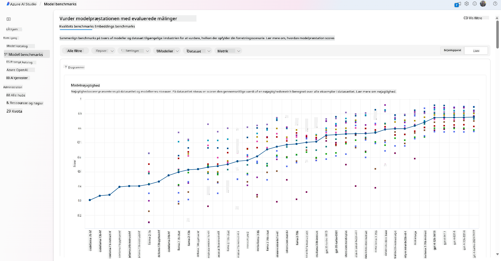
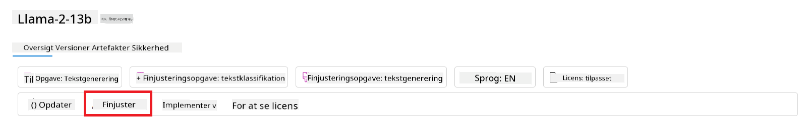
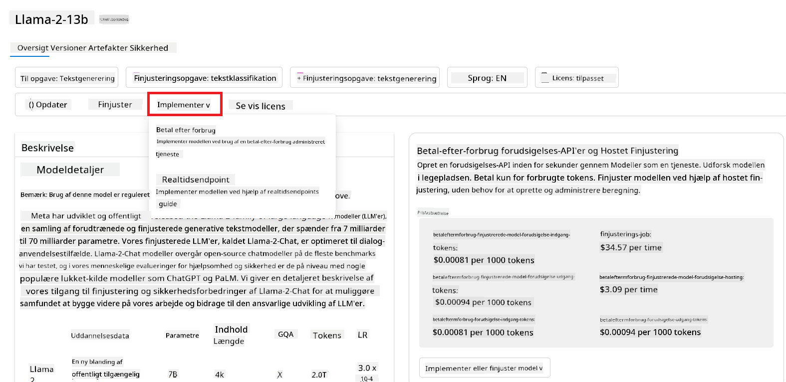
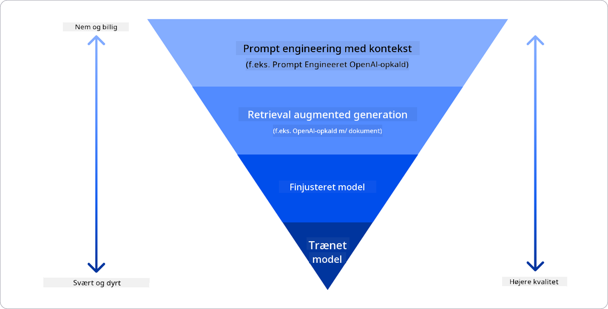

<!--
CO_OP_TRANSLATOR_METADATA:
{
  "original_hash": "e2f686f2eb794941761252ac5e8e090b",
  "translation_date": "2025-05-19T14:05:40+00:00",
  "source_file": "02-exploring-and-comparing-different-llms/README.md",
  "language_code": "da"
}
-->
# Udforskning og sammenligning af forskellige LLM'er

> _Klik på billedet ovenfor for at se videoen af denne lektion_

I den forrige lektion har vi set, hvordan Generativ AI ændrer teknologiens landskab, hvordan Store Sproglige Modeller (LLM'er) fungerer, og hvordan en virksomhed - som vores startup - kan anvende dem til deres brugsscenarier og vokse! I dette kapitel vil vi sammenligne og kontrastere forskellige typer af store sproglige modeller (LLM'er) for at forstå deres fordele og ulemper.

Det næste skridt i vores startup's rejse er at udforske det nuværende landskab af LLM'er og forstå, hvilke der er egnede til vores brugsscenarie.

## Introduktion

Denne lektion vil dække:

- Forskellige typer af LLM'er i det nuværende landskab.
- Test, iterering og sammenligning af forskellige modeller til dit brugsscenarie i Azure.
- Hvordan man implementerer en LLM.

## Læringsmål

Efter at have gennemført denne lektion vil du kunne:

- Vælge den rigtige model til dit brugsscenarie.
- Forstå, hvordan man tester, itererer og forbedrer modellens ydeevne.
- Vide, hvordan virksomheder implementerer modeller.

## Forstå forskellige typer af LLM'er

LLM'er kan have flere kategoriseringer baseret på deres arkitektur, træningsdata og brugsscenarie. At forstå disse forskelle vil hjælpe vores startup med at vælge den rigtige model til scenariet og forstå, hvordan man tester, itererer og forbedrer ydeevnen.

Der er mange forskellige typer af LLM-modeller, dit valg af model afhænger af, hvad du sigter mod at bruge dem til, dine data, hvor meget du er villig til at betale og mere.

Afhængigt af om du sigter mod at bruge modellerne til tekst, lyd, video, billedgenerering osv., kan du vælge en anden type model.

- **Lyd- og talegenkendelse**. Til dette formål er Whisper-type modeller et godt valg, da de er alsidige og rettet mod talegenkendelse. De er trænet på diverse lyd og kan udføre flersproget talegenkendelse. Læs mere om [Whisper type modeller her](https://platform.openai.com/docs/models/whisper?WT.mc_id=academic-105485-koreyst).

- **Billedgenerering**. Til billedgenerering er DALL-E og Midjourney to meget kendte valg. DALL-E tilbydes af Azure OpenAI. [Læs mere om DALL-E her](https://platform.openai.com/docs/models/dall-e?WT.mc_id=academic-105485-koreyst) og også i kapitel 9 af denne læseplan.

- **Tekstgenerering**. De fleste modeller er trænet til tekstgenerering, og du har et stort udvalg fra GPT-3.5 til GPT-4. De kommer til forskellige priser, hvor GPT-4 er den dyreste. Det er værd at undersøge [Azure OpenAI playground](https://oai.azure.com/portal/playground?WT.mc_id=academic-105485-koreyst) for at evaluere, hvilke modeller der bedst passer til dine behov i forhold til kapacitet og omkostninger.

- **Multi-modalitet**. Hvis du ønsker at håndtere flere typer data i input og output, kan du overveje modeller som [gpt-4 turbo med vision eller gpt-4o](https://learn.microsoft.com/azure/ai-services/openai/concepts/models#gpt-4-and-gpt-4-turbo-models?WT.mc_id=academic-105485-koreyst) - de nyeste udgivelser af OpenAI modeller - som er i stand til at kombinere naturlig sprogbehandling med visuel forståelse, hvilket muliggør interaktioner gennem multi-modale grænseflader.

Valg af en model betyder, at du får nogle grundlæggende kapaciteter, som dog måske ikke er tilstrækkelige. Ofte har du virksomhedsspecifikke data, som du på en eller anden måde skal fortælle LLM'en om. Der er et par forskellige valg om, hvordan man nærmer sig det, mere om det i de kommende afsnit.

### Foundation Models versus LLM'er

Begrebet Foundation Model blev [skabt af Stanford forskere](https://arxiv.org/abs/2108.07258?WT.mc_id=academic-105485-koreyst) og defineret som en AI-model, der følger nogle kriterier, såsom:

- **De er trænet ved hjælp af usuperviseret læring eller selv-superviseret læring**, hvilket betyder, at de er trænet på ulabeleret multi-modal data, og de kræver ikke menneskelig annotering eller labeling af data til deres træningsproces.
- **De er meget store modeller**, baseret på meget dybe neurale netværk trænet på milliarder af parametre.
- **De er normalt beregnet til at tjene som en 'foundation' for andre modeller**, hvilket betyder, at de kan bruges som udgangspunkt for andre modeller, der skal bygges ovenpå, hvilket kan gøres ved finjustering.

For yderligere at klarlægge denne forskel, lad os tage ChatGPT som et eksempel. For at bygge den første version af ChatGPT, blev en model kaldet GPT-3.5 brugt som foundation model. Dette betyder, at OpenAI brugte nogle chat-specifikke data til at skabe en finjusteret version af GPT-3.5, der var specialiseret i at præstere godt i samtalescenarier, såsom chatbots.

### Open Source versus Proprietære Modeller

En anden måde at kategorisere LLM'er på er, om de er open source eller proprietære.

Open source modeller er modeller, der gøres tilgængelige for offentligheden og kan bruges af alle. De gøres ofte tilgængelige af den virksomhed, der skabte dem, eller af forskningsfællesskabet. Disse modeller kan inspiceres, ændres og tilpasses til de forskellige brugsscenarier i LLM'er. De er dog ikke altid optimeret til produktionsbrug og kan muligvis ikke præstere lige så godt som proprietære modeller. Plus, finansiering til open source modeller kan være begrænset, og de vedligeholdes muligvis ikke på lang sigt eller opdateres med den nyeste forskning. Eksempler på populære open source modeller inkluderer [Alpaca](https://crfm.stanford.edu/2023/03/13/alpaca.html?WT.mc_id=academic-105485-koreyst), [Bloom](https://huggingface.co/bigscience/bloom) og [LLaMA](https://llama.meta.com).

Proprietære modeller er modeller, der ejes af en virksomhed og ikke gøres tilgængelige for offentligheden. Disse modeller er ofte optimeret til produktionsbrug. De er dog ikke tilladt at blive inspiceret, ændret eller tilpasset til forskellige brugsscenarier. Plus, de er ikke altid tilgængelige gratis og kan kræve abonnement eller betaling for at bruge. Brugerne har heller ikke kontrol over de data, der bruges til at træne modellen, hvilket betyder, at de skal stole på, at modelens ejer sikrer forpligtelse til databeskyttelse og ansvarlig brug af AI. Eksempler på populære proprietære modeller inkluderer [OpenAI modeller](https://platform.openai.com/docs/models/overview?WT.mc_id=academic-105485-koreyst), [Google Bard](https://sapling.ai/llm/bard?WT.mc_id=academic-105485-koreyst) eller [Claude 2](https://www.anthropic.com/index/claude-2?WT.mc_id=academic-105485-koreyst).

### Embedding versus Billedgenerering versus Tekst- og kodegenerering

LLM'er kan også kategoriseres efter det output, de genererer.

Embeddings er et sæt modeller, der kan konvertere tekst til en numerisk form, kaldet embedding, som er en numerisk repræsentation af inputteksten. Embeddings gør det lettere for maskiner at forstå forholdet mellem ord eller sætninger og kan bruges som input af andre modeller, såsom klassifikationsmodeller eller klynge-modeller, der har bedre ydeevne på numeriske data. Embedding modeller bruges ofte til transfer learning, hvor en model bygges til en surrogatopgave, for hvilken der er en overflod af data, og derefter genbruges modelvægt (embeddings) til andre nedstrøms opgaver. Et eksempel på denne kategori er [OpenAI embeddings](https://platform.openai.com/docs/models/embeddings?WT.mc_id=academic-105485-koreyst).

Billedgenereringsmodeller er modeller, der genererer billeder. Disse modeller bruges ofte til billedredigering, billedsyntese og billedoversættelse. Billedgenereringsmodeller er ofte trænet på store datasæt af billeder, såsom [LAION-5B](https://laion.ai/blog/laion-5b/?WT.mc_id=academic-105485-koreyst), og kan bruges til at generere nye billeder eller til at redigere eksisterende billeder med inpainting, superopløsning og farvningsteknikker. Eksempler inkluderer [DALL-E-3](https://openai.com/dall-e-3?WT.mc_id=academic-105485-koreyst) og [Stable Diffusion modeller](https://github.com/Stability-AI/StableDiffusion?WT.mc_id=academic-105485-koreyst).

Tekst- og kodegenereringsmodeller er modeller, der genererer tekst eller kode. Disse modeller bruges ofte til tekstopsummering, oversættelse og spørgsmål-svar. Tekstgenereringsmodeller er ofte trænet på store datasæt af tekst, såsom [BookCorpus](https://www.cv-foundation.org/openaccess/content_iccv_2015/html/Zhu_Aligning_Books_and_ICCV_2015_paper.html?WT.mc_id=academic-105485-koreyst), og kan bruges til at generere ny tekst eller til at besvare spørgsmål. Kodegenereringsmodeller, som [CodeParrot](https://huggingface.co/codeparrot?WT.mc_id=academic-105485-koreyst), er ofte trænet på store datasæt af kode, såsom GitHub, og kan bruges til at generere ny kode eller til at rette fejl i eksisterende kode.

### Encoder-Decoder versus Kun-Decoder

For at tale om de forskellige typer af arkitekturer af LLM'er, lad os bruge en analogi.

Forestil dig, at din chef gav dig en opgave med at skrive en quiz til eleverne. Du har to kolleger; den ene har ansvaret for at skabe indholdet, og den anden har ansvaret for at gennemgå dem.

Indholdsskaberen er som en Kun-Decoder model, de kan se på emnet og se, hvad du allerede har skrevet, og derefter kan han skrive et kursus baseret på det. De er meget gode til at skrive engagerende og informative indhold, men de er ikke meget gode til at forstå emnet og læringsmålene. Nogle eksempler på Decoder modeller er GPT-familie modeller, såsom GPT-3.

Gennemgiveren er som en Kun-Encoder model, de ser på det skrevne kursus og svarene, bemærker forholdet mellem dem og forstår konteksten, men de er ikke gode til at generere indhold. Et eksempel på Kun-Encoder model ville være BERT.

Forestil dig, at vi også kunne have nogen, der både kunne skabe og gennemgå quizzen, dette er en Encoder-Decoder model. Nogle eksempler ville være BART og T5.

### Service versus Model

Lad os nu tale om forskellen mellem en service og en model. En service er et produkt, der tilbydes af en Cloud Service Provider, og er ofte en kombination af modeller, data og andre komponenter. En model er den centrale komponent i en service og er ofte en foundation model, såsom en LLM.

Services er ofte optimeret til produktionsbrug og er ofte lettere at bruge end modeller, via en grafisk brugergrænseflade. Dog er services ikke altid tilgængelige gratis og kan kræve abonnement eller betaling for at bruge, i bytte for at udnytte serviceejerens udstyr og ressourcer, optimere udgifter og skalere nemt. Et eksempel på en service er [Azure OpenAI Service](https://learn.microsoft.com/azure/ai-services/openai/overview?WT.mc_id=academic-105485-koreyst), som tilbyder en pay-as-you-go rate plan, hvilket betyder, at brugere bliver opkrævet proportionalt med, hvor meget de bruger servicen. Desuden tilbyder Azure OpenAI Service sikkerhed i virksomhedsklasse og en ansvarlig AI-ramme ovenpå modellernes kapaciteter.

Modeller er bare Neurale Netværk, med parametrene, vægtene og andre. Dette tillader virksomheder at køre lokalt, men kræver, at de køber udstyr, bygger en struktur til skalering og køber en licens eller bruger en open source model. En model som LLaMA er tilgængelig til brug, hvilket kræver computerkraft til at køre modellen.

## Hvordan man tester og itererer med forskellige modeller for at forstå ydeevne på Azure

Når vores team har udforsket det nuværende LLM-landskab og identificeret nogle gode kandidater til deres scenarier, er det næste skridt at teste dem på deres data og deres arbejdsbyrde. Dette er en iterativ proces, udført ved eksperimenter og målinger.
De fleste af de modeller, vi nævnte i tidligere afsnit (OpenAI modeller, open source modeller som Llama2 og Hugging Face transformers) er tilgængelige i [Model Catalog](https://learn.microsoft.com/azure/ai-studio/how-to/model-catalog-overview?WT.mc_id=academic-105485-koreyst) i [Azure AI Studio](https://ai.azure.com/?WT.mc_id=academic-105485-koreyst).

[Azure AI Studio](https://learn.microsoft.com/azure/ai-studio/what-is-ai-studio?WT.mc_id=academic-105485-koreyst) er en Cloud Platform designet til udviklere til at bygge generative AI-applikationer og administrere hele udviklingslivscyklussen - fra eksperimentering til evaluering - ved at kombinere alle Azure AI-tjenester i et enkelt hub med en praktisk GUI. Modelkataloget i Azure AI Studio gør det muligt for brugeren at:

- Finde Foundation Modellen af interesse i kataloget - enten proprietær eller open source, filtrering efter opgave, licens eller navn. For at forbedre søgbarheden er modellerne organiseret i samlinger, såsom Azure OpenAI samling, Hugging Face samling og mere.

- Gennemgå modelkortet, inklusive en detaljeret beskrivelse af det tilsigtede brug og træningsdata, kodeeksempler og evalueringsresultater i det interne evalueringsbibliotek.
- Sammenlign benchmarks på tværs af modeller og datasæt tilgængelige i branchen for at vurdere, hvilken der opfylder forretningsscenariet, gennem [Model Benchmarks](https://learn.microsoft.com/azure/ai-studio/how-to/model-benchmarks?WT.mc_id=academic-105485-koreyst) panelet.

- Finjuster modellen på brugerdefinerede træningsdata for at forbedre modellens ydeevne i en specifik arbejdsbyrde, ved at udnytte eksperimenterings- og sporingsfunktionerne i Azure AI Studio.

- Udrul den originale fortrænede model eller den finjusterede version til en fjern realtids inferens - administreret beregning - eller serverløs api-endpoint - [betal-efter-forbrug](https://learn.microsoft.com/azure/ai-studio/how-to/model-catalog-overview#model-deployment-managed-compute-and-serverless-api-pay-as-you-go?WT.mc_id=academic-105485-koreyst) - for at gøre det muligt for applikationer at anvende den.

> [!NOTE]
> Ikke alle modeller i kataloget er i øjeblikket tilgængelige for finjustering og/eller betal-efter-forbrug udrulning. Tjek modelkortet for detaljer om modellens kapaciteter og begrænsninger.

## Forbedring af LLM resultater

Vi har udforsket med vores startup-team forskellige slags LLM'er og en Cloud Platform (Azure Machine Learning), der giver os mulighed for at sammenligne forskellige modeller, evaluere dem på testdata, forbedre ydeevnen og udrulle dem på inferensendepunkter.

Men hvornår skal de overveje at finjustere en model i stedet for at bruge en fortrænet? Er der andre tilgange til at forbedre modellens ydeevne på specifikke arbejdsbyrder?

Der er flere tilgange en virksomhed kan bruge til at opnå de resultater, de har brug for fra en LLM. Du kan vælge forskellige typer modeller med forskellige grader af træning, når du udruller en LLM i produktion, med forskellige niveauer af kompleksitet, omkostninger og kvalitet. Her er nogle forskellige tilgange:

- **Prompt engineering med kontekst**. Ideen er at give nok kontekst, når du prompt, for at sikre, at du får de svar, du har brug for.

- **Retrieval Augmented Generation, RAG**. Dine data kan eksistere i en database eller web-endpoint for eksempel, for at sikre, at disse data, eller en delmængde af dem, er inkluderet på tidspunktet for prompten, kan du hente de relevante data og gøre dem til en del af brugerens prompt.

- **Finjusteret model**. Her træner du modellen yderligere på dine egne data, hvilket fører til, at modellen bliver mere præcis og lydhør over for dine behov, men det kan være dyrt.

Billedkilde: [Four Ways that Enterprises Deploy LLMs | Fiddler AI Blog](https://www.fiddler.ai/blog/four-ways-that-enterprises-deploy-llms?WT.mc_id=academic-105485-koreyst)

### Prompt Engineering med kontekst

Fortrænede LLM'er fungerer meget godt på generelle opgaver inden for naturligt sprog, selv ved at kalde dem med en kort prompt, som en sætning der skal fuldføres eller et spørgsmål – det såkaldte "zero-shot" læring.

Men jo mere brugeren kan rammesætte deres forespørgsel med en detaljeret anmodning og eksempler – konteksten – desto mere præcis og tættere på brugerens forventninger vil svaret være. I dette tilfælde taler vi om "one-shot" læring, hvis prompten kun inkluderer et eksempel, og "few-shot" læring, hvis den inkluderer flere eksempler. Prompt engineering med kontekst er den mest omkostningseffektive tilgang at starte med.

### Retrieval Augmented Generation (RAG)

LLM'er har den begrænsning, at de kun kan bruge de data, der er blevet brugt under deres træning, til at generere et svar. Dette betyder, at de ikke ved noget om de fakta, der skete efter deres træningsproces, og de kan ikke få adgang til ikke-offentlig information (som virksomhedsdata). Dette kan overkommes gennem RAG, en teknik, der udvider prompten med eksterne data i form af dokumentbrudstykker, under hensyntagen til promptens længdegrænser. Dette understøttes af vektordatabaseværktøjer (som [Azure Vector Search](https://learn.microsoft.com/azure/search/vector-search-overview?WT.mc_id=academic-105485-koreyst)), der henter de nyttige brudstykker fra forskellige foruddefinerede datakilder og tilføjer dem til promptens kontekst.

Denne teknik er meget nyttig, når en virksomhed ikke har nok data, nok tid eller ressourcer til at finjustere en LLM, men stadig ønsker at forbedre ydeevnen på en specifik arbejdsbyrde og reducere risici for fabrikationer, dvs. forvanskning af virkeligheden eller skadeligt indhold.

### Finjusteret model

Finjustering er en proces, der udnytter transfer learning til at 'tilpasse' modellen til en nedstrøms opgave eller til at løse et specifikt problem. I modsætning til få-shot læring og RAG resulterer det i en ny model, der genereres, med opdaterede vægte og biaser. Det kræver et sæt af træningseksempler bestående af en enkelt input (prompten) og dens tilknyttede output (fuldførelsen). Dette ville være den foretrukne tilgang, hvis:

- **Brug af finjusterede modeller**. En virksomhed ønsker at bruge finjusterede mindre kapable modeller (som indlejringsmodeller) i stedet for højtydende modeller, hvilket resulterer i en mere omkostningseffektiv og hurtig løsning.

- **Overvejelse af latenstid**. Latenstid er vigtig for en specifik brugssag, så det er ikke muligt at bruge meget lange prompts eller det antal eksempler, der skal læres fra modellen, passer ikke med promptens længdegrænse.

- **At holde sig opdateret**. En virksomhed har en masse data af høj kvalitet og grundlæggende sandhedsmærker og de ressourcer, der kræves for at vedligeholde disse data opdateret over tid.

### Trænet model

Træning af en LLM fra bunden er uden tvivl den mest vanskelige og mest komplekse tilgang at adoptere, der kræver massive mængder data, dygtige ressourcer og passende computerkraft. Denne mulighed bør kun overvejes i et scenarie, hvor en virksomhed har en domænespecifik brugssag og en stor mængde domænecentriske data.

## Videnstjek

Hvad kunne være en god tilgang til at forbedre LLM fuldførelsesresultater?

1. Prompt engineering med kontekst
1. RAG
1. Finjusteret model

A:3, hvis du har tid og ressourcer og data af høj kvalitet, er finjustering den bedre mulighed for at holde sig opdateret. Men hvis du kigger på at forbedre tingene, og du mangler tid, er det værd at overveje RAG først.

## 🚀 Udfordring

Læs mere om, hvordan du kan [bruge RAG](https://learn.microsoft.com/azure/search/retrieval-augmented-generation-overview?WT.mc_id=academic-105485-koreyst) til din virksomhed.

## Godt arbejde, fortsæt din læring

Efter at have gennemført denne lektion, tjek vores [Generative AI Learning collection](https://aka.ms/genai-collection?WT.mc_id=academic-105485-koreyst) for at fortsætte med at forbedre din viden om Generative AI!

Gå videre til Lektion 3, hvor vi vil se på, hvordan man [bygger med Generative AI ansvarligt](../03-using-generative-ai-responsibly/README.md?WT.mc_id=academic-105485-koreyst)!

**Ansvarsfraskrivelse**:  
Dette dokument er blevet oversat ved hjælp af AI-oversættelsestjenesten [Co-op Translator](https://github.com/Azure/co-op-translator). Selvom vi bestræber os på at sikre nøjagtighed, bedes du være opmærksom på, at automatiserede oversættelser kan indeholde fejl eller unøjagtigheder. Det originale dokument på dets oprindelige sprog bør betragtes som den autoritative kilde. For kritisk information anbefales professionel menneskelig oversættelse. Vi er ikke ansvarlige for misforståelser eller fejltolkninger, der måtte opstå som følge af brugen af denne oversættelse.